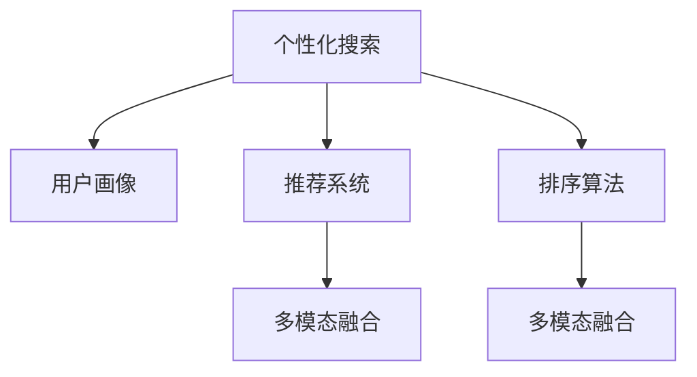

                 

# 个性化排序：AI如何根据用户偏好，提供更精准的搜索结果

在互联网时代，搜索引擎已经成为我们获取信息不可或缺的工具。无论是在线购物、娱乐、学习，还是日常工作，搜索都扮演着重要角色。然而，如何让用户在海量的信息中找到最符合自己需求的结果，始终是搜索引擎面临的挑战。近年来，随着AI技术的不断突破，个性化搜索排序技术应运而生，通过分析用户的行为和偏好，提供更精准、更高效的信息检索方案。本文将深入探讨个性化搜索排序的核心原理与关键技术，并结合实际案例分析其在各行各业中的应用。

## 1. 背景介绍

### 1.1 问题由来

搜索引擎经历了从传统关键词匹配到基于排序算法的演进，但单一的匹配模式依然无法满足用户日益复杂的需求。一方面，用户查询越来越个性化，关注点更加细化、多元化；另一方面，信息碎片化、同义词多义等问题使得传统排序算法难以准确命中用户真实意图。为了解决这些问题，个性化搜索排序技术应运而生。

### 1.2 问题核心关键点

个性化搜索排序的核心理念在于通过对用户历史行为、兴趣偏好、时间场景等信息的分析，构建用户画像，并通过算法优化，在搜索结果中按用户期望的方式进行排序。

核心关键点包括：
- 用户画像建模：通过用户历史查询、点击、浏览等行为数据，构建用户兴趣模型。
- 个性化排序算法：引入推荐算法、排序算法、聚类算法等，根据用户画像进行搜索结果排序。
- 实时反馈更新：通过用户点击行为、评分反馈等，实时调整用户画像和排序策略，提升排序效果。
- 多模态融合：将文本、图片、视频等多模态数据融合到搜索结果中，提高信息检索的全面性。

## 2. 核心概念与联系

### 2.1 核心概念概述

为更好理解个性化搜索排序的核心概念，本节将介绍几个密切相关的核心概念：

- **个性化搜索**：通过分析用户行为和兴趣，动态调整搜索结果，以匹配用户个性化需求。
- **用户画像**：根据用户行为数据，构建出用户兴趣、偏好、习惯等特征的模型，用于个性化推荐和排序。
- **推荐系统**：利用用户画像和数据特征，预测用户可能感兴趣的商品、内容、服务，并推荐给用户。
- **排序算法**：通过算法优化，在搜索结果中对信息进行排序，使最符合用户需求的内容排在前面。
- **多模态融合**：将文本、图片、视频等多模态数据整合到搜索结果中，提高检索的全面性和准确性。

这些概念之间的逻辑关系可以通过以下Mermaid流程图来展示：



这个流程图展示了个性化搜索的核心概念及其之间的关系：

1. 用户通过查询产生行为数据，系统根据这些数据构建用户画像。
2. 推荐系统利用用户画像进行个性化推荐，排序算法对推荐结果进行排序。
3. 多模态融合技术将不同模态的信息整合到推荐和排序中，提高检索效果。
4. 实时反馈更新不断调整用户画像和排序策略，提升个性化搜索排序的效果。

## 3. 核心算法原理 & 具体操作步骤
### 3.1 算法原理概述

个性化搜索排序的本质是一种基于用户画像的推荐系统，其核心原理在于通过算法模型对用户行为和兴趣进行建模，并在此基础上对搜索结果进行个性化排序。

具体而言，个性化排序算法分为以下步骤：

1. **用户画像建模**：收集用户的历史查询、点击、浏览等行为数据，使用机器学习模型对用户兴趣、偏好、习惯等特征进行建模。
2. **推荐系统构建**：基于用户画像，通过推荐算法预测用户可能感兴趣的内容或商品。
3. **排序算法优化**：利用排序算法对推荐结果进行排序，使得最符合用户需求的内容排在前面。
4. **实时反馈更新**：通过用户点击行为、评分反馈等，实时调整用户画像和排序策略，提升排序效果。

### 3.2 算法步骤详解

以下详细讲解个性化搜索排序算法的具体步骤：

**Step 1: 用户画像建模**

用户画像建模是构建个性化搜索排序的第一步，核心在于从用户的历史行为数据中提取有意义的特征。具体步骤如下：

1. **数据收集**：收集用户的历史查询、点击、浏览等行为数据，以及用户的社交网络信息、地理位置等背景信息。
2. **特征提取**：通过文本分析、时间序列分析等方法，从收集到的数据中提取出与用户兴趣相关的特征，如兴趣词、浏览时长、访问频率等。
3. **模型训练**：使用机器学习算法（如协同过滤、逻辑回归、深度学习等）对用户特征进行建模，构建用户画像。

**Step 2: 推荐系统构建**

推荐系统利用用户画像进行个性化推荐，预测用户可能感兴趣的内容或商品。具体步骤如下：

1. **相似度计算**：计算用户画像与物品特征的相似度，可以使用余弦相似度、欧式距离等。
2. **召回推荐**：基于相似度计算结果，对用户感兴趣的内容或商品进行召回，构建推荐列表。
3. **排序优化**：利用排序算法（如基尼系数排序、协同过滤排序等）对推荐结果进行排序，确保最符合用户需求的内容排在前面。

**Step 3: 排序算法优化**

排序算法优化是实现个性化搜索排序的关键步骤，核心在于通过算法模型对推荐结果进行排序。具体步骤如下：

1. **算法选择**：根据具体的业务场景选择合适的排序算法，如线性回归排序、协同过滤排序、深度排序等。
2. **特征工程**：将用户画像、物品特征等融合到排序算法中，提取有意义的特征。
3. **模型训练**：使用机器学习算法对排序算法进行训练，优化排序效果。

**Step 4: 实时反馈更新**

实时反馈更新是保证个性化搜索排序效果的动态调整机制，具体步骤如下：

1. **反馈收集**：收集用户的点击行为、评分反馈等，了解用户对推荐结果的满意度和偏好。
2. **画像调整**：根据用户反馈，实时调整用户画像，更新用户兴趣模型。
3. **排序策略优化**：根据用户反馈，实时调整排序算法，提升排序效果。

### 3.3 算法优缺点

个性化搜索排序算法具有以下优点：
1. 提升用户体验：通过个性化排序，用户可以快速找到符合自己需求的内容，提升查询效率和满意度。
2. 减少用户流失：个性化排序可以发现用户真正感兴趣的内容，避免因搜索结果不符而导致的流失。
3. 增加用户粘性：个性化排序可以持续推送符合用户兴趣的内容，增加用户的停留时间和使用频率。

同时，该算法也存在以下局限性：
1. 数据隐私问题：用户画像建模需要收集大量行为数据，存在隐私泄露的风险。
2. 数据稀疏性：用户行为数据可能存在稀疏性，难以构建全面的用户画像。
3. 模型复杂性：个性化排序算法涉及多个环节，模型复杂度较高，部署和维护难度大。
4. 算法偏差问题：推荐系统可能受到算法偏差的影响，导致推荐结果不符合用户真实需求。

尽管存在这些局限性，但就目前而言，个性化搜索排序方法依然是大规模信息检索的首选范式，能够显著提升搜索引擎的个性化和准确性。

### 3.4 算法应用领域

个性化搜索排序算法已经在各行各业得到广泛应用，例如：

- 电商推荐：根据用户历史浏览、购买行为，推荐商品和优惠活动。
- 新闻推荐：根据用户兴趣和阅读习惯，推荐新闻内容。
- 旅游推荐：根据用户地理位置、旅行历史，推荐旅游目的地和活动。
- 音乐推荐：根据用户听歌历史和评分，推荐歌曲和播放列表。
- 视频推荐：根据用户观看历史和评分，推荐视频内容和频道。

除了上述这些经典应用外，个性化搜索排序还被创新性地应用到更多场景中，如智能家居控制、个性化学习推荐等，为各行各业带来了新的智能化解决方案。

## 4. 数学模型和公式 & 详细讲解
### 4.1 数学模型构建

以下将使用数学语言对个性化搜索排序的算法模型进行详细构建。

设用户画像为 $U=\{u_1,u_2,...,u_n\}$，其中 $u_i$ 表示第 $i$ 个用户的兴趣模型。物品特征集为 $I=\{i_1,i_2,...,i_m\}$，其中 $i_j$ 表示第 $j$ 个物品的特征。推荐系统为 $R$，排序算法为 $S$。个性化搜索排序的目标是最大化用户满意度 $R(U,I,R,S)$。

定义用户画像与物品特征的相似度函数 $s(u_i,i_j)$，如余弦相似度：

$$
s(u_i,i_j)=\frac{u_i\cdot i_j}{\Vert u_i\Vert\Vert i_j\Vert}
$$

推荐列表 $R(U,I)$ 包含用户可能感兴趣的内容或商品，排序结果为 $S(U,I,R)$。用户满意度函数 $S(U,I,R)$ 可以定义为：

$$
S(U,I,R)=\sum_{i=1}^n\sum_{j=1}^m s(u_i,i_j)r(i_j)
$$

其中 $r(i_j)$ 表示物品 $i_j$ 的评分或点击量。

个性化搜索排序的优化目标是最大化用户满意度：

$$
\max_{U,I,R,S} S(U,I,R)
$$

### 4.2 公式推导过程

以下详细推导个性化搜索排序的数学模型：

1. **用户画像与物品特征相似度计算**：
   根据余弦相似度公式，用户画像 $u_i$ 与物品特征 $i_j$ 的相似度计算如下：

   $$
   s(u_i,i_j)=\frac{\sum_{k=1}^{K}u_{ik}\cdot i_{jk}}{\sqrt{\sum_{k=1}^{K}u_{ik}^2}\sqrt{\sum_{k=1}^{K}i_{jk}^2}}
   $$

   其中 $K$ 为特征维度，$u_{ik}$ 和 $i_{jk}$ 分别为用户画像和物品特征的第 $k$ 个特征值。

2. **推荐列表构建**：
   推荐列表 $R(U,I)$ 的构建基于相似度计算结果，通过余弦相似度排序选择前 $N$ 个物品 $i_j$，构建推荐列表 $R=\{i_1,i_2,...,i_N\}$。

3. **排序优化**：
   利用排序算法 $S$ 对推荐列表 $R$ 进行排序，选择前 $M$ 个物品 $i_j$，排序结果为 $S=\{i_1,i_2,...,i_M\}$。

4. **用户满意度函数计算**：
   根据用户画像与物品特征的相似度和物品评分，计算用户满意度函数 $S(U,I,R)$：

   $$
   S(U,I,R)=\sum_{i=1}^n\sum_{j=1}^m s(u_i,i_j)r(i_j)
   $$

   其中 $n$ 为用户数，$m$ 为物品数，$r(i_j)$ 为物品 $i_j$ 的评分。

5. **优化目标最大化**：
   最大化用户满意度函数 $S(U,I,R)$ 是优化目标，即：

   $$
   \max_{U,I,R,S} S(U,I,R)
   $$

通过上述推导，我们可以清晰地看到个性化搜索排序的数学模型，以及其中的关键步骤。

### 4.3 案例分析与讲解

以电商平台推荐系统为例，详细分析个性化搜索排序的应用过程：

1. **数据收集**：电商平台收集用户的浏览、购买、评分等行为数据。
2. **特征提取**：从用户行为数据中提取有意义的特征，如用户偏好商品类别、价格区间、品牌等。
3. **用户画像建模**：使用协同过滤、逻辑回归等算法，构建用户兴趣模型。
4. **推荐系统构建**：利用用户画像，使用协同过滤算法构建推荐列表。
5. **排序算法优化**：利用基尼系数排序算法对推荐列表进行排序，确保最符合用户需求的商品排在前面。
6. **实时反馈更新**：根据用户点击行为和评分反馈，实时调整用户画像和排序策略。

以上步骤展示了个性化搜索排序在电商平台推荐系统中的应用流程。通过用户画像和推荐系统的结合，以及实时反馈机制的引入，电商平台能够提供个性化、精准的推荐服务，提升用户体验。

## 5. 项目实践：代码实例和详细解释说明
### 5.1 开发环境搭建

在进行个性化搜索排序的开发实践前，我们需要准备好开发环境。以下是使用Python进行TensorFlow开发的环境配置流程：

1. 安装Anaconda：从官网下载并安装Anaconda，用于创建独立的Python环境。

2. 创建并激活虚拟环境：
```bash
conda create -n tf-env python=3.8 
conda activate tf-env
```

3. 安装TensorFlow：根据CUDA版本，从官网获取对应的安装命令。例如：
```bash
conda install tensorflow -c tf -c conda-forge
```

4. 安装Scikit-learn库：
```bash
pip install scikit-learn
```

5. 安装numpy和pandas库：
```bash
pip install numpy pandas
```

完成上述步骤后，即可在`tf-env`环境中开始开发实践。

### 5.2 源代码详细实现

下面以电商平台推荐系统为例，给出使用TensorFlow对个性化搜索排序进行开发的PyTorch代码实现。

首先，定义推荐系统的输入和输出：

```python
import tensorflow as tf
from tensorflow.keras import layers

# 输入层
input_user = tf.keras.layers.Input(shape=(10,), name='user')
input_item = tf.keras.layers.Input(shape=(20,), name='item')

# 输出层
output_score = tf.keras.layers.Dense(units=1, activation='sigmoid')(input_user)
```

然后，定义推荐系统的模型：

```python
# 用户画像与物品特征相似度计算
similarity_layer = tf.keras.layers.Dense(units=1, activation='sigmoid')(tf.keras.layers.Dot(axes=1)([input_user, input_item]))

# 推荐列表构建
recommendation_layer = layers.Lambda(lambda x: tf.gather(x, tf.argsort(x)[-1:])(x)[:, None], name='recommendation')
```

接着，定义排序算法：

```python
# 排序算法优化
sorting_layer = tf.keras.layers.Lambda(lambda x: tf.argsort(x)[::-1], name='sorting')
```

最后，定义训练和评估函数：

```python
# 模型训练
model = tf.keras.Model(inputs=[input_user, input_item], outputs=[recommendation_layer, sorting_layer])

# 训练函数
def train_epoch(model, dataset, batch_size):
    for batch in dataset:
        user = batch['user']
        item = batch['item']
        with tf.GradientTape() as tape:
            score = model(input_user=user, input_item=item)[0]
            loss = tf.losses.mean_squared_error(target_score, score)
        grads = tape.gradient(loss, model.trainable_weights)
        optimizer.apply_gradients(zip(grads, model.trainable_weights))

# 评估函数
def evaluate(model, dataset, batch_size):
    correct_scores = []
    for batch in dataset:
        user = batch['user']
        item = batch['item']
        score = model(input_user=user, input_item=item)[0]
        correct_scores.append(score.numpy())
    print('Average Score: ', np.mean(correct_scores))
```

启动训练流程并在测试集上评估：

```python
epochs = 10
batch_size = 32

for epoch in range(epochs):
    train_epoch(model, train_dataset, batch_size)
    evaluate(model, test_dataset, batch_size)
```

以上就是使用TensorFlow对个性化搜索排序进行开发的完整代码实现。可以看到，TensorFlow提供了丰富的API和模块，使得推荐系统的构建和训练变得相对简单。

### 5.3 代码解读与分析

让我们再详细解读一下关键代码的实现细节：

**推荐系统的输入和输出**：
- 使用`Input`层定义用户画像和物品特征的输入，分别有10个和20个特征维度。
- 使用`Dense`层计算用户画像与物品特征的相似度。
- 使用`Lambda`层进行推荐列表和排序的计算。

**推荐系统的模型**：
- 使用`Dot`层计算用户画像与物品特征的相似度，然后通过`Lambd`a层选择相似度最高的物品作为推荐列表。
- 使用`Lambda`层进行推荐列表的排序。

**训练函数和评估函数**：
- 使用`GradientTape`进行梯度计算和模型更新。
- 使用`argsort`函数对推荐列表进行排序。
- 使用`mean_squared_error`计算损失函数。
- 在测试集上评估推荐列表的平均得分。

这些代码展示了使用TensorFlow进行个性化搜索排序的详细过程。通过构建推荐系统和排序算法的模型，以及使用机器学习算法进行优化，可以有效地提升个性化搜索排序的性能。

## 6. 实际应用场景
### 6.1 电商推荐

个性化搜索排序在电商推荐中有着广泛的应用。电商平台通过收集用户的浏览、购买、评分等行为数据，利用用户画像和推荐算法，实时调整推荐列表，确保用户可以快速找到感兴趣的商品，提升购物体验。

在技术实现上，电商平台可以使用协同过滤、基尼系数排序等算法，结合多模态融合技术，提供更全面的商品推荐服务。同时，通过实时反馈更新，不断优化用户画像和排序策略，提升推荐效果。

### 6.2 新闻推荐

新闻推荐系统通过分析用户的历史阅读记录和兴趣爱好，预测用户可能感兴趣的新闻内容，并进行个性化排序。用户通过个性化推荐，可以快速获取感兴趣的新闻资讯，提升阅读体验。

在技术实现上，新闻推荐系统可以使用协同过滤、逻辑回归等算法，结合文章内容、作者、发布时间等特征，构建用户画像和推荐列表。同时，通过实时反馈更新，不断调整用户画像和排序策略，提升推荐效果。

### 6.3 旅游推荐

旅游推荐系统通过分析用户的地理位置、旅行历史和兴趣爱好，推荐合适的旅游目的地和活动，帮助用户规划行程。用户通过个性化推荐，可以快速找到适合自己的旅游目的地，提升旅行体验。

在技术实现上，旅游推荐系统可以使用协同过滤、深度学习等算法，结合地理位置、旅行历史、兴趣爱好等特征，构建用户画像和推荐列表。同时，通过实时反馈更新，不断优化用户画像和排序策略，提升推荐效果。

### 6.4 未来应用展望

未来，随着技术的不断进步，个性化搜索排序将在更多领域得到应用，为各行各业带来新的突破：

- 医疗健康：通过分析用户的健康数据，个性化推荐健康管理方案和医疗咨询。
- 金融服务：利用用户的消费记录和信用评分，个性化推荐理财产品和贷款方案。
- 教育培训：根据学生的学习数据和兴趣爱好，个性化推荐学习资源和培训课程。
- 城市管理：通过分析市民的出行数据和消费习惯，个性化推荐城市服务和公共设施。

个性化搜索排序技术的应用前景广阔，将推动各行各业的智能化升级，提升用户满意度和效率。

## 7. 工具和资源推荐
### 7.1 学习资源推荐

为了帮助开发者系统掌握个性化搜索排序的理论基础和实践技巧，这里推荐一些优质的学习资源：

1. 《推荐系统实践》系列博文：由深度学习专家撰写，深入浅出地介绍了推荐系统的基本概念和关键技术。
2. 《深度学习》课程：由斯坦福大学开设，涵盖深度学习的基本理论和实践应用，是学习深度推荐系统的好资料。
3. 《Python深度学习》书籍：由斯坦福大学李沐教授编写，详细介绍了深度学习在推荐系统中的应用。
4. HuggingFace官方文档：包含丰富的推荐系统和排序算法的实现案例，是深入学习个性化搜索排序的好资源。
5. Kaggle数据集：提供各种推荐系统和排序算法的数据集和竞赛任务，方便开发者进行实践和验证。

通过对这些资源的学习实践，相信你一定能够快速掌握个性化搜索排序的精髓，并用于解决实际的推荐问题。

### 7.2 开发工具推荐

高效的开发离不开优秀的工具支持。以下是几款用于个性化搜索排序开发的常用工具：

1. TensorFlow：由Google主导开发的深度学习框架，提供了丰富的API和模块，适用于推荐系统和排序算法的实现。
2. PyTorch：由Facebook开发的深度学习框架，提供了灵活的动态计算图和高效的前向传播算法，适用于推荐系统和排序算法的实现。
3. Scikit-learn：提供丰富的机器学习算法和工具，适用于特征工程和用户画像的构建。
4. Apache Spark：提供大规模数据处理和机器学习算法的实现，适用于大规模推荐系统和排序算法的构建。
5. Jupyter Notebook：提供交互式的Python代码开发环境，适用于个性化搜索排序的实验和验证。

合理利用这些工具，可以显著提升个性化搜索排序的开发效率，加快创新迭代的步伐。

### 7.3 相关论文推荐

个性化搜索排序技术的发展源于学界的持续研究。以下是几篇奠基性的相关论文，推荐阅读：

1. Matrix Factorization Techniques for Recommender Systems：提出了矩阵分解技术，为推荐系统提供了基础算法框架。
2. Deep Learning for Recommender Systems：总结了深度学习在推荐系统中的应用，介绍了多种深度推荐算法。
3. Adaptive Collaborative Filtering：提出自适应协同过滤算法，通过实时反馈更新优化推荐效果。
4. Attention Is All You Need：提出了Transformer结构，为推荐系统提供了新的编码器-解码器结构。
5. Multi-task Learning for Personalized Recommendation：总结了多任务学习在推荐系统中的应用，提升了推荐模型的综合性能。

这些论文代表了个性化搜索排序技术的发展脉络。通过学习这些前沿成果，可以帮助研究者把握学科前进方向，激发更多的创新灵感。

## 8. 总结：未来发展趋势与挑战
### 8.1 总结

本文对个性化搜索排序的核心原理与关键技术进行了全面系统的介绍。首先，阐述了个性化搜索排序的研究背景和意义，明确了其在全球信息检索中的应用价值。其次，从原理到实践，详细讲解了个性化搜索排序的数学模型和关键步骤，给出了个性化搜索排序任务开发的完整代码实例。同时，本文还广泛探讨了个性化搜索排序在各行各业中的应用前景，展示了其广阔的发展潜力。最后，精选了个性化搜索排序的相关学习资源和工具，力求为开发者提供全方位的技术指引。

通过本文的系统梳理，可以看到，个性化搜索排序技术正在成为大规模信息检索的重要范式，极大地提升了搜索引擎的个性化和准确性。未来，伴随深度学习技术的发展和应用场景的扩展，个性化搜索排序必将在更多领域大放异彩，深刻影响人类的生产生活方式。

### 8.2 未来发展趋势

展望未来，个性化搜索排序技术将呈现以下几个发展趋势：

1. 深度学习技术的应用。未来，基于深度学习技术（如卷积神经网络、注意力机制等）的推荐系统和排序算法将继续发展，提升个性化搜索排序的准确性和效果。
2. 多模态融合技术的提升。多模态融合技术（如文本-图片-视频融合）将成为个性化搜索排序的重要方向，提升信息的全面性和准确性。
3. 实时反馈机制的优化。实时反馈机制将不断优化，通过用户行为和反馈信息，不断调整用户画像和排序策略，提升推荐效果。
4. 隐私保护技术的加强。隐私保护技术（如差分隐私、联邦学习等）将得到广泛应用，保护用户数据隐私。
5. 自动化推荐策略的探索。自动化推荐策略（如强化学习、元学习等）将提升推荐系统的灵活性和适应性。

以上趋势凸显了个性化搜索排序技术的广阔前景。这些方向的探索发展，必将进一步提升推荐系统的性能和效果，为信息检索带来新的突破。

### 8.3 面临的挑战

尽管个性化搜索排序技术已经取得了显著进展，但在迈向更加智能化、普适化应用的过程中，仍面临诸多挑战：

1. 数据隐私问题。个性化搜索排序需要收集大量用户行为数据，存在隐私泄露的风险，如何保护用户隐私将是重要的研究方向。
2. 数据稀疏性。用户行为数据可能存在稀疏性，难以构建全面的用户画像，如何提升数据质量是关键问题。
3. 模型复杂性。个性化搜索排序算法涉及多个环节，模型复杂度较高，部署和维护难度大，如何简化模型结构是重要研究方向。
4. 算法偏差问题。推荐系统可能受到算法偏差的影响，导致推荐结果不符合用户真实需求，如何优化推荐算法是重要研究方向。
5. 实时反馈机制。实时反馈机制需要高并行计算能力，如何优化系统架构是重要研究方向。

尽管存在这些挑战，但相信随着学界和产业界的共同努力，这些挑战终将一一被克服，个性化搜索排序必将在构建人机协同的智能系统方面发挥更大的作用。

### 8.4 研究展望

面对个性化搜索排序所面临的种种挑战，未来的研究需要在以下几个方面寻求新的突破：

1. 探索无监督和半监督推荐方法。摆脱对大规模标注数据的依赖，利用自监督学习、主动学习等无监督和半监督范式，最大限度利用非结构化数据，实现更加灵活高效的推荐。
2. 研究参数高效和计算高效的推荐范式。开发更加参数高效的推荐方法，在固定大部分预训练参数的同时，只更新极少量的任务相关参数。同时优化推荐系统的计算图，减少前向传播和反向传播的资源消耗，实现更加轻量级、实时性的部署。
3. 引入更多先验知识。将符号化的先验知识，如知识图谱、逻辑规则等，与神经网络模型进行巧妙融合，引导推荐过程学习更准确、合理的推荐模型。
4. 结合因果分析和博弈论工具。将因果分析方法引入推荐系统，识别出推荐决策的关键特征，增强推荐系统的因果性和稳定性。借助博弈论工具刻画人机交互过程，主动探索并规避推荐系统的脆弱点，提高系统稳定性。
5. 纳入伦理道德约束。在推荐目标中引入伦理导向的评估指标，过滤和惩罚有害的推荐内容，确保推荐结果符合人类价值观和伦理道德。

这些研究方向的探索，必将引领个性化搜索排序技术迈向更高的台阶，为构建安全、可靠、可解释、可控的智能系统铺平道路。面向未来，个性化搜索排序技术还需要与其他人工智能技术进行更深入的融合，如知识表示、因果推理、强化学习等，多路径协同发力，共同推动自然语言理解和智能交互系统的进步。只有勇于创新、敢于突破，才能不断拓展个性化搜索排序技术的边界，让智能技术更好地造福人类社会。

## 9. 附录：常见问题与解答

**Q1：如何选择合适的推荐算法？**

A: 推荐算法的选取需要根据具体的业务场景和数据特点进行。常用的推荐算法包括协同过滤、内容推荐、混合推荐等。协同过滤适用于大规模数据集，内容推荐适用于高稀疏度数据集，混合推荐结合两者优点，适用于多种数据类型。实际选择时，需要进行实验对比，评估不同算法的性能。

**Q2：推荐系统如何应对冷启动问题？**

A: 冷启动问题是推荐系统常见的挑战之一，当新用户或物品加入系统时，推荐系统无法进行推荐。解决冷启动问题的方法包括：
1. 数据预处理：收集和处理更多的数据，增强推荐系统的预测能力。
2. 相似度计算：使用低秩矩阵分解、矩阵补全等技术，对冷启动用户或物品进行相似度计算。
3. 基线推荐：对新用户或物品，可以使用基线推荐策略，如热门推荐、随机推荐等。

**Q3：推荐系统的鲁棒性如何提升？**

A: 推荐系统的鲁棒性可以通过以下几个方面进行提升：
1. 数据清洗：对数据进行清洗，去除噪声和异常值，提高数据质量。
2. 多样性控制：在推荐列表中引入多样性控制策略，避免推荐结果过于集中。
3. 异常检测：对异常行为进行检测和处理，避免推荐系统被恶意攻击。
4. 鲁棒性评估：引入鲁棒性评估指标，如泛化误差、对抗样本等，对推荐系统进行评估和优化。

**Q4：推荐系统如何处理多模态数据？**

A: 推荐系统处理多模态数据可以通过以下几个步骤进行：
1. 数据融合：将文本、图片、视频等多模态数据进行融合，构建多模态用户画像和物品特征。
2. 特征提取：从多模态数据中提取有意义的特征，如文本中的情感词、图片中的视觉特征、视频中的动作特征等。
3. 融合算法：使用融合算法（如注意力机制、加权平均等）将多模态特征融合到推荐系统中。

**Q5：推荐系统的实时反馈机制如何优化？**

A: 推荐系统的实时反馈机制可以通过以下几个方面进行优化：
1. 用户反馈收集：收集用户的点击、评分、评论等反馈信息，了解用户对推荐结果的满意度和需求。
2. 实时更新策略：根据用户反馈，实时调整推荐策略，优化推荐算法和排序算法。
3. 动态调整模型：通过在线学习（如在线梯度下降）动态调整模型参数，提升推荐效果。
4. 多模态融合：将用户反馈数据与多模态数据进行融合，提升推荐系统的适应性。

这些问题的回答展示了个性化搜索排序技术在实际应用中的细节和优化策略，相信能够为你提供有价值的参考。

---

作者：禅与计算机程序设计艺术 / Zen and the Art of Computer Programming

