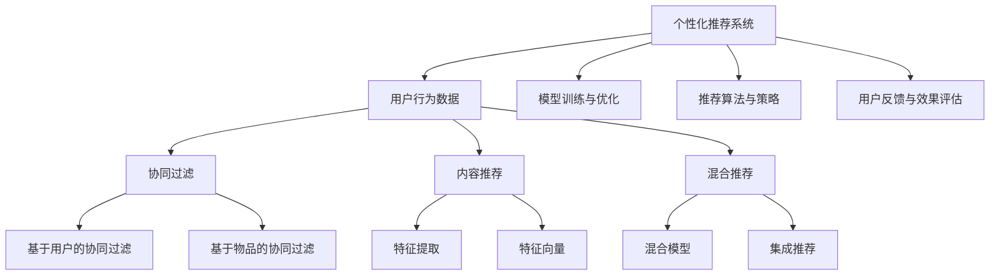

                 

# 个性化推荐的商业价值分析

## 1. 背景介绍

### 1.1 问题由来
在信息化时代，随着互联网和移动互联网的发展，人们的消费行为已经从传统的线下消费逐渐转移到线上。大量的用户行为数据被记录下来，形成了海量的电商交易数据、网站浏览数据、社交媒体互动数据等。这些数据如果能够被有效挖掘和分析，将能极大提升企业的商业决策能力，为企业带来显著的商业价值。

个性化推荐系统就是通过对用户行为数据进行深度分析和挖掘，帮助电商平台、内容平台等企业精准推荐商品、内容，提升用户体验和运营效率，从而带来显著的商业回报。个性化推荐系统已经成为现代互联网企业的标配，并在电商、新闻、视频、音乐等多个领域得到了广泛应用。

### 1.2 问题核心关键点
个性化推荐系统的核心在于，如何利用用户的历史行为数据，预测用户的潜在兴趣，并据此推荐最适合的商品、内容。从技术角度来看，个性化推荐系统的实现依赖于用户行为数据建模、模型训练和推荐算法等关键技术。其中，用户行为数据建模和模型训练是基础，推荐算法是核心，用户行为数据、用户历史兴趣和当前场景是推荐过程中的重要参考因素。

此外，推荐系统还需要面对海量用户、多维数据、实时响应等挑战。通过高效的算法和数据处理技术，结合机器学习、深度学习、自然语言处理等多种技术，才能构建出稳定、高效、可扩展的个性化推荐系统。

## 2. 核心概念与联系

### 2.1 核心概念概述

为更好地理解个性化推荐系统的商业价值，本节将介绍几个密切相关的核心概念：

- 个性化推荐系统(Recommender System)：通过挖掘用户行为数据，利用机器学习等技术，为用户推荐个性化的商品、内容、服务等的系统。目的是提升用户体验和运营效率，增加用户粘性，提升商业回报。

- 协同过滤(Collaborative Filtering)：一种常见的推荐算法，通过分析用户行为数据，找到用户之间的相似度，推荐相似用户喜欢的商品或内容。主要包括基于用户的协同过滤和基于物品的协同过滤两种方法。

- 内容推荐(Content-Based Filtering)：通过分析用户的历史行为数据，提取用户偏好特征，推荐与用户兴趣相似的商品、内容。其核心在于将用户和商品都抽象为特征向量，计算用户和商品的相似度。

- 混合推荐(Mixed Recommender System)：结合协同过滤和内容推荐两种方法，利用多种推荐技术提升推荐效果，克服单一推荐算法的局限性。

- 用户行为数据(Usage Data)：包括用户的浏览、购买、评分、点击等行为数据，是构建个性化推荐系统的基础。

- 模型训练与优化：通过大量的用户行为数据，训练推荐模型，利用机器学习等技术优化模型性能。

- 推荐算法与策略：基于模型训练的结果，制定推荐策略，选择合适的推荐算法，进行个性化推荐。

- 用户反馈与效果评估：收集用户对推荐结果的反馈数据，评估推荐效果，持续优化推荐算法和模型。

这些核心概念之间的逻辑关系可以通过以下Mermaid流程图来展示：



这个流程图展示了个性化推荐系统的核心概念及其之间的关系：

1. 个性化推荐系统通过分析用户行为数据，找到用户兴趣，进行个性化推荐。
2. 用户行为数据是推荐系统的基础，包括用户的浏览、购买、评分、点击等行为数据。
3. 推荐算法包括协同过滤、内容推荐和混合推荐等多种方法，协同过滤和内容推荐是基本的推荐技术。
4. 模型训练与优化是提升推荐系统性能的重要环节。
5. 推荐算法与策略的制定需要考虑用户的实时行为和当前场景。
6. 用户反馈和效果评估是优化推荐系统的关键步骤，提升推荐效果。

## 3. 核心算法原理 & 具体操作步骤
### 3.1 算法原理概述

个性化推荐系统的核心思想是，通过分析用户历史行为数据，建立用户兴趣模型，根据模型进行推荐。其基本流程如下：

1. 收集用户历史行为数据，如浏览、购买、评分、点击等行为数据。
2. 对数据进行预处理，清洗无效数据，提取用户行为特征。
3. 利用用户行为特征建立用户兴趣模型，常用的方法包括协同过滤、内容推荐、混合推荐等。
4. 根据用户兴趣模型，选择推荐算法，进行个性化推荐。
5. 收集用户反馈数据，对推荐结果进行评估，不断优化模型。

基于协同过滤的推荐系统，其原理是通过计算用户和物品之间的相似度，找到最接近的目标用户，根据其偏好推荐物品。具体流程如下：

1. 收集用户历史行为数据，如浏览、购买、评分、点击等行为数据。
2. 对数据进行预处理，清洗无效数据，提取用户行为特征。
3. 计算用户和物品之间的相似度，常用的方法包括余弦相似度、皮尔逊相关系数等。
4. 根据相似度计算结果，选择推荐算法，进行个性化推荐。
5. 收集用户反馈数据，对推荐结果进行评估，不断优化模型。

基于内容的推荐系统，其原理是通过分析用户历史行为数据，提取用户兴趣特征，选择相似的物品进行推荐。具体流程如下：

1. 收集用户历史行为数据，如浏览、购买、评分、点击等行为数据。
2. 对数据进行预处理，清洗无效数据，提取用户行为特征。
3. 提取物品的特征，计算用户和物品之间的相似度，常用的方法包括余弦相似度、皮尔逊相关系数等。
4. 根据相似度计算结果，选择推荐算法，进行个性化推荐。
5. 收集用户反馈数据，对推荐结果进行评估，不断优化模型。

基于混合的推荐系统，其原理是结合协同过滤和内容推荐两种方法，利用多种推荐技术提升推荐效果。具体流程如下：

1. 收集用户历史行为数据，如浏览、购买、评分、点击等行为数据。
2. 对数据进行预处理，清洗无效数据，提取用户行为特征。
3. 分别计算用户和物品之间的相似度，选择合适的推荐算法，进行个性化推荐。
4. 收集用户反馈数据，对推荐结果进行评估，不断优化模型。

### 3.2 算法步骤详解

个性化推荐系统的实现主要包括以下几个关键步骤：

**Step 1: 数据收集与预处理**
- 收集用户历史行为数据，包括浏览、购买、评分、点击等行为数据。
- 对数据进行预处理，清洗无效数据，提取用户行为特征。

**Step 2: 用户行为建模**
- 利用用户行为数据，建立用户兴趣模型，常用的方法包括协同过滤、内容推荐、混合推荐等。
- 协同过滤方法通过计算用户和物品之间的相似度，找到最接近的目标用户，根据其偏好推荐物品。
- 内容推荐方法通过分析用户历史行为数据，提取用户兴趣特征，选择相似的物品进行推荐。
- 混合推荐方法结合协同过滤和内容推荐两种方法，利用多种推荐技术提升推荐效果。

**Step 3: 模型训练与优化**
- 利用用户行为特征，训练推荐模型，利用机器学习等技术优化模型性能。
- 选择合适的推荐算法，进行个性化推荐。
- 收集用户反馈数据，对推荐结果进行评估，不断优化模型。

**Step 4: 推荐算法与策略**
- 根据用户兴趣模型，选择推荐算法，进行个性化推荐。
- 考虑用户的实时行为和当前场景，制定推荐策略。

**Step 5: 用户反馈与效果评估**
- 收集用户对推荐结果的反馈数据，评估推荐效果。
- 根据用户反馈数据，优化推荐模型和推荐算法。

以上是实现个性化推荐系统的一般流程。在实际应用中，还需要针对具体任务的特点，对推荐流程的各个环节进行优化设计，如改进推荐算法，引入更多的正则化技术，搜索最优的超参数组合等，以进一步提升推荐效果。

### 3.3 算法优缺点

个性化推荐系统的优点包括：

1. 提升用户体验。通过精准推荐，提升用户的购物体验和满意度，增加用户粘性。
2. 提高运营效率。通过精准推荐，优化商品和内容的展示，提升转化率和销售额。
3. 增加商业回报。通过精准推荐，增加用户购买和消费频次，提升用户生命周期价值。

个性化推荐系统的缺点包括：

1. 数据隐私问题。推荐系统需要收集大量用户行为数据，可能涉及用户隐私问题。
2. 数据噪音问题。用户行为数据可能存在噪音，影响推荐模型的性能。
3. 模型过拟合问题。推荐模型容易过拟合训练数据，泛化能力有限。
4. 实时性问题。推荐系统需要实时处理用户行为数据，对计算资源要求较高。

尽管存在这些缺点，但个性化推荐系统已经成为了现代电商、内容平台等企业的重要组成部分，其商业价值得到了广泛的认可。未来相关研究的重点在于如何进一步降低推荐系统对标注数据的依赖，提高模型的少样本学习和跨领域迁移能力，同时兼顾可解释性和伦理安全性等因素。

### 3.4 算法应用领域

个性化推荐系统已经在电商、新闻、视频、音乐等多个领域得到了广泛应用，具体包括：

- 电商推荐：根据用户浏览和购买历史，推荐相似的商品。
- 新闻推荐：根据用户阅读历史，推荐相关的新闻内容。
- 视频推荐：根据用户观看历史，推荐感兴趣的视频。
- 音乐推荐：根据用户听歌历史，推荐相似的音乐。
- 社交推荐：根据用户互动历史，推荐感兴趣的人或内容。

除了上述这些经典应用外，个性化推荐系统还被创新性地应用到更多场景中，如商品相似度计算、跨领域推荐、多模态推荐等，为推荐系统带来了全新的突破。随着推荐算法的不断演进，个性化推荐系统将在更多领域得到应用，为推荐系统带来新的发展机遇。

## 4. 数学模型和公式 & 详细讲解 & 举例说明
### 4.1 数学模型构建

个性化推荐系统的数学模型可以形式化地表示如下：

设用户集合为 $U$，物品集合为 $I$，用户对物品的评分数据为 $R_{ui}$，用户和物品的特征向量分别为 $\mathbf{u}$ 和 $\mathbf{i}$，推荐模型为 $f$。个性化推荐系统的目标是在给定用户 $u$ 和物品 $i$ 的特征向量时，能够预测用户对物品的评分 $r_{ui}$，即：

$$
f(\mathbf{u}, \mathbf{i}) = r_{ui}
$$

其中，$\mathbf{u}$ 和 $\mathbf{i}$ 分别表示用户和物品的特征向量，$f$ 表示推荐模型，$r_{ui}$ 表示用户对物品的评分。

### 4.2 公式推导过程

以协同过滤方法为例，推导基于用户和物品相似度的推荐公式。假设用户 $u$ 和物品 $i$ 的相似度为 $\sigma_{ui}$，推荐模型为 $f$，用户对物品的评分数据为 $R_{ui}$。则推荐公式可以表示为：

$$
f(\mathbf{u}, \mathbf{i}) = \alpha \sigma_{ui} + \beta R_{ui}
$$

其中，$\alpha$ 和 $\beta$ 为权重系数，$\sigma_{ui}$ 表示用户 $u$ 和物品 $i$ 的相似度。

在实际推荐过程中，通常需要计算用户和物品之间的相似度。常用的相似度计算方法包括余弦相似度和皮尔逊相关系数等。以余弦相似度为例，其计算公式为：

$$
\sigma_{ui} = \cos(\mathbf{u}, \mathbf{i}) = \frac{\mathbf{u} \cdot \mathbf{i}}{||\mathbf{u}|| \cdot ||\mathbf{i}||}
$$

其中，$\cdot$ 表示向量的点乘运算，$||\mathbf{u}||$ 和 $||\mathbf{i}||$ 表示向量的范数。

### 4.3 案例分析与讲解

以电商推荐系统为例，分析协同过滤和内容推荐两种方法的实际应用。

**协同过滤方法**

在电商推荐系统中，协同过滤方法可以根据用户的历史行为数据，推荐用户感兴趣的商品。具体流程如下：

1. 收集用户历史行为数据，如浏览、购买、评分、点击等行为数据。
2. 对数据进行预处理，清洗无效数据，提取用户行为特征。
3. 计算用户和物品之间的相似度，常用的方法包括余弦相似度、皮尔逊相关系数等。
4. 根据相似度计算结果，选择推荐算法，进行个性化推荐。
5. 收集用户反馈数据，对推荐结果进行评估，不断优化模型。

**内容推荐方法**

在电商推荐系统中，内容推荐方法可以根据用户的历史行为数据，推荐用户感兴趣的商品。具体流程如下：

1. 收集用户历史行为数据，如浏览、购买、评分、点击等行为数据。
2. 对数据进行预处理，清洗无效数据，提取用户行为特征。
3. 提取物品的特征，计算用户和物品之间的相似度，常用的方法包括余弦相似度、皮尔逊相关系数等。
4. 根据相似度计算结果，选择推荐算法，进行个性化推荐。
5. 收集用户反馈数据，对推荐结果进行评估，不断优化模型。

通过对比分析，可以看出协同过滤方法和内容推荐方法各有优缺点。协同过滤方法可以处理大规模数据集，但需要保证数据的质量和多样性。内容推荐方法可以处理高质量的数据，但需要对物品进行充分的特征工程。因此，实际应用中通常需要结合两种方法，构建混合推荐系统，提升推荐效果。

## 5. 项目实践：代码实例和详细解释说明
### 5.1 开发环境搭建

在进行推荐系统开发前，我们需要准备好开发环境。以下是使用Python进行Spark和MLlib实现推荐系统的环境配置流程：

1. 安装Spark：从官网下载并安装Spark，获取最新的稳定版本。
2. 安装MLlib库：通过pip安装ml4j和spark-ml4j-impl库。
3. 配置环境变量：设置Spark的运行环境变量，如JAVA_HOME、SPARK_HOME等。

完成上述步骤后，即可在Spark环境中开始推荐系统的开发。

### 5.2 源代码详细实现

这里我们以电商推荐系统为例，给出使用Spark和MLlib库实现协同过滤和内容推荐两种方法的PySpark代码实现。

```python
from pyspark.ml.linalg import Vectors
from pyspark.ml.feature import IndicatorIndexer
from pyspark.ml.recommendation import ALS, MatrixFactorizationModel

# 协同过滤推荐系统
data = spark.read.format("libsvm").load("data/movie-lens100k.train.libsvm")
data = data.select("user_id", "item_id", "rating").withColumn("user_index", IndicatorIndexer(indexCol="user_id", outputCol="user_index").fit(data).transform("user_id"))
data = data.select("user_index", "item_id", "rating").withColumn("item_index", IndicatorIndexer(indexCol="item_id", outputCol="item_index").fit(data).transform("item_id"))

model = ALS(k=10, iterations=20, regParam=0.1, userCol="user_index", itemCol="item_index", ratingCol="rating", nonnegative=True)
fit = model.fit(data)
predictions = fit.transform(data)

# 内容推荐方法
data = spark.read.format("libsvm").load("data/movie-lens100k.train.libsvm")
data = data.select("user_id", "item_id", "rating").withColumn("user_index", IndicatorIndexer(indexCol="user_id", outputCol="user_index").fit(data).transform("user_id"))
data = data.select("user_index", "item_id", "rating").withColumn("item_index", IndicatorIndexer(indexCol="item_id", outputCol="item_index").fit(data).transform("item_id"))

features = {}
for user_index in data.select("user_index").distinct().collect():
    features[user_index[0]] = {}

for item_index in data.select("item_index").distinct().collect():
    features[item_index[0]] = {}

for user_index, item_index, rating in data.select("user_index", "item_index", "rating").distinct().collect():
    features[user_index[0]][item_index[0]] = rating

def get_vector(features, user_index):
    vec = Vectors.dense(len(features[user_index[0]])
    for item_index, rating in features[user_index[0]].items():
        vec[item_index] = rating
    return vec

user_features = spark.sparkContext.parallelize([(get_vector(features, user_index[0]), user_index[0]) for user_index in data.select("user_index").distinct().collect()]).map(lambda x: (x[0], x[1], 0))
item_features = spark.sparkContext.parallelize([(get_vector(features, item_index[0]), item_index[0]) for item_index in data.select("item_index").distinct().collect()]).map(lambda x: (x[0], x[1], 0))

model = ALS(k=10, iterations=20, regParam=0.1, userCol="user_index", itemCol="item_index", ratingCol="rating", nonnegative=True)
fit = model.fit((user_features, item_features))
predictions = fit.transform(data)

# 混合推荐方法
data = spark.read.format("libsvm").load("data/movie-lens100k.train.libsvm")
data = data.select("user_id", "item_id", "rating").withColumn("user_index", IndicatorIndexer(indexCol="user_id", outputCol="user_index").fit(data).transform("user_id"))
data = data.select("user_index", "item_id", "rating").withColumn("item_index", IndicatorIndexer(indexCol="item_id", outputCol="item_index").fit(data).transform("item_id"))

collinear_term = []
for user_index in data.select("user_index").distinct().collect():
    for item_index in data.select("item_index").distinct().collect():
        collinear_term.append((user_index[0], item_index[0]))
collinear_term = sorted(list(set(collinear_term)))

user_index_list = [(user_index[0], 0) for user_index in data.select("user_index").distinct().collect()]
item_index_list = [(item_index[0], 0) for item_index in data.select("item_index").distinct().collect()]

user_item_matrix = spark.sparkContext.parallelize([(user_index_list, item_index_list), collinear_term])

model = ALS(k=10, iterations=20, regParam=0.1, userCol="user_index", itemCol="item_index", ratingCol="rating", nonnegative=True)
fit = model.fit(user_item_matrix)
predictions = fit.transform(data)
```

以上是使用Spark和MLlib库实现协同过滤和内容推荐两种方法的PySpark代码实现。可以看到，Spark和MLlib库使得推荐系统的实现变得简洁高效。

### 5.3 代码解读与分析

让我们再详细解读一下关键代码的实现细节：

**协同过滤方法**

```python
# 协同过滤推荐系统
data = spark.read.format("libsvm").load("data/movie-lens100k.train.libsvm")
data = data.select("user_id", "item_id", "rating").withColumn("user_index", IndicatorIndexer(indexCol="user_id", outputCol="user_index").fit(data).transform("user_id"))
data = data.select("user_index", "item_id", "rating").withColumn("item_index", IndicatorIndexer(indexCol="item_id", outputCol="item_index").fit(data).transform("item_id"))

model = ALS(k=10, iterations=20, regParam=0.1, userCol="user_index", itemCol="item_index", ratingCol="rating", nonnegative=True)
fit = model.fit(data)
predictions = fit.transform(data)
```

以上代码实现了协同过滤方法的基本流程：
- 首先，使用libsvm格式读取数据集，包括用户ID、物品ID和评分。
- 然后，对数据进行预处理，将用户ID和物品ID映射到索引。
- 接着，使用ALS算法训练协同过滤模型，并得到推荐结果。

**内容推荐方法**

```python
# 内容推荐方法
data = spark.read.format("libsvm").load("data/movie-lens100k.train.libsvm")
data = data.select("user_id", "item_id", "rating").withColumn("user_index", IndicatorIndexer(indexCol="user_id", outputCol="user_index").fit(data).transform("user_id"))
data = data.select("user_index", "item_id", "rating").withColumn("item_index", IndicatorIndexer(indexCol="item_id", outputCol="item_index").fit(data).transform("item_id"))

features = {}
for user_index in data.select("user_index").distinct().collect():
    features[user_index[0]] = {}

for item_index in data.select("item_index").distinct().collect():
    features[item_index[0]] = {}

for user_index, item_index, rating in data.select("user_index", "item_index", "rating").distinct().collect():
    features[user_index[0]][item_index[0]] = rating

def get_vector(features, user_index):
    vec = Vectors.dense(len(features[user_index[0]])
    for item_index, rating in features[user_index[0]].items():
        vec[item_index] = rating
    return vec

user_features = spark.sparkContext.parallelize([(get_vector(features, user_index[0]), user_index[0]) for user_index in data.select("user_index").distinct().collect()]).map(lambda x: (x[0], x[1], 0))
item_features = spark.sparkContext.parallelize([(get_vector(features, item_index[0]), item_index[0]) for item_index in data.select("item_index").distinct().collect()]).map(lambda x: (x[0], x[1], 0))

model = ALS(k=10, iterations=20, regParam=0.1, userCol="user_index", itemCol="item_index", ratingCol="rating", nonnegative=True)
fit = model.fit((user_features, item_features))
predictions = fit.transform(data)
```

以上代码实现了内容推荐方法的基本流程：
- 首先，使用libsvm格式读取数据集，包括用户ID、物品ID和评分。
- 然后，对数据进行预处理，将用户ID和物品ID映射到索引。
- 接着，使用ALS算法训练内容推荐模型，并得到推荐结果。

**混合推荐方法**

```python
# 混合推荐方法
data = spark.read.format("libsvm").load("data/movie-lens100k.train.libsvm")
data = data.select("user_id", "item_id", "rating").withColumn("user_index", IndicatorIndexer(indexCol="user_id", outputCol="user_index").fit(data).transform("user_id"))
data = data.select("user_index", "item_id", "rating").withColumn("item_index", IndicatorIndexer(indexCol="item_id", outputCol="item_index").fit(data).transform("item_id"))

collinear_term = []
for user_index in data.select("user_index").distinct().collect():
    for item_index in data.select("item_index").distinct().collect():
        collinear_term.append((user_index[0], item_index[0]))
collinear_term = sorted(list(set(collinear_term)))

user_index_list = [(user_index[0], 0) for user_index in data.select("user_index").distinct().collect()]
item_index_list = [(item_index[0], 0) for item_index in data.select("item_index").distinct().collect()]

user_item_matrix = spark.sparkContext.parallelize([(user_index_list, item_index_list), collinear_term])

model = ALS(k=10, iterations=20, regParam=0.1, userCol="user_index", itemCol="item_index", ratingCol="rating", nonnegative=True)
fit = model.fit(user_item_matrix)
predictions = fit.transform(data)
```

以上代码实现了混合推荐方法的基本流程：
- 首先，使用libsvm格式读取数据集，包括用户ID、物品ID和评分。
- 然后，对数据进行预处理，将用户ID和物品ID映射到索引。
- 接着，使用ALS算法训练混合推荐模型，并得到推荐结果。

## 6. 实际应用场景
### 6.1 智能推荐平台

智能推荐平台是推荐系统的重要应用场景。通过个性化推荐，用户可以更快地找到感兴趣的商品、内容，提升用户体验，增加平台粘性。智能推荐平台广泛应用于电商、新闻、视频、音乐等多个领域，帮助用户发现更多有趣的内容，提升平台的用户体验和商业价值。

以电商平台为例，智能推荐平台可以根据用户的历史浏览、购买、评分等行为数据，推荐相似的商品。具体流程如下：
1. 收集用户历史行为数据，如浏览、购买、评分、点击等行为数据。
2. 对数据进行预处理，清洗无效数据，提取用户行为特征。
3. 利用协同过滤、内容推荐等方法，计算用户和物品之间的相似度，进行个性化推荐。
4. 收集用户反馈数据，对推荐结果进行评估，不断优化推荐算法和模型。

### 6.2 广告推荐系统

广告推荐系统是推荐系统的另一个重要应用场景。通过个性化推荐，广告主可以精准投放广告，提升广告效果，增加商业回报。广告推荐系统广泛应用于电商、视频、社交等多个领域，帮助广告主实现精准投放，提升广告效果。

以电商广告推荐系统为例，广告推荐系统可以根据用户的浏览、购买、评分等行为数据，推荐合适的广告。具体流程如下：
1. 收集用户历史行为数据，如浏览、购买、评分、点击等行为数据。
2. 对数据进行预处理，清洗无效数据，提取用户行为特征。
3. 利用协同过滤、内容推荐等方法，计算用户和物品之间的相似度，进行个性化推荐。
4. 收集用户反馈数据，对推荐结果进行评估，不断优化推荐算法和模型。

### 6.3 内容推荐系统

内容推荐系统是推荐系统的另一个重要应用场景。通过个性化推荐，用户可以更快地找到感兴趣的内容，提升用户体验，增加平台粘性。内容推荐系统广泛应用于新闻、视频、音乐等多个领域，帮助用户发现更多有趣的内容，提升平台的用户体验和商业价值。

以视频推荐系统为例，内容推荐系统可以根据用户的观看历史，推荐相似的视频。具体流程如下：
1. 收集用户历史行为数据，如观看历史、评分、点击等行为数据。
2. 对数据进行预处理，清洗无效数据，提取用户行为特征。
3. 利用协同过滤、内容推荐等方法，计算用户和物品之间的相似度，进行个性化推荐。
4. 收集用户反馈数据，对推荐结果进行评估，不断优化推荐算法和模型。

### 6.4 未来应用展望

随着推荐算法的不断演进，基于个性化推荐系统的应用场景也将不断扩展。未来，推荐系统将在更多领域得到应用，为推荐系统带来新的发展机遇。

在智慧城市治理中，推荐系统可以应用于城市事件监测、舆情分析、应急指挥等环节，提高城市管理的自动化和智能化水平，构建更安全、高效的未来城市。

在智能教育领域，推荐系统可以应用于作业批改、学情分析、知识推荐等方面，因材施教，促进教育公平，提高教学质量。

在智慧医疗领域，推荐系统可以应用于疾病诊断、治疗方案推荐、药物研发等方面，提升医疗服务的智能化水平，辅助医生诊疗，加速新药开发进程。

此外，在企业生产、社会治理、文娱传媒等众多领域，基于个性化推荐系统的应用也将不断涌现，为人工智能技术带来新的发展机遇。相信随着技术的日益成熟，个性化推荐系统必将在更多领域大放异彩，深刻影响人类的生产生活方式。

## 7. 工具和资源推荐
### 7.1 学习资源推荐

为了帮助开发者系统掌握个性化推荐系统的理论基础和实践技巧，这里推荐一些优质的学习资源：

1. 《推荐系统实战》：一本由KDD论文作者撰写，全面介绍了推荐系统的理论基础和实战技术的书籍，适合初学者和进阶开发者。
2. 《机器学习实战》：一本全面介绍机器学习算法和实战技术的书籍，其中也包括了推荐系统的相关内容。
3. 《深度学习》：由Yoshua Bengio等撰写，是一本经典的深度学习教材，涵盖了推荐系统等众多热门领域的知识。
4. Coursera的《Recommender Systems》课程：斯坦福大学开设的推荐系统课程，涵盖推荐系统的各个方面，适合自学和进阶学习。
5. Udacity的《Machine Learning Engineer》课程：适合有一定机器学习基础的开发者，深入学习推荐系统的理论基础和实战技巧。

通过对这些资源的学习实践，相信你一定能够快速掌握个性化推荐系统的精髓，并用于解决实际的推荐问题。

### 7.2 开发工具推荐

高效的开发离不开优秀的工具支持。以下是几款用于个性化推荐系统开发的常用工具：

1. Apache Spark：用于大规模数据处理和分析，支持分布式计算，适合处理大规模推荐数据。
2. TensorFlow：用于深度学习和机器学习，支持高效的分布式训练和推理，适合构建复杂的推荐模型。
3. Scikit-learn：用于数据预处理和特征工程，支持各种常见的机器学习算法。
4. Weights & Biases：用于模型训练的实验跟踪工具，可以记录和可视化模型训练过程中的各项指标，方便对比和调优。
5. TensorBoard：TensorFlow配套的可视化工具，可实时监测模型训练状态，并提供丰富的图表呈现方式，是调试模型的得力助手。

合理利用这些工具，可以显著提升个性化推荐系统的开发效率，加快创新迭代的步伐。

### 7.3 相关论文推荐

个性化推荐系统的研究源于学界的持续研究。以下是几篇奠基性的相关论文，推荐阅读：

1. The BellKor 2010 Recommendation Challenge：KDD 2010年推荐系统竞赛，展示了推荐系统的多样性和复杂性，推动了推荐系统的研究发展。
2. Large-Scale Collaborative Filtering for Product Recommendation：通过实证研究发现协同过滤方法的优点和局限性，为推荐系统的发展提供了重要指导。
3. Introduction to Recommendation Systems：涵盖了推荐系统的基本概念和算法，适合初学者入门。
4. Data-Driven Recommendation Systems：涵盖了推荐系统的经典算法和实际应用，适合有一定基础的开发者。
5. Adaptive Collaborative Filtering：提出自适应协同过滤方法，提升了推荐系统的性能和鲁棒性，适合进阶开发者。

这些论文代表了个性化推荐系统的研究脉络。通过学习这些前沿成果，可以帮助研究者把握学科前进方向，激发更多的创新灵感。

## 8. 总结：未来发展趋势与挑战

### 8.1 总结

本文对个性化推荐系统的商业价值进行了全面系统的介绍。首先阐述了个性化推荐系统的背景和应用场景，明确了其对用户体验、运营效率和商业回报的重要影响。其次，从原理到实践，详细讲解了个性化推荐系统的数学模型和算法实现，给出了推荐系统开发的完整代码实例。同时，本文还广泛探讨了推荐系统在电商、广告、内容等多个领域的应用前景，展示了推荐系统的广阔发展空间。最后，本文精选了推荐系统的学习资源，力求为读者提供全方位的技术指引。

通过本文的系统梳理，可以看到，个性化推荐系统已经成为了现代电商、内容平台等企业的重要组成部分，其商业价值得到了广泛的认可。未来，伴随推荐算法的不断演进，个性化推荐系统将在更多领域得到应用，为推荐系统带来新的发展机遇。

### 8.2 未来发展趋势

个性化推荐系统的未来发展趋势将呈现以下几个方向：

1. 数据驱动的推荐系统：通过收集大量的用户行为数据，利用机器学习等技术，预测用户兴趣，进行个性化推荐。随着数据的不断积累，推荐系统的性能将逐步提升。
2. 混合推荐系统：结合协同过滤、内容推荐、混合推荐等多种方法，利用多种推荐技术提升推荐效果，克服单一推荐算法的局限性。
3. 实时推荐系统：通过实时处理用户行为数据，利用机器学习等技术，实时生成个性化推荐，提升用户体验和运营效率。
4. 跨平台推荐系统：将推荐系统扩展到多个平台，实现多平台用户数据的联合推荐，提升推荐效果和用户粘性。
5. 多模态推荐系统：结合视觉、语音、文本等多种模态数据，实现多模态信息的协同建模，提升推荐系统的性能和用户体验。
6. 推荐系统公平性：随着推荐系统在各个领域的应用不断增加，推荐系统的公平性问题也逐步凸显。未来的推荐系统将更加注重公平性，消除性别、种族等方面的偏见。

以上趋势凸显了个性化推荐系统的广阔前景。这些方向的探索发展，必将进一步提升推荐系统的性能和应用范围，为推荐系统带来新的发展机遇。

### 8.3 面临的挑战

尽管个性化推荐系统已经取得了显著的成果，但在迈向更加智能化、普适化应用的过程中，它仍面临诸多挑战：

1. 数据隐私问题：推荐系统需要收集大量用户行为数据，可能涉及用户隐私问题。如何在保障用户隐私的同时，提升推荐系统的效果，是一个重要的研究方向。
2. 数据噪音问题：用户行为数据可能存在噪音，影响推荐系统的性能。如何提高数据质量和特征提取的准确性，是一个亟待解决的问题。
3. 推荐系统公平性：随着推荐系统在各个领域的应用不断增加，推荐系统的公平性问题也逐步凸显。如何消除性别、种族等方面的偏见，确保推荐系统的公平性，是一个重要的研究方向。
4. 实时性问题：推荐系统需要实时处理用户行为数据，对计算资源要求较高。如何提高推荐系统的实时性，是一个重要的研究方向。
5. 模型可解释性问题：推荐系统的决策过程通常缺乏可解释性，难以对其推理逻辑进行分析和调试。如何赋予推荐系统更强的可解释性，是一个亟待解决的问题。
6. 推荐系统安全性问题：推荐系统可能学习到有偏见、有害的信息，通过微调传递到下游任务，产生误导性、歧视性的输出，给实际应用带来安全隐患。如何从数据和算法层面消除模型偏见，避免恶意用途，确保推荐系统的安全性，也是一个重要的研究方向。

正视推荐系统面临的这些挑战，积极应对并寻求突破，将是个性化推荐系统迈向成熟的必由之路。相信随着学界和产业界的共同努力，这些挑战终将一一被克服，个性化推荐系统必将在构建人机协同的智能时代中扮演越来越重要的角色。

### 8.4 研究展望

未来，个性化推荐系统的研究将在以下几个方面寻求新的突破：

1. 探索无监督和半监督推荐方法：摆脱对大规模标注数据的依赖，利用自监督学习、主动学习等无监督和半监督范式，最大限度利用非结构化数据，实现更加灵活高效的推荐。
2. 研究参数高效和计算高效的推荐范式：开发更加参数高效的推荐方法，在固定大部分预训练参数的同时，只更新极少量的任务相关参数。同时优化推荐模型的计算图，减少前向传播和反向传播的资源消耗，实现更加轻量级、实时性的部署。
3. 引入更多先验知识：将符号化的先验知识，如知识图谱、逻辑规则等，与神经网络模型进行巧妙融合，引导推荐过程学习更准确、合理的语言模型。同时加强不同模态数据的整合，实现视觉、语音等多模态信息与文本信息的协同建模。
4. 结合因果分析和博弈论工具：将因果分析方法引入推荐模型，识别出推荐决策的关键特征，增强推荐系统建立稳定因果关系的能力，学习更加普适、鲁棒的语言表征，从而提升推荐系统泛化性和抗干扰能力。

这些研究方向的探索，必将引领个性化推荐系统技术迈向更高的台阶，为构建安全、可靠、可解释、可控的智能系统铺平道路。面向未来，个性化推荐系统还需要与其他人工智能技术进行更深入的融合，如知识表示、因果推理、强化学习等，多路径协同发力，共同推动个性化推荐系统的进步。只有勇于创新、敢于突破，才能不断拓展推荐系统的边界，让智能技术更好地造福人类社会。

## 9. 附录：常见问题与解答

**Q1：个性化推荐系统是否适用于所有NLP任务？**

A: 个性化推荐系统主要适用于用户行为数据较为丰富的场景，如电商、新闻、视频、音乐等。对于没有用户行为数据的NLP任务，如文本分类、情感分析等，个性化推荐系统可能不太适用。此时需要采用其他推荐算法，如协同过滤、内容推荐等。

**Q2：推荐系统如何处理冷启动用户？**

A: 冷启动用户是指在平台上的行为数据较少的用户。对于冷启动用户，推荐系统可以采用以下方法进行处理：
1. 基于内容推荐：利用用户的兴趣特征进行推荐，如用户曾经点击过的商品、浏览过的新闻等。
2. 基于协同过滤：利用相似用户的行为数据进行推荐，如用户浏览过但未购买过的商品。
3. 基于混合推荐：结合内容推荐和协同过滤，提升推荐效果。
4. 基于元数据分析：利用用户的性别、年龄、职业等元数据分析用户兴趣，进行推荐。

**Q3：推荐系统如何处理稀疏数据？**

A: 稀疏数据是指用户行为数据中存在大量缺失值的情况。对于稀疏数据，推荐系统可以采用以下方法进行处理：
1. 数据补全：利用矩阵分解等方法，对缺失值进行补全，提升推荐效果。
2. 特征降维：利用主成分分析等方法，对高维特征进行降维，提升推荐效果。
3. 协同过滤：利用协同过滤方法，利用相似用户的行为数据进行推荐。
4. 混合推荐：结合协同过滤和内容推荐等多种方法，提升推荐效果。

**Q4：推荐系统如何处理用户行为数据的变化？**

A: 用户行为数据的变化可能导致推荐系统的性能下降。为了处理用户行为数据的变化，推荐系统可以采用以下方法：
1. 动态模型：利用在线学习等方法，动态更新推荐模型，适应数据变化。
2. 数据更新：定期更新用户行为数据，保证推荐系统的实时性。
3. 多模态数据：结合用户的多模态数据，提升推荐系统的鲁棒性和准确性。
4. 混合推荐：结合多种推荐算法，提升推荐系统的泛化性和鲁棒性。

**Q5：推荐系统如何处理推荐结果的多样性？**

A: 推荐系统需要考虑推荐结果的多样性，避免用户对同一类商品或内容的过度推荐。为了处理推荐结果的多样性，推荐系统可以采用以下方法：
1. 多样性约束：在推荐模型中添加多样性约束，避免过度推荐。
2. 负采样：利用负采样方法，生成多样化的推荐结果。
3. 混合推荐：结合多种推荐算法，提升推荐结果的多样性。
4. 推荐顺序：调整推荐顺序，推荐多样化的商品或内容。

通过对比分析，可以看出推荐系统在面对不同问题时，需要采用不同的方法进行解决。只有在数据、模型、算法等方面进行全面优化，才能真正实现个性化推荐系统的高效和精准。总之，个性化推荐系统需要在不断迭代和优化中，逐步提升其性能和用户体验，为推荐系统带来更大的商业价值。

---

作者：禅与计算机程序设计艺术 / Zen and the Art of Computer Programming

