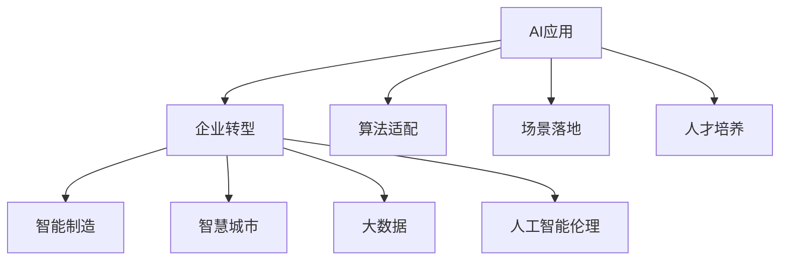

                 

# 中国企业的AI应用主义

> 关键词：AI应用,企业转型,智能制造,人工智能伦理,大数据,智慧城市

## 1. 背景介绍

### 1.1 问题由来

在当今数字化转型的大潮中，中国企业正面临着前所未有的机遇和挑战。一方面，数字化技术的快速发展为传统行业提供了全新的增长动力和创新路径；另一方面，如何在保持业务稳健运营的同时，有效运用AI技术，实现智能转型，成为众多企业的共同课题。

近年来，中国企业在AI应用上投入了大量资源，不仅在智能制造、智慧城市、金融科技等领域取得了显著进展，还在核心技术自主可控上迈出了重要一步。但与此同时，AI应用的普及与落地也暴露出一些问题：数据孤岛、技术适配、人才短缺、伦理风险等，成为制约AI技术在中国企业中广泛应用的重要障碍。

### 1.2 问题核心关键点

AI应用的核心在于数据、算法和场景的融合。对于中国企业而言，以下关键点需重点关注：

- 数据治理：确保数据的质量、安全、合规，构建统一的数据湖，打破数据孤岛，实现数据资产的价值最大化。
- 算法适配：根据企业具体业务场景选择合适的AI算法，避免“一刀切”，提高算法适配性。
- 场景落地：结合企业实际需求，设计可行的AI应用方案，确保AI技术能够真正解决业务痛点。
- 人才培养：通过内部培训、外部合作等多种方式，提升企业AI人才队伍水平，保障AI应用持续迭代升级。
- 伦理风险：在AI应用中加强隐私保护、公平性、透明度等伦理考虑，避免AI带来的潜在风险。

这些问题，既关乎技术实施，又涉及业务战略，需要通过跨部门协作、高层管理支持、全员参与等综合措施来解决。

## 2. 核心概念与联系

### 2.1 核心概念概述

在讨论AI应用主义之前，先梳理一些核心概念及其相互关系。

- **AI应用**：指将AI技术应用于实际业务场景，解决具体问题，提升业务效率和竞争力。
- **企业转型**：指通过引入AI等新兴技术，实现从传统业务模式向数字化、智能化模式的转变。
- **智能制造**：利用AI技术优化生产流程、提升产品质量、降低成本，推动制造业向智能化方向发展。
- **智慧城市**：利用AI技术提升城市管理效率、改善公共服务，构建更加智能、高效的城市环境。
- **大数据**：指海量结构化、半结构化、非结构化数据的整合与分析，为AI应用提供基础支撑。
- **人工智能伦理**：涉及AI在隐私保护、公平性、透明性等方面的考量，保障AI技术的安全、可靠应用。

这些概念之间的联系，可以通过以下Mermaid流程图来展示：



这个流程图展示了AI应用与企业转型的紧密关系：AI应用通过数据治理、算法适配、场景落地、人才培养、伦理风险等多方面工作，推动企业从传统模式向智能化方向转型。

## 3. 核心算法原理 & 具体操作步骤
### 3.1 算法原理概述

AI应用的核心在于算法的选择与应用。对于中国企业，其AI算法选择和实施过程如下：

1. **需求分析**：明确企业具体需求，如提高生产效率、优化供应链管理、提升客户体验等。
2. **算法适配**：根据需求，选择适合的具体算法，如机器学习、深度学习、自然语言处理等。
3. **数据预处理**：清洗、转换、整合数据，确保数据的质量和可用性。
4. **模型训练与调优**：使用企业数据进行模型训练，通过超参数调优提高模型效果。
5. **部署与应用**：将训练好的模型部署到生产环境中，进行实际业务测试和优化。

这一过程涉及多个环节，需跨部门协作、多次迭代，才能实现AI应用的落地。

### 3.2 算法步骤详解

以智能制造为例，详细讲解AI应用的具体实施步骤：

**Step 1: 需求分析**
- 明确企业对智能制造的具体需求，如提高生产效率、降低能耗、提升产品质量等。
- 通过问卷调查、业务访谈等方式，收集企业对AI应用的具体期望。

**Step 2: 数据准备**
- 确定所需的数据类型（如生产数据、设备数据、质量数据等）。
- 制定数据收集计划，确保数据的质量和完整性。
- 使用ETL工具进行数据清洗、转换和整合。

**Step 3: 算法选择**
- 根据需求选择合适的算法，如时间序列分析、预测模型、优化算法等。
- 对比不同算法的优劣，选择最适合的算法。

**Step 4: 模型训练与调优**
- 使用训练集进行模型训练，并通过验证集进行模型调优。
- 使用不同的超参数组合进行模型调优，选择最优模型。

**Step 5: 部署与应用**
- 将训练好的模型部署到生产环境中，进行实际业务测试。
- 根据测试结果进行模型优化，确保模型在实际应用中效果稳定可靠。

### 3.3 算法优缺点

AI应用在中国企业的实施过程中，具有以下优缺点：

**优点：**
1. **提升效率**：AI技术可以自动化处理大量重复性、低价值的任务，显著提升企业运营效率。
2. **优化决策**：AI模型可以基于历史数据和实时数据进行预测和优化，辅助管理决策。
3. **创新驱动**：AI应用推动企业技术创新和业务模式创新，保持竞争优势。

**缺点：**
1. **初始投入高**：AI应用的实施需要大量的资金、人力和技术支持，初期投入较高。
2. **数据依赖性强**：AI应用对数据的依赖性高，数据质量差可能影响模型效果。
3. **技术复杂度高**：AI算法复杂，实施过程中可能遇到技术挑战。
4. **人才短缺**：AI人才短缺是制约AI应用广泛普及的重要因素。
5. **伦理风险**：AI应用可能带来隐私保护、公平性等问题，需加强伦理考虑。

### 3.4 算法应用领域

AI应用在中国企业的多个领域中都有广泛应用，主要包括：

- **智能制造**：通过AI技术优化生产流程、提升产品质量、降低成本，推动制造业向智能化方向发展。
- **智慧城市**：利用AI技术提升城市管理效率、改善公共服务，构建更加智能、高效的城市环境。
- **金融科技**：在金融领域中，AI用于风险控制、信用评估、智能投顾等，提升金融服务的智能化水平。
- **医疗健康**：利用AI技术进行疾病预测、智能诊断、个性化治疗等，提升医疗服务的质量和效率。
- **教育培训**：通过AI技术进行智能推荐、在线评估、个性化学习等，优化教育培训效果。
- **零售电商**：在零售领域中，AI用于库存管理、精准营销、客户服务等，提升用户体验和销售效率。

## 4. 数学模型和公式 & 详细讲解  
### 4.1 数学模型构建

AI应用的数学模型构建通常涉及以下几个方面：

- **数据预处理**：将原始数据转化为模型能够处理的格式，如标准化、归一化、特征工程等。
- **模型选择**：选择合适的机器学习或深度学习模型，如线性回归、决策树、卷积神经网络等。
- **模型训练**：使用训练集进行模型训练，通过梯度下降等优化算法更新模型参数。
- **模型评估**：使用验证集或测试集评估模型性能，选择最优模型。

### 4.2 公式推导过程

以线性回归模型为例，推导其数学公式：

设有一组样本数据 $(x_i,y_i)$，其中 $x_i$ 为输入特征，$y_i$ 为输出标签。线性回归模型的目标是通过最小化预测值与真实值之间的平方误差，拟合一条最佳拟合直线。

假设拟合直线为 $y=\beta_0+\beta_1x$，则最小化损失函数的公式为：

$$
\min_{\beta_0,\beta_1} \sum_{i=1}^n (y_i-\beta_0-\beta_1x_i)^2
$$

通过求导和归并，可以得到最优解：

$$
\beta_0 = \frac{1}{n}\sum_{i=1}^n y_i - \frac{\beta_1}{n}\sum_{i=1}^n x_i
$$

$$
\beta_1 = \frac{1}{n}\sum_{i=1}^n (y_i-\overline{y})(x_i-\overline{x})
$$

其中 $\overline{x}$ 和 $\overline{y}$ 分别为特征和标签的均值。

### 4.3 案例分析与讲解

以智慧城市中的智能交通系统为例，详细讲解AI应用的数学模型构建和应用过程。

**Step 1: 数据准备**
- 收集城市交通数据，如车流量、交通信号灯状态、交通事故记录等。
- 对数据进行清洗、归一化和特征工程处理，转化为模型可用的格式。

**Step 2: 模型选择**
- 选择适合的模型，如线性回归、决策树、随机森林等。
- 根据问题特性选择最优模型，如预测车流量、优化信号灯控制等。

**Step 3: 模型训练与调优**
- 使用训练集进行模型训练，并通过验证集进行模型调优。
- 通过网格搜索等方法选择最优模型参数。

**Step 4: 部署与应用**
- 将训练好的模型部署到实际交通系统中，进行流量预测和信号灯控制优化。
- 根据实时数据和预测结果，动态调整信号灯控制策略，提升交通效率。

## 5. 项目实践：代码实例和详细解释说明
### 5.1 开发环境搭建

在进行AI应用开发前，需要准备好开发环境。以下是使用Python进行TensorFlow开发的环境配置流程：

1. 安装Anaconda：从官网下载并安装Anaconda，用于创建独立的Python环境。

2. 创建并激活虚拟环境：
```bash
conda create -n tf-env python=3.8 
conda activate tf-env
```

3. 安装TensorFlow：根据CUDA版本，从官网获取对应的安装命令。例如：
```bash
conda install tensorflow tensorflow-gpu -c conda-forge -c nvidia
```

4. 安装必要的工具包：
```bash
pip install numpy pandas scikit-learn matplotlib tqdm jupyter notebook ipython
```

完成上述步骤后，即可在`tf-env`环境中开始AI应用开发。

### 5.2 源代码详细实现

以下是一个使用TensorFlow进行线性回归模型开发的Python代码示例：

```python
import tensorflow as tf
import numpy as np
from sklearn.model_selection import train_test_split

# 数据准备
x_train = np.array([1, 2, 3, 4, 5, 6, 7, 8, 9, 10])
y_train = np.array([1, 3, 5, 7, 9, 11, 13, 15, 17, 19])
x_test = np.array([11, 12, 13, 14, 15])

# 数据拆分
x_train, x_test, y_train, y_test = train_test_split(x_train, y_train, test_size=0.2)

# 模型构建
model = tf.keras.Sequential([
    tf.keras.layers.Dense(1, input_shape=(1,))
])

# 编译模型
model.compile(optimizer=tf.keras.optimizers.SGD(learning_rate=0.01),
              loss='mean_squared_error')

# 训练模型
model.fit(x_train, y_train, epochs=100, verbose=0)

# 评估模型
model.evaluate(x_test, y_test)

# 预测
y_pred = model.predict(x_test)
```

### 5.3 代码解读与分析

让我们再详细解读一下关键代码的实现细节：

**数据准备**：
- 使用numpy创建训练集和测试集的数据。

**模型构建**：
- 使用TensorFlow的Sequential模型，定义一个简单的线性回归模型，只有一个输出节点。

**模型编译**：
- 使用SGD优化器，设置学习率为0.01，定义均方误差损失函数。

**模型训练**：
- 使用训练集进行模型训练，设置100个epoch。

**模型评估**：
- 使用测试集评估模型性能，返回均方误差。

**模型预测**：
- 使用训练好的模型进行预测，返回预测结果。

可以看到，TensorFlow的API设计简洁高效，能够快速搭建和训练模型。开发者可以通过进一步扩展模型结构、优化训练参数、使用更复杂的损失函数等手段，进一步提升模型的性能和稳定性。

## 6. 实际应用场景
### 6.1 智能制造

智能制造是AI在中国企业中应用最广泛的方向之一。AI技术通过优化生产流程、提升设备效率、预测设备故障等手段，显著提高了制造业的生产效率和产品质量。

**应用场景**：
- **预测性维护**：利用AI模型分析设备运行数据，预测设备故障，提前进行维护。
- **质量控制**：通过AI模型对生产过程进行实时监控，及时发现异常，提升产品质量。
- **供应链优化**：利用AI模型分析供应链数据，优化库存管理，降低库存成本。

**实际案例**：
- 某大型机械制造企业通过AI模型对设备运行数据进行预测性维护，显著降低了设备故障率，提高了生产效率。
- 某电子产品制造商利用AI模型进行质量控制，提升了产品良品率，减少了次品率。

### 6.2 智慧城市

智慧城市是AI在中国企业的另一个重要应用方向。通过AI技术，城市管理和服务水平得到显著提升。

**应用场景**：
- **交通管理**：利用AI模型分析交通数据，优化交通信号灯控制，减少交通拥堵。
- **公共安全**：利用AI模型分析视频监控数据，提升公共安全管理水平。
- **城市治理**：利用AI模型分析城市运行数据，提升城市治理效率。

**实际案例**：
- 某大型城市通过AI模型优化交通信号灯控制，显著减少了高峰期交通拥堵，提升了城市交通效率。
- 某智慧园区利用AI模型分析视频监控数据，提升了园区安全管理水平，保障了园区安全。

### 6.3 金融科技

金融科技是AI在金融领域的重要应用方向。通过AI技术，金融机构在风险控制、客户服务、智能投顾等方面取得了显著进展。

**应用场景**：
- **风险控制**：利用AI模型分析交易数据，预测违约风险，进行风险管理。
- **智能投顾**：利用AI模型分析市场数据，提供投资建议，提升客户体验。
- **客户服务**：利用AI模型分析客户数据，提供个性化服务，提升客户满意度。

**实际案例**：
- 某大型银行通过AI模型分析交易数据，预测违约风险，提升了风险管理水平。
- 某大型券商利用AI模型分析市场数据，提供智能投顾服务，提升了客户体验。

## 7. 工具和资源推荐
### 7.1 学习资源推荐

为了帮助开发者系统掌握AI应用的技术基础和实践技巧，这里推荐一些优质的学习资源：

1. 《TensorFlow从入门到实战》系列博文：由TensorFlow官方维护的博客，详细介绍了TensorFlow的基本用法和应用场景。

2. 《深度学习入门》课程：由李宏毅教授授课，从基本概念到实战案例，全面覆盖深度学习的核心内容。

3. 《Python数据科学手册》书籍：由Jake VanderPlas编写，详细介绍Python在数据科学中的应用，包括Numpy、Pandas、Scikit-learn等工具的使用。

4. 《TensorFlow官方文档》：TensorFlow的官方文档，提供了全面的API文档和实战示例，是学习TensorFlow的重要参考资料。

5. Kaggle平台：数据科学竞赛平台，提供了丰富的数据集和算法竞赛，是提升数据科学实践能力的好地方。

通过对这些资源的学习实践，相信你一定能够快速掌握AI应用的基本原理和实践技巧，并用于解决实际的AI问题。

### 7.2 开发工具推荐

高效的开发离不开优秀的工具支持。以下是几款用于AI应用开发的常用工具：

1. TensorFlow：由Google主导开发的开源深度学习框架，生产部署方便，适合大规模工程应用。

2. PyTorch：基于Python的开源深度学习框架，灵活动态的计算图，适合快速迭代研究。

3. Jupyter Notebook：支持Python、R等语言，可以混合使用多种工具，提供交互式编程环境。

4. Visual Studio Code：支持Python、TensorFlow等工具的IDE，提供丰富的插件和扩展，是开发常用的编辑器。

5. Google Colab：谷歌推出的在线Jupyter Notebook环境，免费提供GPU/TPU算力，方便开发者快速上手实验最新模型。

合理利用这些工具，可以显著提升AI应用开发的效率，加快创新迭代的步伐。

### 7.3 相关论文推荐

AI应用在中国企业的快速发展，得益于学界的持续研究。以下是几篇奠基性的相关论文，推荐阅读：

1. "Predicting Maintenance Intervals: A Comparative Study of Deep Learning Approaches"（预测设备维护时间：深度学习方法的对比研究）：通过比较不同深度学习模型在设备预测性维护中的应用效果，提出了一种基于LSTM的时间序列预测模型。

2. "Smart Traffic Light Control System with Deep Reinforcement Learning"（基于深度强化学习的智能交通灯控制系统）：提出了一种基于深度强化学习的交通灯控制系统，通过实时优化信号灯控制策略，显著减少了交通拥堵。

3. "A Survey on AI Applications in Manufacturing: Opportunities and Challenges"（AI在制造领域应用的综述：机遇与挑战）：详细介绍了AI在制造领域的具体应用，分析了当前面临的挑战，并提出了未来的研究方向。

4. "AI in Financial Services: Opportunities, Challenges, and Future Directions"（AI在金融服务中的应用：机遇、挑战与未来方向）：讨论了AI在金融服务中的应用场景，分析了当前面临的挑战，并提出了未来的研究方向。

这些论文代表了中国企业在AI应用领域的研究进展，为后续研究提供了重要的理论支撑和实践参考。

## 8. 总结：未来发展趋势与挑战
### 8.1 总结

本文对AI在中国企业的应用进行了全面系统的介绍。首先阐述了AI应用的核心概念与联系，明确了AI技术在中国企业中的应用方向和实际效果。其次，从原理到实践，详细讲解了AI应用的数学模型和实施步骤，给出了AI应用开发的具体代码示例。同时，本文还探讨了AI应用在智能制造、智慧城市、金融科技等领域的实际应用场景，展示了AI技术在各行各业中的广泛应用前景。

通过本文的系统梳理，可以看到，AI技术在中国企业的落地应用正在不断加速，成为推动企业数字化转型的重要力量。未来，伴随AI技术的持续进步和应用的不断深化，相信AI在中国企业中的应用将更加广泛，为经济社会发展注入新的动力。

### 8.2 未来发展趋势

展望未来，AI在中国企业的应用将呈现以下几个发展趋势：

1. **全面渗透**：AI技术将渗透到企业运营的各个环节，从研发、生产、营销到客户服务，全面提升企业的智能化水平。

2. **技术融合**：AI技术将与其他新兴技术如物联网、区块链、边缘计算等进行深度融合，形成更高效、更智能的技术体系。

3. **数据治理**：数据治理将成为AI应用的重要基础，通过数据整合、数据治理，打破数据孤岛，提升数据利用效率。

4. **算法优化**：AI算法将不断优化，更具针对性和适应性，满足不同企业、不同场景的实际需求。

5. **人才供给**：AI人才培养将得到重视，AI人才队伍将不断壮大，保障AI应用的持续发展。

6. **伦理合规**：AI应用将更多考虑伦理合规问题，确保AI技术的安全、可靠应用。

以上趋势凸显了AI技术在中国企业中的广阔前景。这些方向的探索发展，必将进一步推动AI技术在中国企业的广泛应用，为经济社会发展注入新的动力。

### 8.3 面临的挑战

尽管AI在中国企业的应用取得了显著进展，但在迈向更加智能化、普适化应用的过程中，仍面临以下挑战：

1. **数据获取与治理**：数据获取难度大，数据质量参差不齐，数据治理成本高，数据孤岛现象普遍。

2. **技术适配性差**：现有AI技术往往难以直接应用于特定场景，需要根据场景进行定制化开发。

3. **人才短缺**：AI技术人才供应不足，企业在技术实施过程中可能遇到技术挑战。

4. **伦理风险**：AI应用可能带来隐私保护、公平性等问题，需加强伦理考虑。

5. **落地成本高**：AI应用实施成本高，涉及技术、人力、资金等多个方面的投入。

6. **系统复杂度高**：AI应用系统复杂，需要跨部门协作，系统集成难度大。

这些挑战需要通过技术创新、人才培养、制度完善等多方面的努力来克服。唯有通过协同努力，才能将AI技术在中国企业中充分发挥其潜力。

### 8.4 研究展望

未来的AI研究，将在以下几个方面寻求新的突破：

1. **数据共享与流通**：探索数据共享机制，促进数据流通，打破数据孤岛，提升数据利用效率。

2. **自动化模型开发**：开发自动化模型开发工具，提高模型开发效率，降低开发成本。

3. **异构系统集成**：探索异构系统集成技术，实现不同系统间的无缝协作。

4. **数据隐私保护**：研究数据隐私保护技术，确保数据安全，避免数据滥用。

5. **模型解释性**：提高AI模型的解释性，确保模型的透明性和可解释性。

6. **边缘计算与云计算协同**：探索边缘计算与云计算的协同机制，提高AI系统的实时性和可靠性。

这些研究方向的探索，必将推动AI技术在中国企业的广泛应用，为经济社会发展注入新的动力。相信随着技术的不断进步，AI技术在中国企业中的应用将更加广泛，为经济社会发展注入新的动力。

## 9. 附录：常见问题与解答

**Q1：AI应用在中国企业中面临的最大挑战是什么？**

A: AI应用在中国企业中面临的最大挑战包括数据获取与治理、技术适配性差、人才短缺、伦理风险、落地成本高等方面。其中，数据孤岛、技术适配和人才短缺是制约AI应用广泛普及的主要障碍。

**Q2：如何提升AI应用在中国企业中的落地效果？**

A: 提升AI应用在中国企业中的落地效果，需要从以下几个方面进行优化：
1. 加强数据治理，确保数据的质量和可用性。
2. 选择合适的算法和模型，根据企业实际需求进行定制化开发。
3. 加强人才培养，提升AI人才队伍水平。
4. 加强伦理考虑，确保AI应用的合规性和安全性。
5. 降低落地成本，通过自动化模型开发等手段提升开发效率。

**Q3：未来AI应用在中国企业的应用前景如何？**

A: 未来AI应用在中国企业的应用前景广阔。AI技术将全面渗透到企业运营的各个环节，与其他新兴技术深度融合，提升企业的智能化水平。AI应用将帮助企业实现数字化转型，提升运营效率和市场竞争力。

**Q4：AI应用在中国企业中如何应对伦理风险？**

A: AI应用在中国企业中应对伦理风险，需要从以下几个方面进行加强：
1. 确保数据隐私保护，避免数据滥用。
2. 确保算法的公平性和透明性，避免算法偏见。
3. 确保AI应用的合规性，避免法律风险。
4. 加强人工干预和审核，确保AI应用的安全性。

通过加强伦理考虑，AI应用在中国企业中的广泛应用将更加安全、可靠。

**Q5：如何提高AI应用的模型解释性？**

A: 提高AI应用的模型解释性，需要从以下几个方面进行加强：
1. 选择可解释性强的模型，如决策树、线性回归等。
2. 使用可解释性强的算法，如LIME、SHAP等。
3. 引入可解释性工具，如TensorFlow Model Analysis等。
4. 加强人工干预和审核，确保AI应用的透明性和可解释性。

通过提高模型解释性，AI应用在中国企业中的广泛应用将更加透明、可信。

---

作者：禅与计算机程序设计艺术 / Zen and the Art of Computer Programming

