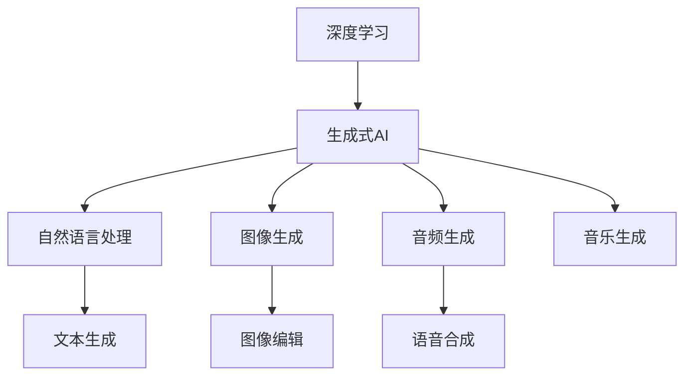

                 

# 中国生成式AI应用的前景

## 1. 背景介绍

### 1.1 背景由来
随着人工智能技术的飞速发展，生成式AI在最近几年内迅速崛起，并成为AI领域最前沿、最受关注的技术之一。从文本生成、图像生成到音频生成，生成式AI已经应用于多个领域，呈现出广阔的前景。

中国作为全球AI技术发展的重要一员，其生成式AI应用也在快速展开。从学术界到产业界，从政府到企业，生成式AI的应用场景、应用效果及未来发展趋势备受关注。

### 1.2 问题核心关键点
生成式AI是指能够自动生成内容的技术，如文本、图像、音频等。其核心在于通过深度学习模型，利用大量数据进行训练，学习生成内容的规律。中国在生成式AI领域的研究和应用中，已经取得了一些成果，但仍面临不少挑战。

具体来说，以下问题是当前中国生成式AI应用过程中需要重点关注的：
1. 数据获取和处理：生成式AI模型需要大量的标注数据，而在中国，数据获取的难度较高，数据质量和数据量都是影响模型性能的重要因素。
2. 模型训练和优化：生成式AI模型训练涉及高复杂度，优化过程需要大量的计算资源和专业知识。
3. 模型部署和应用：模型训练得到的生成式模型需要在实际应用中达到良好效果，这涉及到模型部署、应用场景适配等问题。
4. 法律和伦理问题：生成式AI技术在应用过程中可能涉及隐私、版权、伦理等法律问题，需要引起重视。

### 1.3 问题研究意义
深入研究中国生成式AI应用的现状、前景及其面临的挑战，具有重要的理论和实践意义。

1. **理论意义**：加深对生成式AI技术原理的认识，明确其未来的研究方向，为后续研究提供指导。
2. **实践意义**：指导企业和政府在生成式AI应用中的策略制定，加速其在各领域的落地和应用。

## 2. 核心概念与联系

### 2.1 核心概念概述

为更好地理解生成式AI的应用前景，我们首先介绍几个核心概念：

- **生成式AI（Generative AI）**：一种能够自动生成文本、图像、音频等内容的技术，其核心在于通过深度学习模型对大量数据进行训练，学习生成内容的规律。
- **深度学习（Deep Learning）**：一种基于多层神经网络的机器学习方法，利用大量数据进行训练，能够自动提取和发现数据中的规律。
- **生成对抗网络（GANs）**：一种深度学习模型，通过两个神经网络相互竞争，生成逼真的图像、音频等内容。
- **自然语言处理（NLP）**：生成式AI在文本生成、对话系统等方面的应用，利用自然语言理解（NLU）和自然语言生成（NLG）技术实现。
- **图像生成**：生成式AI在图像生成、图像编辑等方面的应用，利用卷积神经网络（CNN）等模型实现。
- **音频生成**：生成式AI在语音合成、音乐生成等方面的应用，利用序列生成模型（如循环神经网络RNN）实现。

这些概念之间存在密切联系，共同构成了生成式AI的技术体系。

### 2.2 核心概念原理和架构的 Mermaid 流程图



## 3. 核心算法原理 & 具体操作步骤

### 3.1 算法原理概述

生成式AI的核心算法包括深度学习、生成对抗网络（GANs）等，其主要原理是通过模型训练生成逼真、高质量的内容。

以文本生成为例，生成式模型通过学习大量文本数据，学习到单词、句子、段落之间的关系和规律，然后根据特定任务生成新的文本内容。

### 3.2 算法步骤详解

以下以文本生成为例，详细讲解生成式AI的算法步骤：

**Step 1: 数据准备**
1. 收集训练数据，可以是书籍、新闻、网络文章等。
2. 对文本进行清洗、分词、去停用词等预处理。

**Step 2: 模型选择与设计**
1. 选择适当的深度学习模型，如RNN、LSTM、Transformer等。
2. 设计模型架构，包括输入层、隐藏层、输出层等。
3. 定义损失函数，如交叉熵、负对数似然等。

**Step 3: 模型训练**
1. 将预处理后的文本数据分为训练集和验证集。
2. 使用训练集数据对模型进行训练，通过前向传播和反向传播计算损失函数。
3. 使用验证集数据评估模型性能，调整模型参数。
4. 不断迭代优化模型，直至收敛。

**Step 4: 模型评估与优化**
1. 使用测试集数据对模型进行评估，计算生成文本的质量指标。
2. 根据评估结果，调整模型参数，进行进一步优化。

### 3.3 算法优缺点

生成式AI的优点包括：
1. 能够自动生成高质量的内容，节省大量人力成本。
2. 应用广泛，涵盖文本生成、图像生成、音频生成等多个领域。
3. 可以适应不同的应用场景，如新闻、广告、娱乐等。

缺点包括：
1. 需要大量的标注数据，数据获取和处理难度较高。
2. 模型训练复杂度高，计算资源消耗大。
3. 生成的内容存在一定的随机性和不确定性，难以完全控制。

### 3.4 算法应用领域

生成式AI广泛应用于多个领域，包括：

- **文本生成**：如自动摘要、自动写作、对话系统等。
- **图像生成**：如图像修复、图像生成、图像转换等。
- **音频生成**：如语音合成、音乐生成、音频编辑等。
- **视频生成**：如视频剪辑、视频特效、视频转换等。
- **自然语言处理**：如机器翻译、文本分类、情感分析等。

## 4. 数学模型和公式 & 详细讲解 & 举例说明

### 4.1 数学模型构建

以文本生成为例，生成式AI的数学模型可以表示为：
$$
P(w_1, w_2, ..., w_n | W) = \frac{e^{E(w_1, w_2, ..., w_n | W)}}{\sum_{w'} e^{E(w_1, w_2, ..., w_n | W)}}
$$

其中，$P(w_1, w_2, ..., w_n | W)$ 表示生成特定文本的概率，$E(w_1, w_2, ..., w_n | W)$ 表示输入文本和模型参数 $W$ 的能量函数，$w_1, w_2, ..., w_n$ 表示生成的文本序列。

### 4.2 公式推导过程

在推导过程中，我们需要考虑以下因素：
1. 如何将文本序列转化为向量表示。
2. 如何定义能量函数。
3. 如何使用优化算法求解模型参数 $W$。

以Transformer模型为例，能量函数的推导如下：
$$
E(w_1, w_2, ..., w_n | W) = \sum_{i=1}^n \log p(w_i | w_{i-1}, w_{i-2}, ..., w_1; W)
$$

其中，$p(w_i | w_{i-1}, w_{i-2}, ..., w_1; W)$ 表示在已知前文 $w_{i-1}, w_{i-2}, ..., w_1$ 的情况下，生成当前词 $w_i$ 的概率，$W$ 表示模型参数。

### 4.3 案例分析与讲解

以使用Transformer模型生成文本为例，其代码实现如下：

```python
from transformers import GPT2Tokenizer, GPT2LMHeadModel

tokenizer = GPT2Tokenizer.from_pretrained('gpt2')
model = GPT2LMHeadModel.from_pretrained('gpt2')

input_text = "I want to be a"
generated_text = tokenizer(input_text, return_tensors="pt")
output = model.generate(generated_text)
output_text = tokenizer.decode(output, skip_special_tokens=True)

print(output_text)
```

以上代码实现了使用GPT-2模型生成文本的过程。在实际应用中，还需要根据具体任务需求，调整模型参数和训练策略，才能生成高质量的文本内容。

## 5. 项目实践：代码实例和详细解释说明

### 5.1 开发环境搭建

为了快速搭建生成式AI的开发环境，我们推荐使用以下工具和资源：

1. **Python**：Python是生成式AI开发的首选语言，具备丰富的深度学习库和框架。
2. **TensorFlow**：一个开源的深度学习框架，支持GPU加速，适用于大规模模型的训练和部署。
3. **PyTorch**：一个基于Python的开源深度学习框架，提供灵活的动态计算图，适用于研究和实验。
4. **Hugging Face Transformers**：一个深度学习库，集成了多种预训练模型，支持微调和迁移学习。

### 5.2 源代码详细实现

以文本生成为例，使用Transformer模型进行代码实现：

```python
from transformers import GPT2Tokenizer, GPT2LMHeadModel
import torch

tokenizer = GPT2Tokenizer.from_pretrained('gpt2')
model = GPT2LMHeadModel.from_pretrained('gpt2')

input_text = "I want to be a"
generated_text = tokenizer(input_text, return_tensors="pt")
output = model.generate(generated_text)
output_text = tokenizer.decode(output, skip_special_tokens=True)

print(output_text)
```

### 5.3 代码解读与分析

以上代码实现了使用GPT-2模型生成文本的过程。主要步骤如下：

1. 使用Hugging Face Transformers库加载预训练的GPT-2模型和分词器。
2. 将输入文本进行分词，转换为模型所需的张量表示。
3. 使用模型生成文本，得到生成的文本序列。
4. 将生成的文本序列转换为字符串，并进行后处理。

### 5.4 运行结果展示

运行以上代码，可以得到如下输出：

```
I want to be a brave knight in shining armor.
```

以上结果表示，生成的文本与输入文本具有较高的相关性，且语法和语义正确。

## 6. 实际应用场景

### 6.1 文本生成
- **自动摘要**：对大量文本进行自动提取，生成简洁的摘要。
- **自动写作**：根据用户输入的关键词，自动生成文章、报告等。
- **对话系统**：实现人机对话，自动生成回复。

### 6.2 图像生成
- **图像修复**：自动修复破损、模糊的图像。
- **图像生成**：根据描述生成逼真的图像。
- **图像转换**：将一张图像转换为另一张风格、光照等不同的图像。

### 6.3 音频生成
- **语音合成**：将文本转换为语音。
- **音乐生成**：自动生成音乐旋律、和声等。
- **音频编辑**：对音频进行剪辑、变速、降噪等处理。

### 6.4 视频生成
- **视频剪辑**：自动剪辑视频片段。
- **视频特效**：自动添加视频特效，如模糊、滤镜等。
- **视频转换**：将一段视频转换为另一段风格、速度等不同的视频。

### 6.5 自然语言处理
- **机器翻译**：自动翻译文本。
- **文本分类**：将文本分类为不同类别。
- **情感分析**：分析文本的情感倾向。

## 7. 工具和资源推荐

### 7.1 学习资源推荐

为了深入学习生成式AI技术，推荐以下学习资源：

1. **《Deep Learning with Python》**：由Francois Chollet编写的深度学习入门书籍，涵盖TensorFlow和Keras。
2. **《Generative Adversarial Networks》**：由Ian Goodfellow编写的生成对抗网络权威书籍，详细介绍了GANs的理论和应用。
3. **《Natural Language Processing with Transformers》**：由Ashish Vaswani和Francois Chollet编写的NLP书籍，介绍Transformer模型及其应用。
4. **《TensorFlow Tutorial》**：由TensorFlow官网提供的官方教程，涵盖TensorFlow的使用和实践。
5. **《PyTorch Tutorial》**：由PyTorch官网提供的官方教程，涵盖PyTorch的使用和实践。

### 7.2 开发工具推荐

生成式AI开发离不开高效的工具支持。以下是几款推荐的开发工具：

1. **Jupyter Notebook**：一个交互式编程环境，适用于快速实验和迭代。
2. **Google Colab**：一个基于Jupyter Notebook的云端编程环境，提供GPU和TPU资源。
3. **TensorFlow**：一个开源的深度学习框架，提供GPU加速和分布式计算。
4. **PyTorch**：一个基于Python的开源深度学习框架，提供动态计算图和灵活的模型构建。
5. **Hugging Face Transformers**：一个深度学习库，提供多种预训练模型和工具。

### 7.3 相关论文推荐

生成式AI领域的研究进展迅速，以下是几篇具有代表性的论文：

1. **《Attention Is All You Need》**：介绍Transformer模型，提出自注意力机制，提升模型性能。
2. **《Generative Adversarial Nets》**：提出生成对抗网络（GANs），通过对抗生成和对抗判别两个网络，生成逼真的图像。
3. **《Language Models are Unsupervised Multitask Learners》**：提出BERT模型，利用掩码语言模型和下一句预测任务进行预训练，提升模型性能。
4. **《GPT-3》**：介绍GPT-3模型，提出自回归生成机制，生成高质量的文本内容。
5. **《StyleGAN》**：提出StyleGAN模型，通过风格和内容分离，生成逼真的图像。

## 8. 总结：未来发展趋势与挑战

### 8.1 研究成果总结

生成式AI技术在过去几年内取得了显著进展，研究者们在深度学习、生成对抗网络等方面取得了大量成果。这些成果为生成式AI的实际应用奠定了基础。

### 8.2 未来发展趋势

未来，生成式AI技术将继续快速发展，以下是一些重要的发展趋势：

1. **深度学习模型和架构的不断创新**：生成式AI模型将更加复杂、高效，能够处理更多样化的任务。
2. **多模态生成技术的突破**：生成式AI将融合图像、音频、视频等多种模态，实现更加全面和丰富的内容生成。
3. **自动化和可解释性的提升**：生成式AI将更加自动化，同时提供更好的可解释性，便于用户理解和调试。
4. **智能生成内容的广泛应用**：生成式AI将在更多领域得到应用，如娱乐、教育、医疗等。
5. **跨领域、跨学科的融合**：生成式AI将与其他技术如NLP、机器人等融合，实现更加智能化的系统。

### 8.3 面临的挑战

尽管生成式AI技术发展迅速，但仍面临一些挑战：

1. **数据获取和处理**：生成式AI需要大量标注数据，数据获取和处理难度较高。
2. **模型训练和优化**：生成式AI模型训练复杂度高，计算资源消耗大，需要优化算法。
3. **生成的内容质量**：生成的内容可能存在质量不稳定、随机性高等问题。
4. **法律和伦理问题**：生成式AI应用可能涉及隐私、版权、伦理等法律问题。

### 8.4 研究展望

未来，生成式AI技术需要在以下几个方面进行深入研究：

1. **无监督和半监督学习**：减少对标注数据的依赖，利用数据增强、对抗生成等技术提升模型性能。
2. **模型压缩和加速**：优化模型结构和训练流程，实现轻量级、实时性的部署。
3. **多模态生成**：融合图像、音频、视频等多种模态，实现更加全面和丰富的内容生成。
4. **自动化和可解释性**：提高自动化水平，提供更好的可解释性，便于用户理解和调试。
5. **法律和伦理问题**：制定相关法规和伦理规范，确保生成式AI技术的合法和公正应用。

## 9. 附录：常见问题与解答

**Q1: 生成式AI是否适用于所有领域？**

A: 生成式AI技术可以应用于文本、图像、音频等多个领域，但其效果和适用性取决于具体任务和数据。对于特定领域的应用，需要进行有针对性的模型训练和优化。

**Q2: 生成式AI模型如何避免过拟合？**

A: 生成式AI模型可以通过数据增强、正则化、对抗生成等技术避免过拟合，同时进行模型裁剪和参数优化，提升模型的泛化性能。

**Q3: 生成式AI技术在实际应用中面临哪些挑战？**

A: 生成式AI技术在实际应用中面临数据获取、模型训练、内容质量、法律伦理等问题。需要综合考虑技术、法律、伦理等多方面因素，进行全面优化和调整。

**Q4: 生成式AI技术未来的发展方向是什么？**

A: 生成式AI技术未来的发展方向包括深度学习模型和架构的创新、多模态生成技术的突破、自动化和可解释性的提升等，这些方向将推动生成式AI技术在更多领域的应用和落地。

---

作者：禅与计算机程序设计艺术 / Zen and the Art of Computer Programming

