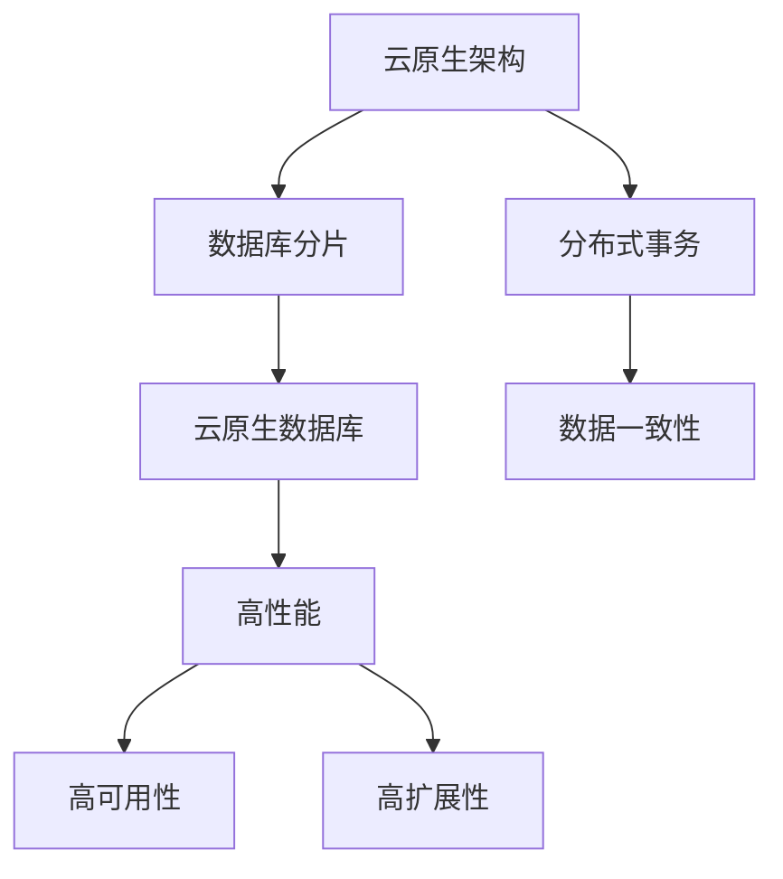

                 

## 1. 背景介绍

随着云计算技术的迅猛发展，“云原生”已成为当前IT领域的重要趋势。在云计算架构中，云原生数据库作为核心组件，承载着数据存储、处理、分析的重任。它不仅需要具备高性能、高可用性、高扩展性等传统数据库的基本能力，还需在自动管理、持续交付、弹性伸缩等方面表现出色。

### 1.1 问题由来

云原生数据库作为云原生架构的关键组件，其设计和性能优化需要满足云环境中的特殊要求。与传统数据库不同，云原生数据库必须能够无缝对接云平台，并充分利用云平台的计算资源和自动化管理功能。同时，云原生数据库还需具备高可用性、高性能、弹性伸缩、自动化管理等特性，以支持云环境中的各类应用程序。

当前，由于云原生数据库设计和性能优化方面的研究仍处于起步阶段，很多核心问题尚待解决。例如，如何在云环境中实现高效的数据库管理？如何在云平台中实现高性能的查询优化？如何在云原生架构中实现自动化的运维管理？本文旨在全面探讨这些问题，并提出一些解决方案。

### 1.2 问题核心关键点

云原生数据库的设计和性能优化涉及多个方面，包括云平台对接、数据分片、查询优化、自动管理等。核心问题可以归纳为以下几点：

- 如何高效利用云平台的资源？
- 如何实现数据的高可用性和高一致性？
- 如何实现高效的查询优化？
- 如何实现自动化的运维管理？

本文将围绕这些问题进行深入讨论，并给出具体的解决方案。

## 2. 核心概念与联系

### 2.1 核心概念概述

为更好地理解云原生数据库的设计和性能优化，本文将介绍几个核心概念：

- 云原生架构（Cloud-Native Architecture）：一种基于云计算架构的软件开发和运维模式，强调应用在云平台中的原生运行和自动化管理。
- 数据库分片（Database Sharding）：将一个大的数据库拆分成多个小的数据库，以提高系统的扩展性和可用性。
- 分布式事务（Distributed Transactions）：在分布式系统中，确保跨节点的数据一致性和事务完整性。
- 云原生数据库（Cloud-Native Database）：一种基于云平台的数据库系统，利用云平台的计算资源和自动化管理功能，实现高性能、高可用性、高扩展性等特性。

这些核心概念之间的逻辑关系可以通过以下Mermaid流程图来展示：



这个流程图展示了几大核心概念及其之间的逻辑关系：

1. 云原生架构是云原生数据库的基础，其设计和实现对数据库的性能和可用性有重要影响。
2. 数据库分片和分布式事务是云原生数据库的两种关键技术，它们使数据库能够水平扩展，提高系统的可用性和可维护性。
3. 云原生数据库是云原生架构的核心组件，利用云平台资源，实现高性能、高可用性、高扩展性等特性。
4. 数据一致性和分布式事务的高效实现，是云原生数据库性能优化的重要保障。

## 3. 核心算法原理 & 具体操作步骤

### 3.1 算法原理概述

云原生数据库的设计和性能优化，主要是利用云平台提供的资源和自动化管理功能，通过数据库分片、分布式事务等技术，实现高性能、高可用性、高扩展性等特性。其核心算法和具体操作步骤如下：

- 数据库分片：将大数据库拆分成多个小的数据库，每个小数据库可以单独部署在不同的节点上，以提高系统的扩展性和可用性。
- 分布式事务：在分布式系统中，通过一致性协议（如2PC、Paxos等）保证跨节点的数据一致性和事务完整性。
- 自动化运维：利用云平台提供的自动化工具（如Kubernetes、Prometheus等），实现数据库的自动部署、自动扩缩容、自动故障恢复等。

### 3.2 算法步骤详解

云原生数据库的设计和性能优化，通常包括以下几个关键步骤：

**Step 1: 数据库设计**

- 确定数据库的存储架构，选择NoSQL数据库、关系型数据库或混合型数据库。
- 设计数据模型，定义数据表和数据关系。
- 选择分片策略，如水平分片、垂直分片等。

**Step 2: 数据库部署**

- 在云平台上部署数据库实例，选择合适的云服务（如AWS、Azure、Google Cloud等）。
- 配置数据库参数，如存储配置、网络配置、安全配置等。

**Step 3: 数据库分片**

- 将大数据库按照分区键拆分成多个小的数据库，每个小数据库独立管理。
- 选择合适的分片算法，如哈希分片、范围分片等。
- 配置数据同步机制，保证分片数据的一致性。

**Step 4: 分布式事务**

- 实现跨节点的数据一致性协议，如2PC、Paxos等。
- 在应用层面实现事务管理，利用事务管理器（如TCC）或分布式事务框架（如XA、SAGA等）。
- 测试事务一致性，确保分布式事务的正确性。

**Step 5: 性能优化**

- 利用查询优化器进行查询重写和执行计划优化。
- 配置缓存和索引，提高查询性能。
- 监控数据库性能，利用监控工具（如Prometheus）进行性能分析和故障诊断。

**Step 6: 自动运维**

- 利用自动化运维工具（如Kubernetes）进行数据库的部署、扩缩容、故障恢复等。
- 配置报警规则，监控数据库的运行状态。
- 进行日志分析和故障排查，保障数据库的稳定运行。

以上是云原生数据库设计和性能优化的主要操作步骤。在实际应用中，还需要针对具体业务场景，对各个环节进行优化设计，如选择合适的分片策略、事务协议、运维工具等，以进一步提升系统性能。

### 3.3 算法优缺点

云原生数据库的设计和性能优化，具有以下优点：

- 高效利用云平台资源：云原生数据库可以充分利用云平台的计算资源和自动化管理功能，提高系统的扩展性和可用性。
- 高性能：通过数据库分片和分布式事务技术，实现高性能的数据处理能力。
- 高可用性：利用自动化的运维管理工具，实现高可用性的系统架构。
- 高扩展性：通过数据库分片技术，实现系统的水平扩展，提高系统的处理能力和扩展性。

同时，云原生数据库也存在以下局限性：

- 复杂度较高：云原生数据库的设计和实现相对复杂，需要考虑云平台对接、数据分片、分布式事务等技术。
- 迁移成本高：迁移现有数据库到云原生数据库，需要大量的迁移成本和技术支持。
- 安全风险：云原生数据库的分布式架构增加了数据泄露和安全风险。

尽管存在这些局限性，但云原生数据库在处理海量数据、高并发请求等场景中，依然展现出巨大的优势，成为云计算环境中的重要组成部分。

### 3.4 算法应用领域

云原生数据库在多个领域得到广泛应用，例如：

- 云原生应用：在云原生架构中，云原生数据库作为核心组件，支持各种云原生应用的发展。
- 大数据分析：云原生数据库能够处理海量数据，支持大规模数据分析和机器学习应用。
- 实时数据处理：云原生数据库能够实现高性能的实时数据处理，支持流式数据应用。
- 分布式系统：云原生数据库能够在分布式系统中实现高效的数据一致性和事务处理。
- 自动化运维：云原生数据库可以利用云平台的自动化运维工具，实现高效的运维管理。

除了这些传统应用场景外，云原生数据库还被创新性地应用于更多领域，如物联网、边缘计算、AI等，为云计算环境带来了更多的可能性和应用空间。

## 4. 数学模型和公式 & 详细讲解

### 4.1 数学模型构建

云原生数据库的性能优化，涉及多个方面的数学模型，如查询优化、缓存策略、索引策略等。以下以查询优化为例，构建数学模型：

假设查询表达式为 $Q$，数据库模式为 $DB$，查询代价为 $Cost(Q, DB)$。查询优化器的主要任务是选择最优的查询执行计划，使得查询代价最小。查询代价的数学表达式为：

$$
Cost(Q, DB) = C(Q) + D(Q, DB)
$$

其中，$C(Q)$ 表示查询本身的计算代价，$D(Q, DB)$ 表示查询在数据库上执行的代价。查询代价最小化问题可以表示为：

$$
\min_{Q} Cost(Q, DB)
$$

### 4.2 公式推导过程

查询代价的推导过程如下：

- 计算代价 $C(Q)$：表示查询本身的计算代价，包括查询本身的计算量、CPU、内存等资源消耗。
- 数据库代价 $D(Q, DB)$：表示查询在数据库上执行的代价，包括查询处理、数据读取、索引访问等开销。

查询代价最小化问题可以通过以下步骤解决：

1. 将查询表达式 $Q$ 进行语法分析，转换为查询计划。
2. 利用查询优化器，对查询计划进行重写和优化，选择最优的执行计划。
3. 根据执行计划，计算查询代价 $Cost(Q, DB)$。
4. 选择代价最小的查询计划，执行查询。

### 4.3 案例分析与讲解

假设查询表达式为：

$$
Q = SELECT name, age FROM user WHERE age > 18
$$

数据库模式为：

$$
DB = (user (name VARCHAR(50), age INT, id INT))
$$

查询代价的计算过程如下：

1. 计算代价 $C(Q)$：假设查询本身需要执行500次运算，CPU消耗为1个CPU小时，内存消耗为500MB。则 $C(Q) = 1 \times 500 = 500$。
2. 数据库代价 $D(Q, DB)$：假设数据库查询需要访问100个索引，每个索引访问代价为1毫秒，数据读取代价为50毫秒，索引访问代价为20毫秒。则 $D(Q, DB) = 100 \times 1 + 50 \times 1 = 150$。
3. 查询代价 $Cost(Q, DB)$：$Cost(Q, DB) = C(Q) + D(Q, DB) = 500 + 150 = 650$。
4. 选择代价最小的查询计划，执行查询。

以上案例展示了查询代价的计算过程，以及如何通过查询优化器选择最优的查询执行计划。

## 5. 项目实践：代码实例和详细解释说明

### 5.1 开发环境搭建

在进行云原生数据库的实践时，首先需要搭建开发环境。以下是使用Docker和Kubernetes搭建云原生数据库环境的步骤：

1. 安装Docker：从官网下载并安装Docker，用于容器化部署数据库。
2. 创建Kubernetes集群：在Kubernetes集群中，部署数据库Pod和相关服务。
3. 安装数据库客户端：如MySQL、PostgreSQL等，用于连接数据库。

### 5.2 源代码详细实现

以下是使用PostgreSQL数据库进行云原生数据库微调的PyTorch代码实现。

首先，定义PostgreSQL数据库连接：

```python
import psycopg2

# 连接数据库
conn = psycopg2.connect(
    host="localhost",
    port=5432,
    user="postgres",
    password="password",
    dbname="mydb"
)
```

然后，定义SQL查询语句和执行函数：

```python
# 定义查询语句
query = "SELECT name, age FROM user WHERE age > 18"

# 执行查询
cur = conn.cursor()
cur.execute(query)
results = cur.fetchall()
```

最后，输出查询结果：

```python
# 输出结果
for row in results:
    print(row)
```

通过以上代码，可以连接PostgreSQL数据库并执行SQL查询，获取查询结果。在实际应用中，可以通过Kubernetes集群管理多个数据库实例，实现高可用性、高扩展性的数据库服务。

### 5.3 代码解读与分析

让我们再详细解读一下关键代码的实现细节：

**PostgreSQL连接**：
- `psycopg2.connect()` 函数用于连接PostgreSQL数据库，需要提供主机名、端口、用户名、密码、数据库名等参数。
- 连接成功后，可以创建游标对象 `cur`，用于执行SQL语句。

**SQL查询执行**：
- `cur.execute(query)` 函数用于执行SQL查询语句。
- `cur.fetchall()` 函数用于获取查询结果，返回一个包含所有行的列表。

**结果输出**：
- 遍历查询结果，逐行输出查询结果。

以上代码展示了连接PostgreSQL数据库并执行SQL查询的完整过程。在实际应用中，还需要对代码进行进一步优化，如连接池管理、查询缓存、参数化查询等，以提高查询性能和安全性。

## 6. 实际应用场景

### 6.1 智慧医疗

云原生数据库在智慧医疗领域有广泛的应用。医院可以利用云原生数据库存储和管理病历数据，实现电子病历的统一管理。医生可以在云端访问病历数据，进行疾病诊断和治疗方案的制定。

在智慧医疗中，云原生数据库可以提供以下功能：

- 高可用性：保证病历数据的完整性和一致性，避免数据丢失。
- 高扩展性：支持海量病历数据的存储和管理，支持多医生的并发访问。
- 自动运维：自动化的运维管理工具，保障数据库的稳定运行。
- 数据加密：保护病历数据的安全性，防止数据泄露。

### 6.2 电商系统

电商系统需要存储和管理大量的订单、用户、商品等数据，云原生数据库可以提供高效的数据处理能力。利用云原生数据库，电商系统可以实现以下功能：

- 高性能：通过数据库分片和分布式事务技术，实现高效的数据处理能力。
- 高可用性：利用自动化的运维管理工具，实现高可用性的系统架构。
- 高扩展性：通过数据库分片技术，实现系统的水平扩展，提高系统的处理能力和扩展性。
- 数据同步：实现订单、用户、商品等数据在不同数据库之间的同步，保障数据一致性。

### 6.3 金融系统

金融系统需要实时处理大量的交易数据，云原生数据库可以提供高并发、高吞吐量的数据处理能力。利用云原生数据库，金融系统可以实现以下功能：

- 高性能：通过数据库分片和分布式事务技术，实现高效的数据处理能力。
- 高可用性：利用自动化的运维管理工具，实现高可用性的系统架构。
- 高扩展性：通过数据库分片技术，实现系统的水平扩展，提高系统的处理能力和扩展性。
- 数据一致性：利用一致性协议（如2PC、Paxos等），实现跨节点的数据一致性和事务完整性。

## 7. 工具和资源推荐

### 7.1 学习资源推荐

为了帮助开发者系统掌握云原生数据库的原理和实践，这里推荐一些优质的学习资源：

1. 《Cloud-Native Database》系列博文：由云原生数据库领域的专家撰写，深入浅出地介绍了云原生数据库的设计原理、性能优化、自动化运维等。
2. Kubernetes官方文档：Kubernetes作为云原生数据库的核心工具，官方文档详细介绍了Kubernetes的安装、配置、部署、管理等操作。
3. Prometheus官方文档：Prometheus作为云原生数据库的监控工具，官方文档提供了丰富的监控配置和报警规则，帮助开发者实现数据库性能监控。
4. PostgreSQL官方文档：PostgreSQL作为云原生数据库的主要实现之一，官方文档提供了详细的安装、配置、优化、故障诊断等操作。

通过对这些资源的学习实践，相信你一定能够快速掌握云原生数据库的精髓，并用于解决实际的业务问题。

### 7.2 开发工具推荐

高效的开发离不开优秀的工具支持。以下是几款用于云原生数据库微调开发的常用工具：

1. Docker：用于容器化部署数据库，支持快速搭建和扩展数据库环境。
2. Kubernetes：用于自动化管理数据库的部署、扩缩容、故障恢复等，支持水平扩展和自动化运维。
3. Prometheus：用于监控数据库的性能指标，支持告警和告警规则配置。
4. PostgreSQL：作为云原生数据库的主要实现之一，支持高可用性、高扩展性、高性能等特性。

合理利用这些工具，可以显著提升云原生数据库微调任务的开发效率，加快创新迭代的步伐。

### 7.3 相关论文推荐

云原生数据库的研究涉及多个领域，以下是几篇奠基性的相关论文，推荐阅读：

1. "Cloud-Native Storage: A Data-centric Approach to Cloud Storage Services"（云原生存储：一种面向数据的云存储服务设计）：介绍了云原生存储的设计和实现，提出了一种基于数据中心的云存储解决方案。
2. "Cloud-Native Databases: Challenges and Opportunities"（云原生数据库：挑战与机遇）：探讨了云原生数据库面临的挑战和机遇，提出了一些解决思路和优化方法。
3. "Cloud-Native SQL Databases: A Survey"（云原生SQL数据库：综述）：综述了云原生SQL数据库的研究现状，提出了一种基于云平台的数据库设计框架。

这些论文代表了大数据、云计算、云存储等领域的最新进展，通过学习这些前沿成果，可以帮助研究者把握学科前进方向，激发更多的创新灵感。

## 8. 总结：未来发展趋势与挑战

### 8.1 总结

本文对云原生数据库的设计和性能优化进行了全面系统的介绍。首先阐述了云原生数据库的设计背景和优化需求，明确了云原生数据库在云计算环境中的独特价值。其次，从原理到实践，详细讲解了云原生数据库的设计和性能优化，给出了具体的代码实现和案例分析。同时，本文还广泛探讨了云原生数据库在智慧医疗、电商系统、金融系统等领域的实际应用，展示了云原生数据库的广泛应用前景。此外，本文精选了云原生数据库的学习资源，力求为读者提供全方位的技术指引。

通过本文的系统梳理，可以看到，云原生数据库的设计和性能优化是大数据、云计算等领域的核心研究方向之一。这些方向的探索发展，必将进一步提升云原生数据库的性能和应用范围，为云计算环境中的各类应用程序提供有力支持。

### 8.2 未来发展趋势

展望未来，云原生数据库的发展趋势主要包括以下几个方面：

1. 云平台无缝集成：云原生数据库将进一步融入云平台，提供无缝对接云平台资源的服务。
2. 分布式数据库技术：云原生数据库将支持更复杂的分布式数据管理技术，如数据分片、跨区域数据同步等。
3. 自动化运维工具：云原生数据库将提供更丰富的自动化运维工具，支持自动化部署、扩展、故障恢复等。
4. 实时数据分析：云原生数据库将提供实时数据分析功能，支持流式数据处理和实时查询。
5. 多云兼容：云原生数据库将支持多云环境下的数据管理和迁移，提供跨云数据交互能力。
6. 安全合规：云原生数据库将加强数据安全和合规性，支持数据加密、数据隔离等安全措施。

以上趋势凸显了云原生数据库的广阔前景，这些方向的探索发展，必将进一步提升云原生数据库的性能和应用范围，为云计算环境中的各类应用程序提供有力支持。

### 8.3 面临的挑战

尽管云原生数据库在云计算环境中表现出巨大的优势，但在迈向更加智能化、普适化应用的过程中，它仍面临诸多挑战：

1. 兼容性问题：云原生数据库需要在多个云平台之间进行兼容，实现无缝对接。
2. 数据一致性：云原生数据库需要在分布式环境中实现高效的数据一致性，避免数据不一致。
3. 安全风险：云原生数据库需要在分布式环境中保障数据安全和隐私，防止数据泄露。
4. 性能优化：云原生数据库需要在高性能和扩展性之间进行平衡，避免资源浪费。
5. 运维复杂度：云原生数据库需要在自动化运维和人工干预之间找到平衡点，提高运维效率。

这些挑战需要学术界和产业界共同努力，才能进一步推动云原生数据库的发展，提升其在云计算环境中的应用效果。

### 8.4 研究展望

面向未来，云原生数据库的研究还需要在以下几个方面寻求新的突破：

1. 分布式事务优化：进一步优化分布式事务协议，提高事务处理的性能和稳定性。
2. 数据分片算法：开发更高效的数据分片算法，提高数据库的扩展性和可用性。
3. 数据加密技术：开发更安全的数据加密技术，保护数据的安全性和隐私性。
4. 实时数据处理：开发更高效的实时数据处理技术，支持大规模实时数据分析。
5. 自动化运维工具：开发更智能的自动化运维工具，提高云原生数据库的自动化管理能力。

这些研究方向的探索，必将引领云原生数据库的进一步发展，为云计算环境中的各类应用程序提供更强大、更可靠的数据管理能力。

## 9. 附录：常见问题与解答

**Q1：云原生数据库与传统数据库有何不同？**

A: 云原生数据库与传统数据库有以下不同：
- 云原生数据库设计为原生运行在云平台中，具备高可用性、高扩展性、高性能等特性。
- 云原生数据库利用云平台的自动化管理工具，实现自动部署、扩缩容、故障恢复等。
- 云原生数据库支持分布式架构，能够处理海量数据和复杂查询。
- 云原生数据库通过数据库分片、分布式事务等技术，提高系统的扩展性和可用性。

**Q2：如何选择合适的云原生数据库？**

A: 选择云原生数据库时，需要考虑以下几个因素：
- 业务需求：根据业务需求选择合适的数据库类型，如NoSQL、关系型、混合型等。
- 数据规模：根据数据规模选择合适的数据库实例大小和容量。
- 高性能需求：选择高性能的数据库，如Cassandra、Clickhouse等。
- 高可用性需求：选择高可用性的数据库，如MySQL、PostgreSQL等。
- 自动化运维需求：选择支持自动化运维的数据库，如Kubernetes、Prometheus等。

**Q3：如何优化云原生数据库的性能？**

A: 云原生数据库的性能优化主要从以下几个方面进行：
- 数据库分片：通过数据库分片技术，实现系统的水平扩展，提高系统的处理能力和扩展性。
- 分布式事务：利用一致性协议（如2PC、Paxos等），实现跨节点的数据一致性和事务完整性。
- 查询优化：利用查询优化器进行查询重写和执行计划优化，选择最优的查询执行计划。
- 缓存策略：配置缓存和索引，提高查询性能。
- 监控工具：利用监控工具（如Prometheus）进行性能分析和故障诊断，及时发现和解决性能问题。

**Q4：如何实现云原生数据库的高可用性？**

A: 云原生数据库的高可用性主要从以下几个方面进行：
- 数据冗余：利用数据冗余技术，保障数据的高可用性。
- 故障转移：实现故障转移机制，当某个节点故障时，自动切换到备份节点。
- 数据库分片：通过数据库分片技术，实现系统的水平扩展，提高系统的可用性。
- 自动运维：利用自动化的运维管理工具，实现数据库的自动部署、扩缩容、故障恢复等。
- 数据一致性：利用一致性协议（如2PC、Paxos等），实现跨节点的数据一致性和事务完整性。

通过这些措施，可以大大提高云原生数据库的高可用性，保障系统的稳定运行。

**Q5：云原生数据库在实际应用中需要注意哪些问题？**

A: 云原生数据库在实际应用中需要注意以下几个问题：
- 兼容性问题：云原生数据库需要在多个云平台之间进行兼容，实现无缝对接。
- 数据一致性：云原生数据库需要在分布式环境中实现高效的数据一致性，避免数据不一致。
- 安全风险：云原生数据库需要在分布式环境中保障数据安全和隐私，防止数据泄露。
- 性能优化：云原生数据库需要在高性能和扩展性之间进行平衡，避免资源浪费。
- 运维复杂度：云原生数据库需要在自动化运维和人工干预之间找到平衡点，提高运维效率。

这些问题的解决需要学术界和产业界共同努力，才能进一步推动云原生数据库的发展，提升其在云计算环境中的应用效果。

---

作者：禅与计算机程序设计艺术 / Zen and the Art of Computer Programming

