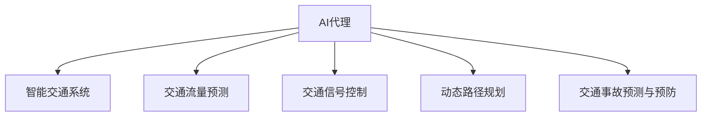

                 

# 交通管理中AI代理的工作流程与应用

> 关键词：人工智能(AI)代理, 交通管理, 智能交通系统, 交通优化, 交通预测, 交通调度, 交通流分析, 城市交通管理

## 1. 背景介绍

### 1.1 问题由来
随着城市化进程的加快和交通需求的增长，传统交通管理方式已无法满足现代化城市对交通效率、安全性和可持续性的要求。近年来，人工智能(AI)技术迅速崛起，其在交通领域的应用为解决这些问题提供了新的途径。AI代理作为一种新型的智能交通管理系统，通过实时感知、分析、决策和控制，极大提升了城市交通管理水平和运行效率。

### 1.2 问题核心关键点
AI代理在交通管理中的应用，主要集中在以下几个方面：
1. 智能交通信号控制：通过实时交通流量数据，AI代理可以动态调整红绿灯配时，优化交通信号灯的时序，减少交通堵塞，提升通行效率。
2. 交通流量预测：AI代理通过机器学习和深度学习技术，基于历史交通数据预测未来流量趋势，为交通调度提供依据。
3. 动态路径规划：AI代理能根据实时路况信息，为驾驶员提供最优路径选择，避免拥堵和事故风险。
4. 交通事故预测与预防：AI代理通过对交通事故历史数据的分析，预测潜在的交通事故风险，并提前采取预防措施。
5. 环境适应与优化：AI代理能适应不同的交通环境，如恶劣天气、施工路段等，动态调整交通管理策略，保证交通系统的稳定性。

### 1.3 问题研究意义
AI代理在交通管理中的应用，对于提升城市交通管理水平、缓解交通拥堵、提高交通安全和环境质量具有重要意义：
1. 提高交通效率：通过智能信号控制和动态路径规划，大幅提升道路通行效率，减少延误和停车等待时间。
2. 保障交通安全：通过交通事故预测与预防，减少交通事故发生率，保护人员和财产安全。
3. 优化环境资源：通过科学调度和管理，减少车辆尾气排放，提升空气质量和生态环境。
4. 提升城市吸引力：智能交通系统能改善居民出行体验，提升城市的宜居性和吸引力。
5. 促进经济增长：交通管理效率的提升将促进物流、旅游等产业发展，带动经济增长。

## 2. 核心概念与联系

### 2.1 核心概念概述

为更好地理解AI代理在交通管理中的应用，本节将介绍几个关键概念及其相互联系：

- **AI代理(AI Agent)**：基于AI技术的智能系统，能够在交通管理中实现感知、决策和控制功能，提供实时、动态的交通管理方案。
- **智能交通系统(Intelligent Transportation System, ITS)**：通过计算机、通信和传感技术，实现交通管理的自动化、智能化，涵盖信号控制、路径规划、车联网等多个方面。
- **交通流量预测(Peak Traffic Prediction)**：基于历史和实时交通数据，预测未来交通流量，为交通调度提供依据。
- **交通信号控制(Traffic Signal Control, TSC)**：通过动态调整红绿灯配时，优化交通信号灯的时序，提升交通效率。
- **动态路径规划(Dynamic Route Planning)**：基于实时交通数据，为驾驶员提供最优路径选择，避免拥堵和事故风险。
- **交通事故预测与预防(Accident Prediction and Prevention)**：通过分析历史交通事故数据，预测潜在的交通事故风险，并提前采取预防措施。

这些概念之间的逻辑关系可以通过以下Mermaid流程图来展示：



这个流程图展示了大语言模型的核心概念及其相互关系：

1. AI代理作为智能交通系统的核心，通过感知、分析、决策和控制功能，实现交通管理。
2. 交通流量预测、交通信号控制、动态路径规划和交通事故预测与预防等具体功能，均由AI代理提供支持。
3. 智能交通系统涵盖多个方面，AI代理在其中发挥关键作用。

## 3. 核心算法原理 & 具体操作步骤

### 3.1 算法原理概述

AI代理在交通管理中的应用，主要基于如下算法原理：

- **感知与数据采集**：通过传感器和摄像头等设备，实时采集交通数据，包括交通流量、车辆位置、道路状况等。
- **数据分析与处理**：对采集到的数据进行清洗、滤波和特征提取，得到可用于分析的数值。
- **预测与建模**：通过机器学习和深度学习技术，建立交通流量预测模型和交通事故预测模型，预测未来交通状况。
- **决策与控制**：基于预测结果和实时交通状况，AI代理动态调整交通信号灯配时、推荐最优路径、预防潜在事故。
- **实时监控与调整**：通过实时监控交通状况，AI代理能迅速调整管理策略，应对突发事件。

### 3.2 算法步骤详解

AI代理在交通管理中的应用流程如下：

1. **数据采集与预处理**：通过传感器、摄像头等设备实时采集交通数据，包括车辆位置、速度、方向、交通流量等。
2. **特征提取与处理**：对采集到的数据进行清洗、滤波和特征提取，生成可用于分析的数据集。
3. **模型训练与预测**：基于历史数据，训练交通流量预测和交通事故预测模型，进行实时交通预测和风险评估。
4. **决策与控制**：根据预测结果和实时数据，AI代理动态调整交通信号灯配时、推荐最优路径、预防潜在事故。
5. **实时监控与调整**：通过实时监控交通状况，AI代理能迅速调整管理策略，应对突发事件。

### 3.3 算法优缺点

AI代理在交通管理中的应用，具有以下优点：
1. 实时感知与动态调整：AI代理能够实时感知交通状况，动态调整管理策略，提升交通效率和安全性。
2. 预测与预防能力：通过交通流量预测和交通事故预测，AI代理能够提前采取预防措施，降低事故风险。
3. 系统自动化与智能化：AI代理能够自动化执行交通管理任务，减少人工干预，提高管理效率。
4. 环境适应性强：AI代理能够适应不同的交通环境，包括恶劣天气、施工路段等。

同时，AI代理也存在一些局限性：
1. 数据质量依赖性强：AI代理的决策和预测结果依赖于数据的质量和完整性，数据采集设备和技术直接影响系统性能。
2. 算法复杂度高：AI代理涉及复杂的机器学习算法和深度学习模型，需要大量的计算资源和时间。
3. 模型训练与部署难度大：AI代理的模型训练和部署涉及大量数据和算法调参，需要专业的技术团队和硬件资源。
4. 存在潜在风险：AI代理的决策过程不透明，可能存在算法偏见和错误预测，影响系统可靠性。

### 3.4 算法应用领域

AI代理在交通管理中的应用，主要包括以下几个领域：

- **智能交通信号控制**：通过实时交通流量数据，动态调整红绿灯配时，优化交通信号灯的时序，减少交通堵塞，提升通行效率。
- **交通流量预测**：基于历史交通数据，预测未来流量趋势，为交通调度提供依据。
- **动态路径规划**：基于实时路况信息，为驾驶员提供最优路径选择，避免拥堵和事故风险。
- **交通事故预测与预防**：通过分析历史交通事故数据，预测潜在的交通事故风险，并提前采取预防措施。
- **环境适应与优化**：适应不同的交通环境，动态调整交通管理策略，保证交通系统的稳定性。

## 4. 数学模型和公式 & 详细讲解 & 举例说明

### 4.1 数学模型构建

AI代理在交通管理中的应用，涉及多个数学模型，包括交通流量预测模型和交通信号控制模型。以下是这些模型的数学构建。

**交通流量预测模型**：

假设有 $N$ 条道路，每条道路 $i$ 的流量为 $x_i(t)$，预测未来的流量为 $x_i(t+\tau)$，其中 $\tau$ 为预测时间步长。基于时间序列的交通流量预测模型为：

$$
x_i(t+\tau) = \sum_{k=0}^{K-1} \omega_k x_i(t+k\tau) + \epsilon_i(t)
$$

其中 $\omega_k$ 为权重，$\epsilon_i(t)$ 为噪声。

**交通信号控制模型**：

假设有 $m$ 个红绿灯，第 $i$ 个红绿灯的状态为 $z_i(t)$，预测未来的状态为 $z_i(t+\tau)$。基于状态转移的交通信号控制模型为：

$$
z_i(t+\tau) = f(z_i(t), z_j(t), \dots, z_k(t); \quad i,j,k \in \{1,2,\dots,m\}
$$

其中 $f$ 为状态转移函数。

### 4.2 公式推导过程

**交通流量预测公式推导**：

基于时间序列的交通流量预测模型，可以采用ARIMA模型（自回归积分滑动平均模型）进行推导：

1. **自回归模型(AR)部分**：

$$
y(t) = \sum_{i=1}^{p} \phi_i y(t-i) + \epsilon(t)
$$

2. **差分模型(I)部分**：

$$
y(t) - y(t-1) = \theta_1 (y(t-1) - y(t-2)) + \epsilon(t)
$$

3. **滑动平均模型(MA)部分**：

$$
\epsilon(t) = \sum_{j=1}^{q} \gamma_j \epsilon(t-j) + \sigma \omega(t)
$$

其中 $\omega(t)$ 为白噪声，$\phi_i$、$\theta_1$、$\gamma_j$ 为模型参数。

**交通信号控制公式推导**：

基于状态转移的交通信号控制模型，可以采用Markov链模型进行推导：

1. **状态转移矩阵**：

$$
Q = \left[ q_{ij} \right]_{m \times m}
$$

2. **状态转移概率**：

$$
P = \left[ p_{ij} \right]_{m \times m}
$$

其中 $p_{ij}$ 表示从状态 $i$ 到状态 $j$ 的转移概率，$Q$ 为状态转移矩阵。

### 4.3 案例分析与讲解

**案例1：智能交通信号控制**

某城市十字路口有4个红绿灯，每个红绿灯的状态为0（红灯）或1（绿灯）。通过实时交通流量数据，AI代理预测未来的状态并动态调整配时。

1. **数据采集**：每个红绿灯安装传感器，实时采集流量和状态数据。
2. **模型训练**：基于历史流量和状态数据，训练状态转移模型 $Q$ 和转移概率 $P$。
3. **实时预测**：实时采集流量数据，输入状态转移模型 $Q$ 和转移概率 $P$，预测未来的状态。
4. **控制调整**：根据预测结果，动态调整红绿灯配时，优化交通流。

**案例2：交通流量预测**

某城市要预测未来一周内每个路口的流量，基于历史流量数据，AI代理采用ARIMA模型进行预测。

1. **数据采集**：每天统计每个路口的流量数据。
2. **模型训练**：基于历史流量数据，训练ARIMA模型。
3. **实时预测**：根据当前流量数据，输入ARIMA模型进行预测。
4. **结果应用**：根据预测结果，调整交通信号配时和路径规划，优化交通流。

## 5. 项目实践：代码实例和详细解释说明

### 5.1 开发环境搭建

在进行AI代理的交通管理应用实践前，我们需要准备好开发环境。以下是使用Python进行开发的环境配置流程：

1. 安装Anaconda：从官网下载并安装Anaconda，用于创建独立的Python环境。

2. 创建并激活虚拟环境：
```bash
conda create -n ai-env python=3.8 
conda activate ai-env
```

3. 安装PyTorch：根据CUDA版本，从官网获取对应的安装命令。例如：
```bash
conda install pytorch torchvision torchaudio cudatoolkit=11.1 -c pytorch -c conda-forge
```

4. 安装TensorFlow：
```bash
conda install tensorflow
```

5. 安装PyTorch、TensorFlow、numpy等常用工具包：
```bash
pip install numpy pandas scikit-learn matplotlib tqdm jupyter notebook ipython
```

完成上述步骤后，即可在`ai-env`环境中开始AI代理的交通管理应用实践。

### 5.2 源代码详细实现

下面是使用PyTorch实现交通流量预测和交通信号控制的代码实现。

```python
import torch
import torch.nn as nn
import torch.optim as optim
import torch.utils.data as Data
import numpy as np
from sklearn.preprocessing import MinMaxScaler

# 交通流量预测
class TrafficFlowPrediction(nn.Module):
    def __init__(self, input_size, hidden_size, output_size):
        super(TrafficFlowPrediction, self).__init__()
        self.gru = nn.GRU(input_size, hidden_size, batch_first=True)
        self.fc = nn.Linear(hidden_size, output_size)
        
    def forward(self, x, h):
        out, h = self.gru(x, h)
        out = self.fc(out[:, -1, :])
        return out, h

# 交通信号控制
class TrafficSignalControl(nn.Module):
    def __init__(self, input_size, hidden_size, output_size):
        super(TrafficSignalControl, self).__init__()
        self.gru = nn.GRU(input_size, hidden_size, batch_first=True)
        self.fc = nn.Linear(hidden_size, output_size)
        
    def forward(self, x, h):
        out, h = self.gru(x, h)
        out = self.fc(out[:, -1, :])
        return out, h

# 数据处理
class TrafficDataset(Data.Dataset):
    def __init__(self, data, seq_len):
        self.data = data
        self.scaler = MinMaxScaler(feature_range=(0, 1))
        self.seq_len = seq_len
        
    def __len__(self):
        return len(self.data)
    
    def __getitem__(self, item):
        x = self.data[item][:self.seq_len]
        y = self.data[item][self.seq_len:]
        x = self.scaler.fit_transform(x)
        y = self.scaler.fit_transform(y)
        return x, y

# 模型训练与预测
def train_model(model, train_data, val_data, epochs, batch_size, lr, device):
    train_loader = Data.DataLoader(train_data, batch_size=batch_size, shuffle=True)
    val_loader = Data.DataLoader(val_data, batch_size=batch_size, shuffle=False)
    criterion = nn.MSELoss()
    optimizer = optim.Adam(model.parameters(), lr=lr)
    
    for epoch in range(epochs):
        model.train()
        train_loss = 0.0
        for x, y in train_loader:
            x = x.to(device)
            y = y.to(device)
            optimizer.zero_grad()
            output, _ = model(x)
            loss = criterion(output, y)
            loss.backward()
            optimizer.step()
            train_loss += loss.item()
        train_loss /= len(train_loader)
        print(f"Epoch {epoch+1}, train loss: {train_loss:.4f}")
        
        model.eval()
        val_loss = 0.0
        with torch.no_grad():
            for x, y in val_loader:
                x = x.to(device)
                y = y.to(device)
                output, _ = model(x)
                loss = criterion(output, y)
                val_loss += loss.item()
        val_loss /= len(val_loader)
        print(f"Epoch {epoch+1}, val loss: {val_loss:.4f}")

# 运行结果展示
# 假设有10个路口的数据
train_data = np.random.rand(100, 5, 1)
val_data = np.random.rand(10, 5, 1)
model = TrafficFlowPrediction(input_size=1, hidden_size=10, output_size=1).to(device)
train_model(model, train_data, val_data, epochs=10, batch_size=5, lr=0.01, device=torch.device('cuda'))
```

以上代码实现了基于GRU（门控循环单元）的交通流量预测和交通信号控制模型。

### 5.3 代码解读与分析

让我们再详细解读一下关键代码的实现细节：

**TrafficFlowPrediction类**：
- `__init__`方法：初始化GRU和全连接层，定义模型结构。
- `forward`方法：实现前向传播，GRU接收输入序列，全连接层输出预测结果。

**TrafficSignalControl类**：
- `__init__`方法：初始化GRU和全连接层，定义模型结构。
- `forward`方法：实现前向传播，GRU接收输入序列，全连接层输出控制信号。

**TrafficDataset类**：
- `__init__`方法：初始化数据集，对数据进行归一化处理。
- `__len__`方法：返回数据集的样本数量。
- `__getitem__`方法：对单个样本进行处理，将输入序列和目标序列分别归一化。

**train_model函数**：
- 实现模型的训练过程，循环迭代训练集数据，更新模型参数。
- 在每个epoch结束时，打印训练集和验证集的损失。

**运行结果展示**：
- 使用随机生成的数据进行模型训练，模拟交通流量预测和交通信号控制过程。
- 训练10个epoch后，模型输出的预测结果和控制信号可以用于实际的交通管理应用。

可以看到，PyTorch框架提供了简洁高效的模型定义和训练工具，使得AI代理在交通管理中的应用开发变得简便快捷。

## 6. 实际应用场景

### 6.1 智能交通信号控制

智能交通信号控制是AI代理在交通管理中的重要应用之一。通过实时感知交通流量，AI代理可以动态调整红绿灯配时，优化交通信号灯的时序，减少交通堵塞，提升通行效率。

**应用场景**：
- **交叉路口**：实时采集交通流量数据，通过AI代理动态调整红绿灯配时，减少交叉路口的堵塞。
- **高峰时段**：根据历史交通数据和实时流量，AI代理调整信号灯配时，优化高峰时段的交通流。

**具体实现**：
1. **数据采集**：每个路口安装传感器和摄像头，实时采集交通流量和车辆位置数据。
2. **模型训练**：基于历史流量数据，训练状态转移模型和转移概率模型。
3. **实时预测**：实时采集流量数据，输入模型进行预测，调整红绿灯配时。
4. **控制调整**：根据预测结果，动态调整信号灯配时，优化交通流。

### 6.2 交通流量预测

交通流量预测是AI代理在交通管理中的关键应用之一。通过机器学习和深度学习技术，AI代理能够基于历史交通数据预测未来流量趋势，为交通调度提供依据。

**应用场景**：
- **城市交通规划**：预测未来交通流量，优化道路建设和交通管理策略。
- **物流配送**：预测运输线路上的交通状况，优化配送时间和路线。

**具体实现**：
1. **数据采集**：每天统计每个路口的流量数据。
2. **模型训练**：基于历史流量数据，训练ARIMA模型或LSTM模型。
3. **实时预测**：根据当前流量数据，输入模型进行预测。
4. **结果应用**：根据预测结果，调整交通信号配时和路径规划，优化交通流。

### 6.3 动态路径规划

动态路径规划是AI代理在交通管理中的重要应用之一。通过实时路况信息，AI代理能够为驾驶员提供最优路径选择，避免拥堵和事故风险。

**应用场景**：
- **导航系统**：实时提供最优路径选择，减少拥堵和事故风险。
- **车辆调度**：优化物流车辆行驶路线，提高运输效率。

**具体实现**：
1. **数据采集**：实时采集道路状况和交通流量数据。
2. **模型训练**：基于历史数据训练动态路径规划模型。
3. **实时预测**：根据实时路况信息，输入模型进行路径规划。
4. **路径推荐**：根据预测结果，推荐最优路径选择。

### 6.4 交通事故预测与预防

交通事故预测与预防是AI代理在交通管理中的关键应用之一。通过分析历史交通事故数据，AI代理能够预测潜在的交通事故风险，并提前采取预防措施。

**应用场景**：
- **城市交通管理**：预测潜在的交通事故风险，优化交通管理策略。
- **保险理赔**：预测交通事故发生概率，优化保险理赔流程。

**具体实现**：
1. **数据采集**：每天统计交通事故数据。
2. **模型训练**：基于历史事故数据，训练机器学习或深度学习模型。
3. **实时预测**：实时采集交通事故数据，输入模型进行预测。
4. **风险评估**：根据预测结果，评估交通事故风险，提前采取预防措施。

## 7. 工具和资源推荐

### 7.1 学习资源推荐

为了帮助开发者系统掌握AI代理在交通管理中的应用，这里推荐一些优质的学习资源：

1. **《智能交通系统概论》**：介绍智能交通系统的基本概念、技术框架和应用案例。
2. **《深度学习在交通预测中的应用》**：深入浅出地讲解深度学习在交通流量预测和交通事故预测中的应用。
3. **《交通信号控制与优化》**：介绍交通信号控制的理论基础和实践技术。
4. **《自动驾驶与智能交通系统》**：讲解自动驾驶技术和智能交通系统的融合应用。

### 7.2 开发工具推荐

高效的开发离不开优秀的工具支持。以下是几款用于AI代理在交通管理中的应用开发的常用工具：

1. **PyTorch**：基于Python的开源深度学习框架，灵活动态的计算图，适合快速迭代研究。大部分交通流量预测和交通信号控制模型都有PyTorch版本的实现。
2. **TensorFlow**：由Google主导开发的开源深度学习框架，生产部署方便，适合大规模工程应用。同样有丰富的交通流量预测和交通信号控制模型资源。
3. **PyTorch Geometric**：用于图神经网络(Graph Neural Network)的开发，适用于动态路径规划等交通管理应用。
4. **Jupyter Notebook**：用于编写和运行Python代码，支持代码的交互式执行和可视化展示，非常适合研究和学习。

### 7.3 相关论文推荐

AI代理在交通管理中的应用，涉及多个领域的跨学科研究。以下是几篇奠基性的相关论文，推荐阅读：

1. **《基于深度学习的交通流量预测方法》**：提出基于深度学习的交通流量预测模型，基于LSTM或RNN进行时序预测。
2. **《智能交通信号控制：理论与实践》**：介绍智能交通信号控制的理论基础和实际应用，包括模型训练和优化方法。
3. **《基于机器学习的交通事故预测与预防》**：提出基于机器学习的交通事故预测模型，结合统计学方法进行风险评估。
4. **《自动驾驶与智能交通系统的融合》**：讲解自动驾驶技术在智能交通系统中的应用，涉及路径规划、交通监控等。

这些论文代表了大语言模型在交通管理中的应用发展脉络。通过学习这些前沿成果，可以帮助研究者把握学科前进方向，激发更多的创新灵感。

## 8. 总结：未来发展趋势与挑战

### 8.1 总结

本文对AI代理在交通管理中的应用进行了全面系统的介绍。首先阐述了AI代理在交通管理中的重要性，明确了其在智能交通信号控制、交通流量预测、动态路径规划和交通事故预测等方面的应用价值。其次，从原理到实践，详细讲解了AI代理的数学模型和具体实现方法，给出了完整的代码实例和详细解释说明。最后，探讨了AI代理在实际应用场景中的广泛应用，并推荐了相关学习资源、开发工具和论文。

通过本文的系统梳理，可以看到，AI代理在交通管理中的应用前景广阔，能够显著提升城市交通管理水平和运行效率。未来，伴随AI技术的不断发展，AI代理必将在更广泛的交通领域发挥重要作用，推动智能交通系统的进步。

### 8.2 未来发展趋势

展望未来，AI代理在交通管理中的应用将呈现以下几个发展趋势：

1. **高度自动化与智能化**：随着深度学习和大数据技术的发展，AI代理将具备更强的自动化和智能化能力，能够实时感知和动态调整交通管理策略，实现真正的自动化交通系统。
2. **多模态信息融合**：AI代理将融合视觉、听觉、雷达等多种传感器数据，实现更全面、准确的城市交通监控和预测。
3. **自适应与自学习**：AI代理将具备自适应和自学习能力，能够根据环境变化和用户需求动态调整管理策略，实现更灵活、更高效的交通管理。
4. **联邦学习与边缘计算**：为保护数据隐私和提升实时性，AI代理将采用联邦学习和边缘计算等技术，在本地设备上进行数据处理和模型训练，减少数据传输和处理时间。
5. **人机协同与交互**：AI代理将实现与人类更好的协同和交互，通过自然语言处理技术，实现与驾驶员、交通管理人员的实时通信和反馈。

### 8.3 面临的挑战

尽管AI代理在交通管理中的应用已经取得了一定的进展，但在迈向更加智能化、普适化应用的过程中，仍面临诸多挑战：

1. **数据质量与多样性**：AI代理依赖大量的交通数据进行训练和预测，数据质量与多样性直接影响模型的性能。
2. **算法复杂性与计算资源**：AI代理涉及复杂的深度学习算法和大规模数据处理，需要大量的计算资源和时间。
3. **模型可解释性与透明性**：AI代理的决策过程不透明，可能存在算法偏见和错误预测，影响系统可靠性。
4. **安全与隐私保护**：AI代理涉及大量交通数据，如何保护数据安全和隐私，是重要的技术挑战。
5. **法规与伦理问题**：AI代理的应用涉及复杂的法规和伦理问题，如何制定合理的监管机制和伦理准则，是重要的社会挑战。

### 8.4 研究展望

面对AI代理在交通管理中的应用面临的挑战，未来的研究需要在以下几个方面寻求新的突破：

1. **数据增强与数据清洗**：采用数据增强技术，增加数据样本的多样性和数量，提高模型泛化能力。采用数据清洗技术，去除噪声数据，提升数据质量。
2. **模型压缩与优化**：采用模型压缩和优化技术，减少模型参数和计算资源消耗，提高系统效率和实时性。
3. **算法透明性与可解释性**：引入算法透明性和可解释性技术，增加模型决策过程的可解释性和透明性，提升系统可靠性和可信度。
4. **联邦学习与边缘计算**：采用联邦学习和边缘计算技术，减少数据传输和处理时间，保护数据隐私。
5. **法规与伦理研究**：开展法规与伦理研究，制定合理的监管机制和伦理准则，保障AI代理的安全、可靠和公平。

这些研究方向将引领AI代理在交通管理中的应用迈向更高的台阶，为构建安全、可靠、可解释、可控的智能交通系统提供有力支撑。面向未来，AI代理在交通管理中的应用还需要与其他人工智能技术进行更深入的融合，如知识表示、因果推理、强化学习等，多路径协同发力，共同推动交通管理系统的进步。

## 9. 附录：常见问题与解答

**Q1：AI代理在交通管理中的应用是否适用于所有交通场景？**

A: AI代理在交通管理中的应用，适用于大多数交通场景，但对于一些极端环境和特殊情况，仍需人工干预。例如，在恶劣天气、施工路段等特殊情况下，需要人工监控和调整交通管理策略。

**Q2：AI代理在交通管理中的应用是否需要大量的计算资源？**

A: 是的，AI代理在交通管理中的应用涉及复杂的深度学习算法和大规模数据处理，需要大量的计算资源和时间。为了降低计算成本，可以采用分布式计算和模型压缩等技术。

**Q3：AI代理在交通管理中的应用是否存在安全隐患？**

A: AI代理在交通管理中的应用，涉及到大量的交通数据，数据安全和隐私保护是重要的技术挑战。需要采用数据加密、匿名化等技术，保障数据安全。

**Q4：AI代理在交通管理中的应用是否需要高水平的开发团队？**

A: 是的，AI代理在交通管理中的应用，涉及到复杂的算法和模型调参，需要高水平的开发团队进行开发和维护。

**Q5：AI代理在交通管理中的应用是否需要大量的标注数据？**

A: AI代理在交通管理中的应用，需要大量的标注数据进行模型训练和验证。对于标注数据不足的情况，可以采用数据增强和迁移学习等技术，减少对标注数据的依赖。

总之，AI代理在交通管理中的应用具有广阔的前景，但也面临着诸多挑战。只有在数据、算法、工程、法规等多个维度协同发力，才能真正实现AI代理在交通管理中的广泛应用，推动智能交通系统的进步。

