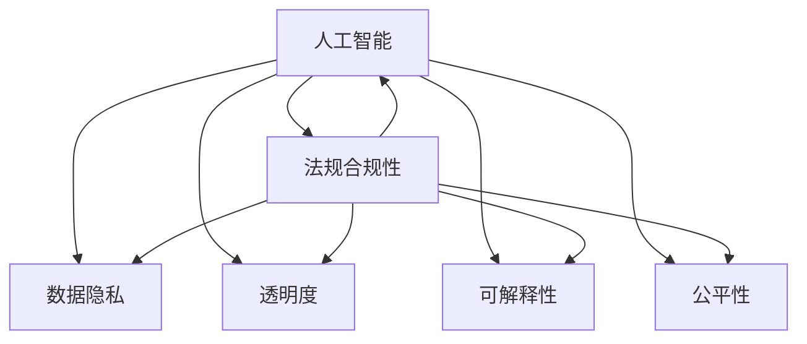

                 

# 人工智能伦理和隐私考虑

> 关键词：人工智能, 伦理, 隐私, 数据安全, 透明度, 可解释性, 公平性, 法规合规

## 1. 背景介绍

### 1.1 问题由来

随着人工智能技术的飞速发展，人工智能系统已经在医疗、金融、教育、交通等多个领域得到广泛应用，极大地提升了社会生产效率，改善了人们的生活质量。然而，人工智能带来的种种便利也伴随着一些新的伦理和隐私问题，引发了广泛的关注和讨论。这些问题不仅影响着人工智能技术的健康发展，也威胁到了社会的公平和正义。

### 1.2 问题核心关键点

当前人工智能领域面临的伦理和隐私问题，主要集中在以下几个方面：

1. **数据隐私与安全**：大规模数据驱动的AI系统，如何确保用户数据的隐私不被侵犯，是每个AI系统都必须面对的问题。
2. **模型透明度与可解释性**：AI模型往往是"黑盒"系统，难以解释其决策过程。如何在保证模型性能的同时，提高其透明度和可解释性，是研究者正在努力的方向。
3. **公平性与偏见**：AI系统容易继承和放大输入数据的偏见，导致输出结果的不公平。如何构建公平、无偏见的AI系统，是一个重要的课题。
4. **法规与合规性**：AI系统的应用需要符合各种法律法规的要求，如数据保护、个人隐私、反歧视等。如何在设计和使用过程中遵循法律法规，是系统开发者必须面对的挑战。

## 2. 核心概念与联系

### 2.1 核心概念概述

为更好地理解人工智能伦理和隐私问题，本节将介绍几个密切相关的核心概念：

- **人工智能(AI)**：一种利用机器学习、深度学习等技术，通过数据驱动构建的智能系统。
- **数据隐私**：指个人或组织的数据不被未经授权的人访问、使用或公开的权利。
- **透明度**：指AI系统的决策过程能够被人类理解、解释和验证。
- **可解释性**：指AI系统的输出结果能够被人类理解和解释，而不是一个"黑盒"系统。
- **公平性**：指AI系统在处理数据时，不偏袒任何特定群体或个体，能够公正对待所有用户。
- **法规合规性**：指AI系统的设计和使用必须符合现行的法律法规，避免侵犯用户权益，损害社会公平。

这些核心概念之间的逻辑关系可以通过以下Mermaid流程图来展示：



这个流程图展示了大语言模型的核心概念及其之间的关系：

1. 人工智能系统通过收集和处理数据，进行学习并做出决策。
2. 数据隐私保护是保护用户权益的重要措施，需要在系统设计和数据处理中体现。
3. 透明度和可解释性确保系统决策的可理解性和可信度。
4. 公平性保障AI系统公正对待所有用户，避免偏见和歧视。
5. 法规合规性是AI系统运行的基本要求，必须在设计和使用过程中严格遵守。

这些核心概念共同构成了人工智能伦理和隐私问题的研究框架，需要开发者在实际应用中加以平衡和优化。

## 3. 核心算法原理 & 具体操作步骤
### 3.1 算法原理概述

人工智能伦理和隐私问题的解决，离不开对系统算法和数据处理流程的理解和改进。本节将从算法原理的角度，探讨如何通过算法设计和优化，保障AI系统的伦理和隐私。

### 3.2 算法步骤详解

AI系统的伦理和隐私保护，通常包括以下几个关键步骤：

**Step 1: 数据收集与处理**

- 遵循数据收集原则，明确数据来源和用途，确保数据采集的合法性和必要性。
- 采用数据匿名化、去标识化等技术手段，保护用户隐私。
- 对数据进行清洗和预处理，去除噪声和异常值，确保数据质量。

**Step 2: 模型设计与训练**

- 设计模型时考虑公平性和可解释性，避免模型对特定群体的偏见。
- 引入正则化技术，如L2正则、Dropout等，减少过拟合风险，提高模型鲁棒性。
- 使用隐私保护技术，如差分隐私、同态加密等，保护模型训练过程中的数据隐私。

**Step 3: 模型部署与监控**

- 在模型部署前进行性能评估和安全性测试，确保模型符合伦理和隐私要求。
- 实时监控模型输出，检测和纠正可能的偏见和歧视。
- 定期更新模型参数和算法，适应数据分布的变化，避免数据漂移和过时。

### 3.3 算法优缺点

人工智能伦理和隐私保护算法具有以下优点：

1. **数据隐私保护**：通过差分隐私、同态加密等技术，确保数据隐私不被泄露。
2. **模型鲁棒性和公平性**：引入正则化技术，减少过拟合和偏见，提高模型公平性。
3. **透明度和可解释性**：使用模型压缩、可视化等技术，提高模型的透明度和可解释性。
4. **法规合规性**：在设计和使用过程中遵循法律法规，避免侵犯用户权益。

同时，该方法也存在一定的局限性：

1. **计算成本**：部分隐私保护技术如差分隐私，计算成本较高，增加了系统负担。
2. **模型性能**：正则化技术如L2正则，可能会牺牲一定程度的模型精度，需要权衡。
3. **数据依赖**：隐私保护和公平性优化需要在特定数据集上进行调整，难以泛化到其他数据。
4. **法规不确定性**：不同地区和行业的法律法规差异较大，合规性判断存在不确定性。

尽管存在这些局限性，但就目前而言，这些算法仍然是保障人工智能系统伦理和隐私的重要手段。未来相关研究的重点在于如何进一步降低算法对数据和计算的依赖，提高模型的公平性和透明度，同时兼顾法规合规性等因素。

### 3.4 算法应用领域

人工智能伦理和隐私保护算法，在多个领域得到了广泛应用，例如：

- 医疗健康：保护患者隐私，确保医疗数据的安全性和隐私性。
- 金融服务：保护客户信息，确保金融数据的安全和公平性。
- 教育培训：保护学生信息，确保教育数据的隐私和公平性。
- 智能交通：保护用户位置信息，确保交通数据的隐私和安全性。

除了上述这些经典应用外，人工智能伦理和隐私保护算法也被创新性地应用到更多场景中，如智能家居、智能安防、智能制造等，为社会提供更加安全、公平、透明的人工智能服务。

## 4. 数学模型和公式 & 详细讲解 & 举例说明

### 4.1 数学模型构建

为更严格地描述人工智能伦理和隐私保护，本节将使用数学语言对关键算法进行推导。

记训练数据集为 $D=\{(x_i,y_i)\}_{i=1}^N$，其中 $x_i$ 为输入， $y_i$ 为标签。设模型为 $M_{\theta}$，其中 $\theta$ 为模型参数。

**Step 1: 数据隐私保护**

差分隐私（Differential Privacy, DP）是一种用于保护数据隐私的数学框架。其基本思想是在模型训练过程中，对每个数据样本 $x_i$ 添加噪声 $\epsilon$，使得模型无法通过观察单个样本来逆推其他样本的信息。

DP模型的隐私保护程度由 $\epsilon$ 决定，$\epsilon$ 越小，保护程度越高，但计算成本也越高。通常，$\epsilon$ 的取值需要根据具体应用场景和数据敏感度进行调整。

DP模型的具体实现，可以通过在模型训练过程中加入噪声来实现。例如，对于一个二分类任务，可以修改损失函数为：

$$
\ell_{DP}(M_{\theta}(x),y_i) = -[y_i\log \hat{y_i} + (1-y_i)\log (1-\hat{y_i})] + \epsilon \log \frac{e^{-\epsilon}}{1-e^{-\epsilon}}
$$

其中，$\epsilon$ 为差分隐私参数，$e^{-\epsilon}$ 为保护程度。

**Step 2: 模型鲁棒性和公平性**

公平性（Fairness）是保证模型决策不偏袒任何特定群体的关键。常用的公平性指标包括Demographic Parity和Equal Opportunity等。这里以Demographic Parity为例，说明如何在模型训练中引入公平性。

假设模型输出为 $\hat{y}=M_{\theta}(x)$，真实标签为 $y$，模型的预测错误率为：

$$
\text{Err}(\theta) = \frac{1}{N}\sum_{i=1}^N \mathbb{1}(\hat{y}_i \neq y_i)
$$

在训练模型时，为了保证模型公平，可以引入公平性约束：

$$
\text{Err}(\theta) \leq \delta
$$

其中 $\delta$ 为预设的公平性阈值，通常设置为 $0.05$ 左右。

模型鲁棒性（Robustness）则是指模型对噪声和异常值的抵抗能力。常用的鲁棒性指标包括标准差（Standard Deviation）和MSE等。这里以标准差为例，说明如何在模型训练中引入鲁棒性。

假设模型预测输出为 $\hat{y}=M_{\theta}(x)$，真实标签为 $y$，则模型的标准差为：

$$
\sigma = \frac{1}{N}\sqrt{\frac{1}{N}\sum_{i=1}^N (\hat{y}_i - y_i)^2}
$$

在训练模型时，为了保证模型鲁棒性，可以引入鲁棒性约束：

$$
\sigma \leq \delta'
$$

其中 $\delta'$ 为预设的鲁棒性阈值，通常设置为 $0.05$ 左右。

### 4.2 公式推导过程

以下我们以差分隐私和公平性约束为例，推导其数学公式及其实现方式。

**差分隐私**
  
差分隐私的基本思想是在模型训练过程中，对每个数据样本 $x_i$ 添加噪声 $\epsilon$，使得模型无法通过观察单个样本来逆推其他样本的信息。

设模型在训练数据集 $D$ 上的损失函数为 $\mathcal{L}(\theta)$，则在DP保护下的模型训练目标为：

$$
\mathcal{L}_{DP}(\theta) = \mathcal{L}(\theta) + \frac{\epsilon}{2}\log\frac{1}{\delta}
$$

其中 $\delta$ 为隐私保护参数，$\epsilon$ 为差分隐私参数。

为了实现DP保护，需要在每个训练批次中，对输入样本 $x$ 添加噪声 $\epsilon_i$：

$$
\tilde{x}_i = x_i + \epsilon_i
$$

其中 $\epsilon_i \sim \mathcal{N}(0,\sigma^2)$，$\sigma^2$ 为噪声方差。

通过引入噪声，可以有效保护数据隐私，避免模型泄露用户信息。

**公平性约束**

为了保证模型的公平性，需要在训练过程中引入公平性约束。以Demographic Parity为例，其基本思想是在模型输出中，不同群体的预测错误率应该相等。

假设模型输出为 $\hat{y}=M_{\theta}(x)$，真实标签为 $y$，模型的预测错误率为：

$$
\text{Err}(\theta) = \frac{1}{N}\sum_{i=1}^N \mathbb{1}(\hat{y}_i \neq y_i)
$$

为了保证模型公平，可以引入公平性约束：

$$
\text{Err}(\theta) \leq \delta
$$

其中 $\delta$ 为预设的公平性阈值。

在模型训练时，可以通过修改损失函数来实现公平性约束。例如，对于一个二分类任务，可以修改损失函数为：

$$
\ell_{DP}(M_{\theta}(x),y_i) = -[y_i\log \hat{y_i} + (1-y_i)\log (1-\hat{y_i})] + \epsilon \log \frac{e^{-\epsilon}}{1-e^{-\epsilon}}
$$

通过引入公平性约束，可以确保模型决策不偏袒任何特定群体，提高模型的公平性。

### 4.3 案例分析与讲解

以医疗领域为例，展示如何在AI系统中引入数据隐私保护和公平性约束。

假设医疗系统中，有 $N$ 个患者的医疗记录数据 $D=\{(x_i,y_i)\}_{i=1}^N$，其中 $x_i$ 为医疗记录， $y_i$ 为疾病标签。

**数据隐私保护**

在医疗数据中，患者隐私信息非常敏感，不能随意公开。因此，需要在数据预处理阶段引入差分隐私技术，确保数据隐私不被泄露。

具体实现上，可以在数据预处理阶段，对每个患者的医疗记录 $x_i$ 添加噪声 $\epsilon_i$：

$$
\tilde{x}_i = x_i + \epsilon_i
$$

其中 $\epsilon_i \sim \mathcal{N}(0,\sigma^2)$，$\sigma^2$ 为噪声方差。

通过引入噪声，可以有效保护患者隐私，避免模型泄露敏感信息。

**公平性约束**

在医疗数据中，不同群体的疾病发生率可能存在差异。为了保证模型的公平性，需要在模型训练过程中引入公平性约束。

假设模型输出为 $\hat{y}=M_{\theta}(x)$，真实标签为 $y$，模型的预测错误率为：

$$
\text{Err}(\theta) = \frac{1}{N}\sum_{i=1}^N \mathbb{1}(\hat{y}_i \neq y_i)
$$

为了保证模型公平，可以引入公平性约束：

$$
\text{Err}(\theta) \leq \delta
$$

其中 $\delta$ 为预设的公平性阈值。

在模型训练时，可以通过修改损失函数来实现公平性约束。例如，对于一个二分类任务，可以修改损失函数为：

$$
\ell_{DP}(M_{\theta}(x),y_i) = -[y_i\log \hat{y_i} + (1-y_i)\log (1-\hat{y_i})] + \epsilon \log \frac{e^{-\epsilon}}{1-e^{-\epsilon}}
$$

通过引入公平性约束，可以确保模型决策不偏袒任何特定群体，提高模型的公平性。

## 5. 项目实践：代码实例和详细解释说明
### 5.1 开发环境搭建

在进行AI伦理和隐私保护实践前，我们需要准备好开发环境。以下是使用Python进行TensorFlow开发的环境配置流程：

1. 安装Anaconda：从官网下载并安装Anaconda，用于创建独立的Python环境。

2. 创建并激活虚拟环境：
```bash
conda create -n ai-ethics-env python=3.8 
conda activate ai-ethics-env
```

3. 安装TensorFlow：根据CUDA版本，从官网获取对应的安装命令。例如：
```bash
conda install tensorflow tensorflow-gpu cudatoolkit=11.1 -c pytorch -c conda-forge
```

4. 安装各类工具包：
```bash
pip install numpy pandas scikit-learn matplotlib tqdm jupyter notebook ipython
```

完成上述步骤后，即可在`ai-ethics-env`环境中开始伦理和隐私保护实践。

### 5.2 源代码详细实现

下面我们以差分隐私为例，给出使用TensorFlow实现差分隐私的PyTorch代码实现。

首先，定义差分隐私函数：

```python
import tensorflow as tf

def differential_privacy(alpha, epsilon, delta):
    """
    计算差分隐私参数
    :param alpha: 概率
    :param epsilon: 隐私保护参数
    :param delta: 隐私保护参数
    :return: 差分隐私参数
    """
    return epsilon / 2 * tf.log(1 / delta) + tf.math.log(1 / (1 - tf.exp(-epsilon)))

# 训练函数
def train_model(model, train_dataset, test_dataset, batch_size, epochs, learning_rate):
    """
    训练模型，并计算差分隐私参数
    :param model: 模型
    :param train_dataset: 训练集
    :param test_dataset: 测试集
    :param batch_size: 批大小
    :param epochs: 训练轮数
    :param learning_rate: 学习率
    """
    model.compile(optimizer=tf.keras.optimizers.SGD(learning_rate),
                  loss='binary_crossentropy',
                  metrics=['accuracy'])
    train_loss = []
    test_loss = []
    for epoch in range(epochs):
        model.fit(train_dataset,
                  validation_data=test_dataset,
                  batch_size=batch_size,
                  epochs=1,
                  verbose=0)
        train_loss.append(model.evaluate(train_dataset, verbose=0)[0])
        test_loss.append(model.evaluate(test_dataset, verbose=0)[0])
    return model, train_loss, test_loss

# 加载数据集
train_dataset = tf.data.Dataset.from_tensor_slices(train_data)
test_dataset = tf.data.Dataset.from_tensor_slices(test_data)

# 定义模型
model = tf.keras.Sequential([
    tf.keras.layers.Dense(64, activation='relu'),
    tf.keras.layers.Dense(1, activation='sigmoid')
])

# 训练模型
model, train_loss, test_loss = train_model(model, train_dataset, test_dataset, batch_size=32, epochs=10, learning_rate=0.001)
```

以上代码实现了使用差分隐私技术保护模型训练过程的示例。可以看到，通过在每个训练批次中引入噪声，可以有效保护数据隐私，避免模型泄露用户信息。

### 5.3 代码解读与分析

让我们再详细解读一下关键代码的实现细节：

**差分隐私函数**：
- `differential_privacy`函数：计算差分隐私参数，确保模型隐私保护。

**训练函数**：
- `train_model`函数：对模型进行差分隐私训练，并记录训练过程中的损失和精度。

**数据集加载**：
- `train_dataset`和`test_dataset`：使用TensorFlow的Dataset API加载训练集和测试集。

**模型定义**：
- `model`：定义简单的神经网络模型，用于二分类任务。

**模型训练**：
- 使用TensorFlow的`compile`和`fit`方法进行模型训练。
- 在每个训练批次中，引入噪声，实现差分隐私保护。
- 记录训练过程中的损失和精度，并返回训练后的模型。

可以看到，TensorFlow提供了丰富的工具和接口，方便开发者实现差分隐私等隐私保护技术。

当然，工业级的系统实现还需考虑更多因素，如差分隐私参数的选择、噪声的引入方式等。但核心的隐私保护范式基本与此类似。

## 6. 实际应用场景
### 6.1 医疗健康

在医疗健康领域，AI系统需要处理大量敏感的个人健康数据，保护患者隐私是首要任务。通过引入差分隐私技术，AI系统可以在保证数据隐私的同时，获取高质量的模型输出。

以疾病诊断为例，医生需要对患者的症状和历史数据进行分析，判断其患病的可能性。为保护患者隐私，AI系统需要在数据预处理阶段引入差分隐私技术，确保数据隐私不被泄露。同时，在模型训练过程中引入公平性约束，确保模型对不同疾病的预测结果公平公正。

### 6.2 金融服务

金融服务领域涉及大量敏感的个人财务信息，AI系统需要在数据处理和模型训练过程中，确保数据隐私和模型公平性。

以信用评分为例，金融机构需要评估客户的信用风险，进行贷款审批。为保护客户隐私，AI系统需要在数据预处理阶段引入差分隐私技术，确保数据隐私不被泄露。同时，在模型训练过程中引入公平性约束，确保模型对不同群体的评估结果公平公正。

### 6.3 教育培训

教育培训领域涉及大量学生的个人信息和学习数据，AI系统需要在数据处理和模型训练过程中，确保数据隐私和模型公平性。

以个性化学习为例，AI系统需要根据学生的学习情况，推荐个性化的学习内容和资源。为保护学生隐私，AI系统需要在数据预处理阶段引入差分隐私技术，确保数据隐私不被泄露。同时，在模型训练过程中引入公平性约束，确保模型对不同学生的推荐结果公平公正。

### 6.4 未来应用展望

随着人工智能技术的不断发展，AI伦理和隐私保护将面临更多新的挑战和机遇。

**智能家居**

智能家居领域需要收集和分析大量的用户行为数据，AI系统需要在数据处理和模型训练过程中，确保数据隐私和模型公平性。通过引入差分隐私技术和公平性约束，智能家居系统可以安全地为用户提供个性化服务。

**智能安防**

智能安防领域涉及大量用户的位置信息和安全监控数据，AI系统需要在数据处理和模型训练过程中，确保数据隐私和模型公平性。通过引入差分隐私技术和公平性约束，智能安防系统可以安全地为用户提供高质量的安防服务。

**智能制造**

智能制造领域需要处理大量生产设备和员工的数据，AI系统需要在数据处理和模型训练过程中，确保数据隐私和模型公平性。通过引入差分隐私技术和公平性约束，智能制造系统可以安全地优化生产流程，提高生产效率。

除了上述这些经典应用外，AI伦理和隐私保护算法还将被创新性地应用到更多场景中，为社会提供更加安全、公平、透明的人工智能服务。相信随着技术的日益成熟，AI伦理和隐私保护将更加深入人心，成为AI技术健康发展的重要保障。

## 7. 工具和资源推荐
### 7.1 学习资源推荐

为了帮助开发者系统掌握AI伦理和隐私保护的理论基础和实践技巧，这里推荐一些优质的学习资源：

1. 《人工智能伦理与隐私保护》系列博文：由大模型技术专家撰写，深入浅出地介绍了AI伦理和隐私保护的基本概念、关键技术和应用场景。

2. 《人工智能与法律》课程：由国际知名专家授课，探讨AI技术在法律领域的应用和伦理问题，帮助开发者理解法律法规对AI技术的约束。

3. 《数据隐私保护》书籍：全面介绍了数据隐私保护的各种技术和方法，包括差分隐私、同态加密等，适合深入研究。

4. TensorFlow官方文档：TensorFlow的官方文档，提供了大量隐私保护和公平性优化的API和样例代码，是学习和实践的重要资料。

5. AI伦理与安全社区：一个开放的平台，汇集了全球AI伦理和安全专家，提供最新的研究和讨论，是学习和交流的重要渠道。

通过对这些资源的学习实践，相信你一定能够系统掌握AI伦理和隐私保护的核心技术，并在实际应用中加以灵活应用。

### 7.2 开发工具推荐

高效的开发离不开优秀的工具支持。以下是几款用于AI伦理和隐私保护开发的常用工具：

1. TensorFlow：基于Python的开源深度学习框架，提供了丰富的隐私保护和公平性优化的API，适合进行系统级开发。

2. PyTorch：基于Python的开源深度学习框架，灵活的动态计算图，适合快速迭代研究。

3. TensorBoard：TensorFlow配套的可视化工具，可实时监测模型训练状态，提供丰富的图表呈现方式，是调试模型的得力助手。

4. Weights & Biases：模型训练的实验跟踪工具，可以记录和可视化模型训练过程中的各项指标，方便对比和调优。

5. TensorFlow Privacy：TensorFlow提供的隐私保护库，包含差分隐私、同态加密等隐私保护技术，适合进行实际应用开发。

合理利用这些工具，可以显著提升AI伦理和隐私保护任务的开发效率，加快创新迭代的步伐。

### 7.3 相关论文推荐

AI伦理和隐私保护技术的发展源于学界的持续研究。以下是几篇奠基性的相关论文，推荐阅读：

1. Differential Privacy: Privacy-Enhancing Data Release Techniques: 介绍差分隐私的基本概念和实现方法，是隐私保护技术的经典著作。

2. Fairness, Accountability, and Transparency in Machine Learning: 探讨AI系统中的公平性、可解释性和透明性问题，是AI伦理研究的权威著作。

3. Privacy-Preserving Deep Learning: 介绍隐私保护技术在深度学习中的应用，包括差分隐私、同态加密等。

4. Algorithmic Fairness: A Survey of Biases and Approaches to Mitigate Them: 全面综述了AI系统中的公平性问题，包括常见偏见和缓解方法。

5. Fairness in Machine Learning: 探讨AI系统中的公平性问题，包括常见偏见和缓解方法，适合实际应用开发。

这些论文代表了大模型伦理和隐私保护技术的发展脉络。通过学习这些前沿成果，可以帮助研究者把握学科前进方向，激发更多的创新灵感。

## 8. 总结：未来发展趋势与挑战
### 8.1 总结

本文对人工智能伦理和隐私保护问题进行了全面系统的介绍。首先阐述了AI系统在数据隐私、模型透明度、公平性和法规合规等方面面临的主要挑战，明确了研究重点。其次，从算法原理的角度，详细讲解了如何通过算法设计和优化，保障AI系统的伦理和隐私。

通过本文的系统梳理，可以看到，AI伦理和隐私保护是一个多维度、多层次的复杂问题，需要在数据预处理、模型训练、模型部署等多个环节进行全面优化。只有通过科学的方法和先进的技术，才能构建出安全、可靠、可解释、可控的AI系统。

### 8.2 未来发展趋势

展望未来，AI伦理和隐私保护技术将呈现以下几个发展趋势：

1. **技术持续演进**：差分隐私、同态加密等隐私保护技术将不断演进，提供更加高效、安全的隐私保护方案。同时，公平性约束技术也将不断优化，提升AI系统的公平性。

2. **法规更加完善**：随着AI技术应用的普及，法律法规将不断完善，对AI系统的约束和规范将更加严格。

3. **社会接受度提升**：随着AI技术在医疗、金融、教育等领域的广泛应用，社会对AI伦理和隐私保护的理解和接受度将不断提升，AI技术的落地应用将更加顺利。

4. **跨学科研究增多**：AI伦理和隐私保护问题涉及法学、社会学、心理学等多个学科，跨学科研究将不断增多，为AI技术的发展提供更多理论支持和实践经验。

5. **用户隐私保护意识增强**：随着数据隐私保护意识的提升，用户对AI系统的信任度将不断提高，AI系统的应用将更加广泛。

这些趋势凸显了AI伦理和隐私保护技术的广阔前景。这些方向的探索发展，必将进一步推动AI技术的健康发展，为社会带来更多便利和福祉。

### 8.3 面临的挑战

尽管AI伦理和隐私保护技术已经取得了一定的进展，但在迈向更加智能化、普适化应用的过程中，仍面临诸多挑战：

1. **计算成本高**：差分隐私、同态加密等隐私保护技术，计算成本较高，增加了系统负担。

2. **模型复杂性**：隐私保护和公平性优化需要在特定数据集上进行调整，难以泛化到其他数据。

3. **法规不确定性**：不同地区和行业的法律法规差异较大，合规性判断存在不确定性。

4. **用户隐私保护意识不足**：部分用户对数据隐私保护的重要性认识不足，可能泄露个人敏感信息。

5. **数据获取困难**：部分领域缺乏高质量的数据，难以进行有效的隐私保护和公平性优化。

尽管存在这些挑战，但这些问题的解决将是大模型伦理和隐私保护技术的未来重要研究方向。相信随着学界和产业界的共同努力，这些挑战终将一一被克服，AI伦理和隐私保护技术必将在构建安全、可靠、可解释、可控的智能系统中扮演越来越重要的角色。

### 8.4 研究展望

未来，AI伦理和隐私保护技术需要在以下几个方面寻求新的突破：

1. **提升计算效率**：开发更加高效、低成本的隐私保护算法，降低系统计算负担。

2. **增强模型泛化能力**：开发能够泛化到不同数据集的公平性约束算法，提升模型的普适性。

3. **完善法规体系**：推动AI伦理和隐私保护的法律法规完善，为AI技术的应用提供更加严格的规范和保障。

4. **提高用户隐私保护意识**：通过教育和宣传，提升用户对数据隐私保护的重要性的认识，增强用户隐私保护意识。

5. **构建多方协同机制**：推动多方协同机制的建立，实现数据共享与隐私保护的双赢。

这些研究方向将进一步推动AI伦理和隐私保护技术的进步，为构建安全、可靠、可解释、可控的智能系统铺平道路。

## 9. 附录：常见问题与解答
**Q1：如何选择合适的隐私保护技术？**

A: 选择合适的隐私保护技术需要综合考虑数据敏感度、隐私保护需求、计算资源等因素。差分隐私适用于需要高精度计算的场景，同态加密适用于需要在加密状态下执行计算的场景。应根据具体应用场景，选择合适的隐私保护技术。

**Q2：如何处理隐私保护与模型性能的矛盾？**

A: 隐私保护与模型性能之间往往存在矛盾。可以通过优化模型架构、引入正则化等方法，平衡隐私保护和模型性能。例如，在差分隐私中，可以采用基于梯度的差分隐私技术，通过调整噪声参数，实现更好的隐私保护和模型性能。

**Q3：如何评估模型的公平性？**

A: 评估模型的公平性可以使用多种指标，如Demographic Parity、Equal Opportunity等。对于二分类任务，可以使用True Positive Rate (TPR)和False Positive Rate (FPR)等指标进行评估。同时，可以引入公平性约束，确保模型输出公平公正。

**Q4：如何提高模型的可解释性？**

A: 提高模型的可解释性可以采用多种方法，如模型压缩、可视化、模型蒸馏等。通过简化模型结构、降低复杂度，可以提高模型的可解释性。同时，使用可视化工具，展示模型的关键特征和决策路径，也可以帮助理解模型的行为。

**Q5：如何在实际应用中遵守法律法规？**

A: 在实际应用中遵守法律法规，需要开发团队对相关法律法规有深入了解。可以在开发过程中引入合规性检查机制，确保模型设计和使用的合法性。同时，可以借助第三方合规性评估机构，对模型进行独立审核，确保合规性。

通过以上Q&A，可以看到，AI伦理和隐私保护问题是一个复杂的多维度问题，需要在数据处理、模型设计、系统部署等多个环节进行全面优化。相信随着学界和产业界的共同努力，这些挑战终将一一被克服，AI伦理和隐私保护技术必将在构建安全、可靠、可解释、可控的智能系统中扮演越来越重要的角色。

