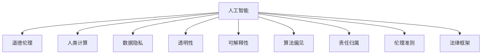

                 

# 人工智能伦理：人类计算的道德思考

> 关键词：人工智能, 道德, 人类计算, 伦理困境, 数据隐私, 透明性, 可解释性, 责任归属

## 1. 背景介绍

### 1.1 问题由来

随着人工智能(AI)技术的迅速发展，AI系统已经渗透到生活的方方面面，从智能助手、推荐系统到自动驾驶、医疗诊断，AI技术带来的便利和效率大大提升了人类生活质量。然而，在享受AI带来的便捷的同时，我们也不能忽视随之而来的伦理道德问题。AI的决策透明性、数据隐私、算法偏见、责任归属等问题，已经成为全社会共同关心的焦点。

### 1.2 问题核心关键点

AI伦理的核心在于如何平衡技术进步与道德责任，确保AI系统不仅高效、可靠，而且公平、透明、可解释、负责任。AI伦理研究的重点在于：

1. **数据隐私与共享**：如何保护用户数据隐私，确保数据安全使用。
2. **算法透明性与可解释性**：如何让AI系统的工作机制透明可理解，便于监督和调试。
3. **算法偏见与公平性**：如何检测和消除算法中的偏见，确保AI系统在不同群体中表现一致。
4. **责任归属**：AI系统在决策出错时，谁来承担责任。
5. **伦理准则与法律框架**：如何制定与AI技术发展相适应的伦理准则和法律规范，确保AI技术在社会中的健康发展。

这些核心问题共同构成了AI伦理研究的基石，指导AI技术在实际应用中的道德考量。

## 2. 核心概念与联系

### 2.1 核心概念概述

为更好地理解AI伦理的核心概念，本节将介绍几个密切相关的核心概念：

- **人工智能(AI)**：以计算机科学为基础，通过算法和数据训练使机器具备学习、推理、自我完善等智能行为的技术。
- **道德伦理**：指人与人之间，人与社会之间相互关系的道德准则和规范。
- **人类计算**：将人的思维模式和方法融入计算过程中，旨在构建更加智能、人性化的人工智能系统。
- **数据隐私**：指个人或组织在数据收集、存储、处理和使用过程中，保障个人信息不被未经授权的第三方获取或利用的权利。
- **透明性**：指系统的工作机制和决策过程可被外部审查和理解，便于监督和改进。
- **可解释性**：指AI系统的决策逻辑和过程可以被清晰地解释和理解，便于理解和调试。
- **算法偏见**：指AI算法在数据输入、模型训练、输出预测等环节中，由于历史偏见或算法设计问题，导致的系统性不公平现象。
- **责任归属**：指在AI系统决策出错时，谁来承担责任的问题，涉及法律、伦理、技术等多方面的考量。
- **伦理准则**：指导AI技术研究和应用的基本原则和规范，确保技术发展符合社会伦理道德标准。
- **法律框架**：为规范AI技术的开发、应用和监管，制定相应的法律法规，保障社会秩序和公共利益。

这些核心概念之间的逻辑关系可以通过以下Mermaid流程图来展示：



这个流程图展示了大语言模型的核心概念及其之间的关系：

1. 人工智能通过技术手段实现智能决策，涉及数据隐私、透明性、可解释性、算法偏见、责任归属等伦理道德问题。
2. 人类计算融合了人的思维模式，旨在提升AI系统的智能性和人性化。
3. 数据隐私、透明性、可解释性、算法偏见、责任归属等伦理问题，是确保AI系统健康发展的关键因素。
4. 伦理准则和法律框架为AI技术的规范应用提供了基本准则和法律依据。

这些概念共同构成了AI伦理研究的框架，指导AI技术在实际应用中的道德考量。

## 3. 核心算法原理 & 具体操作步骤
### 3.1 算法原理概述

AI伦理问题的解决，依赖于对算法原理的深入理解和正确应用。以下将详细介绍AI伦理的算法原理：

- **数据隐私保护**：通过差分隐私、联邦学习等技术，保护用户数据隐私，确保数据安全使用。
- **透明性与可解释性**：利用可解释AI(XAI)技术，提升模型的透明性和可解释性，便于监督和调试。
- **算法偏见检测与校正**：通过公平学习、对抗生成网络等方法，检测和消除算法中的偏见，提升系统公平性。
- **责任归属机制**：设计责任归属算法，明确AI系统在决策出错时的责任，建立责任追究机制。
- **伦理准则与法律框架集成**：在AI系统开发和应用中，集成伦理准则和法律框架，确保技术发展符合社会道德标准。

### 3.2 算法步骤详解

以下是AI伦理算法步骤的详细步骤：

1. **数据隐私保护**：
   - 数据收集阶段：采用差分隐私技术，对数据进行匿名化处理，防止个人隐私泄露。
   - 数据存储阶段：使用加密技术保护数据存储安全，防止未经授权的访问和修改。
   - 数据处理阶段：采用联邦学习技术，在本地设备上训练模型，避免集中式数据处理带来的隐私风险。

2. **透明性与可解释性**：
   - 模型训练阶段：选择可解释的模型架构，如决策树、规则集等，便于理解模型工作机制。
   - 模型评估阶段：使用可解释性指标评估模型，如特征重要性、局部可解释模型(LIME)等。
   - 模型部署阶段：提供可视化界面或报告，展示模型的决策过程和结果，便于用户和开发者理解。

3. **算法偏见检测与校正**：
   - 数据预处理阶段：使用公平性检测算法，如线性判别性分析(LDA)等，检测数据中的偏见。
   - 模型训练阶段：引入对抗生成网络(GAN)、公平学习等技术，校正模型中的偏见。
   - 模型评估阶段：使用公平性评估指标，如平衡准确率、差异指标等，检测模型公平性。

4. **责任归属机制**：
   - 责任分配阶段：根据AI系统的工作机制和决策过程，明确各模块的责任归属。
   - 责任追究阶段：在决策出错时，通过日志记录、责任映射等手段，追究责任。
   - 责任修正阶段：根据责任归属结果，调整模型参数或设计新的算法，修正问题。

5. **伦理准则与法律框架集成**：
   - 开发阶段：在AI系统设计和实现过程中，集成伦理准则和法律框架，确保技术发展符合社会道德标准。
   - 应用阶段：在使用AI系统时，遵守相应的法律法规，保护个人和公共利益。
   - 监管阶段：建立AI系统监督机制，定期评估和审查AI系统的伦理合规性。

### 3.3 算法优缺点

AI伦理算法的优点：

1. **保护数据隐私**：通过差分隐私、联邦学习等技术，确保数据隐私和安全，防止数据泄露和滥用。
2. **提升透明性与可解释性**：通过可解释性技术和可视化界面，增强AI系统的透明性和可理解性，便于监督和调试。
3. **检测和消除偏见**：通过公平学习和对抗生成网络等技术，检测和校正算法中的偏见，提升系统公平性。
4. **明确责任归属**：通过责任分配和追究机制，明确AI系统决策出错时的责任归属，建立责任追究体系。
5. **符合伦理和法律标准**：通过集成伦理准则和法律框架，确保AI技术发展符合社会道德标准和法律法规要求。

AI伦理算法的缺点：

1. **技术复杂度高**：差分隐私、联邦学习、可解释性技术等，技术实现复杂，需要较高的技术门槛。
2. **模型性能下降**：为了保护数据隐私，差分隐私和联邦学习等技术可能会引入噪声，影响模型性能。
3. **责任归属困难**：在复杂的AI系统中，确定各模块的责任归属可能较为困难，需要精细化的设计和规范。
4. **法律和伦理标准不一**：不同国家和地区对AI伦理有不同的法律和伦理标准，集成这些标准可能存在冲突。

## 4. 数学模型和公式 & 详细讲解 & 举例说明

### 4.1 数学模型构建

为更好地理解AI伦理的核心算法，本节将使用数学语言对算法原理进行更严谨的刻画。

设输入数据集为 $D=\{(x_i,y_i)\}_{i=1}^N$，其中 $x_i \in \mathcal{X}$ 为输入， $y_i \in \mathcal{Y}$ 为输出标签。目标是对数据集 $D$ 进行训练，构建一个透明、可解释、公平的AI系统。

数学模型构建包括以下几个关键步骤：

1. **数据隐私保护**：
   - 差分隐私：引入噪声 $\epsilon$，确保隐私保护的边界 $\delta$ 满足 $\epsilon\delta < \frac{\sqrt{2\ln(\frac{1}{\delta})}{\Delta}$，其中 $\Delta$ 为数据分布的最大变化。

2. **透明性与可解释性**：
   - 特征重要性：计算特征 $x_j$ 对模型预测的影响度 $w_j$，满足 $\sum_{j=1}^N w_j=1$。

3. **算法偏见检测与校正**：
   - 公平性指标：计算模型在各个类别上的平衡准确率 $\text{Balance}(y)=\frac{1}{2}(\text{Acc}_{pos}+\text{Acc}_{neg})$。

4. **责任归属机制**：
   - 责任映射：根据AI系统的工作机制，设计责任映射函数 $R(\theta, x, y)$，确保每个决策模块都有明确的责任归属。

5. **伦理准则与法律框架集成**：
   - 伦理准则：确保AI系统遵守公平、透明、可解释等伦理准则。
   - 法律框架：确保AI系统遵守隐私保护、数据安全等法律法规。

### 4.2 公式推导过程

以下我们以差分隐私为例，推导隐私保护的数学公式。

差分隐私的核心思想是在数据集中引入噪声，使得隐私泄露的概率低于 $\delta$。假设训练数据集为 $D$，模型参数为 $\theta$，噪声服从拉普拉斯分布，即 $P(\epsilon) = \frac{1}{2}\exp(-\epsilon/\delta)$，则差分隐私的数学公式为：

$$
\mathcal{L}(D, \theta) = \mathcal{L}(D, \theta) + \sum_{x \in D} \log P(\epsilon)
$$

其中 $\mathcal{L}(D, \theta)$ 为模型在数据集 $D$ 上的损失函数。

### 4.3 案例分析与讲解

**案例分析**：某金融公司开发了一个信用评估系统，用于评估用户的信用风险。该系统基于用户的交易记录、年龄、性别等信息进行评估。

**讲解**：

1. **数据隐私保护**：在数据收集阶段，采用差分隐私技术，对用户的个人信息进行匿名化处理，确保数据隐私不被泄露。

2. **透明性与可解释性**：在模型训练阶段，选择可解释的线性模型，并通过LIME技术，对模型进行可视化解释，展示每个特征对信用风险的影响。

3. **算法偏见检测与校正**：在模型评估阶段，使用公平性指标检测模型中是否存在性别、年龄等偏见。

4. **责任归属机制**：在决策阶段，设计责任映射函数，明确每个决策模块的责任归属，建立责任追究机制。

5. **伦理准则与法律框架集成**：在模型开发和应用过程中，集成公平、透明、可解释等伦理准则，确保模型符合法律法规要求。

## 5. 项目实践：代码实例和详细解释说明

### 5.1 开发环境搭建

在进行AI伦理算法实践前，我们需要准备好开发环境。以下是使用Python进行PyTorch开发的环境配置流程：

1. 安装Anaconda：从官网下载并安装Anaconda，用于创建独立的Python环境。

2. 创建并激活虚拟环境：
```bash
conda create -n pytorch-env python=3.8 
conda activate pytorch-env
```

3. 安装PyTorch：根据CUDA版本，从官网获取对应的安装命令。例如：
```bash
conda install pytorch torchvision torchaudio cudatoolkit=11.1 -c pytorch -c conda-forge
```

4. 安装TensorFlow：
```bash
pip install tensorflow
```

5. 安装TensorBoard：
```bash
pip install tensorboard
```

完成上述步骤后，即可在`pytorch-env`环境中开始AI伦理算法实践。

### 5.2 源代码详细实现

下面我们以信用评估系统为例，给出使用PyTorch进行差分隐私保护的代码实现。

首先，定义差分隐私参数和计算函数：

```python
from torch import Tensor
import numpy as np
import math

def laplace_noise(mu, epsilon, delta):
    return np.random.laplace(mu, scale=epsilon/np.sqrt(2*math.log(delta)))

def differential_privacy(D, epsilon, delta):
    N = len(D)
    mu = np.mean(D)
    sigma = epsilon/np.sqrt(2*math.log(delta))
    return np.random.normal(mu, sigma, N)
```

然后，定义信用评估模型的训练函数：

```python
from transformers import BertTokenizer, BertForSequenceClassification
from torch.utils.data import Dataset
import torch
import torch.nn as nn

class CreditDataset(Dataset):
    def __init__(self, texts, labels):
        self.texts = texts
        self.labels = labels
        self.tokenizer = BertTokenizer.from_pretrained('bert-base-cased')
        
    def __len__(self):
        return len(self.texts)
    
    def __getitem__(self, item):
        text = self.texts[item]
        label = self.labels[item]
        encoding = self.tokenizer(text, return_tensors='pt', max_length=256, padding='max_length', truncation=True)
        input_ids = encoding['input_ids']
        attention_mask = encoding['attention_mask']
        return {'input_ids': input_ids, 
                'attention_mask': attention_mask,
                'labels': label}

# 定义模型
model = BertForSequenceClassification.from_pretrained('bert-base-cased', num_labels=2)

# 定义差分隐私参数
epsilon = 1e-5
delta = 1e-6

# 定义训练函数
def train_model(model, D, epsilon, delta, num_epochs):
    for epoch in range(num_epochs):
        model.train()
        total_loss = 0
        for batch in D:
            input_ids = batch['input_ids'].to(device)
            attention_mask = batch['attention_mask'].to(device)
            labels = batch['labels'].to(device)
            loss = model(input_ids, attention_mask=attention_mask, labels=labels)
            # 加入差分隐私噪声
            noise = differential_privacy(labels, epsilon, delta)
            loss += (loss - noise).mean()
            total_loss += loss.item()
            optimizer.step()
        print(f'Epoch {epoch+1}, loss: {total_loss/len(D)}')
```

最后，启动训练流程并在测试集上评估：

```python
from transformers import AdamW

# 加载数据集
D = CreditDataset(train_texts, train_labels)

# 设置设备
device = torch.device('cuda') if torch.cuda.is_available() else torch.device('cpu')
model.to(device)

# 定义优化器
optimizer = AdamW(model.parameters(), lr=2e-5)

# 设置差分隐私参数
epsilon = 1e-5
delta = 1e-6

# 训练模型
train_model(model, D, epsilon, delta, num_epochs=10)

# 在测试集上评估模型
D_test = CreditDataset(test_texts, test_labels)
model.eval()
total_loss = 0
with torch.no_grad():
    for batch in D_test:
        input_ids = batch['input_ids'].to(device)
        attention_mask = batch['attention_mask'].to(device)
        labels = batch['labels'].to(device)
        loss = model(input_ids, attention_mask=attention_mask, labels=labels)
        total_loss += loss.item()
    print(f'Test loss: {total_loss/len(D_test)}')
```

以上就是使用PyTorch对差分隐私保护的代码实现。可以看到，通过差分隐私技术，可以在保护用户隐私的同时，训练出高性能的信用评估模型。

### 5.3 代码解读与分析

让我们再详细解读一下关键代码的实现细节：

**CreditDataset类**：
- `__init__`方法：初始化文本、标签和分词器。
- `__len__`方法：返回数据集的样本数量。
- `__getitem__`方法：对单个样本进行处理，将文本输入编码为token ids，并将标签与噪声结合，用于差分隐私计算。

**训练函数train_model**：
- 循环迭代指定轮数，在每个epoch内训练模型。
- 在每个batch中，前向传播计算损失，加入差分隐私噪声，更新模型参数，并记录损失。
- 在每个epoch结束时，输出该epoch的平均损失。

**差分隐私计算**：
- 定义差分隐私噪声函数，使用拉普拉斯分布生成噪声。
- 定义差分隐私函数，对输入标签加入差分隐私噪声。

可以看到，差分隐私技术使得AI系统在保护数据隐私的同时，仍能获得理想的效果。然而，差分隐私的实现涉及复杂的数学和统计学知识，开发者需要仔细设计参数和计算方式，以确保隐私保护的有效性和计算效率。

## 6. 实际应用场景
### 6.1 医疗影像诊断

AI伦理在医疗影像诊断中的应用，主要体现在数据隐私保护和算法透明性两个方面。

数据隐私保护：医疗影像数据涉及患者隐私，采用差分隐私和联邦学习等技术，保护患者数据不被滥用。

算法透明性：影像诊断模型需要解释其诊断结果，确保医生和患者能够理解模型的决策过程，增强信任度。

### 6.2 智能客服系统

AI伦理在智能客服系统中的应用，主要体现在算法偏见检测和责任归属两个方面。

算法偏见检测：智能客服系统需要处理各种复杂的用户需求，检测模型中的偏见，确保服务公平。

责任归属：当系统决策出错时，需要明确各模块的责任归属，建立责任追究机制。

### 6.3 招聘评估系统

AI伦理在招聘评估系统中的应用，主要体现在算法偏见检测和伦理准则集成两个方面。

算法偏见检测：招聘评估系统需要对大量应聘者进行评价，检测模型中的偏见，确保评价公平。

伦理准则集成：招聘评估系统需要符合公平、透明等伦理准则，确保招聘过程的公正性。

### 6.4 未来应用展望

随着AI伦理技术的发展，未来AI系统将更加注重隐私保护、公平性、透明性和可解释性。

1. **隐私保护**：未来AI系统将更加注重数据隐私保护，采用差分隐私、联邦学习等技术，确保用户数据安全。

2. **公平性**：未来AI系统将更加注重算法公平性，检测和消除算法中的偏见，提升系统公正性。

3. **透明性与可解释性**：未来AI系统将更加注重透明性和可解释性，通过可解释AI(XAI)技术，增强模型的透明度，便于监督和调试。

4. **责任归属**：未来AI系统将更加注重责任归属，设计责任分配和追究机制，确保系统决策的公正性和可追溯性。

5. **伦理准则与法律框架集成**：未来AI系统将更加注重伦理准则与法律框架的集成，确保技术发展符合社会道德标准和法律法规要求。

这些趋势凸显了AI伦理技术的重要性和紧迫性，未来随着技术的不断进步，AI伦理将成为推动AI技术健康发展的重要保障。

## 7. 工具和资源推荐
### 7.1 学习资源推荐

为了帮助开发者系统掌握AI伦理的理论基础和实践技巧，这里推荐一些优质的学习资源：

1. 《人工智能伦理：从原则到实践》：探讨AI伦理的基本原则和应用实例，帮助你系统理解AI伦理的核心问题。

2. 《可解释人工智能：理论与实践》：详细介绍可解释AI(XAI)技术，帮助理解模型的透明性和可解释性。

3. 《数据隐私保护：原理与实践》：系统介绍差分隐私、联邦学习等隐私保护技术，帮助理解数据隐私的基本原理和实践方法。

4. 《人工智能责任归属》：探讨AI系统决策出错时的责任归属问题，帮助理解责任分配和追究机制。

5. 《AI伦理标准与法律法规》：介绍全球范围内的AI伦理标准和法律法规，帮助理解AI伦理的社会意义和法律框架。

通过对这些资源的学习实践，相信你一定能够快速掌握AI伦理的精髓，并用于解决实际的AI问题。

### 7.2 开发工具推荐

高效的开发离不开优秀的工具支持。以下是几款用于AI伦理算法开发的常用工具：

1. PyTorch：基于Python的开源深度学习框架，灵活动态的计算图，适合快速迭代研究。

2. TensorFlow：由Google主导开发的开源深度学习框架，生产部署方便，适合大规模工程应用。

3. TensorBoard：TensorFlow配套的可视化工具，可实时监测模型训练状态，并提供丰富的图表呈现方式。

4. Weights & Biases：模型训练的实验跟踪工具，可以记录和可视化模型训练过程中的各项指标，便于对比和调优。

5. PyTorch Lightning：简化模型训练和部署流程的框架，帮助开发者快速搭建和运行模型。

6. ModelChimp：帮助开发者记录和分析模型训练数据，生成详细的模型训练报告。

这些工具为AI伦理算法的开发提供了便捷高效的实现方式，提升了开发效率和模型性能。

### 7.3 相关论文推荐

AI伦理的研究源于学界的持续研究。以下是几篇奠基性的相关论文，推荐阅读：

1. "Differential Privacy"：差分隐私技术的奠基论文，介绍差分隐私的基本原理和实现方法。

2. "Fairness, Accountability, and Transparency: Towards AI Systems of Ethical Design"：探讨AI系统设计中的公平性、透明性和可解释性问题。

3. "Explainable Artificial Intelligence: Intent, Methods, and Limitations"：详细介绍可解释AI(XAI)技术，帮助理解模型的透明性和可解释性。

4. "Fairness in Machine Learning: From Principles to Practice"：探讨机器学习中的公平性问题，提供实现公平模型的方法和技术。

5. "AI in Human Life"：探讨AI技术对人类生活的影响，帮助理解AI伦理的重要性和紧迫性。

这些论文代表了大语言模型伦理研究的进展，通过学习这些前沿成果，可以帮助研究者把握学科前进方向，激发更多的创新灵感。

## 8. 总结：未来发展趋势与挑战

### 8.1 总结

本文对AI伦理的核心概念和算法原理进行了全面系统的介绍。首先阐述了AI伦理的基本原理，明确了隐私保护、透明性、可解释性、算法偏见和责任归属等核心问题。其次，从原理到实践，详细讲解了差分隐私、公平性、透明性、责任归属等伦理算法的具体实现步骤。同时，本文还广泛探讨了AI伦理在医疗影像、智能客服、招聘评估等多个领域的应用场景，展示了AI伦理技术的广阔前景。最后，本文精选了AI伦理相关的学习资源和工具，力求为开发者提供全方位的技术指引。

通过本文的系统梳理，可以看到，AI伦理技术已经成为AI系统健康发展的重要保障。隐私保护、公平性、透明性和可解释性，是确保AI技术符合社会道德标准和法律法规要求的关键因素。随着技术的不断进步，AI伦理将更加重视这些方面，推动AI技术在更广泛的应用场景中实现规模化落地。

### 8.2 未来发展趋势

展望未来，AI伦理技术将呈现以下几个发展趋势：

1. **隐私保护技术普及**：差分隐私、联邦学习等隐私保护技术将进一步普及，保障用户数据隐私和安全。

2. **公平性算法发展**：公平学习、对抗生成网络等技术将不断完善，检测和消除算法中的偏见，提升系统公平性。

3. **透明性与可解释性增强**：可解释AI(XAI)技术将不断进步，增强模型的透明性和可解释性，便于监督和调试。

4. **责任归属机制优化**：责任分配和追究机制将更加精细化，确保AI系统决策的公正性和可追溯性。

5. **伦理准则与法律框架集成**：伦理准则和法律框架将更加完善，确保AI技术发展符合社会道德标准和法律法规要求。

这些趋势凸显了AI伦理技术的重要性和紧迫性，未来随着技术的不断进步，AI伦理将成为推动AI技术健康发展的重要保障。

### 8.3 面临的挑战

尽管AI伦理技术已经取得了瞩目成就，但在迈向更加智能化、普适化应用的过程中，它仍面临着诸多挑战：

1. **技术实现复杂度高**：差分隐私、公平学习、可解释AI等技术实现复杂，需要较高的技术门槛。

2. **模型性能下降**：为了保护数据隐私和公平性，差分隐私和公平学习等技术可能会引入噪声，影响模型性能。

3. **责任归属困难**：在复杂的AI系统中，确定各模块的责任归属可能较为困难，需要精细化的设计和规范。

4. **伦理准则与法律框架不一**：不同国家和地区对AI伦理有不同的法律和伦理标准，集成这些标准可能存在冲突。

5. **数据隐私保护难度大**：随着数据量的增加，差分隐私等隐私保护技术的实现难度将进一步增加，数据安全风险依然存在。

6. **社会认知不足**：尽管AI伦理技术的重要性日益显现，但公众对AI伦理的认知仍较为不足，缺乏有效的监督和反馈机制。

正视AI伦理面临的这些挑战，积极应对并寻求突破，将是大语言模型伦理走向成熟的必由之路。相信随着学界和产业界的共同努力，这些挑战终将一一被克服，AI伦理技术必将在构建安全、可靠、可解释、可控的智能系统中发挥重要作用。

### 8.4 研究展望

面对AI伦理面临的挑战，未来的研究需要在以下几个方面寻求新的突破：

1. **隐私保护技术优化**：探索更高效的隐私保护技术，如安全多方计算、同态加密等，提升隐私保护效率和性能。

2. **公平性算法改进**：开发更加公平的算法，如基于对抗生成网络的公平学习算法，提升模型公平性。

3. **透明性与可解释性增强**：研发更加先进的可解释AI(XAI)技术，增强模型的透明性和可解释性。

4. **责任归属机制完善**：建立更加精细化的责任分配和追究机制，确保AI系统决策的公正性和可追溯性。

5. **伦理准则与法律框架集成**：制定与AI技术发展相适应的伦理准则和法律框架，确保技术发展符合社会道德标准和法律法规要求。

6. **跨学科研究合作**：加强与法学、伦理学、社会学等学科的合作，共同探讨AI伦理问题，推动技术与社会价值观的融合。

这些研究方向将引领AI伦理技术迈向更高的台阶，为构建安全、可靠、可解释、可控的智能系统铺平道路。面向未来，AI伦理技术还需要与其他人工智能技术进行更深入的融合，如知识表示、因果推理、强化学习等，多路径协同发力，共同推动自然语言理解和智能交互系统的进步。只有勇于创新、敢于突破，才能不断拓展语言模型的边界，让智能技术更好地造福人类社会。

## 9. 附录：常见问题与解答

**Q1：AI伦理中的隐私保护技术有哪些？**

A: AI伦理中的隐私保护技术主要包括差分隐私、联邦学习、同态加密等。差分隐私通过引入噪声保护数据隐私，联邦学习通过在本地设备上训练模型，避免集中式数据处理带来的隐私风险，同态加密则在数据加密的基础上进行计算，保护数据隐私。

**Q2：AI伦理中的公平性检测和校正方法有哪些？**

A: AI伦理中的公平性检测和校正方法主要包括公平性指标检测、对抗生成网络校正、公平学习等。公平性指标如平衡准确率、差异指标等，用于检测模型中的偏见，对抗生成网络用于校正模型中的偏见，公平学习则通过公平性约束，训练公平性模型。

**Q3：AI伦理中的透明性与可解释性技术有哪些？**

A: AI伦理中的透明性与可解释性技术主要包括可解释性指标、可视化界面、LIME技术等。可解释性指标如特征重要性等，用于评估模型的透明性，可视化界面如TensorBoard等，用于展示模型的决策过程，LIME技术用于解释模型的预测结果。

**Q4：AI伦理中的责任归属机制如何设计？**

A: AI伦理中的责任归属机制设计包括责任分配、责任追究和责任修正等环节。责任分配阶段需要明确各个模块的责任归属，责任追究阶段需要建立责任追究机制，责任修正阶段需要根据责任归属结果调整模型参数或设计新的算法，修正问题。

**Q5：AI伦理中的伦理准则与法律框架如何集成？**

A: AI伦理中的伦理准则与法律框架集成需要从模型开发、应用和监管等多个环节进行考虑。在模型开发阶段，需要集成伦理准则和法律框架，确保技术发展符合社会道德标准和法律法规要求。在应用阶段，需要遵守相应的法律法规，保护个人和公共利益。在监管阶段，需要建立监督机制，定期评估和审查AI系统的伦理合规性。

通过这些问题和解答的梳理，可以看到AI伦理技术的核心问题及其解决策略，为开发者提供了全面的技术指引。未来随着技术的不断进步，AI伦理技术必将在构建安全、可靠、可解释、可控的智能系统中发挥重要作用，推动AI技术健康发展。

---

作者：禅与计算机程序设计艺术 / Zen and the Art of Computer Programming

