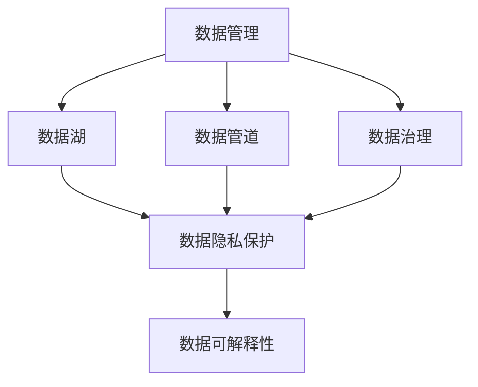

                 

# 人工智能创业数据管理的经验分享

## 1. 背景介绍

### 1.1 问题由来
人工智能(AI)领域的快速发展，给众多企业带来了广阔的商业机会。然而，AI创业项目往往需要处理大规模数据，且数据管理和隐私保护要求极高，这对大多数AI创业者来说是一个巨大的挑战。

### 1.2 问题核心关键点
数据管理是AI创业成功的关键环节，涉及数据采集、存储、清洗、分析和应用等各个方面。具体而言，数据管理需关注：

- 数据的合法合规性。确保数据来源合法，符合隐私保护法规。
- 数据的多样性和代表性。数据质量直接影响模型训练效果。
- 数据的及时性和稳定性。数据需实时更新，保证模型输出的一致性和准确性。
- 数据的隐私保护和安全性。避免数据泄露和滥用，保护用户隐私。
- 数据的易用性和可扩展性。数据需便于开发者利用，便于后期系统的迭代和扩展。

数据管理不当，可能导致数据缺失、数据噪声、模型过拟合、系统漏洞等问题，严重影响AI项目的效果和安全性。

## 2. 核心概念与联系

### 2.1 核心概念概述

为深入理解AI创业的数据管理问题，本节介绍几个关键概念：

- 数据管理(Data Management)：涉及数据的采集、存储、清洗、分析和应用的全过程。数据管理质量直接影响AI模型的效果和可靠性。
- 数据湖(Data Lake)：一种分布式存储架构，用于存储和管理海量数据，支持异构数据源、实时数据处理和高效分析。
- 数据管道(Data Pipeline)：一种自动化数据处理流程，用于数据从生成到使用的整个生命周期管理，包括数据采集、清洗、集成、转换等步骤。
- 数据治理(Data Governance)：通过数据标准、质量管理、安全管理等手段，确保数据的质量、合规和安全，保障数据资产的价值。
- 数据隐私保护(Portable Data Protection, PDP)：通过技术和管理手段，保护用户隐私数据，防止数据滥用。
- 数据可解释性(Explainability)：确保AI模型输出的结果具有可解释性，便于开发者理解和调试。

这些概念之间的逻辑关系可以用以下Mermaid流程图来展示：



该流程图展示了大数据管理的关键组件和其内在联系：

1. 数据管理贯穿数据的全生命周期，涵盖了数据湖和数据管道的建设和运营。
2. 数据湖提供数据存储和管理支持，数据管道负责数据的处理和流动。
3. 数据治理通过标准和策略管理，保障数据质量、安全和隐私。
4. 数据隐私保护是数据治理的重要组成部分，防止数据泄露和滥用。
5. 数据可解释性确保模型的透明度，便于开发者和用户理解。

## 3. 核心算法原理 & 具体操作步骤
### 3.1 算法原理概述

AI创业项目的数据管理，本质上是对数据进行全生命周期的治理，以确保数据的高质量、高效用和安全合规。具体包括以下几个关键步骤：

1. **数据采集**：从各个数据源收集数据，包括内部数据和外部数据。
2. **数据存储**：使用数据湖架构，高效存储和管理海量数据。
3. **数据清洗**：对原始数据进行预处理，消除噪声和异常值。
4. **数据集成**：将来自不同数据源的数据集成到一个统一的数据仓库中，确保数据的一致性和完整性。
5. **数据转换**：对数据进行格式转换和特征工程，支持模型的输入要求。
6. **数据使用**：将数据输入到AI模型中，进行训练和推理。
7. **数据反馈**：根据模型输出，对数据进行再次处理，持续优化数据质量。

### 3.2 算法步骤详解

以下是AI创业数据管理的具体操作步骤：

**Step 1: 数据采集**
- 确定数据源：内部业务系统、第三方API、传感器等。
- 定义数据格式：确定数据的结构和类型，如CSV、JSON、XML等。
- 数据采集工具：使用ETL工具(如Apache Nifi、Talend)自动采集数据。

**Step 2: 数据存储**
- 搭建数据湖：使用Hadoop、Spark等技术，搭建分布式数据存储架构。
- 数据分区和索引：根据数据属性进行分区，设置索引以提高查询效率。
- 数据一致性：使用分布式事务控制，确保数据的一致性。

**Step 3: 数据清洗**
- 数据预处理：填充缺失值、处理异常值、数据归一化等。
- 数据去重：去重处理，消除数据中的重复记录。
- 数据转换：统一数据格式和命名规则，如标准化日期格式、统一单位等。

**Step 4: 数据集成**
- 数据集成工具：使用ETL工具，如Apache NiFi、Talend，进行数据集成。
- 数据校验：对集成后的数据进行校验，确保数据一致性。
- 数据转换：对数据进行格式转换和转换，满足模型输入要求。

**Step 5: 数据转换**
- 特征工程：对数据进行特征提取、变换和选择，提升模型效果。
- 数据归一化：归一化处理，如标准化、归一化、降维等。
- 数据增强：通过数据增强技术，增加数据样本，提升模型鲁棒性。

**Step 6: 数据使用**
- 数据加载：将数据加载到模型中，进行训练和推理。
- 模型训练：使用机器学习算法对数据进行模型训练，如回归、分类、聚类等。
- 模型推理：对新数据进行推理，输出预测结果。

**Step 7: 数据反馈**
- 数据监控：实时监控模型输出，及时发现和处理异常数据。
- 数据优化：根据模型输出，对数据进行再次处理，优化数据质量。
- 数据迭代：持续迭代模型和数据，不断提升系统性能。

### 3.3 算法优缺点

数据管理的优点包括：

1. 数据质量高：通过严格的清洗和校验，确保数据的质量和一致性。
2. 数据易用性：统一的数据标准和格式，便于开发者和用户使用。
3. 数据安全性：通过加密和访问控制，保护数据的隐私和安全。
4. 数据可解释性：对模型输出的结果进行解释，增强信任度。
5. 数据可扩展性：通过分布式存储和计算，支持大规模数据处理。

缺点包括：

1. 数据处理复杂：数据采集、清洗、集成和转换等步骤繁琐。
2. 数据量大：海量数据的管理和存储对计算和存储资源要求高。
3. 数据隐私风险：数据隐私保护难度大，易发生数据泄露。
4. 数据使用复杂：需要具备数据建模和分析的能力，才能有效利用数据。
5. 数据依赖性强：对数据源的依赖性高，数据中断可能影响业务连续性。

尽管存在这些缺点，但数据管理仍然是AI创业不可或缺的关键环节。有效的数据管理，能够提升AI系统的性能和可靠性，保障AI创业的成功。

### 3.4 算法应用领域

数据管理技术已经广泛应用于AI创业的各个领域，包括：

- 金融科技：通过大数据分析，提升风险评估和客户管理能力。
- 医疗健康：通过数据整合和分析，提升医疗诊断和治疗效果。
- 智能制造：通过数据采集和分析，优化生产流程，提高生产效率。
- 智能客服：通过数据分析和挖掘，提升客户服务质量和效率。
- 智能交通：通过数据整合和分析，提升交通管理和运营效率。
- 智能家居：通过数据分析，提升智能家居设备的使用体验和安全性。

这些应用领域都依赖于高效的数据管理和分析，以实现业务优化和智能化升级。

## 4. 数学模型和公式 & 详细讲解 & 举例说明

### 4.1 数学模型构建

本节将使用数学语言对数据管理过程进行更加严格的刻画。

假设原始数据集为 $D=\{(x_i,y_i)\}_{i=1}^N$，其中 $x_i$ 为数据样本，$y_i$ 为标签。数据管理的目标是构建一个高效的数据管道 $P$，使得 $P(D)$ 能够高质量地输入到模型中，支持模型训练和推理。

数据管道 $P$ 的模型构建包括以下步骤：

1. **数据采集模块 $A$**：从不同数据源采集数据，生成数据流 $A(D)$。
2. **数据存储模块 $S$**：对采集到的数据进行存储，生成数据集 $S(A(D))$。
3. **数据清洗模块 $C$**：对存储的数据进行清洗和处理，生成干净数据集 $C(S(A(D)))$。
4. **数据集成模块 $I$**：将清洗后的数据进行集成和转换，生成统一数据集 $I(C(S(A(D))))$。
5. **数据转换模块 $T$**：对集成后的数据进行特征工程和转换，生成模型输入数据 $T(I(C(S(A(D)))))$。
6. **数据使用模块 $U$**：将数据输入到模型中，进行训练和推理，生成模型输出 $U(T(I(C(S(A(D))))))$。

### 4.2 公式推导过程

以下我们以金融风控为例，推导数据管理过程的数学模型。

假设原始数据集 $D$ 包含贷款申请的各项特征和是否违约的标签 $y$。数据管理的目标是构建一个高效的数据管道 $P$，生成模型输入数据 $T(I(C(S(A(D)))))$，用于支持风控模型的训练和推理。

1. **数据采集模块 $A$**：从内部业务系统和第三方API采集贷款申请数据，生成数据流 $A(D)$。
2. **数据存储模块 $S$**：使用Hadoop架构存储采集到的数据，生成数据集 $S(A(D))$。
3. **数据清洗模块 $C$**：对存储的数据进行去重、缺失值填充、异常值处理等操作，生成干净数据集 $C(S(A(D)))$。
4. **数据集成模块 $I$**：将清洗后的数据进行格式转换和归一化处理，生成统一数据集 $I(C(S(A(D))))$。
5. **数据转换模块 $T$**：对集成后的数据进行特征工程，如特征选择、特征提取、降维等操作，生成模型输入数据 $T(I(C(S(A(D)))))$。
6. **数据使用模块 $U$**：将数据输入到风控模型中，进行训练和推理，生成模型输出 $U(T(I(C(S(A(D))))))$。

通过上述步骤，我们得到了数据管道 $P$ 的数学模型：

$$
P(D) = T(I(C(S(A(D)))))
$$

### 4.3 案例分析与讲解

假设某金融公司使用数据管道处理贷款申请数据，生成模型输入数据用于风控模型的训练和推理。具体步骤如下：

1. **数据采集模块 $A$**：从内部贷款管理系统和第三方信用评估平台采集数据，生成数据流 $A(D)$。
2. **数据存储模块 $S$**：使用Hadoop架构存储采集到的数据，生成数据集 $S(A(D))$。
3. **数据清洗模块 $C$**：对存储的数据进行去重、缺失值填充、异常值处理等操作，生成干净数据集 $C(S(A(D)))$。
4. **数据集成模块 $I$**：将清洗后的数据进行格式转换和归一化处理，生成统一数据集 $I(C(S(A(D))))$。
5. **数据转换模块 $T$**：对集成后的数据进行特征工程，如选择重要的特征、提取文本特征、进行降维等操作，生成模型输入数据 $T(I(C(S(A(D)))))$。
6. **数据使用模块 $U$**：将数据输入到风控模型中，进行训练和推理，生成模型输出 $U(T(I(C(S(A(D))))))$。

通过上述数据管道，该公司能够高效、准确地处理贷款申请数据，提升风控模型的训练效果和推理性能。

## 5. 项目实践：代码实例和详细解释说明

### 5.1 开发环境搭建

在进行数据管理项目实践前，需要先搭建好开发环境。以下是使用Python和Apache Nifi搭建数据管道环境的流程：

1. 安装Apache Nifi：从官网下载并安装Apache Nifi，用于搭建数据管道。

2. 创建和配置数据源：定义不同数据源的采集组件，如数据库连接、API接口等。

3. 配置数据流和转换组件：配置数据流处理和转换组件，如ETL工具、数据清洗组件、特征工程组件等。

4. 搭建数据湖：使用Hadoop或Spark等技术，搭建分布式数据存储架构。

5. 部署和管理数据管道：将配置好的数据管道部署到Apache Nifi中，进行数据采集、存储、清洗、集成和转换。

6. 搭建数据治理系统：配置数据标准、质量管理、安全管理等模块，保障数据质量和安全。

完成上述步骤后，即可在Apache Nifi中搭建高效的数据管道，对数据进行全生命周期管理。

### 5.2 源代码详细实现

下面我们以金融风控为例，给出使用Apache Nifi和Hadoop搭建数据管道的Python代码实现。

首先，配置Apache Nifi的数据源和数据流：

```python
# 配置数据源
processGroup = NiFiController.addNewProcessGroup("Data Source Group")

flowFileInput = NiFiController.addNewFlowFileSource(
    processGroup, 
    "Source Name", 
    dataSourceUrl="jdbc:mysql://localhost:3306/mydb",
    databaseType="MySQL",
    username="root",
    password="password",
    query="SELECT * FROM loan_applications"
)

# 配置数据流
flowFileProcess = NiFiController.addNewFlowFileProcess(
    processGroup, 
    "Process Name", 
    flowFileInput
)

# 配置数据清洗和集成
flowFileTransform = NiFiController.addNewFlowFileTransformer(
    processGroup, 
    "Transformer Name", 
    flowFileProcess
)

flowFileFilter = NiFiController.addNewFlowFileFilter(
    processGroup, 
    "Filter Name", 
    flowFileTransform
)

flowFileBatch = NiFiController.addNewFlowFileBatch(
    processGroup, 
    "Batch Name", 
    flowFileFilter
)

# 配置数据转换和存储
flowFileOutput = NiFiController.addNewFlowFileProcess(
    processGroup, 
    "Output Name", 
    flowFileBatch
)

dataFlow = NiFiController.addNewFlow(
    processGroup, 
    "Data Flow Name", 
    flowFileInput, 
    flowFileOutput
)

# 保存配置并启动数据管道
NiFiController.publishConfiguration(dataFlow)
NiFiController.startProcessGroup(processGroup)
```

然后，配置Hadoop数据湖：

```python
from pyspark.sql import SparkSession

# 创建SparkSession
spark = SparkSession.builder.appName("Data Lake").getOrCreate()

# 加载数据
data = spark.read.table("loan_applications")

# 数据清洗和转换
cleaned_data = data.dropna().dropDuplicates().select("feature1", "feature2", "label").withColumn("feature3", Fvensor(f"feature1", f"feature2"))

# 数据存储
cleaned_data.write.format("parquet").mode("overwrite").saveAsTable("cleaned_data")

# 数据使用
model = spark.loadModel("path/to/model")
predictions = model.transform(cleaned_data)

# 输出结果
predictions.show()
```

### 5.3 代码解读与分析

让我们再详细解读一下关键代码的实现细节：

**Apache Nifi配置**：
- `processGroup`：创建一个新的处理组，用于组织和管理数据流。
- `flowFileInput`：定义数据源连接，从MySQL数据库中查询贷款申请数据。
- `flowFileProcess`：将数据源连接连接到数据流中。
- `flowFileTransform`：在数据流中增加数据清洗和转换组件。
- `flowFileFilter`：过滤数据流中的无效数据。
- `flowFileBatch`：将过滤后的数据进行批量处理。
- `flowFileOutput`：将数据输出到Hadoop数据湖中。
- `dataFlow`：将数据流保存到NiFi中，并启动处理。

**Hadoop数据湖配置**：
- `spark`：创建SparkSession，用于处理和分析数据。
- `data`：从Hadoop数据湖中读取贷款申请数据。
- `cleaned_data`：对数据进行清洗、去重和特征提取。
- `cleaned_data.write`：将清洗后的数据存储到Hadoop数据湖中。
- `model`：加载风控模型。
- `predictions`：使用风控模型对贷款申请数据进行推理，生成预测结果。
- `predictions.show`：展示预测结果。

## 6. 实际应用场景

### 6.1 智能客服系统

智能客服系统需要处理大量的用户咨询请求，数据管理和隐私保护至关重要。通过高效的数据管道，可以实现数据的自动采集、清洗、集成和转换，提升客服系统的响应速度和质量。

在技术实现上，可以搭建多个数据管道，分别处理不同来源的数据，如用户注册信息、聊天记录、行为数据等。通过数据集成和转换，将各种数据整合在一起，供智能客服系统使用。同时，对敏感数据进行脱敏处理，确保用户隐私安全。

### 6.2 金融风控系统

金融风控系统依赖于大量的金融数据，数据管理和隐私保护尤为重要。通过高效的数据管道，可以实现数据的自动采集、清洗、集成和转换，提升风控模型的训练效果和推理性能。

在技术实现上，可以搭建多个数据管道，分别处理不同来源的数据，如贷款申请、还款记录、信用评分等。通过数据集成和转换，将各种数据整合在一起，供风控模型使用。同时，对敏感数据进行加密和脱敏处理，确保数据隐私安全。

### 6.3 医疗健康系统

医疗健康系统需要处理大量的患者数据，数据管理和隐私保护同样重要。通过高效的数据管道，可以实现数据的自动采集、清洗、集成和转换，提升医疗诊断和治疗的效果。

在技术实现上，可以搭建多个数据管道，分别处理不同来源的数据，如患者病历、诊断报告、检查结果等。通过数据集成和转换，将各种数据整合在一起，供医疗诊断和治疗系统使用。同时，对敏感数据进行加密和脱敏处理，确保患者隐私安全。

### 6.4 未来应用展望

随着数据管理技术的不断发展，未来的AI创业项目将更加依赖高效的数据管道和数据湖。数据管理不仅限于数据采集、清洗、集成和转换，还将涉及更多的数据治理和隐私保护技术。

未来，数据管理将与更多前沿技术结合，如区块链、联邦学习、隐私计算等，形成更加安全、可靠的数据生态系统。通过这些技术的协同发力，AI创业项目将能够更好地利用数据资源，实现业务优化和智能化升级。

## 7. 工具和资源推荐

### 7.1 学习资源推荐

为了帮助开发者系统掌握数据管理的技术基础和实践技巧，这里推荐一些优质的学习资源：

1. 《大数据技术实战》系列博文：详细讲解大数据技术栈，包括Hadoop、Spark、Flink等组件。

2. 《数据管道设计与实现》课程：介绍数据管道的架构和设计，讲解Apache Nifi的使用方法。

3. 《数据治理》书籍：介绍数据治理的基本概念和实践方法，涵盖数据标准、质量管理、安全管理等内容。

4. 《隐私保护技术》课程：讲解隐私保护的基本原理和前沿技术，如差分隐私、同态加密等。

5. 《大数据技术手册》：涵盖大数据技术的全栈内容，包括数据采集、存储、处理、分析和应用。

通过对这些资源的学习实践，相信你一定能够快速掌握数据管理的精髓，并用于解决实际的AI问题。

### 7.2 开发工具推荐

高效的数据管理离不开优秀的工具支持。以下是几款用于数据管道和数据湖开发的常用工具：

1. Apache Nifi：基于Web的ETL工具，用于自动化数据管道构建和数据流处理。

2. Apache Spark：分布式计算框架，支持数据处理和分析，适合大规模数据处理。

3. Apache Hadoop：分布式存储架构，用于高效存储和管理海量数据。

4. PySpark：Python API，用于Spark的Python接口开发，支持数据分析和机器学习。

5. Jupyter Notebook：交互式开发环境，支持Python、R、Scala等多种语言，方便开发者调试和实验。

6. TensorBoard：TensorFlow配套的可视化工具，用于监控模型训练状态，展示模型性能。

合理利用这些工具，可以显著提升数据管道和数据湖的开发效率，加快创新迭代的步伐。

### 7.3 相关论文推荐

数据管理技术的研究方向众多，以下是几篇奠基性的相关论文，推荐阅读：

1. Data Management: Concepts and Taxonomy：系统介绍数据管理的基本概念和分类。

2. Towards a Theory of Data-Driven Computing：提出数据驱动计算的基本框架，探讨数据管理的未来方向。

3. A Survey on Privacy-Preserving Data Mining：综述隐私保护的基本技术和方法，涵盖差分隐私、同态加密等内容。

4. Privacy-Preserving Data Sharing Technologies：介绍隐私保护技术的基本原理和应用场景，如多方安全计算、零知识证明等。

5. An Introduction to Big Data: Concepts and Technologies：详细介绍大数据技术栈，包括Hadoop、Spark、Flink等组件。

这些论文代表了大数据管理技术的发展脉络。通过学习这些前沿成果，可以帮助研究者把握学科前进方向，激发更多的创新灵感。

## 8. 总结：未来发展趋势与挑战

### 8.1 总结

本文对AI创业数据管理进行了全面系统的介绍。首先阐述了数据管理在AI创业中的重要性，明确了数据质量、安全、隐私等关键点。其次，从原理到实践，详细讲解了数据管理的具体操作步骤，给出了数据管道和数据湖的实现示例。同时，本文还广泛探讨了数据管理在智能客服、金融风控、医疗健康等多个行业领域的应用前景，展示了数据管理技术的广阔前景。

通过本文的系统梳理，可以看到，数据管理技术在AI创业中占据重要地位，对系统性能和业务价值具有深远影响。高效的数据管理，能够提升AI系统的性能和可靠性，保障AI创业的成功。

### 8.2 未来发展趋势

展望未来，数据管理技术将呈现以下几个发展趋势：

1. 数据质量持续优化。通过数据清洗、校验和增强，提升数据质量，支持更高质量的AI应用。
2. 数据标准化和规范化。制定统一的数据标准和规范，提升数据的易用性和互操作性。
3. 数据安全性和隐私保护。引入更多隐私保护技术，如差分隐私、同态加密等，确保数据隐私安全。
4. 数据治理和合规管理。通过数据标准、质量管理、安全管理等手段，保障数据质量、安全和合规。
5. 数据湖和数据仓库融合。将数据湖和数据仓库技术融合，形成一体化的数据管理和分析平台。
6. 数据驱动的智能决策。利用数据管理和分析技术，支持智能决策和业务优化。

以上趋势凸显了数据管理技术的广阔前景。这些方向的探索发展，必将进一步提升AI系统的性能和可靠性，保障AI创业的成功。

### 8.3 面临的挑战

尽管数据管理技术已经取得了诸多进展，但在迈向更加智能化、普适化应用的过程中，它仍面临着诸多挑战：

1. 数据规模增大。随着业务发展和数据量的增加，数据管理难度和复杂度不断提升。
2. 数据隐私风险。数据隐私保护难度大，易发生数据泄露和滥用。
3. 数据标准化和互操作性。数据标准化和互操作性不足，不同系统之间的数据难以互通。
4. 数据质量和一致性。数据质量管理难度大，易出现数据不一致问题。
5. 数据治理和合规管理。数据治理和合规管理复杂，涉及法规标准众多。
6. 数据使用复杂。数据使用环节复杂，对数据建模和分析的能力要求高。

尽管存在这些挑战，但数据管理仍然是AI创业不可或缺的关键环节。有效的数据管理，能够提升AI系统的性能和可靠性，保障AI创业的成功。

### 8.4 研究展望

面对数据管理面临的诸多挑战，未来的研究需要在以下几个方面寻求新的突破：

1. 探索更多数据管理技术。开发更多高效、易用、安全的数据管理工具和平台，如联邦学习、隐私计算等。
2. 引入更多隐私保护技术。开发更多隐私保护技术，如差分隐私、同态加密等，确保数据隐私安全。
3. 引入更多数据治理技术。开发更多数据治理工具，如数据标准管理、数据质量管理等，保障数据质量和安全。
4. 引入更多智能决策技术。开发更多智能决策工具，如自动数据标注、自动化数据清洗等，提升数据处理效率。
5. 引入更多跨学科技术。将数据管理与其他学科技术结合，如社会学、经济学等，提升数据管理的全面性和深度。

这些研究方向的探索，必将引领数据管理技术迈向更高的台阶，为构建安全、可靠、可解释、可控的智能系统铺平道路。面向未来，数据管理技术还需要与其他人工智能技术进行更深入的融合，如知识表示、因果推理、强化学习等，多路径协同发力，共同推动自然语言理解和智能交互系统的进步。只有勇于创新、敢于突破，才能不断拓展数据管理的边界，让智能技术更好地造福人类社会。

## 9. 附录：常见问题与解答

**Q1：数据管理对AI创业的重要性体现在哪些方面？**

A: 数据管理在AI创业中的重要性主要体现在以下几个方面：
1. 数据质量：高质量的数据是AI模型训练和推理的基础，直接影响模型的效果和可靠性。
2. 数据安全：确保数据隐私和安全，避免数据泄露和滥用，保障用户权益。
3. 数据一致性：确保数据一致性和完整性，避免数据重复和丢失，保证业务连续性。
4. 数据易用性：统一数据标准和格式，便于开发者和用户使用，提升系统效率。
5. 数据扩展性：支持数据的大规模存储和高效处理，适应业务扩展需求。
6. 数据可解释性：提升模型的可解释性，便于开发者理解和调试。

数据管理在AI创业中扮演着重要角色，直接影响系统性能和业务价值。

**Q2：数据管道和数据湖的实现过程中需要注意哪些问题？**

A: 数据管道和数据湖的实现过程中需要注意以下问题：
1. 数据源的可靠性和多样性：确保数据源的可靠性和多样性，避免数据采集中断和数据偏差。
2. 数据流和处理的可靠性：确保数据流的可靠性和处理效率，避免数据丢失和延迟。
3. 数据存储和查询的效率：确保数据存储和查询的效率，避免数据存储和查询成本过高。
4. 数据清洗和转换的准确性：确保数据清洗和转换的准确性，避免数据噪声和异常值。
5. 数据治理和合规管理的规范性：确保数据治理和合规管理的规范性，避免数据泄露和滥用。
6. 数据隐私和安全的保障：确保数据隐私和安全的保障，避免数据泄露和滥用。

合理处理这些问题，可以确保数据管道和数据湖的高效运行，提升数据管理的质量和安全。

**Q3：数据管理的未来发展方向有哪些？**

A: 数据管理的未来发展方向主要包括以下几个方面：
1. 数据标准化和规范化：制定统一的数据标准和规范，提升数据的易用性和互操作性。
2. 数据质量持续优化：通过数据清洗、校验和增强，提升数据质量，支持更高质量的AI应用。
3. 数据安全和隐私保护：引入更多隐私保护技术，如差分隐私、同态加密等，确保数据隐私安全。
4. 数据治理和合规管理：通过数据标准、质量管理、安全管理等手段，保障数据质量、安全和合规。
5. 数据湖和数据仓库融合：将数据湖和数据仓库技术融合，形成一体化的数据管理和分析平台。
6. 数据驱动的智能决策：利用数据管理和分析技术，支持智能决策和业务优化。

数据管理技术的未来发展方向将更加注重数据质量、安全、隐私、治理和智能化应用。

通过本文的系统梳理，可以看到，数据管理技术在AI创业中占据重要地位，对系统性能和业务价值具有深远影响。有效的数据管理，能够提升AI系统的性能和可靠性，保障AI创业的成功。

**Q4：数据管理在智能客服系统中的应用前景如何？**

A: 数据管理在智能客服系统中的应用前景非常广阔：
1. 数据采集：通过高效的数据采集，实时获取用户咨询请求和聊天记录，提升系统响应速度。
2. 数据清洗和转换：对采集到的数据进行清洗和转换，消除噪声和异常值，提升数据质量。
3. 数据存储和查询：通过高效的数据存储和查询，提升数据访问速度，支持智能客服系统的实时处理。
4. 数据治理和隐私保护：通过数据治理和隐私保护技术，确保用户咨询请求和聊天记录的安全性和隐私性。
5. 数据驱动的决策：通过数据分析和挖掘，支持智能客服系统的决策和优化，提升客户服务质量和效率。

数据管理在智能客服系统中具有重要应用价值，能够提升系统的响应速度和质量，提升客户服务体验。

**Q5：如何优化数据管理系统的性能和效率？**

A: 优化数据管理系统的性能和效率，可以从以下几个方面入手：
1. 数据流优化：优化数据流的流向和处理顺序，减少数据传输和处理时间。
2. 数据存储优化：优化数据存储方式，如使用分布式存储、内存计算等技术，提升数据存储和查询效率。
3. 数据清洗和转换优化：优化数据清洗和转换算法，减少数据处理时间，提升数据质量。
4. 数据治理和合规管理优化：优化数据治理和合规管理流程，提升数据质量和安全。
5. 数据隐私和安全的保障：引入更多隐私保护技术，如差分隐私、同态加密等，确保数据隐私安全。
6. 数据驱动的智能决策：引入更多智能决策技术，如自动数据标注、自动化数据清洗等，提升数据处理效率。

合理处理这些问题，可以确保数据管理系统的高效运行，提升数据管理的质量和安全。

通过本文的系统梳理，可以看到，数据管理技术在AI创业中占据重要地位，对系统性能和业务价值具有深远影响。有效的数据管理，能够提升AI系统的性能和可靠性，保障AI创业的成功。

