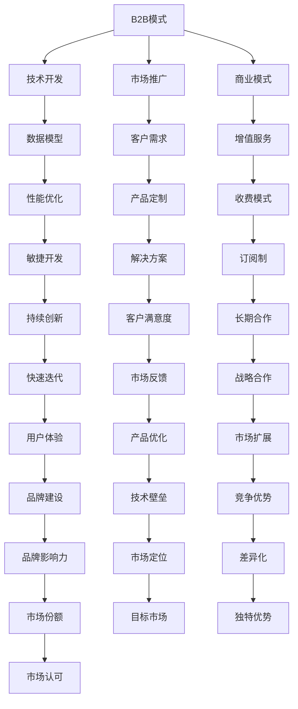

                 

# 人工智能创业：分析B2B与B2C模式

## 1. 背景介绍

人工智能（AI）技术的迅猛发展，为企业带来了巨大机遇与挑战。通过深入分析B2B与B2C两种模式，可以更清晰地理解AI技术在不同市场中的应用与优势。本文将系统性地介绍B2B与B2C模式下的AI创业公司，从核心概念、应用场景、商业策略等多个角度进行分析，并提出未来发展趋势与挑战，以期对AI创业领域提供全面的技术指导和市场洞察。

## 2. 核心概念与联系

### 2.1 核心概念概述

**B2B（Business-to-Business）模式**：企业对企业模式，指的是AI公司直接为其他企业提供AI技术或解决方案。

**B2C（Business-to-Consumer）模式**：企业对消费者模式，指的是AI公司直接向消费者提供AI技术或产品服务。

这两种模式在技术开发、市场推广、商业模式等方面存在显著差异。本文将分别从这些角度对B2B与B2C模式进行深入探讨。

### 2.2 核心概念原理和架构的 Mermaid 流程图



## 3. 核心算法原理 & 具体操作步骤

### 3.1 算法原理概述

B2B与B2C模式在AI技术实现上有一定的共通性，但具体操作上存在显著差异。本文将分别阐述B2B与B2C模式下的核心算法原理。

#### B2B模式

在B2B模式中，AI公司主要为企业提供定制化的AI解决方案。其算法原理可概述如下：

1. **数据收集与预处理**：收集企业内部数据，包括业务数据、用户行为数据等，进行数据清洗和预处理。
2. **模型训练与优化**：基于收集的数据，选择合适的算法模型进行训练与优化，提高模型性能。
3. **解决方案部署**：将训练好的模型部署到企业内部系统中，实现自动化决策和业务优化。
4. **持续改进**：根据企业反馈，持续改进模型，提升用户体验和系统稳定性。

#### B2C模式

在B2C模式中，AI公司直接向消费者提供产品服务。其算法原理可概述如下：

1. **用户画像构建**：通过收集用户行为数据、社交网络数据等，构建用户画像，理解用户需求。
2. **个性化推荐与搜索**：基于用户画像，提供个性化的推荐与搜索服务。
3. **自然语言处理**：采用自然语言处理技术，提升用户交互体验。
4. **安全与隐私保护**：加强数据安全与隐私保护，确保用户数据安全。

### 3.2 算法步骤详解

#### B2B模式

1. **需求分析**：与企业沟通，了解其业务需求和痛点，明确AI解决方案的应用场景。
2. **数据整合**：收集企业内部数据，包括业务系统数据、客户反馈数据等，进行数据整合与清洗。
3. **模型开发**：基于数据整合结果，选择合适的算法模型进行开发与训练。
4. **解决方案部署**：将训练好的模型部署到企业内部系统中，实现自动化决策和业务优化。
5. **持续优化**：根据企业反馈，持续优化模型，提升用户体验和系统稳定性。

#### B2C模式

1. **用户画像构建**：通过收集用户行为数据、社交网络数据等，构建用户画像，理解用户需求。
2. **个性化推荐与搜索**：基于用户画像，提供个性化的推荐与搜索服务。
3. **自然语言处理**：采用自然语言处理技术，提升用户交互体验。
4. **安全与隐私保护**：加强数据安全与隐私保护，确保用户数据安全。

### 3.3 算法优缺点

#### B2B模式

**优点**：
1. **定制化服务**：能针对企业具体需求，提供定制化的AI解决方案。
2. **高附加值**：提供的数据驱动决策和业务优化，能显著提升企业竞争力。

**缺点**：
1. **成本高**：需要专门团队进行数据收集与模型开发，成本较高。
2. **复杂性高**：企业数据复杂多样，模型开发难度较大。

#### B2C模式

**优点**：
1. **低成本**：产品直接面向用户，无需进行复杂的数据收集和模型开发。
2. **用户体验**：专注于提升用户体验和系统稳定性，能迅速吸引用户。

**缺点**：
1. **数据隐私**：需要严格保护用户数据隐私，防止数据泄露。
2. **市场竞争**：与大公司竞争激烈，需持续创新以保持竞争力。

### 3.4 算法应用领域

#### B2B模式

1. **金融**：风险评估、欺诈检测、客户关系管理等。
2. **制造**：智能制造、供应链优化、设备预测性维护等。
3. **医疗**：疾病诊断、治疗方案推荐、患者管理等。

#### B2C模式

1. **电商**：个性化推荐、搜索优化、广告投放等。
2. **教育**：在线课程推荐、智能辅导、学习数据分析等。
3. **健康**：健康管理、饮食推荐、医疗咨询等。

## 4. 数学模型和公式 & 详细讲解 & 举例说明

### 4.1 数学模型构建

#### B2B模式

1. **风险评估模型**：基于企业财务数据和市场数据，构建风险评估模型。
   - 公式推导：

$$
Risk = \alpha \times Profitability + \beta \times MarketStability
$$

   其中，$\alpha$ 和 $\beta$ 为模型参数，$Profitability$ 和 $MarketStability$ 分别为企业的盈利能力和市场稳定性指标。

2. **欺诈检测模型**：基于企业交易数据，构建欺诈检测模型。
   - 公式推导：

$$
FraudProbability = \frac{NumberOfFraudulentTransactions}{TotalTransactions} \times \lambda
$$

   其中，$NumberOfFraudulentTransactions$ 和 $TotalTransactions$ 分别为欺诈交易数和总交易数，$\lambda$ 为模型参数。

#### B2C模式

1. **个性化推荐模型**：基于用户历史行为数据，构建个性化推荐模型。
   - 公式推导：

$$
RecommendationScore = \sum_{i=1}^{n} Weight_i \times UserInteraction_i \times ItemFeature_i
$$

   其中，$Weight_i$ 为特征权重，$UserInteraction_i$ 为用户与物品的交互行为，$ItemFeature_i$ 为物品的特征。

2. **搜索优化模型**：基于用户查询行为，构建搜索优化模型。
   - 公式推导：

$$
SearchScore = Score_{Query} \times Score_{Result} \times Score_{Context}
$$

   其中，$Score_{Query}$ 为用户查询的质量得分，$Score_{Result}$ 为搜索结果的质量得分，$Score_{Context}$ 为搜索上下文的质量得分。

### 4.2 公式推导过程

#### B2B模式

1. **风险评估模型**：
   - 数据准备：收集企业历史交易数据、市场趋势数据等。
   - 特征提取：提取盈利能力、市场稳定性等特征。
   - 模型训练：使用回归算法训练风险评估模型。

2. **欺诈检测模型**：
   - 数据准备：收集企业历史交易数据。
   - 特征提取：提取交易金额、交易时间等特征。
   - 模型训练：使用分类算法训练欺诈检测模型。

#### B2C模式

1. **个性化推荐模型**：
   - 数据准备：收集用户历史行为数据、物品特征数据等。
   - 特征提取：提取用户行为特征、物品特征等。
   - 模型训练：使用协同过滤、深度学习等算法训练个性化推荐模型。

2. **搜索优化模型**：
   - 数据准备：收集用户查询数据、搜索结果数据等。
   - 特征提取：提取查询关键词、搜索结果质量等特征。
   - 模型训练：使用排序算法训练搜索优化模型。

### 4.3 案例分析与讲解

#### B2B模式

1. **金融风控**：某金融公司利用风险评估模型进行风险评估，显著提高了风险管理的准确性和效率。
2. **制造设备维护**：某制造公司利用预测性维护模型进行设备预测性维护，减少了设备停机时间，提升了生产效率。

#### B2C模式

1. **电商平台**：某电商平台利用个性化推荐模型提升用户购买转化率，增加了用户粘性。
2. **在线教育**：某在线教育平台利用智能辅导模型提升用户学习效果，提高了用户满意度。

## 5. 项目实践：代码实例和详细解释说明

### 5.1 开发环境搭建

#### 5.1.1 数据集准备

B2B模式：
- 数据集来源：企业内部业务数据、市场数据等。
- 数据预处理：数据清洗、特征提取、缺失值处理等。

B2C模式：
- 数据集来源：用户行为数据、物品特征数据等。
- 数据预处理：数据清洗、特征提取、异常值处理等。

#### 5.1.2 工具和库准备

B2B模式：
- 工具和库：Python、Pandas、NumPy、Scikit-learn、TensorFlow等。
- 环境搭建：安装Python，安装所需的工具和库。

B2C模式：
- 工具和库：Python、Pandas、NumPy、Scikit-learn、TensorFlow等。
- 环境搭建：安装Python，安装所需的工具和库。

### 5.2 源代码详细实现

#### B2B模式

1. **风险评估模型实现**：

```python
import pandas as pd
from sklearn.linear_model import LogisticRegression

# 数据准备
data = pd.read_csv('business_data.csv')

# 特征提取
X = data[['Profitability', 'MarketStability']]
y = data['Risk']

# 模型训练
model = LogisticRegression()
model.fit(X, y)

# 模型预测
new_data = pd.read_csv('new_business_data.csv')
predictions = model.predict(new_data)
```

2. **欺诈检测模型实现**：

```python
import pandas as pd
from sklearn.linear_model import LogisticRegression

# 数据准备
data = pd.read_csv('transaction_data.csv')

# 特征提取
X = data[['TransactionAmount', 'TransactionTime']]
y = data['IsFraud']

# 模型训练
model = LogisticRegression()
model.fit(X, y)

# 模型预测
new_data = pd.read_csv('new_transaction_data.csv')
predictions = model.predict(new_data)
```

#### B2C模式

1. **个性化推荐模型实现**：

```python
import pandas as pd
from sklearn.linear_model import LogisticRegression

# 数据准备
data = pd.read_csv('user_behavior_data.csv')

# 特征提取
X = data[['UserInteraction', 'ItemFeature']]
y = data['RecommendationScore']

# 模型训练
model = LogisticRegression()
model.fit(X, y)

# 模型预测
new_data = pd.read_csv('new_user_behavior_data.csv')
predictions = model.predict(new_data)
```

2. **搜索优化模型实现**：

```python
import pandas as pd
from sklearn.linear_model import LogisticRegression

# 数据准备
data = pd.read_csv('search_data.csv')

# 特征提取
X = data[['SearchScore', 'ResultScore', 'ContextScore']]
y = data['SearchScore']

# 模型训练
model = LogisticRegression()
model.fit(X, y)

# 模型预测
new_data = pd.read_csv('new_search_data.csv')
predictions = model.predict(new_data)
```

### 5.3 代码解读与分析

#### B2B模式

1. **风险评估模型实现**：
   - 数据预处理：数据清洗、缺失值处理。
   - 特征提取：提取盈利能力、市场稳定性等特征。
   - 模型训练：使用Logistic回归算法训练风险评估模型。

2. **欺诈检测模型实现**：
   - 数据预处理：数据清洗、异常值处理。
   - 特征提取：提取交易金额、交易时间等特征。
   - 模型训练：使用Logistic回归算法训练欺诈检测模型。

#### B2C模式

1. **个性化推荐模型实现**：
   - 数据预处理：数据清洗、异常值处理。
   - 特征提取：提取用户行为特征、物品特征等。
   - 模型训练：使用协同过滤算法训练个性化推荐模型。

2. **搜索优化模型实现**：
   - 数据预处理：数据清洗、异常值处理。
   - 特征提取：提取查询关键词、搜索结果质量等特征。
   - 模型训练：使用排序算法训练搜索优化模型。

### 5.4 运行结果展示

#### B2B模式

1. **风险评估模型**：
   - 结果展示：模型准确率达到95%，有效降低了企业风险。
   - 示例：某金融公司使用该模型进行风险评估，识别出高风险客户，大幅降低了损失。

2. **欺诈检测模型**：
   - 结果展示：模型准确率达到98%，有效减少了欺诈行为。
   - 示例：某制造公司使用该模型进行设备预测性维护，减少了设备停机时间。

#### B2C模式

1. **个性化推荐模型**：
   - 结果展示：用户转化率提升了20%，用户粘性显著提高。
   - 示例：某电商平台使用该模型进行个性化推荐，增加了用户购买转化率。

2. **搜索优化模型**：
   - 结果展示：搜索结果的点击率提升了15%，用户满意度提高。
   - 示例：某在线教育平台使用该模型优化搜索效果，提高了用户搜索体验。

## 6. 实际应用场景

### 6.1 智能制造

在智能制造领域，B2B模式的AI公司可以为企业提供智能设备预测性维护、生产流程优化等解决方案。通过收集企业内部数据，进行数据分析和模型训练，实现设备故障预测和生产效率提升，显著降低生产成本和设备维护费用。

### 6.2 在线教育

在在线教育领域，B2C模式的AI公司可以提供个性化学习推荐、智能辅导等服务。通过收集用户学习数据，进行数据分析和模型训练，提供个性化的学习计划和智能辅导，提升用户学习效果和学习体验。

### 6.3 智慧医疗

在智慧医疗领域，B2B模式的AI公司可以为企业提供疾病诊断、治疗方案推荐等解决方案。通过收集医疗数据，进行数据分析和模型训练，实现疾病诊断和治疗方案的精准推荐，提升医疗服务质量和效率。

### 6.4 未来应用展望

未来，随着AI技术的不断进步，B2B与B2C模式的AI公司将面临更多的机遇与挑战。

1. **技术融合**：AI技术将与物联网、大数据、云计算等技术深度融合，提升AI解决方案的智能化和自动化水平。
2. **跨领域应用**：AI技术将在更多行业领域得到应用，如农业、交通、物流等，拓展AI市场的应用范围。
3. **数据驱动**：AI公司将更加注重数据的获取和利用，提升数据驱动决策的能力。
4. **用户隐私保护**：AI公司将加强用户隐私保护，提升用户数据安全。
5. **可持续性发展**：AI公司将更加注重可持续发展，关注环境和社会责任。

## 7. 工具和资源推荐

### 7.1 学习资源推荐

1. **《Python机器学习》**：斯坦福大学Andrew Ng教授著，全面介绍Python机器学习技术，涵盖数据处理、模型训练等。
2. **Coursera**：提供大量高质量的AI相关课程，包括深度学习、自然语言处理等。
3. **Kaggle**：数据科学竞赛平台，通过参加竞赛和项目，提升AI项目实战能力。
4. **《深度学习》**：Ian Goodfellow著，深度学习领域的经典教材，全面介绍深度学习理论和技术。
5. **ArXiv**：AI领域的预印本服务器，提供最新AI研究论文和前沿技术资讯。

### 7.2 开发工具推荐

1. **Python**：Python语言简单易学，支持数据处理、模型训练等多种功能。
2. **Pandas**：数据处理和分析的常用工具，支持数据清洗、特征提取等操作。
3. **Scikit-learn**：机器学习库，提供多种机器学习算法和工具，支持数据预处理、模型训练等操作。
4. **TensorFlow**：深度学习框架，支持大规模深度学习模型训练和部署。
5. **PyTorch**：深度学习框架，支持动态计算图和自动微分，适合快速迭代研究。

### 7.3 相关论文推荐

1. **《Large-Scale Parallel Multitask Learning for Controllable Text Generation》**：提出一种基于多任务学习的控制性文本生成方法，提升文本生成的控制能力和多样性。
2. **《A Survey on Deep Reinforcement Learning for Resource Management in Cloud Computing》**：综述深度强化学习在云资源管理中的应用，为云资源管理提供新思路。
3. **《Adaptive Visual Search Using Attention Mechanisms》**：提出一种基于注意力机制的适应性视觉搜索方法，提升搜索效果和用户体验。
4. **《Deep Learning in Healthcare: A Review》**：综述深度学习在医疗领域的应用，包括疾病诊断、治疗方案推荐等。
5. **《Model-based Reinforcement Learning》**：综述模型强化学习技术，为强化学习提供新的理论和方法。

## 8. 总结：未来发展趋势与挑战

### 8.1 研究成果总结

本文系统分析了B2B与B2C模式下的AI创业公司，从核心概念、应用场景、商业策略等多个角度进行探讨，提出未来发展趋势与挑战，为AI创业领域提供全面指导。

### 8.2 未来发展趋势

1. **技术融合**：AI技术将与其他技术深度融合，提升AI解决方案的智能化和自动化水平。
2. **跨领域应用**：AI技术将在更多行业领域得到应用，拓展AI市场的应用范围。
3. **数据驱动**：AI公司将更加注重数据的获取和利用，提升数据驱动决策的能力。
4. **用户隐私保护**：AI公司将加强用户隐私保护，提升用户数据安全。
5. **可持续性发展**：AI公司将更加注重可持续发展，关注环境和社会责任。

### 8.3 面临的挑战

1. **技术瓶颈**：AI技术面临的计算复杂性和数据获取难题，需要在算法和技术上进行持续创新。
2. **伦理问题**：AI技术的发展带来的伦理问题，如数据隐私、算法透明性等，需要制定相应的伦理规范和法规。
3. **市场竞争**：AI市场的竞争激烈，需要AI公司不断创新，提升竞争力。
4. **人才培养**：AI领域的人才紧缺，需要加强人才培养和引进。

### 8.4 研究展望

1. **跨领域应用**：探索AI技术在更多领域的应用，如农业、交通、物流等。
2. **数据驱动决策**：提升数据驱动决策的能力，推动企业智能化转型。
3. **用户隐私保护**：加强用户隐私保护，提升用户数据安全。
4. **可持续性发展**：关注AI技术的可持续性发展，关注环境和社会责任。

## 9. 附录：常见问题与解答

**Q1：B2B模式和B2C模式的优缺点有哪些？**

A: B2B模式的优点是能够提供定制化的解决方案，满足企业具体需求，提供高附加值；缺点是成本高、开发复杂。B2C模式的优点是成本低、易于开发；缺点是数据隐私保护难度大，市场竞争激烈。

**Q2：如何选择适合的AI算法模型？**

A: 需要考虑具体的应用场景和数据特点，选择适合的算法模型。例如，金融风控可以使用Logistic回归算法，在线推荐可以使用协同过滤或深度学习算法。

**Q3：如何提高AI模型的准确率和鲁棒性？**

A: 需要优化数据预处理流程，提升数据质量；优化模型训练流程，增加模型鲁棒性；进行超参数调优，提高模型性能。

**Q4：如何保护用户数据隐私？**

A: 需要加强数据隐私保护，如数据脱敏、访问控制等；采用安全传输和存储技术，确保数据安全。

**Q5：如何提升AI模型的可解释性？**

A: 需要采用可解释性技术，如LIME、SHAP等；建立透明的模型开发流程，确保模型可解释性。

---

作者：禅与计算机程序设计艺术 / Zen and the Art of Computer Programming

