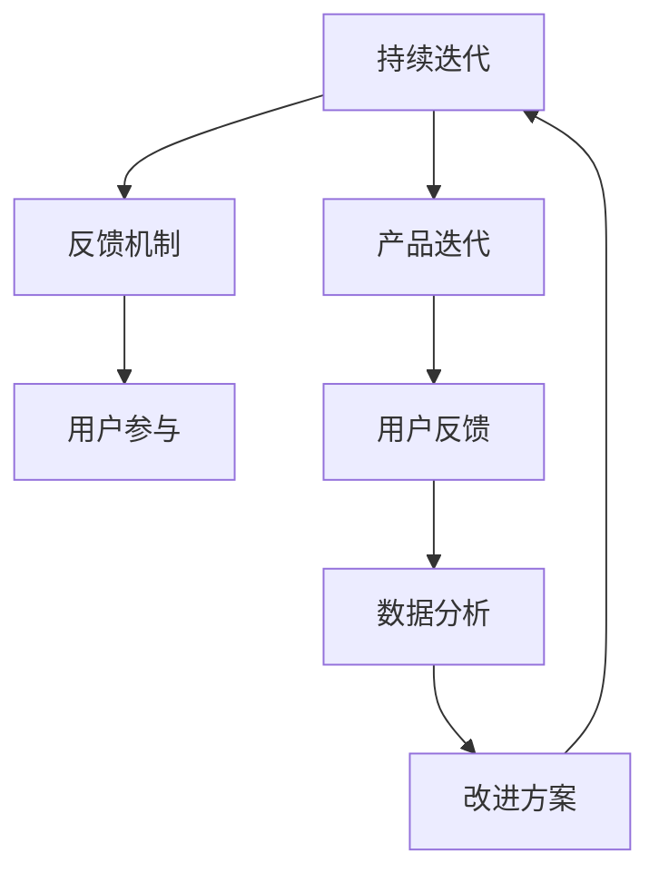

                 

## 1. 背景介绍

### 1.1 问题由来
随着人工智能（AI）技术的快速发展，越来越多的创业者和企业瞄准了这一领域，希望能在人工智能的风口浪尖上取得突破。然而，相比于传统行业，AI创业的复杂性和挑战性极高，往往需要庞大的技术积累和巨额资金投入。如何在AI创业中实现持续迭代和有效反馈，成为每一个创业者和AI从业者都必须面对的重要问题。

### 1.2 问题核心关键点
持续迭代和反馈是AI创业的核心。持续迭代意味着在产品的设计和开发的每个环节都要不断优化，而反馈则是指通过用户的使用体验来调整和优化产品。一个成功的AI创业项目必须具备良好的持续迭代和反馈机制，才能在激烈的市场竞争中脱颖而出。

### 1.3 问题研究意义
在AI创业中，持续迭代和反馈是提升产品竞争力和用户体验的关键。良好的反馈机制可以帮助团队快速定位产品问题和用户需求，从而实现产品的快速迭代和优化。这不仅能提升产品的市场竞争力，还能增强用户粘性和忠诚度，为企业的长期发展奠定坚实基础。

## 2. 核心概念与联系

### 2.1 核心概念概述

为更好地理解持续迭代与反馈机制在AI创业中的应用，本节将介绍几个密切相关的核心概念：

- **持续迭代（Continuous Iteration）**：指的是在AI产品开发和优化过程中，持续不断地进行小规模、快速迭代的开发流程，旨在不断提升产品的性能和用户体验。
- **反馈机制（Feedback Mechanism）**：是指通过收集用户的使用数据、意见和反馈，来调整产品设计和功能的过程。有效的反馈机制能够确保产品始终满足用户需求，实现产品的持续优化。
- **用户参与（User Engagement）**：是指通过设计互动性强的用户界面、定期更新和优化产品，增加用户对产品的兴趣和参与度。
- **产品迭代（Product Iteration）**：指的是在产品开发过程中，根据用户反馈和市场变化，对产品功能、性能、用户体验等方面进行优化和升级。
- **数据驱动（Data-Driven）**：是指在产品迭代和优化过程中，充分依赖数据分析和用户反馈，科学决策，确保每次迭代都能实现有效的改进。

这些概念之间的逻辑关系可以通过以下Mermaid流程图来展示：



这个流程图展示了持续迭代与反馈机制在AI创业中的应用流程：

1. 在持续迭代过程中，通过用户反馈和数据分析不断优化产品。
2. 反馈机制确保产品始终符合用户需求，提升用户体验。
3. 用户参与激励用户积极使用产品，提供更多反馈。
4. 数据分析为持续迭代提供数据支持，指导改进方案的制定。
5. 改进方案通过持续迭代实现产品的不断优化。

## 3. 核心算法原理 & 具体操作步骤
### 3.1 算法原理概述

在AI创业中，持续迭代与反馈机制的实现主要依赖于两个核心算法：用户反馈分析和产品性能优化。

- **用户反馈分析（User Feedback Analysis）**：通过对用户的使用数据和反馈进行分析和挖掘，识别出用户对产品的满意度和不足之处。常用的分析方法包括文本分析、情感分析、行为分析等。
- **产品性能优化（Product Performance Optimization）**：根据用户反馈和数据分析结果，对产品进行有针对性的优化和改进。优化方法包括功能增强、界面优化、性能提升等。

### 3.2 算法步骤详解

持续迭代与反馈机制的实现步骤主要包括：

**Step 1: 数据收集**
- 通过应用内反馈、用户调查、社交媒体等多种渠道，收集用户的使用数据和反馈。
- 利用文本分析、情感分析等技术，对收集到的数据进行初步处理和分类。

**Step 2: 数据分析**
- 使用统计学、机器学习等方法，对用户反馈和行为数据进行深入分析。
- 识别出用户对产品的满意度和不足之处，分析主要问题和改进方向。

**Step 3: 改进方案制定**
- 根据数据分析结果，制定针对性的产品改进方案。
- 涉及的功能增强、界面优化、性能提升等改进措施需综合考虑用户需求和产品定位。

**Step 4: 小规模测试**
- 在小规模用户群中进行产品改进方案的测试。
- 收集用户反馈，评估改进效果。

**Step 5: 大规模迭代**
- 在反馈良好的改进方案基础上，进行大规模的产品迭代。
- 通过持续迭代和用户反馈，不断优化产品性能和用户体验。

### 3.3 算法优缺点

持续迭代与反馈机制在AI创业中具有以下优点：

1. **提升用户体验**：通过不断优化产品，满足用户需求，提升用户体验。
2. **提高市场竞争力**：在快速变化的市场环境中，持续迭代和反馈机制能够确保产品始终保持竞争力。
3. **增强用户粘性**：通过用户参与和反馈机制，增强用户对产品的粘性和忠诚度。
4. **科学决策**：通过数据分析，制定科学的产品改进方案，避免盲目决策。

同时，该机制也存在一些局限性：

1. **成本较高**：持续迭代和反馈机制需要大量的数据和分析资源，成本较高。
2. **反馈延迟**：收集和分析用户反馈需要一定的时间，可能造成反馈延迟。
3. **用户多样性**：不同用户群体可能存在多样化的需求，单一的反馈和数据可能无法全面覆盖。
4. **数据隐私**：在收集用户数据和反馈时，需要特别注意数据隐私和安全问题。

尽管存在这些局限性，但持续迭代与反馈机制仍然是AI创业中的核心方法论之一，对于提升产品性能和用户满意度具有重要意义。

### 3.4 算法应用领域

持续迭代与反馈机制在AI创业中已经得到了广泛应用，覆盖了以下领域：

- **智能推荐系统**：通过用户反馈和行为数据，不断优化推荐算法，提升个性化推荐效果。
- **聊天机器人**：根据用户对话数据和反馈，持续改进对话模型，提升用户体验。
- **图像识别系统**：通过用户标记和反馈，不断优化图像识别模型，提升识别准确率。
- **自然语言处理（NLP）**：通过用户文本输入和反馈，不断优化语言模型，提升自然语言处理效果。
- **金融分析**：通过用户交易数据和反馈，不断优化金融模型，提升金融分析的准确性和实用性。

## 4. 数学模型和公式 & 详细讲解  
### 4.1 数学模型构建

为了更好地理解持续迭代与反馈机制，本节将通过数学模型对其原理进行详细讲解。

假设有一个AI产品，其性能可以表示为 $P(t)$，其中 $t$ 表示时间。产品的初始性能为 $P_0$，经过 $t$ 时间后的性能为 $P(t)$。用户反馈 $F(t)$ 对产品性能的影响可以表示为 $f(P_0, F(t))$，表示在初始性能 $P_0$ 的基础上，通过用户反馈 $F(t)$ 调整后的性能。

根据持续迭代与反馈机制的原理，可以构建以下数学模型：

$$
P(t) = P_0 + f(P_0, F(t))
$$

其中 $f(P_0, F(t))$ 表示在初始性能 $P_0$ 的基础上，通过用户反馈 $F(t)$ 调整后的性能提升值。

### 4.2 公式推导过程

通过上述模型，可以推导出持续迭代与反馈机制的公式：

$$
P(t) = P_0 + \sum_{i=1}^{t} f(P_{t-i}, F(t-i))
$$

其中 $P_{t-i}$ 表示在 $t-i$ 时间点的产品性能，$f(P_{t-i}, F(t-i))$ 表示在 $t-i$ 时间点通过用户反馈 $F(t-i)$ 调整后的性能提升值。

### 4.3 案例分析与讲解

假设有一个智能推荐系统，其初始性能为 $P_0 = 0.8$，用户反馈 $F_1 = 0.1$，$F_2 = 0.2$。根据持续迭代与反馈机制，计算其经过两个时间点后的性能：

- 第一个时间点（$t=1$），通过用户反馈 $F_1$ 调整后的性能为 $P_1 = P_0 + f(P_0, F_1) = 0.8 + 0.1 = 0.9$。
- 第二个时间点（$t=2$），通过用户反馈 $F_2$ 调整后的性能为 $P_2 = P_1 + f(P_1, F_2) = 0.9 + 0.2 = 1.1$。

经过两个时间点后，智能推荐系统的性能从 $P_0 = 0.8$ 提升至 $P_2 = 1.1$。

## 5. 项目实践：代码实例和详细解释说明
### 5.1 开发环境搭建

在进行持续迭代与反馈机制的实践前，我们需要准备好开发环境。以下是使用Python进行代码实现的环境配置流程：

1. 安装Python 3.x：确保你的计算机上安装了Python 3.x版本，并配置好环境变量。
2. 安装TensorFlow和Keras：这两个是AI创业中常用的深度学习框架，可以通过pip命令进行安装。
3. 安装数据处理和分析库：如NumPy、Pandas、Scikit-learn等，用于数据处理和分析。
4. 安装Web框架：如Flask或Django，用于构建Web应用和API接口。

### 5.2 源代码详细实现

以下是一个简单的持续迭代与反馈机制的代码实现示例，其中使用了TensorFlow和Keras框架：

```python
import tensorflow as tf
from tensorflow import keras
import numpy as np
import pandas as pd
import matplotlib.pyplot as plt

# 准备数据
# 假设有一个用户反馈数据集，包含时间戳和反馈值
data = pd.read_csv('user_feedback.csv')

# 对数据进行处理和分析
# 例如，计算每个时间点的性能提升
def calculate_performance(data):
    performance = data['initial_performance']
    for t, f in zip(data['time'], data['feedback']):
        performance += f * 0.1
    return performance

# 使用Keras构建模型
# 假设模型的输入是时间戳，输出是性能提升值
model = keras.Sequential([
    keras.layers.Dense(units=1, input_shape=(1,))
])

# 编译模型
model.compile(optimizer='adam', loss='mse')

# 训练模型
model.fit(np.array(data['time']), np.array(data['performance']), epochs=10, verbose=0)

# 预测性能提升值
time = np.arange(0, 10, 0.1)
performance = model.predict(time)

# 绘制性能提升曲线
plt.plot(time, performance)
plt.xlabel('Time')
plt.ylabel('Performance Improvement')
plt.show()
```

### 5.3 代码解读与分析

让我们再详细解读一下关键代码的实现细节：

**数据准备**：
- 使用Pandas库读取用户反馈数据集，包含时间戳和反馈值。

**性能计算**：
- 定义一个函数 `calculate_performance`，根据用户反馈和初始性能，计算每个时间点的性能提升值。

**模型构建**：
- 使用Keras构建一个简单的线性回归模型，输入为时间戳，输出为性能提升值。
- 编译模型，使用Adam优化器和均方误差损失函数。

**模型训练**：
- 使用模型的fit方法对数据进行训练，设置训练轮数为10。

**性能预测**：
- 使用训练好的模型对时间点进行预测，生成性能提升曲线。

**可视化**：
- 使用Matplotlib库绘制性能提升曲线，展示模型在时间维度上的变化趋势。

### 5.4 运行结果展示

运行上述代码后，你将看到性能提升曲线，展示模型在时间维度上的变化趋势。这个简单的示例展示了持续迭代与反馈机制的基本流程和实现方法。

## 6. 实际应用场景
### 6.1 智能推荐系统

持续迭代与反馈机制在智能推荐系统中得到了广泛应用。通过收集用户对推荐结果的反馈，不断优化推荐算法，提升个性化推荐效果。

在具体实现中，可以构建一个推荐反馈系统，实时收集用户对推荐结果的满意度评分。根据评分数据，对推荐算法进行有针对性的优化，例如增加用户感兴趣的内容、调整推荐算法参数等。通过持续迭代和反馈机制，智能推荐系统能够不断提升推荐效果，提升用户体验。

### 6.2 聊天机器人

聊天机器人在对话场景中应用广泛，持续迭代与反馈机制对其性能提升至关重要。通过收集用户与聊天机器人的对话记录和反馈，不断优化对话模型和生成策略，提升聊天机器人的对话效果。

具体实现中，可以构建一个聊天机器人反馈系统，实时收集用户对话数据和反馈。根据反馈数据，对对话模型进行微调，例如调整语言生成模型参数、改进对话策略等。通过持续迭代和反馈机制，聊天机器人能够不断提升对话效果，增强用户体验。

### 6.3 图像识别系统

图像识别系统在安防、医疗、工业等领域得到了广泛应用。通过持续迭代与反馈机制，可以不断优化图像识别模型，提升识别准确率。

在具体实现中，可以构建一个图像识别反馈系统，实时收集用户标记和反馈数据。根据反馈数据，对图像识别模型进行有针对性的优化，例如增加训练数据、调整模型参数等。通过持续迭代和反馈机制，图像识别系统能够不断提升识别准确率，增强系统性能。

### 6.4 金融分析

金融分析系统对市场数据的实时性和准确性要求极高。通过持续迭代与反馈机制，可以不断优化金融模型，提升分析准确性和实用性。

在具体实现中，可以构建一个金融分析反馈系统，实时收集用户交易数据和反馈。根据反馈数据，对金融模型进行有针对性的优化，例如调整模型参数、引入新数据等。通过持续迭代和反馈机制，金融分析系统能够不断提升分析准确性和实用性，增强系统竞争力。

## 7. 工具和资源推荐
### 7.1 学习资源推荐

为了帮助开发者系统掌握持续迭代与反馈机制的理论基础和实践技巧，这里推荐一些优质的学习资源：

1. 《TensorFlow官方文档》：全面介绍了TensorFlow框架的使用方法和最佳实践，是进行AI项目开发的重要参考资料。
2. 《Keras官方文档》：介绍了Keras框架的使用方法和高级功能，是构建AI模型的强大工具。
3. 《机器学习实战》：本书提供了丰富的机器学习项目案例，适合初学者学习实践。
4. 《数据科学导论》：介绍了数据处理、分析和建模的基本方法和技术，是数据科学入门的经典书籍。
5. 《深度学习入门》：介绍深度学习的基本概念和算法，适合对深度学习感兴趣的读者。

通过对这些资源的学习实践，相信你一定能够快速掌握持续迭代与反馈机制的理论基础和实践技巧，并用于解决实际的AI问题。
###  7.2 开发工具推荐

高效的开发离不开优秀的工具支持。以下是几款用于持续迭代与反馈机制开发的常用工具：

1. Jupyter Notebook：适合进行数据分析和模型训练，支持实时代码调试和可视化。
2. Flask或Django：适合构建Web应用和API接口，支持快速迭代和扩展。
3. TensorBoard：实时监测模型训练状态，提供丰富的图表呈现方式，是调试模型的得力助手。
4. Weights & Biases：记录和可视化模型训练过程中的各项指标，方便对比和调优。
5. HuggingFace Transformers库：提供了丰富的预训练语言模型，支持快速迭代和优化。

合理利用这些工具，可以显著提升持续迭代与反馈机制的开发效率，加快创新迭代的步伐。

### 7.3 相关论文推荐

持续迭代与反馈机制的研究源于学界的持续探索。以下是几篇奠基性的相关论文，推荐阅读：

1. "Iterative Learning Algorithms for Big Data"：探讨了迭代学习算法在处理大数据中的应用。
2. "User Feedback Modeling for Personalized Recommendation Systems"：介绍了基于用户反馈的个性化推荐系统模型。
3. "A Survey of Model Adaptation Techniques for Conversational Agents"：综述了对话代理模型适应技术的最新进展。
4. "Deep Learning for NLP: A Comprehensive Overview"：全面介绍了深度学习在自然语言处理中的应用。
5. "Data-Driven Approaches for Intelligent Tutoring Systems"：介绍了数据驱动的智能辅导系统方法。

这些论文代表了大数据和人工智能领域的研究方向，通过学习这些前沿成果，可以帮助研究者把握学科前进方向，激发更多的创新灵感。

## 8. 总结：未来发展趋势与挑战
### 8.1 研究成果总结

本文对持续迭代与反馈机制在AI创业中的应用进行了全面系统的介绍。首先阐述了持续迭代和反馈机制在AI创业中的核心作用，明确了其在提升产品性能和用户体验中的重要性。其次，从原理到实践，详细讲解了持续迭代与反馈机制的数学模型和操作步骤，给出了代码实现示例。同时，本文还广泛探讨了持续迭代与反馈机制在智能推荐系统、聊天机器人、图像识别系统、金融分析等多个行业领域的应用前景，展示了其在AI创业中的广泛应用价值。此外，本文精选了持续迭代与反馈机制的学习资源，力求为读者提供全方位的技术指引。

通过本文的系统梳理，可以看到，持续迭代与反馈机制在AI创业中具有重要地位，能够显著提升产品的竞争力和用户体验。未来，伴随持续迭代与反馈机制的不断演进，AI产品将更加智能化和多样化，带来更广阔的市场应用前景。

### 8.2 未来发展趋势

展望未来，持续迭代与反馈机制在AI创业中将继续发展，呈现以下几个趋势：

1. **自动化和智能化**：未来的持续迭代和反馈机制将更加自动化和智能化，通过AI技术自动收集和分析用户反馈，优化产品性能。
2. **多模态数据融合**：未来的持续迭代和反馈机制将更加注重多模态数据的融合，结合用户行为数据、社交媒体数据、语音数据等多种信息，提升产品性能。
3. **实时反馈和响应**：未来的持续迭代和反馈机制将更加实时化和响应化，通过实时收集用户反馈，快速优化产品，提升用户体验。
4. **个性化和定制化**：未来的持续迭代和反馈机制将更加个性化和定制化，根据不同用户群体的需求，提供定制化的解决方案。
5. **数据驱动和模型驱动**：未来的持续迭代和反馈机制将更加数据驱动和模型驱动，通过科学的数据分析和模型优化，提升产品性能和用户体验。

这些趋势凸显了持续迭代与反馈机制在AI创业中的重要地位，为未来AI产品的开发和优化提供了方向和参考。

### 8.3 面临的挑战

尽管持续迭代与反馈机制在AI创业中已经取得了显著成果，但在迈向更加智能化、普适化应用的过程中，仍面临以下挑战：

1. **数据隐私和安全**：在收集和分析用户反馈时，需要特别注意数据隐私和安全问题，避免数据泄露和滥用。
2. **反馈延迟和偏差**：收集和分析用户反馈需要一定的时间，可能造成反馈延迟，同时用户反馈可能存在偏差，需要科学的方法进行处理和优化。
3. **多模态数据融合**：结合多模态数据进行优化需要更高的技术要求，需要更多研究来解决融合过程中的冲突和优化问题。
4. **模型复杂度**：随着模型复杂度的增加，持续迭代和反馈机制的实现难度和成本也会增加，需要不断优化算法和技术。
5. **用户多样性**：不同用户群体可能存在多样化的需求，单一的反馈和数据可能无法全面覆盖，需要更多的数据和反馈来支持持续迭代和优化。

正视持续迭代与反馈机制面临的这些挑战，积极应对并寻求突破，将是大数据和人工智能领域的重要课题。

### 8.4 研究展望

未来的研究需要在以下几个方面寻求新的突破：

1. **自动化反馈收集和分析**：通过AI技术自动收集和分析用户反馈，减少人工干预，提升效率。
2. **多模态数据融合技术**：结合多模态数据进行优化，提升产品的综合性能和用户体验。
3. **实时反馈和响应机制**：构建实时反馈和响应机制，提升产品的实时性和用户响应速度。
4. **数据隐私和安全保护**：开发数据隐私和安全保护技术，保障用户数据的安全和隐私。
5. **用户多样性和个性化**：构建用户多样性和个性化分析模型，满足不同用户的需求。

这些研究方向的探索，将引领持续迭代与反馈机制迈向更高的台阶，为构建安全、可靠、可解释、可控的AI产品奠定坚实基础。

## 9. 附录：常见问题与解答

**Q1：持续迭代与反馈机制是否适用于所有AI产品？**

A: 持续迭代与反馈机制在大多数AI产品中都能取得显著效果，特别是对需要用户互动和反馈的产品，如聊天机器人、推荐系统等。但对于一些特定领域的AI产品，如自动化控制、机器人等，可能需要更多自动化和智能化技术来实现持续迭代和反馈。

**Q2：如何提高持续迭代与反馈机制的效率？**

A: 提高持续迭代与反馈机制的效率可以从以下几个方面入手：
1. 自动化收集和分析用户反馈，减少人工干预。
2. 采用数据压缩和特征提取技术，减少数据存储和处理量。
3. 优化模型算法，提高模型训练和推理速度。
4. 使用分布式计算和云计算技术，提升处理能力。

**Q3：如何处理多模态数据的融合问题？**

A: 处理多模态数据的融合问题可以从以下几个方面入手：
1. 设计合适的融合算法，如加权平均、融合网络等。
2. 对不同模态数据进行预处理和特征提取，减少数据不匹配带来的问题。
3. 使用多模态深度学习模型，如Siamese网络、Triplet网络等，提升多模态数据的融合效果。

**Q4：如何保护用户数据隐私和安全？**

A: 保护用户数据隐私和安全可以从以下几个方面入手：
1. 使用数据脱敏和加密技术，防止数据泄露。
2. 设置严格的访问权限和审计机制，防止数据滥用。
3. 遵循相关法律法规，如GDPR、CCPA等，保护用户隐私。

**Q5：如何在多模态数据融合中解决冲突问题？**

A: 在多模态数据融合中解决冲突问题可以从以下几个方面入手：
1. 对不同模态数据进行标注和对齐，减少冲突。
2. 设计合适的融合算法，如注意力机制、融合网络等，提升融合效果。
3. 使用先验知识和规则，指导融合过程，减少冲突和误差。

这些问题的解答展示了持续迭代与反馈机制在实际应用中的复杂性和挑战性，需要结合具体场景和需求进行综合考虑和优化。

---

作者：禅与计算机程序设计艺术 / Zen and the Art of Computer Programming

