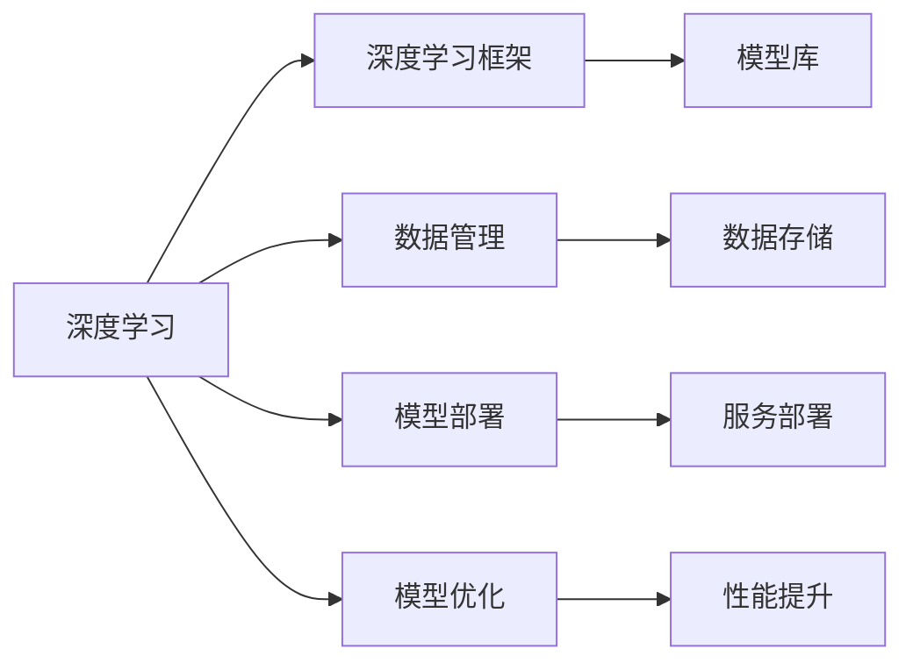

                 

## 1. 背景介绍

### 1.1 问题由来

在人工智能(AI)创业的浪潮中，技术栈的选择成为了许多初创企业亟待解决的难题。随着AI技术的迅速发展，新技术和新框架层出不穷，如何选择一种适合自身需求和资源的技术栈，成为创业公司成败的关键之一。

近年来，深度学习在图像识别、自然语言处理、语音识别等领域取得了显著进展，成为AI创业的主流方向。然而，深度学习模型的构建和优化涉及大量数据、计算资源和专业技能，如何在有限资源下，构建一个高效、可扩展的AI技术栈，成为创业团队的核心挑战。

### 1.2 问题核心关键点

技术栈的选择主要围绕以下几个关键点：
- **模型选择**：根据应用场景和数据特征，选择合适的深度学习模型。
- **工具选择**：选择合适的框架和工具，以提高开发效率和模型性能。
- **数据管理**：构建高效的数据管理方案，确保数据质量和安全。
- **模型部署**：选择合适的部署方式，确保模型的高效运行和可扩展性。
- **模型优化**：通过算法优化和硬件加速，提升模型性能和推理速度。

### 1.3 问题研究意义

选择合适技术栈对AI创业公司具有重要意义：
- 提升模型性能：选择合适的技术栈可以加速模型训练和优化，提高模型精度和泛化能力。
- 降低开发成本：使用高效工具和框架可以大幅减少开发时间和人力成本。
- 促进快速迭代：灵活的技术栈支持快速实验和原型开发，加快产品迭代速度。
- 拓展应用场景：多样化的技术栈支持更多应用场景，拓展产品应用范围。
- 提高资源利用率：合理配置资源可以充分利用现有硬件，避免资源浪费。

## 2. 核心概念与联系

### 2.1 核心概念概述

以下是几个核心概念及其联系：

- **深度学习(DL)**：基于神经网络架构的机器学习方法，广泛应用于图像、语音、文本等领域。
- **深度学习框架**：如TensorFlow、PyTorch、MXNet等，提供模型构建、训练和推理的高效工具。
- **模型库**：如OpenCV、NLTK、TensorFlow Hub等，提供预训练模型和工具库。
- **数据管理**：如Hadoop、Spark、MongoDB等，提供高效的数据存储、处理和查询功能。
- **模型部署**：如Docker、Kubernetes、AWS等，提供模型和服务的高效部署和运维方案。
- **模型优化**：如GPU、TPU、量化加速等，提升模型性能和推理速度。

这些概念通过下图中的Mermaid流程图展示了它们之间的联系：



这个流程图展示了深度学习、框架、模型、数据、部署和优化的关联性：

1. 深度学习作为核心技术，通过框架、库和工具进行高效实现。
2. 数据管理支撑模型的训练和推理，是模型优化的基础。
3. 模型部署确保模型能够高效运行，服务化封装利于应用集成。
4. 模型优化通过算法和硬件加速，提升模型性能和推理速度。

## 3. 核心算法原理 & 具体操作步骤

### 3.1 算法原理概述

人工智能创业中的技术栈选择，从根本上依赖于算法的原理和实现。以下将详细介绍几种核心算法的原理和操作步骤：

- **卷积神经网络(CNN)**：应用于图像识别和视频分析，通过卷积操作提取空间特征。
- **循环神经网络(RNN)**：用于序列数据处理，如自然语言处理，通过循环结构捕捉时间依赖。
- **长短期记忆网络(LSTM)**：一种RNN的变体，解决梯度消失和梯度爆炸问题，用于处理长期依赖。
- **注意力机制(Attention)**：通过注意力权重选择关键信息，应用于机器翻译和问答系统。
- **Transformer**：一种基于自注意力机制的神经网络架构，广泛应用于机器翻译和文本生成。

### 3.2 算法步骤详解

以下是几种核心算法的详细步骤：

**CNN算法步骤**：
1. 数据预处理：图像预处理，如归一化、缩放、裁剪等。
2. 卷积操作：通过多个卷积层提取图像特征。
3. 池化操作：通过最大池化或平均池化减少特征维度。
4. 全连接层：将特征图转化为输出向量。
5. 激活函数：如ReLU、Sigmoid等，增加模型非线性特性。
6. 损失函数：如交叉熵损失，衡量模型预测和真实标签的差异。
7. 反向传播：根据损失函数计算梯度，更新模型参数。
8. 模型评估：在验证集上评估模型性能，调整超参数。

**RNN算法步骤**：
1. 数据预处理：序列数据预处理，如分词、标记等。
2. 循环结构：使用RNN或LSTM结构，处理序列数据。
3. 隐藏状态：通过隐藏层状态捕捉时间依赖。
4. 输出层：通过全连接层输出预测结果。
5. 损失函数：如交叉熵损失，衡量模型预测和真实标签的差异。
6. 反向传播：根据损失函数计算梯度，更新模型参数。
7. 模型评估：在验证集上评估模型性能，调整超参数。

**Transformer算法步骤**：
1. 编码器-解码器结构：使用自注意力机制和多头注意力机制。
2. 自注意力机制：通过查询、键、值向量计算注意力权重。
3. 多头注意力：通过多个注意力头并行处理输入信息。
4. 位置编码：引入位置信息，捕捉时间顺序。
5. 解码器：使用注意力机制和全连接层生成预测结果。
6. 损失函数：如交叉熵损失，衡量模型预测和真实标签的差异。
7. 反向传播：根据损失函数计算梯度，更新模型参数。
8. 模型评估：在验证集上评估模型性能，调整超参数。

### 3.3 算法优缺点

**CNN算法优缺点**：
- 优点：擅长处理空间局部特征，适用于图像识别和视频分析。
- 缺点：对时间序列数据处理能力较弱，难以捕捉长期依赖。

**RNN算法优缺点**：
- 优点：擅长处理时间序列数据，能捕捉长期依赖。
- 缺点：容易发生梯度消失或梯度爆炸，训练难度较大。

**LSTM算法优缺点**：
- 优点：解决RNN的梯度问题，能够更好地处理长期依赖。
- 缺点：计算复杂度高，需要更多计算资源。

**Transformer算法优缺点**：
- 优点：模型参数量较小，推理速度快，适用于大规模预训练和微调。
- 缺点：对长序列处理能力有限，计算复杂度高。

**Attention算法优缺点**：
- 优点：通过注意力权重选择关键信息，能够高效处理长序列。
- 缺点：模型参数量较大，计算复杂度高。

### 3.4 算法应用领域

这些算法广泛应用于以下领域：

- **图像识别**：如物体检测、人脸识别、医学影像分析等。
- **自然语言处理**：如机器翻译、文本摘要、情感分析等。
- **语音识别**：如语音转文本、语音命令控制等。
- **视频分析**：如动作识别、视频编码等。

## 4. 数学模型和公式 & 详细讲解  
### 4.1 数学模型构建

深度学习模型通常由以下部分组成：
- 输入层：输入数据，如图像、文本、语音等。
- 隐藏层：通过线性变换和激活函数处理输入数据。
- 输出层：将隐藏层输出映射为预测结果。

以CNN为例，其数学模型构建如下：

$$
y = W^Tx + b
$$

其中，$y$为输出向量，$W$为权重矩阵，$x$为输入向量，$b$为偏置向量。

**RNN**的数学模型构建如下：

$$
h_t = f(W_xh \cdot [h_{t-1},x_t] + b_h)
$$

$$
y_t = W_yh \cdot h_t + b_y
$$

其中，$h_t$为隐藏状态，$f$为激活函数，$W_xh$和$W_yh$为权重矩阵，$x_t$为输入向量，$b_h$和$b_y$为偏置向量。

**Transformer**的数学模型构建如下：

$$
Q = XW_Q + b_Q
$$

$$
K = XW_K + b_K
$$

$$
V = XW_V + b_V
$$

$$
A = \text{Attention}(Q, K, V)
$$

$$
Z = XW_D + A
$$

其中，$Q$、$K$、$V$分别为查询、键、值向量，$A$为注意力权重，$Z$为输出向量，$W_Q$、$W_K$、$W_V$、$W_D$为权重矩阵，$b_Q$、$b_K$、$b_V$、$b_D$为偏置向量。

### 4.2 公式推导过程

以**RNN**为例，其数学推导过程如下：

1. 输入层：$x_t = (x_{t-1}, x_t)$。
2. 隐藏层：$h_t = f(W_xh \cdot [h_{t-1},x_t] + b_h)$。
3. 输出层：$y_t = W_yh \cdot h_t + b_y$。

其中，$f$为激活函数，如$\tanh$或$ReLU$。

### 4.3 案例分析与讲解

以图像分类为例，CNN的案例分析如下：

1. 数据预处理：将原始图像归一化为[0,1]。
2. 卷积操作：通过多个卷积层提取图像特征。
3. 池化操作：通过最大池化或平均池化减少特征维度。
4. 全连接层：将特征图转化为输出向量。
5. 激活函数：如ReLU、Sigmoid等。
6. 损失函数：如交叉熵损失。
7. 反向传播：根据损失函数计算梯度，更新模型参数。
8. 模型评估：在验证集上评估模型性能，调整超参数。

## 5. 项目实践：代码实例和详细解释说明

### 5.1 开发环境搭建

以下是使用Python进行PyTorch开发的开发环境配置流程：

1. 安装Anaconda：从官网下载并安装Anaconda，用于创建独立的Python环境。

2. 创建并激活虚拟环境：
```bash
conda create -n pytorch-env python=3.8 
conda activate pytorch-env
```

3. 安装PyTorch：根据CUDA版本，从官网获取对应的安装命令。例如：
```bash
conda install pytorch torchvision torchaudio cudatoolkit=11.1 -c pytorch -c conda-forge
```

4. 安装Transformers库：
```bash
pip install transformers
```

5. 安装各类工具包：
```bash
pip install numpy pandas scikit-learn matplotlib tqdm jupyter notebook ipython
```

完成上述步骤后，即可在`pytorch-env`环境中开始项目实践。

### 5.2 源代码详细实现

下面是使用PyTorch进行图像分类的完整代码实现：

```python
import torch
import torch.nn as nn
import torch.optim as optim
from torch.utils.data import DataLoader
from torchvision import datasets, transforms

# 定义网络结构
class Net(nn.Module):
    def __init__(self):
        super(Net, self).__init__()
        self.conv1 = nn.Conv2d(3, 6, 5)
        self.pool = nn.MaxPool2d(2, 2)
        self.conv2 = nn.Conv2d(6, 16, 5)
        self.fc1 = nn.Linear(16 * 5 * 5, 120)
        self.fc2 = nn.Linear(120, 84)
        self.fc3 = nn.Linear(84, 10)
        
    def forward(self, x):
        x = self.pool(F.relu(self.conv1(x)))
        x = self.pool(F.relu(self.conv2(x)))
        x = x.view(-1, 16 * 5 * 5)
        x = F.relu(self.fc1(x))
        x = F.relu(self.fc2(x))
        x = self.fc3(x)
        return x

# 加载数据集
train_dataset = datasets.CIFAR10(root='./data', train=True, download=True, transform=transforms.Compose([
    transforms.ToTensor(),
    transforms.Normalize((0.5, 0.5, 0.5), (0.5, 0.5, 0.5))
]))

test_dataset = datasets.CIFAR10(root='./data', train=False, download=True, transform=transforms.Compose([
    transforms.ToTensor(),
    transforms.Normalize((0.5, 0.5, 0.5), (0.5, 0.5, 0.5))
]))

# 定义模型和优化器
model = Net()
criterion = nn.CrossEntropyLoss()
optimizer = optim.SGD(model.parameters(), lr=0.001, momentum=0.9)

# 训练模型
def train(epoch):
    model.train()
    for batch_idx, (data, target) in enumerate(train_loader):
        optimizer.zero_grad()
        output = model(data)
        loss = criterion(output, target)
        loss.backward()
        optimizer.step()
        if batch_idx % 100 == 0:
            print('Train Epoch: {} [{}/{} ({:.0f}%)]\tLoss: {:.6f}'.format(
                epoch, batch_idx * len(data), len(train_loader.dataset),
                100. * batch_idx / len(train_loader), loss.item()))

# 测试模型
def test():
    model.eval()
    correct = 0
    total = 0
    with torch.no_grad():
        for data, target in test_loader:
            output = model(data)
            _, predicted = torch.max(output.data, 1)
            total += target.size(0)
            correct += (predicted == target).sum().item()
    print('Accuracy of the network on the 10000 test images: {} %'.format(100 * correct / total))

# 训练和测试循环
for epoch in range(2):
    train(epochs=10)
    test()
```

### 5.3 代码解读与分析

让我们再详细解读一下关键代码的实现细节：

**定义网络结构**：
- 通过继承`nn.Module`，定义一个名为`Net`的网络模型。
- 定义两个卷积层、两个池化层和三个全连接层，并使用ReLU激活函数。
- 最后一层输出类别数10。

**加载数据集**：
- 使用`CIFAR10`数据集，并定义数据预处理和归一化操作。

**定义模型和优化器**：
- 实例化模型`Net`。
- 定义交叉熵损失函数。
- 定义随机梯度下降优化器，设置学习率和动量。

**训练模型**：
- 在每个epoch中，循环遍历数据集。
- 前向传播计算模型输出，并计算损失函数。
- 反向传播计算梯度，并更新模型参数。
- 每100次迭代输出一次损失信息。

**测试模型**：
- 在测试集上计算模型准确率，输出最终结果。

## 6. 实际应用场景

### 6.1 智能推荐系统

智能推荐系统是AI创业中的热门应用，通过深度学习模型和算法优化，实现个性化推荐。

具体而言，推荐系统通常分为召回和排序两个阶段：
- 召回：从大量数据中筛选出可能感兴趣的物品。
- 排序：根据用户行为和物品属性进行评分排序，生成推荐结果。

在实际应用中，可以使用基于深度学习的协同过滤算法，如矩阵分解和向量相似度计算，来构建用户-物品评分矩阵。也可以使用基于神经网络的模型，如神经协同过滤(Neural Collaborative Filtering, NCF)和序列推荐模型，捕捉用户行为和物品属性的时间依赖。

### 6.2 医疗影像诊断

医疗影像诊断是AI在医疗领域的重要应用，通过深度学习模型和算法优化，实现高效、准确的医学影像分析。

具体而言，影像诊断系统通常分为图像处理和模型训练两个阶段：
- 图像处理：对原始影像进行去噪、增强、分割等预处理操作。
- 模型训练：使用深度学习模型进行训练，生成诊断结果。

在实际应用中，可以使用卷积神经网络(CNN)进行图像特征提取和分类。也可以使用生成对抗网络(GAN)和变分自编码器(VAE)进行图像生成和数据增强。

### 6.3 金融风险预测

金融风险预测是AI在金融领域的重要应用，通过深度学习模型和算法优化，实现精准、实时的风险评估。

具体而言，风险预测系统通常分为特征提取和模型训练两个阶段：
- 特征提取：从大量金融数据中提取关键特征。
- 模型训练：使用深度学习模型进行训练，生成风险预测结果。

在实际应用中，可以使用循环神经网络(RNN)进行时间序列分析，捕捉市场变化趋势。也可以使用长短期记忆网络(LSTM)和注意力机制，捕捉复杂的时间依赖关系。

## 7. 工具和资源推荐

### 7.1 学习资源推荐

为了帮助开发者系统掌握深度学习技术的原理和应用，这里推荐一些优质的学习资源：

1. 《深度学习》系列书籍：如《深度学习》和《动手学深度学习》，系统介绍深度学习的基础理论和算法实现。
2. 《Python深度学习》书籍：介绍使用Python实现深度学习模型的技巧和方法。
3. 在线课程：如Coursera的《深度学习专项课程》和Udacity的《深度学习基础》，提供从入门到进阶的学习路径。
4. Kaggle竞赛：通过参与Kaggle比赛，实战练习深度学习模型的构建和优化。
5. GitHub代码库：通过学习优秀的开源项目代码，提升代码实现和算法优化能力。

通过对这些资源的学习实践，相信你一定能够系统掌握深度学习技术的原理和应用，为AI创业之路打下坚实的基础。

### 7.2 开发工具推荐

高效的工具和框架是深度学习开发的重要保障，以下是几款常用的开发工具：

1. PyTorch：基于Python的深度学习框架，灵活的动态计算图和丰富的预训练模型库。
2. TensorFlow：由Google主导开发的深度学习框架，提供分布式训练和高效的GPU/TPU支持。
3. MXNet：由Apache基金会维护的深度学习框架，支持多种编程语言和分布式训练。
4. Jupyter Notebook：用于编写、测试和共享深度学习代码的交互式开发环境。
5. Anaconda：Python虚拟环境管理器，方便管理和部署深度学习项目。
6. GitHub：代码托管平台，提供高效的代码版本控制和协作开发功能。

合理利用这些工具，可以显著提升深度学习开发的效率和质量，加快AI创业项目的发展速度。

### 7.3 相关论文推荐

深度学习技术的发展离不开学界的持续研究。以下是几篇奠基性的相关论文，推荐阅读：

1. ImageNet Classification with Deep Convolutional Neural Networks：提出卷积神经网络(CNN)，应用于图像分类任务。
2. Recurrent Neural Network Toolkit：提出循环神经网络(RNN)，应用于自然语言处理任务。
3. A Tutorial on Deep Learning：介绍深度学习的基本概念和算法实现。
4. Attention Is All You Need：提出Transformer架构，应用于机器翻译和文本生成任务。
5. A Survey on Deep Learning-Based Recommendation Systems：综述深度学习在推荐系统中的应用。

这些论文代表了大深度学习技术的发展脉络。通过学习这些前沿成果，可以帮助研究者把握学科前进方向，激发更多的创新灵感。

## 8. 总结：未来发展趋势与挑战

### 8.1 研究成果总结

本文对人工智能创业中的技术栈选择进行了全面系统的介绍。首先阐述了技术栈选择的重要性，明确了模型选择、工具选择、数据管理、模型部署、模型优化等关键因素。其次，从原理到实践，详细讲解了卷积神经网络(CNN)、循环神经网络(RNN)、长短期记忆网络(LSTM)、Transformer等核心算法的原理和操作步骤。最后，给出了AI创业中的实际应用场景，推荐了相关的学习资源、开发工具和研究论文。

通过本文的系统梳理，可以看到，深度学习技术在大规模企业落地应用中具有重要的价值，但选择合适的技术栈仍然是创业团队面临的挑战。只有结合实际需求和资源，不断迭代和优化，才能真正实现深度学习技术的商业化应用。

### 8.2 未来发展趋势

展望未来，深度学习技术将呈现以下几个发展趋势：

1. 模型规模持续增大。随着算力成本的下降和数据规模的扩张，深度学习模型的参数量还将持续增长。超大规模模型蕴含的丰富特征表示，有望支撑更加复杂多变的应用场景。
2. 模型优化技术日趋多样化。未来将涌现更多参数高效的模型优化技术，如知识蒸馏、梯度剪枝、模型压缩等，在保证性能的同时，大幅降低计算资源消耗。
3. 模型可解释性增强。通过引入可解释性算法和工具，提升深度学习模型的可解释性，增强系统的透明度和可信度。
4. 跨模态融合技术发展。多模态融合技术，如视觉-语音-文本联合建模，将进一步提升深度学习系统的综合性能。
5. 实时化、边缘化应用普及。深度学习技术将更加广泛地应用于实时系统、边缘计算等场景，提升系统的响应速度和资源利用效率。

这些趋势凸显了深度学习技术的广阔前景，为AI创业公司提供了更多创新机遇。

### 8.3 面临的挑战

尽管深度学习技术取得了显著进展，但在落地应用过程中，仍面临诸多挑战：

1. 数据质量和多样性。缺乏高质量、多样化的数据，将影响模型的性能和泛化能力。
2. 计算资源消耗。深度学习模型的计算复杂度高，对算力、存储等资源需求较大。
3. 模型复杂度和可解释性。复杂的深度学习模型难以解释，不利于业务理解和系统调试。
4. 隐私和安全问题。深度学习模型可能泄露用户隐私，需要设计合理的隐私保护机制。
5. 数据隐私和伦理问题。深度学习模型可能引入偏见和歧视，需要关注数据伦理和模型公平性。

正视这些挑战，积极应对并寻求突破，将是深度学习技术实现商业化的关键。

### 8.4 研究展望

未来，深度学习技术需要在以下方面寻求新的突破：

1. 数据增强和迁移学习。通过数据增强和迁移学习技术，提高模型对新数据的适应能力，降低对标注数据的依赖。
2. 模型优化和加速技术。开发高效的模型优化和加速技术，提升模型的推理速度和资源利用效率。
3. 模型可解释性研究。引入可解释性算法和工具，提升模型的透明度和可信度。
4. 跨模态融合技术。探索跨模态融合方法，提升系统的综合性能和智能化水平。
5. 实时化、边缘化应用。探索实时化、边缘化应用的深度学习技术，提升系统的响应速度和资源利用效率。

这些研究方向将引领深度学习技术迈向新的高度，为AI创业公司提供更多的技术支持和应用机遇。

## 9. 附录：常见问题与解答

**Q1：如何选择深度学习模型？**

A: 选择深度学习模型需要综合考虑任务特点、数据规模和资源限制。一般而言，对于图像识别、视频分析等视觉任务，卷积神经网络(CNN)是较好的选择；对于自然语言处理等序列任务，循环神经网络(RNN)和Transformer是较好的选择。

**Q2：如何进行模型优化？**

A: 模型优化可以从以下几个方面入手：
1. 参数剪枝：通过剪枝去除冗余参数，减小模型大小。
2. 量化加速：将浮点模型转为定点模型，提高计算效率。
3. 模型压缩：通过重构模型结构，减小模型参数量。
4. 分布式训练：使用分布式训练技术，加快模型训练速度。
5. 自适应学习率：通过自适应学习率算法，提高模型收敛速度。

**Q3：如何选择深度学习框架？**

A: 选择深度学习框架需要考虑框架的灵活性、性能、社区支持等因素。一般而言，PyTorch和TensorFlow是最流行的深度学习框架，PyTorch以其灵活的动态计算图和丰富的模型库受到广泛欢迎；TensorFlow则因其高性能和广泛的应用场景得到青睐。

**Q4：如何进行数据管理和预处理？**

A: 数据管理和预处理可以从以下几个方面入手：
1. 数据存储：使用Hadoop、Spark等分布式存储系统，提高数据访问速度。
2. 数据清洗：使用数据清洗工具，处理缺失值、异常值等问题。
3. 数据增强：使用数据增强技术，提高模型的泛化能力。
4. 特征工程：使用特征提取和选择技术，提高模型的特征表示能力。
5. 数据标注：使用数据标注工具，生成高质量的训练数据。

**Q5：如何进行模型部署和运维？**

A: 模型部署和运维可以从以下几个方面入手：
1. 服务化封装：将模型封装为服务接口，方便集成调用。
2. 容器化部署：使用Docker等容器技术，提升模型的部署和运维效率。
3. 监控告警：实时采集模型指标，设置异常告警阈值，确保系统稳定性。
4. 弹性伸缩：根据请求流量动态调整资源配置，平衡服务质量和成本。
5. 模型更新：定期更新模型参数，提升模型性能和泛化能力。

通过本文的系统梳理，可以看到，深度学习技术在AI创业中具有重要的应用价值，但选择合适的技术栈仍然是创业团队面临的挑战。只有结合实际需求和资源，不断迭代和优化，才能真正实现深度学习技术的商业化应用。希望本文能为你的人工智能创业之路提供有价值的参考和指导。

---

作者：禅与计算机程序设计艺术 / Zen and the Art of Computer Programming

