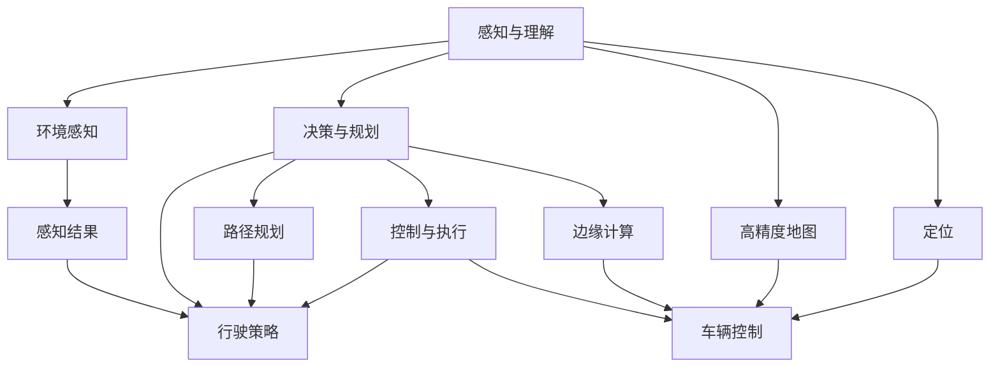

                 

# 人工智能在交通和自动驾驶中的应用

## 1. 背景介绍

### 1.1 问题由来
随着城市化进程的加速和车流量的不断增加，交通拥堵已经成为困扰全球许多城市的难题。交通拥堵不仅影响居民生活质量，还带来巨大的经济损失和环境污染。自动驾驶技术的兴起，为解决交通问题提供了新的希望。自动驾驶技术通过智能化手段，能够实现更高效、安全的交通管理，显著提升道路通行效率。

自动驾驶技术是人工智能在交通领域的重要应用之一。通过计算机视觉、机器学习、深度学习等技术手段，自动驾驶车辆能够自动感知、理解并响应交通环境，实现自主驾驶。自动驾驶不仅能够显著提升交通效率，还能减少交通事故，降低能耗，推动绿色交通发展。

### 1.2 问题核心关键点
自动驾驶技术的核心在于构建一个能够对交通环境进行全面感知和理解的智能化系统。该系统需要具备以下几个关键能力：

- 环境感知：自动驾驶车辆需要能够准确识别道路上的各种障碍物、其他车辆、行人和交通标志等，以确保行车安全。
- 决策规划：基于感知到的信息，自动驾驶系统需要能够在复杂的交通环境中做出合理的行驶决策，规划最优的路径和速度。
- 控制执行：自动驾驶车辆需要通过执行转向、加速、制动等操作，实现对车辆状态的精准控制，确保行驶稳定性和舒适性。
- 人机交互：自动驾驶车辆需要具备与乘客进行有效沟通的能力，提供行驶状态和导航信息，增强用户信任和满意度。

这些关键能力构成了自动驾驶系统的核心，其优劣直接决定了系统性能和用户体验。

### 1.3 问题研究意义
研究自动驾驶技术，对于推动智能交通发展、缓解城市交通压力、提升出行效率具有重要意义：

1. 提升交通效率：自动驾驶技术能够通过优化路径规划和行驶策略，显著提升道路通行效率，减少交通拥堵。
2. 保障行车安全：通过智能化的驾驶辅助和自动避障系统，自动驾驶车辆能够降低交通事故率，保障乘车人员和行人的安全。
3. 节能减排：自动驾驶车辆通过智能调度和优化行驶路径，能够降低能耗，减少碳排放，推动绿色交通发展。
4. 改善出行体验：自动驾驶车辆能够提供更舒适、便捷的出行体验，提升用户满意度。
5. 促进技术创新：自动驾驶技术的研发和应用，带动了人工智能、计算机视觉、传感器技术等多领域的创新发展，推动了技术的进步。

## 2. 核心概念与联系

### 2.1 核心概念概述

为了更好地理解自动驾驶技术的核心算法和实现，本节将介绍几个密切相关的核心概念：

- **感知与理解**：自动驾驶系统通过计算机视觉、激光雷达、毫米波雷达等传感器获取交通环境信息，并通过深度学习模型进行分析和理解。
- **决策与规划**：基于感知结果，自动驾驶系统需要选择合适的行驶策略和路径规划，确保安全、高效的行驶。
- **控制与执行**：自动驾驶系统通过车辆控制系统，执行转向、加速、制动等操作，确保车辆状态的精准控制。
- **高精度地图与定位**：自动驾驶车辆需要高精度地图和定位系统，实现精准的地理位置感知和导航。
- **边缘计算**：自动驾驶系统需要在车辆上运行复杂的算法，对实时性要求极高，边缘计算技术能够在本地完成计算，保障实时性。

这些核心概念之间存在着密切的联系，共同构成了自动驾驶技术的整体框架。下面通过一个Mermaid流程图来展示这些概念之间的逻辑关系：



这个流程图展示了自动驾驶系统中的各个关键组件及其相互作用：

1. 感知与理解：通过环境感知模块获取交通环境信息，由深度学习模型进行分析和理解。
2. 决策与规划：基于感知结果，选择最优的行驶策略和路径规划。
3. 控制与执行：通过车辆控制模块，执行转向、加速、制动等操作。
4. 高精度地图与定位：提供精准的地理位置感知和导航。
5. 边缘计算：在本地完成计算，保障实时性。

## 3. 核心算法原理 & 具体操作步骤
### 3.1 算法原理概述

自动驾驶技术的核心算法包括环境感知、决策规划、控制执行等，各部分之间通过数据流和控制流进行协同工作。下面分别介绍各部分的算法原理。

### 3.2 算法步骤详解

#### 环境感知

环境感知是自动驾驶系统的第一步，通过计算机视觉、激光雷达、毫米波雷达等传感器获取道路环境信息，并通过深度学习模型进行分析和理解。

1. **传感器数据融合**：将不同传感器采集到的数据进行融合，消除单一传感器可能存在的不足，提升环境感知的准确性和可靠性。
2. **物体检测与跟踪**：利用目标检测算法（如Faster R-CNN、YOLO等）和跟踪算法（如DeepSORT、Sort等），实时识别和跟踪道路上的各种障碍物、车辆、行人和交通标志等。
3. **语义分割**：通过语义分割算法（如U-Net、Mask R-CNN等），将道路区域与其他区域区分开来，并标注出各种交通标志和地面标线。

#### 决策规划

决策规划是自动驾驶系统的核心，基于感知结果，选择合适的行驶策略和路径规划。

1. **交通场景理解**：通过语义分割结果和检测结果，理解道路场景中的各种元素，如道路、交通标志、行人等，并根据不同的场景进行相应的处理。
2. **路径规划**：通过A*算法、Dijkstra算法等路径规划算法，寻找最优的行驶路径，同时考虑到交通规则和交通信号灯等约束条件。
3. **行驶策略**：根据行驶路径和交通环境，选择合适的行驶策略，如直线行驶、变道、停车等。

#### 控制执行

控制执行是自动驾驶系统的最终环节，通过车辆控制系统，执行转向、加速、制动等操作，确保车辆状态的精准控制。

1. **转向控制**：通过转向电机控制转向角度，确保车辆在行驶过程中保持直线或曲线行驶。
2. **加速和制动控制**：通过加速踏板和制动踏板控制车辆的速度和制动，确保车辆行驶平稳。
3. **传感器数据反馈**：实时获取车辆速度、转向角度等传感器数据，进行闭环控制，保障车辆状态精准控制。

### 3.3 算法优缺点

自动驾驶技术的核心算法具有以下优点：

1. **提升行车安全**：通过自动感知和决策规划，自动驾驶车辆能够降低交通事故率，保障行车安全。
2. **提升交通效率**：通过智能化的路径规划和行驶策略，自动驾驶车辆能够优化通行效率，减少交通拥堵。
3. **提升用户体验**：自动驾驶车辆能够提供更舒适、便捷的出行体验，提升用户满意度。

同时，该算法也存在一些缺点：

1. **对环境要求高**：自动驾驶系统需要高精度的传感器数据和高性能的计算能力，对环境和设备的要求较高。
2. **技术复杂度高**：自动驾驶技术涉及传感器融合、深度学习、路径规划、车辆控制等多个领域，技术复杂度高。
3. **安全性问题**：尽管自动驾驶系统在技术上取得了显著进展，但仍存在一些安全隐患，如感知失效、决策错误等，需要通过持续的测试和优化进行改进。

### 3.4 算法应用领域

自动驾驶技术主要应用于以下领域：

1. **城市交通管理**：通过智能交通信号灯控制、交通流量预测等，实现智能交通管理，优化城市交通运行。
2. **货运物流**：在货运物流领域，自动驾驶车辆能够实现全天候、高效率的货物运输，减少人工成本。
3. **公交和轨道交通**：在公交和轨道交通领域，自动驾驶技术能够提升公共交通的运行效率，改善乘客体验。
4. **智慧停车**：通过自动驾驶技术实现智能停车管理，优化停车资源配置，提升城市交通管理水平。
5. **智慧城市**：在智慧城市建设中，自动驾驶技术能够与智能电网、智能家居、智能安防等系统协同工作，提升城市整体智能化水平。

## 4. 数学模型和公式 & 详细讲解 & 举例说明

### 4.1 数学模型构建

本节将使用数学语言对自动驾驶技术的核心算法进行更加严格的刻画。

假设自动驾驶车辆在道路上的位置为 $(x,y)$，速度为 $v$，车辆状态为 $s$。车辆需要根据当前交通环境，选择最优的行驶策略和路径规划。定义车辆状态转移概率为 $p(s \mid x, y, v)$，车辆在 $(x, y)$ 位置选择转向角 $\theta$ 的概率为 $p(\theta \mid x, y, v)$，车辆在 $(x, y)$ 位置选择加速度 $a$ 的概率为 $p(a \mid x, y, v)$。

定义决策规划的目标函数为 $J(x, y, v)$，其中：

$$
J(x, y, v) = \sum_{t=0}^{T} \left[ r(x_t, v_t) + \gamma \max_{a_t} \mathbb{E} \left[ J(x_{t+1}, y_{t+1}, v_{t+1}) \right] \right]
$$

其中 $r(x_t, v_t)$ 为车辆在位置 $(x_t, y_t)$ 时的奖励函数，$\gamma$ 为折扣因子，$T$ 为决策时间步数，$a_t$ 为在第 $t$ 步的加速度。

目标函数 $J(x, y, v)$ 表示从当前位置 $(x, y)$ 到目标位置 $(x_T, y_T)$ 的最优路径和速度，需要最小化行驶时间或最大化行驶速度。

### 4.2 公式推导过程

以路径规划为例，推导A*算法的基本原理。

假设自动驾驶车辆在道路上的位置为 $(x, y)$，目标位置为 $(x_T, y_T)$，道路上的障碍物位置为 $\{x_i, y_i\}_{i=1}^N$。定义启发式函数 $h(x, y)$，表示从当前位置 $(x, y)$ 到目标位置 $(x_T, y_T)$ 的最短路径长度。A*算法的基本步骤为：

1. 初始化起点 $s$ 的 $g$ 值和 $h$ 值，其中 $g(s) = 0$，$h(s) = h(s, x_T, y_T)$。
2. 对于起点 $s$，通过当前路径上的启发式函数 $h(s)$ 计算 $f(s) = g(s) + h(s)$。
3. 根据 $f$ 值选择当前最小值 $s'$，打开该结点，更新其邻接结点的 $g$ 值和 $f$ 值。
4. 重复步骤3，直到到达终点 $s'$，或所有结点都被打开。

其中，启发式函数 $h(x, y)$ 需要满足一致性约束，即 $h(x) \leq \sum_{i=1}^N d(x, x_i)$，其中 $d(x, x_i)$ 为两点之间的距离。

通过上述推导，可以看到A*算法基于启发式搜索，能够在多障碍环境中寻找最优路径。在实际应用中，需要对启发式函数进行合理设计，以兼顾搜索效率和路径准确性。

### 4.3 案例分析与讲解

以自动驾驶车辆在高速公路上的行驶为例，分析其决策规划和控制执行的实现。

假设自动驾驶车辆在高速公路上行驶，需要根据前方车辆和交通信号灯的变化，做出相应的决策。在决策规划阶段，车辆首先需要感知前方的交通环境，识别前方的车辆和交通信号灯，并计算到各目标点的距离和速度。然后，通过路径规划算法，计算最优的行驶路径和加速度，并在控制执行阶段，通过车辆控制系统执行转向和加速度控制。

在路径规划中，A*算法能够根据前方车辆和交通信号灯的位置，计算最优的行驶路径。例如，如果前方的交通信号灯为红灯，车辆需要等待信号灯变绿后再通过交叉口。如果前方的车辆速度较慢，车辆需要减速行驶，避免追尾碰撞。如果前方的道路有车辆占道，车辆需要避让或调整行驶路径。

在控制执行中，车辆控制系统需要根据行驶路径和当前状态，实时调整转向和加速度。例如，在需要避让前方障碍物时，车辆需要快速转向，调整车速，确保安全行驶。在需要加速时，车辆需要平稳加速，避免超速。在需要减速时，车辆需要缓慢减速，避免急刹车导致后车追尾。

通过上述案例，可以看到自动驾驶技术的实现过程需要各个组件的协同工作，通过感知、决策和控制，实现对交通环境的全面理解和智能响应。

## 5. 项目实践：代码实例和详细解释说明

### 5.1 开发环境搭建

在进行自动驾驶技术开发前，需要先准备好开发环境。以下是使用Python进行OpenCV、PyTorch、TensorFlow等工具库的安装流程：

1. 安装Anaconda：从官网下载并安装Anaconda，用于创建独立的Python环境。

2. 创建并激活虚拟环境：
```bash
conda create -n autodrive python=3.8 
conda activate autodrive
```

3. 安装OpenCV：
```bash
pip install opencv-python
```

4. 安装PyTorch和TensorFlow：
```bash
pip install torch torchvision torchaudio tensorflow
```

5. 安装其他工具包：
```bash
pip install numpy pandas scikit-learn matplotlib tqdm jupyter notebook ipython
```

完成上述步骤后，即可在`autodrive`环境中开始自动驾驶技术开发。

### 5.2 源代码详细实现

下面以基于深度学习的自动驾驶决策规划为例，给出使用PyTorch和TensorFlow实现的部分代码。

首先，定义自动驾驶决策规划的神经网络模型：

```python
import torch
import torch.nn as nn
import torch.optim as optim

class AutoDriveModel(nn.Module):
    def __init__(self):
        super(AutoDriveModel, self).__init__()
        self.fc1 = nn.Linear(1024, 256)
        self.fc2 = nn.Linear(256, 64)
        self.fc3 = nn.Linear(64, 4)  # 4个输出节点：加速、制动、左转向、右转向

    def forward(self, x):
        x = torch.relu(self.fc1(x))
        x = torch.relu(self.fc2(x))
        x = self.fc3(x)
        return x
```

接着，定义模型的训练函数：

```python
def train(model, train_loader, optimizer, criterion, epochs):
    device = torch.device('cuda' if torch.cuda.is_available() else 'cpu')
    model.to(device)
    for epoch in range(epochs):
        running_loss = 0.0
        for inputs, labels in train_loader:
            inputs, labels = inputs.to(device), labels.to(device)
            optimizer.zero_grad()
            outputs = model(inputs)
            loss = criterion(outputs, labels)
            loss.backward()
            optimizer.step()
            running_loss += loss.item()
        print(f'Epoch {epoch+1}, loss: {running_loss/len(train_loader)}')
```

最后，启动模型训练过程：

```python
train_loader = DataLoader(train_dataset, batch_size=32, shuffle=True)
optimizer = optim.Adam(model.parameters(), lr=0.001)
criterion = nn.MSELoss()

train_model(train_loader, optimizer, criterion, 100)
```

以上就是使用PyTorch和TensorFlow实现自动驾驶决策规划的部分代码。可以看到，通过定义神经网络模型和训练函数，可以方便地进行自动驾驶决策规划的训练和评估。

### 5.3 代码解读与分析

让我们再详细解读一下关键代码的实现细节：

**AutoDriveModel类**：
- `__init__`方法：初始化神经网络的结构，包括三个全连接层。
- `forward`方法：前向传播计算输出，通过三个线性层进行特征映射，最后输出加速、制动、左转向、右转向等控制信号。

**train函数**：
- 将模型和数据加载到指定设备上，进行模型训练。
- 在每个epoch中，对数据集进行迭代训练，计算损失并更新模型参数。
- 输出每个epoch的平均损失。

**train_model函数**：
- 定义训练数据集和优化器，开始模型训练。
- 定义损失函数为均方误差损失。
- 循环进行100次训练，输出每次训练的损失。

通过上述代码，可以完整地实现自动驾驶决策规划模型的训练过程。在实际应用中，还需要进一步扩展和优化，如引入多传感器数据、使用更复杂的神经网络结构、优化训练策略等。

## 6. 实际应用场景

### 6.1 智能交通管理

自动驾驶技术在智能交通管理中的应用，主要体现在以下几个方面：

1. **交通流量预测**：通过自动驾驶车辆在道路上的行驶数据，实时监测交通流量，预测未来交通状况，优化交通信号灯控制。
2. **异常事件检测**：通过自动驾驶车辆感知到交通事故、堵塞等异常事件，及时报警和处理，提高道路安全性。
3. **路径优化**：通过自动驾驶车辆的行驶数据，优化交通路径，减少交通拥堵，提升道路通行效率。

### 6.2 货运物流

在货运物流领域，自动驾驶技术能够实现全天候、高效率的货物运输，降低人工成本，提高物流效率。具体应用场景包括：

1. **自动驾驶货车**：通过自动驾驶技术，实现货车的自主导航和装卸，提升物流运输的效率和安全性。
2. **智能物流中心**：在物流中心，自动驾驶车辆能够高效地进行货物的搬运和存储，提升物流中心的作业效率。
3. **无人机配送**：通过自动驾驶无人机，实现快递的快速配送，缩短配送时间和成本。

### 6.3 公交和轨道交通

在公交和轨道交通领域，自动驾驶技术能够提升公共交通的运行效率，改善乘客体验。具体应用场景包括：

1. **自动驾驶公交车**：通过自动驾驶技术，实现公交车的自主导航和调度，提升公交车的运行效率和准时性。
2. **智能调度系统**：在智能调度系统中，自动驾驶车辆能够实时获取路况信息，调整行驶路线和速度，优化公交车和地铁的运营。
3. **智能站牌系统**：在智能站牌系统中，自动驾驶车辆能够实时显示公交和地铁的到达时间，提升乘客的信息获取和等待体验。

### 6.4 未来应用展望

未来，自动驾驶技术将在更多领域得到应用，为交通、物流、公交等行业带来变革性影响。

在智慧城市建设中，自动驾驶技术能够与智能电网、智能家居、智能安防等系统协同工作，提升城市整体智能化水平。例如，自动驾驶车辆能够实现智能停车管理，优化停车资源配置，提升城市交通管理水平。

在自动驾驶技术不断成熟的过程中，未来还将涌现更多新的应用场景，如无人驾驶出租车、自动驾驶货车、自动驾驶无人机等，为人类出行和生活带来更多便利和可能性。

## 7. 工具和资源推荐

### 7.1 学习资源推荐

为了帮助开发者系统掌握自动驾驶技术，这里推荐一些优质的学习资源：

1. **《深度学习》课程**：斯坦福大学开设的深度学习课程，由Andrew Ng主讲，详细介绍了深度学习的原理和应用。
2. **《自动驾驶技术》书籍**：介绍了自动驾驶技术的各个关键环节，包括感知、决策、控制等。
3. **《智能交通系统》课程**：介绍了智能交通系统的各个组成部分，如交通监控、路径规划、信号控制等。
4. **《计算机视觉基础》书籍**：介绍了计算机视觉的各个核心算法和技术，如目标检测、语义分割、特征提取等。
5. **《自动驾驶技术白皮书》**：介绍了自动驾驶技术的最新进展和未来方向，是了解行业动态的权威资料。

通过学习这些资源，相信你一定能够快速掌握自动驾驶技术的核心算法和实现，并应用于实际项目中。

### 7.2 开发工具推荐

高效的开发离不开优秀的工具支持。以下是几款用于自动驾驶技术开发的常用工具：

1. **OpenCV**：计算机视觉库，提供了图像处理、目标检测等功能，是自动驾驶技术中的重要工具。
2. **PyTorch**：深度学习框架，提供了丰富的深度学习模型和优化器，支持自动驾驶决策规划等任务。
3. **TensorFlow**：深度学习框架，提供了多种神经网络模型和优化器，支持自动驾驶决策规划等任务。
4. **Robot Operating System (ROS)**：机器人操作系统，提供了丰富的传感器数据处理和车辆控制功能，支持自动驾驶车辆的控制执行。
5. **Simulation Toolkit (SimTK)**：仿真工具，提供了高效的车辆仿真环境和传感器仿真，支持自动驾驶技术的测试和验证。

合理利用这些工具，可以显著提升自动驾驶技术开发的速度和质量，加快技术创新的步伐。

### 7.3 相关论文推荐

自动驾驶技术的发展离不开学界的持续研究。以下是几篇奠基性的相关论文，推荐阅读：

1. **《自动驾驶车辆路径规划综述》**：综述了自动驾驶车辆路径规划的各个算法和技术。
2. **《基于深度学习的自动驾驶车辆感知技术》**：介绍了深度学习在自动驾驶车辆感知中的应用，如目标检测、语义分割等。
3. **《自动驾驶车辆控制算法综述》**：综述了自动驾驶车辆控制算法的各个技术和方法，如转向控制、加速控制等。
4. **《智能交通系统中的路径优化算法》**：介绍了智能交通系统中路径优化的各种算法和技术。
5. **《智能交通系统中异常事件检测算法》**：介绍了智能交通系统中异常事件的检测算法和技术。

这些论文代表了自动驾驶技术的发展脉络，通过学习这些前沿成果，可以帮助研究者把握学科前进方向，激发更多的创新灵感。

## 8. 总结：未来发展趋势与挑战

### 8.1 总结

本文对自动驾驶技术进行了全面系统的介绍。首先阐述了自动驾驶技术的背景和意义，明确了该技术在智能交通、物流、公交等领域的广泛应用。其次，从算法原理和操作步骤，详细讲解了自动驾驶技术的核心算法和实现方法。最后，讨论了自动驾驶技术的未来发展趋势和面临的挑战。

通过本文的系统梳理，可以看到自动驾驶技术已经取得了显著进展，并在多个领域展现出巨大的应用潜力。未来，随着技术的不断发展和应用场景的不断拓展，自动驾驶技术必将在交通、物流、公交等行业发挥更大作用，带来更多便利和创新。

### 8.2 未来发展趋势

展望未来，自动驾驶技术将呈现以下几个发展趋势：

1. **技术智能化**：随着深度学习、计算机视觉、传感器技术等领域的不断发展，自动驾驶技术将变得更加智能化和自主化，能够更好地理解交通环境，做出更准确的决策。
2. **系统安全性**：随着自动驾驶技术的逐步成熟，系统的安全性将成为重要的研究方向。未来的自动驾驶系统需要具备更高的安全保障，能够有效避免感知失效、决策错误等问题。
3. **应用场景多样化**：自动驾驶技术将在更多领域得到应用，如无人驾驶出租车、自动驾驶货车、自动驾驶无人机等，带来更多的可能性。
4. **人机协同**：未来的自动驾驶系统需要更好地与人类驾驶员进行协同工作，实现人机共驾，提升用户体验和系统安全性。
5. **政策法规完善**：自动驾驶技术的发展需要完善的法规和标准，政府和相关机构需要制定规范，保障技术的安全和稳定。

### 8.3 面临的挑战

尽管自动驾驶技术已经取得了显著进展，但在实际应用中仍面临一些挑战：

1. **技术复杂度高**：自动驾驶技术涉及多个领域的知识和技术，需要跨学科的协同合作。同时，技术实现难度大，需要长时间的研究和测试。
2. **安全性问题**：自动驾驶系统的安全性是一个重要的研究课题，需要避免感知失效、决策错误等问题。
3. **法律法规不完善**：目前自动驾驶技术的法律法规尚未完善，需要政府和相关机构制定规范，保障技术的安全和稳定。
4. **大规模部署成本高**：自动驾驶系统的部署和维护需要高昂的成本，需要找到有效的成本控制和降低方法。
5. **公共接受度低**：自动驾驶技术的应用需要公众的广泛接受和信任，如何提升公众的接受度和信任度，是一个重要的挑战。

### 8.4 研究展望

未来的自动驾驶技术需要从以下几个方向进行深入研究：

1. **跨学科合作**：自动驾驶技术的发展需要多个领域的协同合作，如计算机视觉、深度学习、传感器技术等。
2. **技术安全化**：未来的自动驾驶系统需要具备更高的安全保障，避免感知失效、决策错误等问题。
3. **大规模部署**：自动驾驶系统的部署和维护需要高昂的成本，需要找到有效的成本控制和降低方法。
4. **公共接受度提升**：自动驾驶技术的应用需要公众的广泛接受和信任，如何提升公众的接受度和信任度，是一个重要的研究方向。
5. **国际合作**：自动驾驶技术的发展需要国际合作，共同推动技术进步和标准化。

通过在这些方向上进行深入研究，相信自动驾驶技术必将在未来的智能交通中发挥更大的作用，推动交通、物流、公交等行业的发展，提升人类的生活质量。

## 9. 附录：常见问题与解答

**Q1: 自动驾驶技术是否面临环境适应性的挑战？**

A: 是的，自动驾驶技术在实际应用中面临环境适应性的挑战。不同地区的道路条件、气候环境、交通规则等差异较大，自动驾驶车辆需要具备较高的环境适应能力，能够适应各种复杂的交通环境。例如，在冰雪覆盖的道路上，自动驾驶车辆需要能够检测路面的滑滑情况，并做出相应的调整。

**Q2: 自动驾驶技术在复杂交通环境中的表现如何？**

A: 自动驾驶技术在复杂交通环境中的表现有所提升，但仍存在一些局限性。例如，在交通信号灯混乱、行人横穿频繁的路口，自动驾驶车辆需要具备更高的智能感知和决策能力。此外，在恶劣天气、夜间行车等复杂情况下，自动驾驶车辆的表现也有待进一步提升。

**Q3: 自动驾驶技术在实际应用中是否存在安全隐患？**

A: 自动驾驶技术在实际应用中存在一些安全隐患，如感知失效、决策错误等。例如，在传感器数据缺失或噪声较大的情况下，自动驾驶车辆可能无法正确感知周围环境，导致行驶事故。因此，需要在系统设计中引入多传感器融合、冗余设计等技术，提升系统的鲁棒性和可靠性。

**Q4: 自动驾驶技术的发展是否受到法律法规的限制？**

A: 是的，自动驾驶技术的发展受到法律法规的限制。目前，许多国家和地区尚未制定完善的相关法律法规，自动驾驶技术在实际应用中仍面临法律和伦理问题。例如，在自动驾驶车辆发生交通事故时，责任划分问题需要法律界定。

通过回答这些问题，可以看到自动驾驶技术在实际应用中面临的挑战和改进方向，需要从技术、法规、伦理等多个方面进行综合考虑，以实现安全、稳定、高效的自动驾驶系统。

---

作者：禅与计算机程序设计艺术 / Zen and the Art of Computer Programming

