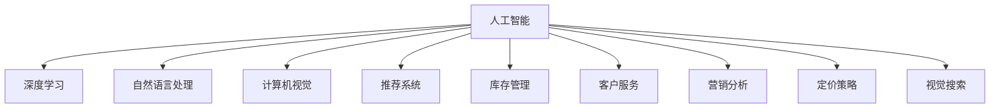

                 

# 人工智能在零售和电子商务中的应用

## 1. 背景介绍

### 1.1 问题由来
人工智能(AI)在零售和电子商务中的应用已经引起了广泛的关注。随着互联网和移动设备的普及，消费者对在线购物的便利性和个性化需求日益增加，零售商和电商平台面临着如何提供更优质的购物体验和提升运营效率的挑战。AI技术，特别是深度学习、自然语言处理、计算机视觉等前沿技术，为解决这些问题提供了新的思路和方法。

### 1.2 问题核心关键点
AI在零售和电子商务中的应用主要体现在以下几个方面：
- **个性化推荐**：根据用户的历史行为和偏好，推荐符合用户兴趣的商品。
- **库存管理**：通过预测销量和优化供应链，实现库存的最优管理。
- **客户服务**：利用AI客服、聊天机器人等技术，提供24/7的客户支持。
- **营销分析**：通过数据分析和机器学习，优化营销策略，提升转化率和客户留存率。
- **定价策略**：通过需求预测和定价算法，优化商品定价，提升销售收益。
- **视觉搜索**：利用图像识别和分类技术，实现基于图像的商品搜索。

### 1.3 问题研究意义
AI在零售和电子商务中的应用，对于提高客户满意度、降低运营成本、增强市场竞争力具有重要意义：

1. **提升客户体验**：通过个性化的商品推荐和高效的客户服务，满足消费者多样化、个性化的需求。
2. **优化运营效率**：通过智能化的库存管理和预测分析，提升供应链的响应速度和资源利用率。
3. **提高转化率**：利用AI优化广告投放和定价策略，提升营销效果和销售转化率。
4. **数据驱动决策**：通过大数据分析和机器学习，为企业提供精准的市场洞察和决策支持。
5. **增强安全性**：利用AI技术进行欺诈检测和风险控制，保障交易安全。

## 2. 核心概念与联系

### 2.1 核心概念概述

为更好地理解AI在零售和电子商务中的应用，本节将介绍几个密切相关的核心概念：

- **人工智能(AI)**：通过计算机模拟人类智能行为的技术体系，包括机器学习、深度学习、自然语言处理、计算机视觉等。
- **深度学习(Deep Learning)**：一种基于神经网络的机器学习方法，通过多层次的非线性变换，实现对复杂数据的建模和预测。
- **自然语言处理(NLP)**：使计算机能够理解、处理和生成自然语言的技术，如文本分类、情感分析、机器翻译等。
- **计算机视觉(Computer Vision)**：使计算机能够识别、理解和生成视觉信息的领域，如图像分类、目标检测、人脸识别等。
- **推荐系统(Recommendation System)**：根据用户历史行为和偏好，推荐潜在兴趣商品的技术。
- **库存管理(Inventory Management)**：通过预测销售需求和优化供应链，实现库存的最优管理。
- **客户服务(Customer Service)**：通过AI客服、聊天机器人等技术，提供24/7的客户支持。
- **营销分析(Marketing Analytics)**：通过数据分析和机器学习，优化营销策略，提升转化率和客户留存率。
- **定价策略(Pricing Strategy)**：通过需求预测和定价算法，优化商品定价，提升销售收益。
- **视觉搜索(Visual Search)**：利用图像识别和分类技术，实现基于图像的商品搜索。

这些核心概念之间的逻辑关系可以通过以下Mermaid流程图来展示：



这个流程图展示了大语言模型的核心概念及其之间的关系：

1. 人工智能通过深度学习、自然语言处理、计算机视觉等技术，构建出复杂模型，实现对各种数据的理解和处理。
2. 推荐系统、库存管理、客户服务、营销分析、定价策略、视觉搜索等技术，均依赖于人工智能技术的基础。
3. 这些技术的应用，进一步提升了零售和电子商务的运营效率和用户体验。

## 3. 核心算法原理 & 具体操作步骤
### 3.1 算法原理概述

AI在零售和电子商务中的应用，通常依赖于以下核心算法原理：

- **深度学习模型**：通过多层次的神经网络结构，对数据进行特征提取和模式识别。
- **推荐算法**：如协同过滤、基于内容的推荐、矩阵分解等，根据用户历史行为和商品特征，预测用户对新商品的兴趣。
- **时间序列预测**：如ARIMA、LSTM等，通过时间序列数据，预测未来的库存需求和销售趋势。
- **自然语言处理技术**：如文本分类、情感分析、命名实体识别等，处理和分析客户评论、客服聊天记录等文本数据。
- **计算机视觉技术**：如图像分类、目标检测、人脸识别等，实现对商品图像的识别和分类。
- **客户服务技术**：如对话系统、聊天机器人等，提供24/7的客户支持。
- **营销分析算法**：如回归分析、聚类分析、多臂赌博机等，优化广告投放和促销策略。
- **定价策略算法**：如动态定价、拍卖机制等，优化商品定价，提升销售收益。

### 3.2 算法步骤详解

基于AI在零售和电子商务中的应用，一般包括以下几个关键步骤：

**Step 1: 数据收集与预处理**
- 收集用户行为数据、商品信息、市场数据、交易数据等，构建数据集。
- 对数据进行清洗、去重、标准化等预处理操作。

**Step 2: 模型训练与选择**
- 选择合适的深度学习模型或推荐算法，如CNN、RNN、GRU、协同过滤等。
- 利用训练数据集对模型进行训练，调整超参数，选择最优模型。

**Step 3: 特征工程**
- 提取和选择对目标任务有帮助的特征，如用户行为特征、商品属性特征、时间特征等。
- 进行特征缩放、归一化等处理，提高模型训练效率和性能。

**Step 4: 模型优化与评估**
- 使用验证集对模型进行优化和评估，调整超参数，选择最优模型。
- 使用测试集对模型进行最终评估，验证模型的泛化能力。

**Step 5: 模型部署与应用**
- 将训练好的模型部署到生产环境，实现自动化预测和推荐。
- 根据实时数据动态调整模型参数，提升模型性能。

### 3.3 算法优缺点

AI在零售和电子商务中的应用具有以下优点：
1. 提高运营效率：通过自动化和智能化手段，提升供应链管理、库存控制、客户服务等方面的效率。
2. 优化用户体验：通过个性化推荐和智能客服，提供更精准、便捷的购物体验。
3. 提升销售转化率：通过营销分析和定价策略，优化广告投放和促销策略，提升转化率。
4. 数据驱动决策：通过大数据分析和机器学习，提供精准的市场洞察和决策支持。

同时，这些应用也存在一定的局限性：
1. 数据质量要求高：模型的性能依赖于高质量的数据，需要严格的预处理和清洗。
2. 技术门槛较高：深度学习、自然语言处理等技术门槛较高，需要专业的技术团队支持。
3. 隐私和安全问题：用户数据隐私保护和模型安全问题需要特别注意，避免数据泄露和模型滥用。
4. 动态环境适应性：模型需要适应不断变化的市场环境，实时更新和优化模型。

尽管存在这些局限性，但就目前而言，AI在零售和电子商务中的应用已经取得了显著的效果，得到了广泛的应用和认可。未来，随着技术的不断进步和数据的积累，AI将进一步提升零售和电子商务的智能化水平。

### 3.4 算法应用领域

AI在零售和电子商务中的应用涵盖了多个领域，具体如下：

- **个性化推荐**：电商平台通过深度学习和推荐算法，为用户推荐个性化商品。例如，Amazon、阿里巴巴等电商巨头，通过用户行为数据和商品属性特征，提供精准的商品推荐。
- **库存管理**：零售商通过时间序列预测和优化算法，实现库存的最优管理。例如，沃尔玛通过预测销售需求和优化供应链，实现库存的最优管理。
- **客户服务**：电商平台通过AI客服和聊天机器人，提供24/7的客户支持。例如，腾讯微服务、京东智能客服等，通过自然语言处理技术，实现智能客服。
- **营销分析**：电商平台通过数据分析和机器学习，优化广告投放和促销策略。例如，Facebook通过用户行为数据和机器学习算法，优化广告投放和营销策略。
- **定价策略**：零售商通过需求预测和定价算法，优化商品定价。例如，亚马逊通过动态定价算法，优化商品定价。
- **视觉搜索**：电商平台通过图像识别和分类技术，实现基于图像的商品搜索。例如，淘宝、Instagram等平台，通过计算机视觉技术，实现视觉搜索。

除了上述这些经典应用外，AI在零售和电子商务中的应用还在不断拓展，如基于图像的自动补货、智能仓储管理、个性化视频广告等，为电商业务带来了新的发展机遇。

## 4. 数学模型和公式 & 详细讲解  
### 4.1 数学模型构建

AI在零售和电子商务中的应用，通常依赖于以下数学模型：

**深度学习模型**：
- **卷积神经网络(CNN)**：用于图像分类、目标检测等计算机视觉任务。
- **循环神经网络(RNN)**：用于文本分类、情感分析等自然语言处理任务。
- **长短期记忆网络(LSTM)**：用于时间序列预测等任务。

**推荐算法**：
- **协同过滤**：利用用户和商品的协同关系，推荐用户可能感兴趣的商品。
- **基于内容的推荐**：根据商品属性特征，推荐相似的商品。
- **矩阵分解**：利用矩阵分解技术，提取用户和商品的潜在表示。

**时间序列预测**：
- **ARIMA**：自回归积分滑动平均模型，用于时间序列数据的建模和预测。
- **LSTM**：长短期记忆网络，用于时间序列数据的建模和预测。

**自然语言处理技术**：
- **文本分类**：利用机器学习算法，将文本分类到预定义的类别中。
- **情感分析**：利用机器学习算法，分析文本的情感倾向。
- **命名实体识别**：利用机器学习算法，识别文本中的实体信息。

**客户服务技术**：
- **对话系统**：利用自然语言处理技术，实现智能客服。
- **聊天机器人**：利用自然语言处理技术，实现智能客服。

**营销分析算法**：
- **回归分析**：用于预测用户的购买行为。
- **聚类分析**：用于用户分群和行为分析。
- **多臂赌博机**：用于优化广告投放策略。

**定价策略算法**：
- **动态定价**：根据市场变化动态调整商品价格。
- **拍卖机制**：通过竞价机制优化商品定价。

### 4.2 公式推导过程

以下我们以协同过滤推荐系统为例，推导协同过滤的推荐算法公式。

设用户集合为$U$，商品集合为$I$，用户对商品的评分矩阵为$R$，即$R_{ui}=r_{ui}$。协同过滤的推荐算法通过用户和商品间的相似性，为用户推荐可能感兴趣的商品。

假设当前用户$u$对商品$v$的评分$r_{uv}$为已知的，我们需要预测用户$u$对商品$v'$的评分$r_{uv'}$。协同过滤算法通过计算用户$u$和商品$v'$的相似度$s_{uv'}$，来预测$r_{uv'}$。

协同过滤的相似度计算公式为：
$$
s_{uv'} = \frac{\sum_{i \in I}(r_{ui} - \bar{r}_u)(r_{iv'} - \bar{r}_i)}{\sqrt{\sum_{i \in I}(r_{ui} - \bar{r}_u)^2}\sqrt{\sum_{i \in I}(r_{iv'} - \bar{r}_i)^2}}
$$
其中$\bar{r}_u$和$\bar{r}_i$分别为用户$u$和商品$v$的评分均值。

根据上述相似度计算公式，协同过滤算法将用户$u$对商品$v'$的预测评分$r_{uv'}$计算如下：
$$
r_{uv'} = \bar{r}_u + s_{uv'}(\bar{r}_{v'} - \bar{r}_u)
$$

该公式展示了协同过滤算法通过用户和商品的相似性，预测用户可能感兴趣的商品评分，进而为用户推荐商品。

## 5. 项目实践：代码实例和详细解释说明
### 5.1 开发环境搭建

在进行AI在零售和电子商务中的应用开发前，我们需要准备好开发环境。以下是使用Python进行TensorFlow开发的环境配置流程：

1. 安装Anaconda：从官网下载并安装Anaconda，用于创建独立的Python环境。

2. 创建并激活虚拟环境：
```bash
conda create -n tf-env python=3.8 
conda activate tf-env
```

3. 安装TensorFlow：根据CUDA版本，从官网获取对应的安装命令。例如：
```bash
conda install tensorflow -c conda-forge
```

4. 安装Scikit-learn、Numpy等各类工具包：
```bash
pip install scikit-learn numpy pandas matplotlib
```

完成上述步骤后，即可在`tf-env`环境中开始AI开发实践。

### 5.2 源代码详细实现

下面我们以协同过滤推荐系统为例，给出使用TensorFlow进行推荐系统开发的PyTorch代码实现。

首先，定义推荐系统的数据处理函数：

```python
import tensorflow as tf
from tensorflow.keras.layers import Dense, Embedding, Input
from tensorflow.keras.models import Model

class CollaborativeFilteringModel:
    def __init__(self, num_users, num_items, embedding_dim, num_factors):
        self.num_users = num_users
        self.num_items = num_items
        self.embedding_dim = embedding_dim
        self.num_factors = num_factors
        
        self.user_input = Input(shape=(1,), name='user')
        self.item_input = Input(shape=(1,), name='item')
        
        self.user_embedding = Embedding(num_users, embedding_dim, name='user_embedding')(self.user_input)
        self.item_embedding = Embedding(num_items, embedding_dim, name='item_embedding')(self.item_input)
        
        self.user_item_inner = tf.keras.layers.Dot(axes=[1, 1], normalize=True)([self.user_embedding, self.item_embedding])
        self.user_item_bias = tf.Variable(tf.zeros((num_items,)))
        
        self.user_item_output = tf.keras.layers.Activation('sigmoid')(self.user_item_inner + self.user_item_bias)
        self.predictions = tf.keras.layers.Dense(num_items, activation='softmax')(self.user_item_output)
        
        self.model = Model(inputs=[self.user_input, self.item_input], outputs=self.predictions)
        
    def compile(self, optimizer='adam', loss='categorical_crossentropy'):
        self.model.compile(optimizer=optimizer, loss=loss)
        
    def fit(self, train_data, epochs=10, batch_size=32, validation_data=None):
        self.model.fit(x=train_data, epochs=epochs, batch_size=batch_size, validation_data=validation_data)
```

然后，定义数据集并训练模型：

```python
# 数据集定义
train_data = tf.data.Dataset.from_tensor_slices((tf.range(num_users), tf.range(num_items)))
train_data = train_data.shuffle(buffer_size=1000).batch(batch_size)

# 模型训练
model = CollaborativeFilteringModel(num_users=num_users, num_items=num_items, embedding_dim=100, num_factors=10)
model.compile(optimizer='adam', loss='categorical_crossentropy')
model.fit(train_data, epochs=10, batch_size=32, validation_data=validation_data)
```

最后，评估和预测：

```python
# 模型评估和预测
test_data = tf.data.Dataset.from_tensor_slices((tf.range(num_users), tf.range(num_items)))
test_data = test_data.shuffle(buffer_size=1000).batch(batch_size)
test_loss = model.evaluate(x=test_data)
predictions = model.predict(x=test_data)
```

以上就是使用TensorFlow对协同过滤推荐系统进行开发的完整代码实现。可以看到，TensorFlow提供了强大的深度学习框架，使模型训练和推理变得简单高效。

### 5.3 代码解读与分析

让我们再详细解读一下关键代码的实现细节：

**CollaborativeFilteringModel类**：
- `__init__`方法：初始化用户数、商品数、嵌入维度、因子数等关键参数，定义用户和商品的嵌入层。
- `compile`方法：定义模型的优化器和损失函数。
- `fit`方法：对训练数据进行模型训练。

**数据集定义**：
- `train_data`：定义训练数据的输入，通过`range`函数生成用户和商品的id，使用`from_tensor_slices`函数转换为张量，并使用`shuffle`和`batch`函数进行数据预处理。

**模型训练和评估**：
- `model.compile`：定义模型的优化器和损失函数。
- `model.fit`：对训练数据进行模型训练，使用`evaluate`函数在验证集上评估模型性能。
- `test_data`：定义测试数据的输入，与训练数据类似，使用`range`函数生成用户和商品的id。

可以看到，TensorFlow提供了丰富的API，方便开发者进行深度学习模型的设计和训练。通过使用TensorFlow，开发者可以快速构建和优化推荐系统，满足电商平台的个性化推荐需求。

当然，工业级的系统实现还需考虑更多因素，如模型的保存和部署、超参数的自动搜索、更灵活的任务适配层等。但核心的推荐范式基本与此类似。

## 6. 实际应用场景
### 6.1 智能客服系统

AI在智能客服系统中的应用，极大地提升了客户服务的效率和质量。通过使用自然语言处理和机器学习技术，智能客服系统可以自动识别用户问题并提供快速准确的答案，减少了人工客服的响应时间和人力成本。

在技术实现上，可以收集历史客服对话记录，将问题和最佳答复构建成监督数据，在此基础上对深度学习模型进行训练。训练后的模型可以自动理解用户意图，匹配最合适的答案模板进行回复。对于新问题，系统还可以实时搜索相关知识库，动态组织生成回答。如此构建的智能客服系统，能大幅提升客户咨询体验和问题解决效率。

### 6.2 金融舆情监测

AI在金融舆情监测中的应用，有助于金融机构及时掌握市场舆论动向，规避金融风险。通过自然语言处理和机器学习技术，AI系统可以自动监测金融领域的报道、评论等文本数据，分析其情感倾向和话题热点。一旦发现负面信息激增等异常情况，系统便会自动预警，帮助金融机构快速应对潜在风险。

在技术实现上，可以收集金融领域的文本数据，利用情感分析等技术对数据进行情感倾向性分析，利用主题模型等技术对数据进行话题热点分析。通过结合情感分析和话题热点分析，构建出舆情监测系统，实时监测金融市场的动态变化。

### 6.3 个性化推荐系统

AI在个性化推荐系统中的应用，使得电商平台能够更好地满足用户多样化、个性化的需求。通过深度学习模型和推荐算法，系统可以根据用户的历史行为和偏好，推荐符合用户兴趣的商品。

在技术实现上，可以收集用户浏览、点击、评论、分享等行为数据，提取和商品标题、描述、标签等文本内容。将文本内容作为模型输入，用户的后续行为（如是否点击、购买等）作为监督信号，在此基础上对深度学习模型进行训练。训练后的模型能够从文本内容中准确把握用户的兴趣点。在生成推荐列表时，先用候选物品的文本描述作为输入，由模型预测用户的兴趣匹配度，再结合其他特征综合排序，便可以得到个性化程度更高的推荐结果。

### 6.4 未来应用展望

随着AI技术的不断进步，AI在零售和电子商务中的应用将更加广泛和深入。以下是几个可能的未来应用方向：

1. **智能仓储管理**：通过计算机视觉和机器人技术，实现智能仓储和物流管理，提高仓储效率和物流成本。
2. **虚拟试衣间**：通过计算机视觉和增强现实技术，实现虚拟试衣间，提升用户的购物体验。
3. **个性化视频广告**：通过深度学习技术和推荐算法，为用户推荐个性化的视频广告，提升广告的点击率和转化率。
4. **供应链优化**：通过机器学习和大数据分析技术，优化供应链管理，实现动态调度和库存控制。
5. **智能定价策略**：通过深度学习技术和大数据分析，实现智能定价策略，提高销售收益和客户满意度。
6. **自动化客服**：通过自然语言处理和机器学习技术，实现自动化客服系统，提供全天候客户支持。

这些应用方向将进一步提升零售和电子商务的智能化水平，为消费者带来更加便捷和优质的购物体验。未来，AI在零售和电子商务中的应用将更加广泛，为整个行业带来颠覆性的变革。

## 7. 工具和资源推荐
### 7.1 学习资源推荐

为了帮助开发者系统掌握AI在零售和电子商务中的应用，这里推荐一些优质的学习资源：

1. **深度学习课程**：如Coursera的《Deep Learning Specialization》、Udacity的《Deep Learning Nanodegree》等，系统学习深度学习理论和实践。

2. **自然语言处理课程**：如Stanford的《CS224N: Natural Language Processing with Deep Learning》课程，深入了解自然语言处理的基本概念和技术。

3. **推荐系统书籍**：如《推荐系统实践》、《推荐系统：算法与实战》等，系统学习推荐系统的设计和实现。

4. **计算机视觉书籍**：如《Deep Learning for Computer Vision》、《Hands-On Computer Vision with Python》等，深入学习计算机视觉技术的理论和技术。

5. **TensorFlow官方文档**：TensorFlow的官方文档提供了丰富的教程和示例，方便开发者学习和使用TensorFlow框架。

通过这些学习资源，相信你一定能够快速掌握AI在零售和电子商务中的应用，并用于解决实际的业务问题。

### 7.2 开发工具推荐

高效的开发离不开优秀的工具支持。以下是几款用于AI在零售和电子商务中的应用开发的常用工具：

1. **TensorFlow**：由Google主导开发的开源深度学习框架，生产部署方便，适合大规模工程应用。

2. **PyTorch**：Facebook开源的深度学习框架，灵活高效，适合研究和原型开发。

3. **Keras**：高层API，方便快速搭建深度学习模型。

4. **Scikit-learn**：机器学习库，提供了丰富的算法和工具，方便快速实现机器学习模型。

5. **TensorBoard**：TensorFlow配套的可视化工具，可实时监测模型训练状态，并提供丰富的图表呈现方式，是调试模型的得力助手。

6. **Weights & Biases**：模型训练的实验跟踪工具，可以记录和可视化模型训练过程中的各项指标，方便对比和调优。

合理利用这些工具，可以显著提升AI在零售和电子商务中的应用开发效率，加快创新迭代的步伐。

### 7.3 相关论文推荐

AI在零售和电子商务中的应用源于学界的持续研究。以下是几篇奠基性的相关论文，推荐阅读：

1. **《Collaborative Filtering for E-commerce Recommendation Systems》**：介绍了协同过滤推荐系统的基本原理和算法，是推荐系统领域的经典之作。

2. **《Deep Learning for Natural Language Processing》**：介绍了深度学习在自然语言处理中的应用，包括文本分类、情感分析、机器翻译等。

3. **《ImageNet Classification with Deep Convolutional Neural Networks》**：介绍了卷积神经网络在图像分类中的应用，奠定了计算机视觉领域的基础。

4. **《A Survey on Recommender Systems》**：综述了推荐系统的多种算法和技术，为推荐系统的设计和实现提供了重要的理论指导。

5. **《Customer Response Prediction with Machine Learning》**：介绍了机器学习在客户响应预测中的应用，为电商平台的营销策略优化提供了重要的支持。

这些论文代表了大语言模型微调技术的发展脉络。通过学习这些前沿成果，可以帮助研究者把握学科前进方向，激发更多的创新灵感。

## 8. 总结：未来发展趋势与挑战
### 8.1 研究成果总结

AI在零售和电子商务中的应用，对于提高客户满意度、降低运营成本、增强市场竞争力具有重要意义。深度学习、自然语言处理、计算机视觉等技术，为零售和电子商务提供了强大的技术支持。通过个性化推荐、库存管理、客户服务、营销分析、定价策略、视觉搜索等技术，实现了电商平台的智能化和自动化，提升了用户体验和运营效率。

### 8.2 未来发展趋势

展望未来，AI在零售和电子商务中的应用将呈现以下几个发展趋势：

1. **技术融合**：AI技术与其他技术（如物联网、区块链、大数据等）深度融合，形成更加全面和智能的解决方案。
2. **个性化定制**：通过用户画像和行为数据分析，提供更加个性化和定制化的产品和服务。
3. **智能客服升级**：通过自然语言处理和机器学习技术，实现更加智能和自然的客服交互，提高客户满意度。
4. **智能仓储和物流**：通过机器人和计算机视觉技术，实现智能仓储和物流管理，提高效率和准确性。
5. **新场景应用**：AI技术在更多新场景中的应用，如虚拟试衣间、个性化视频广告等，提升用户体验。
6. **数据安全和隐私**：在数据安全和隐私保护方面不断提升，确保用户数据的安全和隐私。

### 8.3 面临的挑战

尽管AI在零售和电子商务中的应用已经取得了显著的效果，但在迈向更加智能化、普适化应用的过程中，它仍面临着诸多挑战：

1. **数据质量和隐私**：高质量的数据是AI应用的前提，但获取和处理大规模数据往往需要大量的人力和资源。同时，用户数据隐私保护也是一大挑战。
2. **模型复杂度**：深度学习模型的复杂度越来越高，需要更高的计算资源和算法优化。如何降低模型的复杂度，提高模型的训练和推理效率，是一个重要问题。
3. **算法透明性和可解释性**：深度学习模型的黑盒特性，使得其内部工作机制难以解释，用户和监管机构对模型的信任度降低。
4. **模型鲁棒性和泛化能力**：深度学习模型往往容易出现过拟合，泛化能力不足，特别是在动态环境下的适应能力。
5. **技术普及和人才培养**：AI技术的普及和人才培养需要更多的时间和资源投入，如何提高AI技术的普及率，培养更多高素质的AI人才，是一个长期挑战。

尽管存在这些挑战，但随着技术的不断进步和数据积累，AI在零售和电子商务中的应用前景依然广阔。相信未来在更多学科和技术领域，AI将持续发挥其强大的赋能作用，为人类社会带来更多创新和变革。

### 8.4 研究展望

未来，AI在零售和电子商务中的应用将不断深化和拓展，研究热点将集中在以下几个方面：

1. **多模态学习**：结合图像、文本、语音等多种模态数据，实现更加全面的信息理解和分析。
2. **动态环境适应**：提升模型在动态环境下的适应能力，增强其在现实场景中的鲁棒性。
3. **跨领域迁移**：实现跨领域知识迁移，提升模型的泛化能力和应用范围。
4. **模型解释性和可控性**：提升模型的可解释性和可控性，增强用户信任和接受度。
5. **数据驱动决策**：进一步挖掘数据潜力，提升决策支持系统的精准度和智能化水平。

通过在这些领域的持续探索和研究，AI在零售和电子商务中的应用将更加智能化和普及化，为整个行业带来更深刻的变革和创新。

## 9. 附录：常见问题与解答

**Q1：AI在零售和电子商务中的应用是否会取代传统业务？**

A: AI在零售和电子商务中的应用，更多地是赋能传统业务，提升其智能化和自动化水平，而不是取代传统业务。AI技术可以在客户服务、营销分析、库存管理等方面提供强大的支持，帮助企业更好地应对市场变化和用户需求。AI技术并不会取代人工，而是与人类协同工作，共同提升企业的运营效率和客户体验。

**Q2：AI在零售和电子商务中的应用是否会带来数据隐私问题？**

A: AI在零售和电子商务中的应用，确实会涉及到用户数据的收集和分析，因此数据隐私保护是必须重视的问题。企业应采取严格的数据保护措施，如数据加密、匿名化处理、访问控制等，确保用户数据的隐私和安全。同时，应遵守相关法律法规，如GDPR、CCPA等，保护用户的数据权益。

**Q3：AI在零售和电子商务中的应用是否需要高昂的计算资源？**

A: AI在零售和电子商务中的应用，确实需要较高的计算资源，特别是深度学习模型的训练和推理。但随着云计算和边缘计算技术的发展，这些问题正在逐步得到解决。企业可以通过云服务和边缘计算，降低计算成本，提升计算效率。同时，AI技术的不断进步，也使得计算资源的需求逐渐降低，AI应用变得更加普及和高效。

**Q4：AI在零售和电子商务中的应用是否容易受到市场环境的影响？**

A: AI在零售和电子商务中的应用，确实需要实时获取市场数据和环境信息，因此对市场环境的变化较为敏感。但通过动态调参和模型优化，可以有效提升模型的鲁棒性和泛化能力，应对市场环境的快速变化。同时，应建立市场监测和预警机制，及时发现市场风险和机会，做出及时调整和应对。

**Q5：AI在零售和电子商务中的应用是否需要大量的标注数据？**

A: AI在零售和电子商务中的应用，确实需要大量的标注数据，以便进行有效的模型训练和优化。但通过半监督学习、无监督学习和迁移学习等技术，可以在一定程度上缓解标注数据的需求。同时，企业可以采用主动学习和强化学习等技术，减少标注数据的依赖，提升AI应用的效果。

通过这些问题的解答，相信你更加了解AI在零售和电子商务中的应用，能够更好地应对实际业务挑战。

