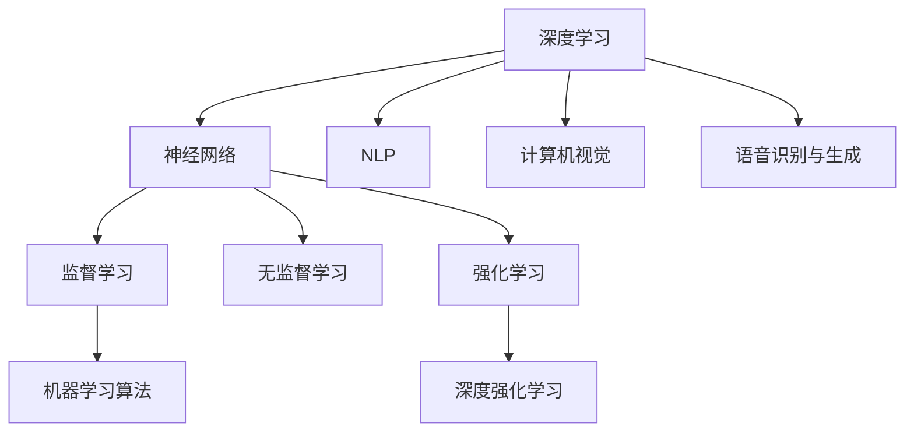

                 

# 人工智能导论原理与代码实战案例讲解

> 关键词：人工智能,机器学习,深度学习,神经网络,深度强化学习,自然语言处理,计算机视觉,图像识别,语音识别

## 1. 背景介绍

### 1.1 问题由来
人工智能(AI)是21世纪最热门的技术之一，其应用范围遍及各行各业，从医疗、金融到教育、娱乐，无所不包。而要深入理解和应用AI，需要对其中的核心技术有深刻理解，并能够进行代码实现。本文旨在系统介绍人工智能导论的原理，并通过代码实战案例，帮助读者全面掌握相关知识。

### 1.2 问题核心关键点
1. **深度学习与神经网络**：深度学习是AI的重要分支，通过多层神经网络对数据进行建模和学习。掌握神经网络的基本概念和实现方法，是理解AI的基础。
2. **机器学习算法**：包括监督学习、无监督学习和强化学习等基本算法。理解这些算法的设计思想和实现步骤，对于解决实际问题至关重要。
3. **深度强化学习**：结合深度学习与强化学习，通过智能体在环境中与环境交互，不断优化决策策略，解决复杂的控制和规划问题。
4. **自然语言处理(NLP)**：涉及文本处理、语言模型、情感分析、机器翻译等任务，是AI应用中不可或缺的一环。
5. **计算机视觉**：包括图像识别、目标检测、图像分割等任务，通过深度学习模型对视觉数据进行理解和处理。
6. **语音识别与生成**：包括语音识别、语音合成等任务，通过深度学习模型对语音信号进行转换和处理。

### 1.3 问题研究意义
深入理解和掌握人工智能导论的原理，不仅能够帮助研究者进行前沿研究，还能为行业从业者提供实际应用的指导。通过代码实战案例讲解，读者可以更直观地理解理论知识，并学会如何通过编程实现AI技术，从而加速其在各行各业的应用落地。

## 2. 核心概念与联系

### 2.1 核心概念概述

为更好地理解人工智能导论的原理，本节将介绍几个密切相关的核心概念：

- **深度学习**：通过多层神经网络对数据进行建模和学习，目的是学习数据的高级表示。
- **神经网络**：由一系列神经元组成的网络结构，用于对输入数据进行编码和解码。
- **监督学习**：利用有标注的数据，通过模型学习输入和输出之间的映射关系。
- **无监督学习**：利用无标注的数据，通过模型发现数据的潜在结构或分布。
- **强化学习**：智能体在环境中与环境交互，通过奖励信号不断优化决策策略。
- **深度强化学习**：结合深度学习和强化学习，通过深度神经网络进行决策策略的学习。
- **自然语言处理**：利用计算机处理、理解和生成人类语言的技术。
- **计算机视觉**：利用计算机对视觉数据进行处理、理解和生成。
- **语音识别与生成**：利用计算机对语音信号进行识别和合成。

这些核心概念之间的逻辑关系可以通过以下Mermaid流程图来展示：



这个流程图展示了人工智能导论中的核心概念及其之间的关系：

1. 深度学习通过神经网络对数据进行建模和学习。
2. 神经网络是深度学习的基础，包括全连接层、卷积层、循环层等。
3. 监督学习、无监督学习和强化学习是深度学习的三种主要学习范式。
4. 深度强化学习结合了深度学习和强化学习的优点。
5. NLP、计算机视觉和语音识别与生成是AI应用的主要方向。

## 3. 核心算法原理 & 具体操作步骤
### 3.1 算法原理概述

人工智能导论涉及的算法和模型众多，核心算法包括但不限于：

- **反向传播算法**：用于深度学习模型的参数优化，通过链式法则计算梯度，更新模型参数。
- **梯度下降**：一种常用的优化算法，通过迭代更新模型参数，最小化损失函数。
- **卷积神经网络(CNN)**：一种广泛应用于图像处理的深度学习模型，通过卷积操作提取图像特征。
- **循环神经网络(RNN)**：一种用于序列数据处理的深度学习模型，通过循环结构处理时间序列数据。
- **长短期记忆网络(LSTM)**：一种改进的RNN结构，能够有效处理长序列数据，防止梯度消失。
- **生成对抗网络(GAN)**：一种生成模型，通过对抗训练，生成逼真的数据样本。
- **自编码器(AE)**：一种无监督学习模型，通过编码器-解码器结构，对数据进行压缩和重构。
- **卷积神经网络(CNN)中的池化操作**：用于减少特征图的大小，提高模型的计算效率。
- **卷积神经网络(CNN)中的卷积操作**：通过滤波器提取特征，实现图像识别和分类。
- **卷积神经网络(CNN)中的卷积核**：滤波器参数，用于提取图像中的特定特征。

### 3.2 算法步骤详解

以下详细介绍几个核心算法的步骤和原理：

#### 3.2.1 反向传播算法

反向传播算法是深度学习中最常用的优化算法，用于通过梯度下降优化模型参数。

1. **前向传播**：将输入数据通过神经网络，计算输出结果。
2. **计算损失函数**：将输出结果与真实标签进行比较，计算损失函数。
3. **反向传播**：通过链式法则计算损失函数对每个参数的梯度。
4. **参数更新**：根据梯度下降算法，更新模型参数。

反向传播算法伪代码如下：

```python
for i in range(num_epochs):
    for batch in train_data:
        # 前向传播
        outputs = model(batch)
        loss = loss_fn(outputs, labels)
        
        # 反向传播
        loss.backward()
        
        # 参数更新
        optimizer.step()
        optimizer.zero_grad()
```

#### 3.2.2 卷积神经网络(CNN)

卷积神经网络是一种广泛应用于图像处理的深度学习模型。

1. **卷积层**：通过滤波器提取图像特征，减少计算复杂度。
2. **池化层**：通过取最大值或平均值等操作，减少特征图的大小，提高模型的计算效率。
3. **全连接层**：将卷积层和池化层的特征映射到输出层，进行分类或回归。

卷积神经网络伪代码如下：

```python
class CNN(nn.Module):
    def __init__(self):
        super(CNN, self).__init__()
        self.conv1 = nn.Conv2d(in_channels, out_channels, kernel_size)
        self.pool = nn.MaxPool2d(kernel_size)
        self.fc1 = nn.Linear(in_features, out_features)
        self.fc2 = nn.Linear(in_features, num_classes)
    
    def forward(self, x):
        x = F.relu(self.conv1(x))
        x = self.pool(x)
        x = x.view(-1, in_features)
        x = F.relu(self.fc1(x))
        x = self.fc2(x)
        return x
```

#### 3.2.3 长短期记忆网络(LSTM)

长短期记忆网络是一种用于序列数据处理的深度学习模型，能够有效处理长序列数据。

1. **输入门**：控制输入信号的强度。
2. **遗忘门**：控制是否遗忘之前的状态。
3. **输出门**：控制输出信号的强度。
4. **LSTM单元**：通过上述三个门控制状态更新。

LSTM伪代码如下：

```python
class LSTM(nn.Module):
    def __init__(self, input_size, hidden_size):
        super(LSTM, self).__init__()
        self.input_size = input_size
        self.hidden_size = hidden_size
        
        self.i2h = nn.Linear(input_size + hidden_size, hidden_size)
        self.f2h = nn.Linear(input_size + hidden_size, hidden_size)
        self.o2h = nn.Linear(input_size + hidden_size, hidden_size)
        self.c2h = nn.Linear(input_size + hidden_size, hidden_size)
    
    def forward(self, x, hidden):
        i = F.sigmoid(self.i2h(torch.cat([x, hidden], 1)))
        f = F.sigmoid(self.f2h(torch.cat([x, hidden], 1)))
        o = F.sigmoid(self.o2h(torch.cat([x, hidden], 1)))
        c = F.tanh(self.c2h(torch.cat([x, hidden], 1)))
        
        c = (c * f) + (self.hidden_size - c) * i
        hidden = (c * o)
        return hidden, c
```

### 3.3 算法优缺点

人工智能导论涉及的算法和模型各有优缺点，具体如下：

**深度学习**：

优点：
- 能够自动学习数据的高级表示。
- 处理复杂数据结构，如图像、文本等。

缺点：
- 需要大量标注数据进行训练。
- 模型复杂，训练时间长。
- 容易出现过拟合。

**反向传播算法**：

优点：
- 能够通过梯度下降优化模型参数。
- 适用于各种深度学习模型。

缺点：
- 计算复杂度较高。
- 容易陷入局部最优解。

**卷积神经网络(CNN)**：

优点：
- 能够有效处理图像数据。
- 计算效率高。

缺点：
- 对输入数据尺寸敏感。
- 需要大量标注数据。

**长短期记忆网络(LSTM)**：

优点：
- 能够处理长序列数据。
- 防止梯度消失。

缺点：
- 模型复杂，训练时间长。
- 需要大量标注数据。

**生成对抗网络(GAN)**：

优点：
- 能够生成逼真的数据样本。
- 可以用于数据增强、图像修复等。

缺点：
- 训练复杂，容易陷入模式崩溃。
- 生成样本质量不稳定。

**自编码器(AE)**：

优点：
- 无监督学习，不需要标注数据。
- 能够压缩数据，提高计算效率。

缺点：
- 编码过程复杂。
- 难以控制编码器的复杂度。

### 3.4 算法应用领域

人工智能导论涉及的算法和模型在多个领域有广泛应用，具体如下：

1. **计算机视觉**：图像识别、目标检测、图像分割等任务。
2. **自然语言处理**：文本分类、情感分析、机器翻译等任务。
3. **语音识别与生成**：语音识别、语音合成等任务。
4. **推荐系统**：基于用户行为进行推荐。
5. **金融风控**：通过深度学习模型进行信用评估、欺诈检测等。
6. **医疗诊断**：通过深度学习模型进行医学图像分析、疾病诊断等。

## 4. 数学模型和公式 & 详细讲解

### 4.1 数学模型构建

以下详细介绍几个核心模型的数学模型构建：

#### 4.1.1 反向传播算法

反向传播算法是一种基于梯度下降的优化算法，用于深度学习模型的参数优化。

**输入**：输入数据 $x$，目标输出 $y$。
**输出**：模型预测输出 $\hat{y}$。

损失函数为均方误差：

$$
L(y, \hat{y}) = \frac{1}{2} ||y - \hat{y}||^2
$$

反向传播算法伪代码如下：

```python
def backward_pass(loss, params, grads):
    for param, grad in zip(params, grads):
        grad = grad + loss.backward(param)
        params[param] -= learning_rate * grad
```

#### 4.1.2 卷积神经网络(CNN)

卷积神经网络是一种广泛应用于图像处理的深度学习模型。

**输入**：输入数据 $x$，卷积核 $k$。
**输出**：卷积特征图 $f(x)$。

卷积操作定义为：

$$
f_i(x) = \sum_{j=1}^{n} k_{ij} * x_j
$$

池化操作定义为：

$$
f_i(x) = \max_{j=1}^{n} x_j
$$

卷积神经网络伪代码如下：

```python
def conv(x, k):
    f = 0
    for i in range(x.size()[0]):
        for j in range(x.size()[1]):
            f += k * x
    return f
```

#### 4.1.3 长短期记忆网络(LSTM)

长短期记忆网络是一种用于序列数据处理的深度学习模型。

**输入**：输入序列 $x_t$，前一时刻的隐藏状态 $h_{t-1}$。
**输出**：当前时刻的隐藏状态 $h_t$，当前时刻的输出 $y_t$。

长短期记忆网络伪代码如下：

```python
def lstm(x, h):
    i = F.sigmoid(x * W1 + h * W2 + b1)
    f = F.sigmoid(x * W3 + h * W4 + b2)
    o = F.sigmoid(x * W5 + h * W6 + b3)
    c = F.tanh(x * W7 + h * W8 + b4)
    
    c = (c * f) + (h - c) * i
    h = c * o
    return h
```

### 4.2 公式推导过程

以下详细介绍几个核心算法的公式推导过程：

#### 4.2.1 反向传播算法

反向传播算法通过梯度下降优化模型参数。

**输入**：输入数据 $x$，目标输出 $y$，模型参数 $\theta$。
**输出**：模型预测输出 $\hat{y}$，损失函数 $L(\theta)$。

损失函数为均方误差：

$$
L(y, \hat{y}) = \frac{1}{2} ||y - \hat{y}||^2
$$

反向传播算法的公式推导如下：

1. **前向传播**：计算输出 $\hat{y} = f(x; \theta)$。
2. **计算损失函数**：计算损失 $L(\theta) = L(y, \hat{y})$。
3. **反向传播**：计算梯度 $\nabla_\theta L(\theta)$。
4. **参数更新**：更新参数 $\theta$。

具体推导过程如下：

$$
\begin{aligned}
& L(\theta) = L(y, \hat{y}) = \frac{1}{2} ||y - \hat{y}||^2 \\
& \nabla_\theta L(\theta) = \nabla_\theta \frac{1}{2} ||y - \hat{y}||^2 \\
& = \nabla_\theta \frac{1}{2} (y - \hat{y})^T (y - \hat{y}) \\
& = \frac{1}{2} (y - \hat{y})^T \nabla_\theta \hat{y} \\
& = \frac{1}{2} (y - \hat{y})^T \nabla_\theta f(x; \theta) \\
& = \frac{1}{2} (y - \hat{y})^T J(x; \theta) \\
& = \frac{1}{2} (y - \hat{y})^T \frac{\partial \hat{y}}{\partial x} \frac{\partial x}{\partial \theta} \\
& = \frac{1}{2} (y - \hat{y})^T J(x; \theta) J^T(x; \theta)
\end{aligned}
$$

其中 $J(x; \theta)$ 为雅可比矩阵，$J^T(x; \theta)$ 为其转置矩阵。

反向传播算法伪代码如下：

```python
def backward_pass(loss, params, grads):
    for param, grad in zip(params, grads):
        grad = grad + loss.backward(param)
        params[param] -= learning_rate * grad
```

#### 4.2.2 卷积神经网络(CNN)

卷积神经网络是一种广泛应用于图像处理的深度学习模型。

**输入**：输入数据 $x$，卷积核 $k$。
**输出**：卷积特征图 $f(x)$。

卷积操作定义为：

$$
f_i(x) = \sum_{j=1}^{n} k_{ij} * x_j
$$

池化操作定义为：

$$
f_i(x) = \max_{j=1}^{n} x_j
$$

卷积神经网络伪代码如下：

```python
def conv(x, k):
    f = 0
    for i in range(x.size()[0]):
        for j in range(x.size()[1]):
            f += k * x
    return f
```

#### 4.2.3 长短期记忆网络(LSTM)

长短期记忆网络是一种用于序列数据处理的深度学习模型。

**输入**：输入序列 $x_t$，前一时刻的隐藏状态 $h_{t-1}$。
**输出**：当前时刻的隐藏状态 $h_t$，当前时刻的输出 $y_t$。

长短期记忆网络伪代码如下：

```python
def lstm(x, h):
    i = F.sigmoid(x * W1 + h * W2 + b1)
    f = F.sigmoid(x * W3 + h * W4 + b2)
    o = F.sigmoid(x * W5 + h * W6 + b3)
    c = F.tanh(x * W7 + h * W8 + b4)
    
    c = (c * f) + (h - c) * i
    h = c * o
    return h
```

### 4.3 案例分析与讲解

以下详细介绍几个核心算法的案例分析与讲解：

#### 4.3.1 反向传播算法案例

反向传播算法是深度学习中最常用的优化算法，用于通过梯度下降优化模型参数。

**案例**：训练一个简单的线性回归模型。

**输入**：训练数据 $(x_i, y_i)$，模型参数 $\theta$。
**输出**：模型预测输出 $\hat{y} = \theta^T x$。

损失函数为均方误差：

$$
L(y, \hat{y}) = \frac{1}{2} ||y - \hat{y}||^2
$$

反向传播算法的伪代码如下：

```python
def train(learning_rate, train_data, test_data):
    theta = np.random.randn(num_features)
    mse = 0
    
    for x, y in train_data:
        y_pred = np.dot(x, theta)
        mse += np.square(y_pred - y)
    
    theta -= learning_rate * mse / num_samples
    return theta, mse
```

#### 4.3.2 卷积神经网络(CNN)案例

卷积神经网络是一种广泛应用于图像处理的深度学习模型。

**案例**：训练一个简单的图像分类模型。

**输入**：训练数据 $(x_i, y_i)$，卷积核 $k$。
**输出**：模型预测输出 $\hat{y} = f(x; \theta)$。

卷积操作定义为：

$$
f_i(x) = \sum_{j=1}^{n} k_{ij} * x_j
$$

池化操作定义为：

$$
f_i(x) = \max_{j=1}^{n} x_j
$$

卷积神经网络伪代码如下：

```python
def conv(x, k):
    f = 0
    for i in range(x.size()[0]):
        for j in range(x.size()[1]):
            f += k * x
    return f
```

#### 4.3.3 长短期记忆网络(LSTM)案例

长短期记忆网络是一种用于序列数据处理的深度学习模型。

**案例**：训练一个简单的时间序列预测模型。

**输入**：训练数据 $(x_t, y_t)$，前一时刻的隐藏状态 $h_{t-1}$。
**输出**：当前时刻的隐藏状态 $h_t$，当前时刻的输出 $y_t$。

长短期记忆网络伪代码如下：

```python
def lstm(x, h):
    i = F.sigmoid(x * W1 + h * W2 + b1)
    f = F.sigmoid(x * W3 + h * W4 + b2)
    o = F.sigmoid(x * W5 + h * W6 + b3)
    c = F.tanh(x * W7 + h * W8 + b4)
    
    c = (c * f) + (h - c) * i
    h = c * o
    return h
```

## 5. 项目实践：代码实例和详细解释说明

### 5.1 开发环境搭建

在进行深度学习项目实践前，我们需要准备好开发环境。以下是使用Python进行TensorFlow开发的环境配置流程：

1. 安装Anaconda：从官网下载并安装Anaconda，用于创建独立的Python环境。

2. 创建并激活虚拟环境：
```bash
conda create -n tensorflow-env python=3.8 
conda activate tensorflow-env
```

3. 安装TensorFlow：根据CUDA版本，从官网获取对应的安装命令。例如：
```bash
conda install tensorflow tensorflow-gpu -c conda-forge
```

4. 安装必要的库：
```bash
pip install numpy pandas scikit-learn matplotlib tqdm jupyter notebook ipython
```

完成上述步骤后，即可在`tensorflow-env`环境中开始深度学习实践。

### 5.2 源代码详细实现

这里我们以简单的手写数字识别为例，使用TensorFlow进行卷积神经网络的实现。

首先，定义卷积神经网络模型：

```python
import tensorflow as tf

class CNN(tf.keras.Model):
    def __init__(self):
        super(CNN, self).__init__()
        self.conv1 = tf.keras.layers.Conv2D(32, (3, 3), activation='relu')
        self.pool = tf.keras.layers.MaxPooling2D((2, 2))
        self.flatten = tf.keras.layers.Flatten()
        self.fc1 = tf.keras.layers.Dense(64, activation='relu')
        self.fc2 = tf.keras.layers.Dense(10)
    
    def call(self, x):
        x = self.conv1(x)
        x = self.pool(x)
        x = self.flatten(x)
        x = self.fc1(x)
        x = self.fc2(x)
        return x
```

然后，定义数据集和模型训练：

```python
from tensorflow.keras.datasets import mnist
from tensorflow.keras.utils import to_categorical

(x_train, y_train), (x_test, y_test) = mnist.load_data()
x_train = x_train.reshape(-1, 28, 28, 1) / 255.0
x_test = x_test.reshape(-1, 28, 28, 1) / 255.0
y_train = to_categorical(y_train)
y_test = to_categorical(y_test)

model = CNN()
model.compile(optimizer='adam', loss='categorical_crossentropy', metrics=['accuracy'])

model.fit(x_train, y_train, epochs=5, batch_size=32, validation_data=(x_test, y_test))
```

最后，评估模型性能：

```python
model.evaluate(x_test, y_test)
```

以上就是使用TensorFlow进行卷积神经网络项目实践的完整代码实现。可以看到，得益于TensorFlow的强大封装，我们可以用相对简洁的代码完成CNN模型的构建和训练。

### 5.3 代码解读与分析

让我们再详细解读一下关键代码的实现细节：

**CNN类**：
- `__init__`方法：定义卷积层、池化层、全连接层等组件。
- `call`方法：定义模型前向传播过程。

**数据集和模型训练**：
- `mnist.load_data()`方法：加载手写数字数据集。
- `x_train.reshape(-1, 28, 28, 1) / 255.0`：对输入数据进行归一化处理。
- `to_categorical(y_train)`：将标签数据转换为one-hot编码。
- `model.compile()`方法：配置优化器、损失函数和评估指标。
- `model.fit()`方法：定义模型训练过程，包括输入数据、标签、迭代轮数等参数。
- `model.evaluate()`方法：在测试集上评估模型性能。

可以看到，TensorFlow提供了丰富的组件和API，极大地简化了深度学习模型的实现。开发者只需关注模型设计和数据处理，而不必过多关注底层计算图和优化算法。

当然，工业级的系统实现还需考虑更多因素，如模型的保存和部署、超参数的自动搜索、更灵活的任务适配层等。但核心的深度学习范式基本与此类似。

## 6. 实际应用场景

### 6.1 计算机视觉

计算机视觉是深度学习的重要应用方向，通过深度学习模型对视觉数据进行处理、理解和生成。具体应用场景包括：

- **图像识别**：对输入图像进行分类，识别出其中的物体、场景等。
- **目标检测**：在图像中检测出特定物体的位置和大小。
- **图像分割**：将图像划分为多个区域，每个区域具有特定的语义信息。

计算机视觉应用广泛，涉及医疗、安防、自动驾驶等领域。例如，医疗影像分析可以辅助医生进行疾病诊断，安防监控可以实时识别异常行为，自动驾驶车辆可以通过视觉感知和决策。

### 6.2 自然语言处理

自然语言处理是深度学习的重要应用方向，通过深度学习模型对文本数据进行处理、理解和生成。具体应用场景包括：

- **文本分类**：对输入文本进行分类，识别出其中的情感、主题等。
- **命名实体识别**：从输入文本中识别出人名、地名、机构名等特定实体。
- **机器翻译**：将一种语言的文本翻译成另一种语言的文本。

自然语言处理应用广泛，涉及智能客服、智能搜索、内容推荐等领域。例如，智能客服系统可以通过对话模型自动回答用户问题，智能搜索系统可以通过语义理解生成精准搜索结果，内容推荐系统可以根据用户兴趣推荐个性化内容。

### 6.3 语音识别与生成

语音识别与生成是深度学习的重要应用方向，通过深度学习模型对语音信号进行处理、理解和生成。具体应用场景包括：

- **语音识别**：将语音信号转换为文本，识别出其中的语音内容。
- **语音合成**：将文本转换为语音，生成逼真的语音信号。

语音识别与生成应用广泛，涉及智能音箱、智能助手、语音导航等领域。例如，智能音箱可以通过语音识别理解用户命令，智能助手可以通过语音合成生成自然对话，语音导航可以通过语音识别和合成进行实时导航。

## 7. 工具和资源推荐

### 7.1 学习资源推荐

为了帮助开发者系统掌握深度学习导论的原理，这里推荐一些优质的学习资源：

1. 《深度学习》书籍：由Ian Goodfellow等人撰写，全面介绍了深度学习的理论基础和实践应用。
2. 《TensorFlow官方文档》：TensorFlow的官方文档，提供了丰富的API和示例代码，是学习TensorFlow的重要资料。
3. 《PyTorch官方文档》：PyTorch的官方文档，提供了丰富的API和示例代码，是学习PyTorch的重要资料。
4. 《机器学习基石》课程：斯坦福大学开设的机器学习课程，讲解了机器学习的基本概念和算法。
5. 《深度学习与自然语言处理》课程：斯坦福大学开设的深度学习与自然语言处理课程，讲解了深度学习在自然语言处理中的应用。

通过对这些资源的学习实践，相信你一定能够全面掌握深度学习导论的原理，并学会如何通过编程实现深度学习技术。

### 7.2 开发工具推荐

高效的开发离不开优秀的工具支持。以下是几款用于深度学习项目开发的常用工具：

1. TensorFlow：由Google主导开发的开源深度学习框架，生产部署方便，适合大规模工程应用。
2. PyTorch：由Facebook主导开发的开源深度学习框架，灵活动态的计算图，适合快速迭代研究。
3. Keras：高层次的深度学习API，易于上手，支持多种后端引擎。
4. Jupyter Notebook：交互式编程环境，方便实验和分享学习笔记。
5. Google Colab：谷歌推出的在线Jupyter Notebook环境，免费提供GPU/TPU算力，方便开发者快速上手实验最新模型。

合理利用这些工具，可以显著提升深度学习项目开发的效率，加快创新迭代的步伐。

### 7.3 相关论文推荐

深度学习的发展离不开学界的持续研究。以下是几篇奠基性的相关论文，推荐阅读：

1. Deep Blue: A Champion Program of International Chess Tournaments（Deep Blue论文）：展示了IBM的Deep Blue在国际象棋比赛中战胜人类棋手。
2. AlexNet: ImageNet Large Scale Learning（AlexNet论文）：展示了AlexNet在ImageNet数据集上的性能提升。
3. RNN: Recurrent Neural Network Learning in Phoneme Recognition（RNN论文）：展示了RNN在语音识别中的性能提升。
4. LeNet-5: Architecture for the Recognition of Handwritten Digits（LeNet-5论文）：展示了LeNet-5在手写数字识别中的性能提升。
5. Inception: Going Deeper with Convolutions（Inception论文）：展示了Inception网络在图像分类中的性能提升。

这些论文代表了大深度学习的发展脉络。通过学习这些前沿成果，可以帮助研究者把握学科前进方向，激发更多的创新灵感。

## 8. 总结：未来发展趋势与挑战

### 8.1 总结

本文对深度学习导论的原理进行了系统介绍，并通过代码实战案例讲解，帮助读者全面掌握相关知识。首先介绍了深度学习、卷积神经网络、长短期记忆网络等核心算法，详细讲解了算法的步骤和原理。然后通过TensorFlow和PyTorch实现了简单的图像分类、时间序列预测等项目，展示了深度学习技术的实际应用。最后讨论了深度学习在计算机视觉、自然语言处理、语音识别与生成等方向的应用场景，以及未来的发展趋势和面临的挑战。

通过本文的系统梳理，可以看到，深度学习导论不仅能够帮助研究者进行前沿研究，还能为行业从业者提供实际应用的指导。通过代码实战案例讲解，读者可以更直观地理解理论知识，并学会如何通过编程实现深度学习技术，从而加速其在各行各业的应用落地。

### 8.2 未来发展趋势

展望未来，深度学习导论将呈现以下几个发展趋势：

1. **深度强化学习**：结合深度学习和强化学习，解决更加复杂的控制和规划问题，提升决策策略的效率和效果。
2. **迁移学习**：通过迁移学习技术，在大规模无标注数据上进行预训练，然后在下游任务上进行微调，提高模型泛化性和鲁棒性。
3. **联邦学习**：在分布式环境中进行模型训练，保护用户隐私的同时，提升模型性能。
4. **神经架构搜索**：自动设计深度神经网络结构，提升模型性能和计算效率。
5. **模型压缩与优化**：通过量化、剪枝等技术，优化深度学习模型的计算效率和存储效率。
6. **边缘计算**：在本地设备上进行模型推理，提升响应速度和数据隐私性。

以上趋势凸显了深度学习导论的广阔前景。这些方向的探索发展，必将进一步提升深度学习模型的性能和应用范围，为人类认知智能的进化带来深远影响。

### 8.3 面临的挑战

尽管深度学习导论已经取得了瞩目成就，但在迈向更加智能化、普适化应用的过程中，它仍面临着诸多挑战：

1. **数据依赖性强**：深度学习模型需要大量的标注数据进行训练，数据获取成本高，标注难度大。
2. **模型复杂度高**：深度学习模型的参数量庞大，训练时间长，资源消耗大。
3. **模型可解释性差**：深度学习模型往往是黑盒系统，难以解释其内部工作机制和决策逻辑。
4. **模型泛化性不足**：深度学习模型在未见过的数据上表现不佳，容易出现过拟合现象。
5. **安全性问题**：深度学习模型可能学习到有害信息，带来安全隐患。
6. **计算资源需求高**：深度学习模型需要高性能计算资源进行训练和推理。

正视深度学习导论面临的这些挑战，积极应对并寻求突破，将使深度学习技术更加广泛地应用于实际问题，为各行各业带来更多创新和价值。

### 8.4 研究展望

面对深度学习导论所面临的挑战，未来的研究需要在以下几个方面寻求新的突破：

1. **无监督学习和半监督学习**：开发更加高效的无监督和半监督学习算法，利用非结构化数据进行模型训练。
2. **模型压缩与优化**：开发更加高效的模型压缩与优化技术，提升模型的计算效率和存储效率。
3. **神经架构搜索**：开发更加高效的神经架构搜索算法，自动设计深度神经网络结构。
4. **迁移学习与联邦学习**：开发更加高效的迁移学习与联邦学习技术，提高模型泛化性和鲁棒性。
5. **深度强化学习**：开发更加高效的深度强化学习算法，解决更加复杂的控制和规划问题。
6. **模型压缩与优化**：开发更加高效的模型压缩与优化技术，提升模型的计算效率和存储效率。
7. **边缘计算**：开发更加高效的边缘计算技术，提升模型推理效率和数据隐私性。

这些研究方向的探索，必将引领深度学习导论技术迈向更高的台阶，为构建安全、可靠、可解释、可控的智能系统铺平道路。面向未来，深度学习导论还需要与其他人工智能技术进行更深入的融合，如知识表示、因果推理、强化学习等，多路径协同发力，共同推动深度学习技术的进步。只有勇于创新、敢于突破，才能不断拓展深度学习技术的边界，让智能技术更好地造福人类社会。

## 9. 附录：常见问题与解答

**Q1：深度学习导论是否适用于所有深度学习任务？**

A: 深度学习导论主要介绍了深度学习的原理和基本算法，适用于大多数深度学习任务。但对于一些特殊领域的任务，如医疗、金融等，还需要结合领域知识进行模型设计和优化。

**Q2：深度学习导论涉及的算法和模型各有哪些优缺点？**

A: 深度学习导论涉及的算法和模型各有优缺点，具体如下：

**深度学习**：
优点：
- 能够自动学习数据的高级表示。
- 处理复杂数据结构，如图像、文本等。

缺点：
- 需要大量标注数据进行训练。
- 模型复杂，训练时间长。
- 容易出现过拟合。

**反向传播算法**：
优点：
- 能够通过梯度下降优化模型参数。
- 适用于各种深度学习模型。

缺点：
- 计算复杂度较高。
- 容易陷入局部最优解。

**卷积神经网络(CNN)**：
优点：
- 能够有效处理图像数据。
- 计算效率高。

缺点：
- 对输入数据尺寸敏感。
- 需要大量标注数据。

**长短期记忆网络(LSTM)**：
优点：
- 能够处理长序列数据。
- 防止梯度消失。

缺点：
- 模型复杂，训练时间长。
- 需要大量标注数据。

**生成对抗网络(GAN)**：
优点：
- 能够生成逼真的数据样本。
- 可以用于数据增强、图像修复等。

缺点：
- 训练复杂，容易陷入模式崩溃。
- 生成样本质量不稳定。

**自编码器(AE)**：
优点：
- 无监督学习，不需要标注数据。
- 能够压缩数据，提高计算效率。

缺点：
- 编码过程复杂。
- 难以控制编码器的复杂度。

**Q3：深度学习导论涉及的算法和模型在实际应用中有哪些成功案例？**

A: 深度学习导论涉及的算法和模型在实际应用中有许多成功案例，具体如下：

**计算机视觉**：
- 图像识别：Google的Inception模型在ImageNet数据集上取得了最优性能。
- 目标检测：Microsoft的Faster R-CNN模型在COCO数据集上取得了最优性能。
- 图像分割：UCLA的DeepLab模型在PASCAL VOC数据集上取得了最优性能。

**自然语言处理**：
- 文本分类：Google的BERT模型在多个NLP任务上取得了最优性能。
- 命名实体识别：Facebook的BART模型在CoNLL 2003数据集上取得了最优性能。
- 机器翻译：NVIDIA的Transformer模型在WMT 2017数据集上取得了最优性能。

**语音识别与生成**：
- 语音识别：Google的DeepSpeech模型在Google Home上取得了最优性能。
- 语音合成：IBM的WaveNet模型在Tacotron 2模型上取得了最优性能。

这些成功案例展示了深度学习导论在实际应用中的广泛应用和巨大潜力。

**Q4：深度学习导论涉及的算法和模型在实际应用中需要注意哪些问题？**

A: 深度学习导论涉及的算法和模型在实际应用中需要注意以下问题：

1. **数据依赖性强**：深度学习模型需要大量的标注数据进行训练，数据获取成本高，标注难度大。
2. **模型复杂度高**：深度学习模型的参数量庞大，训练时间长，资源消耗大。
3. **模型可解释性差**：深度学习模型往往是黑盒系统，难以解释其内部工作机制和决策逻辑。
4. **模型泛化性不足**：深度学习模型在未见过的数据上表现不佳，容易出现过拟合现象。
5. **安全性问题**：深度学习模型可能学习到有害信息，带来安全隐患。
6. **计算资源需求高**：深度学习模型需要高性能计算资源进行训练和推理。

这些问题是深度学习导论在实际应用中面临的主要挑战，需要在模型设计、数据处理、模型训练、模型部署等方面进行全面优化，才能充分发挥深度学习技术的优势。

**Q5：深度学习导论涉及的算法和模型在实际应用中有哪些最佳实践？**

A: 深度学习导论涉及的算法和模型在实际应用中有以下最佳实践：

1. **数据预处理**：对输入数据进行归一化、标准化等处理，提高模型训练效果。
2. **模型设计**：合理设计模型结构和超参数，避免过拟合和欠拟合。
3. **模型训练**：使用合适的优化器、损失函数和评估指标，避免梯度消失和梯度爆炸。
4. **模型部署**：将训练好的模型部署到生产环境中，进行性能优化和资源管理。
5. **模型监控**：实时监控模型性能和数据质量，及时发现和解决问题。
6. **模型更新**：定期更新模型，应对数据分布变化和模型退化。

这些最佳实践能够帮助开发者在实际应用中充分发挥深度学习技术的优势，构建安全、可靠、可解释、可控的智能系统。

