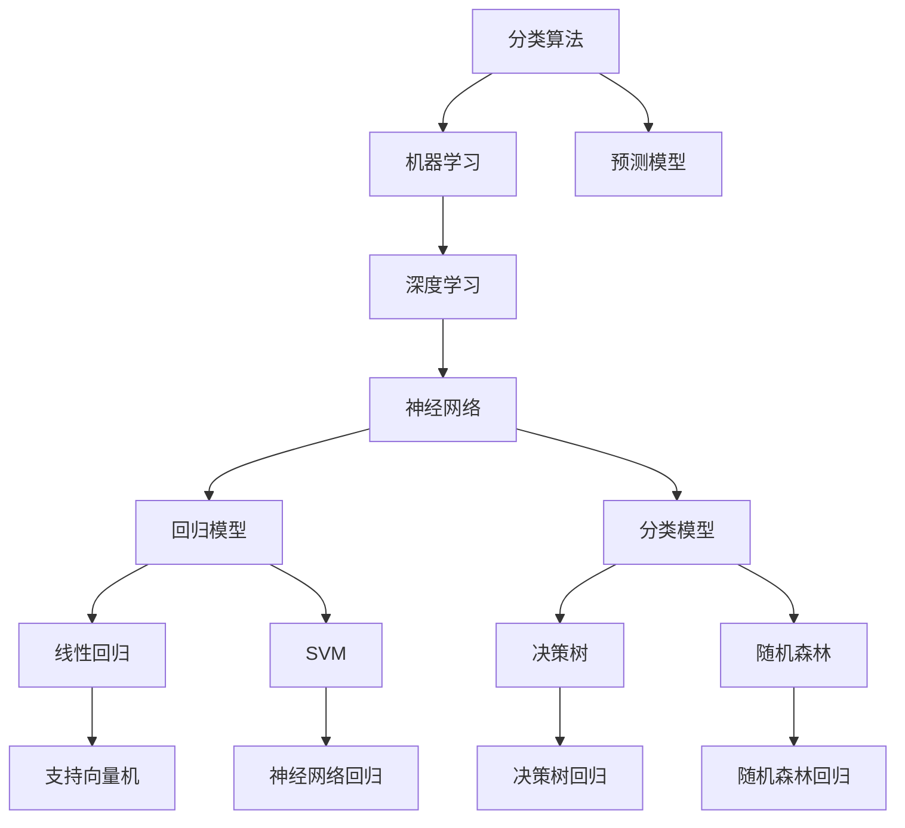

                 

# 人工智能的分类与预测能力

> 关键词：人工智能,分类算法,预测模型,机器学习,深度学习,神经网络,数据集,模型评估,集成学习,特征工程

## 1. 背景介绍

### 1.1 问题由来

随着人工智能技术的快速发展，分类与预测成为机器学习和深度学习领域的核心问题之一。无论是文本分类、图像识别、语音识别还是推荐系统，分类与预测能力的应用无处不在。然而，不同的应用场景对分类与预测的要求也不尽相同，因此需要选择合适的分类算法和预测模型来满足这些需求。

本文将详细介绍各种分类算法和预测模型的原理、实现、应用场景以及未来发展趋势。通过理解这些核心概念，可以帮助读者更好地把握人工智能在分类与预测领域的应用和挑战。

## 2. 核心概念与联系

### 2.1 核心概念概述

为了更好地理解人工智能的分类与预测能力，首先需要明确一些核心概念：

- **分类算法**：根据给定数据集中的特征，将数据分为若干个预定义类别的一种算法。常见的分类算法包括逻辑回归、支持向量机、决策树、随机森林等。

- **预测模型**：根据历史数据和特征，预测未知数据的结果。常见的预测模型包括线性回归、决策树回归、随机森林回归、神经网络回归等。

- **机器学习**：通过数据学习模型，从而对新数据进行分类或预测的一种方法。机器学习是实现分类与预测算法的重要手段。

- **深度学习**：一种特殊的机器学习方法，通过多层神经网络进行非线性映射，从而实现更复杂的分类与预测任务。

这些概念之间的逻辑关系可以通过以下Mermaid流程图来展示：



这个流程图展示出分类算法与预测模型的关联性，以及它们在机器学习和深度学习中的应用。

## 3. 核心算法原理 & 具体操作步骤

### 3.1 算法原理概述

分类与预测算法的基本原理是根据已知的特征和标签，构建一个模型，从而对未知数据进行分类或预测。具体来说，分类算法将数据分为预定义的类别，而预测模型则根据历史数据和特征，预测未知数据的结果。

常见的分类算法和预测模型可以分为两类：基于统计学的模型和基于机器学习的模型。基于统计学的模型通常使用数学模型来描述数据的分布，从而进行分类或预测；而基于机器学习的模型则通过数据学习模型的结构，从而进行分类或预测。

### 3.2 算法步骤详解

分类算法和预测模型的实现步骤通常包括以下几个环节：

1. **数据预处理**：对数据进行清洗、标准化、归一化等操作，使其适合进行分类或预测。

2. **特征工程**：选择、提取、变换特征，使其更适合模型的训练和预测。

3. **模型训练**：使用已知的特征和标签，训练模型，得到模型参数。

4. **模型评估**：使用测试集对模型进行评估，计算各种指标（如准确率、召回率、F1值等），评估模型性能。

5. **模型优化**：根据评估结果，对模型进行优化，如调整参数、增加训练次数等，以提高模型性能。

6. **模型应用**：将训练好的模型应用到新的数据集上进行分类或预测。

### 3.3 算法优缺点

不同算法和模型各有优缺点，适用于不同的场景和需求：

- **逻辑回归**：优点是模型简单、易于实现，适用于线性可分的问题。缺点是对于非线性问题效果不佳。

- **支持向量机**：优点是对于高维数据和非线性问题表现良好，适用于小规模数据集。缺点是计算复杂度高，对于大规模数据集不适用。

- **决策树**：优点是易于解释，适用于分类和回归问题。缺点是容易出现过拟合，对于噪声较多的数据集效果不佳。

- **随机森林**：优点是能够有效地处理高维数据，且具有较好的泛化能力。缺点是模型复杂度高，训练时间较长。

- **神经网络**：优点是能够处理非线性问题，且具有较好的泛化能力。缺点是模型复杂度高，需要大量数据和计算资源进行训练。

### 3.4 算法应用领域

分类与预测算法广泛应用于各个领域，以下是几个典型的应用场景：

- **文本分类**：如情感分析、垃圾邮件过滤、新闻分类等。通过构建分类模型，对文本进行分类，得到其所属类别。

- **图像识别**：如人脸识别、物体识别、场景识别等。通过构建分类模型，对图像进行分类，得到其所属类别。

- **语音识别**：如语音命令识别、语音情感识别等。通过构建分类模型，对语音进行分类，得到其所属类别。

- **推荐系统**：如电商推荐、音乐推荐、视频推荐等。通过构建预测模型，预测用户的兴趣，从而进行推荐。

- **时间序列预测**：如股票价格预测、天气预测、交通流量预测等。通过构建预测模型，预测未来的时间序列数据。

## 4. 数学模型和公式 & 详细讲解 & 举例说明

### 4.1 数学模型构建

分类与预测算法的数学模型通常包括以下几个部分：

- **输入特征**：$X$，即输入数据，包含n个特征。

- **模型参数**：$\theta$，即模型中的可调参数。

- **输出结果**：$Y$，即模型的预测结果，通常为二分类或多分类。

- **损失函数**：$L(\theta)$，即模型在训练集上的损失，通常为交叉熵损失或均方误差损失。

### 4.2 公式推导过程

以逻辑回归为例，其基本公式如下：

$$
P(y=1|X;\theta) = \frac{1}{1+\exp(-\theta^TX)}
$$

其中，$P(y=1|X;\theta)$表示给定$X$条件下，$y=1$的概率，$\theta$为逻辑回归模型的参数，$X$为输入特征。

通过逻辑回归模型，可以构建分类算法的数学模型，并通过最小化损失函数来训练模型。

### 4.3 案例分析与讲解

以鸢尾花数据集为例，展示如何使用逻辑回归进行分类：

- **数据预处理**：使用PCA降维，将原始数据降维至2维。

- **特征工程**：选择花瓣长度和宽度作为特征。

- **模型训练**：使用逻辑回归模型，训练模型参数。

- **模型评估**：使用测试集对模型进行评估，计算准确率、召回率、F1值等指标。

## 5. 项目实践：代码实例和详细解释说明

### 5.1 开发环境搭建

在进行项目实践前，需要准备开发环境。以下是使用Python进行PyTorch开发的环境配置流程：

1. 安装Anaconda：从官网下载并安装Anaconda，用于创建独立的Python环境。

2. 创建并激活虚拟环境：
```bash
conda create -n pytorch-env python=3.8 
conda activate pytorch-env
```

3. 安装PyTorch：根据CUDA版本，从官网获取对应的安装命令。例如：
```bash
conda install pytorch torchvision torchaudio cudatoolkit=11.1 -c pytorch -c conda-forge
```

4. 安装Transformers库：
```bash
pip install transformers
```

5. 安装各类工具包：
```bash
pip install numpy pandas scikit-learn matplotlib tqdm jupyter notebook ipython
```

完成上述步骤后，即可在`pytorch-env`环境中开始项目实践。

### 5.2 源代码详细实现

下面以鸢尾花数据集为例，展示如何使用逻辑回归进行分类：

```python
import torch
from torch import nn, optim
from sklearn.datasets import load_iris
from sklearn.model_selection import train_test_split
from sklearn.preprocessing import StandardScaler

# 加载数据集
iris = load_iris()
X = iris.data
y = iris.target

# 划分训练集和测试集
X_train, X_test, y_train, y_test = train_test_split(X, y, test_size=0.2, random_state=42)

# 标准化数据
scaler = StandardScaler()
X_train = scaler.fit_transform(X_train)
X_test = scaler.transform(X_test)

# 定义模型
class LogisticRegression(nn.Module):
    def __init__(self, input_dim=4, output_dim=3):
        super(LogisticRegression, self).__init__()
        self.linear = nn.Linear(input_dim, output_dim)
        self.softmax = nn.Softmax(dim=1)
        
    def forward(self, x):
        x = self.linear(x)
        x = self.softmax(x)
        return x
    
# 定义损失函数和优化器
criterion = nn.CrossEntropyLoss()
optimizer = optim.SGD(model.parameters(), lr=0.01, momentum=0.9)

# 训练模型
model = LogisticRegression()
for epoch in range(100):
    optimizer.zero_grad()
    y_pred = model(X_train)
    loss = criterion(y_pred, y_train)
    loss.backward()
    optimizer.step()
    
    if (epoch+1) % 10 == 0:
        print(f'Epoch {epoch+1}, Loss: {loss.item()}')

# 评估模型
model.eval()
with torch.no_grad():
    y_pred = model(X_test)
    accuracy = (y_pred.argmax(dim=1) == y_test).float().mean()
    print(f'Test Accuracy: {accuracy.item()}')
```

### 5.3 代码解读与分析

以下是关键代码的解读和分析：

**鸢尾花数据集**：
- `load_iris`方法加载鸢尾花数据集。
- `train_test_split`方法划分训练集和测试集。
- `StandardScaler`方法标准化数据，使数据更易于处理。

**逻辑回归模型**：
- `nn.Linear`方法定义线性层，用于映射输入特征到输出结果。
- `nn.Softmax`方法定义Softmax函数，用于将模型输出转换为概率分布。
- `forward`方法定义前向传播过程。

**损失函数和优化器**：
- `nn.CrossEntropyLoss`方法定义交叉熵损失函数，用于计算模型输出与真实标签之间的差异。
- `optim.SGD`方法定义随机梯度下降优化器，用于更新模型参数。

**训练模型**：
- `for`循环用于迭代训练，每个epoch更新一次模型参数。
- `optimizer.zero_grad`方法清除梯度缓存。
- `optimizer.step`方法更新模型参数。

**评估模型**：
- `model.eval`方法将模型设置为评估模式。
- `with torch.no_grad`方法开启无梯度计算模式，加快计算速度。
- `accuracy`变量计算模型预测准确率。

## 6. 实际应用场景

### 6.1 智能客服系统

智能客服系统通过分类算法对客户意图进行识别，并自动生成应答，极大地提高了客服效率和客户满意度。例如，智能客服系统可以将客户的问题归类为常见问题、复杂问题或转接人工客服，从而实现自动化处理。

### 6.2 金融风险评估

金融风险评估通过对客户的信用评分、交易记录等数据进行分类，预测其信用风险。例如，通过逻辑回归模型，可以构建信用评分模型，对客户的信用等级进行分类，从而帮助银行进行贷款决策。

### 6.3 电商推荐系统

电商推荐系统通过对用户的购买行为、浏览记录等数据进行分类，预测用户的兴趣和需求。例如，通过随机森林回归模型，可以构建推荐模型，对用户的兴趣进行分类，从而进行个性化推荐。

### 6.4 未来应用展望

未来，随着数据量的增加和计算能力的提升，分类与预测算法将在更多领域得到应用，如医疗诊断、自动驾驶、智能制造等。这些应用场景对于分类与预测算法的准确性和实时性提出了更高的要求，同时也带来了新的挑战和机遇。

## 7. 工具和资源推荐

### 7.1 学习资源推荐

为了帮助开发者系统掌握分类与预测算法的理论基础和实践技巧，以下是一些优质的学习资源：

1. 《机器学习》（周志华）：全面介绍了机器学习的基本概念、算法和应用。

2. 《深度学习》（Ian Goodfellow）：深入浅出地介绍了深度学习的基本原理和实现方法。

3. 《Python机器学习》（Sebastian Raschka）：介绍了使用Python进行机器学习的实践方法。

4. 《TensorFlow官方文档》：提供了TensorFlow的详细文档和代码示例，方便开发者进行学习和实践。

5. Coursera《机器学习》课程：由斯坦福大学Andrew Ng教授主讲，全面介绍了机器学习的基本概念和算法。

### 7.2 开发工具推荐

高效的开发离不开优秀的工具支持。以下是几款用于分类与预测算法开发的常用工具：

1. Python：Python是一种简单易学的编程语言，具有丰富的库和框架，适合进行数据处理和机器学习开发。

2. PyTorch：基于Python的开源深度学习框架，灵活动态的计算图，适合快速迭代研究。

3. TensorFlow：由Google主导开发的开源深度学习框架，生产部署方便，适合大规模工程应用。

4. Scikit-learn：基于Python的机器学习库，提供了各种常用的机器学习算法和工具。

5. Keras：基于Python的深度学习库，提供了简单易用的API，方便开发者进行模型构建和训练。

### 7.3 相关论文推荐

分类与预测算法的发展源于学界的持续研究。以下是几篇奠基性的相关论文，推荐阅读：

1. Logistic Regression（R.A.Fisher）：逻辑回归模型的理论基础，介绍了逻辑回归的基本原理和应用。

2. Support Vector Machines（Cortes and Vapnik）：支持向量机的理论基础，介绍了支持向量机的基本原理和应用。

3. Random Forest（Breiman）：随机森林的理论基础，介绍了随机森林的基本原理和应用。

4. Neural Networks（Hinton and Rosens）：神经网络的理论基础，介绍了神经网络的基本原理和应用。

5. Gradient Boosting Machines（Friedman）：梯度提升机的理论基础，介绍了梯度提升机的基本原理和应用。

这些论文代表了大分类与预测算法的发展脉络。通过学习这些前沿成果，可以帮助研究者把握学科前进方向，激发更多的创新灵感。

## 8. 总结：未来发展趋势与挑战

### 8.1 总结

本文对人工智能的分类与预测能力进行了全面系统的介绍。首先阐述了分类与预测算法的研究背景和意义，明确了算法在人工智能中的应用价值。其次，从原理到实践，详细讲解了分类与预测算法的数学模型和实现方法，给出了分类算法和预测模型的完整代码实例。同时，本文还广泛探讨了算法在智能客服、金融风险评估、电商推荐等领域的实际应用，展示了算法的重要性和广阔前景。此外，本文精选了算法学习的各类资源，力求为读者提供全方位的技术指引。

通过本文的系统梳理，可以看到，分类与预测算法在大数据和深度学习技术的推动下，得到了快速发展，并在各个领域得到广泛应用。分类与预测算法不仅提升了数据处理的效率，也为人类社会的智能化发展提供了有力支持。未来，随着技术的进一步发展，分类与预测算法将在更多领域得到应用，为社会发展和人类进步注入新的动力。

### 8.2 未来发展趋势

展望未来，分类与预测算法将呈现以下几个发展趋势：

1. 算法智能化。随着深度学习技术的发展，分类与预测算法将变得更加智能化，能够自动提取特征、优化模型参数，从而提高分类和预测的准确性。

2. 算法集成化。多种分类与预测算法的集成将进一步提升模型的性能，如集成学习、堆叠学习等。

3. 算法可解释化。随着人工智能的发展，模型的可解释性变得越来越重要。未来的算法将更加注重可解释性和透明性，便于用户理解和信任。

4. 算法跨领域化。分类与预测算法将在更多领域得到应用，如医疗、交通、制造等。

5. 算法实时化。分类与预测算法将更加注重实时性，满足实时处理的需求。

6. 算法安全性。随着人工智能的发展，模型的安全性也越来越受到关注。未来的算法将更加注重安全性和隐私保护。

以上趋势凸显了分类与预测算法的广阔前景。这些方向的探索发展，必将进一步提升人工智能的性能和应用范围，为人类社会带来新的变革和进步。

### 8.3 面临的挑战

尽管分类与预测算法已经取得了瞩目成就，但在迈向更加智能化、普适化应用的过程中，仍面临诸多挑战：

1. 数据质量问题。分类与预测算法对数据质量的要求非常高，数据偏差、噪声等问题可能影响模型的性能。如何获取高质量的数据，是算法应用的重要前提。

2. 模型复杂度问题。分类与预测算法通常需要复杂的模型和大量的数据进行训练，对于资源有限的应用场景可能存在挑战。如何优化模型结构，提高训练效率，是算法应用的重要课题。

3. 模型解释性问题。许多分类与预测算法属于"黑箱"模型，难以解释其内部工作机制和决策逻辑。如何赋予模型更强的可解释性，是算法应用的重要方向。

4. 模型鲁棒性问题。分类与预测算法在面对异常数据时，容易发生错误。如何提高模型的鲁棒性和泛化能力，是算法应用的重要挑战。

5. 模型安全性问题。分类与预测算法可能存在安全漏洞，如模型泄漏、数据泄露等。如何保证模型的安全性，是算法应用的重要保障。

6. 模型公平性问题。分类与预测算法可能存在偏见和歧视。如何避免模型偏见，保证模型的公平性，是算法应用的重要目标。

正视分类与预测算法面临的这些挑战，积极应对并寻求突破，将使算法在实际应用中更加成熟和可靠。相信随着学界和产业界的共同努力，这些挑战终将一一被克服，分类与预测算法必将在构建智能社会的进程中扮演越来越重要的角色。

### 8.4 研究展望

未来的研究需要在以下几个方面寻求新的突破：

1. 探索更多的分类与预测算法。如深度学习算法、强化学习算法、无监督学习算法等，将带来新的分类与预测方法。

2. 引入更多的特征工程技术。如特征选择、特征变换、特征提取等，提高模型的特征表达能力。

3. 发展更高效的模型优化方法。如模型剪枝、模型压缩、模型蒸馏等，提高模型的训练效率和推理速度。

4. 研究更先进的模型评估方法。如模型鲁棒性评估、模型公平性评估等，提高模型的评估精度。

5. 引入更多跨领域知识。如知识图谱、符号逻辑等，提高模型的综合能力。

6. 研究更智能的模型交互方式。如自然语言交互、语音交互等，提高模型的用户友好性。

这些研究方向的探索，必将引领分类与预测算法迈向更高的台阶，为构建更加智能、普适、安全的分类与预测系统铺平道路。面向未来，分类与预测算法还需要与其他人工智能技术进行更深入的融合，如知识表示、因果推理、强化学习等，多路径协同发力，共同推动人工智能技术的发展和应用。只有勇于创新、敢于突破，才能不断拓展人工智能的边界，让智能技术更好地造福人类社会。

---

作者：禅与计算机程序设计艺术 / Zen and the Art of Computer Programming

