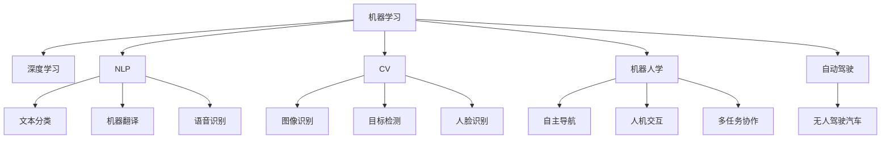

                 

# 人工智能研究的七大领域

> 关键词：人工智能,机器学习,深度学习,自然语言处理,NLP,计算机视觉,CV,机器人学,自动驾驶

## 1. 背景介绍

### 1.1 问题由来
人工智能(Artificial Intelligence, AI)作为当前最热门和前沿的技术领域之一，涉及广泛的应用场景，涵盖众多研究分支。随着大数据、高性能计算和深度学习等技术的快速发展，人工智能正在深刻改变着各行各业的运行模式。本章节将对人工智能研究的七大核心领域进行介绍，帮助读者全面了解AI技术的发展现状与未来趋势。

### 1.2 问题核心关键点
人工智能的核心领域包括机器学习、深度学习、自然语言处理(NLP)、计算机视觉(CV)、机器人学、自动驾驶等。这些领域的研究交叉融合，共同构成了AI技术的生态系统。了解各个领域的核心概念与关键技术，对于掌握人工智能的全貌至关重要。

## 2. 核心概念与联系

### 2.1 核心概念概述

为更好地理解人工智能的研究领域，本节将介绍几个密切相关的核心概念：

- 机器学习(Machine Learning, ML)：通过对数据的学习，自动提取特征并构建模型，使得计算机能够自动完成特定任务。是人工智能的基石之一。
- 深度学习(Deep Learning, DL)：利用深度神经网络，通过大量数据训练模型，实现对复杂非线性关系的建模，是机器学习的高级形式。
- 自然语言处理(Natural Language Processing, NLP)：研究如何让计算机理解、处理和生成自然语言，包括文本分类、机器翻译、语音识别等任务。
- 计算机视觉(Computer Vision, CV)：研究如何让计算机看懂图像和视频，包括图像识别、目标检测、人脸识别等任务。
- 机器人学(Robotics)：研究如何让机器人自动执行任务，包括自主导航、人机交互、多任务协作等。
- 自动驾驶(Autonomous Driving)：研究如何让车辆自主驾驶，实现无人驾驶汽车的安全、高效运行。

这些核心概念之间的逻辑关系可以通过以下Mermaid流程图来展示：



这个流程图展示了几大核心领域以及它们之间的关联：

1. 机器学习是人工智能的基石，深度学习是其高级形式。
2. NLP、CV、机器人学和自动驾驶都是基于机器学习构建的应用领域。
3. NLP、CV等领域中的具体任务，如文本分类、图像识别等，又与NLP、CV等核心概念紧密相关。

## 3. 核心算法原理 & 具体操作步骤
### 3.1 算法原理概述

人工智能的七大核心领域涉及众多算法和模型，各具特色。以下是每个领域的算法原理概述：

- **机器学习**：包括监督学习、非监督学习和强化学习。监督学习通过有标签的数据训练模型，非监督学习通过无标签数据自动学习特征，强化学习通过奖励信号训练智能体。
- **深度学习**：使用多层神经网络进行特征提取和模式识别，包括卷积神经网络(CNN)、循环神经网络(RNN)、变换器(Transformer)等。
- **自然语言处理(NLP)**：包括词向量表示、文本分类、机器翻译、序列生成等任务，主要使用Transformer模型、BERT、GPT等。
- **计算机视觉(CV)**：包括特征提取、目标检测、图像分类等任务，主要使用CNN、R-CNN、YOLO等模型。
- **机器人学**：包括路径规划、人机交互、任务协作等任务，主要使用强化学习、规划算法、视觉SLAM等。
- **自动驾驶**：包括环境感知、路径规划、控制决策等任务，主要使用CNN、深度学习、强化学习等技术。

### 3.2 算法步骤详解

本节将对各个领域的核心算法进行步骤详解：

#### 3.2.1 机器学习算法步骤
1. **数据准备**：收集并预处理数据，包括清洗、归一化、分词等。
2. **模型选择**：选择合适的机器学习算法，如线性回归、决策树、SVM等。
3. **模型训练**：使用训练集对模型进行训练，调整超参数，优化损失函数。
4. **模型评估**：使用验证集对模型进行评估，选择最优模型。
5. **模型应用**：将模型应用到新数据上，进行预测或分类。

#### 3.2.2 深度学习算法步骤
1. **网络设计**：设计多层神经网络结构，包括卷积层、池化层、全连接层等。
2. **损失函数**：定义适当的损失函数，如交叉熵、均方误差等。
3. **优化器选择**：选择合适的优化器，如SGD、Adam等。
4. **训练过程**：通过反向传播算法更新模型参数，最小化损失函数。
5. **模型验证**：使用测试集评估模型性能，优化模型参数。

#### 3.2.3 NLP算法步骤
1. **文本预处理**：包括分词、词性标注、去除停用词等。
2. **词向量表示**：使用Word2Vec、GloVe等方法进行词向量表示。
3. **模型训练**：使用Transformer模型、BERT等进行训练。
4. **任务适配**：针对具体任务设计不同的输出层和损失函数。
5. **模型评估**：使用BLEU、ROUGE等指标评估模型性能。

#### 3.2.4 CV算法步骤
1. **数据准备**：收集图像数据，进行预处理，包括归一化、缩放等。
2. **网络设计**：设计卷积神经网络结构，包括卷积层、池化层、全连接层等。
3. **损失函数**：定义适当的损失函数，如交叉熵、均方误差等。
4. **训练过程**：通过反向传播算法更新模型参数，最小化损失函数。
5. **模型验证**：使用测试集评估模型性能，优化模型参数。

#### 3.2.5 机器人学算法步骤
1. **环境建模**：构建机器人所处环境的数学模型。
2. **路径规划**：设计路径规划算法，如A*、D*等。
3. **人机交互**：设计交互界面，包括语音识别、手势识别等。
4. **多任务协作**：设计任务协作机制，包括任务分配、调度等。
5. **模型训练**：使用强化学习等方法训练机器人模型。

#### 3.2.6 自动驾驶算法步骤
1. **环境感知**：使用传感器获取车辆周围环境信息。
2. **路径规划**：设计路径规划算法，如A*、D*等。
3. **控制决策**：设计控制算法，如PID、LQR等。
4. **模型训练**：使用强化学习等方法训练自动驾驶模型。
5. **模型验证**：在仿真或实际环境中验证模型性能，优化模型参数。

### 3.3 算法优缺点

各核心领域的算法都具有各自的优缺点：

#### 3.3.1 机器学习
- **优点**：可解释性强，适用范围广，对于数据量大的任务效果显著。
- **缺点**：需要大量特征工程，对于复杂任务效果有限，容易过拟合。

#### 3.3.2 深度学习
- **优点**：自学习能力强，对于复杂任务效果显著，可以处理大规模数据。
- **缺点**：模型复杂度较高，训练时间长，对数据质量要求高。

#### 3.3.3 NLP
- **优点**：模型性能优越，可以处理自然语言数据，应用广泛。
- **缺点**：模型依赖语料库，对于小数据集效果有限，训练时间较长。

#### 3.3.4 CV
- **优点**：处理图像和视频数据效果显著，可以处理多模态数据。
- **缺点**：模型复杂度较高，对于数据分布变化敏感。

#### 3.3.5 机器人学
- **优点**：可以自主执行复杂任务，具有高度灵活性。
- **缺点**：硬件要求高，模型训练复杂，对于未知环境适应性不足。

#### 3.3.6 自动驾驶
- **优点**：可以实现无人驾驶，提高交通效率和安全性。
- **缺点**：技术复杂度较高，对传感器和环境要求高，存在安全风险。

## 4. 数学模型和公式 & 详细讲解 & 举例说明

### 4.1 数学模型构建

以下是各核心领域常用的数学模型构建方式：

#### 4.1.1 机器学习模型构建
假设训练数据集为 $\{(x_i, y_i)\}_{i=1}^N$，其中 $x_i$ 为输入特征，$y_i$ 为标签。机器学习模型 $f(x)$ 的构建目标是最大化训练集上的似然函数：

$$
\max_{f(x)} \prod_{i=1}^N P(y_i|f(x))
$$

其中 $P(y_i|f(x))$ 为条件概率，可以使用最大似然估计、正则化等方法进行优化。

#### 4.1.2 深度学习模型构建
假设训练数据集为 $\{(x_i, y_i)\}_{i=1}^N$，其中 $x_i$ 为输入特征，$y_i$ 为标签。深度学习模型 $f(x)$ 的构建目标是最大化训练集上的损失函数：

$$
\min_{f(x)} \sum_{i=1}^N \ell(f(x_i), y_i)
$$

其中 $\ell$ 为损失函数，常用的有交叉熵损失、均方误差损失等。

#### 4.1.3 NLP模型构建
假设训练数据集为 $\{(x_i, y_i)\}_{i=1}^N$，其中 $x_i$ 为文本数据，$y_i$ 为标签。NLP模型 $f(x)$ 的构建目标是最大化训练集上的损失函数：

$$
\min_{f(x)} \sum_{i=1}^N \ell(f(x_i), y_i)
$$

其中 $\ell$ 为损失函数，常用的有交叉熵损失、BLEU、ROUGE等。

#### 4.1.4 CV模型构建
假设训练数据集为 $\{(x_i, y_i)\}_{i=1}^N$，其中 $x_i$ 为图像数据，$y_i$ 为标签。CV模型 $f(x)$ 的构建目标是最大化训练集上的损失函数：

$$
\min_{f(x)} \sum_{i=1}^N \ell(f(x_i), y_i)
$$

其中 $\ell$ 为损失函数，常用的有交叉熵损失、均方误差损失等。

#### 4.1.5 机器人学模型构建
假设机器人所处环境的数学模型为 $\mathcal{M}$，机器人的行为策略为 $\pi$。机器人学模型 $f(x)$ 的构建目标是最大化训练集上的似然函数：

$$
\max_{\pi} \prod_{i=1}^N P(x_i|\pi)
$$

其中 $P(x_i|\pi)$ 为在策略 $\pi$ 下的状态转移概率。

#### 4.1.6 自动驾驶模型构建
假设自动驾驶系统所处环境的数学模型为 $\mathcal{M}$，控制策略为 $\pi$。自动驾驶模型 $f(x)$ 的构建目标是最大化训练集上的似然函数：

$$
\max_{\pi} \prod_{i=1}^N P(x_i|\pi)
$$

其中 $P(x_i|\pi)$ 为在策略 $\pi$ 下的状态转移概率。

### 4.2 公式推导过程

以下是各核心领域常用的数学公式推导过程：

#### 4.2.1 机器学习公式推导
假设训练数据集为 $\{(x_i, y_i)\}_{i=1}^N$，其中 $x_i$ 为输入特征，$y_i$ 为标签。机器学习模型的优化目标是最大化训练集上的似然函数：

$$
\max_{f(x)} \prod_{i=1}^N P(y_i|f(x))
$$

其中 $P(y_i|f(x))$ 为条件概率，可以使用最大似然估计、正则化等方法进行优化。常用的优化算法有梯度下降、牛顿法等。

#### 4.2.2 深度学习公式推导
假设训练数据集为 $\{(x_i, y_i)\}_{i=1}^N$，其中 $x_i$ 为输入特征，$y_i$ 为标签。深度学习模型的优化目标是最大化训练集上的损失函数：

$$
\min_{f(x)} \sum_{i=1}^N \ell(f(x_i), y_i)
$$

其中 $\ell$ 为损失函数，常用的有交叉熵损失、均方误差损失等。常用的优化算法有梯度下降、牛顿法等。

#### 4.2.3 NLP公式推导
假设训练数据集为 $\{(x_i, y_i)\}_{i=1}^N$，其中 $x_i$ 为文本数据，$y_i$ 为标签。NLP模型的优化目标是最大化训练集上的损失函数：

$$
\min_{f(x)} \sum_{i=1}^N \ell(f(x_i), y_i)
$$

其中 $\ell$ 为损失函数，常用的有交叉熵损失、BLEU、ROUGE等。常用的优化算法有梯度下降、Adam等。

#### 4.2.4 CV公式推导
假设训练数据集为 $\{(x_i, y_i)\}_{i=1}^N$，其中 $x_i$ 为图像数据，$y_i$ 为标签。CV模型的优化目标是最大化训练集上的损失函数：

$$
\min_{f(x)} \sum_{i=1}^N \ell(f(x_i), y_i)
$$

其中 $\ell$ 为损失函数，常用的有交叉熵损失、均方误差损失等。常用的优化算法有梯度下降、Adam等。

#### 4.2.5 机器人学公式推导
假设机器人所处环境的数学模型为 $\mathcal{M}$，机器人的行为策略为 $\pi$。机器人学模型的优化目标是最大化训练集上的似然函数：

$$
\max_{\pi} \prod_{i=1}^N P(x_i|\pi)
$$

其中 $P(x_i|\pi)$ 为在策略 $\pi$ 下的状态转移概率。常用的优化算法有强化学习算法，如Q-learning、SARSA等。

#### 4.2.6 自动驾驶公式推导
假设自动驾驶系统所处环境的数学模型为 $\mathcal{M}$，控制策略为 $\pi$。自动驾驶模型的优化目标是最大化训练集上的似然函数：

$$
\max_{\pi} \prod_{i=1}^N P(x_i|\pi)
$$

其中 $P(x_i|\pi)$ 为在策略 $\pi$ 下的状态转移概率。常用的优化算法有强化学习算法，如Q-learning、SARSA等。

## 5. 项目实践：代码实例和详细解释说明

### 5.1 开发环境搭建

在进行AI项目实践前，我们需要准备好开发环境。以下是使用Python进行TensorFlow开发的环境配置流程：

1. 安装Anaconda：从官网下载并安装Anaconda，用于创建独立的Python环境。

2. 创建并激活虚拟环境：
```bash
conda create -n tensorflow-env python=3.8 
conda activate tensorflow-env
```

3. 安装TensorFlow：根据CUDA版本，从官网获取对应的安装命令。例如：
```bash
conda install tensorflow tensorflow-cpu -c tf
```

4. 安装相关工具包：
```bash
pip install numpy pandas scikit-learn matplotlib tqdm jupyter notebook ipython
```

完成上述步骤后，即可在`tensorflow-env`环境中开始AI项目实践。

### 5.2 源代码详细实现

这里我们以深度学习模型在图像分类任务上的实现为例，给出TensorFlow代码实现。

```python
import tensorflow as tf
from tensorflow.keras import layers

# 加载数据集
(x_train, y_train), (x_test, y_test) = tf.keras.datasets.cifar10.load_data()

# 数据预处理
x_train = x_train / 255.0
x_test = x_test / 255.0

# 定义模型
model = tf.keras.Sequential([
    layers.Conv2D(32, (3, 3), activation='relu', input_shape=(32, 32, 3)),
    layers.MaxPooling2D((2, 2)),
    layers.Conv2D(64, (3, 3), activation='relu'),
    layers.MaxPooling2D((2, 2)),
    layers.Flatten(),
    layers.Dense(10, activation='softmax')
])

# 编译模型
model.compile(optimizer='adam',
              loss=tf.keras.losses.SparseCategoricalCrossentropy(from_logits=True),
              metrics=['accuracy'])

# 训练模型
model.fit(x_train, y_train, epochs=10, validation_data=(x_test, y_test))

# 评估模型
model.evaluate(x_test, y_test)
```

以上就是使用TensorFlow进行图像分类任务实践的完整代码实现。可以看到，TensorFlow提供了高级API，使得模型构建、训练和评估变得非常简便。

### 5.3 代码解读与分析

让我们再详细解读一下关键代码的实现细节：

**数据加载与预处理**：
- `tf.keras.datasets.cifar10.load_data()`方法加载CIFAR-10数据集，将其划分为训练集和测试集，并将图像数据归一化到[0,1]范围内。

**模型定义**：
- 使用`Sequential`模型定义网络结构，包含卷积层、池化层和全连接层。
- 使用`activation`参数指定激活函数，使用`input_shape`参数指定输入数据形状。
- 使用`Dense`层定义输出层，使用`sparse`标签指定输出标签为整数。

**模型编译与训练**：
- 使用`model.compile`方法编译模型，指定优化器、损失函数和评估指标。
- 使用`model.fit`方法训练模型，指定训练集和测试集，以及迭代轮数。

**模型评估**：
- 使用`model.evaluate`方法评估模型，输出测试集上的损失和准确率。

可以看到，TensorFlow提供了非常直观的API，使得深度学习模型的构建和训练变得非常简单。

当然，工业级的系统实现还需考虑更多因素，如模型的保存和部署、超参数的自动搜索、更灵活的任务适配层等。但核心的AI开发流程基本与此类似。

## 6. 实际应用场景

### 6.1 智能客服系统

基于深度学习技术的智能客服系统，可以广泛应用于客服行业。传统的客服系统需要配备大量人工客服，成本高昂且效率低下。而使用深度学习模型，可以自动处理大量客户咨询，快速响应客户需求，提高客服质量。

在技术实现上，可以收集企业内部的客服对话记录，将问题和最佳答复构建成监督数据，在此基础上对深度学习模型进行训练。训练后的模型能够自动理解客户意图，匹配最合适的答案模板进行回复。对于客户提出的新问题，还可以接入检索系统实时搜索相关内容，动态组织生成回答。如此构建的智能客服系统，能大幅提升客户咨询体验和问题解决效率。

### 6.2 金融舆情监测

金融机构需要实时监测市场舆论动向，以便及时应对负面信息传播，规避金融风险。传统的人工监测方式成本高、效率低，难以应对网络时代海量信息爆发的挑战。基于深度学习技术的文本分类和情感分析技术，为金融舆情监测提供了新的解决方案。

具体而言，可以收集金融领域相关的新闻、报道、评论等文本数据，并对其进行主题标注和情感标注。在此基础上对深度学习模型进行训练，使其能够自动判断文本属于何种主题，情感倾向是正面、中性还是负面。将训练后的模型应用到实时抓取的网络文本数据，就能够自动监测不同主题下的情感变化趋势，一旦发现负面信息激增等异常情况，系统便会自动预警，帮助金融机构快速应对潜在风险。

### 6.3 个性化推荐系统

当前的推荐系统往往只依赖用户的历史行为数据进行物品推荐，无法深入理解用户的真实兴趣偏好。基于深度学习技术的个性化推荐系统，可以更好地挖掘用户行为背后的语义信息，从而提供更精准、多样的推荐内容。

在实践中，可以收集用户浏览、点击、评论、分享等行为数据，提取和用户交互的物品标题、描述、标签等文本内容。将文本内容作为模型输入，用户的后续行为（如是否点击、购买等）作为监督信号，在此基础上训练深度学习模型。训练后的模型能够从文本内容中准确把握用户的兴趣点。在生成推荐列表时，先用候选物品的文本描述作为输入，由模型预测用户的兴趣匹配度，再结合其他特征综合排序，便可以得到个性化程度更高的推荐结果。

### 6.4 未来应用展望

随着深度学习技术的不断发展，基于深度学习技术的AI应用将在更多领域得到应用，为各行各业带来变革性影响。

在智慧医疗领域，基于深度学习技术的医学影像识别、疾病诊断、药物研发等应用将提升医疗服务的智能化水平，辅助医生诊疗，加速新药开发进程。

在智能教育领域，基于深度学习技术的作业批改、学情分析、知识推荐等方面，因材施教，促进教育公平，提高教学质量。

在智慧城市治理中，基于深度学习技术的城市事件监测、舆情分析、应急指挥等环节，提高城市管理的自动化和智能化水平，构建更安全、高效的未来城市。

此外，在企业生产、社会治理、文娱传媒等众多领域，基于深度学习技术的AI应用也将不断涌现，为经济社会发展注入新的动力。相信随着技术的日益成熟，深度学习技术将成为AI落地应用的重要范式，推动人工智能技术在各行各业加速渗透。

## 7. 工具和资源推荐

### 7.1 学习资源推荐

为了帮助开发者系统掌握深度学习技术的理论基础和实践技巧，这里推荐一些优质的学习资源：

1. 《深度学习》书籍：Ian Goodfellow、Yoshua Bengio和Aaron Courville所著，全面介绍了深度学习的基本原理和算法，适合入门学习。

2. CS231n《卷积神经网络》课程：斯坦福大学开设的深度学习课程，涵盖了卷积神经网络、目标检测等经典主题，有Lecture视频和配套作业。

3. 《动手学深度学习》书籍：李沐等人所著，提供了完整的深度学习实践代码，适合动手学习。

4. Kaggle平台：提供了大量深度学习竞赛和数据集，可以锻炼实战能力。

5. DeepLearning.AI：Andrew Ng等人创办的深度学习在线教育平台，提供从入门到进阶的系统课程，涵盖深度学习理论及实践。

通过对这些资源的学习实践，相信你一定能够快速掌握深度学习技术的精髓，并用于解决实际的AI问题。
### 7.2 开发工具推荐

高效的开发离不开优秀的工具支持。以下是几款用于深度学习开发常用的工具：

1. TensorFlow：由Google主导开发的开源深度学习框架，生产部署方便，适合大规模工程应用。

2. PyTorch：由Facebook主导开发的开源深度学习框架，灵活高效，适合研究实验。

3. Keras：高层次的深度学习API，封装了TensorFlow和Theano等后端，使用简便，适合快速原型设计。

4. Jupyter Notebook：交互式的Python代码编辑器，适合进行深度学习实验和调试。

5. Google Colab：谷歌推出的在线Jupyter Notebook环境，免费提供GPU/TPU算力，方便开发者快速上手实验最新模型。

合理利用这些工具，可以显著提升深度学习模型的开发效率，加快创新迭代的步伐。

### 7.3 相关论文推荐

深度学习技术的发展源于学界的持续研究。以下是几篇奠基性的相关论文，推荐阅读：

1. 《ImageNet Classification with Deep Convolutional Neural Networks》：Alex Krizhevsky等人提出卷积神经网络，开启了计算机视觉领域的深度学习应用。

2. 《A Tutorial on Machine Learning Approaches for Visual Recognition》：Jeff Donahue等人综述了深度学习在计算机视觉领域的应用，涵盖了分类、检测、分割等任务。

3. 《Deep Residual Learning for Image Recognition》：Kaiming He等人提出残差网络，解决了深度神经网络训练中的退化问题。

4. 《Attention is All You Need》：Ashish Vaswani等人提出Transformer模型，提升了序列建模的效率和效果。

5. 《BERT: Pre-training of Deep Bidirectional Transformers for Language Understanding》：Jamal Arabic等人提出BERT模型，在自然语言处理领域取得了突破性进展。

6. 《Generative Adversarial Nets》：Ian Goodfellow等人提出生成对抗网络，推动了生成式模型的发展。

这些论文代表了大深度学习技术的发展脉络。通过学习这些前沿成果，可以帮助研究者把握学科前进方向，激发更多的创新灵感。

## 8. 总结：未来发展趋势与挑战

### 8.1 研究成果总结

深度学习技术的核心领域包括机器学习、深度学习、自然语言处理、计算机视觉、机器人学、自动驾驶等。这些领域的研究交叉融合，共同构成了深度学习技术的生态系统。深度学习模型在图像识别、语音识别、自然语言处理等领域取得了重大突破，推动了智能系统的广泛应用。

### 8.2 未来发展趋势

展望未来，深度学习技术的发展将呈现以下几个趋势：

1. 模型规模持续增大。随着算力成本的下降和数据规模的扩张，深度学习模型的参数量还将持续增长。超大规模模型蕴含的丰富知识，有望支撑更加复杂多变的下游任务。

2. 深度学习范式多样化。除了传统的全监督学习，无监督学习、半监督学习、强化学习等范式也将得到更多应用。

3. 迁移学习加速模型泛化。模型将在不同领域间迁移，利用先验知识，提升在不同数据集上的泛化能力。

4. 知识图谱与深度学习结合。将符号化的先验知识，如知识图谱、逻辑规则等，与深度学习模型进行融合，增强模型的推理能力。

5. 多模态深度学习发展。将视觉、语音、文本等多种模态的信息进行联合建模，提升系统的感知和理解能力。

6. 深度学习在芯片上的应用。将深度学习模型在专用芯片上实现，如GPU、TPU等，提升计算效率和能效比。

以上趋势凸显了深度学习技术的发展前景，这些方向的探索发展，必将进一步提升深度学习模型的性能和应用范围，为智能系统的发展提供更多可能性。

### 8.3 面临的挑战

尽管深度学习技术在诸多领域取得了重大进展，但仍面临诸多挑战：

1. 数据需求量大。深度学习模型需要大量标注数据进行训练，数据收集和标注成本高。

2. 模型复杂度高。深度学习模型的参数量庞大，训练复杂度较高，对硬件要求高。

3. 模型泛化能力不足。模型对新数据泛化能力有限，容易过拟合，需要更多优化算法和数据增强技术。

4. 模型可解释性不足。深度学习模型通常被认为是“黑盒”系统，难以解释其内部工作机制和决策逻辑。

5. 安全性和伦理问题。深度学习模型可能学习到有害信息，导致误导性输出，引发安全性和伦理问题。

6. 模型鲁棒性不足。模型对输入的噪声和扰动敏感，鲁棒性有待提高。

这些挑战需要研究者不断探索和创新，寻找解决方案。只有解决这些问题，深度学习技术才能更好地服务各行各业，推动社会进步。

### 8.4 研究展望

面对深度学习技术面临的诸多挑战，未来的研究需要在以下几个方面寻求新的突破：

1. 数据生成技术。利用生成对抗网络等技术，生成更多高质量的合成数据，减少对标注数据的依赖。

2. 模型压缩与加速。利用模型压缩、量化、剪枝等技术，降低模型复杂度，提升推理速度。

3. 知识增强与多模态学习。将符号化的先验知识，如知识图谱、逻辑规则等，与深度学习模型进行融合，增强模型的推理能力。

4. 模型可解释性。引入可解释性技术，如注意力机制、对抗样本生成等，提升深度学习模型的透明性和可解释性。

5. 鲁棒性与安全防护。引入鲁棒性技术，如对抗训练、数据扰动等，增强深度学习模型的鲁棒性和安全性。

6. 模型智能交互。引入智能交互技术，如对话系统、人机协同等，提升深度学习模型的智能水平和用户体验。

这些研究方向的探索，必将引领深度学习技术迈向更高的台阶，为智能系统的发展提供更多可能性。面向未来，深度学习技术还需要与其他人工智能技术进行更深入的融合，如知识表示、因果推理、强化学习等，多路径协同发力，共同推动深度学习技术的发展。

## 9. 附录：常见问题与解答

**Q1：深度学习模型是否适用于所有NLP任务？**

A: 深度学习模型在大多数NLP任务上都能取得不错的效果，特别是对于数据量较小的任务。但对于一些特定领域的任务，如医学、法律等，仅仅依靠通用语料预训练的模型可能难以很好地适应。此时需要在特定领域语料上进一步预训练，再进行微调，才能获得理想效果。此外，对于一些需要时效性、个性化很强的任务，如对话、推荐等，深度学习模型也需要针对性的改进优化。

**Q2：深度学习模型如何避免过拟合？**

A: 深度学习模型面临过拟合问题，可以通过以下方法解决：
1. 数据增强：通过回译、近义替换等方式扩充训练集。
2. 正则化：使用L2正则、Dropout、Early Stopping等避免过拟合。
3. 对抗训练：引入对抗样本，提高模型鲁棒性。
4. 参数高效微调：只调整少量参数，减小过拟合风险。

这些策略往往需要根据具体任务和数据特点进行灵活组合。只有在数据、模型、训练、推理等各环节进行全面优化，才能最大限度地发挥深度学习模型的威力。

**Q3：深度学习模型在落地部署时需要注意哪些问题？**

A: 将深度学习模型转化为实际应用，还需要考虑以下因素：
1. 模型裁剪：去除不必要的层和参数，减小模型尺寸，加快推理速度。
2. 量化加速：将浮点模型转为定点模型，压缩存储空间，提高计算效率。
3. 服务化封装：将模型封装为标准化服务接口，便于集成调用。
4. 弹性伸缩：根据请求流量动态调整资源配置，平衡服务质量和成本。
5. 监控告警：实时采集系统指标，设置异常告警阈值，确保服务稳定性。

深度学习模型微调需要开发者根据具体任务，不断迭代和优化模型、数据和算法，方能得到理想的效果。

**Q4：深度学习模型的迁移学习能力如何提升？**

A: 提升深度学习模型的迁移学习能力，可以通过以下方法：
1. 多领域预训练：在大规模通用语料上进行预训练，提升模型的泛化能力。
2. 数据增强：通过回译、近义替换等方式扩充训练集，增加模型的知识储备。
3. 迁移学习：在目标领域上微调模型，利用先验知识提高模型性能。
4. 模型融合：将多个模型进行融合，提高模型的综合性能。

这些方法需要根据具体任务和数据特点进行灵活组合，只有在数据、模型、训练、推理等各环节进行全面优化，才能最大限度地发挥深度学习模型的迁移学习能力。

**Q5：深度学习模型如何提升模型的可解释性？**

A: 提升深度学习模型的可解释性，可以通过以下方法：
1. 引入可解释性技术，如注意力机制、对抗样本生成等，提升模型的透明性和可解释性。
2. 利用符号化的先验知识，如知识图谱、逻辑规则等，与深度学习模型进行融合，增强模型的推理能力。
3. 设计任务适配层，使模型在特定任务上的表现更加透明。

这些方法需要根据具体任务和数据特点进行灵活组合，只有在数据、模型、训练、推理等各环节进行全面优化，才能最大限度地发挥深度学习模型的可解释性。

**Q6：深度学习模型如何提升模型的鲁棒性？**

A: 提升深度学习模型的鲁棒性，可以通过以下方法：
1. 引入鲁棒性技术，如对抗训练、数据扰动等，增强模型的鲁棒性。
2. 设计模型验证环节，评估模型的鲁棒性，优化模型参数。
3. 引入多模态信息，提升模型的感知能力。

这些方法需要根据具体任务和数据特点进行灵活组合，只有在数据、模型、训练、推理等各环节进行全面优化，才能最大限度地发挥深度学习模型的鲁棒性。

---

作者：禅与计算机程序设计艺术 / Zen and the Art of Computer Programming

