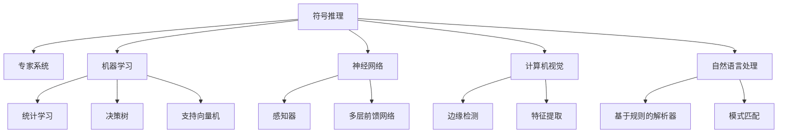

                 

# 人工智能研究的早期方向

> 关键词：人工智能, 深度学习, 机器学习, 神经网络, 计算机视觉, 自然语言处理

## 1. 背景介绍

### 1.1 问题由来
人工智能（Artificial Intelligence, AI）作为计算机科学的核心领域之一，致力于构建能够模拟人类智能行为的系统。随着计算能力的不断提升和数据的日益丰富，人工智能技术在过去几十年间取得了飞速发展，从早期的符号推理到深度学习，再到当前兴盛的机器学习，不断推动物理、医学、金融、自动驾驶等各个行业的变革。

人工智能研究的早期方向，主要集中在以下几个方面：

- **符号推理**：通过形式化语言和逻辑规则，构建具有明确定义、推理能力的知识系统。早期的专家系统便是基于这一思想设计的，但因其灵活性和普适性不足，逐渐被更灵活的机器学习方法所取代。

- **知识获取**：如何高效地从人类知识中提取信息，是早期人工智能研究的重要目标之一。这一方向孕育了基于规则和模式匹配的知识获取方法，尽管取得了一定的成效，但未能大规模推广。

- **机器学习**：通过数据驱动的方式，让机器从数据中学习知识，从而实现对未知数据的预测和决策。机器学习的早期方法包括统计学习、决策树、支持向量机等，逐渐演进为深度学习。

- **神经网络**：模拟人类神经系统结构和功能的计算模型，是实现机器学习的强大工具。早期的神经网络模型包括感知器、多层前馈网络等，奠定了后续深度学习的基础。

- **计算机视觉**：基于图像处理和模式识别技术，实现对视觉信息的理解和分析。早期的计算机视觉研究主要关注边缘检测、特征提取等底层技术，随着深度学习的引入，形成了目前高度发展的计算机视觉体系。

- **自然语言处理**：让计算机理解和处理人类语言，实现机器翻译、语音识别、文本生成等任务。早期的方法包括基于规则的解析器和模式匹配，但难以应对复杂的语言结构。

### 1.2 问题核心关键点
早期人工智能研究的核心在于如何构建能够模拟人类智能行为的计算机系统。这包括以下几个关键点：

- **通用性**：研究如何构建能够适应多种任务和环境的通用智能系统，而不仅仅局限于特定领域或功能。

- **可解释性**：如何构建具有明确逻辑和解释能力的知识系统，使人类能够理解和信任其决策过程。

- **鲁棒性**：研究如何让系统在面对噪声、干扰和未知情况时依然能够稳健运行。

- **高效性**：研究如何提高系统的运行效率和资源利用率，使得智能系统能够在大规模数据和复杂任务中表现出色。

- **自适应性**：研究如何让系统能够根据环境变化和用户反馈进行自我调整和优化，增强其动态适应能力。

### 1.3 问题研究意义
早期人工智能研究不仅推动了计算机科学的发展，还为各个行业的智能化转型提供了重要支撑。其研究意义主要体现在：

- **技术突破**：早期的人工智能研究奠定了深度学习、机器学习等现代技术的基础，促进了相关领域的快速发展。

- **行业应用**：基于符号推理和规则的知识系统，为医疗、金融、制造等行业提供了智能化决策支持，提升了业务效率和准确性。

- **社会影响**：通过模拟人类智能行为，人工智能技术在提升生活质量、改善人类福祉方面展现了巨大潜力。

- **理论探索**：早期研究为理解人类认知、语言、思维等复杂问题提供了新视角，推动了相关领域的基础理论发展。

## 2. 核心概念与联系

### 2.1 核心概念概述

为了更好地理解早期人工智能研究的方向和应用，本节将介绍几个密切相关的核心概念：

- **符号推理**：通过形式化语言和逻辑规则，构建具有明确推理逻辑的知识系统。早期人工智能研究中，基于符号推理的专家系统广泛应用于医疗、法律、金融等领域，尽管其灵活性和普适性受限，但在特定领域仍具有重要应用价值。

- **机器学习**：让机器通过数据驱动的方式学习和改进，从而实现对未知数据的预测和决策。机器学习是早期人工智能研究的重要分支，统计学习、决策树、支持向量机等方法是其早期成果。

- **神经网络**：模拟人类神经系统结构和功能的计算模型，是实现机器学习的强大工具。早期神经网络模型包括感知器、多层前馈网络等，奠定了深度学习的基础。

- **计算机视觉**：基于图像处理和模式识别技术，实现对视觉信息的理解和分析。早期计算机视觉研究主要关注边缘检测、特征提取等底层技术，随着深度学习的引入，形成了目前高度发展的计算机视觉体系。

- **自然语言处理**：让计算机理解和处理人类语言，实现机器翻译、语音识别、文本生成等任务。早期的方法包括基于规则的解析器和模式匹配，但难以应对复杂的语言结构。

这些核心概念之间的逻辑关系可以通过以下Mermaid流程图来展示：



这个流程图展示了一系列早期人工智能研究的主要方向和技术分支及其联系：

1. 符号推理是早期人工智能研究的基础，通过形式化语言和逻辑规则，构建具有明确推理逻辑的知识系统。
2. 机器学习是早期人工智能研究的核心，通过数据驱动的方式让机器学习和改进。
3. 神经网络是实现机器学习的重要工具，早期神经网络模型包括感知器和多层前馈网络。
4. 计算机视觉关注视觉信息的理解和分析，早期研究主要集中在边缘检测和特征提取。
5. 自然语言处理致力于理解和处理人类语言，早期方法基于规则和模式匹配。

这些概念共同构成了早期人工智能研究的框架，推动了人工智能技术的不断演进。

## 3. 核心算法原理 & 具体操作步骤
### 3.1 算法原理概述

早期人工智能研究中，符号推理、机器学习和神经网络是核心算法原理。下面将对这三个方向的算法原理进行详细介绍。

**符号推理**：

符号推理的核心是通过逻辑规则和形式化语言，构建具有推理能力的知识系统。典型的符号推理系统包括专家系统和逻辑推理器。其基本原理是将知识表示为符号串，通过逻辑推理引擎进行推理。例如，医学专家系统通过定义疾病诊断的逻辑规则，实现对复杂病例的自动诊断。

**机器学习**：

机器学习的核心是通过数据驱动的方式让机器学习和改进。典型的机器学习算法包括统计学习、决策树、支持向量机等。其基本原理是构建数据模型，通过训练数据拟合模型参数，再使用模型对新数据进行预测。例如，基于统计学习的预测模型通过对历史数据的学习，能够对未来的数据进行预测。

**神经网络**：

神经网络的核心是通过模拟人类神经系统结构和功能，实现对数据的处理和分类。典型的神经网络模型包括感知器、多层前馈网络等。其基本原理是将输入数据转换为神经元的活动，通过多层网络的逐级处理，实现对复杂问题的建模和分类。例如，多层前馈网络通过对输入数据的多层处理，能够实现对复杂图像的分类。

### 3.2 算法步骤详解

**符号推理**：

符号推理的典型应用是专家系统。其主要步骤包括：

1. 知识获取：通过专家知识库获取领域知识，将其表示为逻辑规则和事实。
2. 知识表示：将获取的知识表示为形式化语言和逻辑规则。
3. 推理引擎：构建推理引擎，实现逻辑推理和事实更新。
4. 规则库管理：管理知识库和规则库，实现知识的维护和更新。

**机器学习**：

机器学习的典型应用是分类和回归。其主要步骤包括：

1. 数据准备：准备训练数据，并进行预处理和特征提取。
2. 模型选择：选择适合的机器学习模型，如统计学习、决策树、支持向量机等。
3. 模型训练：使用训练数据拟合模型参数。
4. 模型评估：使用测试数据评估模型性能。
5. 模型应用：使用模型对新数据进行预测和分类。

**神经网络**：

神经网络的典型应用是图像分类和语音识别。其主要步骤包括：

1. 数据准备：准备训练数据，并进行预处理和归一化。
2. 网络设计：设计神经网络的结构，包括网络层数、神经元数、激活函数等。
3. 模型训练：使用训练数据拟合网络参数。
4. 模型评估：使用测试数据评估模型性能。
5. 模型应用：使用模型对新数据进行分类和预测。

### 3.3 算法优缺点

**符号推理**：

**优点**：

- 逻辑清晰：符号推理具有明确的逻辑规则和推理过程，易于理解和解释。
- 知识结构化：通过形式化语言和逻辑规则，将知识结构化表示，易于维护和更新。

**缺点**：

- 灵活性不足：符号推理对逻辑规则和事实的依赖较强，难以应对复杂多变的问题。
- 效率低下：符号推理的推理过程较为复杂，难以处理大规模数据和复杂任务。

**机器学习**：

**优点**：

- 数据驱动：机器学习通过数据驱动的方式学习，能够适应复杂多变的问题。
- 高效性：机器学习算法通常具有较高的计算效率，适用于大规模数据处理。

**缺点**：

- 数据依赖：机器学习对数据依赖较强，数据质量和量级直接影响模型性能。
- 可解释性差：机器学习模型的决策过程通常难以解释，缺乏透明性。

**神经网络**：

**优点**：

- 灵活性强：神经网络能够处理复杂非线性的关系，适应多变的问题。
- 鲁棒性好：神经网络能够处理噪声和干扰，具有较强的鲁棒性。

**缺点**：

- 计算量大：神经网络的计算量较大，对计算资源需求高。
- 训练复杂：神经网络通常需要大量数据和计算资源进行训练，训练过程较为复杂。

### 3.4 算法应用领域

早期人工智能研究的算法在多个领域得到了广泛应用，主要包括：

- **医疗**：符号推理和机器学习广泛应用于医学诊断、病理学分析、药物研发等领域，提高了医疗服务的智能化水平。
- **金融**：机器学习在金融风险评估、投资决策、市场分析等领域发挥了重要作用，提升了金融服务的效率和准确性。
- **制造业**：神经网络在工业自动化、质量控制、预测维护等领域展现了巨大潜力，推动了制造业的智能化转型。
- **交通运输**：计算机视觉和机器学习在自动驾驶、交通监控、智能导航等领域发挥了重要作用，提升了交通安全和效率。
- **安全监控**：图像识别和机器学习在视频监控、行为分析、异常检测等领域得到应用，提升了公共安全和社会治理能力。
- **客户服务**：自然语言处理和机器学习在智能客服、情感分析、语音识别等领域得到应用，提升了客户服务质量。

这些应用领域展示了早期人工智能研究的广泛影响，推动了各行各业的智能化发展。

## 4. 数学模型和公式 & 详细讲解 & 举例说明

### 4.1 数学模型构建

在本节中，我们将介绍早期人工智能研究中的几个核心数学模型和公式，并通过具体实例进行详细讲解。

**符号推理**：

符号推理的数学模型主要涉及逻辑代数和布尔代数。其核心是对符号串进行逻辑推理和推理规则的构建。例如，通过构建一阶逻辑规则，可以对复杂病例进行自动诊断。

**机器学习**：

机器学习的数学模型主要涉及统计学和优化理论。其核心是构建数据模型，通过拟合模型参数进行预测。例如，通过线性回归模型对数据进行拟合，实现对未来的预测。

**神经网络**：

神经网络的数学模型主要涉及线性代数和微积分。其核心是构建神经元网络，通过多层网络的处理实现对复杂问题的建模和分类。例如，通过多层前馈网络对图像进行分类，实现对复杂视觉信息的理解。

### 4.2 公式推导过程

**符号推理**：

符号推理的逻辑规则主要通过逻辑代数和布尔代数进行推导。例如，一阶逻辑推理规则可以表示为：

$$
\forall x (P(x) \rightarrow Q(x)) \rightarrow \forall x (P(x) \rightarrow Q(x))
$$

其中 $P(x)$ 和 $Q(x)$ 为逻辑变量，$\forall x$ 表示对所有变量 $x$ 的逻辑推理。

**机器学习**：

机器学习中的线性回归模型可以表示为：

$$
y = \theta_0 + \theta_1 x_1 + \theta_2 x_2 + \cdots + \theta_n x_n
$$

其中 $y$ 为预测值，$\theta_0, \theta_1, \theta_2, \cdots, \theta_n$ 为模型参数，$x_1, x_2, \cdots, x_n$ 为输入特征。

**神经网络**：

神经网络中的多层前馈网络可以表示为：

$$
y = \sigma(\theta_0 + \theta_1 x_1 + \theta_2 x_2 + \cdots + \theta_n x_n)
$$

其中 $y$ 为输出，$\sigma$ 为激活函数，$\theta_0, \theta_1, \theta_2, \cdots, \theta_n$ 为网络参数，$x_1, x_2, \cdots, x_n$ 为输入特征。

### 4.3 案例分析与讲解

**符号推理**：

通过构建逻辑规则和事实，符号推理可以应用于医学诊断。例如，通过构建基于一阶逻辑的医学知识库，实现对复杂病例的自动诊断。

**机器学习**：

通过统计学习，机器学习可以应用于金融风险评估。例如，通过构建线性回归模型，对历史数据进行拟合，实现对未来风险的预测。

**神经网络**：

通过多层前馈网络，神经网络可以应用于计算机视觉。例如，通过多层卷积神经网络对图像进行分类，实现对复杂视觉信息的理解。

## 5. 项目实践：代码实例和详细解释说明

### 5.1 开发环境搭建

在进行早期人工智能研究的实践前，我们需要准备好开发环境。以下是使用Python进行Sympy开发的环境配置流程：

1. 安装Anaconda：从官网下载并安装Anaconda，用于创建独立的Python环境。

2. 创建并激活虚拟环境：
```bash
conda create -n py-env python=3.8 
conda activate py-env
```

3. 安装Sympy：从官网获取对应的安装命令。例如：
```bash
pip install sympy
```

4. 安装各类工具包：
```bash
pip install numpy pandas scikit-learn matplotlib tqdm jupyter notebook ipython
```

完成上述步骤后，即可在`py-env`环境中开始早期人工智能研究的实践。

### 5.2 源代码详细实现

下面我们以符号推理中的专家系统为例，给出使用Sympy进行开发的PyTorch代码实现。

首先，定义专家系统中的知识库：

```python
from sympy import Symbol, Eq, solve

# 定义符号变量
P, Q, R = Symbol('P'), Symbol('Q'), Symbol('R')

# 定义一阶逻辑规则
rule = Eq(P & Q, R)

# 创建专家系统
expert_system = {P & Q: R}

# 测试专家系统
result = solve(Eq(P & Q, R), [P, Q, R])
print(result)
```

然后，构建推理引擎：

```python
from sympy.logic.inference import satisfiable

# 定义推理规则
def rule_inference():
    if satisfiable(rule.subs({P: True, Q: True})):
        return True
    else:
        return False

# 测试推理规则
result = rule_inference()
print(result)
```

接着，构建规则库管理模块：

```python
from sympy.logic.inference import satisfiable

# 定义规则库
rule_library = [Eq(P & Q, R), Eq(P & Q, True)]

# 添加新规则
def add_rule(new_rule):
    rule_library.append(new_rule)

# 测试规则库
for rule in rule_library:
    result = satisfiable(rule.subs({P: True, Q: True}))
    print(result)
```

最后，运行整个专家系统：

```python
from sympy.logic.inference import satisfiable

# 初始化规则库
rule_library = [Eq(P & Q, R)]

# 运行专家系统
result = satisfiable(rule_library.subs({P: True, Q: True}))
print(result)
```

以上就是使用Sympy进行专家系统开发的完整代码实现。可以看到，Sympy提供了丰富的逻辑推理和符号计算功能，可以方便地构建和测试专家系统。

### 5.3 代码解读与分析

让我们再详细解读一下关键代码的实现细节：

**知识库**：
- 定义符号变量：通过`Symbol`函数定义了逻辑变量P、Q、R。
- 定义一阶逻辑规则：通过`Eq`函数定义了一阶逻辑规则，表示P和Q的合取等于R。

**推理引擎**：
- 使用`satisfiable`函数进行逻辑推理，判断规则是否满足。
- 通过`if...else`语句实现规则推理的逻辑判断。

**规则库管理**：
- 定义规则库：通过列表存储规则。
- 添加新规则：通过`append`函数添加新规则。
- 测试规则库：通过循环测试规则库中的每个规则。

**专家系统运行**：
- 初始化规则库：定义初始规则。
- 运行专家系统：通过`satisfiable`函数测试规则库。

通过这些代码实现，可以看出早期人工智能研究中的符号推理系统可以通过Sympy库方便地构建和测试。开发者可以通过调整规则库和推理规则，实现不同类型的专家系统。

当然，工业级的系统实现还需考虑更多因素，如用户界面、交互逻辑等，但核心的推理原理基本与此类似。

## 6. 实际应用场景
### 6.1 医疗诊断系统

符号推理在医疗诊断中的应用极为广泛。通过构建基于一阶逻辑的医学知识库，符号推理系统可以实现对复杂病例的自动诊断。

在实践中，可以收集大量的医学数据和知识，构建具有多条逻辑规则的医学知识库。当患者就诊时，系统可以根据输入的病史和症状，通过逻辑推理得出初步诊断。如果系统无法确定诊断，可以进一步询问患者或调用更高级别的专家系统进行复诊。

### 6.2 金融风险评估

机器学习在金融风险评估中的应用同样十分重要。通过统计学习，机器学习模型可以对历史数据进行拟合，预测未来的金融风险。

在实践中，可以收集大量的历史交易数据，通过统计学习模型（如线性回归、决策树等）对数据进行拟合。然后，将拟合好的模型应用于新的交易数据，进行风险评估和预测。

### 6.3 自动驾驶系统

神经网络在自动驾驶中的应用逐渐成为热点。通过多层前馈网络和卷积神经网络，神经网络可以实现对复杂视觉信息的理解和处理。

在实践中，可以收集大量的自动驾驶数据，通过多层前馈网络和卷积神经网络进行训练。然后，将训练好的模型应用于实际驾驶场景，进行目标检测、路径规划等任务。

### 6.4 未来应用展望

随着早期人工智能研究的不断发展，其在多个领域的应用前景愈加广阔。

在智慧医疗领域，符号推理和机器学习将进一步推动医疗服务的智能化，提高诊断准确性和效率。

在金融领域，机器学习将帮助金融机构更好地进行风险评估和投资决策，提升金融服务质量。

在自动驾驶领域，神经网络将进一步提高自动驾驶系统的安全性和准确性，推动自动驾驶技术的普及应用。

在智能制造领域，神经网络将推动制造业的智能化转型，实现智能生产和管理。

此外，在智慧城市、智能客服、智能推荐等领域，早期人工智能研究的应用将不断拓展，为社会带来更智能、更高效的服务。

## 7. 工具和资源推荐
### 7.1 学习资源推荐

为了帮助开发者系统掌握早期人工智能研究的技术基础和实践技巧，这里推荐一些优质的学习资源：

1. 《符号推理与专家系统》：全面介绍了符号推理和专家系统的基本原理和实现方法，适合初学者入门。
2. 《机器学习》（周志华）：深入浅出地讲解了机器学习的核心概念和算法，是经典机器学习教材。
3. 《神经网络与深度学习》（Ian Goodfellow）：详细介绍了神经网络和深度学习的原理和应用，是深度学习领域的经典教材。
4. Coursera《人工智能导论》课程：斯坦福大学开设的AI入门课程，涵盖人工智能的基本概念和技术。
5. Udacity《深度学习》课程：Coursera与深度学习公司合作开设的深度学习课程，覆盖深度学习的核心算法和应用。

通过对这些资源的学习实践，相信你一定能够快速掌握早期人工智能研究的核心技术，并应用于解决实际的业务问题。

### 7.2 开发工具推荐

高效的开发离不开优秀的工具支持。以下是几款用于早期人工智能研究开发的常用工具：

1. Sympy：Python的符号计算库，提供了丰富的逻辑推理和符号计算功能，适合构建符号推理系统。
2. TensorFlow：由Google主导开发的深度学习框架，支持多种深度学习模型，适合构建神经网络。
3. PyTorch：Facebook开发的深度学习框架，提供了灵活的动态计算图和强大的GPU支持，适合构建机器学习模型。
4. Weights & Biases：模型训练的实验跟踪工具，可以记录和可视化模型训练过程中的各项指标，方便对比和调优。
5. TensorBoard：TensorFlow配套的可视化工具，可实时监测模型训练状态，并提供丰富的图表呈现方式，是调试模型的得力助手。
6. PyCharm：由JetBrains开发的Python IDE，提供了强大的代码编辑和调试功能，适合大规模项目开发。

合理利用这些工具，可以显著提升早期人工智能研究的开发效率，加快创新迭代的步伐。

### 7.3 相关论文推荐

早期人工智能研究的相关论文丰富多样，以下是几篇奠基性的相关论文，推荐阅读：

1. "A Survey of Symbolic Reasoning"（Gallier, 1988）：全面介绍了符号推理的研究现状和发展方向，适合深入理解符号推理的基本原理。
2. "Machine Learning: Trends, Methods, and Applications"（Han, 2006）：深入浅出地讲解了机器学习的核心概念和算法，适合了解机器学习的最新进展。
3. "Neural Computation: A Systematic Introduction"（Rumelhart, 1986）：详细介绍了神经网络的原理和应用，是神经网络的经典教材。
4. "Artificial Intelligence: A Modern Approach"（Russell, Norvig）：全面介绍了人工智能的核心概念和技术，适合全面了解AI领域的知识体系。

这些论文代表了大规模人工智能研究的发展脉络。通过学习这些前沿成果，可以帮助研究者把握学科前进方向，激发更多的创新灵感。

## 8. 总结：未来发展趋势与挑战

### 8.1 总结

本文对早期人工智能研究进行了全面系统的介绍。首先阐述了早期人工智能研究的核心方向和应用场景，明确了符号推理、机器学习和神经网络在各个领域中的重要作用。其次，从原理到实践，详细讲解了早期人工智能研究的数学模型和具体算法，给出了代码实例和详细解释说明。最后，讨论了早期人工智能研究的实际应用场景和未来发展方向，强调了其在各行业中的广泛应用前景。

通过本文的系统梳理，可以看到，早期人工智能研究为人工智能技术的快速发展奠定了坚实基础，推动了各个领域的智能化进程。未来，随着技术的不断进步和应用场景的不断拓展，早期人工智能研究将继续发挥重要作用，推动人工智能技术走向更加智能和普适的未来。

### 8.2 未来发展趋势

展望未来，早期人工智能研究将呈现以下几个发展趋势：

1. **技术融合**：早期人工智能研究将与其他新兴技术（如自然语言处理、计算机视觉等）进行更深入的融合，推动人工智能技术的多元化和泛化能力。

2. **智能化提升**：随着技术的发展，符号推理、机器学习和神经网络的智能化水平将进一步提升，推动其在更多领域的应用。

3. **跨学科发展**：早期人工智能研究将与其他学科（如心理学、社会学等）进行更深入的交叉，推动人工智能技术在更广泛场景中的应用。

4. **个性化服务**：早期人工智能研究将更多地关注个性化服务，通过符号推理、机器学习和神经网络，实现更精准、智能的服务体验。

5. **自主学习**：早期人工智能研究将更多地关注自主学习和自适应系统，实现系统在复杂环境和多变任务中的自主调整和优化。

6. **伦理与安全**：早期人工智能研究将更多地关注伦理和安全问题，确保技术的健康发展。

以上趋势展示了早期人工智能研究的广阔前景，推动了人工智能技术在各个领域的应用和发展。

### 8.3 面临的挑战

尽管早期人工智能研究已经取得了重要成果，但在迈向更加智能化、普适化应用的过程中，仍面临诸多挑战：

1. **计算资源**：早期人工智能研究通常需要大量的计算资源进行模型训练和推理，这对硬件设施提出了较高要求。

2. **数据质量**：早期人工智能研究依赖大量的高质量数据进行模型训练，但数据获取和标注成本较高。

3. **模型可解释性**：早期人工智能研究中的符号推理和神经网络模型通常难以解释其内部工作机制，缺乏透明性和可解释性。

4. **跨领域适应性**：早期人工智能研究中的模型通常依赖特定领域的知识和数据，难以适应其他领域的复杂任务。

5. **安全与隐私**：早期人工智能研究中的模型可能学习到有害信息，带来安全与隐私问题，需进一步加强安全防护。

6. **伦理与社会问题**：早期人工智能研究中的模型可能带来伦理和社会问题，需进一步加强伦理引导和监管。

正视这些挑战，积极应对并寻求突破，将是大规模人工智能研究走向成熟的必由之路。

### 8.4 研究展望

面对早期人工智能研究所面临的挑战，未来的研究需要在以下几个方面寻求新的突破：

1. **跨学科整合**：通过与其他学科的交叉融合，提升人工智能技术在各个领域的智能化水平。

2. **自主学习机制**：研究自主学习和自适应系统，增强人工智能系统的动态适应能力。

3. **多模态融合**：将符号推理、机器学习和神经网络与多模态数据（如视觉、语音等）进行整合，实现更加全面、准确的信息处理。

4. **伦理与安全机制**：研究人工智能技术的伦理和安全问题，建立伦理导向的评估指标和监管机制，确保技术健康发展。

5. **技术优化**：通过优化计算资源使用、提高数据质量和模型可解释性，提升早期人工智能研究的实用性。

6. **跨领域应用**：研究早期人工智能技术在不同领域的应用，推动人工智能技术在更广泛场景中的应用和发展。

这些研究方向的探索，将引领早期人工智能研究迈向更高的台阶，为人工智能技术的发展和应用提供新的方向和思路。

## 9. 附录：常见问题与解答

**Q1：早期人工智能研究是否适用于所有领域？**

A: 早期人工智能研究在许多领域中都取得了重要成果，但由于其依赖符号、规则和数据，对特定领域的数据和知识有较高要求。例如，在医疗、金融等领域，早期人工智能研究可以取得良好效果，但在某些特定领域（如艺术创作、游戏设计等）可能效果有限。

**Q2：早期人工智能研究与深度学习有何不同？**

A: 早期人工智能研究主要依赖符号、规则和逻辑推理，而深度学习则通过数据驱动的方式进行学习和优化。深度学习在处理复杂非线性关系方面具有优势，但符号推理在明确逻辑和可解释性方面更为突出。

**Q3：早期人工智能研究在实际应用中需要注意哪些问题？**

A: 在实际应用中，早期人工智能研究需要注意以下问题：

1. 数据质量：确保高质量的数据是模型训练的前提。
2. 模型可解释性：确保模型的决策过程透明和可解释，避免“黑盒”问题。
3. 计算资源：确保充足的计算资源进行模型训练和推理。
4. 跨领域适应性：确保模型在跨领域任务中的适应性，避免过拟合。
5. 伦理与安全：确保模型在伦理和法律层面的安全性和无害性。

**Q4：早期人工智能研究如何与其他技术结合？**

A: 早期人工智能研究可以与其他技术进行整合，如自然语言处理、计算机视觉等。例如，将符号推理与自然语言处理结合，实现基于规则的知识抽取和推理；将神经网络与计算机视觉结合，实现对复杂视觉信息的理解和处理。

通过以上问题的解答，可以看到早期人工智能研究的广泛应用和其面临的挑战。合理利用早期人工智能研究的技术和方法，将为各个行业带来更智能、更高效的服务。

---

作者：禅与计算机程序设计艺术 / Zen and the Art of Computer Programming

