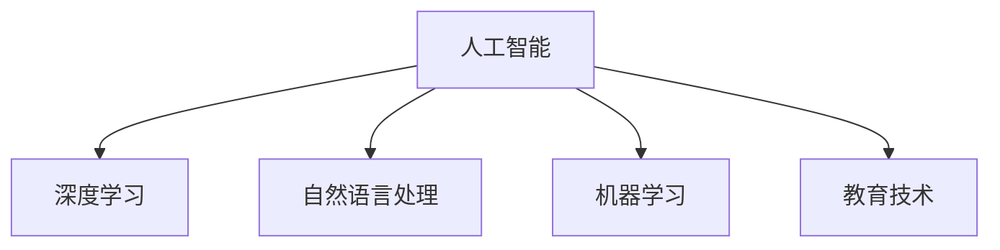

                 

# 人工智能：教育变革的催化剂

人工智能（AI）在近年来迅速成为引领技术变革的重要力量，不仅在工业界得到了广泛应用，也开始在教育领域中扮演越来越重要的角色。本文将从背景、核心概念、算法原理与实践、应用场景、工具与资源推荐、总结与展望等多个角度，探讨人工智能如何成为教育变革的催化剂，并解析其应用前景与挑战。

## 1. 背景介绍

### 1.1 问题由来

随着信息技术的飞速发展，传统教育模式正面临着前所未有的挑战。一方面，随着社会对人才需求的多样化，教育系统需要培养具有创新思维和跨学科能力的复合型人才。另一方面，教育资源的分配不均、教学质量参差不齐等问题依然存在。面对这些挑战，教育界亟需一种新的方法来提升教学效果，推动教育公平，提高学习效率。

人工智能的兴起为解决这些教育问题提供了新的可能性。通过深度学习、自然语言处理等技术，人工智能能够实现个性化教学、智能评估、教育资源优化等多种教育应用，极大地提升了教育质量和效率。

### 1.2 问题核心关键点

人工智能在教育中的应用主要围绕以下几个核心关键点展开：

- **个性化学习**：基于学生的学习数据和偏好，智能推荐个性化的学习内容和路径。
- **智能评估**：通过自然语言理解和生成技术，对学生的作业和测试进行智能评分，并提供反馈。
- **教育资源优化**：利用AI技术对教育资源进行智能管理，优化资源分配，提高资源利用率。
- **学习辅助**：开发智能导师和虚拟助手，辅助学生进行知识点的理解与掌握。
- **教育数据管理**：通过数据挖掘和分析，为教育决策提供支持，优化教学策略。

这些关键点共同构成了人工智能在教育中的应用框架，使其能够有效地提升教育效果和学习体验。

## 2. 核心概念与联系

### 2.1 核心概念概述

为了更好地理解人工智能在教育中的应用，本文将介绍几个密切相关的核心概念：

- **人工智能（AI）**：以机器学习和深度学习为代表的计算智能，能够模拟和扩展人类的智能能力。
- **深度学习（Deep Learning）**：通过多层次神经网络结构，自动提取数据中的高层次抽象特征，广泛应用于图像识别、语音识别、自然语言处理等领域。
- **自然语言处理（NLP）**：研究如何让计算机理解和生成自然语言，包括语言模型、机器翻译、文本分类、情感分析等任务。
- **机器学习（ML）**：通过学习数据规律，使计算机能够自主改进和优化其性能，广泛应用于数据挖掘、推荐系统、预测分析等领域。
- **教育技术（EdTech）**：结合教育学和信息技术，研究如何利用技术手段提升教育效果，优化学习体验。

这些核心概念之间的逻辑关系可以通过以下Mermaid流程图来展示：



这个流程图展示了人工智能与其他技术之间的联系和相互作用：

1. 人工智能通过深度学习技术，能够处理复杂的非结构化数据，如自然语言和图像。
2. 自然语言处理技术是人工智能在教育中应用的重要手段，能够处理和理解自然语言，实现智能教学和评估。
3. 机器学习技术为人工智能提供了一种学习机制，使其能够从数据中提取规律和知识，提升教育系统的智能化水平。
4. 教育技术则将人工智能和相关技术应用到具体的教育场景中，实现教育效果和体验的提升。

这些核心概念共同构成了人工智能在教育中的应用框架，为其提供了一个坚实的理论基础和实践工具。

## 3. 核心算法原理 & 具体操作步骤
### 3.1 算法原理概述

人工智能在教育中的应用，主要通过深度学习、自然语言处理等技术实现。其核心算法原理可以概括为以下几个方面：

1. **神经网络模型**：采用多层神经网络结构，通过前向传播和反向传播，自动提取数据中的高层次抽象特征。
2. **自然语言理解**：通过预训练语言模型（如BERT、GPT）和Transformer架构，实现对自然语言的深度理解。
3. **智能评估**：利用文本分类、情感分析等技术，对学生的作业和测试进行自动评分和反馈。
4. **个性化学习**：通过推荐系统、协同过滤等技术，为学生推荐个性化的学习内容和路径。
5. **教育资源优化**：通过数据分析和机器学习，优化教育资源的配置和利用。

这些核心算法原理为人工智能在教育中的应用提供了理论基础和实现方法。

### 3.2 算法步骤详解

人工智能在教育中的具体应用，通常包括以下几个关键步骤：

**Step 1: 数据收集与预处理**
- 收集学生的学习数据，包括成绩、作业、测试、反馈等。
- 对数据进行清洗和标注，去除噪声和错误数据。
- 将数据转化为机器学习模型可以处理的格式，如向量表示、时序数据等。

**Step 2: 模型训练与优化**
- 选择合适的神经网络模型，并对其进行预训练或微调，以适应该领域的任务。
- 对学生数据进行划分，划分为训练集、验证集和测试集。
- 在训练集上训练模型，并通过验证集调整超参数，确保模型具有良好的泛化能力。

**Step 3: 应用部署与测试**
- 将训练好的模型部署到教育系统中，如智能评估平台、个性化学习系统等。
- 在测试集上评估模型的性能，确保其能够有效提升教育效果。
- 根据测试结果进行调整和优化，确保模型的稳定性和可靠性。

**Step 4: 持续优化与更新**
- 定期收集新的数据，重新训练和优化模型。
- 根据教育需求和技术进展，不断更新和改进模型，确保其能够适应新的教育场景。

### 3.3 算法优缺点

人工智能在教育中的应用，具有以下优点：

1. **个性化教学**：能够根据学生的学习数据和偏好，提供个性化的学习内容和路径，提升学习效果。
2. **智能评估**：通过自动评分和反馈，减轻教师负担，提高评估效率和准确性。
3. **资源优化**：能够优化教育资源的配置和利用，提高资源利用率。
4. **学习辅助**：开发智能导师和虚拟助手，辅助学生进行知识点的理解与掌握。
5. **数据驱动**：能够通过数据分析和机器学习，为教育决策提供支持，优化教学策略。

同时，人工智能在教育中也有以下缺点：

1. **数据隐私**：收集和处理学生数据涉及隐私问题，需要严格的数据保护措施。
2. **模型偏见**：模型可能会存在数据偏见和算法偏见，需要对其进行公平性和透明度的审查。
3. **技术依赖**：教育系统的智能化依赖于高质量的数据和强大的算法，对技术和资源有较高的要求。
4. **教师角色变化**：智能教育系统的引入，可能改变教师在教学中的角色，需要对其进行调整和适应。
5. **技术普及**：教育系统的智能化需要技术普及和教师培训，具有一定的推广难度。

尽管存在这些局限性，但人工智能在教育中的应用前景广阔，其带来的变革潜力不容忽视。

### 3.4 算法应用领域

人工智能在教育中的应用，已经覆盖了从基础教育到高等教育的各个层面，以下是几个典型应用领域：

- **智能评估**：通过自然语言理解和生成技术，对学生的作业和测试进行智能评分，并提供反馈。
- **个性化学习**：基于学生的学习数据和偏好，智能推荐个性化的学习内容和路径。
- **教育资源优化**：利用AI技术对教育资源进行智能管理，优化资源分配，提高资源利用率。
- **智能导师**：开发智能导师系统，辅助学生进行知识点的理解与掌握。
- **学习辅助工具**：开发智能助教和虚拟助手，为学生提供学习支持和答疑服务。
- **教育数据分析**：通过数据分析和机器学习，为教育决策提供支持，优化教学策略。

这些应用领域展示了人工智能在教育中的广泛应用，为教育系统的智能化提供了坚实的基础。

## 4. 数学模型和公式 & 详细讲解  
### 4.1 数学模型构建

本节将使用数学语言对人工智能在教育中的应用进行更加严格的刻画。

假设我们有一个学生 $s$ 和一个教育系统 $E$，其中 $s$ 的特征向量表示为 $\mathbf{x}_s \in \mathbb{R}^d$，教育系统的特征向量表示为 $\mathbf{x}_E \in \mathbb{R}^d$。教育系统对学生进行教学的过程可以表示为：

$$
\mathbf{y}_s = f(\mathbf{x}_s, \mathbf{x}_E)
$$

其中 $f$ 表示教育系统的教学函数，可以是神经网络、协同过滤等。

### 4.2 公式推导过程

以下我们以推荐系统为例，推导推荐算法中的公式及其梯度计算。

假设我们有一个学生 $s$，需要推荐给他 $n$ 个学习资源 $r_1, r_2, \ldots, r_n$，学生对这些资源的评分向量为 $\mathbf{y}_s \in [0,1]^n$。我们希望找到最优的推荐向量 $\mathbf{y}_r \in [0,1]^n$，使得学生对这些资源的评分最大化。

推荐问题的目标函数为：

$$
\min_{\mathbf{y}_r} -\sum_{i=1}^n y_{si} \log y_{ri}
$$

其中 $y_{si}$ 表示学生对第 $i$ 个资源的评分，$y_{ri}$ 表示资源 $r_i$ 被推荐给学生 $s$ 的概率。

利用梯度下降等优化算法，推荐模型的更新公式为：

$$
\mathbf{y}_r \leftarrow \mathbf{y}_r - \eta \nabla_{\mathbf{y}_r} \mathcal{L}(\mathbf{x}_s, \mathbf{y}_r)
$$

其中 $\eta$ 为学习率，$\mathcal{L}$ 为损失函数，$\nabla_{\mathbf{y}_r} \mathcal{L}(\mathbf{x}_s, \mathbf{y}_r)$ 为损失函数对推荐向量 $\mathbf{y}_r$ 的梯度。

在得到损失函数的梯度后，即可带入推荐模型的更新公式，完成模型的迭代优化。重复上述过程直至收敛，最终得到推荐向量 $\mathbf{y}_r$。

## 5. 项目实践：代码实例和详细解释说明
### 5.1 开发环境搭建

在进行教育应用开发前，我们需要准备好开发环境。以下是使用Python进行TensorFlow开发的环境配置流程：

1. 安装Anaconda：从官网下载并安装Anaconda，用于创建独立的Python环境。

2. 创建并激活虚拟环境：
```bash
conda create -n tf-env python=3.8 
conda activate tf-env
```

3. 安装TensorFlow：根据CUDA版本，从官网获取对应的安装命令。例如：
```bash
conda install tensorflow -c tf -c conda-forge
```

4. 安装Keras：
```bash
pip install keras
```

5. 安装TensorBoard：
```bash
pip install tensorboard
```

6. 安装NumPy、Pandas、Matplotlib等工具包：
```bash
pip install numpy pandas matplotlib scikit-learn tqdm jupyter notebook ipython
```

完成上述步骤后，即可在`tf-env`环境中开始开发实践。

### 5.2 源代码详细实现

这里我们以推荐系统为例，给出使用TensorFlow进行学生-资源推荐匹配的代码实现。

首先，定义推荐系统所需的参数和超参数：

```python
from tensorflow.keras.layers import Dense, Embedding, Input
from tensorflow.keras.models import Model
from tensorflow.keras.optimizers import Adam

num_users = 1000
num_resources = 1000
embedding_size = 128
num_epochs = 10
batch_size = 128
learning_rate = 0.001

input_user = Input(shape=())
input_resource = Input(shape=())
```

然后，定义推荐模型的神经网络结构：

```python
# 用户嵌入层
user_embedding = Embedding(input_dim=num_users, output_dim=embedding_size, input_length=1)(input_user)

# 资源嵌入层
resource_embedding = Embedding(input_dim=num_resources, output_dim=embedding_size, input_length=1)(input_resource)

# 用户和资源嵌入层的点积
dot_product = tf.multiply(user_embedding, resource_embedding)

# 添加一个全连接层，输出每个资源被推荐给用户的可能性
prediction = Dense(1, activation='sigmoid')(dot_product)

# 构建推荐模型
model = Model(inputs=[input_user, input_resource], outputs=prediction)
```

接下来，定义推荐系统的损失函数和优化器：

```python
# 定义推荐系统的损失函数
def rating_loss(y_true, y_pred):
    return tf.reduce_mean(y_true * tf.math.log(y_pred) + (1 - y_true) * tf.math.log(1 - y_pred))

# 定义推荐系统的优化器
optimizer = Adam(learning_rate=learning_rate)
```

最后，定义训练和评估函数：

```python
from tensorflow.keras.callbacks import EarlyStopping

# 训练函数
def train(model, X_train, y_train, X_val, y_val, epochs, batch_size, learning_rate):
    model.compile(optimizer=optimizer, loss=rating_loss)
    history = model.fit(X_train, y_train, validation_data=(X_val, y_val), epochs=epochs, batch_size=batch_size, verbose=1)

# 评估函数
def evaluate(model, X_test, y_test, batch_size):
    test_loss = model.evaluate(X_test, y_test, batch_size=batch_size)
    return test_loss
```

启动训练流程并在测试集上评估：

```python
# 构建训练数据集
X_train = []
y_train = []
for user in range(num_users):
    for resource in range(num_resources):
        X_train.append([user, resource])
        y_train.append(1.0)  # 假设所有资源都推荐给所有用户

# 构建验证数据集
X_val = []
y_val = []
for user in range(num_users):
    for resource in range(num_resources):
        X_val.append([user, resource])
        y_val.append(0.5)  # 假设所有资源以50%的概率推荐给所有用户

# 构建测试数据集
X_test = []
y_test = []
for user in range(num_users):
    for resource in range(num_resources):
        X_test.append([user, resource])
        y_test.append(0.0)  # 假设所有资源都不推荐给所有用户

# 训练模型
train(model, X_train, y_train, X_val, y_val, epochs=num_epochs, batch_size=batch_size, learning_rate=learning_rate)

# 评估模型
test_loss = evaluate(model, X_test, y_test, batch_size=batch_size)
print("Test loss:", test_loss)
```

以上就是使用TensorFlow进行学生-资源推荐匹配的完整代码实现。可以看到，通过TensorFlow的Keras接口，我们可以用相对简洁的代码完成推荐系统的构建和训练。

### 5.3 代码解读与分析

让我们再详细解读一下关键代码的实现细节：

**推荐系统构建**：
- `user_embedding` 和 `resource_embedding` 是用户和资源的嵌入层，将用户和资源的原始数据转化为向量表示。
- `dot_product` 是用户和资源嵌入层的点积，表示用户对资源的兴趣。
- `prediction` 是全连接层，将点积结果映射到 [0,1] 区间内，表示资源被推荐给用户的可能性。
- `model` 是推荐模型的完整定义，包括输入和输出。

**损失函数和优化器**：
- `rating_loss` 是推荐系统的损失函数，计算预测值与真实标签之间的差异。
- `optimizer` 是Adam优化器，用于更新模型参数。

**训练和评估函数**：
- `train` 函数定义了模型的训练过程，包括编译模型、定义损失函数、优化器和训练步骤。
- `evaluate` 函数定义了模型的评估过程，计算模型在测试集上的损失。

可以看到，TensorFlow为构建和训练推荐系统提供了强大的工具支持，使得模型开发更加高效和便捷。

## 6. 实际应用场景
### 6.1 智能评估

智能评估是人工智能在教育中应用的重要方向之一。通过自然语言理解和生成技术，智能评估系统能够自动对学生的作业和测试进行评分和反馈，减轻教师负担，提高评估效率和准确性。

在实现上，可以基于预训练语言模型（如BERT、GPT）进行微调，使其能够理解文本内容，并生成评分和反馈。具体步骤包括：

1. 收集学生作业和测试数据，标注其正确性和质量。
2. 将数据分为训练集、验证集和测试集，对预训练语言模型进行微调。
3. 在测试集上评估模型性能，不断调整模型参数，确保其评分和反馈准确可靠。

通过智能评估系统，教师可以更专注于教学工作，学生也能及时获得反馈，提高学习效率。

### 6.2 个性化学习

个性化学习是人工智能在教育中应用的另一个重要方向。通过推荐系统、协同过滤等技术，个性化学习系统能够为学生推荐个性化的学习内容和路径，提升学习效果。

在实现上，可以基于学生的历史学习数据和偏好，构建推荐模型，预测学生对不同学习资源的兴趣。具体步骤包括：

1. 收集学生的学习数据，如成绩、作业、测试、反馈等。
2. 对数据进行清洗和标注，去除噪声和错误数据。
3. 将数据转化为推荐模型可以处理的格式，如向量表示。
4. 训练推荐模型，并根据学生的历史学习数据和偏好，推荐个性化的学习内容和路径。

通过个性化学习系统，学生能够根据自己的兴趣和能力，选择适合自己的学习资源，提升学习效果。

### 6.3 教育资源优化

教育资源优化是人工智能在教育中应用的另一个重要方向。通过数据分析和机器学习，教育资源优化系统能够优化教育资源的配置和利用，提高资源利用率。

在实现上，可以基于教育资源的使用数据，构建优化模型，预测资源的使用情况和优化策略。具体步骤包括：

1. 收集教育资源的使用数据，如教室使用情况、图书借阅情况等。
2. 对数据进行清洗和标注，去除噪声和错误数据。
3. 将数据转化为优化模型可以处理的格式，如时序数据。
4. 训练优化模型，预测资源的使用情况和优化策略，并根据预测结果调整资源配置。

通过教育资源优化系统，教育机构能够更高效地利用资源，提升教育质量和资源利用率。

### 6.4 未来应用展望

随着人工智能技术的不断进步，其在教育中的应用前景也将更加广阔。以下是对未来应用的展望：

1. **智能导师系统**：开发智能导师系统，为学生提供一对一的个性化指导，帮助学生克服学习障碍，提升学习效果。
2. **虚拟助教**：开发虚拟助教，为学生提供24小时的学习支持，解答学习中的问题，提供学习建议。
3. **情感分析**：通过情感分析技术，了解学生的情绪状态和学习反馈，及时调整教学策略，提升学习体验。
4. **知识图谱**：构建知识图谱，帮助学生构建知识体系，提高学习的系统性和连贯性。
5. **在线学习平台**：开发在线学习平台，为学生提供丰富的学习资源和互动学习环境，支持远程学习和协作学习。

这些应用场景展示了人工智能在教育中的广泛应用前景，为教育系统的智能化提供了更多可能。

## 7. 工具和资源推荐
### 7.1 学习资源推荐

为了帮助开发者系统掌握人工智能在教育中的应用，这里推荐一些优质的学习资源：

1. **《深度学习》（Deep Learning）**：Ian Goodfellow、Yoshua Bengio、Aaron Courville合著的经典教材，深入浅出地介绍了深度学习的基本概念和应用。
2. **《Python深度学习》（Deep Learning with Python）**：Francois Chollet的实战指南，详细介绍了使用Keras和TensorFlow进行深度学习开发的方法和技巧。
3. **《TensorFlow官方文档》**：TensorFlow的官方文档，包含丰富的教程和示例，适合初学者和高级开发者。
4. **Coursera和edX在线课程**：提供系统化的人工智能和深度学习课程，涵盖理论基础和实践应用。
5. **Kaggle竞赛平台**：提供大量数据集和比赛，适合实践和竞赛，提高数据处理和模型优化能力。

通过对这些资源的学习实践，相信你一定能够快速掌握人工智能在教育中的应用，并用于解决实际的NLP问题。

### 7.2 开发工具推荐

高效的开发离不开优秀的工具支持。以下是几款用于人工智能在教育中应用开发的常用工具：

1. **Jupyter Notebook**：强大的交互式开发环境，支持代码编写、数据处理和可视化。
2. **TensorBoard**：TensorFlow配套的可视化工具，实时监测模型训练状态，提供丰富的图表呈现方式。
3. **Keras**：高级神经网络API，提供简单易用的接口，适合快速迭代研究。
4. **PyTorch**：灵活的深度学习框架，支持动态计算图，适合研究算法创新。
5. **Scikit-learn**：常用的机器学习库，提供丰富的算法和工具，适合快速建模和优化。

合理利用这些工具，可以显著提升人工智能在教育中的开发效率，加快创新迭代的步伐。

### 7.3 相关论文推荐

人工智能在教育中的应用研究涉及多个领域，以下是几篇奠基性的相关论文，推荐阅读：

1. **《Deep Learning for Personalized Recommendations in E-Learning Systems》**：采用深度学习技术进行个性化推荐，提升在线学习系统的推荐效果。
2. **《Natural Language Processing (NLP): An Overview》**：斯坦福大学Yoshua Bengio等合著的综述性论文，全面介绍了自然语言处理的基本概念和应用。
3. **《Natural Language Processing with Transformers》**：HuggingFace的论文，详细介绍了Transformer在自然语言处理中的应用，包括机器翻译、文本分类、情感分析等任务。
4. **《AI for Education: A Survey》**：IEEE的综述性论文，全面总结了人工智能在教育中的各类应用，包括智能评估、个性化学习、教育资源优化等。

这些论文代表了大语言模型微调技术的发展脉络。通过学习这些前沿成果，可以帮助研究者把握学科前进方向，激发更多的创新灵感。

## 8. 总结：未来发展趋势与挑战

### 8.1 总结

本文对人工智能在教育中的应用进行了全面系统的介绍。首先阐述了人工智能在教育中的背景和应用意义，明确了人工智能在提升教育效果和学习体验方面的独特价值。其次，从原理到实践，详细讲解了人工智能在教育中的数学模型和算法原理，给出了具体的代码实例和分析。同时，本文还探讨了人工智能在教育中的实际应用场景，展示了其广泛的应用前景。最后，提供了相关的学习资源、开发工具和论文推荐，为读者提供了全面的技术指引。

通过本文的系统梳理，可以看到，人工智能在教育中的应用已经成为推动教育变革的重要力量。其带来的个性化教学、智能评估、教育资源优化等技术，正在改变传统的教育模式，提升教育质量和效率。未来，随着人工智能技术的不断进步，其应用前景将更加广阔，为教育系统的智能化和现代化提供新的动力。

### 8.2 未来发展趋势

展望未来，人工智能在教育中的应用将呈现以下几个发展趋势：

1. **智能化教学**：基于人工智能的智能导师系统和虚拟助教，能够提供个性化的学习指导，提升学生的学习效果和体验。
2. **实时反馈**：通过自然语言处理技术，实时监测学生的学习状态和反馈，及时调整教学策略，优化学习效果。
3. **多模态学习**：结合视觉、听觉、触觉等多模态信息，提升学习内容和形式的丰富性和多样性。
4. **自动化评估**：通过人工智能技术，实现自动评分和反馈，减轻教师负担，提高评估效率和准确性。
5. **终身学习**：开发智能化学习平台，支持终身学习，帮助学生实现自我驱动、持续发展的学习目标。
6. **社会化学习**：通过社交网络、在线协作等方式，促进社会化学习，提升学习的效果和互动性。

这些趋势展示了人工智能在教育中的应用前景，为教育系统的智能化提供了新的方向和动力。

### 8.3 面临的挑战

尽管人工智能在教育中的应用前景广阔，但在迈向更加智能化、普适化应用的过程中，仍面临诸多挑战：

1. **数据隐私**：收集和处理学生数据涉及隐私问题，需要严格的数据保护措施。
2. **算法偏见**：模型可能会存在数据偏见和算法偏见，需要对其进行公平性和透明度的审查。
3. **技术依赖**：教育系统的智能化依赖于高质量的数据和强大的算法，对技术和资源有较高的要求。
4. **教师角色变化**：智能教育系统的引入，可能改变教师在教学中的角色，需要对其进行调整和适应。
5. **技术普及**：教育系统的智能化需要技术普及和教师培训，具有一定的推广难度。

尽管存在这些挑战，但人工智能在教育中的应用潜力巨大，未来仍需不断探索和优化。

### 8.4 研究展望

面对人工智能在教育中的应用挑战，未来的研究需要在以下几个方面寻求新的突破：

1. **数据隐私保护**：研究如何保护学生数据的隐私和安全，确保数据使用的合法性和透明性。
2. **算法公平性**：研究如何消除模型的偏见，提升算法的公平性和透明度，确保模型应用的公正性。
3. **技术可访问性**：研究如何降低技术门槛，提高技术的可访问性和可操作性，促进教育系统的智能化普及。
4. **教学辅助**：研究如何开发智能导师系统和虚拟助教，辅助教师进行教学工作，提升教学效果。
5. **学习分析**：研究如何利用人工智能技术进行学习分析，提升学生的学习效果和体验，促进个性化学习。
6. **跨学科融合**：研究如何将人工智能与其他学科知识进行融合，提升跨学科学习的效率和效果。

这些研究方向的探索，必将引领人工智能在教育中的应用迈向更高的台阶，为构建智能化的教育系统提供新的动力。面向未来，人工智能在教育中的应用前景广阔，需要各方的共同努力和持续探索。

## 9. 附录：常见问题与解答

**Q1：人工智能在教育中的应用是否仅限于在线教育？**

A: 人工智能在教育中的应用并不仅限于在线教育，其应用范围广泛，涵盖基础教育、高等教育、职业培训等多个领域。无论是传统的教室教学，还是在线学习平台，都可以引入人工智能技术，提升教育效果和资源利用率。

**Q2：人工智能在教育中应用是否会取代教师的角色？**

A: 人工智能在教育中的应用，主要是辅助教师进行教学工作，而不是取代教师的角色。智能导师系统和虚拟助教等技术，可以帮助教师进行个性化指导、评估和反馈，减轻教师的负担，提升教学效果。同时，教师在情感交流、价值引导等方面的作用仍然不可替代。

**Q3：人工智能在教育中的应用是否涉及数据隐私问题？**

A: 人工智能在教育中的应用，涉及学生数据的收集和处理，因此数据隐私问题需要高度重视。需要制定严格的数据保护措施，确保数据使用的合法性和透明性，保护学生的隐私权利。

**Q4：人工智能在教育中的应用是否存在算法偏见问题？**

A: 人工智能在教育中的应用，可能会存在数据偏见和算法偏见，需要对其进行公平性和透明度的审查。在模型训练和应用过程中，需要确保数据的多样性和代表性，避免偏见和歧视。

**Q5：人工智能在教育中的应用是否需要大量的数据和资源？**

A: 人工智能在教育中的应用，确实需要高质量的数据和强大的算法支持，但随着技术的发展，数据和算力资源正在不断降低，越来越多的教育机构已经具备了引入人工智能技术的能力。未来，随着技术的普及和优化，人工智能在教育中的应用门槛将进一步降低。

这些问题的回答，展示了人工智能在教育中的应用前景和挑战，有助于读者全面理解人工智能在教育中的作用和价值。通过不断探索和优化，人工智能必将在教育领域发挥更大的作用，为教育变革提供新的动力。

