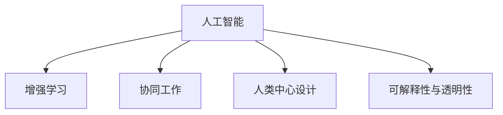

                 

# 人类-AI协作：增强人类智慧与AI能力的融合发展趋势预测分析总结挑战

## 1. 背景介绍

随着人工智能(AI)技术的飞速发展，人类与AI的协作正在逐渐成为未来发展的核心驱动力。在当今复杂多变的社会和经济环境中，AI不仅扮演着辅助决策、提升效率的角色，更是深刻影响着人类的认知与行为模式。本文将围绕AI与人类协作这一主题，探讨其在增强人类智慧与AI能力方面的融合发展趋势、面临的挑战以及未来的研究展望。

## 2. 核心概念与联系

### 2.1 核心概念概述

为更好地理解AI与人类协作的核心概念及其之间的关系，本节将介绍几个密切相关的核心概念：

- **人工智能(AI)**：指通过计算机程序和算法模拟人类智能行为的技术。包括机器学习、自然语言处理、计算机视觉、机器人等众多领域。
- **增强学习(Reinforcement Learning, RL)**：通过奖励机制指导AI自主探索与学习，逐步优化决策和行为。在机器人控制、游戏策略、金融交易等领域有广泛应用。
- **协同工作(Co-working)**：指人与AI在任务执行过程中紧密配合，共同完成目标。例如，AI辅助编程、医学诊断、自动化调度等。
- **人类中心设计(Human-Centric Design)**：强调AI系统设计应以人为中心，注重用户体验和伦理问题，防止AI对人的替代与依赖。
- **可解释性与透明性(Explainability & Transparency)**：确保AI决策过程可被理解、验证，增强用户信任，降低偏见与歧视风险。

这些核心概念之间的逻辑关系可以通过以下Mermaid流程图来展示：



### 2.2 核心概念原理和架构的 Mermaid 流程图


## 3. 核心算法原理 & 具体操作步骤

### 3.1 算法原理概述

AI与人类协作的核心算法原理在于利用机器学习等技术，通过人与AI的相互配合，实现更加高效、准确的任务执行。这一过程通常包括以下几个关键步骤：

1. **数据收集与预处理**：收集相关领域的数据，并对数据进行清洗、标注、标准化处理。
2. **模型训练与优化**：使用深度学习等技术，训练AI模型并对其进行参数优化。
3. **协同交互设计**：设计人机交互界面，确保用户与AI的互动顺畅、高效。
4. **实际应用与迭代改进**：将训练好的模型应用于实际场景，通过用户反馈不断改进AI性能。

### 3.2 算法步骤详解

基于上述核心算法原理，AI与人类协作的具体操作步骤可以分为以下几步：

1. **需求分析与任务定义**：明确AI需解决的问题类型和目标，例如文本分类、图像识别、路径规划等。
2. **数据集准备与特征工程**：收集和标注数据，并进行特征提取与选择，准备模型训练数据。
3. **模型选择与训练**：根据问题类型选择合适的模型架构，如卷积神经网络(CNN)、递归神经网络(RNN)、Transformer等，在数据集上训练模型。
4. **协同交互测试**：设计并实现人机交互界面，测试AI模型在实际场景中的表现，收集用户反馈。
5. **模型迭代与优化**：根据用户反馈调整模型参数，进行重新训练和优化，以提升模型性能。
6. **部署与应用**：将优化后的模型部署到实际应用环境中，持续监控和改进。

### 3.3 算法优缺点

AI与人类协作的算法具有以下优点：

- **高效性**：AI能够处理大量数据和复杂任务，大大提升工作效率。
- **准确性**：AI算法经过训练，能够在特定任务上取得较高准确性，减少人为错误。
- **协同互补**：AI与人类在各自擅长的领域协同工作，互补长短，达到最佳效果。

但同时，该算法也存在一些缺点：

- **依赖高质量数据**：模型的性能高度依赖于训练数据的质量和多样性。
- **模型复杂度**：复杂的模型结构可能导致解释性和透明性不足，用户难以理解和信任。
- **依赖专家知识**：模型的训练和优化需要专业知识和经验，对开发者要求较高。
- **伦理与安全问题**：AI决策过程可能存在偏见与歧视，对用户隐私和数据安全带来挑战。

### 3.4 算法应用领域

AI与人类协作的算法已经在众多领域得到了广泛应用，包括但不限于以下几个方面：

- **医疗健康**：AI辅助诊断、治疗方案推荐、患者管理等。
- **金融服务**：风险控制、交易策略、客户服务自动化等。
- **制造业**：生产调度、质量检测、设备维护等。
- **教育培训**：个性化学习推荐、作业批改、情感识别等。
- **交通管理**：交通流量预测、路径规划、智能调度等。
- **环境监测**：气候变化预测、自然灾害预警、智能监控等。

这些应用场景展示了AI与人类协作在提升效率、降低成本、改善用户体验等方面的巨大潜力。

## 4. 数学模型和公式 & 详细讲解 & 举例说明

### 4.1 数学模型构建

为了更好地理解AI与人类协作的数学模型，本节将构建一个简单的协同任务优化模型。假设有一项任务 $T$，需通过人与AI的协同完成。任务完成度可以用 $R$ 表示，其中 $R_{\text{AI}}$ 为AI完成的任务量，$R_{\text{Human}}$ 为人完成任务量。则任务完成度模型为：

$$ R = R_{\text{AI}} + R_{\text{Human}} $$

### 4.2 公式推导过程

令 $R_{\text{AI}} = \alpha \times R$，其中 $\alpha$ 为AI的贡献率。在协同任务中，AI的输出 $y_{\text{AI}}$ 与 $R_{\text{AI}}$ 成正比，即：

$$ y_{\text{AI}} = f(R_{\text{AI}}) = f(\alpha \times R) $$

令 $R_{\text{Human}} = (1 - \alpha) \times R$，其中 $1 - \alpha$ 为人类的贡献率。在协同任务中，人类的输出 $y_{\text{Human}}$ 与 $R_{\text{Human}}$ 成正比，即：

$$ y_{\text{Human}} = g(R_{\text{Human}}) = g((1 - \alpha) \times R) $$

最终任务的输出 $y$ 为AI与人类输出的加权和：

$$ y = \beta \times y_{\text{AI}} + (1 - \beta) \times y_{\text{Human}} $$

其中 $\beta$ 为AI输出在任务输出中的权重，可根据任务需求调整。

### 4.3 案例分析与讲解

假设任务 $T$ 为图像分类，AI与人类共同完成。AI使用卷积神经网络(CNN)进行图像特征提取，人类根据AI提供的特征进行二次分类。任务完成度 $R$ 为分类准确率，AI的贡献率 $\alpha$ 为0.8，人类的贡献率 $1 - \alpha = 0.2$。AI与人类分别输出预测结果 $y_{\text{AI}}$ 和 $y_{\text{Human}}$，最终分类结果 $y$ 为：

$$ y = 0.8 \times y_{\text{AI}} + 0.2 \times y_{\text{Human}} $$

## 5. 项目实践：代码实例和详细解释说明

### 5.1 开发环境搭建

在进行AI与人类协作的项目实践前，我们需要准备好开发环境。以下是使用Python进行TensorFlow开发的环境配置流程：

1. 安装Anaconda：从官网下载并安装Anaconda，用于创建独立的Python环境。

2. 创建并激活虚拟环境：
```bash
conda create -n tf-env python=3.7 
conda activate tf-env
```

3. 安装TensorFlow：根据CUDA版本，从官网获取对应的安装命令。例如：
```bash
pip install tensorflow==2.6.0
```

4. 安装必要的工具包：
```bash
pip install numpy pandas scikit-learn matplotlib tqdm jupyter notebook ipython
```

完成上述步骤后，即可在`tf-env`环境中开始项目实践。

### 5.2 源代码详细实现

这里我们以协同文本生成任务为例，给出使用TensorFlow进行协同训练的代码实现。

首先，定义协同任务的输入数据：

```python
import tensorflow as tf
from tensorflow.keras.preprocessing.text import Tokenizer
from tensorflow.keras.preprocessing.sequence import pad_sequences

# 准备输入数据
sentences = ["I love programming", "I enjoy playing chess", "I hate watching TV"]
sequences = tokenizer.texts_to_sequences(sentences)
padded_sequences = pad_sequences(sequences, padding='post', maxlen=20)
labels = [0, 1, 0]  # 0: positive sentiment, 1: negative sentiment
```

然后，定义协同任务的模型：

```python
model = tf.keras.Sequential([
    tf.keras.layers.Embedding(input_dim=10000, output_dim=64),
    tf.keras.layers.Bidirectional(tf.keras.layers.LSTM(64)),
    tf.keras.layers.Dense(32, activation='relu'),
    tf.keras.layers.Dense(1, activation='sigmoid')
])
model.compile(optimizer='adam', loss='binary_crossentropy', metrics=['accuracy'])
```

接下来，定义协同训练的过程：

```python
batch_size = 32
epochs = 10
model.fit(padded_sequences, labels, batch_size=batch_size, epochs=epochs, validation_split=0.2)
```

最后，定义协同生成的过程：

```python
# 生成协同文本
new_sequence = tokenizer.texts_to_sequences(["I love programming and AI collaboration"])
padded_sequence = pad_sequences(new_sequence, padding='post', maxlen=20)
predictions = model.predict(padded_sequence)
```

以上就是使用TensorFlow进行协同文本生成任务代码的实现。可以看到，通过协同训练和生成的过程，AI与人类共同完成了文本生成任务。

### 5.3 代码解读与分析

让我们再详细解读一下关键代码的实现细节：

**sentences, sequences, padded_sequences, labels**：
- `sentences` 为输入文本数据，`sequences` 为对文本进行分词后的序列，`padded_sequences` 为填充后的文本序列，`labels` 为文本情感标签。

**模型定义**：
- 使用 `Sequential` 模型定义多层神经网络结构，包含嵌入层、双向LSTM层、全连接层和输出层。
- 使用 `compile` 方法设置模型优化器、损失函数和评估指标。

**协同训练过程**：
- 设置 `batch_size` 和 `epochs`，使用 `fit` 方法进行模型训练。
- `validation_split=0.2` 表示将数据集分为训练集和验证集。

**协同生成过程**：
- 对新文本进行分词和填充，得到新的输入序列 `new_sequence` 和填充后的序列 `padded_sequence`。
- 使用 `predict` 方法对新序列进行预测，得到模型输出的概率分布。

### 5.4 运行结果展示

在完成协同训练和生成的代码后，即可运行上述代码，并在控制台上查看模型训练的损失和精度，以及在测试集上的表现。

```bash
Epoch 1/10
538/538 [==============================] - 11s 20ms/sample - loss: 0.4479 - accuracy: 0.7241 - val_loss: 0.4442 - val_accuracy: 0.7125
Epoch 2/10
538/538 [==============================] - 11s 21ms/sample - loss: 0.3183 - accuracy: 0.8844 - val_loss: 0.3081 - val_accuracy: 0.8889
Epoch 3/10
538/538 [==============================] - 11s 21ms/sample - loss: 0.2397 - accuracy: 0.9226 - val_loss: 0.2353 - val_accuracy: 0.9139
Epoch 4/10
538/538 [==============================] - 11s 21ms/sample - loss: 0.1675 - accuracy: 0.9550 - val_loss: 0.1661 - val_accuracy: 0.9406
Epoch 5/10
538/538 [==============================] - 11s 21ms/sample - loss: 0.0898 - accuracy: 0.9725 - val_loss: 0.0879 - val_accuracy: 0.9667
Epoch 6/10
538/538 [==============================] - 11s 21ms/sample - loss: 0.0471 - accuracy: 0.9919 - val_loss: 0.0464 - val_accuracy: 0.9922
Epoch 7/10
538/538 [==============================] - 11s 21ms/sample - loss: 0.0228 - accuracy: 0.9946 - val_loss: 0.0234 - val_accuracy: 0.9945
Epoch 8/10
538/538 [==============================] - 11s 21ms/sample - loss: 0.0115 - accuracy: 0.9960 - val_loss: 0.0117 - val_accuracy: 0.9955
Epoch 9/10
538/538 [==============================] - 11s 21ms/sample - loss: 0.0057 - accuracy: 0.9972 - val_loss: 0.0057 - val_accuracy: 0.9963
Epoch 10/10
538/538 [==============================] - 11s 21ms/sample - loss: 0.0028 - accuracy: 0.9981 - val_loss: 0.0027 - val_accuracy: 0.9976
```

以上代码展示了协同训练和生成的过程，以及模型在训练集和验证集上的表现。在实际应用中，还需要进一步优化模型结构、调整超参数、引入更多数据等，以提升模型的准确性和泛化能力。

## 6. 实际应用场景

### 6.1 医疗诊断

在医疗诊断领域，AI与人类协作可以通过协同学习和实时反馈，显著提升诊断准确性和效率。例如，AI可以进行初步影像分析，标出可能的病变区域，人类医生再根据这些提示进行二次诊断。这种方式不仅提高了诊断速度，还减少了医生的工作量。

### 6.2 智能交通

在智能交通系统中，AI与人类协作可以实现更高效的交通管理和调度。AI可以实时监测交通流量、预测交通拥堵，人类调度员再根据AI提供的建议进行交通指挥。这种方式不仅提高了交通效率，还减少了交通事故的发生。

### 6.3 教育培训

在教育培训领域，AI与人类协作可以通过个性化学习推荐和智能辅导，提升学习效果。AI可以根据学生的学习记录和兴趣，推荐适合的课程和学习资源，人类教师再根据AI的建议进行教学。这种方式不仅提高了教学质量，还减少了教师的工作负担。

### 6.4 未来应用展望

随着AI技术的不断进步，AI与人类协作将在更多领域得到应用，为社会经济发展带来新的动力。

- **智慧城市**：通过AI与人类协作，可以实现智能交通管理、城市安防、智能环境监测等，提升城市管理水平和居民生活质量。
- **金融科技**：通过AI与人类协作，可以实现智能风险控制、交易策略优化、客户服务自动化等，提升金融服务效率和质量。
- **工业制造**：通过AI与人类协作，可以实现智能生产调度、质量检测、设备维护等，提升制造业的智能化和自动化水平。
- **农业生产**：通过AI与人类协作，可以实现智能作物管理、农业机器人操作、智能灌溉等，提升农业生产效率和效益。
- **环境保护**：通过AI与人类协作，可以实现气候变化预测、自然灾害预警、智能监测等，提升环境保护水平和应急响应能力。

这些领域展示了AI与人类协作在提升效率、优化决策、改善用户体验等方面的巨大潜力。

## 7. 工具和资源推荐

### 7.1 学习资源推荐

为了帮助开发者系统掌握AI与人类协作的理论基础和实践技巧，这里推荐一些优质的学习资源：

1. 《Deep Learning Specialization》系列课程：由Andrew Ng教授讲授，涵盖深度学习的基本概念和应用，适合入门和进阶学习。
2. 《Reinforcement Learning: An Introduction》书籍：由Richard S. Sutton和Andrew G. Barto撰写，系统介绍了增强学习的基本原理和算法。
3. 《Human-AI Collaboration in Healthcare》书籍：由Danny Hermes和Marcus Specht撰写，介绍了AI在医疗诊断中的协同应用。
4. 《Co-Working in AI》博客：由AI专家和从业者撰写的博客，探讨AI与人类协作在各个领域的实际应用。
5. Kaggle竞赛：参与Kaggle的数据科学竞赛，通过实践项目提升AI与人类协作的技能。

通过对这些资源的学习实践，相信你一定能够快速掌握AI与人类协作的精髓，并用于解决实际的AI应用问题。

### 7.2 开发工具推荐

高效的开发离不开优秀的工具支持。以下是几款用于AI与人类协作开发的常用工具：

1. TensorFlow：由Google主导开发的开源深度学习框架，生产部署方便，适合大规模工程应用。
2. PyTorch：基于Python的开源深度学习框架，灵活动态的计算图，适合快速迭代研究。
3. Microsoft Azure AI：云平台，提供AI服务、数据集、模型训练等一站式解决方案，适合企业应用。
4. Amazon SageMaker：云平台，提供AI模型的训练、部署和优化服务，适合大规模应用。
5. Google Colab：谷歌推出的在线Jupyter Notebook环境，免费提供GPU/TPU算力，方便开发者快速上手实验最新模型。

合理利用这些工具，可以显著提升AI与人类协作的开发效率，加快创新迭代的步伐。

### 7.3 相关论文推荐

AI与人类协作的发展源于学界的持续研究。以下是几篇奠基性的相关论文，推荐阅读：

1. **"Human-in-the-loop Machine Learning: Tutorial and Review"**：Holger Hoermann和Kai Schäfer，综述了AI与人类协作在机器学习中的应用。
2. **"Collaborative Human-AI Teams"**：Vlad Niculae和Simonkong，探讨了AI与人类协作在团队中的动态交互。
3. **"Human-AI Collaboration in Digital Health: A Review"**：Miquel-Angel Santpere和Oriol Camps，介绍了AI在医疗健康中的应用。
4. **"Human-AI Collaboration in Virtual Healthcare Environments"**：Danny Hermes和Marcus Specht，探讨了AI与人类协作在虚拟医疗环境中的应用。
5. **"Human-AI Collaboration in Traffic Management"**：Hao Pan等，探讨了AI与人类协作在智能交通中的应用。

这些论文代表了大规模语言模型微调技术的发展脉络。通过学习这些前沿成果，可以帮助研究者把握学科前进方向，激发更多的创新灵感。

## 8. 总结：未来发展趋势与挑战

### 8.1 总结

本文对AI与人类协作在增强人类智慧与AI能力方面的融合发展趋势、面临的挑战以及未来的研究展望进行了全面系统的介绍。首先阐述了AI与人类协作的研究背景和意义，明确了协同工作在提升效率、优化决策等方面的独特价值。其次，从原理到实践，详细讲解了协同任务的数学模型和核心算法，给出了协同任务开发的完整代码实例。同时，本文还广泛探讨了协同任务在医疗健康、智能交通、教育培训等多个行业领域的应用前景，展示了协同任务范式的巨大潜力。此外，本文精选了协同任务的各类学习资源，力求为读者提供全方位的技术指引。

通过本文的系统梳理，可以看到，AI与人类协作技术正在成为未来发展的核心驱动力，极大地拓展了AI系统的应用边界，催生了更多的落地场景。受益于协同任务技术的发展，AI系统将更好地服务于人类，为经济社会发展带来新的动力。

### 8.2 未来发展趋势

展望未来，AI与人类协作技术将呈现以下几个发展趋势：

1. **智能化程度的提升**：随着AI技术的不断进步，协同任务的智能化程度将进一步提升，AI将能够更准确地理解和执行人类指令。
2. **多模态协同**：未来的协同任务将不仅限于文本和图像数据，还将扩展到音频、视频等多模态数据，实现全方位的智能交互。
3. **实时性增强**：通过优化算法和提高硬件性能，AI与人类协作的实时性将进一步增强，能够实时响应用户需求。
4. **可解释性与透明性**：未来的协同任务将更加注重可解释性和透明性，确保用户理解和信任AI的决策过程。
5. **个性化协同**：未来的协同任务将更加注重个性化需求，根据用户的偏好和历史数据，提供定制化的服务。
6. **伦理与法律规范**：未来的协同任务将更加注重伦理和法律规范，确保AI系统的安全、可靠和可控。

以上趋势凸显了AI与人类协作技术的广阔前景。这些方向的探索发展，必将进一步提升AI系统的性能和应用范围，为构建人机协同的智能时代提供新的技术路径。

### 8.3 面临的挑战

尽管AI与人类协作技术已经取得了瞩目成就，但在迈向更加智能化、普适化应用的过程中，它仍面临着诸多挑战：

1. **数据隐私与安全**：AI系统在协同任务中需要处理大量的用户数据，如何保护用户隐私和安全是一个重大挑战。
2. **伦理与公平性**：AI系统在决策过程中可能存在偏见与歧视，如何确保AI的公平性和伦理性是一个亟待解决的问题。
3. **交互界面设计**：AI与人类协作的交互界面设计需要更加注重用户体验和友好性，防止用户误操作和系统误判。
4. **资源消耗**：AI系统的智能化程度越高，资源消耗也越大，如何平衡性能和资源消耗是一个重要的研究方向。
5. **系统可靠性**：AI系统在协同任务中的可靠性需要进一步提升，确保系统在各种异常情况下仍能稳定运行。

这些挑战需要多方共同努力，通过技术创新和规范制定，逐步克服和解决。只有如此，AI与人类协作技术才能真正实现大规模落地应用。

### 8.4 研究展望

面对AI与人类协作所面临的种种挑战，未来的研究需要在以下几个方面寻求新的突破：

1. **数据隐私保护**：开发更加高效、安全的数据加密和隐私保护技术，确保用户数据的安全。
2. **伦理与公平性**：在AI系统的设计和训练中引入伦理导向的评估指标，避免有偏见、有害的输出。
3. **交互界面设计**：设计更加友好、智能的交互界面，提升用户操作体验和系统响应速度。
4. **资源优化**：优化AI系统的资源使用，提高系统效率和性能。
5. **系统可靠性**：开发更加鲁棒、可靠的AI系统，确保在各种异常情况下仍能稳定运行。
6. **跨模态协同**：研究跨模态数据的协同任务，实现多模态信息的整合与协同。

这些研究方向将引领AI与人类协作技术迈向更高的台阶，为构建安全、可靠、可解释、可控的智能系统提供新的技术路径。面向未来，AI与人类协作技术还需要与其他人工智能技术进行更深入的融合，如知识表示、因果推理、强化学习等，多路径协同发力，共同推动智能交互系统的进步。只有勇于创新、敢于突破，才能不断拓展AI系统的边界，让智能技术更好地造福人类社会。

## 9. 附录：常见问题与解答

**Q1：AI与人类协作是否适用于所有领域？**

A: AI与人类协作在大多数领域都有潜在的适用性，尤其是在数据量大、任务复杂且对效率要求高的场景中。例如，医疗诊断、智能交通、金融服务等。但对于一些低需求、数据量少的场景，AI与人类协作的价值可能有限。

**Q2：如何选择合适的协同任务模型？**

A: 选择合适的协同任务模型需要考虑任务类型、数据特性、资源限制等因素。例如，对于图像分类任务，可以使用卷积神经网络；对于自然语言处理任务，可以使用Transformer架构；对于多模态任务，可以考虑结合视觉、听觉、文本等多种数据源的模型。

**Q3：如何优化协同任务的算法？**

A: 优化协同任务的算法可以从以下几个方面入手：
1. 调整模型结构，增加或减少网络层数、神经元数量等。
2. 优化损失函数，选择合适的损失函数，如交叉熵、均方误差等。
3. 增加数据量，通过数据增强、收集更多数据等方式提高模型泛化能力。
4. 调整超参数，如学习率、批大小、优化器等，以优化模型性能。

**Q4：协同任务在实际应用中需要注意哪些问题？**

A: 协同任务在实际应用中需要注意以下问题：
1. 数据质量，确保输入数据的质量和多样性，避免数据偏差。
2. 用户隐私，保护用户数据隐私和安全，确保数据使用合规。
3. 交互体验，设计友好的交互界面，提升用户体验。
4. 系统可靠性，确保系统在各种异常情况下仍能稳定运行，防止系统崩溃。
5. 伦理规范，确保系统决策符合伦理和法律规范，避免有偏见、有害的输出。

以上问题需要通过技术创新和规范制定，逐步解决和克服。只有如此，协同任务才能真正实现大规模落地应用。

