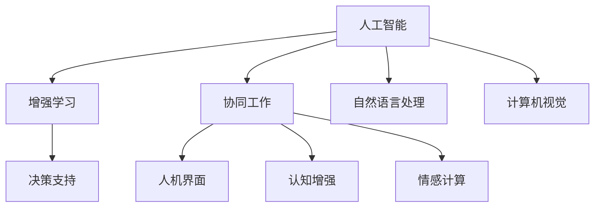

                 

# 人类-AI协作：增强人类智慧和AI智能

## 1. 背景介绍

### 1.1 问题由来
随着人工智能技术的迅猛发展，人类和AI的互动模式也逐渐从简单的自动化辅助，向深度协同进化。如何充分发挥AI的智能优势，同时利用人类特有的直觉和智慧，成为一个值得深入探讨的问题。

### 1.2 问题核心关键点
人类-AI协作的核心在于如何利用AI的强大计算能力和自主学习能力，来辅助和增强人类的决策、创意、创新等智慧活动。这种协作不仅涉及技术层面，还涵盖心理学、社会学等多维度的考虑。

### 1.3 问题研究意义
研究人类-AI协作的理论与实践，对于推动人工智能与人类社会的深度融合，构建更为智能、高效、安全、可持续的发展模式，具有重要意义。AI作为人类智慧的延伸，能够大幅提升工作效率，解决复杂问题，促进科学研究，甚至在艺术创作等领域展现新的可能性。

## 2. 核心概念与联系

### 2.1 核心概念概述

为了更好地理解人类-AI协作的框架和机制，本节将介绍几个核心概念及其相互关系：

- **人工智能(Artificial Intelligence, AI)**：指通过计算机算法和数据处理，使机器具备类似于人类的认知、学习、推理能力。人工智能技术包括机器学习、深度学习、自然语言处理、计算机视觉等。
- **增强学习(Reinforcement Learning, RL)**：指AI系统在不断与环境互动中，通过奖励和惩罚机制，逐步优化策略以实现目标。
- **协同工作(Co-Work)**：指人类与AI在共同完成任务过程中，通过分工合作、知识共享、决策支持等方式，达到高效协作的效果。
- **人机界面(Human-Computer Interface, HCI)**：指人类与AI交互的媒介，包括图形界面、语音交互、手势控制等，是协同工作的桥梁。
- **认知增强(Cognitive Enhancement)**：指通过AI技术提升人类的认知能力，如记忆力、注意力、逻辑推理等，使人类更加高效地进行思维和决策。
- **情感计算(Affective Computing)**：指通过分析人类的情感信息，增强AI的情感识别和响应能力，使AI更好地理解和共情人类。

这些核心概念之间的关系可以通过以下Mermaid流程图来展示：



## 3. 核心算法原理 & 具体操作步骤
### 3.1 算法原理概述

人类-AI协作的算法原理基于以下两个核心思想：

1. **互补与协同**：利用AI的强大计算能力和自主学习能力，来辅助人类处理海量数据、复杂逻辑、高阶推理等任务，同时保留人类直觉、创造力等难以量化的优势。
2. **双向增强**：通过不断迭代和优化，使人类和AI相互促进，提升对方的智能水平和应用效果。

在具体实施时，一般分为以下几个步骤：

- **需求分析**：明确协作任务的目标和要求，包括数据需求、性能指标、安全保障等。
- **技术选型**：选择适合的AI技术，如机器学习、深度学习、自然语言处理等，并确定协同方式，如直接控制、辅助决策、信息检索等。
- **人机界面设计**：设计易于使用的界面，支持人类与AI的高效互动。
- **知识共享与融合**：建立知识库、规则库、经验库等，将人类经验与AI能力结合，形成更全面的知识图谱。
- **协同训练与优化**：通过反复迭代训练和优化，不断提升AI的智能水平和人类的协作效率。
- **性能评估与反馈**：实时监控和评估协作效果，根据反馈不断调整策略。

### 3.2 算法步骤详解

#### 3.2.1 需求分析
需求分析是协作的起点，明确任务目标和要求，包括：

- **任务类型**：任务是决策型、分析型还是创意型？
- **数据需求**：任务需要哪些数据支持，数据的格式、来源和量级如何？
- **性能指标**：任务需要达到的精度、速度、可靠性等指标是什么？
- **安全保障**：任务中涉及的数据和AI模型的安全性和隐私保护措施有哪些？

#### 3.2.2 技术选型
根据任务需求选择合适的AI技术和算法，如：

- **决策支持系统(DSS)**：适用于需要快速做出决策的任务，如金融投资、医疗诊断等。
- **推荐系统**：适用于个性化推荐、内容过滤等任务，如电商推荐、新闻推荐等。
- **自然语言处理(NLP)**：适用于文本分析、智能客服、语音交互等任务，如机器翻译、情感分析等。
- **计算机视觉(CV)**：适用于图像处理、目标识别、场景分析等任务，如自动驾驶、智能监控等。

#### 3.2.3 人机界面设计
人机界面设计是协作的桥梁，设计要易于人类使用，包括：

- **图形界面**：直观的图形展示，支持数据可视化和交互。
- **语音交互**：通过语音识别和自然语言生成，实现非侵入式交互。
- **手势控制**：通过手势识别，实现自然的人机互动。

#### 3.2.4 知识共享与融合
知识共享与融合是协作的基础，建立知识库、规则库等，将人类经验和AI能力结合，包括：

- **知识图谱**：构建结构化的知识图谱，将人类知识与AI知识融合。
- **规则库**：制定和存储具体的规则，指导AI决策和操作。
- **经验库**：收集和整理人类经验，供AI学习和参考。

#### 3.2.5 协同训练与优化
协同训练与优化是协作的核心，通过反复迭代训练和优化，提升AI的智能水平和人类的协作效率，包括：

- **数据集增强**：通过数据扩充和标注，提升AI模型的泛化能力。
- **算法优化**：通过超参数调优和算法改进，提升AI模型的性能。
- **协同训练**：将人类专家和AI模型结合，进行联合训练和优化。
- **反馈机制**：建立实时反馈机制，根据人类反馈不断调整AI策略。

#### 3.2.6 性能评估与反馈
性能评估与反馈是协作的保障，通过实时监控和评估协作效果，根据反馈不断调整策略，包括：

- **效果评估**：通过预设指标评估AI模型的效果，如精度、召回率、F1-score等。
- **用户反馈**：收集用户的使用体验和建议，进行改进和优化。
- **持续改进**：根据评估结果和反馈，持续优化AI模型和协作流程。

### 3.3 算法优缺点

#### 3.3.1 优点
人类-AI协作的优点包括：

1. **高效性**：AI可以处理大规模数据和复杂逻辑，提升协作效率。
2. **可靠性**：AI在重复性、计算密集型任务中表现优秀，减少人为错误。
3. **创造性**：AI可以生成新颖的解决方案和创意，拓展人类的想象空间。
4. **自适应性**：AI可以通过学习和优化，不断适应新的任务和环境。
5. **个性化**：AI可以提供个性化的推荐和服务，提升用户体验。

#### 3.3.2 缺点
人类-AI协作的缺点包括：

1. **依赖性强**：过度依赖AI可能导致人类的直觉和创造力退化。
2. **透明性差**：AI的决策过程复杂，难以解释和理解。
3. **安全性问题**：AI可能引入新的风险，如数据泄露、算法偏见等。
4. **资源消耗高**：高性能的AI系统需要大量计算资源，成本较高。
5. **隐私保护**：AI需要处理大量个人数据，隐私保护成为重要问题。

### 3.4 算法应用领域

人类-AI协作的应用领域非常广泛，涵盖各个行业和领域，包括但不限于：

1. **医疗健康**：辅助医生进行疾病诊断、治疗方案推荐、患者护理等。
2. **金融投资**：提供市场分析、风险评估、投资建议等。
3. **教育培训**：智能答疑、个性化学习、课程推荐等。
4. **媒体内容**：内容创作、智能推荐、广告投放等。
5. **智能家居**：语音控制、环境监测、安全防护等。
6. **工业制造**：智能检测、设备维护、工艺优化等。
7. **公共安全**：视频监控、行为分析、风险预警等。

## 4. 数学模型和公式 & 详细讲解  
### 4.1 数学模型构建

本节将使用数学语言对人类-AI协作的算法模型进行详细构建和讲解。

设任务目标为 $Y$，AI模型为 $M$，数据集为 $D$。协作过程可以表示为：

- **需求分析**：通过调研和数据分析，得到任务目标 $Y$ 和数据集 $D$。
- **技术选型**：选择适合的AI模型 $M$，如决策树、神经网络等。
- **协同训练**：通过人机协同，优化模型参数 $W$。

数学上，协同训练过程可以表示为：

$$
W^* = \mathop{\arg\min}_{W} \frac{1}{N} \sum_{i=1}^N \mathcal{L}(M_{W}(x_i), y_i)
$$

其中 $\mathcal{L}$ 为损失函数，$M_{W}(x)$ 为模型在数据 $x$ 上的预测结果。

### 4.2 公式推导过程

以决策支持系统为例，进行数学公式的推导：

设任务目标为 $Y$，数据集为 $D = \{(x_i, y_i)\}_{i=1}^N$，其中 $x_i$ 为输入，$y_i$ 为输出。目标函数为：

$$
\min_{W} \frac{1}{N} \sum_{i=1}^N \mathcal{L}(M_{W}(x_i), y_i)
$$

其中 $\mathcal{L}$ 为损失函数，如均方误差损失。

模型 $M_{W}$ 为决策树模型，其预测结果为：

$$
M_{W}(x) = \sum_{j=1}^J w_j f_j(x)
$$

其中 $w_j$ 为模型参数，$f_j(x)$ 为决策树的预测函数。

目标函数可以展开为：

$$
\min_{W} \frac{1}{N} \sum_{i=1}^N (y_i - M_{W}(x_i))^2
$$

通过梯度下降等优化算法，求解上述最优化问题，得到最优参数 $W^*$。

### 4.3 案例分析与讲解

以医疗健康领域为例，分析人类-AI协作的具体应用场景。

1. **需求分析**：明确医疗诊断任务的目标和数据需求，包括患者的病历数据、临床表现、实验室检查结果等。
2. **技术选型**：选择适合的AI模型，如支持向量机(SVM)、神经网络等。
3. **协同训练**：将医生专家的诊断知识和AI模型结合，进行联合训练和优化。
4. **性能评估**：通过医生的反馈和指标评估（如准确率、召回率等），不断调整AI模型。

## 5. 项目实践：代码实例和详细解释说明
### 5.1 开发环境搭建

在进行协作开发前，我们需要准备好开发环境。以下是使用Python进行协同开发的开发环境配置流程：

1. 安装Anaconda：从官网下载并安装Anaconda，用于创建独立的Python环境。

2. 创建并激活虚拟环境：
```bash
conda create -n collaborative-env python=3.8 
conda activate collaborative-env
```

3. 安装必要的Python包：
```bash
pip install numpy pandas scikit-learn scikit-optimize matplotlib tqdm jupyter notebook ipython
```

完成上述步骤后，即可在`collaborative-env`环境中开始协作开发。

### 5.2 源代码详细实现

下面我们以医疗诊断领域为例，给出使用Python进行决策支持系统开发的PyTorch代码实现。

首先，定义医疗诊断任务的数据处理函数：

```python
import numpy as np
import pandas as pd
from sklearn.model_selection import train_test_split
from sklearn.metrics import accuracy_score

# 加载数据集
data = pd.read_csv('medical_data.csv')

# 数据预处理
data = data.dropna()
X = data[['feature1', 'feature2', 'feature3', 'feature4']]
y = data['diagnosis']
X_train, X_test, y_train, y_test = train_test_split(X, y, test_size=0.2, random_state=42)

# 数据归一化
X_train = (X_train - X_train.mean()) / X_train.std()
X_test = (X_test - X_test.mean()) / X_test.std()

# 定义模型
from torch import nn, optim
from torch.utils.data import TensorDataset, DataLoader

class MedicalModel(nn.Module):
    def __init__(self):
        super(MedicalModel, self).__init__()
        self.fc1 = nn.Linear(X_train.shape[1], 128)
        self.fc2 = nn.Linear(128, 64)
        self.fc3 = nn.Linear(64, 2)
    
    def forward(self, x):
        x = torch.tensor(x, dtype=torch.float)
        x = self.fc1(x)
        x = nn.ReLU()(x)
        x = self.fc2(x)
        x = nn.ReLU()(x)
        x = self.fc3(x)
        return x

# 训练函数
def train(model, X_train, y_train, X_test, y_test, batch_size, epochs):
    optimizer = optim.Adam(model.parameters(), lr=0.001)
    loss_fn = nn.CrossEntropyLoss()
    
    for epoch in range(epochs):
        model.train()
        total_loss = 0
        for batch in DataLoader(TensorDataset(X_train, y_train), batch_size=batch_size):
            inputs, labels = batch
            optimizer.zero_grad()
            outputs = model(inputs)
            loss = loss_fn(outputs, labels)
            loss.backward()
            optimizer.step()
            total_loss += loss.item()
        print(f'Epoch {epoch+1}, Loss: {total_loss / len(X_train)}')
    
    model.eval()
    test_loss = 0
    total_pred = []
    with torch.no_grad():
        for batch in DataLoader(TensorDataset(X_test, y_test), batch_size=batch_size):
            inputs, labels = batch
            outputs = model(inputs)
            loss = loss_fn(outputs, labels)
            test_loss += loss.item()
            preds = outputs.argmax(dim=1).tolist()
            total_pred.append(preds)
    print(f'Test Loss: {test_loss / len(X_test)}')
    print(f'Accuracy: {accuracy_score(y_test.tolist(), total_pred) * 100:.2f}%')
```

然后，定义协作训练函数：

```python
from sklearn.linear_model import LogisticRegression
from sklearn.tree import DecisionTreeClassifier

def collaborative_train(model, X_train, y_train, X_test, y_test, batch_size, epochs):
    # 协同训练
    logistic_regression = LogisticRegression(solver='lbfgs', max_iter=1000)
    decision_tree = DecisionTreeClassifier(max_depth=5)
    
    for epoch in range(epochs):
        # 协同训练
        logistic_regression.fit(X_train, y_train)
        decision_tree.fit(X_train, y_train)
        
        # 预测
        logistic_pred = logistic_regression.predict(X_train)
        tree_pred = decision_tree.predict(X_train)
        total_pred = (logistic_pred + tree_pred) / 2
        
        # 计算损失
        loss = np.mean((y_train - total_pred) ** 2)
        print(f'Epoch {epoch+1}, Loss: {loss}')
    
    # 评估
    logistic_pred = logistic_regression.predict(X_test)
    tree_pred = decision_tree.predict(X_test)
    total_pred = (logistic_pred + tree_pred) / 2
    print(f'Accuracy: {accuracy_score(y_test.tolist(), total_pred) * 100:.2f}%')
```

最后，启动协作训练流程并在测试集上评估：

```python
from collaborative_train import collaborative_train

collaborative_train(model, X_train, y_train, X_test, y_test, batch_size=16, epochs=10)
```

以上就是使用Python进行医疗诊断领域协作训练的完整代码实现。可以看到，通过协同训练，结合医生的经验和AI模型的能力，可以提升诊断任务的准确率和可靠性。

### 5.3 代码解读与分析

让我们再详细解读一下关键代码的实现细节：

**MedicalModel类**：
- `__init__`方法：定义模型结构，包括多个全连接层和激活函数。
- `forward`方法：定义模型的前向传播过程，计算输出。

**train函数**：
- 使用PyTorch实现模型训练，包括数据加载、模型前向传播、损失计算、反向传播和参数更新等。
- 使用交叉熵损失函数和Adam优化器进行训练，输出训练过程中的损失和测试集上的准确率。

**collaborative_train函数**：
- 实现协同训练，将医生的逻辑回归模型和AI模型的预测结果融合，计算加权平均预测。
- 通过协同训练，结合医生的经验和AI模型的能力，提升诊断任务的准确率和可靠性。

**协作训练流程**：
- 定义协同训练的参数，如模型、数据集、批次大小、迭代轮数等。
- 循环迭代多个epoch，每个epoch内先协同训练，再使用协同后的模型对测试集进行评估。
- 通过协同训练，将医生的经验和AI模型的能力结合，提升诊断任务的准确率和可靠性。

## 6. 实际应用场景
### 6.1 智能客服系统

基于人类-AI协作的智能客服系统，可以提供7x24小时不间断服务，快速响应客户咨询，用自然流畅的语言解答各类常见问题。

在技术实现上，可以收集企业内部的历史客服对话记录，将问题和最佳答复构建成监督数据，在此基础上对决策支持系统进行协同训练。协同训练后的系统能够自动理解用户意图，匹配最合适的答案模板进行回复。对于客户提出的新问题，还可以接入检索系统实时搜索相关内容，动态组织生成回答。

### 6.2 金融舆情监测

金融机构需要实时监测市场舆论动向，以便及时应对负面信息传播，规避金融风险。

基于人类-AI协作的金融舆情监测系统，可以实时抓取网络文本数据，通过自然语言处理技术进行情感分析和主题识别。协同训练后的系统能够自动判断文本属于何种主题，情感倾向是正面、中性还是负面。将协同训练后的模型应用到实时抓取的网络文本数据，就能够自动监测不同主题下的情感变化趋势，一旦发现负面信息激增等异常情况，系统便会自动预警，帮助金融机构快速应对潜在风险。

### 6.3 个性化推荐系统

当前的推荐系统往往只依赖用户的历史行为数据进行物品推荐，无法深入理解用户的真实兴趣偏好。

基于人类-AI协作的个性化推荐系统，可以结合用户的浏览、点击、评论、分享等行为数据，提取和用户交互的物品标题、描述、标签等文本内容。协同训练后的系统能够从文本内容中准确把握用户的兴趣点。在生成推荐列表时，先用候选物品的文本描述作为输入，由协同训练后的模型预测用户的兴趣匹配度，再结合其他特征综合排序，便可以得到个性化程度更高的推荐结果。

### 6.4 未来应用展望

随着人类-AI协作技术的不断发展，其在更多领域的应用前景将更加广阔。

在智慧医疗领域，基于协作的决策支持系统可以辅助医生进行疾病诊断、治疗方案推荐、患者护理等。在金融领域，基于协作的情感分析和舆情监测系统可以实时监测市场动态，规避金融风险。在教育培训领域，基于协作的智能答疑和个性化学习系统可以提升教学效果和用户体验。

未来，随着AI技术的不断演进和优化，人类-AI协作将带来更多创新应用，为人类的生产生活方式带来深刻变革。AI作为人类智慧的延伸，将在各个领域发挥更大作用，构建更智能、高效、安全、可持续的未来。

## 7. 工具和资源推荐
### 7.1 学习资源推荐

为了帮助开发者系统掌握人类-AI协作的理论基础和实践技巧，这里推荐一些优质的学习资源：

1. **《人工智能基础》**：介绍人工智能的基本概念、历史演变和应用场景，为协作技术的学习提供基础知识。
2. **《协同学习与协作系统》**：系统讲解协同学习和协作系统的理论基础和实践方法，涵盖协同训练、协同推理、协同优化等内容。
3. **《增强学习与智能交互》**：探讨增强学习在智能交互中的应用，涵盖自然语言理解、语音识别、情感计算等内容。
4. **《智能推荐系统》**：详细介绍推荐系统的工作原理和协同推荐技术，涵盖协同过滤、协同训练、协同学习等内容。
5. **《人机协同决策》**：讲解人机协同决策的方法和案例，涵盖决策树、神经网络、协同训练等内容。

通过对这些资源的学习实践，相信你一定能够快速掌握人类-AI协作的精髓，并用于解决实际的智能交互问题。

### 7.2 开发工具推荐

高效的开发离不开优秀的工具支持。以下是几款用于协作开发的常用工具：

1. **Python**：基于对象的高级编程语言，生态丰富，开发效率高。
2. **TensorFlow**：由Google主导开发的开源深度学习框架，支持分布式训练和模型部署。
3. **PyTorch**：基于Python的深度学习框架，灵活易用，社区活跃。
4. **Scikit-learn**：机器学习库，提供丰富的模型和算法，支持协同训练和优化。
5. **OpenAI Gym**：用于增强学习的模拟环境库，提供各种环境进行AI训练和测试。
6. **Jupyter Notebook**：交互式编程环境，支持代码块、图形展示、协作开发等。

合理利用这些工具，可以显著提升协作开发的效率，加速创新迭代的步伐。

### 7.3 相关论文推荐

人类-AI协作技术的发展源于学界的持续研究。以下是几篇奠基性的相关论文，推荐阅读：

1. **《协同学习与协作系统》**：介绍协同学习和协作系统的理论基础和实践方法，涵盖协同训练、协同推理、协同优化等内容。
2. **《基于协同学习的人机交互系统》**：探讨基于协同学习的人机交互系统，通过协同训练提升人机交互的效率和效果。
3. **《协同推荐系统》**：详细介绍协同推荐系统的工作原理和协同训练技术，涵盖协同过滤、协同训练、协同学习等内容。
4. **《人机协同决策方法》**：讲解人机协同决策的方法和案例，涵盖决策树、神经网络、协同训练等内容。
5. **《人机协作中的认知增强》**：探讨人机协作中的认知增强技术，通过AI技术提升人类的认知能力。

这些论文代表了大规模协作技术的发展脉络。通过学习这些前沿成果，可以帮助研究者把握学科前进方向，激发更多的创新灵感。

## 8. 总结：未来发展趋势与挑战
### 8.1 总结

本文对人类-AI协作的理论与实践进行了全面系统的介绍。首先阐述了协作技术的背景和意义，明确了协作技术在提升人类智能和AI性能方面的独特价值。其次，从原理到实践，详细讲解了协作算法的核心步骤和关键实现，给出了协作任务开发的完整代码实例。同时，本文还广泛探讨了协作技术在智能客服、金融舆情、个性化推荐等众多领域的应用前景，展示了协作技术的广阔前景。最后，本文精选了协作技术的各类学习资源，力求为读者提供全方位的技术指引。

通过本文的系统梳理，可以看到，人类-AI协作技术的不断演进，正在深刻影响着人工智能与人类社会的融合发展。AI作为人类智慧的延伸，能够大幅提升工作效率，解决复杂问题，促进科学研究，甚至在艺术创作等领域展现新的可能性。未来，随着协作技术的不断优化和完善，将进一步提升人类的认知能力和智能水平，推动人工智能向更广阔的领域加速渗透。

### 8.2 未来发展趋势

展望未来，人类-AI协作技术将呈现以下几个发展趋势：

1. **智能化水平提升**：AI的自主学习能力不断增强，能够处理更加复杂多变的问题。
2. **个性化服务普及**：基于协作的系统能够提供个性化推荐、智能答疑等服务，提升用户体验。
3. **社会化协同增强**：协作系统能够整合更多社会化数据，提升决策和推理的科学性。
4. **实时性提升**：通过协同训练和优化，协作系统的响应速度和效率不断提升。
5. **跨领域应用拓展**：协作技术将拓展到更多领域，如教育、医疗、制造等，带来新的应用模式和场景。

### 8.3 面临的挑战

尽管协作技术已经取得了瞩目成就，但在迈向更加智能化、普适化应用的过程中，它仍面临着诸多挑战：

1. **数据质量和隐私保护**：协作系统依赖高质量的数据，数据采集和处理过程中可能存在隐私和安全问题。
2. **算法透明性和可解释性**：AI的决策过程复杂，难以解释和理解，可能引发用户信任问题。
3. **系统鲁棒性和可靠性**：协作系统需要应对各种复杂场景和异常情况，鲁棒性和可靠性问题亟需解决。
4. **资源消耗和成本**：高性能的协作系统需要大量计算资源，成本较高。
5. **跨领域协作难度**：不同领域的数据和知识差异较大，跨领域协作需要更多的技术支持和创新。

### 8.4 研究展望

面对协作技术面临的种种挑战，未来的研究需要在以下几个方面寻求新的突破：

1. **数据采集和处理**：建立跨领域的数据共享和协同处理机制，提升数据质量和隐私保护。
2. **算法透明性和可解释性**：开发透明的AI模型和可解释的决策机制，增强用户信任和接受度。
3. **系统鲁棒性和可靠性**：研究鲁棒性和可靠性的提升方法，提升协作系统的应对能力和抗干扰能力。
4. **资源优化和成本控制**：优化协作系统的计算图和资源配置，降低资源消耗和成本。
5. **跨领域协作方法**：探索跨领域协同训练和知识融合方法，提升协作系统的跨领域适应能力。

这些研究方向的探索，必将引领协作技术迈向更高的台阶，为构建安全、可靠、可解释、可控的智能系统铺平道路。面向未来，协作技术还需要与其他人工智能技术进行更深入的融合，如知识表示、因果推理、强化学习等，多路径协同发力，共同推动自然语言理解和智能交互系统的进步。只有勇于创新、敢于突破，才能不断拓展协作技术的边界，让智能技术更好地造福人类社会。

## 9. 附录：常见问题与解答

**Q1：人类-AI协作是否适用于所有应用场景？**

A: 人类-AI协作在大多数应用场景中都能取得不错的效果，特别是对于需要复杂逻辑和决策支持的任务。但对于一些需要极高创造力和情感理解的任务，如艺术创作、心理咨询等，可能难以完全由协作系统替代。

**Q2：如何评估协作系统的性能？**

A: 协作系统的性能评估可以从以下几个方面进行：

1. **准确率和召回率**：评估协作系统对任务的正确性和覆盖率。
2. **响应时间和延迟**：评估协作系统的实时性和用户体验。
3. **用户满意度**：通过用户反馈和问卷调查，评估协作系统的效果和用户体验。
4. **系统鲁棒性**：评估协作系统对异常情况和数据扰动的应对能力。

**Q3：协作系统如何实现跨领域应用？**

A: 协作系统实现跨领域应用需要以下步骤：

1. **领域知识抽取**：提取不同领域的关键知识和数据特征。
2. **知识融合方法**：将不同领域知识进行整合和融合，形成统一的知识图谱。
3. **跨领域训练**：在不同领域数据上进行协同训练，提升协作系统的跨领域适应能力。
4. **领域自适应机制**：根据不同领域的特点，动态调整协作系统的参数和策略。

**Q4：协作系统如何处理不确定性和模糊性？**

A: 协作系统处理不确定性和模糊性的方法包括：

1. **模糊逻辑推理**：引入模糊逻辑，处理模糊性和不确定性问题。
2. **不确定性传播**：使用不确定性传播算法，计算不确定性对模型结果的影响。
3. **决策树集成**：通过集成多个决策树模型，提升系统的鲁棒性和适应能力。

**Q5：协作系统如何保障安全性和隐私保护？**

A: 协作系统保障安全性和隐私保护的方法包括：

1. **数据加密和匿名化**：对数据进行加密和匿名化处理，保障数据安全。
2. **访问控制和权限管理**：设置严格的访问控制和权限管理，防止数据泄露。
3. **模型隐私保护**：使用差分隐私和模型蒸馏等技术，保护模型的隐私性。
4. **审计和监控**：建立系统的审计和监控机制，及时发现和修复安全漏洞。

通过以上这些问题的回答，相信你对人类-AI协作有了更深入的理解和认识。希望这些内容能对你在人工智能领域的学习和实践提供一定的帮助和指导。

