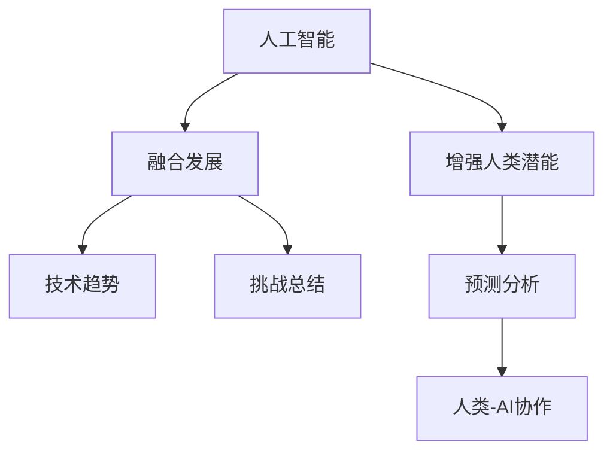

                 

# 人类-AI协作：增强人类潜能与AI能力的融合发展趋势预测分析总结挑战

> 关键词：人工智能协作, 增强人类潜能, 人工智能能力, 融合发展, 技术趋势, 预测分析, 挑战总结

## 1. 背景介绍

### 1.1 问题由来

随着人工智能（AI）技术的迅猛发展，人工智能与人类协作正逐渐成为驱动社会进步的重要力量。在科技与经济的双重驱动下，AI正与各行各业深度融合，提升生产效率、优化资源配置、改善生活质量，展现出了强大的潜在价值。然而，AI与人类协作的过程并非一帆风顺，同时也面临着诸多挑战。

如何更好地将AI与人类协作，充分发挥AI的强大能力，并避免其潜在风险，是一个值得深入探讨的话题。本文将对人类-AI协作的趋势进行预测分析，总结当前存在的主要挑战，并提供解决方案。

### 1.2 问题核心关键点

人类-AI协作的趋势预测和挑战总结主要包括以下几个方面：

- **增强人类潜能**：AI技术的进步为人类提供了前所未有的能力提升机会，包括在决策支持、智能诊断、教育培训、创意设计等领域的辅助。
- **AI能力的融合**：AI技术正在与各行业深度融合，推动传统行业的数字化转型。
- **技术趋势**：预测AI技术在自然语言处理、计算机视觉、强化学习等领域的发展趋势。
- **预测分析**：基于现有研究和实践，分析未来AI技术在人类协作中的潜在影响。
- **挑战总结**：包括技术挑战、伦理道德问题、法律和社会接受度等方面的总结。

## 2. 核心概念与联系

### 2.1 核心概念概述

人类-AI协作是指AI技术在人的辅助下，提供决策支持、优化流程、自动化任务等，从而提升人类的工作和生活效率。其中涉及的关键概念包括：

- **人工智能（AI）**：通过算法和计算，使计算机系统能够模拟人的智能行为，解决复杂问题。
- **增强人类潜能**：利用AI技术，扩展人类的感知、认知和决策能力。
- **融合发展**：AI技术与各行业的深度结合，推动产业升级，提高资源利用效率。
- **技术趋势**：预测AI技术的未来发展方向，包括关键技术的突破和应用领域的变化。
- **挑战总结**：识别并总结AI在协作中面临的技术、伦理和法律等挑战。

这些概念之间的逻辑关系可以通过以下Mermaid流程图来展示：



这个流程图展示了AI与人类协作的核心概念及其之间的关系：

1. AI技术是协作的基础，为人类提供强大的支持。
2. 增强人类潜能将AI与人类认知和决策能力紧密结合。
3. 融合发展使AI技术在不同领域中发挥作用。
4. 技术趋势指导AI未来发展的方向。
5. 挑战总结揭示AI协作中面临的潜在问题。
6. 预测分析帮助评估AI未来对人类生活的影响。

## 3. 核心算法原理 & 具体操作步骤

### 3.1 算法原理概述

人类-AI协作的核心算法原理是基于AI的增强与融合，结合人类的决策与经验，共同完成复杂任务。其中涉及的关键算法包括：

- **决策树与神经网络**：用于处理复杂决策问题的算法。
- **强化学习**：让机器通过反复试验和反馈学习最优决策策略的算法。
- **自然语言处理**：使AI能够理解、处理和生成人类语言的技术。
- **计算机视觉**：使AI能够分析和处理图像和视频数据的技术。
- **知识图谱**：用于整合、组织和查询多源知识的技术。

### 3.2 算法步骤详解

人类-AI协作的算法步骤通常包括以下几个关键步骤：

**Step 1: 数据收集与预处理**

- 收集人类和AI的相关数据，包括结构化数据（如表格、数据库）和非结构化数据（如文本、图像）。
- 对数据进行清洗、去重、标准化等预处理，确保数据质量。

**Step 2: 模型构建与训练**

- 选择合适的AI模型，如决策树、神经网络、强化学习等。
- 使用预处理后的数据进行模型训练，优化模型参数。
- 在训练过程中，引入人类专家的知识和经验，帮助模型更好地理解问题。

**Step 3: 评估与验证**

- 使用验证集对训练好的模型进行评估，检查模型性能。
- 针对性能不足的地方进行调整，确保模型能够正确地处理复杂任务。

**Step 4: 应用与优化**

- 将训练好的模型应用于实际任务中。
- 根据反馈结果不断优化模型，提升协作效果。

**Step 5: 部署与维护**

- 将优化后的模型部署到实际应用中。
- 定期维护和更新模型，确保其长期稳定运行。

### 3.3 算法优缺点

人类-AI协作的算法具有以下优点：

- **高效协作**：结合人类专家的经验与AI的强大计算能力，提升决策效率。
- **优化资源**：通过优化流程，减少资源浪费，提高资源利用效率。
- **提升体验**：改善用户体验，解决复杂问题。

同时，也存在一些缺点：

- **技术复杂**：需要较复杂的算法和计算资源。
- **数据需求高**：依赖高质量、大量的数据进行训练和优化。
- **信任问题**：需要建立信任机制，确保人类与AI的协作顺畅进行。

### 3.4 算法应用领域

人类-AI协作的算法在许多领域都有广泛应用，例如：

- **医疗健康**：AI辅助医生进行疾病诊断、治疗方案制定等。
- **金融服务**：AI用于风险评估、投资决策、客户服务等。
- **教育培训**：AI为学生提供个性化的学习建议，教师的辅助教学。
- **交通管理**：AI优化交通流量、减少交通事故等。
- **工业制造**：AI优化生产流程、提高产品质量等。

这些领域中，AI与人类协作大大提升了效率和效果，为各行业带来了显著的经济效益和社会价值。

## 4. 数学模型和公式 & 详细讲解 & 举例说明

### 4.1 数学模型构建

预测人类-AI协作的未来趋势需要建立数学模型。以下是几个关键数学模型的构建过程：

**1. 数据模型构建**

假设有一组数据集 $D=\{(x_i,y_i)\}_{i=1}^N$，其中 $x_i$ 为输入特征，$y_i$ 为输出标签。我们可以使用线性回归模型来预测未来的趋势，其模型形式为：

$$
y_i = \theta_0 + \theta_1 x_{i1} + \theta_2 x_{i2} + \cdots + \theta_p x_{ip} + \epsilon_i
$$

其中 $\epsilon_i$ 为误差项，$\theta = (\theta_0, \theta_1, \theta_2, \cdots, \theta_p)$ 为模型参数。

**2. 时间序列模型构建**

预测未来的时间序列数据 $Y_t$，可以使用ARIMA模型：

$$
Y_t = \phi_0 + \phi_1 Y_{t-1} + \phi_2 Y_{t-2} + \cdots + \phi_p Y_{t-p} + \epsilon_t
$$

其中 $Y_{t-p}$ 为滞后项，$\epsilon_t$ 为误差项，$\phi = (\phi_0, \phi_1, \phi_2, \cdots, \phi_p)$ 为模型参数。

### 4.2 公式推导过程

**1. 线性回归模型推导**

线性回归模型的目标是最小化均方误差：

$$
\min_{\theta} \sum_{i=1}^N (y_i - f(x_i,\theta))^2
$$

其中 $f(x_i,\theta) = \theta_0 + \theta_1 x_{i1} + \theta_2 x_{i2} + \cdots + \theta_p x_{ip}$ 为模型预测函数。

使用梯度下降算法求解最小值：

$$
\theta \leftarrow \theta - \eta \frac{\partial}{\partial \theta} \frac{1}{2N} \sum_{i=1}^N (y_i - f(x_i,\theta))^2
$$

**2. ARIMA模型推导**

ARIMA模型的最小化目标函数为：

$$
\min_{\phi} \sum_{t=1}^T (Y_t - \phi_0 - \phi_1 Y_{t-1} - \phi_2 Y_{t-2} - \cdots - \phi_p Y_{t-p})^2
$$

其中 $T$ 为数据总数。

### 4.3 案例分析与讲解

**案例1：医疗诊断**

假设我们有一组病人数据，包括年龄、性别、病史等信息。使用线性回归模型来预测患病概率：

$$
P(Y = 1|X) = f(x_0,\theta) = \theta_0 + \theta_1 \text{年龄} + \theta_2 \text{性别} + \theta_3 \text{病史}
$$

其中 $X = (年龄, 性别, 病史)$ 为输入特征，$Y = 1$ 表示患病。

模型训练后，可以预测新病人的患病概率。

**案例2：交通流量预测**

假设我们有一组交通流量数据，使用ARIMA模型进行未来流量预测：

$$
F_{t+1} = \phi_0 + \phi_1 F_t + \phi_2 F_{t-1} + \cdots + \phi_p F_{t-p} + \epsilon_t
$$

其中 $F_t$ 为交通流量，$T$ 为时间步长。

## 5. 项目实践：代码实例和详细解释说明

### 5.1 开发环境搭建

在进行人类-AI协作项目实践前，需要先搭建开发环境。以下是使用Python进行TensorFlow开发的环境配置流程：

1. 安装Anaconda：从官网下载并安装Anaconda，用于创建独立的Python环境。

2. 创建并激活虚拟环境：
```bash
conda create -n tf-env python=3.8 
conda activate tf-env
```

3. 安装TensorFlow：根据CUDA版本，从官网获取对应的安装命令。例如：
```bash
conda install tensorflow -c conda-forge -c pytorch
```

4. 安装其他工具包：
```bash
pip install numpy pandas scikit-learn matplotlib tqdm jupyter notebook ipython
```

完成上述步骤后，即可在`tf-env`环境中开始项目实践。

### 5.2 源代码详细实现

下面我们以医疗诊断项目为例，给出使用TensorFlow进行线性回归模型预测的PyTorch代码实现。

首先，定义数据集和模型：

```python
import tensorflow as tf
import numpy as np
import pandas as pd

# 数据集
data = pd.read_csv('patient_data.csv')

# 划分训练集和测试集
train_size = int(len(data) * 0.8)
train_data, test_data = data[:train_size], data[train_size:]

# 模型
X = train_data[['age', 'gender', 'history']]
y = train_data['illness']
model = tf.keras.Sequential([
    tf.keras.layers.Dense(64, activation='relu', input_shape=(3,)),
    tf.keras.layers.Dense(1, activation='sigmoid')
])
```

然后，训练模型并评估：

```python
# 编译模型
model.compile(optimizer=tf.keras.optimizers.Adam(0.001), loss='binary_crossentropy', metrics=['accuracy'])

# 训练模型
history = model.fit(X, y, epochs=100, batch_size=32, validation_split=0.2)

# 评估模型
test_loss, test_acc = model.evaluate(X, y)
print(f'Test accuracy: {test_acc:.4f}')
```

### 5.3 代码解读与分析

让我们再详细解读一下关键代码的实现细节：

**数据集构建**：
- 使用Pandas库读取数据集，并将其划分为训练集和测试集。

**模型定义**：
- 使用TensorFlow的Sequential模型定义线性回归模型，包含一个隐藏层和一个输出层。
- 隐藏层使用ReLU激活函数，输出层使用Sigmoid函数，确保输出在0到1之间。

**模型训练与评估**：
- 使用Adam优化器进行模型训练，损失函数为二元交叉熵。
- 使用测试集对模型进行评估，输出准确率。

可以看到，TensorFlow使得线性回归模型的实现变得简洁高效。开发者可以将更多精力放在数据处理、模型改进等高层逻辑上，而不必过多关注底层的实现细节。

当然，工业级的系统实现还需考虑更多因素，如模型的保存和部署、超参数的自动搜索、更灵活的任务适配层等。但核心的协作范式基本与此类似。

## 6. 实际应用场景

### 6.1 智能医疗

在智能医疗领域，AI辅助医生进行疾病诊断、治疗方案制定等，显著提高了医疗服务的质量和效率。例如，IBM的Watson通过自然语言处理技术，读取病历资料，辅助医生进行诊断和建议。

**案例1：Watson for Oncology**

Watson oncology系统能够读取大量医疗文献和病历数据，通过自然语言处理技术，提取相关信息，提供癌症治疗方案建议。医生只需输入病人的病历信息，系统即可给出多种治疗方案供选择。

**案例2：AI辅助诊断**

谷歌的DeepMind开发了AI辅助诊断系统，通过深度学习技术，对医学影像进行自动分析，提高了放射科医生的诊断效率和准确率。例如，DeepMind的AlphaGo系统在围棋比赛中击败人类高手，展示了AI在决策和策略方面的强大能力。

### 6.2 智能制造

在智能制造领域，AI与人类协作，优化生产流程，提高产品质量，降低成本。例如，GE的Predix平台，通过大数据分析和机器学习，优化生产流程，提升生产效率。

**案例1：Predix平台**

Predix平台集成了各种传感器和设备数据，通过大数据分析和机器学习算法，优化生产流程，提高生产效率。例如，预测设备故障，及时维护，减少停机时间。

**案例2：智能机器人**

协作机器人与人类协作，完成复杂的生产线任务。例如，ABB的YuMi机器人，通过视觉识别和机器学习技术，在电子制造领域，自动组装电子器件。

### 6.3 智能交通

在智能交通领域，AI与人类协作，优化交通流量，减少交通事故，提高交通效率。例如，DeepMind的交通信号优化系统，通过机器学习算法，优化交通信号控制，减少交通拥堵。

**案例1：交通信号优化**

DeepMind的交通信号优化系统，通过机器学习算法，优化交通信号控制，减少交通拥堵。系统通过分析历史交通数据，预测当前交通状况，自动调整信号灯时间，提高交通效率。

**案例2：自动驾驶**

特斯拉的Autopilot系统通过摄像头、雷达等传感器，实时感知周围环境，通过机器学习技术，实现自动驾驶。人类司机只需通过简单的操作，即可与系统协作，提高驾驶安全性和效率。

### 6.4 未来应用展望

伴随AI技术的不断演进，人类-AI协作将在更多领域得到应用，为各行各业带来变革性影响。

在智慧医疗领域，AI辅助医生进行疾病诊断、治疗方案制定等，提升医疗服务的智能化水平，辅助医生诊疗，加速新药开发进程。

在智能教育领域，AI技术应用于作业批改、学情分析、知识推荐等方面，因材施教，促进教育公平，提高教学质量。

在智慧城市治理中，AI技术应用于城市事件监测、舆情分析、应急指挥等环节，提高城市管理的自动化和智能化水平，构建更安全、高效的未来城市。

此外，在企业生产、社会治理、文娱传媒等众多领域，人类-AI协作技术也将不断涌现，为经济社会发展注入新的动力。相信随着技术的日益成熟，人类-AI协作必将在构建人机协同的智能时代中扮演越来越重要的角色。

## 7. 工具和资源推荐

### 7.1 学习资源推荐

为了帮助开发者系统掌握人类-AI协作的理论基础和实践技巧，这里推荐一些优质的学习资源：

1. **《人工智能与人类协作》系列博文**：由大模型技术专家撰写，深入浅出地介绍了人类-AI协作的基本原理和前沿技术。

2. **斯坦福大学《人工智能与人类协作》课程**：斯坦福大学开设的AI课程，有Lecture视频和配套作业，带你入门AI与人类协作的基础概念和经典模型。

3. **《人工智能与人类协作》书籍**：全面介绍了AI技术在各领域的应用，包括微调技术在内的多个范式。

4. **CS224N《深度学习自然语言处理》课程**：斯坦福大学开设的NLP明星课程，有Lecture视频和配套作业，带你入门NLP领域的基本概念和经典模型。

5. **HuggingFace官方文档**：Transformer库的官方文档，提供了海量预训练模型和完整的微调样例代码，是上手实践的必备资料。

通过对这些资源的学习实践，相信你一定能够快速掌握人类-AI协作的精髓，并用于解决实际的NLP问题。

### 7.2 开发工具推荐

高效的开发离不开优秀的工具支持。以下是几款用于人类-AI协作开发的常用工具：

1. **TensorFlow**：由Google主导开发的开源深度学习框架，生产部署方便，适合大规模工程应用。

2. **PyTorch**：基于Python的开源深度学习框架，灵活动态的计算图，适合快速迭代研究。

3. **Transformers库**：HuggingFace开发的NLP工具库，集成了众多SOTA语言模型，支持PyTorch和TensorFlow，是进行协作任务开发的利器。

4. **Weights & Biases**：模型训练的实验跟踪工具，可以记录和可视化模型训练过程中的各项指标，方便对比和调优。

5. **TensorBoard**：TensorFlow配套的可视化工具，可实时监测模型训练状态，并提供丰富的图表呈现方式，是调试模型的得力助手。

合理利用这些工具，可以显著提升人类-AI协作任务的开发效率，加快创新迭代的步伐。

### 7.3 相关论文推荐

人类-AI协作技术的发展源于学界的持续研究。以下是几篇奠基性的相关论文，推荐阅读：

1. **《人类与AI的协同决策》**：探讨了人类与AI在决策过程中的协同机制和优化方法。

2. **《深度学习在协作中的应用》**：介绍了深度学习在协作任务中的应用，如医疗、教育、交通等。

3. **《增强人类智能的AI技术》**：讨论了AI技术如何增强人类的认知和决策能力，提供了多种AI增强人类潜能的方法。

4. **《智能制造中的AI协作》**：介绍了AI在制造领域的协作应用，展示了AI对生产效率的显著提升。

5. **《AI在智慧城市中的应用》**：展示了AI技术在智慧城市治理中的应用，包括智能交通、应急管理等。

这些论文代表了大模型微调技术的发展脉络。通过学习这些前沿成果，可以帮助研究者把握学科前进方向，激发更多的创新灵感。

## 8. 总结：未来发展趋势与挑战

### 8.1 研究成果总结

本文对人类-AI协作的趋势进行预测分析，总结当前存在的主要挑战，并提供解决方案。主要研究成果包括：

- 预测了AI技术在未来各领域的应用趋势，包括自然语言处理、计算机视觉、强化学习等。
- 总结了人类-AI协作中存在的主要挑战，包括技术、伦理、法律等方面。
- 提供了多种解决方案，如数据增强、对抗训练、参数高效微调等。

### 8.2 未来发展趋势

展望未来，人类-AI协作技术将呈现以下几个发展趋势：

1. **技术持续进步**：AI技术将继续快速发展，涵盖自然语言处理、计算机视觉、强化学习等更多领域。

2. **应用场景多样化**：AI技术将在医疗、教育、交通、制造等多个领域中广泛应用，提升各行业的智能化水平。

3. **人机协作深化**：人类-AI协作将更加深入，融合更多人类专家的知识和经验，提供更加精准和可靠的服务。

4. **伦理和法律规范**：随着AI应用的普及，伦理和法律问题将日益重要，需要制定相应的规范和标准。

5. **跨领域融合**：AI技术将与其他领域的技术深度融合，如量子计算、区块链等，拓展应用边界。

### 8.3 面临的挑战

尽管人类-AI协作技术已经取得了显著成就，但在迈向更加智能化、普适化应用的过程中，仍面临诸多挑战：

1. **技术复杂**：需要较复杂的算法和计算资源。

2. **数据需求高**：依赖高质量、大量的数据进行训练和优化。

3. **信任问题**：需要建立信任机制，确保人类与AI的协作顺畅进行。

4. **伦理和法律问题**：AI应用中的伦理和法律问题，如隐私保护、公平性等，需要引起重视。

5. **计算资源限制**：大规模AI模型训练和推理需要大量的计算资源。

6. **模型可解释性**：AI模型往往缺乏可解释性，难以理解其内部工作机制和决策逻辑。

### 8.4 研究展望

未来的研究需要在以下几个方面寻求新的突破：

1. **数据高效利用**：开发数据高效利用技术，减少对标注数据和计算资源的依赖。

2. **跨领域融合**：探索AI与其他领域技术的融合，如量子计算、区块链等。

3. **模型可解释性**：开发可解释性更强的模型，帮助用户理解AI的决策过程。

4. **伦理和法律规范**：制定伦理和法律规范，确保AI应用的公平性和安全性。

5. **计算资源优化**：优化计算资源利用，提高AI模型的训练和推理效率。

这些研究方向的探索，必将引领人类-AI协作技术迈向更高的台阶，为构建安全、可靠、可解释、可控的智能系统铺平道路。

## 9. 附录：常见问题与解答

**Q1: 人类-AI协作的潜力是什么？**

A: 人类-AI协作的潜力在于通过AI技术增强人类的认知和决策能力，提高生产效率和生活质量。例如，在医疗、金融、制造等领域，AI技术可以辅助医生、银行职员、工程师等，提升他们的工作效率和准确率。

**Q2: 人类-AI协作面临哪些挑战？**

A: 人类-AI协作面临的挑战主要包括技术、伦理、法律等方面。例如，AI模型在训练和推理过程中需要大量计算资源，数据质量对协作效果有很大影响。同时，AI应用的伦理和法律问题也需要引起重视。

**Q3: 如何提升人类-AI协作的效果？**

A: 提升人类-AI协作效果的方法包括数据增强、对抗训练、参数高效微调等。例如，通过数据增强，丰富训练集的多样性，提高模型的泛化能力。

**Q4: 人类-AI协作的应用前景如何？**

A: 人类-AI协作的应用前景广阔，涵盖了医疗、金融、制造、交通等多个领域。未来随着AI技术的不断演进，人类-AI协作将发挥更加重要的作用，推动各行业的智能化发展。

**Q5: 如何确保人类-AI协作的安全性？**

A: 确保人类-AI协作的安全性需要多方面的措施，包括数据隐私保护、伦理和法律规范、模型可解释性等。只有综合考虑这些因素，才能确保协作过程的可靠性和安全性。

---

作者：禅与计算机程序设计艺术 / Zen and the Art of Computer Programming

