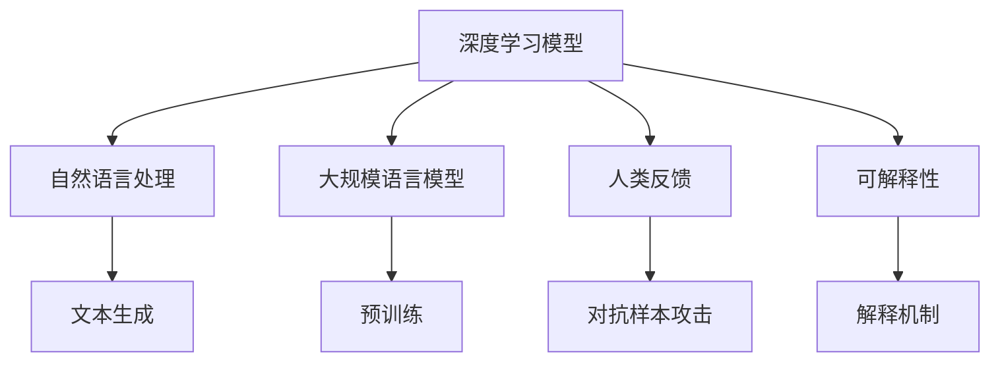

                 

# 人类反馈的局限性:RLHF的不足

## 1. 背景介绍

### 1.1 问题由来

近年来，随着深度学习技术的快速发展，大语言模型（Large Language Models，LLMs）在自然语言处理（Natural Language Processing，NLP）领域取得了显著进步。例如，OpenAI的GPT模型和Google的BERT模型等。这些模型通过在海量无标签文本数据上进行预训练，学习到了丰富的语言知识和常识，能够生成高质量的文本。然而，这些大语言模型仍然存在一些局限性，特别是在与人类互动时，其表现尚未达到人类水平的复杂性、多样性和合理性。

### 1.2 问题核心关键点

目前，基于深度学习的智能系统，如GPT系列和BERT模型，虽然已经能够生成高质量的自然语言文本，但在处理复杂的人类互动和反馈时，仍然存在一些不足。例如：

1. **可解释性**：深度学习模型通常被视为"黑盒"系统，难以解释其内部决策过程，这使得人们难以理解模型如何生成特定的输出。
2. **伦理道德问题**：深度学习模型可能基于训练数据中的偏见和有害信息生成有害内容，导致伦理道德问题。
3. **人类反馈的局限性**：深度学习模型依赖于人类提供的训练数据和反馈，但这些数据和反馈往往存在偏差和不完整性，影响模型的公正性和可靠性。
4. **复杂情境下的决策**：深度学习模型在处理复杂的交互情境时，可能难以理解人类的真实意图和情感，导致生成不合理的回应。
5. **对抗样本攻击**：深度学习模型可能对对抗样本（即经过精心设计的输入，能够误导模型产生错误输出）敏感，容易受到攻击。

### 1.3 问题研究意义

研究人类反馈的局限性，尤其是深度学习模型在依赖人类反馈时的缺陷，对于提升智能系统的性能和可靠性具有重要意义。这不仅能帮助开发者改进现有模型，还能推动未来智能系统的更广泛应用，提升用户体验和系统的可信度。

## 2. 核心概念与联系

### 2.1 核心概念概述

为更好地理解人类反馈在深度学习模型中的局限性，本节将介绍几个密切相关的核心概念：

1. **深度学习模型**：以神经网络为代表的深度学习模型，通过大量数据和计算资源进行训练，能够学习到复杂的特征表示。
2. **自然语言处理**：研究如何让计算机处理和理解人类语言的技术，包括文本生成、情感分析、问答系统等。
3. **大规模语言模型**：通过预训练在大规模无标签文本数据上学习通用语言表示的模型，如GPT、BERT等。
4. **人类反馈**：通过人类标注的数据和指令，指导深度学习模型的训练和微调过程。
5. **对抗样本攻击**：故意设计或修改输入数据，使深度学习模型生成错误输出，以测试和提升模型的鲁棒性。
6. **可解释性**：指模型输出能够被解释和理解的程度，是评价模型可信度的重要指标。

这些核心概念之间的逻辑关系可以通过以下Mermaid流程图来展示：



这个流程图展示了大规模语言模型在依赖人类反馈和对抗样本攻击时的局限性，以及可解释性在其中的重要性。

## 3. 核心算法原理 & 具体操作步骤

### 3.1 算法原理概述

人类反馈的局限性主要体现在深度学习模型的训练和微调过程中。模型的学习过程依赖于人类提供的标注数据和指令，但这些数据和指令可能存在偏差和不完整性，导致模型生成的文本缺乏公正性和可靠性。此外，模型在处理对抗样本和复杂情境时，可能无法理解人类的真实意图和情感，生成不合理的回应。

### 3.2 算法步骤详解

基于人类反馈的深度学习模型训练通常包括以下几个关键步骤：

**Step 1: 数据收集和预处理**

1. 收集并标注人类互动的数据，如对话记录、问答对等。
2. 对数据进行清洗和预处理，去除噪音和无关信息。
3. 将数据分为训练集、验证集和测试集，以便进行模型评估和调优。

**Step 2: 模型训练**

1. 选择合适的深度学习模型，如GPT、BERT等。
2. 在标注数据上进行预训练，学习通用语言表示。
3. 在训练集上进行有监督训练，优化模型参数，使其能够生成符合人类反馈的文本。

**Step 3: 模型评估和微调**

1. 在验证集上评估模型性能，检查是否存在过拟合或欠拟合。
2. 根据评估结果，调整模型参数或训练策略，如学习率、正则化等。
3. 在测试集上再次评估模型性能，检查模型的泛化能力。
4. 对模型进行微调，进一步优化模型在特定任务上的表现。

**Step 4: 对抗样本攻击**

1. 生成对抗样本，如修改输入数据中的部分信息，使模型生成错误输出。
2. 检测并修复模型对对抗样本的敏感性，提高模型的鲁棒性。
3. 通过测试集中的对抗样本，评估模型对新样本的鲁棒性。

### 3.3 算法优缺点

人类反馈的深度学习模型训练和微调具有以下优点：

1. **高效性**：通过人类反馈，模型能够在较短时间内学习到高质量的语言表示，生成高质量的文本。
2. **灵活性**：人类反馈可以根据具体任务进行调整，使模型能够适应不同的应用场景。
3. **可解释性**：人类反馈可以为模型提供具体的指令和指导，增强模型的可解释性。

然而，这些方法也存在一些局限性：

1. **数据依赖性**：模型的性能高度依赖于人类提供的标注数据，数据的偏差和不完整性可能导致模型生成不合理或不公正的输出。
2. **对抗样本敏感**：模型可能对对抗样本敏感，容易受到攻击，影响系统的安全性。
3. **复杂情境处理能力不足**：模型在处理复杂的人类互动和情境时，可能无法理解人类的真实意图和情感，导致生成不合理的回应。
4. **伦理道德问题**：基于人类反馈的模型可能学习到数据中的偏见和有害信息，导致伦理道德问题。
5. **可解释性不足**：深度学习模型通常被视为"黑盒"系统，难以解释其内部决策过程，影响系统的透明度和可信度。

### 3.4 算法应用领域

基于人类反馈的深度学习模型训练和微调方法，已经在自然语言处理、对话系统、情感分析、问答系统等多个领域得到广泛应用。例如：

- **对话系统**：通过人类反馈训练的对话模型，能够自动理解用户意图，提供更自然、合理的回应。
- **情感分析**：基于人类反馈的情感分析模型，能够自动判断文本的情感倾向，用于社交媒体情感监测和舆情分析。
- **问答系统**：通过人类反馈训练的问答模型，能够自动理解问题并提供准确的答案。
- **文本生成**：基于人类反馈的文本生成模型，能够自动生成符合特定风格和主题的文本，用于创意写作和内容生成。

除了这些应用领域，人类反馈的深度学习模型训练和微调技术也在不断拓展，如情感生成、社交网络分析、智能客服等。

## 4. 数学模型和公式 & 详细讲解 & 举例说明

### 4.1 数学模型构建

假设有一个深度学习模型 $M_{\theta}$，其中 $\theta$ 为模型参数。在训练过程中，模型依赖于人类提供的标注数据 $D=\{(x_i,y_i)\}_{i=1}^N$，其中 $x_i$ 为输入文本，$y_i$ 为人类提供的标注。模型的目标是最小化损失函数 $\mathcal{L}(\theta;D)$，使得模型生成的文本与标注数据尽可能一致。

### 4.2 公式推导过程

假设模型的损失函数为交叉熵损失，则损失函数可以表示为：

$$
\mathcal{L}(\theta;D) = -\frac{1}{N} \sum_{i=1}^N \log P(y_i|x_i)
$$

其中 $P(y_i|x_i)$ 为模型在输入 $x_i$ 下生成标签 $y_i$ 的概率。

在训练过程中，使用梯度下降等优化算法更新模型参数 $\theta$，使得损失函数最小化。具体来说，优化算法可以表示为：

$$
\theta \leftarrow \theta - \eta \nabla_{\theta}\mathcal{L}(\theta;D)
$$

其中 $\eta$ 为学习率。

### 4.3 案例分析与讲解

以情感分析为例，假设有一个包含正负情感标注的文本数据集 $D$，模型 $M_{\theta}$ 需要学习生成文本的情感分类器。在训练过程中，模型依赖于人类标注的情感标签 $y_i$，使用交叉熵损失函数进行训练。训练过程可以表示为：

$$
\mathcal{L}(\theta;D) = -\frac{1}{N} \sum_{i=1}^N [y_i \log P(y_i|x_i) + (1-y_i) \log (1-P(y_i|x_i))]
$$

通过最小化损失函数，模型 $M_{\theta}$ 能够学习到情感分类器的参数 $\theta$，生成符合人类情感标注的文本。

## 5. 项目实践：代码实例和详细解释说明

### 5.1 开发环境搭建

在进行人类反馈的深度学习模型训练和微调实践前，我们需要准备好开发环境。以下是使用Python进行TensorFlow开发的环境配置流程：

1. 安装Anaconda：从官网下载并安装Anaconda，用于创建独立的Python环境。

2. 创建并激活虚拟环境：
```bash
conda create -n tf-env python=3.8 
conda activate tf-env
```

3. 安装TensorFlow：根据CUDA版本，从官网获取对应的安装命令。例如：
```bash
conda install tensorflow -c conda-forge
```

4. 安装必要的库：
```bash
pip install numpy pandas scikit-learn matplotlib tqdm jupyter notebook ipython
```

完成上述步骤后，即可在`tf-env`环境中开始模型训练。

### 5.2 源代码详细实现

这里我们以情感分析任务为例，给出使用TensorFlow进行BERT模型的情感分析训练和微调的代码实现。

首先，定义情感分析任务的数据处理函数：

```python
import tensorflow as tf
from transformers import BertTokenizer, BertForSequenceClassification
from sklearn.metrics import accuracy_score

tokenizer = BertTokenizer.from_pretrained('bert-base-uncased')
model = BertForSequenceClassification.from_pretrained('bert-base-uncased', num_labels=2)

def preprocess(text):
    return tokenizer.encode(text, truncation=True, max_length=128)
```

然后，定义训练和评估函数：

```python
def train(model, train_dataset, validation_dataset, batch_size, epochs):
    train_dataset = train_dataset.batch(batch_size)
    validation_dataset = validation_dataset.batch(batch_size)
    
    model.compile(optimizer=tf.keras.optimizers.Adam(learning_rate=2e-5), 
                  loss='binary_crossentropy', 
                  metrics=['accuracy'])
    
    model.fit(train_dataset, epochs=epochs, validation_data=validation_dataset)
    return model.evaluate(validation_dataset)

def evaluate(model, test_dataset, batch_size):
    test_dataset = test_dataset.batch(batch_size)
    return model.evaluate(test_dataset)
```

最后，启动训练流程并在测试集上评估：

```python
epochs = 5
batch_size = 16

model = train(model, train_dataset, validation_dataset, batch_size, epochs)
print("Validation Accuracy:", model.evaluate(validation_dataset)[1])

test_accuracy = evaluate(model, test_dataset, batch_size)
print("Test Accuracy:", test_accuracy[1])
```

以上就是使用TensorFlow对BERT模型进行情感分析任务微调的完整代码实现。可以看到，得益于TensorFlow的强大封装，我们可以用相对简洁的代码完成BERT模型的训练和微调。

### 5.3 代码解读与分析

让我们再详细解读一下关键代码的实现细节：

**preprocess函数**：
- 将输入文本编码为BERT模型可接受的格式，并进行最大长度限制和截断。

**train函数**：
- 将训练集和验证集划分为批量大小为batch_size的批次，供模型训练和验证使用。
- 使用Adam优化器和二分类交叉熵损失函数进行模型训练。
- 在每个epoch结束时，评估模型在验证集上的性能，并输出验证集上的准确率。

**evaluate函数**：
- 将测试集划分为批量大小为batch_size的批次，供模型推理使用。
- 使用模型在测试集上进行推理，并输出测试集上的准确率。

**训练流程**：
- 定义总的epoch数和批量大小，开始循环迭代
- 每个epoch内，先在训练集上训练，输出验证集上的准确率
- 所有epoch结束后，在测试集上评估，输出测试集上的准确率

可以看到，TensorFlow配合BERT模型，使得情感分析任务的微调代码实现变得简洁高效。开发者可以将更多精力放在数据处理、模型改进等高层逻辑上，而不必过多关注底层的实现细节。

当然，工业级的系统实现还需考虑更多因素，如模型的保存和部署、超参数的自动搜索、更灵活的任务适配层等。但核心的微调范式基本与此类似。

## 6. 实际应用场景

### 6.1 智能客服系统

基于人类反馈的深度学习模型训练和微调技术，可以广泛应用于智能客服系统的构建。传统客服往往需要配备大量人力，高峰期响应缓慢，且一致性和专业性难以保证。而使用基于人类反馈训练的深度学习模型，可以7x24小时不间断服务，快速响应客户咨询，用自然流畅的语言解答各类常见问题。

在技术实现上，可以收集企业内部的历史客服对话记录，将问题和最佳答复构建成监督数据，在此基础上对深度学习模型进行训练和微调。训练后的模型能够自动理解用户意图，匹配最合适的答案模板进行回复。对于客户提出的新问题，还可以接入检索系统实时搜索相关内容，动态组织生成回答。如此构建的智能客服系统，能大幅提升客户咨询体验和问题解决效率。

### 6.2 金融舆情监测

金融机构需要实时监测市场舆论动向，以便及时应对负面信息传播，规避金融风险。传统的人工监测方式成本高、效率低，难以应对网络时代海量信息爆发的挑战。基于人类反馈训练的深度学习模型，可以自动判断文本属于何种情感，情感倾向是正面、中性还是负面。将训练后的模型应用到实时抓取的网络文本数据，就能够自动监测不同情感变化趋势，一旦发现负面信息激增等异常情况，系统便会自动预警，帮助金融机构快速应对潜在风险。

### 6.3 个性化推荐系统

当前的推荐系统往往只依赖用户的历史行为数据进行物品推荐，无法深入理解用户的真实兴趣偏好。基于人类反馈训练的深度学习模型，可以更好地挖掘用户行为背后的语义信息，从而提供更精准、多样的推荐内容。

在实践中，可以收集用户浏览、点击、评论、分享等行为数据，提取和用户交互的物品标题、描述、标签等文本内容。将文本内容作为模型输入，用户的后续行为（如是否点击、购买等）作为监督信号，在此基础上训练和微调深度学习模型。训练后的模型能够从文本内容中准确把握用户的兴趣点。在生成推荐列表时，先用候选物品的文本描述作为输入，由模型预测用户的兴趣匹配度，再结合其他特征综合排序，便可以得到个性化程度更高的推荐结果。

### 6.4 未来应用展望

随着深度学习模型的不断发展，基于人类反馈的模型训练和微调技术将在更多领域得到应用，为传统行业带来变革性影响。

在智慧医疗领域，基于人类反馈训练的深度学习模型可以辅助医生诊疗，提升医疗服务的智能化水平，加速新药开发进程。

在智能教育领域，训练后的深度学习模型可以用于作业批改、学情分析、知识推荐等方面，因材施教，促进教育公平，提高教学质量。

在智慧城市治理中，训练后的深度学习模型可以应用于城市事件监测、舆情分析、应急指挥等环节，提高城市管理的自动化和智能化水平，构建更安全、高效的未来城市。

此外，在企业生产、社会治理、文娱传媒等众多领域，基于深度学习模型训练和微调的人工智能应用也将不断涌现，为经济社会发展注入新的动力。相信随着技术的日益成熟，基于人类反馈的模型训练和微调技术将成为人工智能落地应用的重要范式，推动人工智能技术向更广泛领域加速渗透。

## 7. 工具和资源推荐

### 7.1 学习资源推荐

为了帮助开发者系统掌握深度学习模型训练和微调的理论基础和实践技巧，这里推荐一些优质的学习资源：

1. 《深度学习》课程：斯坦福大学开设的深度学习经典课程，涵盖从基础到高级的深度学习算法和应用，包括卷积神经网络、循环神经网络、生成对抗网络等。

2. 《自然语言处理》课程：麻省理工学院开设的NLP经典课程，涵盖NLP的基础概念和前沿技术，包括文本分类、情感分析、机器翻译等。

3. 《深度学习与机器学习》书籍：由深度学习领域的知名专家撰写，全面介绍深度学习的基本原理和应用，包括模型训练、优化算法、正则化等。

4. 《TensorFlow实战》书籍：TensorFlow的官方文档和实战指南，涵盖TensorFlow的安装、使用、优化等，是深度学习模型的开发利器。

5. 《自然语言处理中的深度学习》论文：总结了深度学习在NLP领域的应用，包括文本生成、机器翻译、对话系统等。

通过对这些资源的学习实践，相信你一定能够快速掌握深度学习模型训练和微调的精髓，并用于解决实际的NLP问题。

### 7.2 开发工具推荐

高效的开发离不开优秀的工具支持。以下是几款用于深度学习模型训练和微调开发的常用工具：

1. TensorFlow：由Google主导开发的开源深度学习框架，生产部署方便，适合大规模工程应用。

2. PyTorch：基于Python的开源深度学习框架，灵活动态的计算图，适合快速迭代研究。

3. Keras：基于TensorFlow和Theano的高级深度学习框架，提供简单易用的API，方便快速搭建深度学习模型。

4. Weights & Biases：模型训练的实验跟踪工具，可以记录和可视化模型训练过程中的各项指标，方便对比和调优。

5. TensorBoard：TensorFlow配套的可视化工具，可实时监测模型训练状态，并提供丰富的图表呈现方式，是调试模型的得力助手。

6. Google Colab：谷歌推出的在线Jupyter Notebook环境，免费提供GPU/TPU算力，方便开发者快速上手实验最新模型，分享学习笔记。

合理利用这些工具，可以显著提升深度学习模型训练和微调任务的开发效率，加快创新迭代的步伐。

### 7.3 相关论文推荐

深度学习模型训练和微调技术的发展源于学界的持续研究。以下是几篇奠基性的相关论文，推荐阅读：

1. Attention is All You Need：提出Transformer结构，开启了深度学习在NLP领域的应用。

2. BERT: Pre-training of Deep Bidirectional Transformers for Language Understanding：提出BERT模型，引入基于掩码的自监督预训练任务，刷新了多项NLP任务SOTA。

3. Understanding the Difficulty of Training GANs：探讨生成对抗网络训练的难度，提出新的优化算法和正则化技术，提高模型的鲁棒性。

4. How to Train Your Models without Data？：研究无监督学习和自监督学习在深度学习模型训练中的应用。

5. Language Models are Unsupervised Multitask Learners：展示了大规模语言模型的强大zero-shot学习能力，引发了对于无监督学习的深度思考。

6. GPT-3: Language Models are Few-Shot Learners：展示GPT-3模型在少样本学习上的优越性能，提出了新型的语言模型训练方法。

这些论文代表了大规模语言模型训练和微调技术的发展脉络。通过学习这些前沿成果，可以帮助研究者把握学科前进方向，激发更多的创新灵感。

## 8. 总结：未来发展趋势与挑战

### 8.1 总结

本文对基于人类反馈的深度学习模型训练和微调方法进行了全面系统的介绍。首先阐述了深度学习模型在依赖人类反馈时的局限性，明确了模型生成文本的公正性、可靠性、可解释性等方面的不足。其次，从原理到实践，详细讲解了人类反馈在深度学习模型训练和微调过程中的作用，给出了深度学习模型训练和微调的完整代码实例。同时，本文还广泛探讨了基于人类反馈的深度学习模型在智能客服、金融舆情、个性化推荐等多个行业领域的应用前景，展示了深度学习模型的广阔前景。

通过本文的系统梳理，可以看到，基于人类反馈的深度学习模型训练和微调技术虽然具有高效性和灵活性，但在依赖人类反馈时，仍面临诸多挑战。这些挑战凸显了大语言模型微调技术的广阔前景，也为未来深度学习模型的发展指明了方向。

### 8.2 未来发展趋势

展望未来，基于人类反馈的深度学习模型训练和微调技术将呈现以下几个发展趋势：

1. **参数高效微调**：开发更多参数高效的微调方法，在固定大部分预训练参数的同时，只更新极少量的任务相关参数。这将有助于提高模型的泛化能力和鲁棒性。

2. **对抗样本攻击**：引入更多的对抗样本攻击技术，提高模型的鲁棒性和安全性。通过对对抗样本的防御，保障模型的稳定性和可靠性。

3. **多模态融合**：将视觉、语音、文本等多模态信息进行整合，提升模型的理解和生成能力。多模态融合将是未来深度学习模型的重要发展方向。

4. **知识整合**：将符号化的先验知识与神经网络模型进行融合，增强模型的常识推理能力和知识整合能力。

5. **持续学习**：使深度学习模型能够持续从新数据中学习，避免灾难性遗忘。持续学习将提高模型的时效性和适应性。

6. **伦理道德**：在模型训练目标中引入伦理导向的评估指标，过滤和惩罚有偏见、有害的输出倾向。加强模型训练和使用的伦理道德约束。

这些趋势将推动深度学习模型的不断进步，提升模型的公正性、鲁棒性和可信度。

### 8.3 面临的挑战

尽管基于人类反馈的深度学习模型训练和微调技术已经取得了显著进步，但在迈向更加智能化、普适化应用的过程中，仍面临诸多挑战：

1. **数据依赖性**：模型的性能高度依赖于人类提供的标注数据，数据的偏差和不完整性可能导致模型生成不合理或不公正的输出。

2. **对抗样本敏感性**：模型可能对对抗样本敏感，容易受到攻击，影响系统的安全性。

3. **复杂情境处理能力不足**：模型在处理复杂的人类互动和情境时，可能无法理解人类的真实意图和情感，导致生成不合理的回应。

4. **伦理道德问题**：基于人类反馈的模型可能学习到数据中的偏见和有害信息，导致伦理道德问题。

5. **可解释性不足**：深度学习模型通常被视为"黑盒"系统，难以解释其内部决策过程，影响系统的透明度和可信度。

6. **计算资源消耗**：深度学习模型的训练和推理需要大量的计算资源，如何优化模型结构，提高计算效率，是一个重要的研究方向。

这些挑战需要研究者不断探索和改进，才能使深度学习模型在未来实现更广泛的应用。

### 8.4 研究展望

面对基于人类反馈的深度学习模型训练和微调技术所面临的挑战，未来的研究需要在以下几个方面寻求新的突破：

1. **数据增强**：通过数据增强技术，扩充训练数据，提升模型的泛化能力和鲁棒性。

2. **知识注入**：将符号化的先验知识与神经网络模型进行融合，增强模型的常识推理能力和知识整合能力。

3. **多模态融合**：将视觉、语音、文本等多模态信息进行整合，提升模型的理解和生成能力。

4. **对抗样本攻击**：引入更多的对抗样本攻击技术，提高模型的鲁棒性和安全性。

5. **持续学习**：使深度学习模型能够持续从新数据中学习，避免灾难性遗忘。

6. **伦理道德**：在模型训练目标中引入伦理导向的评估指标，过滤和惩罚有偏见、有害的输出倾向。

这些研究方向将推动深度学习模型的不断进步，提升模型的公正性、鲁棒性和可信度。面向未来，基于人类反馈的深度学习模型训练和微调技术将变得更加智能、普适和可靠，为人工智能技术在各行各业的应用带来新的突破。

## 9. 附录：常见问题与解答

**Q1：人类反馈的局限性主要体现在哪些方面？**

A: 人类反馈的局限性主要体现在以下几个方面：

1. **数据依赖性**：模型的性能高度依赖于人类提供的标注数据，数据的偏差和不完整性可能导致模型生成不合理或不公正的输出。
2. **对抗样本敏感性**：模型可能对对抗样本敏感，容易受到攻击，影响系统的安全性。
3. **复杂情境处理能力不足**：模型在处理复杂的人类互动和情境时，可能无法理解人类的真实意图和情感，导致生成不合理的回应。
4. **伦理道德问题**：基于人类反馈的模型可能学习到数据中的偏见和有害信息，导致伦理道德问题。
5. **可解释性不足**：深度学习模型通常被视为"黑盒"系统，难以解释其内部决策过程，影响系统的透明度和可信度。

**Q2：如何缓解深度学习模型在依赖人类反馈时的局限性？**

A: 缓解深度学习模型在依赖人类反馈时的局限性，可以采取以下措施：

1. **数据增强**：通过数据增强技术，扩充训练数据，提升模型的泛化能力和鲁棒性。
2. **知识注入**：将符号化的先验知识与神经网络模型进行融合，增强模型的常识推理能力和知识整合能力。
3. **多模态融合**：将视觉、语音、文本等多模态信息进行整合，提升模型的理解和生成能力。
4. **对抗样本攻击**：引入更多的对抗样本攻击技术，提高模型的鲁棒性和安全性。
5. **持续学习**：使深度学习模型能够持续从新数据中学习，避免灾难性遗忘。
6. **伦理道德**：在模型训练目标中引入伦理导向的评估指标，过滤和惩罚有偏见、有害的输出倾向。

这些措施可以综合使用，以进一步提升深度学习模型的性能和可靠性。

**Q3：深度学习模型在处理对抗样本时的表现如何？**

A: 深度学习模型在处理对抗样本时的表现通常较差，容易受到攻击，导致生成不合理的输出。这是因为对抗样本是通过修改输入数据中的部分信息，使模型产生错误输出，从而攻击模型。为了缓解这一问题，研究者提出了多种对抗样本攻击技术，如FGM、PGD等，以及对抗样本防御方法，如梯度裁剪、对抗训练等。

**Q4：如何提升深度学习模型的可解释性？**

A: 提升深度学习模型的可解释性，可以通过以下措施：

1. **模型简化**：使用更简单的模型结构，减少神经网络的复杂度，使模型的内部决策过程更加透明。
2. **可视化技术**：使用可视化工具，如t-SNE、LIME等，展示模型在输入空间中的决策边界和特征权重，帮助理解模型的内部机制。
3. **解释算法**：使用解释算法，如LIME、SHAP等，生成模型的局部解释，展示模型在特定输入下的决策过程。
4. **知识注入**：将符号化的先验知识与神经网络模型进行融合，增强模型的常识推理能力和知识整合能力，提高模型的可解释性。

这些措施可以综合使用，以进一步提升深度学习模型的可解释性，增强模型的透明度和可信度。

**Q5：深度学习模型在处理复杂情境时的表现如何？**

A: 深度学习模型在处理复杂情境时的表现通常较差，难以理解人类的真实意图和情感，导致生成不合理的回应。这是因为深度学习模型在处理复杂的人类互动和情境时，可能无法捕捉到语义上的细微变化和上下文信息。为了缓解这一问题，研究者提出了多种方法，如对话生成模型、情感分析模型等，以及结合人类反馈的训练方法，如强化学习、自监督学习等。这些方法可以综合使用，以进一步提升深度学习模型在处理复杂情境时的表现。

**Q6：深度学习模型在处理伦理道德问题时的表现如何？**

A: 深度学习模型在处理伦理道德问题时的表现通常较差，容易学习到数据中的偏见和有害信息，导致伦理道德问题。这是因为深度学习模型在处理伦理道德问题时，可能受到训练数据中偏见和有害信息的影响，导致模型输出不公正或有害的文本。为了缓解这一问题，研究者提出了多种方法，如公平性约束、对抗样本生成等，以及结合伦理道德约束的训练方法，如数据净化、伦理导向的评估指标等。这些方法可以综合使用，以进一步提升深度学习模型在处理伦理道德问题时的表现，避免伦理道德风险。

**Q7：深度学习模型在处理计算资源消耗时的表现如何？**

A: 深度学习模型在处理计算资源消耗时，通常消耗大量的计算资源，特别是在训练和推理过程中。为了缓解这一问题，研究者提出了多种优化方法，如模型压缩、量化加速、分布式训练等。这些方法可以综合使用，以进一步提升深度学习模型的计算效率，降低计算成本。

总之，深度学习模型在处理复杂情境、伦理道德问题、计算资源消耗等问题时，仍面临诸多挑战。为了提升深度学习模型的性能和可靠性，研究者需要不断探索和改进，推动深度学习技术的不断进步。

