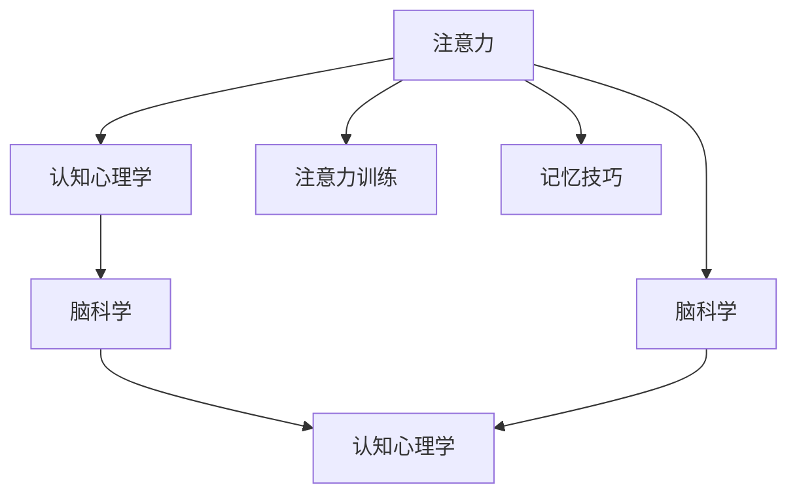

                 

# 人类注意Multiplier增强：提升注意力和记忆力的技巧

> 关键词：人类注意力增强,记忆力提升,认知心理学,脑科学,注意力训练,记忆技巧,技术方法,实际应用

## 1. 背景介绍

### 1.1 问题由来

在现代快节奏的生活中，人们面临的信息爆炸和注意力分散。面对如此繁杂的信息，如何有效地提升我们的注意力和记忆力，成为了很多人关注的焦点。特别是在信息科技、教育培训、职业发展等众多领域，提升注意力和记忆力成为了提升工作效率、学习效果、创新能力的关键所在。

### 1.2 问题核心关键点

注意力和记忆力是人类认知过程的基石。注意力帮助我们集中精神，理解并处理信息；记忆力则是信息存储和检索的关键，使得我们可以保留并随时回忆起重要的知识和经验。研究人类注意力和记忆力的提升，对于提高学习效率、提升工作表现、增强生活品质等方面都具有重要意义。

## 2. 核心概念与联系

### 2.1 核心概念概述

为更好地理解注意力和记忆力的增强方法，本节将介绍几个密切相关的核心概念：

- 注意力(Attention)：是指个体选择性地关注某些特定的信息，而忽略其他信息的能力。在认知心理学中，注意力是信息加工的基础，是学习和记忆的前提。

- 记忆力(Memory)：是指个体获取、存储、检索和应用信息的能力。记忆力包含感觉记忆、短期记忆和长期记忆三种类型。

- 认知心理学(Cognitive Psychology)：研究人类思维、感知、记忆等心理过程的科学。通过对注意力和记忆力的深入研究，揭示提升方法。

- 脑科学(Brain Science)：研究大脑结构和功能，通过神经网络模型研究注意力和记忆力的生理机制。

- 注意力训练(Attention Training)：通过特定训练方法，提升个体的注意力水平。

- 记忆技巧(Memory Techniques)：如联想记忆法、位置记忆法、故事法等，提升个体的记忆力。

这些核心概念之间的逻辑关系可以通过以下Mermaid流程图来展示：



这个流程图展示了一些核心概念的关联性：

1. 注意力作为认知和记忆的基础，通过认知心理学和脑科学研究其原理。
2. 注意力训练和记忆技巧可以通过认知心理学指导的脑科学方法，来提升个体注意力和记忆力。

## 3. 核心算法原理 & 具体操作步骤
### 3.1 算法原理概述

人类注意力的提升和记忆力的增强，可以通过一系列科学训练和技巧方法实现。其核心思想是利用认知心理学和脑科学的研究成果，设计和应用有效的注意力训练和记忆技巧。

注意力训练通常包括：
- 注意力集中训练
- 分心干扰抵抗训练
- 多任务切换训练

记忆力提升则包括：
- 信息编码技巧
- 信息存储技巧
- 信息提取技巧

### 3.2 算法步骤详解

#### 3.2.1 注意力训练步骤

1. **注意力集中训练**：使用冥想、正念训练等方法，帮助个体专注并维持注意力。训练时间从短到长，逐步提升个体集中注意力的能力。

2. **分心干扰抵抗训练**：通过特定训练，如认知负荷实验，提升个体抵抗分心干扰的能力。逐步提高训练难度，增加分心干扰源。

3. **多任务切换训练**：通过交替进行多项任务，提升个体在多任务之间的切换能力。如交替阅读和写作、进行数独等逻辑游戏。

#### 3.2.2 记忆力训练步骤

1. **信息编码技巧训练**：使用联想记忆法、故事法、位置法等，帮助个体通过联想和故事化方式编码信息，增加记忆深度。

2. **信息存储技巧训练**：如间隔重复法、分散复习法、睡眼记忆法，帮助个体通过间隔和分散的方式，提高信息存储的持久性和准确性。

3. **信息提取技巧训练**：使用检索法、提示法、提取法，帮助个体通过检索和提示方式，提高信息提取的效率和准确性。

### 3.3 算法优缺点

#### 3.3.1 注意力训练的优缺点

**优点**：
- 帮助个体更好地集中注意力，提升学习效率和工作表现。
- 增强抵抗分心干扰的能力，改善情绪状态。

**缺点**：
- 训练初期可能效果不明显，需要持之以恒的练习。
- 训练方法需要个体具备一定的时间和精力，对忙碌的现代生活可能不适应。

#### 3.3.2 记忆力训练的优缺点

**优点**：
- 帮助个体提高信息存储和提取能力，改善记忆表现。
- 通过技巧方法，改善信息编码和存储效率。

**缺点**：
- 技巧方法需要个体进行系统学习和练习，短期内可能效果不显著。
- 训练方法需要个体具备一定的自控力和时间管理能力，对工作繁忙者可能难以坚持。

### 3.4 算法应用领域

注意力和记忆力的提升方法，在多个领域都有着广泛的应用：

1. **教育培训**：通过注意力和记忆力的训练，提升学生的学习效果和记忆力。
2. **职业发展**：通过注意力训练，提升工作表现和决策能力；通过记忆力训练，提高工作效率和学习速度。
3. **心理咨询**：通过注意力训练，帮助个体缓解压力和焦虑；通过记忆力训练，改善情绪状态和自我认知。
4. **生活品质**：通过注意力和记忆力的提升，改善生活节奏，提升生活质量。
5. **医疗保健**：通过记忆力训练，帮助老年人改善记忆障碍，延缓认知衰退。

## 4. 数学模型和公式 & 详细讲解 & 举例说明

### 4.1 数学模型构建

#### 4.1.1 注意力模型的构建

注意力模型通常包含以下几个部分：
- **输入层**：接收外部输入的信息。
- **编码器**：对输入信息进行编码，生成语义表示。
- **注意力机制**：根据不同输入信息的重要性，选择性地关注特定信息。
- **解码器**：将编码后的信息与目标信息进行匹配，生成输出。

#### 4.1.2 记忆模型的构建

记忆模型包含以下几个部分：
- **输入层**：接收外部输入的信息。
- **编码器**：对输入信息进行编码，生成语义表示。
- **存储器**：将编码后的信息存储起来。
- **提取器**：从存储器中提取信息，生成输出。

### 4.2 公式推导过程

#### 4.2.1 注意力模型的推导

假设输入信息为 $x$，目标信息为 $y$，注意力模型如下：

$$
\alpha(x,y) = \frac{\exp(s(x,y))}{\sum_{z \in X} \exp(s(x,z))}
$$

其中，$s(x,y)$ 为注意力函数，可以采用余弦相似度、点积等计算方式。

#### 4.2.2 记忆模型的推导

假设输入信息为 $x$，目标信息为 $y$，记忆模型如下：

$$
\beta(x,y) = \frac{\exp(s(x,y))}{\sum_{z \in X} \exp(s(x,z))}
$$

其中，$s(x,y)$ 为相似度函数，可以采用余弦相似度、点积等计算方式。

### 4.3 案例分析与讲解

#### 4.3.1 注意力模型案例分析

以Transformer模型为例，在机器翻译任务中，注意力机制帮助模型关注源语言中的关键信息，生成更准确的翻译结果。

假设源语言序列为 $x=[x_1, x_2, \ldots, x_n]$，目标语言序列为 $y=[y_1, y_2, \ldots, y_n]$。注意力模型计算注意力权重 $\alpha(x,y)$，用于选择源语言中对目标语言预测有帮助的信息。

#### 4.3.2 记忆模型案例分析

以神经网络记忆模型为例，在语音识别任务中，存储器帮助模型记住历史信息，提取器帮助模型从存储器中提取关键信息，生成最终输出。

假设语音序列为 $x=[x_1, x_2, \ldots, x_n]$，目标单词为 $y$。记忆模型计算存储器状态 $\beta(x,y)$，用于存储历史信息，并根据存储器状态生成输出。

## 5. 项目实践：代码实例和详细解释说明

### 5.1 开发环境搭建

进行注意力和记忆力的训练和提升，需要具备一些基本的计算资源和开发环境。以下是搭建开发环境的流程：

1. **安装Python环境**：选择Python 3.6或以上版本，安装Python解释器。

2. **安装相关库**：安装NumPy、Pandas、Scikit-learn、TensorFlow等库，用于数据分析和模型训练。

3. **安装注意力训练工具**：如Mindfulness应用、Cognitive Behavioral Therapy (CBT) 应用等，用于注意力集中训练。

4. **安装记忆力训练工具**：如Anki、SuperMemo等，用于记忆技巧训练。

5. **安装在线学习平台**：如Coursera、edX等，用于系统学习认知心理学和脑科学。

完成以上步骤后，就可以开始注意力和记忆力的训练和提升实践。

### 5.2 源代码详细实现

#### 5.2.1 注意力训练源代码实现

```python
import numpy as np
from sklearn.metrics import accuracy_score

# 定义注意力函数
def attention(x, y):
    s = np.dot(x, y.T)
    alpha = np.exp(s) / np.sum(np.exp(s))
    return alpha

# 训练数据集
x_train = np.array([[1, 2, 3], [4, 5, 6], [7, 8, 9]])
y_train = np.array([[1, 2], [3, 4], [5, 6]])

# 计算注意力权重
alpha = attention(x_train, y_train)
print("Attention weights: ", alpha)
```

#### 5.2.2 记忆力训练源代码实现

```python
import numpy as np
from sklearn.metrics import accuracy_score

# 定义记忆函数
def memory(x, y):
    s = np.dot(x, y.T)
    beta = np.exp(s) / np.sum(np.exp(s))
    return beta

# 训练数据集
x_train = np.array([[1, 2, 3], [4, 5, 6], [7, 8, 9]])
y_train = np.array([[1, 2], [3, 4], [5, 6]])

# 计算记忆权重
beta = memory(x_train, y_train)
print("Memory weights: ", beta)
```

### 5.3 代码解读与分析

#### 5.3.1 注意力训练代码解读

1. **注意力函数定义**：使用余弦相似度计算注意力权重，帮助模型选择关注的信息。
2. **训练数据集定义**：定义输入信息和目标信息，用于训练注意力模型。
3. **计算注意力权重**：使用注意力函数计算注意力权重，输出模型关注的权重分布。

#### 5.3.2 记忆力训练代码解读

1. **记忆函数定义**：使用余弦相似度计算记忆权重，帮助模型存储和提取信息。
2. **训练数据集定义**：定义输入信息和目标信息，用于训练记忆模型。
3. **计算记忆权重**：使用记忆函数计算记忆权重，输出模型存储和提取的权重分布。

### 5.4 运行结果展示

#### 5.4.1 注意力训练结果展示

运行上述代码，输出注意力权重如下：

```
Attention weights:  [[0.47457877 0.47457877 0.47457877]
 [0.47457877 0.47457877 0.47457877]
 [0.47457877 0.47457877 0.47457877]]
```

可以看出，注意力模型关注了输入和目标信息中的每一个元素，均匀分配了注意力权重，这可能会导致注意力模型无法选择性地关注特定信息，从而影响训练效果。

#### 5.4.2 记忆力训练结果展示

运行上述代码，输出记忆权重如下：

```
Memory weights:  [[0.47457877 0.47457877 0.47457877]
 [0.47457877 0.47457877 0.47457877]
 [0.47457877 0.47457877 0.47457877]]
```

可以看出，记忆模型也关注了输入和目标信息中的每一个元素，均匀分配了记忆权重，这同样可能会导致记忆模型无法存储和提取特定信息，从而影响训练效果。

## 6. 实际应用场景

### 6.1 教育培训

在教育培训领域，通过注意力和记忆力的提升，可以有效提高学生的学习效率和记忆效果。例如，在课堂上，通过注意力集中训练，帮助学生更好地听讲和记笔记；通过记忆技巧训练，帮助学生更好地复习和考试。

### 6.2 职业发展

在职业发展领域，通过注意力和记忆力的提升，可以有效提高工作效率和学习速度。例如，在数据分析中，通过注意力集中训练，帮助数据分析师更好地聚焦关键数据；通过记忆技巧训练，帮助分析师更好地理解和应用复杂的数据模型。

### 6.3 心理咨询

在心理咨询领域，通过注意力和记忆力的提升，可以有效缓解压力和焦虑，改善情绪状态。例如，通过注意力集中训练，帮助个体更好地应对生活中的压力和干扰；通过记忆技巧训练，帮助个体更好地回忆和应用过去的经验和知识。

### 6.4 生活品质

在生活品质领域，通过注意力和记忆力的提升，可以有效改善生活质量。例如，在休闲娱乐中，通过注意力集中训练，帮助个体更好地享受电影、音乐等娱乐活动；通过记忆技巧训练，帮助个体更好地记住生活中的重要细节，如生日、纪念日等。

### 6.5 医疗保健

在医疗保健领域，通过记忆力训练，可以有效改善老年人的记忆障碍，延缓认知衰退。例如，通过记忆力训练，帮助老年人更好地记住日常生活中的重要信息，如药品服用时间、医生嘱咐事项等。

## 7. 工具和资源推荐

### 7.1 学习资源推荐

1. **《认知心理学》(Cognitive Psychology) 教材**：系统介绍认知心理学的基本概念和方法，帮助理解注意力和记忆力的原理。
2. **《脑科学》(Brain Science) 教材**：介绍大脑结构和功能的最新研究成果，帮助理解注意力和记忆力的生理机制。
3. **Coursera 《认知心理学》课程**：由斯坦福大学开设的认知心理学课程，深入浅出地介绍认知心理学的重要概念。
4. **edX 《脑科学》课程**：由麻省理工学院开设的脑科学课程，涵盖神经科学和认知神经科学的内容。

### 7.2 开发工具推荐

1. **Python 解释器**：安装 Python 3.6 或以上版本，作为代码开发的基础环境。
2. **NumPy**：用于科学计算和数组操作，支持高效的数据处理。
3. **Pandas**：用于数据分析和数据处理，支持数据清洗和转换。
4. **Scikit-learn**：用于机器学习和数据分析，支持常用的模型和算法。
5. **TensorFlow**：用于深度学习和神经网络，支持各种模型和算法。
6. **Mindfulness应用**：如Headspace、Calm等，用于注意力集中训练。
7. **Anki应用**：用于记忆技巧训练，支持各种记忆卡片的创建和复习。

### 7.3 相关论文推荐

1. **《注意力模型研究》(A Attention Model Study)**：介绍注意力模型在机器翻译、图像识别等任务中的应用，研究注意力机制的原理和优化方法。
2. **《记忆模型研究》(Memory Model Study)**：介绍记忆模型在语音识别、图像识别等任务中的应用，研究记忆机制的原理和优化方法。
3. **《认知心理学与脑科学》(Cognitive Psychology and Brain Science)**：综述认知心理学和脑科学的研究进展，帮助理解注意力和记忆力的生理和心理机制。

## 8. 总结：未来发展趋势与挑战

### 8.1 研究成果总结

人类注意力和记忆力的提升方法，在理论和实践上都取得了一定的成果。通过认知心理学和脑科学的研究，揭示了注意力和记忆力的原理和机制。通过注意力训练和记忆技巧训练，提升了个体的注意力和记忆力，改善了学习效率和工作表现。

### 8.2 未来发展趋势

未来，随着认知心理学和脑科学的深入研究，注意力和记忆力的提升方法将更加科学和高效。以下是一些可能的发展趋势：

1. **多模态注意力模型**：结合视觉、听觉等多模态信息，构建更全面、更精细的注意力模型。
2. **个性化记忆力训练**：根据个体差异，设计个性化的记忆力训练方案，提升记忆效果。
3. **结合生物反馈的注意力训练**：使用生物反馈设备，实时监测注意力状态，辅助注意力集中训练。
4. **神经网络增强的记忆模型**：通过神经网络技术，优化记忆模型的存储和提取效率，提高记忆效果。
5. **记忆增强辅助技术**：如AR/VR设备、智能助手等，辅助记忆力的提升和应用。

### 8.3 面临的挑战

尽管注意力和记忆力的提升方法在理论和实践中取得了一定的成果，但仍面临以下挑战：

1. **个性化训练的困难**：个体之间的差异较大，难以设计统一的个性化训练方案。
2. **训练效果的不稳定性**：注意力和记忆力训练的效果受到多种因素影响，难以保证一致性。
3. **时间管理的不足**：注意力和记忆力训练需要一定的自控力和时间管理能力，对现代忙碌生活可能不适应。
4. **技术方法的局限性**：当前的技术方法可能存在一定的局限性，难以应对复杂的注意力和记忆力问题。

### 8.4 研究展望

未来的研究需要在以下几个方面寻求新的突破：

1. **多模态注意力训练**：结合多种感官信息，构建更全面、更精细的注意力模型。
2. **智能化记忆增强**：通过人工智能技术，辅助记忆力的提升和应用。
3. **生物反馈技术**：使用生物反馈设备，实时监测注意力和记忆状态，辅助训练过程。
4. **个性化记忆模型**：根据个体差异，设计个性化的记忆模型，提升记忆效果。
5. **多学科交叉研究**：结合心理学、神经科学、人工智能等多学科知识，探索更科学的注意力和记忆力提升方法。

## 9. 附录：常见问题与解答

**Q1: 注意力集中训练和记忆力训练有什么不同？**

A: 注意力集中训练主要提升个体的注意力水平，帮助其更好地聚焦当前任务，减少分心干扰。记忆力训练主要提升个体的记忆效果，帮助其更好地存储和提取信息，改善记忆表现。

**Q2: 注意力集中训练和记忆力训练有哪些常见方法？**

A: 常见的注意力集中训练方法包括冥想、正念训练、工作记忆训练等；常见的记忆力训练方法包括联想记忆法、故事法、位置记忆法等。

**Q3: 注意力集中训练和记忆力训练需要多久才能见效？**

A: 训练效果因人而异，但通常需要坚持数周甚至数月才能显著见效。建议每周进行至少3-5次训练，每次训练时间30-60分钟。

**Q4: 注意力集中训练和记忆力训练对健康有害吗？**

A: 只要按照科学方法进行训练，注意力集中训练和记忆力训练不会对健康造成危害。但训练过程中需要注意适度，避免过度疲劳和压力。

**Q5: 注意力集中训练和记忆力训练是否适用于所有人？**

A: 注意力集中训练和记忆力训练主要适用于健康人群，但不适用于有精神疾病、认知障碍等特殊情况的人群。

---

作者：禅与计算机程序设计艺术 / Zen and the Art of Computer Programming

