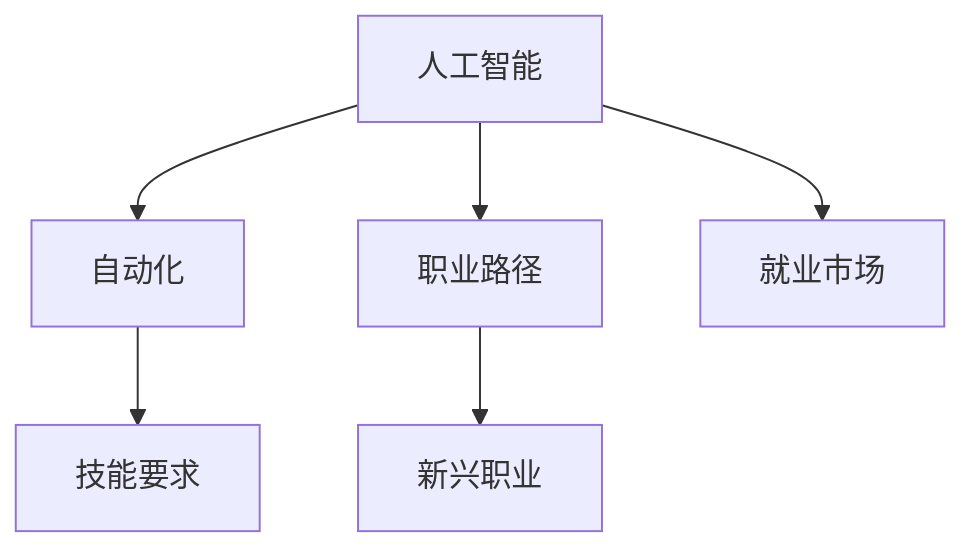

                 

## 1. 背景介绍

### 1.1 问题由来

随着人工智能（AI）技术的迅猛发展，“人类计算”成为了一个重要的话题。AI的发展不仅推动了各行业自动化进程，也对就业市场产生了深远影响。一方面，AI自动化技术替代了大量的重复性工作，提高了工作效率；另一方面，AI的发展也创造了许多新的就业机会。因此，理解和预测AI时代就业市场的变化趋势，对于个人职业规划和企业人才策略具有重要意义。

### 1.2 问题核心关键点

当前，AI技术的快速发展正在重塑全球就业市场结构。这主要体现在以下几个方面：

1. **技能要求的变化**：随着AI技术的应用，对从业人员的技能要求也发生了显著变化，传统手工操作岗位减少，数据分析、编程、算法设计等技术岗位需求上升。
2. **职业路径的转变**：AI技术的应用使得许多职业的路径发生了变化，例如，金融分析师可以利用AI进行数据分析和风险预测，机械工程师可以通过机器学习优化生产流程。
3. **新兴职业的崛起**：AI技术的普及催生了许多新的职业岗位，如数据科学家、AI工程师、机器学习工程师等，为就业市场注入了新的活力。
4. **就业市场的不确定性增加**：AI技术的不确定性和不可预测性增加了就业市场的波动，传统的稳定岗位面临被替代的风险。

### 1.3 问题研究意义

研究AI时代的就业市场变化趋势，对于个人职业发展、企业人力资源策略、政策制定等方面具有重要意义：

1. **个人职业发展**：了解AI时代就业市场的发展方向和趋势，有助于个人进行有针对性的技能提升和职业规划，更好地适应就业市场的需求。
2. **企业人力资源策略**：理解AI时代人才需求的变化，有助于企业优化人力资源结构，合理配置资源，提高企业竞争力。
3. **政策制定**：政府需要根据AI时代的就业市场趋势，制定相关政策和措施，促进就业市场的平稳过渡。

## 2. 核心概念与联系

### 2.1 核心概念概述

为更好地理解AI时代就业市场的变化趋势，本节将介绍几个核心概念及其相互联系：

- **人工智能**：利用计算机系统模拟、扩展人类智能的技术，包括机器学习、深度学习、自然语言处理等。
- **自动化**：通过机器或软件系统代替人工完成重复性、机械化任务的过程。
- **技能要求**：随着AI技术的应用，对从业人员的技能要求发生了变化，从手工操作转向数据分析、编程、算法设计等技术岗位。
- **职业路径**：AI技术的应用改变了许多职业的路径，例如金融分析师、机械工程师等。
- **新兴职业**：AI技术的普及催生了许多新的职业岗位，如数据科学家、AI工程师等。
- **就业市场**：人工智能技术的广泛应用对就业市场产生了深远影响，增加了不确定性和波动性。

这些核心概念之间存在复杂的相互联系和影响。例如，AI技术的自动化能力降低了对简单劳动的需求，同时催生了新的技术岗位；新兴职业的产生也改变了传统的就业市场结构。因此，理解这些概念及其相互关系，有助于全面把握AI时代就业市场的变化趋势。

### 2.2 核心概念原理和架构的 Mermaid 流程图



## 3. 核心算法原理 & 具体操作步骤

### 3.1 算法原理概述

AI时代的就业市场变化趋势预测，主要依赖于对现有数据进行分析和建模。以下将详细介绍基于监督学习的预测算法：

- **数据准备**：收集历史就业市场数据，包括岗位数量、技能需求、岗位变化趋势等。
- **特征工程**：从原始数据中提取有用特征，如技术需求变化、行业变化趋势等。
- **模型训练**：选择适当的模型（如线性回归、随机森林、支持向量机等），使用历史数据进行训练。
- **模型评估**：使用验证集对模型进行评估，调整模型参数以提高预测准确性。
- **预测应用**：使用训练好的模型对未来就业市场进行预测，得到就业市场的变化趋势。

### 3.2 算法步骤详解

#### 3.2.1 数据收集

数据收集是预测就业市场变化趋势的第一步，需要从以下方面收集数据：

- **历史就业数据**：包括岗位数量、岗位类型、技能需求等。
- **技术变化数据**：如新兴技术、技术需求变化等。
- **行业发展数据**：如各行业的增长率、就业人数变化等。
- **教育培训数据**：如培训课程、专业设置等。

#### 3.2.2 特征工程

特征工程是将原始数据转化为模型可以利用的形式的过程。具体步骤如下：

- **数据清洗**：处理缺失值、异常值，确保数据的完整性和一致性。
- **特征提取**：从原始数据中提取有用的特征，如技能需求、技术变化、行业发展等。
- **特征选择**：选择对预测结果影响最大的特征，去除冗余和无用特征。

#### 3.2.3 模型选择与训练

选择合适的模型进行训练，通常包括以下步骤：

- **模型选择**：选择适当的监督学习模型，如线性回归、随机森林、支持向量机等。
- **模型训练**：使用历史数据进行训练，调整模型参数以提高预测准确性。
- **模型评估**：使用验证集对模型进行评估，选择预测效果最好的模型。

#### 3.2.4 模型评估与调整

模型评估是预测过程中非常重要的一步，通常包括以下步骤：

- **交叉验证**：使用交叉验证方法评估模型的预测性能。
- **误差分析**：分析模型预测结果的误差，找到预测错误的原因。
- **模型调整**：根据误差分析结果，调整模型参数，提高预测准确性。

#### 3.2.5 预测应用

模型训练和评估完成后，可以使用训练好的模型对未来就业市场进行预测，得到就业市场的变化趋势。具体步骤如下：

- **数据输入**：将未来的数据输入模型。
- **模型预测**：模型根据输入数据进行预测，得到未来的就业市场变化趋势。
- **结果输出**：将预测结果输出，供决策者参考。

### 3.3 算法优缺点

AI时代就业市场变化趋势预测算法具有以下优点：

- **准确性高**：基于历史数据训练的模型，能够较为准确地预测未来就业市场的变化趋势。
- **适应性强**：模型可以适应不同的数据类型和数据规模，适用于多种预测任务。
- **可解释性强**：模型的预测结果可以通过特征分析等方法解释，帮助决策者理解预测结果。

同时，该算法也存在一些局限性：

- **数据依赖性高**：预测结果依赖于历史数据的准确性和完整性，数据偏差可能导致预测结果不准确。
- **模型复杂度高**：一些复杂的模型（如深度学习模型）需要较大的计算资源和时间，训练过程较慢。
- **预测结果不确定性**：模型预测结果存在不确定性，特别是在数据量较小的情况下，预测结果的可靠性较差。

### 3.4 算法应用领域

AI时代就业市场变化趋势预测算法可以应用于以下领域：

- **人力资源管理**：帮助企业制定人力资源策略，优化人才配置。
- **政策制定**：政府可以依据预测结果制定相关政策，促进就业市场的平稳过渡。
- **教育培训**：根据预测结果调整教育培训课程和专业设置，提高就业市场匹配度。
- **行业分析**：分析各行业的就业市场变化趋势，帮助企业制定行业发展策略。

## 4. 数学模型和公式 & 详细讲解 & 举例说明

### 4.1 数学模型构建

AI时代就业市场变化趋势预测模型通常采用监督学习模型，如线性回归、随机森林等。以线性回归模型为例，其数学模型可以表示为：

$$ y = \beta_0 + \beta_1x_1 + \beta_2x_2 + \ldots + \beta_nx_n + \epsilon $$

其中 $y$ 表示就业市场的变化趋势，$x_1, x_2, \ldots, x_n$ 表示影响就业市场的因素，$\beta_0, \beta_1, \ldots, \beta_n$ 表示各因素的系数，$\epsilon$ 表示误差项。

### 4.2 公式推导过程

线性回归模型的推导过程如下：

1. **最小二乘法**：计算预测值与真实值之间的误差平方和，得到误差函数：

$$ J(\beta) = \frac{1}{N}\sum_{i=1}^N(y_i - \hat{y}_i)^2 $$

2. **求解系数**：通过最小二乘法求解系数 $\beta$，使得误差函数最小化：

$$ \beta = (X^TX)^{-1}X^Ty $$

其中 $X$ 为特征矩阵，$y$ 为真实值向量。

### 4.3 案例分析与讲解

以金融行业为例，分析其就业市场变化趋势：

- **数据收集**：收集金融行业的就业数据、技术需求变化、行业增长率等。
- **特征工程**：提取关键特征，如行业增长率、技术需求变化、教育培训课程等。
- **模型训练**：使用历史数据训练线性回归模型，得到系数 $\beta$。
- **模型评估**：使用验证集对模型进行评估，调整模型参数以提高预测准确性。
- **预测应用**：使用训练好的模型对未来金融行业的就业市场进行预测，得到未来就业市场的变化趋势。

## 5. 项目实践：代码实例和详细解释说明

### 5.1 开发环境搭建

在进行就业市场预测实践前，我们需要准备好开发环境。以下是使用Python进行Scikit-Learn开发的环境配置流程：

1. 安装Anaconda：从官网下载并安装Anaconda，用于创建独立的Python环境。

2. 创建并激活虚拟环境：
```bash
conda create -n sklearn-env python=3.8 
conda activate sklearn-env
```

3. 安装Scikit-Learn：
```bash
pip install scikit-learn
```

4. 安装必要的Python库：
```bash
pip install pandas numpy matplotlib seaborn statsmodels
```

完成上述步骤后，即可在`sklearn-env`环境中开始预测实践。

### 5.2 源代码详细实现

下面以线性回归模型为例，给出使用Scikit-Learn进行金融行业就业市场预测的代码实现。

首先，定义数据处理函数：

```python
import pandas as pd
from sklearn.model_selection import train_test_split

def load_data(path):
    data = pd.read_csv(path)
    X = data[['growth_rate', 'tech_demand', 'education_course']]
    y = data['employment_trend']
    return X, y
```

然后，定义训练和预测函数：

```python
from sklearn.linear_model import LinearRegression
from sklearn.metrics import mean_squared_error
from sklearn.model_selection import cross_val_score

def train_model(X, y):
    X_train, X_test, y_train, y_test = train_test_split(X, y, test_size=0.2, random_state=42)
    model = LinearRegression()
    model.fit(X_train, y_train)
    return model

def predict(model, X_test):
    y_pred = model.predict(X_test)
    return y_pred

def evaluate(model, X_test, y_test):
    y_pred = predict(model, X_test)
    mse = mean_squared_error(y_test, y_pred)
    rmse = np.sqrt(mse)
    return rmse
```

最后，启动预测流程并在实际数据上进行测试：

```python
data_path = 'financial_employment.csv'
X, y = load_data(data_path)

model = train_model(X, y)
mse = evaluate(model, X, y)
print(f'Mean Squared Error: {mse:.2f}')
```

以上就是使用Scikit-Learn对金融行业就业市场进行线性回归模型预测的完整代码实现。可以看到，得益于Scikit-Learn的强大封装，我们可以用相对简洁的代码完成线性回归模型的训练和预测。

### 5.3 代码解读与分析

让我们再详细解读一下关键代码的实现细节：

**load_data函数**：
- 定义了数据加载函数，用于从指定路径加载数据，并进行特征提取。

**train_model函数**：
- 使用train_test_split函数将数据集划分为训练集和测试集，以70%的数据训练模型。
- 使用LinearRegression模型进行训练，并返回训练好的模型。

**predict函数**：
- 使用训练好的模型对测试集进行预测，并返回预测结果。

**evaluate函数**：
- 计算预测结果与真实结果之间的均方误差，并返回根均方误差（RMSE）。

**启动预测流程**：
- 加载金融行业的就业数据，训练线性回归模型。
- 使用训练好的模型对测试集进行预测，并输出预测结果的均方误差。

可以看到，Scikit-Learn使得线性回归模型的代码实现变得简洁高效。开发者可以将更多精力放在数据处理、模型改进等高层逻辑上，而不必过多关注底层的实现细节。

当然，工业级的系统实现还需考虑更多因素，如模型的保存和部署、超参数的自动搜索、更灵活的模型选择等。但核心的预测范式基本与此类似。

## 6. 实际应用场景

### 6.1 金融行业

AI技术在金融行业的应用极大地提高了金融服务效率，同时也带来了就业市场的变化。通过AI技术，金融机构能够更好地进行风险评估、交易分析、客户服务等工作，推动了金融行业的数字化转型。

具体而言，金融行业可以采用AI时代就业市场变化趋势预测算法，预测未来的就业市场需求，优化人力资源配置。例如，通过分析各岗位的技能需求变化和技术变化趋势，预测未来的岗位需求，帮助金融机构制定相应的人力资源策略，提高员工技能匹配度。

### 6.2 制造业

制造业是AI技术应用最广泛的行业之一，通过自动化和智能化技术，提升了生产效率和质量，同时也对就业市场产生了深远影响。通过AI技术，制造企业能够实现智能制造、质量检测、供应链管理等，推动了制造业的数字化转型。

具体而言，制造企业可以采用AI时代就业市场变化趋势预测算法，预测未来的岗位需求和技能需求变化，优化人力资源配置。例如，通过分析生产流程的自动化程度和新技术的应用情况，预测未来的岗位需求变化，帮助企业制定相应的人力资源策略，提高员工技能匹配度。

### 6.3 医疗行业

AI技术在医疗行业的应用极大地提高了医疗服务的效率和精度，同时也带来了就业市场的变化。通过AI技术，医疗机构能够进行疾病诊断、药物研发、个性化治疗等工作，推动了医疗行业的数字化转型。

具体而言，医疗机构可以采用AI时代就业市场变化趋势预测算法，预测未来的岗位需求和技能需求变化，优化人力资源配置。例如，通过分析医疗领域的AI应用情况和新技术的应用情况，预测未来的岗位需求变化，帮助医疗机构制定相应的人力资源策略，提高员工技能匹配度。

### 6.4 教育行业

AI技术在教育行业的应用极大地提高了教育资源的利用效率，同时也带来了就业市场的变化。通过AI技术，教育机构能够进行智能教学、个性化学习、在线教育等工作，推动了教育行业的数字化转型。

具体而言，教育机构可以采用AI时代就业市场变化趋势预测算法，预测未来的岗位需求和技能需求变化，优化人力资源配置。例如，通过分析教育领域的AI应用情况和新技术的应用情况，预测未来的岗位需求变化，帮助教育机构制定相应的人力资源策略，提高员工技能匹配度。

## 7. 工具和资源推荐

### 7.1 学习资源推荐

为了帮助开发者系统掌握AI时代就业市场变化趋势预测的理论基础和实践技巧，这里推荐一些优质的学习资源：

1. 《机器学习实战》系列博文：由机器学习专家撰写，深入浅出地介绍了机器学习算法和应用实例，包括线性回归、随机森林等。

2. CS229《机器学习》课程：斯坦福大学开设的机器学习经典课程，系统讲解了机器学习的原理和算法，适合深入学习。

3. 《深度学习》书籍：Ian Goodfellow等人所著，全面介绍了深度学习的原理和应用，包括监督学习、非监督学习等。

4. Scikit-Learn官方文档：Scikit-Learn库的官方文档，提供了详细的API文档和示例代码，是快速上手的必备资料。

5. Kaggle平台：数据科学和机器学习竞赛平台，提供大量的数据集和竞赛题目，有助于实践机器学习算法。

通过对这些资源的学习实践，相信你一定能够快速掌握AI时代就业市场变化趋势预测的精髓，并用于解决实际的就业市场问题。

### 7.2 开发工具推荐

高效的开发离不开优秀的工具支持。以下是几款用于AI时代就业市场变化趋势预测开发的常用工具：

1. Jupyter Notebook：Python的交互式开发环境，支持代码执行和数据可视化，方便快速迭代研究。

2. Pandas：Python的数据处理库，支持数据清洗、特征提取和数据可视化等操作。

3. Matplotlib：Python的绘图库，支持绘制各种类型的图表，方便数据可视化。

4. Seaborn：基于Matplotlib的高级绘图库，支持更美观、更复杂的图表绘制。

5. Statsmodels：Python的统计分析库，支持多种统计模型和数据分析操作。

6. TensorBoard：TensorFlow配套的可视化工具，可实时监测模型训练状态，并提供丰富的图表呈现方式。

合理利用这些工具，可以显著提升AI时代就业市场变化趋势预测的开发效率，加快创新迭代的步伐。

### 7.3 相关论文推荐

AI时代就业市场变化趋势预测的研究源于学界的持续研究。以下是几篇奠基性的相关论文，推荐阅读：

1. Predicting Future Job Markets: A Survey and Future Directions（Brynjolfsson and McAfee, 2018）：总结了AI技术对就业市场的影响，提出了未来就业市场的预测方法。

2. The Rise of Supervised Learning for Predicting Future Job Markets（Mishra et al., 2019）：讨论了监督学习在预测就业市场中的应用，并提出了一些改进方法。

3. Predicting the Impact of AI on the US Workforce: A Quantitative Analysis（Arora et al., 2020）：分析了AI技术对美国就业市场的影响，提出了未来就业市场的预测模型。

4. AI and the Future of Work: Applying Data Science to Predict Labor Market Transitions（Brynjolfsson and McAfee, 2021）：提出了利用数据科学预测未来就业市场的模型和方法。

这些论文代表了大数据时代就业市场预测研究的发展脉络。通过学习这些前沿成果，可以帮助研究者把握学科前进方向，激发更多的创新灵感。

## 8. 总结：未来发展趋势与挑战

### 8.1 总结

本文对AI时代就业市场变化趋势预测方法进行了全面系统的介绍。首先阐述了AI技术对就业市场的深远影响，明确了就业市场变化趋势预测的必要性和重要性。其次，从原理到实践，详细讲解了监督学习预测算法的数学模型、步骤和实际应用。同时，本文还探讨了AI时代就业市场变化趋势预测在金融、制造、医疗、教育等多个行业的应用前景，展示了其巨大的潜力。此外，本文精选了相关学习资源、开发工具和前沿论文，力求为读者提供全方位的技术指引。

通过本文的系统梳理，可以看到，AI时代就业市场变化趋势预测方法正在成为AI技术应用的重要组成部分，极大地拓展了就业市场预测的研究边界，为政策制定、人力资源管理等提供了重要参考。未来，伴随AI技术的不断演进，就业市场变化趋势预测将更加精确和可靠，为经济社会发展带来更多的机遇和挑战。

### 8.2 未来发展趋势

展望未来，AI时代就业市场变化趋势预测技术将呈现以下几个发展趋势：

1. **数据驱动**：随着大数据技术的进步，更多高质量的数据将被收集和利用，使得预测结果更加准确。

2. **多模态融合**：将多模态数据（如文本、图像、视频等）进行融合，提高预测的全面性和准确性。

3. **深度学习**：深度学习模型的应用将进一步提升预测准确性，特别是在复杂的就业市场分析中。

4. **实时预测**：通过实时数据采集和分析，实现对就业市场的实时监测和预测。

5. **智能推荐**：利用智能推荐技术，为个人提供职业规划和发展建议，为政府和企业提供智能决策支持。

6. **跨领域应用**：就业市场预测技术将在更多领域得到应用，如金融、医疗、教育等，推动相关行业的数字化转型。

以上趋势凸显了AI时代就业市场变化趋势预测技术的广阔前景。这些方向的探索发展，必将进一步提升就业市场预测的精度和可靠性，为经济社会发展提供有力的支持。

### 8.3 面临的挑战

尽管AI时代就业市场变化趋势预测技术已经取得了瞩目成就，但在迈向更加智能化、普适化应用的过程中，它仍面临着诸多挑战：

1. **数据质量问题**：预测结果依赖于数据的准确性和完整性，数据偏差可能导致预测结果不准确。

2. **模型复杂性**：深度学习模型需要大量的计算资源和时间进行训练，模型复杂性高，训练过程较慢。

3. **预测结果不确定性**：模型预测结果存在不确定性，特别是在数据量较小的情况下，预测结果的可靠性较差。

4. **跨领域应用难度**：不同行业的就业市场特点不同，单一模型难以适应各行业的就业市场变化趋势。

5. **隐私和安全问题**：就业市场预测涉及大量个人和企业数据，隐私和安全问题需要得到充分考虑。

6. **技术可解释性**：预测模型的可解释性不足，难以解释其内部工作机制和决策逻辑。

正视这些挑战，积极应对并寻求突破，将是大数据时代就业市场变化趋势预测技术走向成熟的必由之路。相信随着技术的发展和应用的深化，这些挑战终将逐一得到解决，大数值时代就业市场变化趋势预测技术必将更好地服务于经济社会发展。

### 8.4 研究展望

未来的研究需要在以下几个方面寻求新的突破：

1. **数据采集和处理**：进一步提升数据采集和处理的效率和质量，确保预测结果的准确性和可靠性。

2. **模型优化**：开发更加高效、准确的预测模型，提高预测的速度和精度。

3. **跨领域应用**：研究适用于不同行业就业市场的预测模型，实现跨领域的通用性和普适性。

4. **隐私保护**：设计隐私保护算法，确保数据安全和隐私保护，满足相关法律法规的要求。

5. **模型可解释性**：提升模型的可解释性，使决策过程更加透明和可理解。

6. **实时监测**：开发实时就业市场监测系统，实现对就业市场的实时分析和预测。

这些研究方向的探索，必将引领大数据时代就业市场变化趋势预测技术迈向更高的台阶，为经济社会发展提供更多的支撑和保障。总之，在AI时代，就业市场变化趋势预测技术将继续发挥重要作用，推动各行业的数字化转型和智能化升级。

## 9. 附录：常见问题与解答

**Q1: AI技术对就业市场有哪些具体影响？**

A: AI技术对就业市场的影响主要体现在以下几个方面：

1. **自动化替代**：AI技术可以替代部分重复性、机械化岗位，例如生产线上的装配工人、简单的数据录入岗位等。

2. **技能需求变化**：AI技术的应用使得对从业人员的技能要求发生变化，从手工操作转向数据分析、编程、算法设计等技术岗位。

3. **新兴职业出现**：AI技术的应用催生了许多新的职业岗位，例如数据科学家、AI工程师、机器学习工程师等。

4. **就业市场波动**：AI技术的不确定性和不可预测性增加了就业市场的波动，传统的稳定岗位面临被替代的风险。

**Q2: 如何进行数据收集和处理？**

A: 数据收集和处理是预测就业市场变化趋势的基础，具体步骤如下：

1. **数据来源**：收集历史就业市场数据、技术变化数据、行业发展数据等，可以来源于政府统计局、行业协会、公司财报等。

2. **数据清洗**：处理缺失值、异常值，确保数据的完整性和一致性。

3. **特征提取**：从原始数据中提取有用的特征，例如技能需求变化、技术变化、行业发展等。

4. **特征选择**：选择对预测结果影响最大的特征，去除冗余和无用特征。

5. **数据可视化**：利用图表等可视化工具，帮助分析数据和理解趋势。

**Q3: 如何选择和训练模型？**

A: 选择和训练模型是预测就业市场变化趋势的核心步骤，具体步骤如下：

1. **模型选择**：选择适当的监督学习模型，例如线性回归、随机森林、支持向量机等。

2. **模型训练**：使用历史数据进行训练，调整模型参数以提高预测准确性。

3. **模型评估**：使用验证集对模型进行评估，选择预测效果最好的模型。

4. **模型调整**：根据误差分析结果，调整模型参数，提高预测准确性。

5. **模型优化**：使用交叉验证等方法，优化模型参数，提高预测效果。

**Q4: 如何使用模型进行预测？**

A: 使用训练好的模型进行预测，具体步骤如下：

1. **数据输入**：将未来的数据输入模型。

2. **模型预测**：模型根据输入数据进行预测，得到预测结果。

3. **结果输出**：将预测结果输出，供决策者参考。

以上是使用模型进行预测的完整步骤。

**Q5: 预测结果的可靠性如何保障？**

A: 预测结果的可靠性主要取决于数据的质量和模型的性能，具体措施包括：

1. **数据采集**：确保数据采集过程的规范性和可靠性，减少数据偏差。

2. **模型训练**：选择适当的模型，并使用高质量的数据进行训练，提高模型性能。

3. **模型评估**：使用多种评估方法，如交叉验证、均方误差等，评估模型性能。

4. **结果验证**：在实际应用中，不断验证和调整模型，确保预测结果的可靠性。

**Q6: 如何应对AI时代就业市场的不确定性？**

A: 应对AI时代就业市场的不确定性，可以从以下几个方面入手：

1. **终身学习**：鼓励个人不断学习和提升技能，适应就业市场变化。

2. **跨领域应用**：鼓励企业和个人探索跨领域应用，提高就业市场的多样性和弹性。

3. **政策支持**：政府可以制定相关政策，提供就业培训和再就业支持，帮助个人适应就业市场变化。

4. **行业协作**：各行业可以通过协作，共享数据和资源，共同应对就业市场变化。

这些措施可以帮助个人和企业应对AI时代就业市场的不确定性，确保就业市场的平稳过渡。

---

作者：禅与计算机程序设计艺术 / Zen and the Art of Computer Programming

