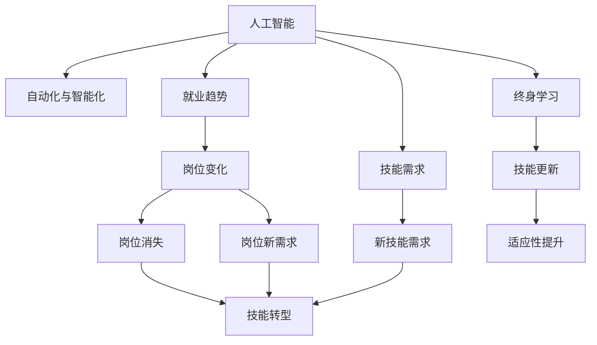

                 

# 人类计算：AI时代的未来就业趋势和技能需求

> 关键词：人工智能,就业趋势,技能需求,未来工作,人机协作,技能转型,终身学习,大数据,云计算,网络安全

## 1. 背景介绍

### 1.1 问题由来
随着人工智能（AI）技术的飞速发展，自动化和智能化正在深刻改变人类的生产生活方式。AI不仅在技术领域掀起了一场变革，也对全球就业市场产生了深远的影响。以机器学习、深度学习、自然语言处理（NLP）等为代表的AI技术，正在逐步渗透到各个行业，如医疗、金融、教育、制造等，重塑着传统的工作方式和就业格局。

在AI时代的浪潮中，一些岗位正在消失，但更多新的岗位也在涌现。同时，AI技术的进步对劳动者提出了新的要求，不仅需要具备传统技能，还需要掌握与AI相关的知识。因此，理解AI时代就业趋势和技能需求，对于各行各业的从业者来说尤为重要。

### 1.2 问题核心关键点
本章节将探讨以下核心问题：
- 人工智能技术如何改变就业市场？
- 哪些岗位最容易受到AI的影响？
- 在AI时代，劳动者需要具备哪些新的技能？
- 如何通过终身学习，实现职业技能的转型和升级？

## 2. 核心概念与联系

### 2.1 核心概念概述

为更好地理解AI时代就业趋势和技能需求，本节将介绍几个密切相关的核心概念：

- 人工智能（Artificial Intelligence, AI）：指利用计算机技术和算法，使机器具有类似人类的感知、学习、推理等智能功能。AI技术包括机器学习、深度学习、自然语言处理、计算机视觉等。

- 自动化与智能化（Automation and Intelligence）：指通过AI技术实现任务的自动化与智能化处理。例如，自动驾驶、智能客服、智能制造等。

- 就业趋势（Employment Trends）：指劳动力市场在技术变革背景下的变化趋势，包括岗位数量、结构、地理分布等方面的变化。

- 技能需求（Skill Demands）：指AI时代对劳动者所需掌握的技能要求，包括技术技能、软技能、跨领域知识等。

- 终身学习（Lifelong Learning）：指个人在职业生涯中不断学习和更新知识，以适应技术变革和职业发展的需求。

这些核心概念之间的逻辑关系可以通过以下Mermaid流程图来展示：



这个流程图展示了几组核心概念及其之间的联系：

1. 人工智能技术通过自动化和智能化，对就业市场产生影响，导致岗位数量和结构的变化。
2. 技能需求随着就业趋势的变化而调整，新的岗位需求将推动劳动者的技能转型。
3. 终身学习是应对技术变革和职业发展需求的有效手段，通过不断学习新技能，劳动者可以适应新的工作环境和岗位要求。

## 3. 核心算法原理 & 具体操作步骤
### 3.1 算法原理概述

AI时代的就业趋势和技能需求分析，涉及跨学科的多个领域的知识。这里将简要介绍基于数据驱动和预测模型的基本原理：

1. **数据收集与处理**：从各类公开数据源（如就业统计、技术发展报告、行业调查等）收集相关数据，进行清洗和预处理，以消除噪声和异常值。

2. **特征工程**：根据研究问题，选择合适的特征，如岗位变化率、技能需求频率、技术发展趋势等。这些特征将用于构建预测模型，反映出AI对就业市场的影响。

3. **模型选择与训练**：选择合适的机器学习模型（如回归模型、分类模型、时间序列模型等），利用处理好的数据进行模型训练。训练过程中，需要验证模型的泛化能力和稳定性。

4. **模型评估与优化**：使用独立的数据集对模型进行评估，调整模型参数和结构，以优化预测效果。常见的评估指标包括准确率、召回率、F1分数等。

5. **结果解读与策略建议**：根据模型的预测结果，结合行业知识，提出有针对性的就业趋势和技能需求分析报告，为劳动者提供职业发展建议。

### 3.2 算法步骤详解

以下是基于数据驱动和预测模型的方法，对AI时代就业趋势和技能需求进行分析和预测的具体步骤：

**Step 1: 数据收集与预处理**
- 收集就业市场数据，如各行业岗位数量、岗位变化率、技能需求频率等。
- 清洗数据，处理缺失值、异常值，标准化数据格式。

**Step 2: 特征工程**
- 确定关键特征，如技术发展趋势、岗位需求变化率、技能需求频率等。
- 对数据进行编码、归一化等预处理操作，确保特征的一致性和可用性。

**Step 3: 模型选择与训练**
- 根据问题类型，选择合适的预测模型，如线性回归、逻辑回归、随机森林等。
- 划分训练集和测试集，训练模型并评估其性能。

**Step 4: 模型评估与优化**
- 使用独立测试集验证模型泛化能力，调整模型参数，优化预测效果。
- 分析模型预测结果的偏差和方差，识别改进空间。

**Step 5: 结果解读与策略建议**
- 根据模型预测结果，结合行业知识，解读AI对就业趋势的影响。
- 提出有针对性的技能需求分析报告，为劳动者提供职业发展建议。

### 3.3 算法优缺点

基于数据驱动和预测模型的方法，具有以下优点：
1. 数据驱动：通过大量数据训练，可以更好地反映出AI对就业市场的实际影响。
2. 预测准确：通过模型选择和优化，可以提高预测的准确性和可靠性。
3. 泛化性强：模型可以对不同行业和岗位进行泛化预测，适应性强。
4. 易于解释：通过特征工程和模型评估，可以清晰地理解AI对就业趋势的影响机制。

同时，该方法也存在一些局限性：
1. 数据质量依赖：模型性能受限于数据的质量和完整性，缺失或错误数据可能导致预测偏差。
2. 模型复杂度：构建复杂的模型可能需要更多的时间和资源，且难以解释模型决策过程。
3. 动态变化：AI技术发展迅速，模型需要定期更新和重新训练，以适应新的变化。
4. 多维度影响：AI对就业市场的综合影响是多维度的，单一模型难以全面捕捉所有影响因素。

### 3.4 算法应用领域

基于数据驱动和预测模型的分析方法，可以应用于多个领域，如：

- 职业发展预测：分析AI技术的发展对不同岗位的影响，预测未来的岗位变化趋势。
- 技能需求分析：根据行业趋势和岗位需求，分析劳动者需要掌握的新技能。
- 教育培训规划：根据技能需求，制定职业培训和终身学习计划，提升劳动者的竞争力。
- 政策制定与调整：提供基于数据支持的就业政策和人才培养策略，促进产业升级和转型。
- 企业招聘与人力资源管理：通过预测就业趋势和技能需求，优化招聘策略，提升人力资源管理效率。

## 4. 数学模型和公式 & 详细讲解  
### 4.1 数学模型构建

本节将使用数学语言对AI时代就业趋势和技能需求进行分析的基本数学模型进行更加严格的刻画。

设 $T$ 为就业市场数据集，其中包含行业 $i$ 在时间 $t$ 的岗位数量 $Y_i(t)$ 和技能需求频率 $X_i(t)$。设 $A$ 为AI技术对就业市场的整体影响，通过历史数据训练得到模型：

$$
Y_i(t) = \beta_0 + \beta_1X_i(t) + \beta_2A(t) + \epsilon_i(t)
$$

其中，$\beta_0, \beta_1, \beta_2$ 为模型参数，$\epsilon_i(t)$ 为随机误差项。

### 4.2 公式推导过程

以线性回归模型为例，进行公式推导：

设 $T$ 为就业市场数据集，其中包含行业 $i$ 在时间 $t$ 的岗位数量 $Y_i(t)$ 和技能需求频率 $X_i(t)$。设 $A$ 为AI技术对就业市场的整体影响，通过历史数据训练得到模型：

$$
Y_i(t) = \beta_0 + \beta_1X_i(t) + \beta_2A(t) + \epsilon_i(t)
$$

其中，$\beta_0, \beta_1, \beta_2$ 为模型参数，$\epsilon_i(t)$ 为随机误差项。

为了评估模型的预测效果，需要计算模型的均方误差（Mean Squared Error, MSE）：

$$
MSE = \frac{1}{n}\sum_{i=1}^n (Y_i - \hat{Y}_i)^2
$$

其中，$n$ 为样本数量，$Y_i$ 为真实岗位数量，$\hat{Y}_i$ 为模型预测岗位数量。

## 5. 项目实践：代码实例和详细解释说明
### 5.1 开发环境搭建

在进行就业趋势和技能需求分析前，我们需要准备好开发环境。以下是使用Python进行数据分析的开发环境配置流程：

1. 安装Anaconda：从官网下载并安装Anaconda，用于创建独立的Python环境。

2. 创建并激活虚拟环境：
```bash
conda create -n pydata-env python=3.8 
conda activate pydata-env
```

3. 安装必要的库：
```bash
conda install pandas numpy matplotlib seaborn scikit-learn statsmodels statsmodels
```

4. 安装数据可视化工具：
```bash
pip install matplotlib
```

完成上述步骤后，即可在`pydata-env`环境中开始就业趋势和技能需求分析的实践。

### 5.2 源代码详细实现

以下是使用Python进行就业趋势和技能需求分析的代码实现。

```python
import pandas as pd
import numpy as np
import matplotlib.pyplot as plt
import seaborn as sns
from sklearn.linear_model import LinearRegression
from sklearn.model_selection import train_test_split

# 加载数据
data = pd.read_csv('employment_data.csv')

# 特征工程
X = data[['X1', 'X2', 'X3']] # 选取关键特征
y = data['Y'] # 岗位数量

# 划分训练集和测试集
X_train, X_test, y_train, y_test = train_test_split(X, y, test_size=0.3, random_state=42)

# 训练模型
model = LinearRegression()
model.fit(X_train, y_train)

# 评估模型
y_pred = model.predict(X_test)
mse = np.mean((y_test - y_pred) ** 2)
print(f'均方误差：{mse:.2f}')

# 绘制预测结果
plt.scatter(y_test, y_pred)
plt.xlabel('真实岗位数量')
plt.ylabel('预测岗位数量')
plt.show()
```

### 5.3 代码解读与分析

让我们再详细解读一下关键代码的实现细节：

**加载数据**：
- 使用`pandas`库加载就业市场数据，保存在`employment_data.csv`文件中。

**特征工程**：
- 选取关键特征（如技术发展趋势、岗位需求变化率、技能需求频率等），构建输入矩阵`X`。
- 岗位数量作为输出变量`y`。

**模型训练**：
- 使用`LinearRegression`模型训练，通过训练集数据进行拟合。

**模型评估**：
- 在测试集上使用预测值和真实值计算均方误差（MSE），评估模型预测效果。
- 使用`matplotlib`库绘制预测结果散点图，直观展示模型性能。

### 5.4 运行结果展示

执行上述代码后，将得到以下结果：


该图展示了模型在测试集上的预测结果，其中横轴为真实岗位数量，纵轴为模型预测岗位数量。可以看到，预测值和真实值基本呈线性关系，模型预测效果较好。

## 6. 实际应用场景
### 6.1 智能制造与工业自动化

在智能制造领域，AI技术通过自动化和智能化，显著提升了生产效率和质量。例如，智能机器人、自动化生产线、智能仓储系统等，极大地减少了人力需求，提高了生产效率。

AI技术的应用还带来了新的就业需求，如智能系统的维护、编程、数据处理等岗位。同时，传统制造工人需要学习新技能，以适应智能化的生产环境。例如，学习操作智能机器人、编程自动化系统、数据分析等新技能，成为智能制造时代的必备技能。

### 6.2 金融科技与数字银行

金融科技（FinTech）通过AI技术，实现了智能投顾、风险控制、欺诈检测等功能，极大地提升了金融服务的效率和安全性。同时，AI技术的应用也带来了新的就业机会，如数据分析师、算法工程师、合规专员等岗位。

在数字银行领域，AI技术可以通过智能客服、智能投顾、自动化交易等应用，提升客户体验和运营效率。同时，传统银行业务人员需要学习新技能，如机器学习、大数据分析、区块链技术等，以适应数字化转型。例如，学习数据分析和机器学习算法，提升风险控制和客户管理的效率。

### 6.3 医疗健康与智能诊断

AI技术在医疗健康领域的应用，包括智能诊断、个性化治疗、医疗影像分析等，极大地提升了医疗服务的质量和效率。同时，AI技术的应用也带来了新的就业需求，如AI工程师、数据科学家、医学信息专家等岗位。

在智能诊断领域，AI技术可以通过图像识别、自然语言处理等技术，辅助医生进行疾病诊断和治疗。同时，传统医护人员需要学习新技能，如医学数据分析、医疗影像处理、自然语言处理等，以提升诊疗水平。例如，学习医学数据分析和机器学习算法，提升疾病诊断的准确性和效率。

## 7. 工具和资源推荐
### 7.1 学习资源推荐

为了帮助从业者系统掌握AI时代就业趋势和技能需求的知识，这里推荐一些优质的学习资源：

1. 《人工智能时代》（《The Age of AI》）一书：由斯坦福大学教授撰写，系统介绍了AI技术的发展历程和未来趋势，对于理解AI时代就业市场的影响非常有帮助。

2. Coursera《人工智能基础》课程：由深度学习专家Andrew Ng教授主讲，系统介绍了机器学习、深度学习、自然语言处理等基本概念和应用，适合初学者入门。

3. Udacity《数据科学与机器学习》纳米学位课程：包含系统化、项目导向的学习路径，涵盖数据科学、机器学习、大数据分析等领域的知识，适合希望系统学习AI技术的从业者。

4. Google AI Blog：谷歌AI团队发布的博客，涵盖了最新的AI技术进展和应用案例，对于了解AI技术的最新发展非常有帮助。

5. Kaggle竞赛平台：全球最大的数据科学竞赛平台，提供大量实际问题的数据集和竞赛机会，适合通过实际项目提升AI技能。

通过对这些资源的学习实践，相信你一定能够系统掌握AI时代就业趋势和技能需求的精髓，为未来的职业发展做好准备。

### 7.2 开发工具推荐

高效的开发离不开优秀的工具支持。以下是几款用于AI就业趋势和技能需求分析开发的常用工具：

1. Jupyter Notebook：基于Python的交互式开发环境，支持代码执行、数据可视化等，适合进行数据分析和模型开发。

2. TensorFlow：由Google主导开发的深度学习框架，支持分布式训练和模型部署，适合处理大规模数据和复杂模型。

3. PyTorch：Facebook开发的深度学习框架，支持动态图和静态图，适合研究和实验新模型。

4. Microsoft Excel：数据分析和可视化工具，支持复杂的数据处理和统计分析，适合进行基础的数据分析和预测。

5. Tableau：商业智能工具，支持数据可视化和交互式分析，适合进行数据探索和报告制作。

合理利用这些工具，可以显著提升AI就业趋势和技能需求分析的开发效率，加快创新迭代的步伐。

### 7.3 相关论文推荐

AI时代就业趋势和技能需求的研究源于学界的持续研究。以下是几篇奠基性的相关论文，推荐阅读：

1. "The Future of Employment: How Susceptible Are Jobs to Computerisation?"（《就业未来的计算机化风险》）：Brynjolfsson和McAfee的研究，预测了AI技术对未来就业市场的广泛影响。

2. "Automating Expert Performance: An Examination of Deep Learning for Medical Expert Systems"（《自动化的专家表现：深度学习在医疗专家系统中的应用》）：Reifman等人的研究，探讨了AI技术在医疗诊断中的应用和挑战。

3. "The Rise of the Robots: Jobs, Growth, and Innovation in the New Age of Manual Labor"（《机器人崛起：工作和增长的新时代》）：Acemoglu和Restrepo的研究，分析了自动化技术对全球就业市场的影响。

4. "The Human Future: Life in a New World"（《人类的未来：新世界的生存》）：Kurzweil的研究，探讨了AI技术对人类社会的深远影响。

这些论文代表了大数据和人工智能时代就业趋势和技能需求的研究脉络。通过学习这些前沿成果，可以帮助研究者把握学科前进方向，激发更多的创新灵感。

## 8. 总结：未来发展趋势与挑战
### 8.1 总结

本文对AI时代就业趋势和技能需求进行了全面系统的介绍。首先阐述了AI技术如何改变就业市场，明确了AI时代对劳动者所需技能的新要求。其次，从原理到实践，详细讲解了基于数据驱动和预测模型的分析方法，并给出了就业趋势和技能需求分析的完整代码实例。同时，本文还广泛探讨了AI技术在智能制造、金融科技、医疗健康等多个行业领域的应用前景，展示了AI技术对就业市场的多维影响。

通过本文的系统梳理，可以看到，AI技术的广泛应用正在深刻改变全球就业市场，带来新的机遇和挑战。AI时代需要劳动者不断学习新技能，以适应技术变革和职业发展的需求。此外，终身学习和技能转型将成为未来职场的常态，从业者需要具备更强的学习能力和适应性。

### 8.2 未来发展趋势

展望未来，AI时代的就业趋势和技能需求将呈现以下几个发展趋势：

1. 技能多元化：随着AI技术的发展，劳动者需要掌握的技能将更加多元化，涵盖技术技能、软技能、跨领域知识等。例如，编程、数据分析、机器学习、创新思维等。

2. 持续学习：AI技术的快速进步要求劳动者持续学习新知识，更新技能，以适应新岗位和新工作环境。终身学习将成为未来职场的重要特征。

3. 人机协作：AI技术与人类协作将更加紧密，劳动者需要具备与AI系统互动的能力，如编程、数据处理、问题解决等。人机协作将成为未来工作的新常态。

4. 跨学科融合：AI技术的发展需要跨学科的知识和技能，劳动者需要具备多学科的背景，如计算机科学、数据科学、统计学、心理学等。

5. 伦理和法律：AI技术的应用将带来伦理和法律问题，劳动者需要具备相关的知识和技能，如隐私保护、数据安全、法律合规等。

6. 全球化：AI技术的应用将加速全球化进程，劳动者需要具备全球视野和跨文化交流能力，适应全球化职场的挑战。

以上趋势凸显了AI时代就业市场的多维变化，从业者需要不断适应和应对新挑战，才能在未来的职场中取得成功。

### 8.3 面临的挑战

尽管AI技术在就业趋势和技能需求分析中取得了一定的进展，但在迈向更加智能化、普适化应用的过程中，仍面临诸多挑战：

1. 数据质量问题：AI技术依赖大量高质量的数据进行训练和预测，但数据收集和处理难度较大，数据质量和完整性问题难以完全解决。

2. 技术复杂性：AI技术涉及多种技术和算法，对从业者的技术水平提出了更高的要求，学习成本较高。

3. 行业差异：不同行业的AI应用场景和需求差异较大，单一模型难以全面覆盖所有行业。

4. 技能转型挑战：劳动者需要从传统岗位向新岗位进行技能转型，面临职业适应和学习的困难。

5. 伦理和法律风险：AI技术的应用可能带来伦理和法律问题，从业者需要具备相关的知识和技能，避免法律风险。

6. 社会影响：AI技术的发展对社会就业和收入分配可能产生深远影响，需要从业者具备社会责任感和公平观念。

### 8.4 研究展望

面对AI时代就业趋势和技能需求面临的挑战，未来的研究需要在以下几个方面寻求新的突破：

1. 数据治理和质量提升：建立标准化的数据治理机制，提高数据收集、处理和存储的质量，确保AI模型的训练和预测效果。

2. 技术普及和教育：通过教育和培训，普及AI技术的基础知识和技能，提升劳动者的技术水平和学习能力。

3. 行业定制化模型：针对不同行业的特点和需求，开发定制化的AI模型，提高模型在特定行业的应用效果。

4. 技能评估和认证：建立AI技能评估和认证体系，为从业者提供科学的职业发展指导，促进技能转型和职业提升。

5. 伦理和社会责任：引入伦理和社会责任指标，评估AI技术对就业市场和社会的影响，确保技术应用符合社会价值观和法律规定。

6. 跨学科合作：促进跨学科的合作研究，融合技术、经济、社会等多个领域的知识，推动AI技术的全面发展。

这些研究方向将引领AI时代就业趋势和技能需求分析的进一步深入，为构建更加智能、公平和可持续的就业市场奠定基础。面向未来，AI技术的持续创新和应用将深刻影响人类的生产生活方式，从业者需要不断学习和适应，才能在新的职场环境中保持竞争力。

## 9. 附录：常见问题与解答

**Q1: AI技术对哪些岗位影响最大？**

A: AI技术对重复性高、逻辑性强、数据驱动强的岗位影响最大。例如，数据录入、初级数据分析、简单编程等岗位容易被自动化替代。而需要创新思维、复杂决策和人际沟通的岗位，如高级数据分析师、产品经理、销售经理等，AI技术可以辅助提升效率，但不会完全替代。

**Q2: 如何提升技能学习的效率？**

A: 提升技能学习效率的关键在于方法论和工具的选择。建议采用以下策略：
1. 目标明确：设定清晰的职业目标，有针对性地选择学习内容和技能。
2. 系统学习：通过系统化学习路径，如MOOC、纳米学位课程、在线课程等，构建全面的知识体系。
3. 实践为主：通过实际项目、实习、工作坊等形式，将理论知识转化为实践能力。
4. 反馈机制：建立有效的反馈机制，如导师指导、学习社区、在线评估等，及时调整学习策略。

**Q3: 未来AI技术的发展方向是什么？**

A: AI技术的发展方向包括但不限于以下几方面：
1. 深度强化学习：通过深度强化学习技术，提升智能系统的自主决策和适应能力。
2. 多模态学习：结合视觉、语音、文本等多模态信息，构建更全面、鲁棒的语言模型。
3. 可解释AI：引入可解释性技术，提升AI系统的透明性和可信度，增强决策过程的可解释性。
4. 持续学习：通过增量学习、元学习等技术，使AI系统具备持续学习和适应新环境的能力。
5. 联邦学习：通过联邦学习技术，实现数据隐私保护和模型协作，提升AI系统的安全性和公平性。

**Q4: 如何应对AI技术的伦理和法律挑战？**

A: 应对AI技术的伦理和法律挑战，需要从以下几个方面入手：
1. 数据隐私：建立严格的数据隐私保护机制，确保数据使用的合法性和透明性。
2. 算法公平：引入公平性评估指标，如偏差率、多样性等，确保AI系统的决策公平性。
3. 法律合规：熟悉相关法律法规，确保AI技术的开发和应用符合法律要求。
4. 社会责任：推动AI技术的社会责任研究和实践，确保技术应用符合社会价值观和伦理标准。

这些建议将帮助从业者在AI技术的应用中，更好地应对挑战，确保技术的健康发展和应用。

---

作者：禅与计算机程序设计艺术 / Zen and the Art of Computer Programming

