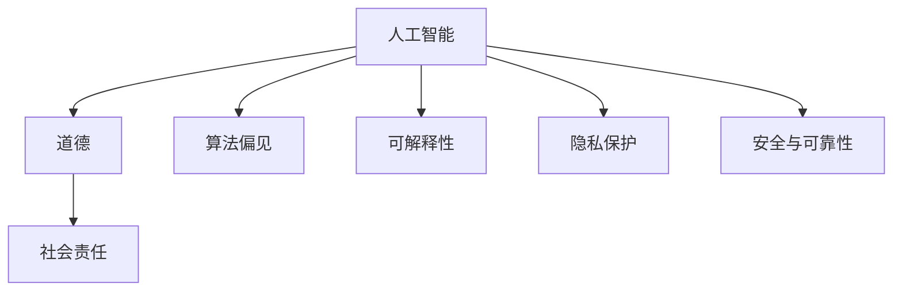
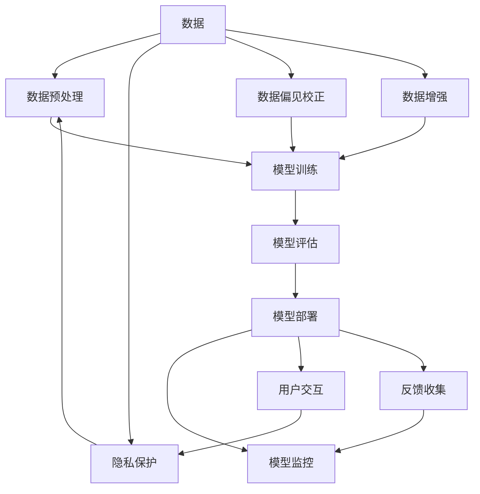

                 

## 1. 背景介绍

### 1.1 问题由来

在人工智能（AI）蓬勃发展的今天，计算能力已远超人类，但随之而来的，是对道德、社会责任以及未来科技影响的深刻思考。AI时代，如何平衡技术进步与社会责任、道德伦理，成为了全球共同关注的重要议题。

### 1.2 问题核心关键点

人工智能在带来便利的同时，也带来了一系列道德和社会责任问题。这些问题涉及到数据隐私、算法透明度、人工智能决策的可解释性、算法偏见等。在AI时代，如何构建公正、透明、可信的AI系统，是实现AI技术的可持续发展，并让更多人受益的关键。

### 1.3 问题研究意义

探讨AI时代的道德和社会责任，对于促进AI技术的健康发展，构建和谐的社会环境，具有重要意义：

1. **推动技术进步**：明确AI技术的伦理界限，指导AI研究人员开发更加人性化、负责任的AI系统。
2. **保障用户权益**：保护用户数据隐私和权益，提升AI系统透明度和可解释性，增强用户信任。
3. **促进社会公平**：避免算法偏见和歧视，确保AI技术在各个社会层面的公平应用，缩小数字鸿沟。
4. **保障国家安全**：构建可控、可解释、可解释的AI系统，防止潜在风险和恶意攻击。
5. **引导公众认知**：通过教育和培训，提升公众对AI技术的认知和理解，避免恐慌和误解。

## 2. 核心概念与联系

### 2.1 核心概念概述

1. **人工智能（AI）**：通过模拟人类智能行为，使计算机具备学习、推理、感知、决策等能力的科学技术。
2. **道德（Ethics）**：关于人类行为的规范、原则和价值观念，是衡量AI系统行为合理性的重要标准。
3. **社会责任（Social Responsibility）**：AI系统对社会的影响，包括但不限于隐私保护、数据安全、公平公正等。
4. **算法偏见（Algorithmic Bias）**：由于数据不平衡、模型设计不当等原因，导致AI系统输出结果存在不公平或歧视性。
5. **可解释性（Explainability）**：AI系统决策过程的透明性和可理解性，用户和监管者能够理解和解释系统输出。
6. **隐私保护（Privacy Protection）**：保护用户个人信息和数据隐私，防止数据滥用和泄露。
7. **安全与可靠性（Safety and Reliability）**：确保AI系统运行稳定，不易受到恶意攻击和篡改。

这些概念之间的逻辑关系可以通过以下Mermaid流程图来展示：



### 2.2 核心概念原理和架构的 Mermaid 流程图



这个流程图展示了从数据预处理到模型部署的全流程，并突出了隐私保护、偏见校正、数据增强等关键环节。

## 3. 核心算法原理 & 具体操作步骤

### 3.1 算法原理概述

人工智能的道德和社会责任问题，贯穿于数据预处理、模型训练、模型评估、模型部署和模型监控等各个环节。通过构建公平、透明、可解释的AI系统，可以在各个环节上减少负面影响，提升AI技术的社会价值。

### 3.2 算法步骤详解

#### 数据预处理

数据预处理是AI系统的重要环节，包括以下步骤：

1. **数据收集**：从不同来源收集数据，确保数据多样性和代表性。
2. **数据清洗**：去除噪声、异常值和不一致数据，提高数据质量。
3. **数据隐私保护**：采用匿名化、去标识化等技术，保护用户隐私。
4. **数据增强**：通过对数据进行扩充和处理，减少数据偏见和噪声。

#### 模型训练

模型训练是AI系统的核心环节，包括以下步骤：

1. **模型选择**：根据任务需求选择合适的模型架构和算法。
2. **数据分割**：将数据分为训练集、验证集和测试集，确保模型泛化能力。
3. **超参数调优**：通过网格搜索、贝叶斯优化等方法，选择最优的超参数组合。
4. **模型训练**：使用梯度下降等优化算法，最小化损失函数，更新模型参数。
5. **偏见校正**：在训练过程中，通过调整数据权重、引入公平约束等方法，减少模型偏见。

#### 模型评估

模型评估是确保AI系统质量的关键环节，包括以下步骤：

1. **指标选择**：根据任务需求选择合适的评估指标，如准确率、召回率、F1分数等。
2. **交叉验证**：使用交叉验证等技术，评估模型的泛化能力。
3. **可解释性评估**：通过LIME、SHAP等方法，评估模型的可解释性。
4. **偏见评估**：使用公平性指标，评估模型的偏见和歧视。

#### 模型部署

模型部署是将AI系统转化为实际应用的关键环节，包括以下步骤：

1. **模型部署**：将训练好的模型部署到生产环境中。
2. **监控与反馈**：实时监控模型运行状态，收集用户反馈，及时调整模型。
3. **隐私保护**：在部署过程中，保护用户隐私和数据安全。

### 3.3 算法优缺点

人工智能的道德和社会责任问题，涉及到多个层面，以下是主要优缺点：

#### 优点：

1. **提升公平性**：通过偏见校正和公平约束，减少算法偏见，提升模型公平性。
2. **增强透明度**：通过可解释性技术，提升模型透明度，增加用户信任。
3. **保障隐私**：通过隐私保护技术，保护用户数据隐私。
4. **提升安全性**：通过安全与可靠性措施，确保AI系统不易受到恶意攻击。

#### 缺点：

1. **技术复杂性**：实施道德和社会责任措施需要较高的技术门槛，增加了系统复杂性。
2. **数据成本**：数据收集、清洗和保护需要大量资源，增加了系统成本。
3. **性能损失**：部分公平性、隐私保护措施可能会影响模型性能。

### 3.4 算法应用领域

人工智能的道德和社会责任问题，不仅在理论上有重要意义，也在多个领域得到了实际应用：

1. **金融领域**：金融风控、信贷审批、反欺诈等应用中，需要确保算法公平和隐私保护。
2. **医疗领域**：疾病诊断、医疗影像分析等应用中，需要确保数据隐私和算法公平。
3. **司法领域**：智能审判、案件推荐等应用中，需要确保算法公正和透明度。
4. **公共安全**：视频监控、智能安防等应用中，需要确保数据隐私和算法公正。
5. **教育领域**：个性化推荐、学习分析等应用中，需要确保数据隐私和算法公平。

## 4. 数学模型和公式 & 详细讲解 & 举例说明

### 4.1 数学模型构建

人工智能的道德和社会责任问题，可以构建如下数学模型：

$$
\min_{\theta} L(\theta) = \alpha L_{bias}(\theta) + \beta L_{privacy}(\theta) + \gamma L_{interpretable}(\theta)
$$

其中，$\alpha, \beta, \gamma$ 为权重系数，$L_{bias}, L_{privacy}, L_{interpretable}$ 分别为偏见、隐私和可解释性的损失函数。

### 4.2 公式推导过程

以公平性为例，假设数据集 $D$ 中包含两个类别 $A$ 和 $B$，模型预测输出为 $p(y|x, \theta)$。公平性损失函数可以定义为：

$$
L_{bias}(\theta) = \sum_{i=1}^N \frac{1}{N} \sum_{j \in A} (p(y_j|x_i, \theta) - p(y_j|x_i, \theta^*))^2
$$

其中，$\theta^*$ 为公平性约束下的最优模型参数。

### 4.3 案例分析与讲解

以性别偏见校正为例，假设数据集中男性和女性的样本数量不平衡。通过引入公平性约束，可以调整模型参数，使得模型对男性和女性的预测输出接近。

## 5. 项目实践：代码实例和详细解释说明

### 5.1 开发环境搭建

在Python环境下搭建环境，并使用TensorFlow和Keras库进行模型训练和评估：

```bash
conda create -n pytorch-env python=3.8 
conda activate pytorch-env
```

```bash
pip install tensorflow keras
```

### 5.2 源代码详细实现

以下是基于TensorFlow的公平性校正示例代码：

```python
import tensorflow as tf
from sklearn.metrics import roc_auc_score

# 加载数据集
train_dataset, test_dataset = load_dataset()

# 定义模型
model = tf.keras.Sequential([
    tf.keras.layers.Dense(64, activation='relu'),
    tf.keras.layers.Dense(1, activation='sigmoid')
])

# 定义公平性约束
def fair_model_loss(y_true, y_pred):
    y_true_biased = tf.where(y_true, 1, 0)
    y_pred_biased = tf.where(y_true, 0, 1)
    loss = tf.keras.losses.binary_crossentropy(y_true_biased, y_pred_biased)
    return loss

# 定义训练函数
def train_model(model, dataset, epochs=10, batch_size=32):
    model.compile(optimizer='adam', loss=fair_model_loss, metrics=['auc'])
    model.fit(dataset, epochs=epochs, batch_size=batch_size)
    y_pred = model.predict(dataset)
    auc = roc_auc_score(dataset['y_true'], y_pred)
    return auc

# 训练模型
auc = train_model(model, train_dataset)
print(f"AUC: {auc}")
```

### 5.3 代码解读与分析

在上述代码中，通过自定义公平性约束函数，将男性和女性样本的预测输出调整为接近，从而减少模型的性别偏见。

## 6. 实际应用场景

### 6.1 智能客服系统

智能客服系统在提升客户服务体验方面具有重要意义，但也面临数据隐私、算法透明度和偏见等问题。通过实施道德和社会责任措施，可以提升系统公平性，保护客户隐私，增强用户信任。

### 6.2 金融风控系统

金融风控系统需要处理大量敏感数据，确保数据隐私和模型公平性尤为重要。通过引入隐私保护和公平约束，可以确保系统在处理敏感数据时，保护客户隐私，避免歧视性决策。

### 6.3 医疗诊断系统

医疗诊断系统需要准确、公平地处理患者数据，确保诊断结果的可靠性。通过引入可解释性和公平约束，可以提升系统透明度，减少诊断偏见，增强医生和患者的信任。

## 7. 工具和资源推荐

### 7.1 学习资源推荐

1. **《人工智能伦理与责任》**：详细介绍了AI伦理和社会责任的理论基础，适用于学术界和产业界的研究人员。
2. **《AI道德与社会责任》**：探讨了AI技术对社会的影响，提供了一系列道德和社会责任的实际案例。
3. **Coursera《AI伦理与社会责任》课程**：由斯坦福大学教授主讲，涵盖AI伦理和社会责任的多个方面，适合广泛受众。

### 7.2 开发工具推荐

1. **TensorFlow**：开源深度学习框架，支持分布式计算和模型部署。
2. **Keras**：高层API，简单易用，支持快速原型设计和模型训练。
3. **LIME**：用于解释AI模型决策过程的工具，帮助理解模型行为。

### 7.3 相关论文推荐

1. **《公平性约束在深度学习中的应用》**：介绍了公平性约束在深度学习中的应用，提出了多种公平性评估和校正方法。
2. **《隐私保护在人工智能中的实践》**：探讨了隐私保护在人工智能中的各种技术手段，提供了隐私保护的实战经验。

## 8. 总结：未来发展趋势与挑战

### 8.1 研究成果总结

在人工智能道德和社会责任领域，已取得诸多研究成果，包括公平性约束、隐私保护、可解释性技术等。这些技术不仅提升了AI系统的公平性和透明度，也为未来的AI应用提供了重要的保障。

### 8.2 未来发展趋势

未来，人工智能道德和社会责任领域将呈现以下几个发展趋势：

1. **技术进步**：随着深度学习和人工智能技术的不断进步，公平性、隐私保护和可解释性技术将更加先进和高效。
2. **标准制定**：国际标准化组织将出台更多AI道德和社会责任的标准和规范，指导AI技术的健康发展。
3. **跨学科研究**：AI伦理和社会责任问题涉及多学科知识，未来需要跨学科的深入研究。
4. **公众认知**：通过教育和宣传，提升公众对AI技术的认知，促进AI技术的普及和应用。
5. **政策制定**：政府将制定更多AI相关的政策和法规，确保AI技术的健康发展。

### 8.3 面临的挑战

尽管在人工智能道德和社会责任领域取得了一些进展，但仍面临诸多挑战：

1. **技术复杂性**：实施公平性、隐私保护和可解释性技术需要较高的技术门槛。
2. **数据成本**：数据收集、清洗和保护需要大量资源。
3. **性能损失**：部分公平性、隐私保护措施可能会影响模型性能。
4. **伦理困境**：AI技术发展带来的一系列伦理问题，如算法歧视、数据隐私等，仍需深入探讨。

### 8.4 研究展望

未来，需要在以下几个方面进行深入研究：

1. **公平性优化**：开发更加高效和精确的公平性校正方法，提升模型公平性。
2. **隐私保护技术**：探索更多的隐私保护技术，降低数据泄露风险。
3. **可解释性增强**：提升模型的可解释性，增强用户信任和系统透明度。
4. **跨领域应用**：将公平性、隐私保护和可解释性技术应用到更多领域，提升AI技术的社会价值。
5. **伦理规范制定**：制定更多的AI伦理规范，指导AI技术的健康发展。

## 9. 附录：常见问题与解答

**Q1：什么是AI的道德和社会责任？**

A: AI的道德和社会责任是指在人工智能技术开发和应用过程中，对伦理、法律、社会影响的关注和规范。这些规范旨在确保AI系统行为的公平性、透明性和可解释性，保护用户隐私和权益，避免潜在风险和伦理问题。

**Q2：如何实施AI的公平性约束？**

A: 实施AI的公平性约束通常需要以下步骤：
1. 数据收集和预处理：确保数据多样性和代表性。
2. 公平性评估：使用公平性指标评估模型偏见。
3. 公平性校正：调整模型参数，减少偏见。
4. 公平性约束：在训练过程中引入公平性约束，防止新数据引入偏见。

**Q3：什么是AI的可解释性？**

A: AI的可解释性是指AI系统的决策过程和推理逻辑的透明性和可理解性。通过可解释性技术，用户和监管者能够理解系统的输出结果和决策依据，增强系统信任度。

**Q4：AI系统的隐私保护有哪些技术手段？**

A: AI系统的隐私保护可以通过以下技术手段实现：
1. 数据加密：对数据进行加密，防止数据泄露。
2. 匿名化和去标识化：通过删除或替换个人标识信息，保护用户隐私。
3. 差分隐私：在数据收集和处理过程中，添加噪声，保护用户隐私。
4. 访问控制：限制数据访问权限，防止数据滥用。

**Q5：AI系统的安全性如何保障？**

A: AI系统的安全性可以通过以下措施保障：
1. 模型审计：定期对模型进行审计，发现潜在安全漏洞。
2. 安全设计：在模型设计过程中，引入安全性和鲁棒性设计。
3. 监控和检测：实时监控模型运行状态，检测异常行为。
4. 应急响应：建立应急响应机制，及时处理安全事件。

作者：禅与计算机程序设计艺术 / Zen and the Art of Computer Programming

