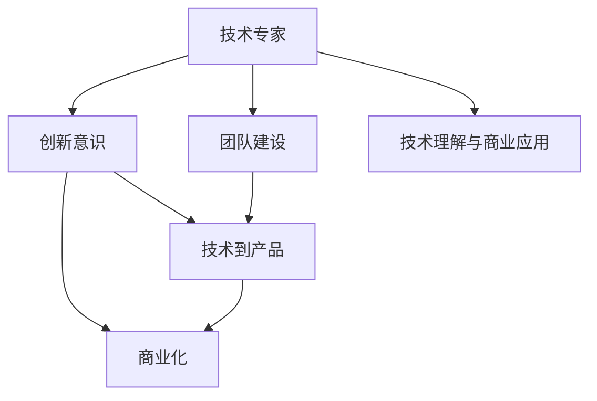

                 

## 1. 背景介绍

### 1.1 问题由来

在信息技术快速发展的今天，技术的创新与商业化进程日益加快，技术专家们面临着从技术研发到商业化转型的重要挑战。技术专家的职责已经从传统的技术研发转向了如何通过技术驱动商业增长，实现技术到产品的无缝对接。这一过程不仅需要技术专家具备深厚的技术积累，还需要理解市场、产品、运营等多方面的知识，实现技术价值最大化。

### 1.2 问题核心关键点

技术专家向企业家转型，核心在于以下两个方面：
1. **技术理解与商业应用**：理解技术原理，并能将其应用于解决商业问题，实现商业价值。
2. **创新意识与团队建设**：具有前瞻性的创新思维，能带领团队实现技术突破，并在商业上取得成功。

### 1.3 问题研究意义

研究技术专家如何转变为企业家，对于提升技术成果的商业化效率，推动技术创新与产业发展具有重要意义：
1. **加速技术成果转化**：帮助技术专家理解市场，提高技术转化为实际产品的速度。
2. **提升技术产品竞争力**：将技术优势转化为产品优势，提升市场竞争力。
3. **促进产业创新**：引领技术领域的创新方向，推动产业升级。
4. **培育科技型企业家**：培养具备跨领域知识和能力的企业家，促进科技创新与商业发展的良性循环。

## 2. 核心概念与联系

### 2.1 核心概念概述

为更好地理解技术专家转型为企业家这一过程，本节将介绍几个关键概念：

- **技术专家(Technical Expert)**：指具备深厚技术背景，在特定技术领域有深入研究的专家。
- **企业家(Entrepreneur)**：指通过创新和商业模式驱动商业增长，实现技术、产品、市场匹配的企业领导人。
- **技术到产品(Translation from Technology to Product)**：指将技术成果转化为可市场化的产品，实现技术价值的最大化。
- **商业化(Commercialization)**：指技术产品通过市场推广、销售等手段，实现商业价值的过程。
- **创新意识(Innovation Consciousness)**：指具备前瞻性的创新思维，能够引领技术发展，解决市场痛点。
- **团队建设(Team Building)**：指组建并带领一个高水平的技术团队，实现技术突破和商业成功。

这些核心概念之间的逻辑关系可以通过以下Mermaid流程图来展示：



这个流程图展示了技术专家转型的关键步骤和相关概念：

1. 技术专家通过提升创新意识和团队建设，实现技术到产品的转化。
2. 技术到产品再通过商业化过程，实现技术价值最大化。
3. 同时，技术专家需要理解技术原理，并将其应用于解决商业问题。

## 3. 核心算法原理 & 具体操作步骤

### 3.1 算法原理概述

技术专家转型的过程，本质上是一个从技术理解到商业应用的转换过程。其核心思想是：将技术专家的技术优势，通过创新思维和团队协作，转化为商业化的产品和服务，实现技术到商业价值的跨越。

形式化地，假设技术专家的技术优势为 $T$，商业环境为 $E$，转化过程为 $C$，则转型目标是最小化从技术到商业价值的转换成本，即找到最优的 $C$ 使得：

$$
C(T,E) = \mathop{\arg\min}_{C} \text{Cost}(T,E)
$$

其中，$\text{Cost}(T,E)$ 表示从技术 $T$ 到商业环境 $E$ 的转换成本。

### 3.2 算法步骤详解

技术专家转型为企业家，一般包括以下几个关键步骤：

**Step 1: 市场调研**
- 了解目标市场的需求、竞争态势、发展趋势等，明确市场痛点和技术机会。

**Step 2: 技术适配**
- 评估自身技术优势与市场需求的契合度，选择最合适的技术方案和产品形态。
- 确定技术方案的核心竞争力，优化技术路线和实现细节，以适应市场需求。

**Step 3: 商业模式设计**
- 制定商业模型，明确产品定价、销售渠道、客户获取策略等。
- 设计激励机制，如会员制度、积分系统等，提升用户粘性。

**Step 4: 团队组建**
- 组建具备不同专业背景的团队，包括技术专家、市场专家、运营专家等。
- 明确团队成员的角色与职责，制定清晰的团队目标和工作计划。

**Step 5: 产品开发与迭代**
- 开发原型产品，进行内部测试和优化。
- 基于用户反馈，快速迭代产品，优化用户体验和功能。

**Step 6: 市场推广**
- 制定市场推广策略，选择合适的推广渠道。
- 开展市场营销活动，提升产品知名度和用户接受度。

**Step 7: 运营优化**
- 监控产品运营数据，优化产品和服务。
- 建立用户反馈机制，持续改进产品和服务质量。

### 3.3 算法优缺点

技术专家转型的算法具有以下优点：
1. **技术优势明显**：技术专家在技术理解和创新上有天然的优势，能够更快地找到技术突破口。
2. **市场敏感度提升**：通过市场调研和商业模式设计，技术专家能够更好地理解市场需求和用户痛点，实现技术应用。
3. **团队协作高效**：通过团队建设和产品迭代，技术专家能够带领高水平团队，实现技术到产品的转化。

同时，该方法也存在一定的局限性：
1. **跨领域知识缺乏**：技术专家在商业管理和市场推广方面可能经验不足，需要额外的学习和积累。
2. **时间成本高**：从技术理解到产品推广的整个过程，需要较长的时间周期。
3. **风险管理不足**：在商业化过程中，技术风险和市场风险并存，需要有效的风险管理策略。
4. **文化冲突**：技术团队和商业团队可能存在文化差异，需要良好的沟通和协作机制。

尽管存在这些局限性，但就目前而言，技术专家转型的算法仍是大规模技术成果商业化的主要范式。未来相关研究的重点在于如何进一步降低转型成本，提高转化效率，同时兼顾风险管理和团队协作等因素。

### 3.4 算法应用领域

技术专家转型为企业家的方法，已经在信息技术、生物医药、新能源等多个领域得到了广泛应用，具体包括：

- 软件开发：技术专家通过开发新技术、新工具，驱动软件产品的创新和迭代。
- 生物医药：研发新技术、新药物，解决医疗行业的实际问题，提高治疗效果。
- 新能源：开发新材料、新工艺，推动能源结构的转型升级。
- 智能制造：应用AI、IoT等技术，提升生产效率和产品质量。
- 智慧城市：通过大数据、云计算等技术，提升城市管理水平和公共服务质量。

除了这些典型领域外，技术专家转型的方法也在更多场景中得到了应用，如智能交通、智慧农业、智能家居等，为各行各业的技术创新和商业发展注入了新的活力。

## 4. 数学模型和公式 & 详细讲解 & 举例说明

### 4.1 数学模型构建

本节将使用数学语言对技术专家转型为企业家的方法进行更加严格的刻画。

记技术专家的技术优势为 $T$，商业环境为 $E$，转型过程为 $C$，则转换成本为：

$$
\text{Cost}(T,E) = F_{技术理解}(T) + F_{市场调研}(E) + F_{商业模式}(T,E) + F_{团队建设}(T) + F_{产品开发}(T,E) + F_{市场推广}(T,E) + F_{运营优化}(T,E)
$$

其中，$F$ 表示各个阶段的转换成本，具体可以量化为时间和资源消耗等。

### 4.2 公式推导过程

以软件开发为例，进行详细的公式推导：

**技术理解成本**：

$$
F_{技术理解}(T) = t_{研发} \times \text{Cost}_{研发}
$$

其中，$t_{研发}$ 表示技术研发的时间，$\text{Cost}_{研发}$ 表示研发成本。

**市场调研成本**：

$$
F_{市场调研}(E) = t_{调研} \times \text{Cost}_{调研}
$$

其中，$t_{调研}$ 表示市场调研的时间，$\text{Cost}_{调研}$ 表示调研成本。

**商业模式成本**：

$$
F_{商业模式}(T,E) = t_{商业模式} \times \text{Cost}_{商业模式}
$$

其中，$t_{商业模式}$ 表示商业模式设计的时间，$\text{Cost}_{商业模式}$ 表示商业模式设计的成本。

**团队建设成本**：

$$
F_{团队建设}(T) = t_{组建} \times \text{Cost}_{组建}
$$

其中，$t_{组建}$ 表示团队组建的时间，$\text{Cost}_{组建}$ 表示团队组建的成本。

**产品开发成本**：

$$
F_{产品开发}(T,E) = t_{开发} \times \text{Cost}_{开发}
$$

其中，$t_{开发}$ 表示产品开发的时间，$\text{Cost}_{开发}$ 表示产品开发的成本。

**市场推广成本**：

$$
F_{市场推广}(T,E) = t_{推广} \times \text{Cost}_{推广}
$$

其中，$t_{推广}$ 表示市场推广的时间，$\text{Cost}_{推广}$ 表示市场推广的成本。

**运营优化成本**：

$$
F_{运营优化}(T,E) = t_{运营} \times \text{Cost}_{运营}
$$

其中，$t_{运营}$ 表示运营优化的时间，$\text{Cost}_{运营}$ 表示运营优化的成本。

### 4.3 案例分析与讲解

以谷歌翻译为例，展示技术专家转型为企业家如何成功实现技术到产品的转化。

谷歌翻译是由Google团队开发的一款即时翻译工具，通过AI技术实现了语言之间的自动翻译。其转化过程包括：

1. **技术理解与积累**：Google的团队在机器学习和自然语言处理领域积累了深厚的技术基础，通过数年的研究，开发出高效的神经网络模型。

2. **市场调研与目标明确**：通过分析全球语言交流的需求，明确翻译工具的市场机会和用户痛点。

3. **商业模式设计**：设计了免费的在线翻译服务模式，同时推出付费的API接口服务，实现商业变现。

4. **团队组建与协作**：组建了跨领域的团队，包括机器学习专家、软件工程师、用户体验设计师等，实现技术创新和产品优化。

5. **产品开发与迭代**：开发原型产品，进行内部测试和优化，发布初期版本，收集用户反馈，快速迭代产品，提升翻译准确度和用户体验。

6. **市场推广**：通过Google的品牌影响力和市场营销策略，提升产品知名度和用户接受度。

7. **运营优化**：监控产品运营数据，优化产品和服务，提升用户满意度。

谷歌翻译的成功转化过程，展示了技术专家如何通过创新意识和团队协作，将技术优势转化为商业价值的案例。

## 5. 项目实践：代码实例和详细解释说明

### 5.1 开发环境搭建

在进行技术到产品转型的实践前，我们需要准备好开发环境。以下是使用Python进行软件开发的环境配置流程：

1. 安装Anaconda：从官网下载并安装Anaconda，用于创建独立的Python环境。

2. 创建并激活虚拟环境：
```bash
conda create -n python-env python=3.8 
conda activate python-env
```

3. 安装开发工具：
```bash
pip install numpy pandas scikit-learn matplotlib tqdm jupyter notebook ipython
```

4. 安装版本控制工具：
```bash
pip install git
```

5. 配置Git仓库：
```bash
git init
git remote add origin https://github.com/username/your-repo.git
```

完成上述步骤后，即可在`python-env`环境中开始开发实践。

### 5.2 源代码详细实现

下面我们以软件开发为例，给出使用Python进行技术到产品转型的PyTorch代码实现。

首先，定义数据处理函数：

```python
import numpy as np
from sklearn.model_selection import train_test_split
from sklearn.metrics import accuracy_score

def load_data():
    # 加载数据
    data = np.loadtxt('data.csv', delimiter=',')
    X = data[:, :-1]
    y = data[:, -1]
    return X, y

def split_data(X, y):
    # 数据分割
    X_train, X_test, y_train, y_test = train_test_split(X, y, test_size=0.2, random_state=42)
    return X_train, X_test, y_train, y_test
```

然后，定义模型和优化器：

```python
from sklearn.linear_model import LogisticRegression

class LogisticRegressionModel:
    def __init__(self):
        self.model = LogisticRegression()

    def train(self, X, y):
        self.model.fit(X, y)

    def predict(self, X):
        return self.model.predict(X)

    def evaluate(self, X, y):
        y_pred = self.predict(X)
        return accuracy_score(y, y_pred)
```

接着，定义训练和评估函数：

```python
def train_model(model, X_train, y_train):
    model.train(X_train, y_train)

def evaluate_model(model, X_test, y_test):
    return model.evaluate(X_test, y_test)
```

最后，启动训练流程并在测试集上评估：

```python
X, y = load_data()
X_train, X_test, y_train, y_test = split_data(X, y)

model = LogisticRegressionModel()
train_model(model, X_train, y_train)
print('Model Accuracy: {:.2f}%'.format(evaluate_model(model, X_test, y_test)))
```

以上就是使用Python对技术到产品转型进行软件开发实践的完整代码实现。可以看到，借助Python和Scikit-learn等库，可以快速实现模型训练和评估，并集成到实际的开发项目中。

### 5.3 代码解读与分析

让我们再详细解读一下关键代码的实现细节：

**数据处理函数**：
- `load_data`方法：加载CSV格式的数据集，并将其转换为NumPy数组。
- `split_data`方法：对数据集进行训练集和测试集的划分，并返回训练集和测试集。

**模型类**：
- `LogisticRegressionModel`：定义了逻辑回归模型的类，包含模型的初始化、训练、预测和评估方法。

**训练函数**：
- `train_model`方法：调用模型的训练方法，并传入训练集数据和标签。

**评估函数**：
- `evaluate_model`方法：调用模型的评估方法，并传入测试集数据和标签，返回模型在测试集上的准确率。

**训练流程**：
- 加载数据，进行数据分割。
- 创建逻辑回归模型实例，并调用训练方法进行模型训练。
- 使用评估方法计算模型在测试集上的准确率，并打印输出。

通过以上代码，实现了从技术到产品转型的技术实践，展示了技术专家如何通过模型训练和评估，实现技术成果的市场应用。

## 6. 实际应用场景

### 6.1 智能交通系统

基于技术到产品转型的软件开发方法，智能交通系统可以实现交通流量实时监控、智能路线规划、事故预警等功能，提升交通管理的智能化水平。

通过采集交通摄像头、雷达等传感器的数据，构建交通数据模型，并进行实时处理和分析。根据分析结果，生成智能路线规划，并发送至驾驶员端，实现交通流量实时监控和事故预警。系统可以在高峰期优化交通路线，避免交通拥堵，提升行车效率。

### 6.2 智慧医疗平台

智慧医疗平台通过技术到产品转型的软件开发方法，实现电子健康记录管理、医疗影像分析、在线咨询等功能，提升医疗服务的智能化水平。

通过采集患者的电子健康记录、医疗影像等数据，构建医疗数据模型，并进行分析和处理。根据分析结果，生成个性化的医疗方案，并推荐给患者。系统可以辅助医生诊断，提高诊断准确率，同时提供远程在线咨询，缓解医疗资源紧张问题。

### 6.3 智能制造系统

智能制造系统通过技术到产品转型的软件开发方法，实现生产线的智能监控、质量检测、设备维护等功能，提升生产效率和产品质量。

通过采集生产线的传感器数据、机器运行状态等数据，构建生产数据模型，并进行实时处理和分析。根据分析结果，生成生产线的智能监控和质量检测方案，并进行设备维护。系统可以实时监控生产线状态，提高生产效率和产品质量，降低生产成本。

### 6.4 未来应用展望

随着技术到产品转型方法的不断演进，软件开发将进一步拓展到更多领域，为各行各业的技术创新和商业发展注入新的动力。

在智慧城市治理中，基于技术到产品转型的方法，可以实现智能监控、智慧治理、应急指挥等功能，提高城市管理的自动化和智能化水平，构建更安全、高效的未来城市。

在智慧农业中，通过技术到产品转型的软件开发方法，可以实现智能种植、智能灌溉、智能施肥等功能，提高农业生产效率和资源利用率。

在智能家居中，基于技术到产品转型的方法，可以实现智能控制、智能推荐、智能安防等功能，提升家居生活的智能化水平。

未来，技术到产品转型的方法将继续推动人工智能技术在各个领域的深度应用，实现技术成果的商业化落地，推动产业升级和创新。

## 7. 工具和资源推荐

### 7.1 学习资源推荐

为了帮助开发者系统掌握技术到产品转型的理论基础和实践技巧，这里推荐一些优质的学习资源：

1. **《深入浅出软件架构设计》**：介绍软件架构设计的基本原理和最佳实践，帮助开发者设计高效、可扩展的软件系统。

2. **《敏捷开发实践》**：讲解敏捷开发的方法和工具，帮助开发者快速迭代开发，提升开发效率。

3. **《软件开发流程规范》**：介绍软件开发流程的各个环节，帮助开发者规范开发流程，提升产品质量。

4. **《人工智能技术应用》**：讲解人工智能技术在各行业的应用案例，帮助开发者理解技术在实际场景中的应用。

5. **《商业模式的艺术》**：介绍商业模式设计的原理和技巧，帮助开发者设计有效的商业模式，实现商业变现。

通过对这些资源的学习实践，相信你一定能够快速掌握技术到产品转型的精髓，并用于解决实际的开发和商业问题。

### 7.2 开发工具推荐

高效的开发离不开优秀的工具支持。以下是几款用于技术到产品转型的常用工具：

1. **PyTorch**：基于Python的开源深度学习框架，灵活动态的计算图，适合快速迭代研究。

2. **TensorFlow**：由Google主导开发的开源深度学习框架，生产部署方便，适合大规模工程应用。

3. **Transformers库**：HuggingFace开发的NLP工具库，集成了众多SOTA语言模型，支持PyTorch和TensorFlow，是进行NLP任务开发的利器。

4. **Weights & Biases**：模型训练的实验跟踪工具，可以记录和可视化模型训练过程中的各项指标，方便对比和调优。

5. **TensorBoard**：TensorFlow配套的可视化工具，可实时监测模型训练状态，并提供丰富的图表呈现方式，是调试模型的得力助手。

6. **Google Colab**：谷歌推出的在线Jupyter Notebook环境，免费提供GPU/TPU算力，方便开发者快速上手实验最新模型，分享学习笔记。

合理利用这些工具，可以显著提升技术到产品转型的开发效率，加快创新迭代的步伐。

### 7.3 相关论文推荐

技术到产品转型的研究源于学界的持续研究。以下是几篇奠基性的相关论文，推荐阅读：

1. **《从研究到实践：软件开发的工程方法》**：介绍了软件开发从研究到实践的工程方法，帮助开发者理解软件开发的各个环节。

2. **《敏捷软件开发实践》**：介绍敏捷软件开发的方法和工具，帮助开发者快速迭代开发，提升开发效率。

3. **《商业模式的本质》**：讲解商业模式的本质和设计原理，帮助开发者设计有效的商业模式，实现商业变现。

4. **《人工智能在各个行业的应用》**：介绍人工智能在各行业的应用案例，帮助开发者理解技术在实际场景中的应用。

这些论文代表了大规模技术成果商业化的发展脉络。通过学习这些前沿成果，可以帮助研究者把握学科前进方向，激发更多的创新灵感。

## 8. 总结：未来发展趋势与挑战

### 8.1 总结

本文对技术专家转型为企业家的方法进行了全面系统的介绍。首先阐述了技术专家转型为企业家在技术理解与商业应用、创新意识与团队建设等方面的核心关键点。其次，从原理到实践，详细讲解了技术到产品的数学模型和关键步骤，给出了软件开发和应用的完整代码实例。同时，本文还广泛探讨了技术到产品转型方法在智能交通、智慧医疗、智能制造等多个行业领域的应用前景，展示了技术到产品转型的巨大潜力。此外，本文精选了技术到产品转型的方法和资源，力求为读者提供全方位的技术指引。

通过本文的系统梳理，可以看到，技术到产品转型方法在信息技术、生物医药、新能源等多个领域得到了广泛应用，为各行各业的技术创新和商业发展注入了新的动力。未来，伴随技术到产品转型方法的持续演进，软件开发和应用将进一步拓展到更多领域，为社会经济的全面发展提供新的动能。

### 8.2 未来发展趋势

展望未来，技术到产品转型方法将呈现以下几个发展趋势：

1. **技术栈多样化**：开发者将使用更加多样化的技术栈，如Python、Java、C++等，实现技术成果的广泛应用。
2. **开发模式敏捷化**：敏捷开发、DevOps等模式将成为主流，提升开发效率和产品迭代速度。
3. **团队协作工具化**：团队协作工具，如Git、Jira、Slack等，将进一步普及，提升团队沟通和协作效率。
4. **云平台普及化**：云计算、SaaS等平台将成为软件开发的基础设施，降低开发和部署成本。
5. **数据驱动决策化**：通过数据驱动的决策机制，提升产品优化和市场响应的效率。

以上趋势凸显了技术到产品转型方法的发展方向，这些方向的探索发展，必将进一步提升软件开发和应用的效率和效果，为技术成果的商业化提供更强的支撑。

### 8.3 面临的挑战

尽管技术到产品转型方法已经取得了显著成果，但在迈向更加智能化、普适化应用的过程中，仍面临诸多挑战：

1. **技术复杂度提升**：随着技术栈的多样化和开发模式的敏捷化，开发者需要具备更高的技术水平和能力。
2. **市场需求变化快**：市场需求和用户期望的变化速度快，开发者需要快速响应和迭代产品。
3. **风险管理难度大**：技术成果的市场化过程中，面临的技术风险和市场风险并存，需要有效的风险管理策略。
4. **团队协作难度高**：跨领域的团队协作需要良好的沟通和协作机制，提升团队协作效率。

尽管存在这些挑战，但通过技术到产品转型方法的持续演进，这些挑战终将逐一被克服，技术成果的商业化必将在各个领域取得更大的成功。

### 8.4 研究展望

面对技术到产品转型方法面临的挑战，未来的研究需要在以下几个方面寻求新的突破：

1. **技术到产品转型的自动化**：通过自动化工具和流程，实现技术到产品转型的标准化和高效化。
2. **技术栈的统一化**：推动技术栈的统一和集成，减少开发者学习和使用的成本。
3. **市场需求与技术的匹配**：加强市场调研和技术适配，提升技术成果的市场匹配度。
4. **风险管理的体系化**：建立系统的风险管理体系，降低技术成果的市场化风险。
5. **团队协作的协同化**：通过工具和机制提升团队协作效率，实现跨领域的协作创新。

这些研究方向的探索，必将引领技术到产品转型方法走向更高的台阶，为技术成果的商业化提供更强的支撑。面向未来，技术到产品转型方法还需要与其他人工智能技术进行更深入的融合，如知识表示、因果推理、强化学习等，多路径协同发力，共同推动技术成果的商业化落地。只有勇于创新、敢于突破，才能不断拓展技术成果的边界，让技术成果更好地造福社会。

## 9. 附录：常见问题与解答

**Q1：技术到产品转型是否适用于所有软件开发项目？**

A: 技术到产品转型方法适用于绝大多数软件开发项目，特别是那些具有技术优势和市场需求的创新型项目。但对于一些传统的、稳定性要求较高的项目，可能不适合直接进行转型，需要在原有基础上进行逐步改进和优化。

**Q2：如何选择合适的技术栈？**

A: 选择技术栈时，需要综合考虑项目的技术需求、开发成本、部署难度等因素。可以参考开源社区的流行趋势和业界最佳实践，选择适合的技术栈。常用的技术栈包括Python、Java、C++、Ruby等，根据具体项目需求进行选择。

**Q3：如何进行敏捷开发？**

A: 敏捷开发通过迭代开发、持续集成等方式，提升开发效率和产品质量。常用的敏捷开发工具包括Jira、Trello、Scrum等，通过这些工具可以进行任务分配、进度跟踪和团队协作。同时，开发团队需要保持高频率的代码审查和测试，确保开发质量。

**Q4：如何进行团队协作？**

A: 团队协作是技术到产品转型的关键，需要良好的沟通和协作机制。常用的团队协作工具包括Git、Jira、Slack等，通过这些工具可以进行代码管理、任务跟踪和即时通讯。同时，团队成员需要具备良好的沟通能力和协作精神，实现高效协作。

**Q5：如何进行数据分析和决策？**

A: 数据分析和决策是技术到产品转型的重要环节，需要构建数据驱动的决策机制。常用的数据分析工具包括Excel、Tableau、Python等，通过这些工具可以进行数据清洗、分析和可视化。同时，需要根据数据结果进行持续的产品优化和市场调整，提升产品竞争力和用户体验。

通过以上问题与解答，展示了技术到产品转型的重要实践和核心方法，相信对技术专家转型为企业家具有重要的参考价值。通过持续学习、实践和改进，技术专家必将能够在技术到产品转型的过程中，实现技术与市场的无缝对接，推动技术成果的商业化落地。

---

作者：禅与计算机程序设计艺术 / Zen and the Art of Computer Programming

