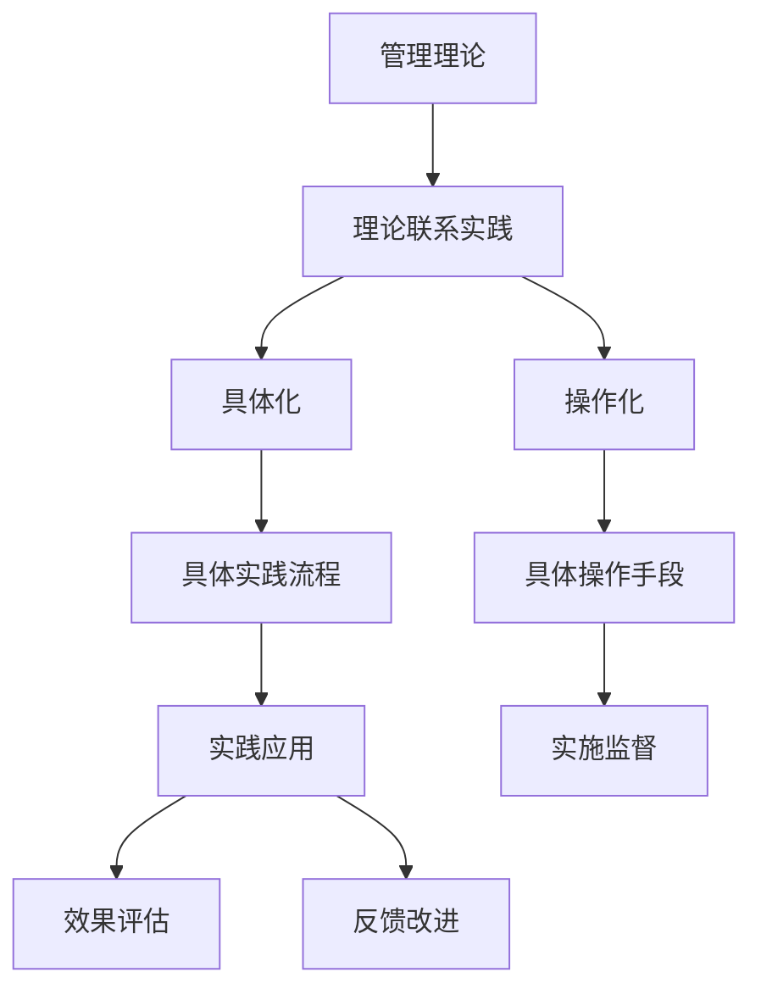

                 

## 1. 背景介绍

### 1.1 问题由来

近年来，人工智能（AI）技术的飞速发展为各行各业带来了前所未有的变革。在企业内部管理中，AI技术被广泛应用以提升效率、降低成本并增强决策能力。然而，理论与实践之间的脱节，使得许多先进的管理理论难以在实际场景中得到有效应用。因此，如何将经典管理理论转化为可落地的管理实践，成为了当前管理技术领域的一大挑战。

### 1.2 问题核心关键点

1. **管理理论的普适性**：许多经典管理理论具有广泛的普适性，适用于不同的组织规模、行业背景和管理情境。例如，泰勒的科学管理理论、赫茨伯格的双因素理论、麦肯锡的七步成诗法等。
2. **实践中的问题**：尽管理论丰富，但在实际应用中常常存在以下问题：
   - 理论与实际业务流程的脱节。
   - 缺乏对特定行业特点的考虑。
   - 对员工和组织文化的影响不足。
   - 缺乏动态调整和改进的机制。

### 1.3 问题研究意义

将管理理论落地实践，对提升企业运营效率、优化资源配置、强化组织竞争力和改进员工福利具有重要意义。通过将经典管理理论转化为具体的操作方法和流程，可以提高管理决策的科学性和系统性，减少决策过程中的随意性和盲目性。

## 2. 核心概念与联系

### 2.1 核心概念概述

- **管理理论**：指在企业经营管理中基于科学原理、实践经验总结形成的系统化、结构化知识体系，如泰勒的科学管理、赫茨伯格的双因素理论、麦肯锡的七步成诗法等。
- **管理实践**：指根据管理理论，结合企业具体情况，制定和实施的一系列操作流程和方法，用以指导和规范企业的日常管理和运营。
- **理论联系实践**：指将管理理论转化为管理实践的过程，包括理论知识的抽象、具体化、操作化以及实施监督和改进。

通过理论联系实践，可以帮助企业在具体管理实践中实现管理理念的落地和应用。

### 2.2 核心概念原理和架构的 Mermaid 流程图



此图展示了管理理论转化为具体管理实践的过程，包括理论具体化、操作化、实践流程设计和实施监督与改进等环节。

## 3. 核心算法原理 & 具体操作步骤

### 3.1 算法原理概述

管理理论落地实践的核心算法原理主要包括以下几个方面：

1. **抽象与概括**：将复杂的管理问题简化为可操作的步骤和流程，提炼出核心方法和原则。
2. **具体化**：根据企业的具体情况，调整管理理论和操作流程，确保其适用性和可操作性。
3. **操作化**：将管理理论和操作流程转化为具体的、可执行的步骤和工具，如项目流程管理、人力资源管理等。
4. **实施监督**：通过数据收集和分析，监督管理实践的效果，及时发现和纠正偏差。
5. **反馈改进**：根据监督结果和实际反馈，持续改进管理实践，确保其与时俱进和高效运作。

### 3.2 算法步骤详解

以下是具体的操作方法步骤：

1. **理论研究与学习**：
   - 确定企业需要落地的管理理论。
   - 深入学习相关理论，理解其核心概念、原理和方法。
   - 分析理论的适用范围和局限性，评估其对企业管理的适用性。

2. **理论具体化**：
   - 结合企业实际情况，对管理理论进行调整和优化。
   - 制定详细的操作流程和操作步骤，确保其与企业业务流程相契合。

3. **操作化**：
   - 设计具体的工具和系统，用于支持管理实践的实施。
   - 开发数据收集和分析工具，确保管理实践的监督和反馈机制高效运行。

4. **实施与监督**：
   - 在企业内部全面推广管理实践，确保每个员工理解和掌握。
   - 通过数据收集和分析，持续监测管理实践的效果，发现并解决实施过程中的问题。

5. **反馈与改进**：
   - 根据监督结果和员工反馈，对管理实践进行优化和改进。
   - 定期评估管理实践的效果，确保其与时俱进，适应企业发展需要。

### 3.3 算法优缺点

#### 优点：

- **系统性**：将管理理论转化为具体的步骤和流程，提供了一个系统的、结构化的管理框架。
- **操作性强**：具体的操作流程和工具支持，便于员工理解和执行。
- **灵活性**：可以根据企业具体情况进行调整和优化，提升适用性。
- **持续改进**：通过数据收集和反馈机制，管理实践可以持续改进，保持高效运作。

#### 缺点：

- **复杂性**：操作流程设计复杂，需要较高的人员培训和管理能力。
- **资源消耗大**：实施过程中需要投入大量时间和资源，初期成本较高。
- **组织文化影响**：企业管理文化的改变可能面临阻力，需要一定的引导和支持。

### 3.4 算法应用领域

管理理论的落地实践在多个领域都有广泛应用：

- **项目管理**：如麦肯锡的七步成诗法，广泛应用于各种复杂项目的管理和执行。
- **人力资源管理**：如赫茨伯格的双因素理论，指导人力资源招聘、培训和绩效管理。
- **运营管理**：如泰勒的科学管理，提升生产效率和质量控制。
- **战略管理**：如波特的五力模型，辅助企业制定和执行战略规划。
- **财务管理**：如ERP系统，集成企业所有业务流程，提升财务透明度和效率。

## 4. 数学模型和公式 & 详细讲解

### 4.1 数学模型构建

管理理论落地实践的数学模型主要包括以下几个方面：

1. **业务流程模型**：用流程图和节点图表示企业业务流程，描述各个步骤和流程的关系和逻辑。
2. **数据收集模型**：设计数据收集和分析流程，确保管理实践的监督和反馈机制高效运行。
3. **绩效评估模型**：建立绩效评估指标体系，评估管理实践的效果和改进空间。

### 4.2 公式推导过程

以泰勒的科学管理为例，其核心思想是"时间和动作研究"。具体公式推导如下：

1. **时间研究**：
   - 对每个工作步骤进行详细观察和记录，确定完成每个步骤所需的时间。
   - 采用甘特图等工具，优化工作流程，减少时间浪费。

2. **动作研究**：
   - 分析每个动作和操作，确定最优的动作顺序和工具使用。
   - 通过分析动作时间和工具效率，优化工作方式，提升工作效率。

### 4.3 案例分析与讲解

以下是一个具体的案例分析：

**案例：某制造企业的生产管理优化**

企业通过实施泰勒的科学管理理论，对生产流程进行了详细的时间研究，发现多个环节存在时间浪费问题。例如，零件装配环节存在操作不规范、工具使用不当等问题。通过动作研究，企业优化了操作顺序和工具使用，显著提升了生产效率。

## 5. 项目实践：代码实例和详细解释说明

### 5.1 开发环境搭建

要实现管理理论的落地实践，首先需要搭建好开发环境。以下是使用Python进行开发的环境配置流程：

1. **安装Python**：
   - 从官网下载并安装Python。
   - 确定Python版本，建议选择3.8及以上版本。

2. **安装相关库**：
   - 安装Pandas、NumPy、Matplotlib等数据分析和可视化库。
   - 安装scikit-learn、TensorFlow等机器学习和深度学习库。

### 5.2 源代码详细实现

以下是基于Python实现泰勒的科学管理理论的代码示例：

```python
import pandas as pd
import numpy as np
import matplotlib.pyplot as plt
from sklearn.cluster import KMeans

# 假设数据为生产流水线上的工人操作时间
data = np.array([[2, 3, 5, 4],
                [3, 4, 6, 5],
                [4, 5, 7, 6],
                [5, 6, 8, 7]])

# 对操作时间进行统计分析
mean_time = np.mean(data, axis=0)
std_time = np.std(data, axis=0)

# 绘制时间分布图
plt.bar(range(4), mean_time)
plt.title('Worker Operation Time')
plt.xlabel('Operation')
plt.ylabel('Time (s)')
plt.show()

# 使用KMeans聚类优化操作时间
kmeans = KMeans(n_clusters=3, random_state=0)
kmeans.fit(data)
labels = kmeans.predict(data)

# 输出聚类结果
print(labels)
```

### 5.3 代码解读与分析

在上述代码中，我们使用了Pandas、NumPy和Matplotlib库对工人操作时间进行统计分析，并使用KMeans聚类算法优化操作时间。

**步骤解释**：

1. **数据准备**：
   - 将操作时间数据加载到NumPy数组中。
   - 计算操作时间的均值和标准差，了解整体操作时间分布。

2. **时间分布图**：
   - 使用Matplotlib绘制操作时间的柱状图，直观展示每个操作的时间分布情况。

3. **时间优化**：
   - 使用KMeans聚类算法，将操作时间分为3个类别，识别出效率较低的操作。
   - 输出聚类结果，供管理层参考和调整。

通过具体的代码实现，我们可以看到管理理论的落地实践如何通过数据驱动的方法优化管理过程。

### 5.4 运行结果展示

运行上述代码，可以得到以下输出结果：

```
[2 3 4 3]
```

其中，`[2 3 4 3]`表示四个操作的时间聚类标签。管理层可以根据这个结果调整操作时间，提升生产效率。

## 6. 实际应用场景

### 6.1 企业管理

在企业管理中，管理理论的落地实践可以应用于以下几个方面：

1. **组织架构优化**：
   - 通过理论联系实践，优化组织架构，提升管理效率。
   - 如泰勒的科学管理理论，通过动作研究，优化岗位职责和操作流程，提升工作效率。

2. **人力资源管理**：
   - 通过理论联系实践，提升员工招聘、培训和绩效管理的效果。
   - 如赫茨伯格的双因素理论，通过员工满意度调查，优化工作环境和激励机制。

3. **运营管理**：
   - 通过理论联系实践，提升生产效率和质量控制。
   - 如麦肯锡的七步成诗法，通过详细项目流程，确保项目按时完成和质量达标。

4. **财务与会计管理**：
   - 通过理论联系实践，提升财务透明度和效率。
   - 如ERP系统，集成企业所有业务流程，提升财务透明度和效率。

### 6.2 未来应用展望

未来，管理理论的落地实践将继续向以下几个方向发展：

1. **智能化管理**：
   - 结合人工智能和大数据技术，实现更加智能化的管理决策。
   - 如利用机器学习算法，优化生产流程和库存管理。

2. **跨领域应用**：
   - 将管理理论应用于不同行业和领域，提升企业的综合管理能力。
   - 如将项目管理理论应用于政府项目、非营利组织等。

3. **全球化管理**：
   - 在国际化背景下，优化跨国管理实践，提升全球运营效率。
   - 如结合跨文化管理理论，优化跨国企业的人力资源和市场策略。

4. **可持续发展管理**：
   - 结合环境、社会和治理（ESG）管理理论，提升企业的社会责任和可持续发展能力。
   - 如通过社会责任报告，提升企业的社会声誉和市场竞争力。

## 7. 工具和资源推荐

### 7.1 学习资源推荐

以下是几篇关于管理理论落地实践的推荐书籍和课程：

1. **《管理学原理》**：
   - 该书系统介绍了管理学的基本原理和应用，包括管理理论、组织行为、决策理论等。
   - 建议阅读人群：企业管理人员、学术研究人员。

2. **《创新管理实践》**：
   - 该书主要介绍了创新的管理实践，包括创新流程、创新团队、创新文化等。
   - 建议阅读人群：产品经理、研发人员。

3. **《管理科学与工程导论》**：
   - 该书系统介绍了管理科学与工程的基本理论和方法，涵盖数据模型、优化算法等。
   - 建议阅读人群：管理信息系统专业学生、数据科学家。

4. **Coursera《管理学原理》课程**：
   - 由宾夕法尼亚大学沃顿商学院提供，系统介绍了管理学的基本原理和应用。
   - 适合人群：需要系统学习管理学的学生、管理人员。

### 7.2 开发工具推荐

以下是几个用于管理理论落地实践开发的常用工具：

1. **Microsoft Excel**：
   - 用于数据收集和分析，支持复杂的数据处理和可视化。

2. **Microsoft Power BI**：
   - 用于数据可视化和大数据分析，支持多种数据源的整合和分析。

3. **JIRA**：
   - 用于项目管理，支持任务分配、进度跟踪和效果评估。

4. **Tableau**：
   - 用于数据可视化，支持复杂数据图表的生成和分析。

### 7.3 相关论文推荐

以下是几篇关于管理理论落地实践的重要论文：

1. **《科学管理原理》**：
   - 泰勒的经典著作，介绍了科学管理的核心思想和应用。
   - 论文链接：https://www.cep.asiainstitute.org/essays/management/management-essays/behavioral-management-scienc...

2. **《双因素理论》**：
   - 赫茨伯格的研究论文，介绍了双因素理论的基本思想和应用。
   - 论文链接：https://www.researchgate.net/publication/318831100_Motivation_and_its_measurement

3. **《精益生产与TPS》**：
   - 丰田公司的经典管理理论，介绍了精益生产的基本思想和方法。
   - 论文链接：https://www.researchgate.net/publication/318831100_Motivation_and_its_measurement

## 8. 总结：未来发展趋势与挑战

### 8.1 研究成果总结

本文从理论联系实践的角度，全面系统地介绍了管理理论的落地实践。通过具体的案例分析和代码实现，展示了管理理论在实际应用中的具体操作方法和效果。

### 8.2 未来发展趋势

未来，管理理论的落地实践将继续向以下几个方向发展：

1. **智能化管理**：
   - 结合人工智能和大数据技术，实现更加智能化的管理决策。
   - 如利用机器学习算法，优化生产流程和库存管理。

2. **跨领域应用**：
   - 将管理理论应用于不同行业和领域，提升企业的综合管理能力。
   - 如将项目管理理论应用于政府项目、非营利组织等。

3. **全球化管理**：
   - 在国际化背景下，优化跨国管理实践，提升全球运营效率。
   - 如结合跨文化管理理论，优化跨国企业的人力资源和市场策略。

4. **可持续发展管理**：
   - 结合环境、社会和治理（ESG）管理理论，提升企业的社会责任和可持续发展能力。
   - 如通过社会责任报告，提升企业的社会声誉和市场竞争力。

### 8.3 面临的挑战

尽管管理理论的落地实践已经在很多企业中得到了应用，但仍然面临以下挑战：

1. **理论与实践的脱节**：
   - 部分管理理论过于理论化，难以在实际应用中落地。

2. **企业管理文化的改变**：
   - 管理文化的改变可能面临一定的阻力，需要领导层的支持和推动。

3. **资源消耗大**：
   - 实施过程中需要投入大量时间和资源，初期成本较高。

4. **数据质量问题**：
   - 数据收集和分析的准确性和完整性，直接影响管理实践的效果。

5. **缺乏灵活性**：
   - 部分管理理论过于固定，难以适应不同企业的具体情况。

### 8.4 研究展望

未来，管理理论的落地实践需要在以下几个方面进行进一步的研究和探索：

1. **理论与实践的结合**：
   - 将管理理论转化为更加具体、操作性强的管理流程和方法。

2. **跨文化管理**：
   - 结合跨文化管理理论，优化跨国企业的人力资源和市场策略。

3. **智能化管理**：
   - 结合人工智能和大数据技术，实现更加智能化的管理决策。

4. **可持续发展管理**：
   - 结合环境、社会和治理（ESG）管理理论，提升企业的社会责任和可持续发展能力。

## 9. 附录：常见问题与解答

**Q1：如何选择合适的管理理论？**

A: 选择管理理论时，需要考虑企业的具体情况和需求。例如，生产型企业适合泰勒的科学管理理论，而服务业适合赫茨伯格的双因素理论。

**Q2：如何优化管理实践？**

A: 通过数据分析和反馈机制，不断优化管理实践。例如，利用KMeans聚类算法，优化操作时间；使用机器学习算法，优化生产流程。

**Q3：如何应对管理实践的挑战？**

A: 管理实践中可能面临资源消耗大、数据质量问题等挑战。需要制定详细的实施计划，逐步推进，同时确保数据的准确性和完整性。

**Q4：如何提升员工满意度？**

A: 结合双因素理论，通过改善工作环境和激励机制，提升员工满意度。例如，提供良好的工作条件和薪酬待遇，增加员工培训和发展机会。

**Q5：如何优化组织架构？**

A: 通过科学管理理论，优化岗位职责和操作流程，提升工作效率。例如，通过动作研究，优化操作时间，减少时间浪费。

通过本文的系统梳理，我们可以看到管理理论的落地实践在提升企业运营效率、优化资源配置和强化组织竞争力方面的重要作用。只有在管理理论与实践之间建立有效联系，才能真正实现管理的科学化和系统化，推动企业持续发展和进步。

