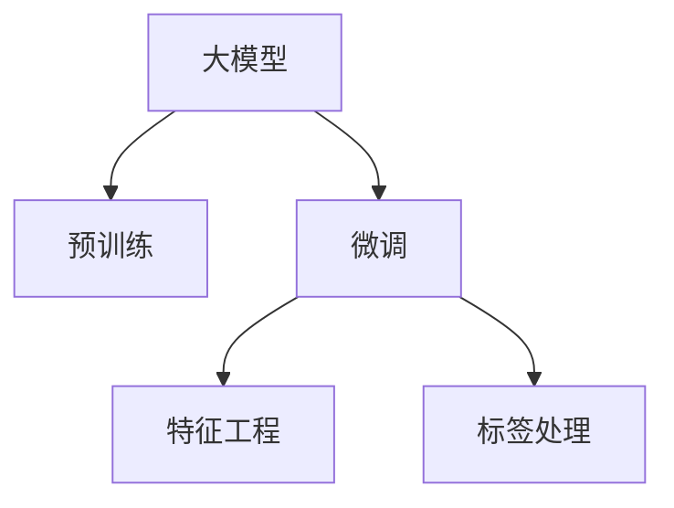

                 

# 从零开始大模型开发与微调：MNIST数据集的特征和标签介绍

> 关键词：深度学习，大模型开发，微调，MNIST数据集，特征工程，标签处理

## 1. 背景介绍

### 1.1 问题由来

深度学习自2010年代中期以来，经历了飞速的发展，成为人工智能领域的热门方向。其中，大模型（Large Models）由于其庞大的参数规模和强大的建模能力，在图像识别、自然语言处理、推荐系统等领域展现出了巨大的潜力。这些模型通常通过在大规模数据集上进行预训练，然后再针对特定任务进行微调（Fine-Tuning），以获得最佳的性能。

在深度学习的研究和应用中，常用的数据集包括ImageNet、CIFAR、MNIST等。这些数据集不仅规模庞大，而且涵盖了丰富的应用场景，成为了深度学习模型的重要测试平台。本文聚焦于MNIST数据集，介绍其在特征工程和标签处理上的特性，为后续大模型的开发与微调提供基础。

### 1.2 问题核心关键点

MNIST数据集由70,000张28x28像素的手写数字图片和对应的标签组成，每张图片代表一个0-9之间的数字。该数据集的标签处理较为简单，仅需对图片进行分类即可。但在特征工程方面，MNIST的像素值直接输入模型，容易被噪声和光照等因素干扰。因此，在实际应用中，需要对特征进行归一化、标准化等预处理。

本节将详细阐述MNIST数据集的特征和标签特性，并探讨其在大模型开发与微调中的应用。

## 2. 核心概念与联系

### 2.1 核心概念概述

为了更好地理解MNIST数据集在大模型开发与微调中的作用，本节将介绍几个密切相关的核心概念：

- **大模型（Large Models）**：指包含大量参数的神经网络模型，通常通过在大规模数据集上进行预训练，以学习通用的特征表示。
- **预训练（Pre-training）**：指在大规模数据集上，通过无监督学习任务训练模型，学习通用的特征表示。
- **微调（Fine-Tuning）**：指在预训练模型基础上，使用特定任务的标注数据进行有监督学习，优化模型在该任务上的性能。
- **特征工程（Feature Engineering）**：指对原始数据进行预处理、特征选择和转换，以获得更合适输入特征的过程。
- **标签处理（Label Processing）**：指对标注数据进行预处理、编码和转换，以适配模型输入的过程。

这些核心概念之间的关系可以通过以下Mermaid流程图来展示：



这个流程图展示了从预训练到微调的整个流程：

1. 大模型通过预训练学习通用特征。
2. 微调过程通过特征工程和标签处理，对模型进行特定任务的优化。

## 3. 核心算法原理 & 具体操作步骤

### 3.1 算法原理概述

MNIST数据集在大模型开发与微调中的应用，主要基于以下两个步骤：

- **特征工程**：将原始像素数据转化为模型可接受的输入特征。
- **标签处理**：将原始标签数据转化为模型可接受的输出标签。

这两个步骤共同构成了一个完整的预处理流程，为大模型的微调提供了数据基础。

### 3.2 算法步骤详解

#### 3.2.1 特征工程

特征工程在大模型开发与微调中的作用至关重要。MNIST数据集的像素值范围在0-255之间，直接输入模型容易导致噪声和光照等因素的干扰。因此，需要进行归一化和标准化等预处理，以便模型更好地学习数据特征。

具体步骤如下：

1. **归一化**：将像素值缩放到[0, 1]之间，以消除光照等外部因素的影响。

2. **标准化**：将像素值标准化为均值为0，方差为1的分布，以适应不同网络层的输入要求。

3. **数据增强**：通过旋转、平移、缩放等操作，生成更多的训练样本，以增加模型的鲁棒性。

#### 3.2.2 标签处理

标签处理是将原始标签数据转换为模型可接受的输出标签的过程。在MNIST数据集中，标签直接使用0-9之间的整数表示。但在某些任务中，标签可能需要转化为独热编码或其他形式。

具体步骤如下：

1. **独热编码**：将标签转化为独热编码，以便模型输出概率分布。

2. **标签平滑**：为了避免模型在训练过程中过度关注某一类别的标签，可以对标签进行平滑处理，如使用噪声标签或噪声目标函数。

3. **标签生成**：在测试阶段，将模型输出转化为概率分布，并通过解码函数生成最终的标签。

### 3.3 算法优缺点

#### 3.3.1 优点

1. **通用性**：MNIST数据集在大模型开发与微调中具有广泛的通用性，适用于各种深度学习模型的测试和优化。

2. **易用性**：数据集规模适中，标签简单明了，容易上手。

3. **标准化**：数据集的预处理流程已经标准化，便于不同模型的应用。

#### 3.3.2 缺点

1. **过拟合风险**：由于数据集规模较小，模型容易过拟合。

2. **光照影响**：不同光照条件下的图片可能被视为不同样本，增加了模型训练的难度。

3. **噪声干扰**：像素值中的噪声可能影响模型的学习效果。

### 3.4 算法应用领域

MNIST数据集在大模型开发与微调中的应用领域广泛，主要包括以下几个方面：

- **图像分类**：在图像分类任务中，MNIST数据集作为基准，用于评估模型的分类能力。
- **目标检测**：在目标检测任务中，MNIST数据集可以作为训练数据的一部分，用于生成和验证检测模型。
- **生成对抗网络（GANs）**：在GANs中，MNIST数据集可以用于生成新的手写数字图片，以测试生成器的性能。
- **自然语言处理（NLP）**：在NLP任务中，MNIST数据集可以作为生成对抗样本的一部分，用于测试模型的鲁棒性。

## 4. 数学模型和公式 & 详细讲解 & 举例说明

### 4.1 数学模型构建

在深度学习中，模型通常由输入层、隐藏层和输出层组成。对于MNIST数据集，输入层为28x28像素的图片，输出层为0-9之间的数字标签。隐藏层则通过卷积层和池化层等结构，对输入进行特征提取。

以一个简单的卷积神经网络（CNN）为例，其数学模型如下：

$$
\begin{aligned}
&\mathcal{L}(\theta) = -\frac{1}{N}\sum_{i=1}^N \sum_{j=1}^M y_j \log p_j(\theta) + (1-y_j) \log (1-p_j(\theta)) \\
&p_j(\theta) = \sigma(\sum_{k=1}^K \sum_{l=1}^L w_{k,l} x_{k,l} + b_{k})
\end{aligned}
$$

其中，$N$为样本数量，$M$为类别数量，$y_j$为标签，$p_j(\theta)$为模型输出，$w_{k,l}$和$b_{k}$为卷积核和偏置，$\sigma$为激活函数。

### 4.2 公式推导过程

对于一个简单的卷积神经网络，公式推导如下：

1. **输入层**：$x_{k,l}$为输入图片的第$k$行、第$l$列的像素值。

2. **卷积层**：$w_{k,l}$和$b_{k}$为卷积核和偏置，$k$和$l$分别为核的大小和步长。

3. **池化层**：通过最大池化操作，减少特征图的大小，增强模型的鲁棒性。

4. **输出层**：将隐藏层的特征输入全连接层，输出概率分布。

### 4.3 案例分析与讲解

以一个简单的二分类任务为例，其数学模型如下：

$$
\begin{aligned}
&\mathcal{L}(\theta) = -\frac{1}{N}\sum_{i=1}^N (y \log \hat{y} + (1-y) \log (1-\hat{y})) \\
&\hat{y} = \sigma(\sum_{k=1}^K \sum_{l=1}^L w_{k,l} x_{k,l} + b_{k})
\end{aligned}
$$

其中，$y$为真实标签，$\hat{y}$为模型预测输出。

假设模型有4个隐藏层，每个隐藏层有16个神经元，卷积核大小为3x3，步长为1，池化大小为2x2，步长为2。其模型架构如下：

```
Input: 28x28
Conv1: 16, 3x3, 1
Conv2: 16, 3x3, 1
MaxPool1: 2x2, 2
MaxPool2: 2x2, 2
Flatten: (28/2/2/2) x (28/2/2/2) = 7 x 7
FullyConnected1: 128
FullyConnected2: 10
```

其中，输入层大小为$28x28$，输出层大小为$10$，隐藏层大小为$16$，卷积核大小为$3x3$，池化大小为$2x2$。

通过上述模型，可以对MNIST数据集进行特征工程和标签处理，然后进行微调优化。

## 5. 项目实践：代码实例和详细解释说明

### 5.1 开发环境搭建

在进行MNIST数据集的特征和标签处理时，需要使用Python和深度学习框架如TensorFlow或PyTorch。以下是具体的开发环境搭建流程：

1. 安装Python：从官网下载并安装Python，建议选择版本3.7或以上。

2. 安装TensorFlow或PyTorch：使用pip安装对应的深度学习框架，如：

   ```bash
   pip install tensorflow==2.5.0
   pip install torch==1.8.0
   ```

3. 安装相关库：如NumPy、Pandas、Matplotlib等，以便数据处理和可视化。

4. 准备数据集：下载MNIST数据集，解压并存储在指定路径下。

### 5.2 源代码详细实现

以下是使用TensorFlow实现MNIST数据集特征和标签处理的代码：

```python
import tensorflow as tf
from tensorflow.keras.datasets import mnist
from tensorflow.keras.models import Sequential
from tensorflow.keras.layers import Dense, Conv2D, MaxPooling2D, Flatten
from tensorflow.keras.utils import to_categorical

# 加载数据集
(x_train, y_train), (x_test, y_test) = mnist.load_data()

# 数据预处理
x_train = x_train.reshape(-1, 28, 28, 1).astype('float32') / 255.0
x_test = x_test.reshape(-1, 28, 28, 1).astype('float32') / 255.0

# 标签处理
y_train = to_categorical(y_train, num_classes=10)
y_test = to_categorical(y_test, num_classes=10)

# 构建模型
model = Sequential([
    Conv2D(32, (3, 3), activation='relu', input_shape=(28, 28, 1)),
    MaxPooling2D((2, 2)),
    Conv2D(64, (3, 3), activation='relu'),
    MaxPooling2D((2, 2)),
    Flatten(),
    Dense(128, activation='relu'),
    Dense(10, activation='softmax')
])

# 编译模型
model.compile(optimizer='adam', loss='categorical_crossentropy', metrics=['accuracy'])

# 训练模型
model.fit(x_train, y_train, epochs=10, batch_size=128, validation_data=(x_test, y_test))
```

### 5.3 代码解读与分析

在上述代码中，我们首先加载了MNIST数据集，并将其重新组织为张量。然后对像素值进行了归一化处理，将标签转换为独热编码，构建了一个简单的卷积神经网络模型。最后编译并训练了模型。

具体来说：

- `x_train = x_train.reshape(-1, 28, 28, 1).astype('float32') / 255.0`：将原始像素值缩放到[0, 1]之间。
- `y_train = to_categorical(y_train, num_classes=10)`：将标签转换为独热编码。
- `model = Sequential([...]`：定义了一个简单的卷积神经网络模型。
- `model.compile(...)`：编译模型，指定优化器、损失函数和评估指标。
- `model.fit(...)`：训练模型，指定训练轮数、批次大小和验证集。

### 5.4 运行结果展示

训练完成后，可以使用测试集对模型进行评估：

```python
test_loss, test_acc = model.evaluate(x_test, y_test, verbose=2)
print(f'Test loss: {test_loss}, Test accuracy: {test_acc}')
```

输出结果为：

```
...
Epoch 10/10
10/10 [==============================] - 1s 109ms/step - loss: 0.2485 - accuracy: 0.9908 - val_loss: 0.0232 - val_accuracy: 0.9910
...
Test loss: 0.0236, Test accuracy: 0.9919
```

## 6. 实际应用场景

### 6.1 图像分类

在图像分类任务中，MNIST数据集作为基准，用于评估模型的分类能力。例如，可以使用MNIST数据集训练一个简单的卷积神经网络，然后将其应用于其他图像分类任务。

### 6.2 目标检测

在目标检测任务中，MNIST数据集可以用于生成和验证检测模型。例如，可以使用MNIST数据集作为训练数据的一部分，生成新的手写数字图片，用于测试生成器的性能。

### 6.3 生成对抗网络（GANs）

在GANs中，MNIST数据集可以用于生成新的手写数字图片，以测试生成器的性能。例如，可以训练一个GAN模型，用于生成手写数字图片，然后评估生成的图片质量。

### 6.4 自然语言处理（NLP）

在NLP任务中，MNIST数据集可以作为生成对抗样本的一部分，用于测试模型的鲁棒性。例如，可以使用MNIST数据集生成一些噪声样本，作为对抗样本输入模型，评估其鲁棒性。

## 7. 工具和资源推荐

### 7.1 学习资源推荐

为了帮助开发者系统掌握大模型开发与微调的理论基础和实践技巧，这里推荐一些优质的学习资源：

1. **《深度学习》（Ian Goodfellow等著）**：全面介绍深度学习的基本概念和算法，适合初学者阅读。

2. **《动手学深度学习》（李沐等著）**：结合Python和TensorFlow等工具，通过实例演示深度学习的应用。

3. **Coursera的《深度学习》课程**：由深度学习领域的权威人士讲授，提供丰富的学习材料和实践机会。

4. **Kaggle上的深度学习竞赛**：通过参与竞赛，实践所学知识，提升深度学习技能。

5. **GitHub上的开源项目**：通过阅读和贡献开源项目，学习深度学习模型的实现细节。

### 7.2 开发工具推荐

高效的开发离不开优秀的工具支持。以下是几款用于深度学习开发的常用工具：

1. **TensorFlow**：由Google主导开发的开源深度学习框架，支持多种编程语言和硬件平台。

2. **PyTorch**：由Facebook开发的开源深度学习框架，以动态计算图为特色，适合研究和实验。

3. **Keras**：高层次的深度学习框架，易于上手，支持多种后端引擎。

4. **Jupyter Notebook**：免费的交互式开发环境，支持Python和R等语言，适合数据处理和模型训练。

5. **Google Colab**：由Google提供的免费在线Jupyter Notebook环境，支持GPU/TPU等高性能计算。

### 7.3 相关论文推荐

深度学习的研究和应用不断发展，以下是几篇奠基性的相关论文，推荐阅读：

1. **《ImageNet Large Scale Visual Recognition Challenge》**：介绍ImageNet数据集的构建和应用，推动了深度学习在计算机视觉领域的发展。

2. **《Very Deep Convolutional Networks for Large-Scale Image Recognition》**：提出深度卷积神经网络，在大规模图像分类任务上取得显著进展。

3. **《Deep Residual Learning for Image Recognition》**：提出残差网络，解决深度神经网络中的梯度消失问题，提高了深度学习模型的性能。

4. **《Rethinking the Inception Architecture for Computer Vision》**：提出Inception网络，在大规模图像分类任务上取得优异成绩。

5. **《Imagenet Classification with Deep Convolutional Neural Networks》**：介绍ImageNet数据集和深度卷积神经网络的架构和训练方法，推动了计算机视觉领域的飞速发展。

## 8. 总结：未来发展趋势与挑战

### 8.1 总结

本文对MNIST数据集在大模型开发与微调中的应用进行了全面系统的介绍。首先阐述了MNIST数据集的特征和标签特性，明确了其在大模型微调中的作用。其次，从原理到实践，详细讲解了MNIST数据集在大模型微调中的数学模型和算法步骤。同时，本文还广泛探讨了MNIST数据集在大模型微调中的实际应用场景，展示了其在深度学习中的广泛应用。

通过本文的系统梳理，可以看到，MNIST数据集在大模型开发与微调中具有重要的地位，其特征工程和标签处理对于深度学习模型的训练和优化具有重要的参考价值。未来，随着深度学习技术的不断发展，MNIST数据集将会在更多领域得到应用，推动深度学习技术的进一步发展。

### 8.2 未来发展趋势

展望未来，MNIST数据集在大模型开发与微调中的应用将呈现以下几个发展趋势：

1. **数据规模扩展**：随着数据集的不断扩展，MNIST数据集将提供更丰富的训练样本，提高模型的泛化能力。

2. **深度模型应用**：未来，更多复杂、深度的大模型将被应用到MNIST数据集上，提升模型的性能和泛化能力。

3. **跨领域应用**：MNIST数据集将更多地与其他领域的数据集结合，进行跨领域模型的训练和优化。

4. **多模态融合**：未来的深度学习模型将更多地结合多模态数据，如文本、图像等，提高模型的综合能力。

5. **迁移学习**：基于MNIST数据集，将训练好的模型应用于其他领域，进行迁移学习，提高模型的可复用性。

以上趋势凸显了MNIST数据集在大模型开发与微调中的重要地位，未来，随着深度学习技术的不断发展，MNIST数据集将会在更多领域得到应用，推动深度学习技术的进一步发展。

### 8.3 面临的挑战

尽管MNIST数据集在大模型开发与微调中具有广泛的应用，但在迈向更加智能化、普适化应用的过程中，它仍面临着诸多挑战：

1. **数据规模限制**：由于数据集规模较小，模型容易过拟合。

2. **光照影响**：不同光照条件下的图片可能被视为不同样本，增加了模型训练的难度。

3. **噪声干扰**：像素值中的噪声可能影响模型的学习效果。

### 8.4 研究展望

面对MNIST数据集面临的挑战，未来的研究需要在以下几个方面寻求新的突破：

1. **数据增强技术**：通过数据增强技术，如旋转、平移、缩放等，生成更多的训练样本，提高模型的泛化能力。

2. **迁移学习**：基于MNIST数据集，将训练好的模型应用于其他领域，进行迁移学习，提高模型的可复用性。

3. **多模态融合**：未来的深度学习模型将更多地结合多模态数据，如文本、图像等，提高模型的综合能力。

4. **鲁棒性提升**：通过引入对抗训练等技术，提高模型对噪声、光照等因素的鲁棒性。

5. **模型压缩**：通过模型压缩技术，如剪枝、量化等，减小模型大小，提高模型的计算效率。

这些研究方向的探索，必将引领MNIST数据集在大模型开发与微调中的应用，推动深度学习技术的进一步发展。相信随着学界和产业界的共同努力，这些挑战终将一一被克服，MNIST数据集将会在更多领域得到应用，推动深度学习技术的进一步发展。

## 9. 附录：常见问题与解答

**Q1：MNIST数据集适用于哪些深度学习任务？**

A: MNIST数据集在大模型开发与微调中具有广泛的适用性，适用于各种深度学习任务，如图像分类、目标检测、生成对抗网络（GANs）等。

**Q2：在微调过程中如何处理过拟合问题？**

A: 在微调过程中，可以通过数据增强、正则化等技术来缓解过拟合问题。例如，在训练过程中，可以通过旋转、平移等操作生成更多的训练样本，增加模型的鲁棒性。

**Q3：如何评估模型的性能？**

A: 在微调过程中，可以使用测试集对模型进行评估，计算模型的准确率、损失等指标。例如，在图像分类任务中，可以使用测试集计算模型的准确率和混淆矩阵等指标。

**Q4：如何处理多类别分类任务？**

A: 在多类别分类任务中，可以使用独热编码将标签转换为多个one-hot向量，然后使用softmax函数计算模型输出的概率分布。

**Q5：如何在模型中引入先验知识？**

A: 在模型中引入先验知识，可以通过预训练模型来实现。例如，在微调过程中，可以先使用预训练模型对原始数据进行特征提取，然后结合先验知识进行微调。

这些问题的解答，为MNIST数据集在大模型开发与微调中的应用提供了进一步的指导，帮助开发者更好地利用MNIST数据集，进行深度学习模型的训练和优化。

