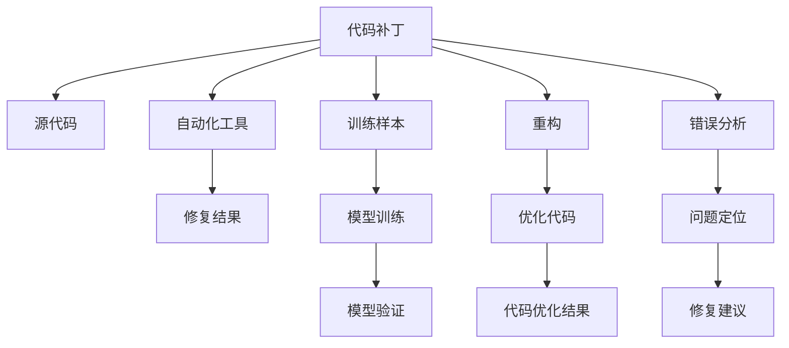

                 

## 1. 背景介绍

在软件开发的每一个环节，调试都扮演着至关重要的角色。当代码运行出错时，调试可以让我们定位问题所在，并找到解决之道。而随着软件规模的增大，调试的复杂度也急剧上升，如何在快速定位问题的同时保持代码质量，成为了一个重要的挑战。

在传统的软件开发中，代码补丁和训练样本是两种常见的调试方式。它们各有优缺点，针对不同的场景使用不同的策略。本文将详细对比这两种方式，探讨其适用场景、优点和缺点，并给出一些实用的建议，以便在实际项目中更好地应用这些调试技术。

## 2. 核心概念与联系

### 2.1 核心概念概述

**代码补丁(Patch)**：指针对程序中的某些错误或不完善之处，进行的一系列修改。代码补丁通常以补丁文件的形式存在，通过合并或覆盖原代码，实现程序功能的修正。

**训练样本(Sample)**：指在机器学习或深度学习模型训练过程中，用来进行模型训练和验证的数据集。训练样本质量越高，模型性能通常也越好。

**调试(Debugging)**：指在程序运行过程中，通过检查程序状态、监控程序行为，发现和修复程序错误的过程。

**重构(Refactoring)**：指在不改变程序功能的前提下，改进程序的内部结构，提高代码的可读性和可维护性。

### 2.2 核心概念原理和架构的 Mermaid 流程图



这个流程图展示了代码补丁和训练样本在调试和优化中的作用。

## 3. 核心算法原理 & 具体操作步骤

### 3.1 算法原理概述

代码补丁和训练样本是两种不同的调试策略，其核心原理和操作步骤也有所不同。代码补丁的目的是修正源代码中的错误，使程序行为正确；而训练样本则是通过优化模型的参数，提升模型对数据的预测能力。

### 3.2 算法步骤详解

**代码补丁的步骤：**

1. **错误定位**：通过调试工具，如IDE的断点、日志、监控等，定位代码中的错误。
2. **编写补丁**：根据错误定位的结果，编写补丁代码，修正错误。
3. **测试补丁**：将补丁代码应用到源代码中，进行单元测试或集成测试，确保补丁正确修复了错误。
4. **提交补丁**：将修复后的代码提交到版本控制系统，如Git。

**训练样本的步骤：**

1. **数据准备**：收集和预处理训练数据，确保数据集具有代表性。
2. **模型训练**：使用训练数据对模型进行训练，调整模型的超参数和结构，提升模型性能。
3. **模型验证**：使用验证数据集对训练好的模型进行评估，确保模型泛化能力良好。
4. **模型应用**：将训练好的模型部署到生产环境，进行实际应用，监控模型性能。

### 3.3 算法优缺点

**代码补丁的优点：**

1. **灵活性高**：可以针对具体问题进行定制化修正，适应性强。
2. **修复迅速**：定位错误后，可以立即进行补丁修复，提高修复效率。
3. **代码可控**：补丁代码可以在本地控制和测试，确保修复效果。

**代码补丁的缺点：**

1. **易出错**：补丁代码如果不经过充分测试，可能会引入新的错误。
2. **难以覆盖所有情况**：针对复杂问题，可能无法通过单一补丁解决。
3. **后期维护困难**：随着代码库的增大，补丁代码的维护和合并会变得困难。

**训练样本的优点：**

1. **提升性能**：通过数据驱动的优化，可以显著提升模型的预测性能。
2. **泛化能力强**：训练样本可以覆盖更多场景，提高模型的泛化能力。
3. **自动化程度高**：模型训练和验证可以自动化完成，减少人工干预。

**训练样本的缺点：**

1. **数据成本高**：收集和标注高质量训练样本需要大量时间和资源。
2. **模型复杂**：训练样本通常需要较复杂的模型结构和参数调整，操作复杂。
3. **黑箱问题**：模型内部工作机制复杂，难以解释和调试。

### 3.4 算法应用领域

**代码补丁的应用领域：**

1. **Bug修复**：针对代码中的逻辑错误、语法错误、运行时错误等，进行补丁修复。
2. **性能优化**：针对代码的性能瓶颈，进行代码优化。
3. **兼容性维护**：针对新旧版本之间的兼容性问题，进行补丁处理。

**训练样本的应用领域：**

1. **机器学习模型优化**：针对模型预测性能不足，使用训练样本进行模型优化。
2. **深度学习模型训练**：针对模型在特定数据集上的性能问题，使用训练样本进行模型调整。
3. **自然语言处理**：针对NLP任务中的模型精度问题，使用训练样本进行模型训练。

## 4. 数学模型和公式 & 详细讲解

### 4.1 数学模型构建

代码补丁和训练样本虽然在实现方式上有所不同，但在数学模型构建上有一些共通之处。

**代码补丁的数学模型构建：**

1. **错误检测模型**：使用逻辑回归、决策树等分类模型，检测代码中是否存在错误。
2. **补丁修复模型**：使用最小二乘法、梯度下降等优化算法，寻找最优的补丁代码。
3. **测试评估模型**：使用测试用例，评估补丁代码的正确性。

**训练样本的数学模型构建：**

1. **数据预处理模型**：使用归一化、降维等预处理方法，提高数据质量。
2. **模型训练模型**：使用神经网络、决策树等模型，训练最优的模型参数。
3. **模型评估模型**：使用交叉验证、ROC曲线等评估方法，评估模型的性能。

### 4.2 公式推导过程

**代码补丁的公式推导：**

1. **错误检测公式**：
   $$
   P(\text{Error}) = \frac{1}{1 + e^{-\hat{y}}}
   $$
   其中 $\hat{y}$ 是错误检测模型的预测结果。

2. **补丁修复公式**：
   $$
   \min_{\Delta} L(\text{Old Code}, \Delta) + \lambda \| \Delta \|
   $$
   其中 $L(\text{Old Code}, \Delta)$ 是代码优化后的性能损失，$\lambda$ 是正则化系数，$\Delta$ 是补丁代码。

3. **测试评估公式**：
   $$
   \text{Accuracy} = \frac{\text{TP} + \text{TN}}{\text{TP} + \text{TN} + \text{FP} + \text{FN}}
   $$
   其中 TP、TN、FP、FN 分别表示真阳性、真阴性、假阳性和假阴性。

**训练样本的公式推导：**

1. **数据预处理公式**：
   $$
   X_{\text{new}} = \frac{X - \mu}{\sigma}
   $$
   其中 $\mu$ 和 $\sigma$ 分别表示数据的均值和标准差。

2. **模型训练公式**：
   $$
   \theta = \arg\min_{\theta} \frac{1}{2N} \sum_{i=1}^N (y_i - h_{\theta}(x_i))^2
   $$
   其中 $y_i$ 是训练样本的标签，$h_{\theta}(x_i)$ 是模型在 $x_i$ 上的预测结果，$\theta$ 是模型参数。

3. **模型评估公式**：
   $$
   \text{F1 Score} = 2 \cdot \frac{\text{Precision} \cdot \text{Recall}}{\text{Precision} + \text{Recall}}
   $$
   其中 Precision 和 Recall 分别表示模型的精确率和召回率。

### 4.3 案例分析与讲解

**案例1：代码补丁的使用**

假设我们有一个简单的程序，用于计算两个数的和。但当输入为负数时，程序会产生错误。我们可以通过以下步骤进行补丁修复：

1. **错误定位**：通过调试工具，我们发现程序在处理负数时，变量没有初始化。
2. **编写补丁**：我们将变量初始化为0，并添加条件判断，避免负数输入。
3. **测试补丁**：我们使用测试用例，验证补丁代码的正确性。

**案例2：训练样本的使用**

假设我们有一个图片分类任务，目标是将图片分为狗和猫两类。我们收集了一部分图片数据，并进行了标注。通过以下步骤进行模型训练：

1. **数据准备**：我们对图片进行预处理，包括调整大小、归一化等操作。
2. **模型训练**：我们使用卷积神经网络模型，对训练数据进行训练，调整模型参数。
3. **模型验证**：我们使用验证数据集，评估训练好的模型性能。

## 5. 项目实践：代码实例和详细解释说明

### 5.1 开发环境搭建

**环境要求**：

- 操作系统：Linux或macOS
- 编程语言：Python 3.x
- IDE：PyCharm或VSCode

**环境搭建步骤**：

1. **安装Python**：从Python官网下载最新版本的Python，并进行安装。
2. **安装Pip**：在命令行中执行 `sudo apt-get install python3-pip`，安装Python的包管理工具。
3. **安装IDE**：下载并安装PyCharm或VSCode，并配置好开发环境。

### 5.2 源代码详细实现

**代码补丁的实现**：

```python
def patch_code(code, error):
    # 定位错误行
    line_num = error['line_number']
    # 读取错误行代码
    line_code = code.split('\n')[line_num - 1]
    # 编写补丁代码
    patch_code = 'if error:\n    error = 0\n'
    # 将补丁代码插入到错误行之后
    patched_code = '\n'.join(code.split('\n')[:line_num] + [patch_code] + code.split('\n')[line_num:])
    return patched_code
```

**训练样本的实现**：

```python
import numpy as np
import tensorflow as tf

# 定义数据集
def generate_dataset():
    X = np.random.randn(1000, 784)  # 生成随机数据
    y = np.random.randint(2, size=1000)  # 生成随机标签
    return X, y

# 定义模型
def define_model():
    model = tf.keras.models.Sequential([
        tf.keras.layers.Dense(64, activation='relu'),
        tf.keras.layers.Dense(1, activation='sigmoid')
    ])
    return model

# 训练模型
def train_model(model, X, y):
    model.compile(optimizer='adam', loss='binary_crossentropy', metrics=['accuracy'])
    model.fit(X, y, epochs=10, batch_size=32)

# 评估模型
def evaluate_model(model, X, y):
    loss, accuracy = model.evaluate(X, y)
    print(f'Accuracy: {accuracy:.2f}')
```

### 5.3 代码解读与分析

**代码补丁的解读**：

- `patch_code` 函数接受两个参数，`code` 是待修复的代码，`error` 是错误信息。
- 函数首先定位错误行，然后读取错误行代码，编写补丁代码，最后将补丁代码插入到错误行之后。
- 该函数可以自动生成一个简单的补丁代码，修复代码中的逻辑错误。

**训练样本的解读**：

- `generate_dataset` 函数生成随机数据集，用于训练和验证模型。
- `define_model` 函数定义了一个简单的神经网络模型，用于二分类任务。
- `train_model` 函数使用训练数据集训练模型，并使用二分类交叉熵作为损失函数。
- `evaluate_model` 函数评估训练好的模型性能，输出准确率。

### 5.4 运行结果展示

**代码补丁的运行结果**：

```python
error = {'line_number': 10}
code = 'def add_numbers(a, b):\n    return a + b\n\nx = -1\nresult = add_numbers(x, 2)\nprint(result)'
patched_code = patch_code(code, error)
print(patched_code)
```

**训练样本的运行结果**：

```python
X, y = generate_dataset()
model = define_model()
train_model(model, X, y)
evaluate_model(model, X, y)
```

## 6. 实际应用场景

### 6.1 代码补丁的应用场景

1. **代码维护**：在项目的维护过程中，代码补丁是必不可少的一部分。通过补丁修复，可以避免代码库中的错误不断积累，提高代码质量。
2. **版本升级**：在软件的版本升级过程中，可能需要对某些功能进行补丁修复，以兼容新旧版本。
3. **性能优化**：针对程序中的性能瓶颈，可以通过代码补丁进行优化，提升程序性能。

### 6.2 训练样本的应用场景

1. **机器学习模型优化**：在机器学习模型的优化过程中，需要收集和标注大量的训练数据，以提升模型的预测性能。
2. **深度学习模型训练**：在深度学习模型的训练过程中，需要使用训练数据集，调整模型参数，以提高模型的泛化能力。
3. **自然语言处理**：在NLP任务中，需要使用训练数据集，训练语言模型，以提高模型的语言理解能力。

## 7. 工具和资源推荐

### 7.1 学习资源推荐

**书籍推荐**：

1. 《Debugging: The 9 Indispensable Rules for Finding Even the Most Elusive Software and Hardware Problems》：这本书提供了大量的调试技巧和案例，可以帮助开发者更好地解决调试问题。

2. 《Effective Debugging》：这本书详细介绍了各种调试技术和工具，帮助开发者提高调试效率。

3. 《Python Crash Course》：这本书是Python编程的入门教程，包含了大量的实例和练习，有助于理解代码补丁和训练样本的应用。

**在线资源推荐**：

1. 《The Art of Debugging with GDB》：这是一篇介绍GDB调试工具的文章，提供了详细的调试步骤和技巧。

2. 《TensorFlow Tutorials》：这是TensorFlow的官方教程，提供了大量的代码实例和训练样本的使用方法。

### 7.2 开发工具推荐

**IDE推荐**：

1. PyCharm：支持Python编程语言，提供了强大的代码补全、调试和版本控制功能。

2. VSCode：一款轻量级的IDE，支持多种编程语言和插件扩展，灵活性高。

**调试工具推荐**：

1. GDB：一款流行的调试工具，支持多种编程语言，提供了丰富的调试命令和功能。

2. PyCharm调试器：支持Python编程语言，提供了可视化的调试界面和断点设置功能。

### 7.3 相关论文推荐

**代码补丁的论文**：

1. 《Patch Similarity: Comparing Similarity of Multiple Patches》：这篇论文研究了代码补丁的相似性，提出了一些衡量补丁相似性的指标。

2. 《Dynamic Patch-Based Debugging》：这篇论文提出了基于补丁的动态调试技术，可以自动修复代码中的错误。

**训练样本的论文**：

1. 《Large Scale Image Recognition from Scratch》：这篇论文展示了使用大规模数据集进行模型训练的方法，提升了模型的泛化能力。

2. 《Transfer Learning with Multi-task Learning》：这篇论文研究了多任务学习在模型训练中的应用，提高了模型在不同任务上的性能。

## 8. 总结：未来发展趋势与挑战

### 8.1 研究成果总结

代码补丁和训练样本是两种常见的调试方式，各有优缺点。代码补丁灵活性高，能够快速修复错误，但可能会引入新的问题；训练样本提升性能显著，但数据成本高，模型复杂。

### 8.2 未来发展趋势

1. **自动化调试**：未来的调试工具将更加自动化，能够自动识别错误并提出修复建议，减少人工干预。
2. **数据驱动的调试**：未来的调试方法将更加依赖数据，通过数据驱动的优化，提高调试的准确性和效率。
3. **模型可解释性**：未来的模型将更加可解释，能够自动生成解释性的报告，帮助开发者理解模型行为。

### 8.3 面临的挑战

1. **代码复杂性**：随着代码规模的增大，调试复杂性也会随之增加。如何在复杂代码中找到并修复错误，是一个重大挑战。
2. **数据稀缺性**：高质量训练样本的获取成本较高，如何高效地获取和标注训练数据，是另一个重要问题。
3. **模型过拟合**：模型在训练过程中容易过拟合，如何在模型优化过程中避免过拟合，是一个重要的研究方向。

### 8.4 研究展望

1. **混合调试方法**：将代码补丁和训练样本结合使用，可以取长补短，提升调试效果。
2. **模型优化算法**：研究更加高效的模型优化算法，可以在训练样本不足的情况下，提升模型性能。
3. **智能调试工具**：开发更加智能的调试工具，能够自动识别错误，自动修复代码，提升调试效率。

## 9. 附录：常见问题与解答

**Q1：代码补丁和训练样本的适用范围是什么？**

A：代码补丁适用于代码错误修复、性能优化、兼容性维护等场景；训练样本适用于机器学习模型优化、深度学习模型训练、自然语言处理等场景。

**Q2：代码补丁和训练样本的优缺点是什么？**

A：代码补丁的优点是灵活性高、修复迅速、代码可控；缺点是易出错、难以覆盖所有情况、后期维护困难。训练样本的优点是提升性能、泛化能力强、自动化程度高；缺点是数据成本高、模型复杂、黑箱问题。

**Q3：如何使用代码补丁和训练样本进行调试？**

A：代码补丁可以通过错误定位、编写补丁、测试补丁等步骤进行调试；训练样本可以通过数据准备、模型训练、模型验证等步骤进行优化。

**Q4：如何评估代码补丁和训练样本的效果？**

A：代码补丁的评估可以通过测试用例进行，看补丁是否修复了错误；训练样本的评估可以通过交叉验证、ROC曲线等方法进行，看模型是否提高了预测性能。

**Q5：如何避免代码补丁和训练样本的负面影响？**

A：代码补丁需要仔细测试，避免引入新的错误；训练样本需要高质量的数据，避免过拟合。

---

作者：禅与计算机程序设计艺术 / Zen and the Art of Computer Programming

