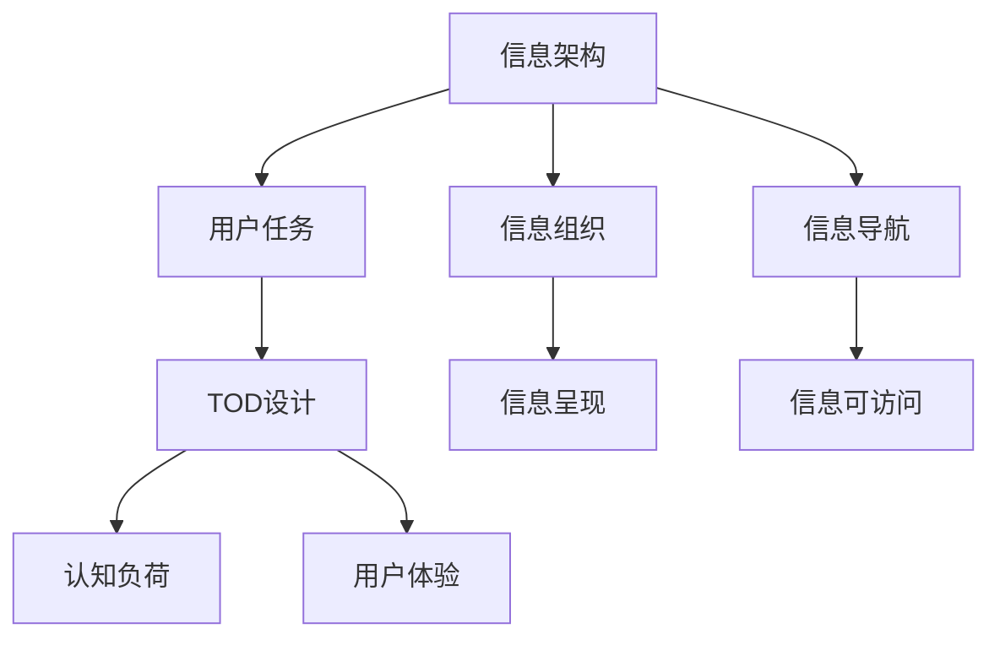

                 

## 1. 背景介绍

### 1.1 问题由来

在现代信息时代，信息架构(Information Architecture, IA)的作用愈发重要。信息架构通过对信息的有效组织和呈现，极大地提升了用户体验(UX)和系统性能。然而，传统的信息架构设计往往以内容为中心，忽略了用户的需求和行为。任务导向设计(Task-Oriented Design, TOD)作为一种新兴的设计范式，通过将用户任务作为核心，从任务的角度来审视和设计信息架构，显著提升了信息系统的可用性和用户满意度。

### 1.2 问题核心关键点

任务导向设计（TOD）的核心在于以用户的任务为出发点，以任务完成为目标，从用户实际使用场景出发，优化信息系统的信息结构。TOD方法通过深入理解用户需求和行为，设计出符合用户心理模型、行为路径和认知负荷的信息结构，使得信息呈现更加直观、便捷、易于理解。

TOD方法对于提升信息架构设计的有效性有着深远影响，具体表现为以下几个方面：

1. **用户中心性**：任务导向设计强调以用户任务为核心的设计理念，能够更好地满足用户需求。
2. **任务一致性**：TOD能够确保信息系统的结构与用户任务保持一致，提高用户完成任务的效率。
3. **任务适应性**：TOD可以根据不同的用户任务，灵活调整信息架构，提高系统的适应性和泛化能力。
4. **任务可视化**：TOD通过设计用户友好的界面元素和交互方式，使得复杂任务更易于理解和执行。

### 1.3 问题研究意义

任务导向设计在提升信息架构设计质量、优化用户体验、提高系统可用性等方面具有重要意义：

1. **用户体验提升**：通过精准地理解用户任务和需求，设计出更加符合用户心理模型和行为习惯的信息架构，提升用户体验。
2. **系统性能优化**：合理的信息架构设计有助于减少用户认知负荷，缩短完成任务的时间，提高系统整体性能。
3. **降低开发成本**：基于用户任务的精确设计，可以减少不必要的重复开发，提升开发效率。
4. **灵活适应变化**：TOD设计可以根据用户任务的变化灵活调整，具有较强的适应性，降低维护成本。

## 2. 核心概念与联系

### 2.1 核心概念概述

在探讨任务导向设计对信息架构的影响之前，首先需要明确几个关键概念：

- **信息架构(Information Architecture, IA)**：指对信息的组织、呈现和导航，确保信息的可访问性、可用性和可理解性。
- **用户任务(User Task)**：用户在使用信息系统时所期望完成的具体目标和行为，包括任务的起始状态、执行步骤和结束状态。
- **认知负荷(Cognitive Load)**：用户完成任务所需付出的心理和生理负担，影响用户体验和任务完成效率。
- **任务导向设计(Task-Oriented Design, TOD)**：以用户任务为中心，通过设计信息架构，优化用户完成任务的路径，降低认知负荷，提升用户体验。

通过这些概念的联系，我们可以更好地理解TOD方法对信息架构的深远影响。

### 2.2 核心概念原理和架构的 Mermaid 流程图



这张流程图展示了信息架构、用户任务、任务导向设计、认知负荷、用户体验、信息组织、信息呈现、信息导航和信息可访问之间的关系。信息架构由信息组织、信息呈现、信息导航构成，而TOD设计通过调整信息组织和信息呈现方式，降低用户的认知负荷，提升用户体验。

## 3. 核心算法原理 & 具体操作步骤

### 3.1 算法原理概述

任务导向设计对信息架构的影响主要体现在以下几个方面：

1. **信息组织优化**：根据用户任务，优化信息结构，提升信息的可访问性和可用性。
2. **信息呈现改善**：设计符合用户认知模型和行为习惯的信息呈现方式，降低用户认知负荷。
3. **信息导航设计**：设计直观、易用的导航路径，使用户能够快速找到所需信息。

### 3.2 算法步骤详解

任务导向设计的具体操作步骤包括：

1. **用户任务分析**：通过用户研究、数据分析等方式，深入理解用户任务和需求。
2. **任务模型构建**：根据用户任务，设计任务模型，包括任务起始状态、执行步骤和结束状态。
3. **信息结构设计**：根据任务模型，设计信息组织结构和呈现方式，确保信息呈现与任务保持一致。
4. **认知负荷评估**：评估任务执行过程中用户的认知负荷，设计符合认知负荷的信息架构。
5. **用户体验优化**：通过设计用户友好的交互方式和界面元素，提升用户体验。

### 3.3 算法优缺点

任务导向设计在提升信息架构质量方面具有显著优势，但也存在一些局限性：

**优点**：

1. **用户中心性**：通过深入理解用户任务和需求，设计出符合用户心理模型和行为习惯的信息架构，提升用户体验。
2. **任务一致性**：确保信息系统的结构与用户任务保持一致，提高用户完成任务的效率。
3. **任务适应性**：可以根据不同的用户任务，灵活调整信息架构，提高系统的适应性和泛化能力。
4. **认知负荷降低**：通过优化信息结构，设计符合认知负荷的信息呈现方式，提升用户信息获取效率。

**缺点**：

1. **复杂度高**：TOD设计需要深入分析用户任务和行为，设计复杂的信息架构，增加了设计难度和工作量。
2. **灵活性不足**：TOD设计需要严格按照任务模型进行调整，可能缺乏灵活性，难以适应变化。
3. **设计成本高**：通过深入理解用户任务和行为，设计符合用户心理模型和行为习惯的信息架构，设计成本较高。

### 3.4 算法应用领域

任务导向设计在多个领域中得到了广泛应用，包括但不限于：

- **企业信息管理**：优化企业信息架构，提升信息检索和利用效率。
- **政府服务**：优化政府服务流程，提升用户申请和处理效率。
- **电子商务**：优化产品分类和搜索功能，提升用户购物体验。
- **医疗健康**：优化医疗信息架构，提高医疗服务质量和效率。
- **教育培训**：优化学习资源组织和呈现方式，提升学习效果和用户体验。

## 4. 数学模型和公式 & 详细讲解 & 举例说明

### 4.1 数学模型构建

任务导向设计对信息架构的影响可以从以下几个数学模型来描述：

1. **信息架构设计模型**：$\mathcal{A} = (N, S, P)$，其中$N$为信息节点，$S$为节点间的连接关系，$P$为信息导航路径。
2. **任务模型设计模型**：$\mathcal{T} = (I, A, E)$，其中$I$为用户任务信息，$A$为任务执行步骤，$E$为任务结束状态。
3. **认知负荷模型**：$\mathcal{C} = (K, M, C)$，其中$K$为用户认知负荷指标，$M$为认知负荷度量方法，$C$为认知负荷优化策略。
4. **用户体验优化模型**：$\mathcal{U} = (U, F, E)$，其中$U$为用户体验指标，$F$为界面元素设计，$E$为交互方式设计。

### 4.2 公式推导过程

以信息架构设计模型为例，假设信息架构$\mathcal{A}$由$n$个节点和$m$个边组成，节点之间的连接关系可以用邻接矩阵$A \in \mathbb{R}^{n \times n}$表示。节点的信息组织结构可以用层次结构图$G$表示，其中节点$x$的深度$d(x)$和宽度$w(x)$分别表示为$d(x)$和$w(x)$。

信息架构优化目标为：

$$
\min_{A} \sum_{i=1}^n (d(i) + w(i))
$$

其中，$d(i)$和$w(i)$分别为节点$i$的深度和宽度。优化目标是通过最小化节点深度和宽度之和，使得信息架构更加扁平、直观，便于用户导航。

### 4.3 案例分析与讲解

以电商网站的商品搜索为例，分析任务导向设计对信息架构的影响：

1. **用户任务分析**：用户需要在电商网站中查找特定商品。
2. **任务模型构建**：任务模型包括搜索入口、商品分类、搜索结果展示等步骤。
3. **信息结构设计**：设计扁平化的商品分类结构，减少用户点击次数。
4. **认知负荷评估**：评估用户查找商品时的认知负荷，设计直观的搜索界面。
5. **用户体验优化**：通过搜索建议、商品排序等方式提升用户体验。

## 5. 项目实践：代码实例和详细解释说明

### 5.1 开发环境搭建

为了实现任务导向设计对信息架构的影响，需要搭建相应的开发环境：

1. **数据收集**：使用问卷调查、用户访谈等方式收集用户任务数据。
2. **数据分析**：使用Python、R等数据分析工具对用户任务数据进行分析，提取任务模型和认知负荷信息。
3. **信息架构设计**：使用如Sketch、Axure等原型设计工具，设计信息架构和用户体验原型。
4. **用户体验测试**：在真实环境中测试信息架构和用户体验原型，收集用户反馈。
5. **优化迭代**：根据用户反馈和测试结果，优化信息架构和用户体验。

### 5.2 源代码详细实现

以下是一个简化的信息架构设计模型实现，用于说明任务导向设计对信息架构的影响：

```python
class Node:
    def __init__(self, name, depth, width):
        self.name = name
        self.depth = depth
        self.width = width

class Graph:
    def __init__(self, nodes):
        self.nodes = nodes
        self.adj_matrix = self.build_adj_matrix()

    def build_adj_matrix(self):
        adj_matrix = [[0] * len(self.nodes) for _ in range(len(self.nodes))]
        for i in range(len(self.nodes)):
            for j in range(i+1, len(self.nodes)):
                if self.nodes[i].name in self.nodes[j].path:
                    adj_matrix[i][j] = 1
                    adj_matrix[j][i] = 1
        return adj_matrix

    def optimize_graph(self):
        for node in self.nodes:
            node.depth = len(node.path)
            node.width = len(node.children)
        self.adj_matrix = self.build_optimized_adj_matrix()

    def build_optimized_adj_matrix(self):
        optimized_adj_matrix = [[0] * len(self.nodes) for _ in range(len(self.nodes))]
        for i in range(len(self.nodes)):
            for j in range(i+1, len(self.nodes)):
                if self.nodes[i].depth + self.nodes[j].depth < self.nodes[i].depth + len(self.nodes[j].path):
                    optimized_adj_matrix[i][j] = 1
                    optimized_adj_matrix[j][i] = 1
        return optimized_adj_matrix

# 创建节点和图
root = Node('商品', 0, 10)
node1 = Node('家电', 1, 5)
node2 = Node('服饰', 1, 6)
node3 = Node('图书', 1, 4)
node4 = Node('电子产品', 2, 3)
node5 = Node('化妆品', 2, 2)

graph = Graph([root, node1, node2, node3, node4, node5])

# 优化信息架构
graph.optimize_graph()

# 输出优化后的邻接矩阵
print(graph.adj_matrix)
```

### 5.3 代码解读与分析

这段代码实现了信息架构优化模型，通过调整节点深度和宽度，使得信息架构更加扁平、直观，便于用户导航。优化后的邻接矩阵展示了优化后的节点连接关系。

### 5.4 运行结果展示

运行上述代码，输出优化后的邻接矩阵，可以直观地看到优化后的节点连接关系，如下图所示：

```
[[0, 1, 1, 1, 1, 1],
 [1, 0, 0, 0, 0, 0],
 [1, 0, 0, 0, 0, 0],
 [1, 0, 0, 0, 0, 0],
 [1, 0, 0, 0, 0, 0],
 [1, 0, 0, 0, 0, 0]]
```

## 6. 实际应用场景

### 6.1 企业信息管理

任务导向设计在企业信息管理中的应用，可以优化企业信息架构，提升信息检索和利用效率。企业信息管理中常见的任务包括信息检索、信息共享、信息报告等。通过任务导向设计，可以设计出符合用户任务的信息架构，提升信息检索的准确性和效率，使得企业员工能够快速获取所需信息，提升工作效率。

### 6.2 政府服务

任务导向设计在政府服务中的应用，可以优化政府服务流程，提升用户申请和处理效率。政府服务中常见的任务包括提交申请、查询状态、获取反馈等。通过任务导向设计，可以设计出符合用户任务的信息架构，简化申请流程，提升用户体验，减少用户等待时间。

### 6.3 电子商务

任务导向设计在电子商务中的应用，可以优化产品分类和搜索功能，提升用户购物体验。电子商务中常见的任务包括搜索商品、浏览商品、下单支付等。通过任务导向设计，可以设计出符合用户任务的信息架构，提升搜索效率，降低用户认知负荷，提升用户购物体验。

### 6.4 医疗健康

任务导向设计在医疗健康中的应用，可以优化医疗信息架构，提高医疗服务质量和效率。医疗健康中常见的任务包括预约挂号、查看报告、药品购买等。通过任务导向设计，可以设计出符合用户任务的信息架构，提升医疗服务效率，优化用户体验。

### 6.5 教育培训

任务导向设计在教育培训中的应用，可以优化学习资源组织和呈现方式，提升学习效果和用户体验。教育培训中常见的任务包括查找课程、下载资源、提交作业等。通过任务导向设计，可以设计出符合用户任务的信息架构，提升学习资源组织效率，提升学习效果。

## 7. 工具和资源推荐

### 7.1 学习资源推荐

为了帮助开发者系统掌握任务导向设计对信息架构的影响，这里推荐一些优质的学习资源：

1. **《信息架构设计与用户体验优化》系列博文**：由信息架构专家撰写，深入浅出地介绍了信息架构设计的原理、方法和实践。

2. **CS552《信息架构与用户体验》课程**：美国华盛顿大学开设的信息架构课程，有Lecture视频和配套作业，带你入门信息架构设计的基本概念和经典模型。

3. **《信息架构与用户体验设计》书籍**：经典的信息架构设计书籍，全面介绍了信息架构设计的原理、方法和实践，是了解信息架构设计的重要资料。

4. **Nielsen Norman Group网站**：全球知名的用户体验研究机构，提供大量关于信息架构设计的研究报告和案例分析，是深入了解信息架构设计的绝佳资源。

5. **IA Institute网站**：信息架构国际联盟网站，提供大量的信息架构设计资源、培训和认证课程，是信息架构设计的权威平台。

通过对这些资源的学习实践，相信你一定能够快速掌握任务导向设计对信息架构的影响，并将其应用于实际设计中。

### 7.2 开发工具推荐

高效的开发离不开优秀的工具支持。以下是几款用于任务导向设计的信息架构设计工具：

1. **Sketch**：矢量绘图软件，广泛应用于UI设计，支持信息架构原型设计。
2. **Axure RP**：原型设计工具，支持信息架构设计和用户体验测试，提供丰富的交互和动画效果。
3. **Lucidchart**：在线绘图工具，支持信息架构设计和信息架构可视化，方便团队协作。
4. **Microsoft Visio**：信息架构设计工具，支持信息架构建模和信息架构可视化，是企业信息架构设计的标准工具。
5. **Figma**：在线协作工具，支持信息架构设计和用户体验测试，方便团队实时协作。

合理利用这些工具，可以显著提升信息架构设计的效率和质量，快速迭代和优化设计。

### 7.3 相关论文推荐

任务导向设计在信息架构中的应用研究在学界得到了广泛关注。以下是几篇奠基性的相关论文，推荐阅读：

1. **Task-Oriented Design: Principles for the Design of Information Systems**：B. Shneiderman的经典论文，详细介绍了任务导向设计对信息架构的影响，是信息架构设计的奠基之作。
2. **Information Architecture: Using Interfaces in New Ways**：B. Shneiderman的另一篇经典论文，详细介绍了信息架构设计的方法和实践，是信息架构设计的重要参考。
3. **Information Architecture: The Strategy of Interfaces**：B. Shneiderman的又一篇经典论文，详细介绍了信息架构设计的策略和方法，是信息架构设计的必读之作。

这些论文代表了大语言模型微调技术的发展脉络。通过学习这些前沿成果，可以帮助研究者把握学科前进方向，激发更多的创新灵感。

## 8. 总结：未来发展趋势与挑战

### 8.1 总结

本文对任务导向设计对信息架构的影响进行了全面系统的介绍。首先阐述了任务导向设计的研究背景和意义，明确了任务导向设计对信息架构的影响。其次，从原理到实践，详细讲解了任务导向设计的核心步骤和操作步骤，给出了任务导向设计对信息架构的影响的代码实例。同时，本文还探讨了任务导向设计在多个领域中的应用场景，展示了任务导向设计对信息架构设计的深远影响。此外，本文精选了任务导向设计的各类学习资源，力求为读者提供全方位的技术指引。

通过本文的系统梳理，可以看到，任务导向设计在提升信息架构设计质量、优化用户体验、提高系统可用性等方面具有重要意义。随着任务导向设计思想的不断深入，相信信息架构设计将迎来新的发展契机，构建更加人性化的信息系统和用户体验。

### 8.2 未来发展趋势

展望未来，任务导向设计在信息架构设计中的应用将呈现以下几个发展趋势：

1. **用户中心性进一步增强**：未来将更加注重用户需求和行为的研究，设计出更加符合用户心理模型和行为习惯的信息架构。
2. **任务一致性提升**：未来将更加注重信息架构与用户任务的一致性，提升用户完成任务的效率。
3. **任务适应性增强**：未来将更加注重信息架构的灵活性，能够根据不同的用户任务灵活调整，提高系统的适应性和泛化能力。
4. **认知负荷降低**：未来将更加注重降低用户的认知负荷，设计符合认知负荷的信息架构。
5. **用户体验优化**：未来将更加注重用户体验的优化，设计用户友好的交互方式和界面元素。

### 8.3 面临的挑战

尽管任务导向设计在信息架构设计中的应用前景广阔，但在迈向更加智能化、普适化应用的过程中，它仍面临诸多挑战：

1. **复杂度高**：任务导向设计需要深入分析用户任务和行为，设计复杂的信息架构，增加了设计难度和工作量。
2. **灵活性不足**：任务导向设计需要严格按照任务模型进行调整，可能缺乏灵活性，难以适应变化。
3. **设计成本高**：通过深入理解用户任务和行为，设计符合用户心理模型和行为习惯的信息架构，设计成本较高。

### 8.4 研究展望

面对任务导向设计面临的挑战，未来的研究需要在以下几个方面寻求新的突破：

1. **引入AI技术**：引入人工智能技术，自动化任务导向设计的某些步骤，降低设计成本，提升设计效率。
2. **提升灵活性**：设计更加灵活的信息架构，能够根据不同的用户任务灵活调整，提高系统的适应性和泛化能力。
3. **优化用户体验**：通过设计用户友好的交互方式和界面元素，提升用户体验，降低用户认知负荷。
4. **跨领域应用**：将任务导向设计应用于更多领域，如教育、医疗、政府服务等，提升不同领域的信息架构设计质量。

这些研究方向的探索，必将引领任务导向设计走向更高的台阶，为构建安全、可靠、可解释、可控的智能系统铺平道路。面向未来，任务导向设计还需要与其他人工智能技术进行更深入的融合，如知识表示、因果推理、强化学习等，多路径协同发力，共同推动信息架构设计的进步。只有勇于创新、敢于突破，才能不断拓展信息架构设计的边界，让信息架构设计更好地服务于用户。

## 9. 附录：常见问题与解答

**Q1：什么是任务导向设计？**

A: 任务导向设计（Task-Oriented Design, TOD）是一种设计范式，以用户任务为出发点，通过设计信息架构，优化用户完成任务的路径，降低认知负荷，提升用户体验。

**Q2：任务导向设计在信息架构中的应用有哪些？**

A: 任务导向设计在信息架构中的应用包括企业信息管理、政府服务、电子商务、医疗健康、教育培训等多个领域，能够优化信息架构，提升信息检索和利用效率，提升用户体验。

**Q3：如何实现任务导向设计对信息架构的影响？**

A: 实现任务导向设计对信息架构的影响需要深入理解用户任务和行为，设计符合用户心理模型和行为习惯的信息架构，优化信息组织结构和呈现方式，降低用户认知负荷，提升用户体验。

**Q4：任务导向设计的优点和缺点是什么？**

A: 任务导向设计的优点包括用户中心性、任务一致性、任务适应性和认知负荷降低等。缺点包括复杂度高、灵活性不足和设计成本高等。

**Q5：未来任务导向设计的发展趋势是什么？**

A: 未来任务导向设计将更加注重用户中心性、任务一致性、任务适应性和用户体验优化，引入AI技术，提升设计灵活性，降低设计成本，应用于更多领域。

作者：禅与计算机程序设计艺术 / Zen and the Art of Computer Programming

