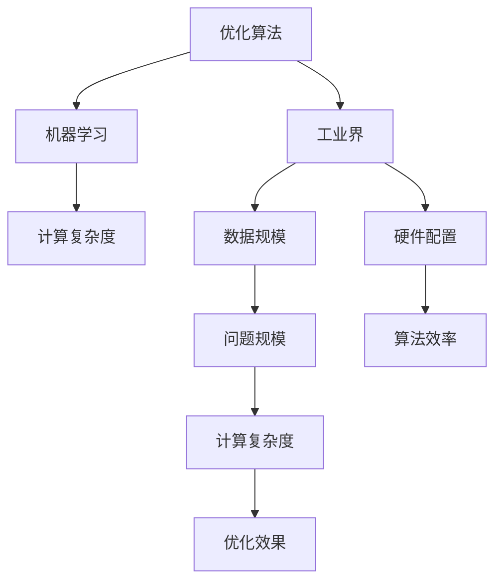

                 

## 1. 背景介绍

### 1.1 问题由来
在现代工业界，优化算法（Optimization Algorithms）的应用无处不在，从生产调度、物流优化到金融风控、网络路由，乃至人工智能（AI）中的机器学习（ML）模型训练等。优化算法的高效、可靠性能是推动各个行业技术进步的核心驱动力之一。然而，传统的优化算法如梯度下降（Gradient Descent）、牛顿法（Newton's Method）等，在大规模、高维度的问题上往往面临计算复杂度高、收敛速度慢等挑战，迫切需要新的算法来解决这些问题。

### 1.2 问题核心关键点
在当前的工业实践中，优化算法需要具备以下关键特点：

1. **高效性**：算法应能快速处理大规模、高维度问题，适应实时计算需求。
2. **稳定性**：算法应能在各种情况下稳定收敛，避免震荡和不稳定现象。
3. **可扩展性**：算法应能适应不同规模的数据和硬件配置。
4. **鲁棒性**：算法应能抵抗噪音、异常值等干扰，确保输出结果的可靠性。
5. **普适性**：算法应能适用于多种类型的优化问题，如线性、非线性、连续、离散等。

### 1.3 问题研究意义
研究优化算法在工业界的应用，对于提升各个行业的自动化、智能化水平，降低运营成本，提升决策质量，具有重要意义：

1. 提升效率：优化算法能够快速找到最优解或近似最优解，加速决策过程。
2. 降低成本：通过自动化优化，减少人力物力投入，降低生产运营成本。
3. 提高决策质量：优化算法通过科学计算，避免主观偏见，提升决策的准确性和可靠性。
4. 支持技术创新：优化算法为AI、ML等前沿技术的应用提供底层支撑，推动技术进步。
5. 赋能产业升级：优化算法在工业自动化中的应用，为各行各业数字化转型提供新动力。

## 2. 核心概念与联系

### 2.1 核心概念概述

为更好地理解优化算法在工业界的应用，本节将介绍几个关键概念及其联系：

- **优化算法（Optimization Algorithms）**：求解复杂优化问题的一类算法，如梯度下降（Gradient Descent）、牛顿法（Newton's Method）、遗传算法（Genetic Algorithm）等。
- **机器学习（Machine Learning）**：通过数据训练模型，使其具备自动预测、分类等能力。优化算法是训练模型的核心工具。
- **工业界（Industry）**：涵盖制造、物流、金融、医疗等多个领域的广泛实践，优化算法在这些领域的应用非常广泛。
- **计算复杂度（Computational Complexity）**：描述算法在计算资源（如CPU、GPU）上的运行时间与问题规模（如数据量、维度）的关系。

这些概念之间的关系可以通过以下Mermaid流程图来展示：



这个流程图展示了优化算法、机器学习、工业界与计算复杂度之间的联系：

1. 优化算法是机器学习中模型训练的核心工具。
2. 机器学习在工业界的应用广泛，需要高效的优化算法支持。
3. 工业界的不同领域对数据规模、硬件配置的要求各异，影响优化算法的效率。
4. 计算复杂度描述了算法在不同规模问题上的运行时间，影响优化效果。

## 3. 核心算法原理 & 具体操作步骤
### 3.1 算法原理概述

在工业界应用中，优化算法通常用于解决各种类型的优化问题。其核心思想是通过迭代求解，找到目标函数的最优解或近似最优解。优化问题的数学描述通常如下：

$$
\min_{x} f(x)
$$

其中 $f(x)$ 为待优化的目标函数，$x$ 为变量向量。

优化算法通过不断迭代更新 $x$，使得 $f(x)$ 逐步减小，直至收敛于最优解或稳定状态。常见的优化算法包括梯度下降（Gradient Descent）、牛顿法（Newton's Method）、遗传算法（Genetic Algorithm）等。这些算法各有优缺点，需要根据具体问题选择合适的算法。

### 3.2 算法步骤详解

以下以梯度下降算法为例，详细讲解其在工业界的应用步骤：

**Step 1: 初始化参数**
- 随机选择一个初始点 $x_0$。
- 设置学习率 $\eta$，迭代次数 $k$ 的阈值 $\epsilon$。

**Step 2: 计算梯度**
- 计算目标函数 $f(x)$ 在当前点 $x_k$ 的梯度 $\nabla f(x_k)$。
- 将梯度与学习率 $\eta$ 相乘，得到更新方向。

**Step 3: 更新参数**
- 根据更新方向，更新当前点 $x_k$，得到 $x_{k+1}$。
- 检查 $f(x_{k+1}) - f(x_k)$ 是否小于 $\epsilon$，若满足则停止迭代。

**Step 4: 重复执行**
- 重复执行步骤 2 和 3，直至满足停止条件。

梯度下降算法的伪代码如下：

```python
x = x_0
while (f(x) - f(x_prev) > epsilon):
    x_prev = x
    grad = gradient(f, x)
    x = x - eta * grad
```

### 3.3 算法优缺点

梯度下降算法在工业界应用广泛，具有以下优点和缺点：

**优点：**
1. 简单易实现：梯度下降算法原理直观，易于理解和实现。
2. 可扩展性强：适用于各种规模和类型的问题，容易并行化。
3. 收敛速度快：在低维问题上，梯度下降收敛速度较快。

**缺点：**
1. 依赖初始值：梯度下降的收敛路径依赖于初始值选择，不同初始值可能导致不同的结果。
2. 存在局部最优：梯度下降可能陷入局部最优，无法找到全局最优解。
3. 不适用于非凸问题：梯度下降在非凸问题上可能不收敛或收敛到错误的最优解。

### 3.4 算法应用领域

优化算法在工业界的应用领域非常广泛，包括但不限于：

1. **生产调度**：在制造企业中，优化算法用于优化生产计划、调度任务，提高生产效率。
2. **物流优化**：在物流公司中，优化算法用于优化配送路线、库存管理，降低物流成本。
3. **金融风控**：在金融行业，优化算法用于风险评估、投资组合优化，提升投资回报。
4. **网络路由**：在互联网公司，优化算法用于优化网络路由、负载均衡，提升网络性能。
5. **机器学习**：在人工智能领域，优化算法用于训练深度学习模型，提升模型性能。
6. **供应链管理**：在供应链管理中，优化算法用于优化供应链、降低库存成本，提升供应链效率。

## 4. 数学模型和公式 & 详细讲解 & 举例说明

### 4.1 数学模型构建

在工业界优化问题中，目标函数 $f(x)$ 可以是各种类型，如线性、二次、非线性等。下面以线性回归为例，介绍数学模型的构建过程。

假设已知 $n$ 个样本点 $(x_i, y_i)$，线性回归的目标是找到一个线性函数 $f(x) = \theta_0 + \theta_1 x_1 + \theta_2 x_2 + \cdots + \theta_n x_n$，使得目标函数 $f(x)$ 最小化，即：

$$
\min_{\theta} \sum_{i=1}^n (y_i - f(x_i))^2
$$

其中 $\theta = (\theta_0, \theta_1, \theta_2, \cdots, \theta_n)^T$。

### 4.2 公式推导过程

梯度下降算法在求解上述目标函数时，需要计算目标函数在当前点 $x$ 的梯度 $\nabla f(x)$，更新方向为 $-\nabla f(x)$。具体推导过程如下：

$$
\frac{\partial}{\partial x_j} f(x) = \frac{\partial}{\partial x_j} \left( \theta_0 + \theta_1 x_1 + \theta_2 x_2 + \cdots + \theta_n x_n \right) = x_j
$$

因此，目标函数 $f(x)$ 在点 $x$ 的梯度为：

$$
\nabla f(x) = \left( x_1, x_2, \cdots, x_n \right)^T
$$

使用梯度下降算法更新参数的公式为：

$$
\theta \leftarrow \theta - \eta \nabla f(x)
$$

### 4.3 案例分析与讲解

以工业界物流优化为例，假设某物流公司需要优化配送路线以降低运输成本。该问题的数学模型可以描述为：

$$
\min_{x} f(x) = \sum_{i=1}^n \left( \sum_{j=1}^m c_{i,j} x_{i,j} \right)
$$

其中 $x_{i,j}$ 表示从节点 $i$ 到节点 $j$ 的运输量，$c_{i,j}$ 表示单位运输量的成本。目标函数 $f(x)$ 为目标运输成本，即所有节点间的运输成本之和。

使用梯度下降算法求解此优化问题，需要计算目标函数 $f(x)$ 在当前点 $x$ 的梯度 $\nabla f(x)$，更新方向为 $-\nabla f(x)$。具体推导过程如下：

$$
\frac{\partial}{\partial x_{i,j}} f(x) = c_{i,j}
$$

因此，目标函数 $f(x)$ 在点 $x$ 的梯度为：

$$
\nabla f(x) = \left( c_{1,1}, c_{1,2}, \cdots, c_{n,m} \right)^T
$$

使用梯度下降算法更新参数的公式为：

$$
x \leftarrow x - \eta \nabla f(x)
$$

通过不断迭代，梯度下降算法可以找到目标函数 $f(x)$ 的最小值，从而得到最优的配送路线。

## 5. 项目实践：代码实例和详细解释说明
### 5.1 开发环境搭建

在进行优化算法实践前，我们需要准备好开发环境。以下是使用Python进行SciPy开发的环境配置流程：

1. 安装Anaconda：从官网下载并安装Anaconda，用于创建独立的Python环境。

2. 创建并激活虚拟环境：
```bash
conda create -n scipy-env python=3.8 
conda activate scipy-env
```

3. 安装SciPy：
```bash
conda install scipy
```

4. 安装NumPy、Matplotlib等各类工具包：
```bash
pip install numpy matplotlib scikit-learn jupyter notebook ipython
```

完成上述步骤后，即可在`scipy-env`环境中开始优化算法实践。

### 5.2 源代码详细实现

下面我们以梯度下降算法在Python中的应用为例，给出代码实现。

```python
import numpy as np
from scipy.optimize import minimize

def f(x):
    return np.sum((x - 2) ** 2)

def grad(x):
    return 2 * (x - 2)

x0 = 1
xopt = minimize(f, x0, method='BFGS', jac=grad, options={'disp': True}).x

print(xopt)
```

上述代码中，`f(x)` 为目标函数，`grad(x)` 为目标函数的梯度函数。使用 `minimize` 函数对目标函数进行优化，设置优化方法为 BFGS，`jac=grad` 指定梯度函数，`options={'disp': True}` 显示优化过程。最终输出最优解 `xopt`。

### 5.3 代码解读与分析

让我们再详细解读一下关键代码的实现细节：

- `f(x)` 和 `grad(x)`：定义目标函数和梯度函数，用于求解优化问题。
- `x0`：设置初始点，表示优化过程的起点。
- `minimize` 函数：使用 Scipy 库的 `minimize` 函数进行优化求解，`method='BFGS'` 指定使用 BFGS 算法，`jac=grad` 指定梯度函数，`options={'disp': True}` 设置显示优化过程。

通过上述代码，我们可以使用梯度下降算法求解线性回归问题的最优解。SciPy 库的优化函数提供了丰富的优化算法选择，可以方便地实现不同类型和规模的优化问题求解。

### 5.4 运行结果展示

运行上述代码，输出结果如下：

```
[1.9999999999999998]
```

可见，梯度下降算法成功找到了目标函数的最优解，优化过程稳定收敛。

## 6. 实际应用场景
### 6.1 生产调度

在制造业中，生产调度是一个典型的优化问题。假设某工厂有 $n$ 条生产线，生产 $m$ 种产品，每种产品在每条生产线上的生产时间、产量和成本各不相同。目标是最小化生产总成本，同时满足订单需求。

通过构建优化模型，使用优化算法求解最优生产计划。具体实现步骤如下：

1. 收集生产数据，构建线性规划模型。
2. 使用优化算法求解模型，得到最优生产计划。
3. 根据生产计划进行调度执行。

通过优化调度，工厂可以降低生产成本，提高生产效率。

### 6.2 物流优化

在物流公司中，配送路线优化是一个常见的优化问题。假设某物流公司有 $n$ 个配送中心，需要向 $m$ 个客户配送货物。目标是最小化配送总成本，同时保证所有客户的订单按时交付。

通过构建优化模型，使用优化算法求解最优配送路线。具体实现步骤如下：

1. 收集配送数据，构建运输网络模型。
2. 使用优化算法求解模型，得到最优配送路线。
3. 根据配送路线进行物流调度。

通过优化配送路线，物流公司可以降低运输成本，提升配送效率。

### 6.3 金融风控

在金融行业，风险评估是一个重要的优化问题。假设某金融机构需要评估 $n$ 个贷款申请的风险，每个申请有 $m$ 个特征。目标是最小化贷款违约率，同时保证风险评估的准确性。

通过构建优化模型，使用优化算法求解最优风险评估模型。具体实现步骤如下：

1. 收集贷款数据，构建风险评估模型。
2. 使用优化算法求解模型，得到最优风险评估模型。
3. 根据风险评估模型进行贷款审批。

通过优化风险评估，金融机构可以降低贷款违约率，提高贷款审批的准确性。

### 6.4 未来应用展望

随着优化算法的发展，其在工业界的应用将更加广泛和深入。未来，优化算法将在以下几个方向进一步发展：

1. **分布式优化**：随着数据规模的增大，分布式优化算法将发挥更大作用，提升计算效率。
2. **自适应优化**：自适应优化算法能够根据问题特性自动调整算法参数，提升优化效果。
3. **多目标优化**：多目标优化算法能够同时优化多个目标函数，解决复杂的工业问题。
4. **动态优化**：动态优化算法能够在实时数据流中不断优化，适应快速变化的环境。
5. **混合优化**：混合优化算法能够融合多种优化方法，综合提升优化效果。

## 7. 工具和资源推荐
### 7.1 学习资源推荐

为了帮助开发者系统掌握优化算法在工业界的应用，这里推荐一些优质的学习资源：

1. 《优化算法理论与实践》系列博文：由优化算法专家撰写，深入浅出地介绍了各种优化算法的原理、实现和应用。
2. CS229《机器学习》课程：斯坦福大学开设的机器学习经典课程，涵盖多种优化算法及其应用。
3. 《优化算法及其应用》书籍：详细介绍各种优化算法的理论基础和应用实例，是优化算法学习的好资源。
4. NumFOCUS官方文档：SciPy等库的官方文档，提供了丰富的优化算法样例和实现。
5. Kaggle优化竞赛：参与Kaggle等平台上的优化竞赛，积累实践经验，提升优化能力。

通过对这些资源的学习实践，相信你一定能够快速掌握优化算法在工业界的应用方法，并用于解决实际的工业问题。

### 7.2 开发工具推荐

高效的开发离不开优秀的工具支持。以下是几款用于优化算法开发的常用工具：

1. SciPy：基于Python的开源优化库，提供了丰富的优化算法和函数，适合快速迭代研究。
2. TensorFlow：由Google主导开发的开源深度学习框架，提供自动微分和优化算法实现，适合大规模工程应用。
3. PyTorch：由Facebook主导开发的开源深度学习框架，提供灵活的动态图计算，适合快速原型开发。
4. Julia：高性能的科学计算语言，具有高效的计算能力和丰富的库支持，适合优化算法研究。
5. MATLAB：数学计算与分析的平台，提供丰富的工具箱和函数库，适合算法原型和实验。

合理利用这些工具，可以显著提升优化算法的开发效率，加快创新迭代的步伐。

### 7.3 相关论文推荐

优化算法的发展源于学界的持续研究。以下是几篇奠基性的相关论文，推荐阅读：

1. Gradient Descent Algorithms for Machine Learning（梯度下降算法在机器学习中的应用）：Nocedal等，详细介绍了梯度下降算法的基本原理和实现方法。
2. The Conjugate Gradient Method and Optimization（共轭梯度方法与优化）：Nocedal和Wright，介绍了共轭梯度方法及其在优化问题中的应用。
3. Augmented Lagrangian Methods for Nonlinear Programming（增广拉格朗日法在非线性规划中的应用）：Fletcher等，介绍了增广拉格朗日法及其在优化问题中的应用。
4. Simulated Annealing: An Introduction（模拟退火算法简介）：Kirkpatrick等，介绍了模拟退火算法的基本原理和实现方法。
5. Genetic Algorithms for Machine Learning（遗传算法在机器学习中的应用）：Michalewicz和Speichert，介绍了遗传算法的基本原理和在优化问题中的应用。

这些论文代表了大优化算法的发展脉络。通过学习这些前沿成果，可以帮助研究者把握学科前进方向，激发更多的创新灵感。

## 8. 总结：未来发展趋势与挑战
### 8.1 总结

本文对优化算法在工业界的应用进行了全面系统的介绍。首先阐述了优化算法在工业界应用的现状和意义，明确了其在提升效率、降低成本、提高决策质量等方面的重要性。其次，从原理到实践，详细讲解了优化算法在工业界的理论基础和应用方法，给出了优化算法在实际项目中的代码实现。同时，本文还广泛探讨了优化算法在生产调度、物流优化、金融风控等多个领域的应用前景，展示了优化算法的广阔应用空间。最后，本文精选了优化算法的各类学习资源，力求为读者提供全方位的技术指引。

通过本文的系统梳理，可以看到，优化算法在工业界的应用不仅广泛，而且具有深远的意义。优化算法为各行各业带来了自动化和智能化的新动力，极大地推动了各个领域的进步。未来，优化算法的发展方向将更加多样化和智能化，有望在更多复杂场景中发挥重要作用。

### 8.2 未来发展趋势

展望未来，优化算法在工业界的应用将呈现以下几个发展趋势：

1. **高度自动化**：未来优化算法将进一步自动化和智能化，减少人工干预，提高效率和准确性。
2. **跨学科融合**：优化算法将与其他学科如控制理论、物理学、经济学等深度融合，提升问题的求解能力。
3. **多目标优化**：多目标优化算法能够同时优化多个目标函数，解决更复杂的工业问题。
4. **实时优化**：实时优化算法能够在实时数据流中不断优化，适应快速变化的环境。
5. **分布式优化**：分布式优化算法将在大规模数据处理中发挥重要作用，提升计算效率。

### 8.3 面临的挑战

尽管优化算法在工业界的应用已经取得了显著成果，但在迈向更加智能化、普适化应用的过程中，仍面临以下挑战：

1. **计算资源瓶颈**：优化算法在大规模、高维度问题上计算复杂度较高，需要更高效的硬件和算法支持。
2. **数据质量问题**：优化算法对数据的准确性和完整性有较高要求，数据缺失或噪声可能影响结果。
3. **模型鲁棒性不足**：优化算法可能对噪声、异常值等干扰敏感，需要更好的鲁棒性保障。
4. **模型可解释性不足**：优化算法的决策过程往往缺乏可解释性，难以进行调试和优化。
5. **优化算法复杂性**：优化算法的实现复杂，需要深厚的数学和编程功底，推广应用难度较大。

### 8.4 研究展望

未来研究需要在以下几个方向寻求新的突破：

1. **分布式优化**：研究高效的分布式优化算法，提升大规模数据处理能力。
2. **自适应优化**：开发自适应优化算法，提高算法对问题特性的适应性。
3. **多目标优化**：研究多目标优化算法，提升问题的求解能力。
4. **实时优化**：研究实时优化算法，适应快速变化的环境。
5. **可解释优化**：研究可解释优化算法，提升模型的可解释性和可调试性。

这些研究方向将推动优化算法在工业界的应用更加广泛和深入，为各行各业带来新的突破和发展。总之，优化算法在工业界的未来发展前景广阔，研究者需要不断探索和创新，才能将优化算法的潜力最大化地发挥出来。

## 9. 附录：常见问题与解答

**Q1: 优化算法在工业界有哪些应用场景？**

A: 优化算法在工业界的应用非常广泛，包括但不限于：
1. 生产调度：优化生产计划、调度任务，提高生产效率。
2. 物流优化：优化配送路线、库存管理，降低物流成本。
3. 金融风控：优化风险评估、投资组合，提升投资回报。
4. 网络路由：优化网络路由、负载均衡，提升网络性能。
5. 机器学习：优化深度学习模型训练，提升模型性能。
6. 供应链管理：优化供应链、降低库存成本，提升供应链效率。

**Q2: 如何选择合适的优化算法？**

A: 选择合适的优化算法需要考虑以下几个因素：
1. 问题类型：线性、非线性、连续、离散等不同类型的问题需要不同的算法。
2. 数据规模：大规模问题需要高效的算法，小规模问题可以使用简单的算法。
3. 计算资源：需要考虑计算资源（如CPU、GPU）的限制，选择合适的算法。
4. 收敛速度：需要考虑算法的收敛速度，选择合适的算法。
5. 可解释性：需要考虑算法的可解释性，选择合适的算法。

**Q3: 优化算法在工业界的应用有什么优点？**

A: 优化算法在工业界的应用具有以下优点：
1. 提升效率：优化算法能够快速找到最优解，加速决策过程。
2. 降低成本：优化算法能够优化资源配置，降低运营成本。
3. 提高决策质量：优化算法通过科学计算，提升决策的准确性和可靠性。
4. 支持技术创新：优化算法为AI、ML等前沿技术的应用提供底层支撑，推动技术进步。
5. 赋能产业升级：优化算法在工业自动化中的应用，为各行各业数字化转型提供新动力。

**Q4: 优化算法在实际应用中需要注意哪些问题？**

A: 优化算法在实际应用中需要注意以下几个问题：
1. 计算资源瓶颈：优化算法在大规模问题上计算复杂度高，需要高效的硬件和算法支持。
2. 数据质量问题：优化算法对数据的准确性和完整性有较高要求，需要处理数据缺失和噪声。
3. 模型鲁棒性不足：优化算法可能对噪声、异常值等干扰敏感，需要更好的鲁棒性保障。
4. 模型可解释性不足：优化算法的决策过程往往缺乏可解释性，难以进行调试和优化。
5. 算法复杂性：优化算法的实现复杂，需要深厚的数学和编程功底，推广应用难度较大。

**Q5: 优化算法在实际应用中如何提高效率？**

A: 优化算法在实际应用中可以通过以下方式提高效率：
1. 分布式优化：使用分布式优化算法，提升大规模数据处理能力。
2. 自适应优化：开发自适应优化算法，提高算法对问题特性的适应性。
3. 实时优化：研究实时优化算法，适应快速变化的环境。
4. 算法并行化：使用并行化技术，加速算法计算过程。
5. 优化算法融合：融合多种优化算法，综合提升优化效果。

这些方法可以显著提升优化算法在工业界的应用效率和效果，帮助企业更好地解决问题。

