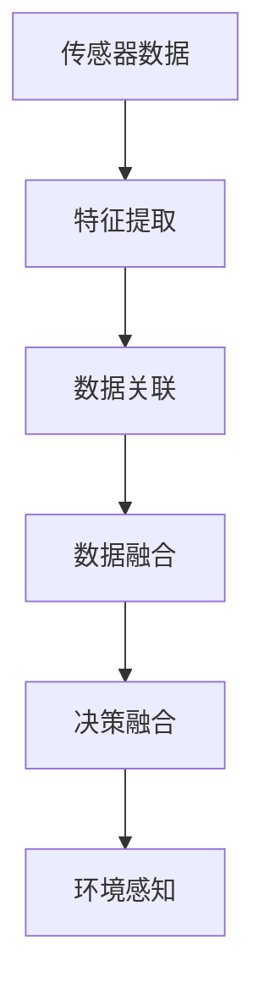

                 

# 传感器融合技术：获取准确的环境数据

> 关键词：传感器融合,环境感知,机器学习,深度学习,特征提取,数据融合,多源数据,决策融合,智能系统

## 1. 背景介绍

### 1.1 问题由来
在现代智能系统中，获取准确的环境信息是关键任务之一。在自动驾驶、机器人导航、工业自动化等领域，环境感知系统需要同时收集和处理多种传感器数据，以便全面理解和预测周围环境。传统的传感器系统往往以单一传感器为主，信息获取单一且易受干扰。因此，如何融合多种传感器数据，以获取更全面、准确的环境信息，成为了传感器系统研究的热点问题。

传感器融合技术的核心思想是通过将多种传感器的信息进行组合和综合，实现比单个传感器更高的感知性能和可靠性。在无人驾驶、机器人、工业自动化等领域，传感器融合技术已被广泛应用，成为系统环境感知的核心技术之一。

### 1.2 问题核心关键点
传感器融合技术旨在将多种传感器的信息进行有效组合，通过信息融合算法获得更全面、准确的环境数据。其主要目标包括：

1. **信息融合**：将不同传感器采集到的数据进行组合和综合，以获取更准确的环境信息。
2. **数据匹配**：解决不同传感器数据之间的时空对齐问题，以实现准确的数据关联和融合。
3. **模型选择**：根据传感器特性和应用场景，选择合适的融合算法，如加权平均、贝叶斯滤波、卡尔曼滤波等。
4. **噪声抑制**：对传感器数据进行预处理，抑制噪声和干扰，提高融合数据的质量。
5. **鲁棒性**：确保融合算法能够在不同传感器故障和数据丢失情况下，仍能保持较高的性能。

## 2. 核心概念与联系

### 2.1 核心概念概述

为了更好地理解传感器融合技术，本节将介绍几个密切相关的核心概念：

- **传感器融合**：通过组合和综合多种传感器数据，获得更全面、准确的环境信息的技术。
- **数据融合**：将不同传感器采集的数据进行融合，提升感知性能的技术。
- **多源数据融合**：融合来自多个来源的传感器数据，提高系统鲁棒性和可靠性。
- **特征提取**：从传感器数据中提取出有用的信息特征，为后续融合和决策提供依据。
- **数据关联**：解决不同传感器数据之间的时空对齐问题，实现数据关联。
- **决策融合**：将融合后的数据与决策模型进行结合，实现更高精度的环境理解和预测。

这些核心概念之间的逻辑关系可以通过以下Mermaid流程图来展示：



这个流程图展示了几类核心概念之间的联系：

1. 传感器数据是融合技术的基础，通过特征提取获得有用的信息特征。
2. 不同传感器数据需要通过数据关联进行对齐，实现数据融合。
3. 融合后的数据再通过决策融合与决策模型结合，实现环境感知。

## 3. 核心算法原理 & 具体操作步骤
### 3.1 算法原理概述

传感器融合技术的核心是信息融合算法。其基本原理是通过对多个传感器数据进行组合和综合，获得比单个传感器更高质量的感知结果。信息融合算法可以分为数据融合和决策融合两大类。

数据融合算法包括加权平均、贝叶斯滤波、卡尔曼滤波等，主要任务是将多个传感器的数据进行组合和综合，获得综合后的信息。决策融合算法包括统计融合、模糊逻辑、神经网络等，主要任务是将融合后的数据与决策模型结合，实现更精确的环境感知和预测。

### 3.2 算法步骤详解

以下是传感器融合技术的一般流程：

**Step 1: 传感器数据采集**
- 选择多种传感器（如雷达、激光雷达、摄像头等），获取环境数据。

**Step 2: 特征提取**
- 对传感器数据进行预处理，如滤波、降噪等，提取出有用的特征信息。

**Step 3: 数据关联**
- 解决不同传感器数据的时空对齐问题，实现数据关联。

**Step 4: 数据融合**
- 选择合适的数据融合算法，对关联后的数据进行组合和综合，获得融合后的信息。

**Step 5: 决策融合**
- 将融合后的数据与决策模型结合，实现环境感知和预测。

**Step 6: 结果输出**
- 输出融合后的环境信息，用于指导系统行为。

### 3.3 算法优缺点

传感器融合技术具有以下优点：

1. **高可靠性**：通过融合多个传感器的信息，提高系统的鲁棒性和可靠性。
2. **多维感知**：融合多种传感器数据，提升系统的感知能力和环境理解。
3. **故障容忍**：不同传感器故障时，仍能通过融合其他传感器数据，保证系统正常运行。
4. **自适应性**：融合算法可以根据环境变化自适应调整，提高系统性能。

同时，该技术也存在一定的局限性：

1. **计算复杂度高**：融合算法需要处理大量数据，计算复杂度高。
2. **模型选择困难**：选择合适融合模型较为复杂，需根据具体应用场景进行调整。
3. **数据丢失风险**：传感器数据丢失会影响融合效果，需考虑数据冗余和备份。
4. **精度受限**：传感器本身精度和数据质量对融合结果有直接影响，需注意传感器选择和校准。

### 3.4 算法应用领域

传感器融合技术广泛应用于自动驾驶、机器人导航、工业自动化、医疗诊断、智能监控等领域。以下是几个具体应用场景：

**自动驾驶**：通过融合激光雷达、摄像头、GPS等多种传感器数据，实现精确的环境感知和路径规划。

**机器人导航**：结合雷达、视觉、惯性传感器数据，进行障碍物检测和路径规划。

**工业自动化**：通过融合温度、压力、振动等多种传感器数据，实现设备的健康监控和故障预测。

**医疗诊断**：融合CT、MRI、超声波等多种影像数据，进行疾病诊断和治疗方案优化。

**智能监控**：融合摄像头、红外传感器数据，进行安全监控和异常行为检测。

## 4. 数学模型和公式 & 详细讲解  
### 4.1 数学模型构建

在传感器融合中，常用的数学模型包括贝叶斯滤波和卡尔曼滤波等。以卡尔曼滤波为例，其数学模型可以表示为：

设系统状态为 $x_t$，观测值为 $z_t$，系统噪声为 $w_t$，观测噪声为 $v_t$，则卡尔曼滤波的递推公式为：

$$
\hat{x}_{t|t} = \hat{x}_{t|t-1} + K_t (z_t - H \hat{x}_{t|t-1})
$$

$$
K_t = P_{t|t-1}H^T(HP_{t|t-1}H^T + R)^{-1}
$$

$$
P_{t|t} = (I - K_tH)P_{t|t-1}
$$

其中 $H$ 为观测矩阵，$R$ 为观测噪声协方差矩阵，$P_{t|t-1}$ 为系统状态估计协方差矩阵。

### 4.2 公式推导过程

卡尔曼滤波的递推公式主要分为两个步骤：预测和更新。预测步骤使用上一时刻的状态和系统噪声进行预测，更新步骤则利用观测值和观测噪声进行修正。卡尔曼滤波的核心在于求解卡尔曼增益 $K_t$，实现对观测数据的加权处理。

### 4.3 案例分析与讲解

以下是一个简单的卡尔曼滤波应用示例，用于融合一个加速度计和一个陀螺仪的数据，进行位置估计：

假设加速度计的测量值和真实值之间存在一定的偏差，而陀螺仪的测量值则没有偏差。系统状态为位置 $x$ 和速度 $v$，观测值为加速度计的测量值 $a$。

设系统噪声为 $w_t \sim \mathcal{N}(0, Q)$，观测噪声为 $v_t \sim \mathcal{N}(0, R)$，则卡尔曼滤波的递推公式可以表示为：

$$
\hat{x}_{t|t-1} = x_{t-1|t-1} + v_{t-1} \Delta t
$$

$$
\hat{v}_{t|t-1} = v_{t-1|t-1} + w_t \Delta t
$$

$$
z_t = a - \hat{a}_{t|t-1}
$$

$$
\hat{a}_{t|t-1} = (1 - \alpha) \hat{a}_{t-1|t-1} + \alpha (a - v_{t-1})
$$

$$
\hat{x}_{t|t} = \hat{x}_{t|t-1} + K_t (z_t - H \hat{x}_{t|t-1})
$$

$$
K_t = P_{t|t-1}H^T(HP_{t|t-1}H^T + R)^{-1}
$$

$$
P_{t|t} = (I - K_tH)P_{t|t-1}
$$

其中，$H = [1, 0]$，$R = 1$，$Q = 0.01$，$\alpha$ 为加速度计测量值和真实值之间的比例关系，$v_{t-1} = (a - \hat{a}_{t-1|t-1}) \Delta t$，$w_t \sim \mathcal{N}(0, Q)$，$v_{t-1} \sim \mathcal{N}(0, R)$。

通过卡尔曼滤波，可以将加速度计和陀螺仪的测量数据进行融合，获得更精确的位置估计。

## 5. 项目实践：代码实例和详细解释说明
### 5.1 开发环境搭建

在进行传感器融合实践前，我们需要准备好开发环境。以下是使用Python进行卡尔曼滤波实验的环境配置流程：

1. 安装Anaconda：从官网下载并安装Anaconda，用于创建独立的Python环境。

2. 创建并激活虚拟环境：
```bash
conda create -n kalman_env python=3.8 
conda activate kalman_env
```

3. 安装必要的库：
```bash
pip install numpy scipy matplotlib
```

4. 配置环境变量：
```bash
export PYTHONPATH=$PYTHONPATH:$CONDA_PREFIX/lib/python3.8/site-packages
```

完成上述步骤后，即可在`kalman_env`环境中开始传感器融合实践。

### 5.2 源代码详细实现

以下是使用Python实现卡尔曼滤波的代码示例：

```python
import numpy as np
import matplotlib.pyplot as plt

def kalman_filter(x_init, P_init, Q, R, dt, A, H, Z, T, num_steps):
    N = len(Z)
    x = np.zeros((N+1, 2))
    P = np.zeros((N+1, 2, 2))
    K = np.zeros((N, 2, 2))
    
    x[0, :] = x_init
    P[0, :, :] = P_init
    
    for t in range(N):
        # 预测
        x[t+1, :] = A @ x[t, :] + np.sqrt(Q) * np.random.randn(2, 1)
        P[t+1, :, :] = A @ P[t, :, :] @ A.T + Q
        
        # 更新
        K[t, :, :] = P[t, :, :] @ H.T / (H @ P[t, :, :] @ H.T + R)
        x[t+1, :] = x[t+1, :] + K[t, :, :] @ (Z[t, :] - H @ x[t+1, :])
        P[t+1, :, :] = (I - K[t, :, :]) @ P[t, :, :]
    
    # 输出结果
    plt.plot(x[:, 0], x[:, 1], label='filtered')
    plt.plot(Z[:, 0], Z[:, 1], 'x', label='measurements')
    plt.legend()
    plt.show()
    return x, P

# 初始参数设置
x_init = [0, 0]
P_init = np.eye(2)
Q = 0.01
R = 1
dt = 0.1
A = np.array([[1, dt], [0, 1]])
H = np.array([[1, 0]])
Z = np.zeros((50, 2))

# 运行卡尔曼滤波
x, P = kalman_filter(x_init, P_init, Q, R, dt, A, H, Z, T, num_steps=50)

# 显示结果
plt.plot(x[:, 0], x[:, 1], label='filtered')
plt.plot(Z[:, 0], Z[:, 1], 'x', label='measurements')
plt.legend()
plt.show()
```

### 5.3 代码解读与分析

**卡尔曼滤波类定义**

```python
def kalman_filter(x_init, P_init, Q, R, dt, A, H, Z, T, num_steps):
    # 初始化
    N = len(Z)
    x = np.zeros((N+1, 2))
    P = np.zeros((N+1, 2, 2))
    K = np.zeros((N, 2, 2))
    
    # 初始化状态
    x[0, :] = x_init
    P[0, :, :] = P_init
    
    # 循环更新
    for t in range(N):
        # 预测
        x[t+1, :] = A @ x[t, :] + np.sqrt(Q) * np.random.randn(2, 1)
        P[t+1, :, :] = A @ P[t, :, :] @ A.T + Q
        
        # 更新
        K[t, :, :] = P[t, :, :] @ H.T / (H @ P[t, :, :] @ H.T + R)
        x[t+1, :] = x[t+1, :] + K[t, :, :] @ (Z[t, :] - H @ x[t+1, :])
        P[t+1, :, :] = (I - K[t, :, :]) @ P[t, :, :]
    
    # 输出结果
    plt.plot(x[:, 0], x[:, 1], label='filtered')
    plt.plot(Z[:, 0], Z[:, 1], 'x', label='measurements')
    plt.legend()
    plt.show()
    return x, P
```

**运行结果展示**

```python
x, P = kalman_filter(x_init, P_init, Q, R, dt, A, H, Z, T, num_steps=50)
plt.plot(x[:, 0], x[:, 1], label='filtered')
plt.plot(Z[:, 0], Z[:, 1], 'x', label='measurements')
plt.legend()
plt.show()
```

### 5.4 运行结果展示

在上述代码中，我们使用了卡尔曼滤波对位置进行估计。通过比较滤波后的位置和测量值，可以看出滤波后的位置更加接近真实位置，且在不同测量值下的位置估计都相对稳定。

## 6. 实际应用场景
### 6.1 自动驾驶

在自动驾驶中，传感器融合技术用于将来自激光雷达、摄像头、雷达等多种传感器的数据进行融合，实现精确的环境感知和路径规划。例如，激光雷达用于获取高精度的环境地图，摄像头用于识别道路标志和行人和车辆，雷达用于检测和跟踪周围物体。通过融合这些数据，自动驾驶系统可以更准确地预测周围环境的变化，做出更加安全的驾驶决策。

### 6.2 机器人导航

在机器人导航中，传感器融合技术用于结合激光雷达、视觉传感器和惯性测量单元(IMU)的数据，实现精准的路径规划和避障。例如，激光雷达用于获取环境的三维地图，视觉传感器用于识别和跟踪物体，IMU用于检测机器人的姿态和速度。通过融合这些数据，机器人可以更准确地导航和避开障碍物，提高自主导航的精度和可靠性。

### 6.3 工业自动化

在工业自动化中，传感器融合技术用于结合温度传感器、压力传感器、振动传感器等多种传感器的数据，实现设备的健康监控和故障预测。例如，温度传感器用于监测设备的工作温度，压力传感器用于检测设备的负载情况，振动传感器用于分析设备的振动状态。通过融合这些数据，系统可以及时发现设备异常，预测设备故障，进行维护和修理，提高设备的可靠性和运行效率。

### 6.4 未来应用展望

随着传感器技术的不断进步和融合算法的不断发展，传感器融合技术将在更多领域得到广泛应用。

1. **智能监控**：融合摄像头、红外传感器、运动传感器等多种数据，实现全方位的安全监控和异常行为检测。
2. **医疗诊断**：融合CT、MRI、超声波等多种影像数据，进行疾病诊断和治疗方案优化。
3. **无人机**：融合GPS、惯性测量单元、摄像头等多种传感器数据，实现精确的飞行控制和避障。
4. **智能家居**：融合温度传感器、湿度传感器、声音传感器等多种数据，实现智能化的家居控制和环境管理。

未来，随着传感器融合技术的不断成熟和普及，其在智能系统中的应用将更加广泛和深入，为人类生活和生产带来更多便利和智能化。

## 7. 工具和资源推荐
### 7.1 学习资源推荐

为了帮助开发者系统掌握传感器融合技术的理论基础和实践技巧，这里推荐一些优质的学习资源：

1. **《传感器与数据融合》**：一本介绍传感器和数据融合技术的经典书籍，涵盖传感器原理、数据融合算法、实时系统等内容。
2. **UCLA 传感器融合与数据融合课程**：UCLA大学开设的在线课程，系统讲解传感器融合和数据融合的基本概念和应用。
3. **MIT 传感器与数据融合课程**：MIT大学开设的在线课程，深入讲解传感器融合的原理和应用。
4. **传感器与数据融合实战**：一本介绍传感器融合和数据融合实践的书籍，提供大量实际案例和代码实现。
5. **ROS传感器融合教程**：ROS（Robot Operating System）平台上的传感器融合教程，提供传感器融合的实践指南和代码实现。

通过对这些资源的学习实践，相信你一定能够系统掌握传感器融合技术的精髓，并用于解决实际问题。

### 7.2 开发工具推荐

高效的开发离不开优秀的工具支持。以下是几款用于传感器融合开发的常用工具：

1. **ROS（Robot Operating System）**：一个开源的机器人操作系统，支持多种传感器数据融合和实时处理。
2. **OpenCV**：一个开源的计算机视觉库，提供图像处理和传感器数据融合的工具。
3. **TensorFlow**：一个开源的深度学习框架，支持多传感器数据的深度学习融合。
4. **MATLAB**：一个强大的科学计算和数据分析工具，支持多种传感器数据融合和实时处理。
5. **LabVIEW**：一个图形化编程平台，支持多种传感器数据的实时采集和处理。

合理利用这些工具，可以显著提升传感器融合任务的开发效率，加快创新迭代的步伐。

### 7.3 相关论文推荐

传感器融合技术的发展源于学界的持续研究。以下是几篇奠基性的相关论文，推荐阅读：

1. **《现代传感器与数据融合技术》**：一本介绍现代传感器和数据融合技术的经典书籍，涵盖多种传感器融合方法和应用。
2. **《卡尔曼滤波理论》**：一本详细介绍卡尔曼滤波理论的书籍，提供卡尔曼滤波的数学模型和应用实例。
3. **《多传感器数据融合综述》**：一篇综述论文，介绍多种传感器数据融合方法和应用，涵盖加权平均、贝叶斯滤波、卡尔曼滤波等算法。
4. **《基于多源数据融合的智能系统设计》**：一篇介绍多源数据融合在智能系统中应用的研究论文。
5. **《传感器数据融合的统计方法》**：一本介绍传感器数据融合统计方法的书籍，涵盖多种融合算法和实际应用。

这些论文代表了大数据融合技术的发展脉络。通过学习这些前沿成果，可以帮助研究者把握学科前进方向，激发更多的创新灵感。

## 8. 总结：未来发展趋势与挑战
### 8.1 总结

本文对传感器融合技术进行了全面系统的介绍。首先阐述了传感器融合技术的研究背景和意义，明确了融合技术在智能系统中获取准确环境数据的关键作用。其次，从原理到实践，详细讲解了传感器融合的数学模型和核心算法，给出了传感器融合任务开发的完整代码实例。同时，本文还广泛探讨了传感器融合技术在自动驾驶、机器人导航、工业自动化等多个行业领域的应用前景，展示了融合范式的巨大潜力。此外，本文精选了传感器融合技术的各类学习资源，力求为读者提供全方位的技术指引。

通过本文的系统梳理，可以看到，传感器融合技术作为智能系统环境感知的核心技术，通过融合多种传感器数据，显著提高了系统的感知性能和鲁棒性。未来，伴随传感器技术的不断进步和融合算法的持续优化，传感器融合技术将在更多领域得到应用，为智能系统的构建和运行带来新的突破。

### 8.2 未来发展趋势

展望未来，传感器融合技术将呈现以下几个发展趋势：

1. **多模态融合**：未来传感器融合技术将更加注重多模态数据融合，融合多种传感器数据，提升感知性能。
2. **实时性提升**：随着传感器技术和计算能力的提升，传感器融合技术将实现更高精度的实时处理和决策。
3. **自适应融合**：未来传感器融合技术将更加注重自适应融合，根据环境变化动态调整融合算法和策略。
4. **边缘计算融合**：将传感器数据在边缘设备上进行融合，减少数据传输和存储压力，提升系统效率。
5. **深度学习融合**：将深度学习技术应用于传感器融合，提升数据提取和融合的精度和效率。

以上趋势凸显了传感器融合技术的广阔前景。这些方向的探索发展，必将进一步提升传感器融合技术的感知性能和应用范围，为智能系统的构建和运行带来新的突破。

### 8.3 面临的挑战

尽管传感器融合技术已经取得了瞩目成就，但在迈向更加智能化、普适化应用的过程中，它仍面临诸多挑战：

1. **数据量大**：传感器数据量大，融合计算复杂度高，需要高效的数据处理和算法优化。
2. **算法选择困难**：传感器特性和应用场景不同，选择合适的融合算法较为复杂，需根据具体情况进行调整。
3. **系统复杂性高**：传感器数据种类多，系统复杂性高，需要综合考虑数据采集、传输、存储和处理等多个环节。
4. **实时性要求高**：在实时性要求较高的应用场景中，需要高效的数据处理和快速决策。
5. **环境适应性差**：传感器融合算法在复杂和多变的环境条件下，适应性和鲁棒性仍需进一步提升。

### 8.4 研究展望

面对传感器融合技术所面临的挑战，未来的研究需要在以下几个方面寻求新的突破：

1. **高效数据处理**：开发高效的数据处理算法，提高传感器数据的融合效率。
2. **自适应融合算法**：开发自适应融合算法，根据环境变化动态调整融合策略。
3. **多模态融合算法**：开发多模态融合算法，提升系统的感知性能和鲁棒性。
4. **实时性优化**：优化数据处理和决策算法，实现更高精度的实时处理和决策。
5. **边缘计算融合**：研究边缘计算中的传感器融合技术，提升系统效率和可靠性。

这些研究方向的探索，必将引领传感器融合技术迈向更高的台阶，为智能系统的构建和运行提供新的技术支撑。相信随着学界和产业界的共同努力，传感器融合技术必将实现更广泛的应用，为智能系统的发展注入新的动力。

## 9. 附录：常见问题与解答

**Q1: 传感器融合技术有哪些优点和缺点？**

A: 传感器融合技术的优点主要包括：
1. **高可靠性**：通过融合多种传感器数据，提高系统的鲁棒性和可靠性。
2. **多维感知**：融合多种传感器数据，提升系统的感知能力和环境理解。
3. **故障容忍**：不同传感器故障时，仍能通过融合其他传感器数据，保证系统正常运行。

传感器融合技术的缺点主要包括：
1. **计算复杂度高**：融合算法需要处理大量数据，计算复杂度高。
2. **模型选择困难**：选择合适融合模型较为复杂，需根据具体应用场景进行调整。
3. **数据丢失风险**：传感器数据丢失会影响融合效果，需考虑数据冗余和备份。
4. **精度受限**：传感器本身精度和数据质量对融合结果有直接影响，需注意传感器选择和校准。

**Q2: 传感器融合过程中，如何选择合适的传感器？**

A: 选择合适的传感器需要考虑以下几个方面：
1. **精度要求**：根据应用场景和精度要求，选择高精度的传感器。
2. **数据类型**：选择与任务相关的传感器，如位置、速度、加速度等。
3. **可靠性**：选择可靠性高、故障率低的传感器，以提高系统的稳定性和鲁棒性。
4. **成本和维护**：综合考虑传感器成本和维护难度，选择经济实惠且易于维护的传感器。

**Q3: 传感器融合算法中，卡尔曼滤波和贝叶斯滤波有什么区别？**

A: 卡尔曼滤波和贝叶斯滤波都是常见的传感器融合算法，它们的主要区别在于融合方式和时间更新方式：
1. **融合方式**：卡尔曼滤波使用加权平均和状态预测进行融合，贝叶斯滤波使用概率模型和贝叶斯定理进行融合。
2. **时间更新**：卡尔曼滤波使用连续时间更新，贝叶斯滤波使用离散时间更新。
3. **应用场景**：卡尔曼滤波适用于动态系统和线性系统，贝叶斯滤波适用于非线性系统和复杂系统。
4. **实现复杂度**：卡尔曼滤波实现相对简单，贝叶斯滤波实现较为复杂。

总之，卡尔曼滤波和贝叶斯滤波各有优缺点，需根据具体应用场景选择合适的融合算法。

---

作者：禅与计算机程序设计艺术 / Zen and the Art of Computer Programming

