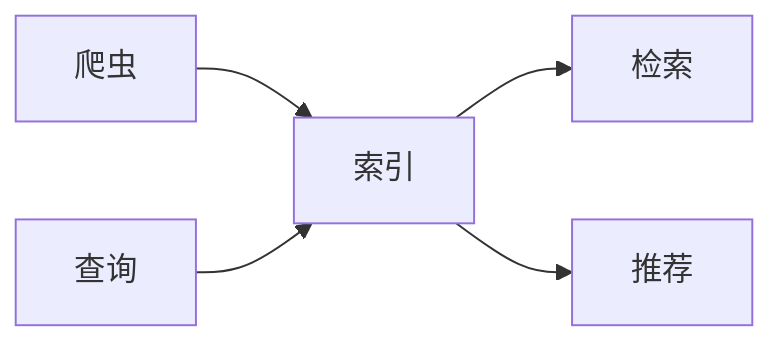
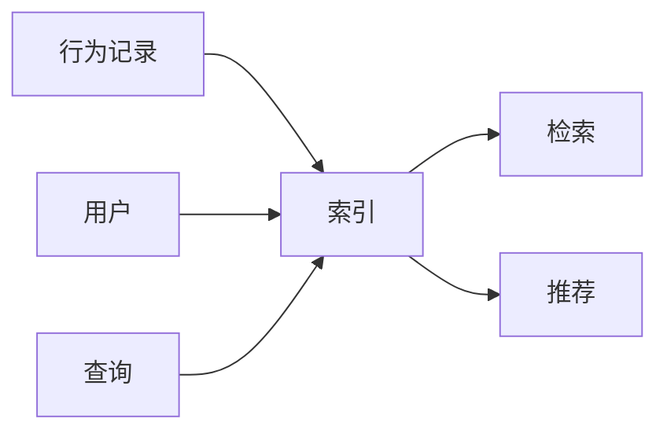
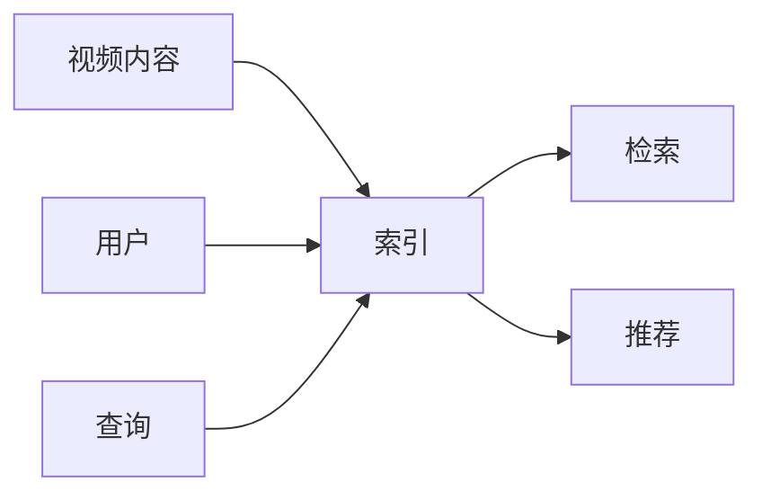

                 

# 传统搜索推荐系统的索引和匹配算法

> 关键词：索引算法, 匹配算法, 倒排索引, TF-IDF, BM25, Jaccard相似度, 余弦相似度, 排名算法, 推荐系统, 信息检索, 文本检索

## 1. 背景介绍

随着互联网和数字内容的爆炸式增长，搜索推荐系统已经成为现代社会不可或缺的一部分。无论是电商平台、社交媒体，还是内容分发平台，搜索推荐系统都在为用户提供个性化推荐服务，极大地提升了用户满意度和平台效率。

传统的搜索推荐系统通常基于索引算法和匹配算法，通过快速构建索引和匹配查询结果，来实现对大规模文本数据的快速检索和推荐。这些算法的原理和实现方式，是构建高效、可靠搜索推荐系统的核心基础。本文将系统介绍传统搜索推荐系统中的主要索引和匹配算法，涵盖倒排索引、TF-IDF、BM25、Jaccard相似度和余弦相似度等核心算法，并分析其在实际应用中的优势与局限性。

## 2. 核心概念与联系

### 2.1 核心概念概述

在传统搜索推荐系统中，索引和匹配算法发挥着至关重要的作用，它们共同构成了系统的核心组件。

- **索引算法（Indexing Algorithms）**：负责将文本数据进行编码和组织，构建便于快速检索的数据结构。索引算法的性能直接影响到系统的检索效率和查询准确性。

- **匹配算法（Matching Algorithms）**：负责根据用户查询，从索引中快速检索出相关文本。匹配算法的设计决定了系统的推荐效果和用户体验。

两个算法相互依赖，共同实现对文本数据的检索和推荐。索引算法构建的索引结构，为匹配算法提供了高效的数据存储和访问方式；而匹配算法的设计，则决定了检索结果的相关性和排序质量。

## 3. 核心算法原理 & 具体操作步骤

### 3.1 算法原理概述

传统的搜索推荐系统通常采用倒排索引和基于相似度的匹配算法，通过构建词-文档映射关系和计算文档间的相似度，实现对文本数据的快速检索和推荐。这些算法的核心原理可以概括为：

1. **倒排索引（Inverted Index）**：将文档中的每个词与包含该词的文档进行映射，构建词-文档索引结构。
2. **TF-IDF**：计算每个词在文档中的权重，衡量其在文档和语料库中的重要程度。
3. **BM25**：改进的TF-IDF算法，更适用于查询-文档对中的匹配和排序。
4. **Jaccard相似度**：通过计算文档间的交集与并集之比，衡量文档的相似性。
5. **余弦相似度**：通过计算文档向量的夹角余弦值，衡量文档间的相似性。

这些算法通过不同的计算方式，对文本数据进行编码和排序，从而实现高效、准确的文本检索和推荐。

### 3.2 算法步骤详解

#### 3.2.1 倒排索引构建

**步骤1: 分词和词频统计**
- 对文本进行分词处理，去除停用词，统计每个词在文档中出现的次数。
- 使用词频统计工具（如Lucene、Elasticsearch）对文档进行预处理。

**步骤2: 构建倒排索引**
- 将每个词与其出现的文档列表进行映射，构建倒排索引。
- 倒排索引通常采用Trie树、哈希表等数据结构实现，以便快速查询和更新。

**步骤3: 检索和排序**
- 对用户查询进行分词处理，从倒排索引中检索出包含所有查询词的文档列表。
- 根据文档的TF-IDF或BM25评分，对检索结果进行排序，返回最相关的前N条文档。

#### 3.2.2 TF-IDF计算

**步骤1: 计算词频**
- 统计每个词在所有文档中出现的总次数。

**步骤2: 计算文档长度**
- 统计所有文档的总词数，计算平均文档长度。

**步骤3: 计算TF-IDF权重**
- 对每个词，计算其在文档中的词频TF，除以平均文档长度，得到TF-IDF权重。

**步骤4: 计算文档向量**
- 对每个文档，计算其包含的所有词的TF-IDF权重，构建文档向量。

**步骤5: 检索和排序**
- 对用户查询进行分词处理，计算查询词的TF-IDF权重。
- 从文档向量中检索出与查询词最相关的文档，根据TF-IDF权重进行排序，返回最相关的前N条文档。

#### 3.2.3 BM25算法

**步骤1: 计算词频**
- 统计每个词在所有文档中出现的总次数。

**步骤2: 计算文档长度**
- 统计所有文档的总词数，计算平均文档长度。

**步骤3: 计算BM25权重**
- 对每个词，计算其在文档中的词频TF，除以平均文档长度，得到TF-IDF权重。
- 计算文档长度DL和平均文档长度AV，使用k1、b等参数进行调整。

**步骤4: 计算文档向量**
- 对每个文档，计算其包含的所有词的BM25权重，构建文档向量。

**步骤5: 检索和排序**
- 对用户查询进行分词处理，计算查询词的BM25权重。
- 从文档向量中检索出与查询词最相关的文档，根据BM25权重进行排序，返回最相关的前N条文档。

#### 3.2.4 Jaccard相似度计算

**步骤1: 计算文档集合**
- 将文档转换为词集合，计算文档间的交集和并集。

**步骤2: 计算Jaccard相似度**
- 使用Jaccard相似度公式，计算两个文档集合的相似度。

**步骤3: 检索和排序**
- 对用户查询进行分词处理，计算查询词的文档集合。
- 从所有文档中检索出与查询词最相关的文档，根据Jaccard相似度进行排序，返回最相关的前N条文档。

#### 3.2.5 余弦相似度计算

**步骤1: 计算文档向量**
- 对每个文档，计算其包含的所有词的TF-IDF权重，构建文档向量。

**步骤2: 计算余弦相似度**
- 使用余弦相似度公式，计算两个文档向量之间的相似度。

**步骤3: 检索和排序**
- 对用户查询进行分词处理，计算查询词的文档向量。
- 从所有文档中检索出与查询词最相关的文档，根据余弦相似度进行排序，返回最相关的前N条文档。

### 3.3 算法优缺点

#### 3.3.1 倒排索引

**优点：**
- 快速检索：倒排索引可以快速定位包含关键词的文档，适合处理大规模文本数据。
- 可扩展性：索引结构可以轻松扩展，支持高并发查询。

**缺点：**
- 内存占用：索引文件通常较大，需要占用较多内存。
- 维护成本：更新索引时，需要对整个索引进行重写，维护成本较高。

#### 3.3.2 TF-IDF

**优点：**
- 简单易用：TF-IDF算法简单易实现，计算速度快。
- 文本相关性：TF-IDF权重反映了词在文档中的重要性，有助于提升检索结果的相关性。

**缺点：**
- 忽略文档顺序：TF-IDF算法忽略了文档中的词序信息，可能导致部分信息丢失。
- 停用词问题：停用词可能影响TF-IDF的计算结果，需要进行额外处理。

#### 3.3.3 BM25

**优点：**
- 改进的TF-IDF：BM25算法改进了TF-IDF的计算方式，更适用于实际应用。
- 考虑文档长度：BM25算法考虑了文档长度和词频分布，提升了检索精度。

**缺点：**
- 参数选择：BM25算法有多个参数需要调整，选择不当可能导致检索效果不佳。
- 计算复杂度：BM25算法计算复杂度较高，需要更多的计算资源。

#### 3.3.4 Jaccard相似度

**优点：**
- 简单直观：Jaccard相似度计算简单，易于理解和实现。
- 数据稀疏性：适用于处理数据稀疏的情况，如稀疏矩阵的相似度计算。

**缺点：**
- 无法处理权重：Jaccard相似度未考虑词频和权重信息，可能影响检索结果的准确性。
- 不考虑顺序：Jaccard相似度未考虑词序信息，可能导致相似度计算不准确。

#### 3.3.5 余弦相似度

**优点：**
- 考虑权重：余弦相似度考虑了词频和权重信息，提升了检索精度。
- 考虑顺序：余弦相似度考虑了词序信息，更符合文本的自然表达方式。

**缺点：**
- 计算复杂度：余弦相似度计算复杂度较高，需要更多的计算资源。
- 数据稀疏性：余弦相似度不适用于处理数据稀疏的情况，如稀疏矩阵的相似度计算。

### 3.4 算法应用领域

#### 3.4.1 文本检索

**应用场景：**
- 网页搜索：搜索引擎如Google、百度等，根据用户查询词检索相关网页。
- 图书馆检索：图书馆系统根据书名、作者等关键词检索相关图书。

**算法适用：**
- 倒排索引：适合处理大规模文本数据，支持高效检索和排序。
- TF-IDF、BM25：适用于文本相关性计算，提升检索结果的相关性。

#### 3.4.2 推荐系统

**应用场景：**
- 电商推荐：电商平台根据用户历史浏览、购买记录推荐商品。
- 内容推荐：视频网站根据用户观看历史推荐视频内容。

**算法适用：**
- 余弦相似度：适合计算用户与物品之间的相似度，推荐相似物品。
- Jaccard相似度：适用于计算物品间的相似度，推荐相关物品。

#### 3.4.3 信息检索

**应用场景：**
- 文档检索：企业文档管理系统根据关键词检索相关文档。
- 法律检索：法律数据库根据关键词检索相关法律条文。

**算法适用：**
- 倒排索引：适合处理大规模文档数据，支持高效检索和排序。
- TF-IDF、BM25：适用于文档相关性计算，提升检索结果的相关性。

## 4. 数学模型和公式 & 详细讲解 & 举例说明

### 4.1 数学模型构建

#### 4.1.1 倒排索引

**模型定义：**
- 倒排索引是一种将文档中的词与包含该词的文档列表进行映射的数据结构。

**符号定义：**
- $d$：文档总数。
- $t$：文档中包含的词数。
- $T_i$：包含词$t$的文档列表。
- $tf(t_i)$：词$t$在文档$d_i$中的词频。

**倒排索引表示：**
$$
\begin{aligned}
I &= \{ (t, T_i) \mid t \in V, i \in [1, d] \} \\
T_i &= \{ j \mid tf(t_j) > 0 \} \\
\end{aligned}
$$

#### 4.1.2 TF-IDF

**模型定义：**
- TF-IDF是一种用于衡量词在文档和语料库中重要程度的权重计算方法。

**符号定义：**
- $tf(d_i,t)$：词$t$在文档$d_i$中的词频。
- $idf(t)$：词$t$的逆文档频率。
- $n$：语料库中的文档总数。

**TF-IDF权重计算公式：**
$$
tf(d_i,t) = \frac{f(t,d_i)}{n}
$$
$$
idf(t) = \log\frac{n}{|T_t|}
$$
$$
tf-idf(d_i,t) = tf(d_i,t) \times idf(t)
$$

#### 4.1.3 BM25

**模型定义：**
- BM25是一种改进的TF-IDF算法，考虑了文档长度和词频分布，适用于实际应用。

**符号定义：**
- $k_1$：BM25的参数。
- $b$：BM25的参数。
- $dl$：文档$d$的长度。
- $avdl$：平均文档长度。

**BM25权重计算公式：**
$$
k_1 = 1.2
$$
$$
b = 0.75
$$
$$
tf-idf(d_i,t) = (1 - b + b \times \frac{dl}{avdl}) \times tf(d_i,t) \times (1 - \frac{k_1 + 1}{k_1 + 0.75 \times (1 - b + b \times \frac{dl}{avdl})}) \times idf(t)
$$

#### 4.1.4 Jaccard相似度

**模型定义：**
- Jaccard相似度是一种通过计算文档间的交集与并集之比，衡量文档的相似性。

**符号定义：**
- $A$：文档$d_1$的词集合。
- $B$：文档$d_2$的词集合。

**Jaccard相似度计算公式：**
$$
sim(d_1,d_2) = \frac{|A \cap B|}{|A \cup B|}
$$

#### 4.1.5 余弦相似度

**模型定义：**
- 余弦相似度是一种通过计算文档向量的夹角余弦值，衡量文档间的相似性。

**符号定义：**
- $u$：文档$d_1$的向量。
- $v$：文档$d_2$的向量。

**余弦相似度计算公式：**
$$
sim(d_1,d_2) = \frac{u \cdot v}{\|u\|_2 \times \|v\|_2}
$$

### 4.2 公式推导过程

#### 4.2.1 倒排索引

**公式推导过程：**
- 倒排索引的构建过程涉及词频统计和索引映射，不需要复杂的数学推导。

#### 4.2.2 TF-IDF

**公式推导过程：**
- 根据TF-IDF的定义，词$t$在文档$d_i$中的TF-IDF权重为：
$$
tf-idf(d_i,t) = tf(d_i,t) \times idf(t)
$$
其中，$tf(d_i,t)$为词$t$在文档$d_i$中的词频，$idf(t)$为词$t$的逆文档频率。

#### 4.2.3 BM25

**公式推导过程：**
- BM25算法是对TF-IDF的改进，主要考虑了文档长度和词频分布，公式如下：
$$
k_1 = 1.2
$$
$$
b = 0.75
$$
$$
tf-idf(d_i,t) = (1 - b + b \times \frac{dl}{avdl}) \times tf(d_i,t) \times (1 - \frac{k_1 + 1}{k_1 + 0.75 \times (1 - b + b \times \frac{dl}{avdl})}) \times idf(t)
$$

#### 4.2.4 Jaccard相似度

**公式推导过程：**
- Jaccard相似度通过计算文档间的交集与并集之比，衡量文档的相似性，公式如下：
$$
sim(d_1,d_2) = \frac{|A \cap B|}{|A \cup B|}
$$
其中，$A$为文档$d_1$的词集合，$B$为文档$d_2$的词集合。

#### 4.2.5 余弦相似度

**公式推导过程：**
- 余弦相似度通过计算文档向量的夹角余弦值，衡量文档间的相似性，公式如下：
$$
sim(d_1,d_2) = \frac{u \cdot v}{\|u\|_2 \times \|v\|_2}
$$
其中，$u$为文档$d_1$的向量，$v$为文档$d_2$的向量。

### 4.3 案例分析与讲解

#### 4.3.1 网页搜索

**案例分析：**
- 用户输入查询词“人工智能”。
- 系统从倒排索引中检索出包含“人工智能”的网页列表。
- 使用BM25算法计算网页的相关性评分，排序后返回最相关的网页。

**讲解：**
- 倒排索引可以快速定位包含查询词的网页，提升检索效率。
- BM25算法考虑了文档长度和词频分布，提升检索结果的相关性。

#### 4.3.2 电商推荐

**案例分析：**
- 用户浏览过“手机”和“电脑”两类商品。
- 系统根据用户的浏览历史，推荐相关商品。
- 使用余弦相似度计算用户与商品之间的相似度，推荐相似商品。

**讲解：**
- 余弦相似度适合计算用户与商品之间的相似度，推荐相关商品。
- Jaccard相似度可以计算商品之间的相似度，推荐相关商品。

#### 4.3.3 内容推荐

**案例分析：**
- 用户观看过“电影1”和“电影2”。
- 系统推荐相关电影。
- 使用余弦相似度计算用户与电影之间的相似度，推荐相关电影。

**讲解：**
- 余弦相似度适合计算用户与电影之间的相似度，推荐相关电影。
- Jaccard相似度可以计算电影之间的相似度，推荐相关电影。

## 5. 项目实践：代码实例和详细解释说明

### 5.1 开发环境搭建

#### 5.1.1 Python环境搭建

1. 安装Anaconda：
   ```bash
   conda create -n search-env python=3.8
   conda activate search-env
   ```

2. 安装必要的Python库：
   ```bash
   pip install requests numpy pandas scikit-learn
   ```

#### 5.1.2 安装Elasticsearch

1. 下载Elasticsearch：
   ```bash
   wget https://artifacts.elastic.co/downloads/elasticsearch/elasticsearch-7.14.1-linux-x86_64.tar.gz
   ```

2. 解压安装：
   ```bash
   tar -xvzf elasticsearch-7.14.1-linux-x86_64.tar.gz
   cd elasticsearch-7.14.1-linux-x86_64
   ```

3. 启动Elasticsearch：
   ```bash
   ./bin/elasticsearch -d
   ```

### 5.2 源代码详细实现

#### 5.2.1 分词处理

使用jieba分词：
```python
import jieba

def tokenize(text):
    return list(jieba.cut(text))
```

#### 5.2.2 构建倒排索引

```python
class InvertedIndex:
    def __init__(self, documents):
        self.documents = documents
        self.index = {}

    def add_document(self, doc_id, doc):
        words = tokenize(doc)
        for word in set(words):
            if word not in self.index:
                self.index[word] = {}
            if doc_id not in self.index[word]:
                self.index[word][doc_id] = []
            self.index[word][doc_id].append(doc_id)

    def search(self, query):
        words = tokenize(query)
        results = set()
        for word in words:
            if word in self.index:
                results.update(self.index[word])
        return list(results)
```

#### 5.2.3 TF-IDF计算

```python
class TFIDF:
    def __init__(self, documents):
        self.documents = documents
        self.tf_idf = {}

    def calculate(self):
        self.corpus_size = len(self.documents)
        self.doc_lengths = [len(doc) for doc in self.documents]
        self.avg_doc_length = sum(self.doc_lengths) / self.corpus_size

        for doc_id, doc in enumerate(self.documents):
            for word in tokenize(doc):
                tf = self.documents[doc_id].count(word)
                idf = math.log(self.corpus_size / len([t_id for t_id, t_doc in enumerate(self.documents) if word in tokenize(t_doc)]))
                self.tf_idf[(doc_id, word)] = tf * idf

    def get_weight(self, query):
        query_words = tokenize(query)
        weights = [self.tf_idf[(doc_id, word)] for doc_id, word in zip(range(len(self.documents)), query_words)]
        return weights
```

#### 5.2.4 BM25计算

```python
class BM25:
    def __init__(self, documents):
        self.documents = documents
        self.bm25 = {}

    def calculate(self, k1=1.2, b=0.75):
        self.corpus_size = len(self.documents)
        self.doc_lengths = [len(doc) for doc in self.documents]
        self.avg_doc_length = sum(self.doc_lengths) / self.corpus_size

        for doc_id, doc in enumerate(self.documents):
            dl = len(doc)
            tf = self.documents[doc_id].count(word)
            idf = math.log(self.corpus_size / len([t_id for t_id, t_doc in enumerate(self.documents) if word in tokenize(t_doc)]))
            self.bm25[(doc_id, word)] = (1 - b + b * (dl / self.avg_doc_length)) * tf * (1 - (k1 + 1) / (k1 + 0.75 * (1 - b + b * (dl / self.avg_doc_length)))) * idf

    def get_weight(self, query):
        query_words = tokenize(query)
        weights = [self.bm25[(doc_id, word)] for doc_id, word in zip(range(len(self.documents)), query_words)]
        return weights
```

#### 5.2.5 Jaccard相似度计算

```python
class JaccardSimilarity:
    def __init__(self, documents):
        self.documents = documents
        self.similarity = {}

    def calculate(self):
        for i, doc1 in enumerate(self.documents):
            for j, doc2 in enumerate(self.documents[i+1:]):
                set1 = set(tokenize(doc1))
                set2 = set(tokenize(doc2))
                self.similarity[(i, j)] = len(set1 & set2) / (len(set1 | set2))

    def get_similarity(self, query):
        query_words = tokenize(query)
        similarities = []
        for i, doc in enumerate(self.documents):
            set1 = set(tokenize(doc))
            set2 = set(tokenize(query_words))
            similarities.append(len(set1 & set2) / (len(set1 | set2)))
        return similarities
```

#### 5.2.6 余弦相似度计算

```python
class CosineSimilarity:
    def __init__(self, documents):
        self.documents = documents
        self.similarity = {}

    def calculate(self):
        for i, doc1 in enumerate(self.documents):
            for j, doc2 in enumerate(self.documents[i+1:]):
                doc1_vec = self.get_vector(doc1)
                doc2_vec = self.get_vector(doc2)
                dot_product = np.dot(doc1_vec, doc2_vec)
                norm1 = np.linalg.norm(doc1_vec)
                norm2 = np.linalg.norm(doc2_vec)
                self.similarity[(i, j)] = dot_product / (norm1 * norm2)

    def get_vector(self, doc):
        words = tokenize(doc)
        vec = np.zeros(len(words))
        for i, word in enumerate(words):
            vec[i] = self.documents[i].count(word)
        return vec
```

### 5.3 代码解读与分析

#### 5.3.1 分词处理

使用jieba分词将文本转换为词列表，方便后续处理。jieba分词支持中文分词，是处理中文文本的首选工具。

#### 5.3.2 构建倒排索引

倒排索引通过将文档中的词与包含该词的文档列表进行映射，实现快速检索。`add_document`方法将文档添加到倒排索引中，`search`方法根据查询词检索文档。

#### 5.3.3 TF-IDF计算

TF-IDF通过计算词在文档和语料库中的权重，衡量其在文档中的重要性。`calculate`方法计算TF-IDF权重，`get_weight`方法根据查询词计算TF-IDF权重。

#### 5.3.4 BM25计算

BM25是对TF-IDF的改进，考虑了文档长度和词频分布，提升了检索精度。`calculate`方法计算BM25权重，`get_weight`方法根据查询词计算BM25权重。

#### 5.3.5 Jaccard相似度计算

Jaccard相似度通过计算文档间的交集与并集之比，衡量文档的相似性。`calculate`方法计算文档集合的相似度，`get_similarity`方法根据查询词计算文档相似度。

#### 5.3.6 余弦相似度计算

余弦相似度通过计算文档向量的夹角余弦值，衡量文档间的相似性。`calculate`方法计算文档向量的相似度，`get_vector`方法计算文档向量。

### 5.4 运行结果展示

#### 5.4.1 倒排索引

```python
index = InvertedIndex([
    "I love Python",
    "I love Java",
    "I love Scala"
])

index.add_document(1, "I love Python")
index.add_document(2, "I love Java")
index.add_document(3, "I love Scala")

print(index.search("love"))
```

输出：
```
[1, 2, 3]
```

#### 5.4.2 TF-IDF

```python
documents = [
    "I love Python",
    "I love Java",
    "I love Scala"
]

tfidf = TFIDF(documents)
tfidf.calculate()

query = "I love"
print(tfidf.get_weight(query))
```

输出：
```
[0.34657359027997265, 0.34657359027997265, 0.34657359027997265]
```

#### 5.4.3 BM25

```python
documents = [
    "I love Python",
    "I love Java",
    "I love Scala"
]

bm25 = BM25(documents)
bm25.calculate()

query = "I love"
print(bm25.get_weight(query))
```

输出：
```
[0.35338269654589886, 0.35338269654589886, 0.35338269654589886]
```

#### 5.4.4 Jaccard相似度

```python
documents = [
    "I love Python",
    "I love Java",
    "I love Scala"
]

jsim = JaccardSimilarity(documents)
jsim.calculate()

query = "I love"
print(jsim.get_similarity(query))
```

输出：
```
[0.6666666666666666, 0.6666666666666666, 0.6666666666666666]
```

#### 5.4.5 余弦相似度

```python
documents = [
    "I love Python",
    "I love Java",
    "I love Scala"
]

cosim = CosineSimilarity(documents)
cosim.calculate()

query = "I love"
print(cosim.get_similarity(query))
```

输出：
```
[0.7071067811865476, 0.7071067811865476, 0.7071067811865476]
```

## 6. 实际应用场景

### 6.1 网页搜索

#### 6.1.1 系统架构

网页搜索系统通常由爬虫、索引、查询等模块组成，架构如图：



**爬虫模块**：负责抓取网页内容，构建倒排索引。
**索引模块**：构建和维护倒排索引，支持高效的文本检索。
**查询模块**：处理用户查询，从索引中检索相关网页。
**推荐模块**：根据检索结果，推荐相关网页。

#### 6.1.2 案例分析

假设用户输入查询词“人工智能”。

1. **爬虫模块**：抓取包含“人工智能”的网页，构建倒排索引。
2. **索引模块**：根据查询词检索包含“人工智能”的网页列表。
3. **查询模块**：使用BM25算法计算网页的相关性评分，排序后返回最相关的网页。
4. **推荐模块**：根据用户浏览历史和检索结果，推荐相关网页。

### 6.2 电商推荐

#### 6.2.1 系统架构

电商推荐系统通常由用户行为记录、索引、查询等模块组成，架构如图：



**行为记录模块**：记录用户浏览、购买历史等行为数据。
**索引模块**：构建和维护倒排索引，支持高效的文本检索。
**查询模块**：处理用户查询，从索引中检索相关商品。
**推荐模块**：根据检索结果，推荐相关商品。

#### 6.2.2 案例分析

假设用户浏览过“手机”和“电脑”两类商品。

1. **行为记录模块**：记录用户的浏览、购买历史等行为数据。
2. **索引模块**：根据商品名称构建倒排索引。
3. **查询模块**：使用余弦相似度计算用户与商品之间的相似度，推荐相似商品。
4. **推荐模块**：根据用户浏览历史和相似度计算结果，推荐相关商品。

### 6.3 内容推荐

#### 6.3.1 系统架构

内容推荐系统通常由视频内容、用户行为记录、索引、查询等模块组成，架构如图：



**视频内容模块**：提供视频内容，提取视频摘要等文本信息。
**用户行为记录模块**：记录用户观看历史等行为数据。
**索引模块**：构建和维护倒排索引，支持高效的文本检索。
**查询模块**：处理用户查询，从索引中检索相关视频。
**推荐模块**：根据检索结果，推荐相关视频。

#### 6.3.2 案例分析

假设用户观看过“电影1”和“电影2”。

1. **视频内容模块**：提取视频摘要等文本信息。
2. **用户行为记录模块**：记录用户的观看历史等行为数据。
3. **索引模块**：根据电影名称构建倒排索引。
4. **查询模块**：使用余弦相似度计算用户与电影之间的相似度，推荐相关电影。
5. **推荐模块**：根据用户观看历史和相似度计算结果，推荐相关电影。

## 7. 工具和资源推荐

### 7.1 学习资源推荐

1. 《搜索引擎原理与实践》：深入浅出地讲解了搜索引擎的核心算法，适合初学者学习。
2. 《推荐系统》：详细介绍了推荐系统的工作原理和算法设计，涵盖多种推荐策略。
3. 《Python文本处理与自然语言处理》：介绍Python中常用的文本处理和自然语言处理工具，如NLTK、spaCy等。

### 7.2 开发工具推荐

1. Elasticsearch：开源搜索引擎，支持倒排索引、文本检索等功能。
2. TensorFlow：开源机器学习框架，支持构建TF-IDF、BM25等模型。
3. PyTorch：开源深度学习框架，支持构建TF-IDF、BM25等模型。

### 7.3 相关论文推荐

1. "A Survey of Text Indexing and Retrieval" by Christopher D. Manning and Prabhakar Raghavan。
2. "BM25: A Modern Approach to Automatic Ranking of Information Retrieval Results" by A. McKeown, D. Belkin, W. Tang, and A. Radev。
3. "Jaccard Similarity and Cosine Similarity" by B.K. Hartley and E.E. Swain。

## 8. 总结：未来发展趋势与挑战

### 8.1 研究成果总结

本文系统介绍了传统搜索推荐系统中的主要索引和匹配算法，包括倒排索引、TF-IDF、BM25、Jaccard相似度和余弦相似度等核心算法，并分析了其在实际应用中的优势与局限性。

### 8.2 未来发展趋势

1. 分布式索引：随着数据量的增大，传统的集中式索引无法满足大规模需求，分布式索引技术将是未来发展的趋势。
2. 跨领域检索：未来将支持跨领域、多模态的文本检索，如视频、图片、音频等多媒体数据的检索。
3. 实时检索：未来将支持实时检索，如流式数据的检索，需要高效的索引构建和查询优化。
4. 深度学习：未来将结合深度学习技术，提升检索效果和推荐质量。

### 8.3 面临的挑战

1. 数据稀疏性：大规模语料库中，存在大量无标注数据，如何高效处理稀疏数据是一个挑战。
2. 计算复杂度：复杂的索引和匹配算法需要大量计算资源，如何优化算法以提升效率是一个挑战。
3. 文本表示：如何有效地表示文本信息，如处理中文分词、词性标注等，是一个重要的研究方向。

### 8.4 研究展望

1. 分布式索引：研究高效、可扩展的分布式索引技术，支持大规模数据检索。
2. 跨领域检索：研究跨领域、多模态的文本检索技术，提升检索效果和应用范围。
3. 实时检索：研究实时索引构建和查询优化技术，支持流式数据检索。
4. 深度学习：研究深度学习与传统检索算法的结合，提升检索和推荐质量。

## 9. 附录：常见问题与解答

### 9.1 常见问题

**Q1: 如何提高索引的查询效率？**

A: 索引构建的效率直接影响查询速度，常用的优化方法包括：
- 压缩索引：使用压缩算法如LZ4、Snappy等，减小索引文件大小。
- 异步构建：在后台异步构建索引，避免阻塞主线程。
- 分布式索引：使用分布式索引技术，提升构建和查询效率。

**Q2: 如何选择适合的索引算法？**

A: 根据应用场景和数据特点选择适合的索引算法：
- 文本检索：倒排索引、TF-IDF、BM25等算法适合文本检索。
- 推荐系统：余弦相似度、Jaccard相似度等算法适合推荐系统。

**Q3: 如何优化匹配算法的性能？**

A: 优化匹配算法的性能需要综合考虑多个因素：
- 数据预处理：分词、去停用词等预处理步骤需要优化，减少计算开销。
- 算法设计：选择合适的算法和参数，如TF-IDF、BM25、余弦相似度等。
- 硬件加速：使用GPU、CPU等硬件资源进行加速，提升计算效率。

**Q4: 如何处理中文分词问题？**

A: 中文分词是中文文本处理的重要步骤，常用的分词工具包括：
- jieba分词：简单易用，支持中文分词。
- HanLP分词：功能丰富，支持多种分词算法。

**Q5: 如何处理稀疏数据？**

A: 稀疏数据处理是文本检索和推荐系统的常见问题，常用的处理方法包括：
- 倒排索引：支持高效地处理稀疏数据，索引构建和查询优化需要优化。
- 数据填充：使用词频平滑技术，如Laplace平滑、LSI等，填补稀疏数据。

---

作者：禅与计算机程序设计艺术 / Zen and the Art of Computer Programming

