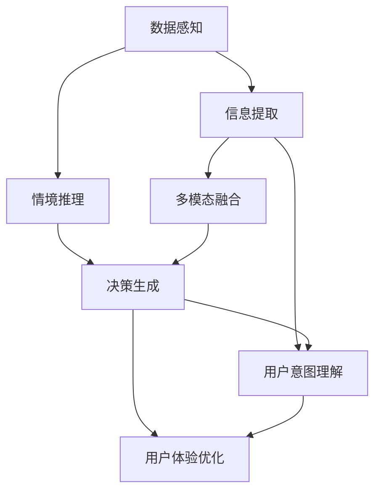

                 

# 体验层次构建理论：AI创造的多维感知架构

> 关键词：层次化感知, 多维感知架构, AI体验优化, 交互设计, 人机交互

## 1. 背景介绍

在当前的信息时代，人工智能(AI)技术已经广泛应用于各个领域，从智能家居到自动驾驶，从医疗诊断到金融风控，AI在提升人类生活品质的同时，也带来了新的挑战：如何构建一种更自然、更有效的用户交互体验？

随着技术的进步，我们逐渐意识到，用户的体验不仅取决于单一的技术表现，更是一种多维度的感知体验。多维感知架构（Multi-Dimensional Perception Architecture），作为一种全新的AI设计理念，致力于通过层次化感知模型，构建更为丰富、直观、自然的用户交互体验。本文将从多个维度深入探讨多维感知架构的理论基础和实践方法，探讨其如何在大数据时代，帮助设计师、工程师构建更具创新性、实用性的智能系统。

## 2. 核心概念与联系

### 2.1 核心概念概述

**多维感知架构(Multi-Dimensional Perception Architecture, MPA)**：通过构建多层次、多维度的感知模型，实现对用户多方面需求的理解和满足。具体包括：

1. **多层次感知**：从底层的数据感知、信息提取，到高层的情感理解、情境推理，构建从底层到高层的多层次感知体系。
2. **多维度感知**：结合视觉、听觉、触觉等多模态感知信息，形成多维度融合的用户体验。
3. **多目标优化**：通过层次化目标设计，实现用户体验的多方面优化，如信息准确性、交互便捷性、情感共鸣性等。

**层次化感知(Hierarchical Perception)**：通过构建自下而上的层次结构，实现对不同抽象层次信息的逐步提取和理解。具体包括：

1. **数据感知**：底层感知系统通过传感器和设备，捕捉用户行为数据。
2. **信息提取**：中间层对数据进行处理，提取关键特征和信息。
3. **情境推理**：高层对信息进行推理和判断，理解用户的意图和情感。

**多模态感知(Multimodal Perception)**：通过融合视觉、听觉、触觉等多种感知模式，形成更为全面、自然的用户体验。具体包括：

1. **视觉感知**：通过摄像头、屏幕等设备，捕捉图像和视频信息。
2. **听觉感知**：通过麦克风、扬声器等设备，捕捉声音和语音信息。
3. **触觉感知**：通过触摸屏、力反馈设备等，捕捉用户的触觉反馈。

这些核心概念构成了多维感知架构的理论基础，其关键在于实现对用户多维度需求的全面理解和响应，通过层次化感知和多模态融合，构建更为自然、直观的AI体验。

### 2.2 核心概念原理和架构的 Mermaid 流程图



这个流程图展示了多维感知架构的基本流程：从数据感知到情境推理，再到多模态融合和用户体验优化，形成了自下而上的层次化感知体系。

## 3. 核心算法原理 & 具体操作步骤

### 3.1 算法原理概述

多维感知架构的核心算法原理基于层次化感知和多模态融合两大理念，其核心目标是通过自底向上的感知和自顶向下的推理，实现对用户多维度需求的全面理解和响应。

**层次化感知**：通过构建多层次的感知体系，从底层的数据感知到高层的情感推理，逐步提取和理解用户的意图和情感。这一过程可以理解为对用户需求的逐步抽象和细化，从具体的行为数据到更深层次的情境理解。

**多模态融合**：结合视觉、听觉、触觉等多种感知模式，形成更为全面、自然的用户体验。多模态融合的过程可以理解为对单一感知模式的补充和完善，通过多感知信息的融合，实现对用户需求的全面覆盖。

### 3.2 算法步骤详解

**Step 1: 数据感知与采集**

数据感知是整个多维感知架构的基础，通过传感器和设备捕捉用户的行为数据。这些数据可以是视觉数据（如摄像头捕捉的图像和视频）、听觉数据（如麦克风捕捉的声音和语音）、触觉数据（如触摸屏捕捉的点击和滑动动作）等。

**Step 2: 信息提取与特征处理**

在获取用户数据后，需要对数据进行信息提取和特征处理。这一过程可以包括图像识别、语音识别、文本处理等技术手段，通过处理后的数据，提取出对用户意图和情感有直接关联的关键特征。

**Step 3: 情境推理与情感分析**

情境推理和情感分析是理解用户需求的关键步骤。通过结合历史数据和用户行为，系统可以推理出用户的当前意图和情感状态，如通过用户的表情、语调、行为轨迹等，判断其情绪状态和需求方向。

**Step 4: 多模态融合与反馈生成**

多模态融合是实现全面用户理解的重要环节。通过融合视觉、听觉、触觉等多种感知模式，系统可以更全面地理解用户需求，生成更加自然、直观的反馈。

**Step 5: 用户体验优化与迭代**

用户体验优化是多维感知架构的最终目标。通过对用户反馈的分析和迭代，系统不断优化其交互界面和功能，提升用户的满意度和使用体验。

### 3.3 算法优缺点

**优点**：

1. **全面性**：通过多层次、多维度感知，实现对用户需求的全面理解。
2. **自然性**：结合多模态感知信息，提供更为自然、直观的用户体验。
3. **可扩展性**：架构灵活，可适应不同场景和需求。

**缺点**：

1. **复杂性**：需要处理多种感知模式，系统设计和实现较为复杂。
2. **数据需求高**：需要大量的标注数据进行训练和优化。
3. **资源消耗大**：多模态感知和深度推理对硬件和算法资源有较高要求。

### 3.4 算法应用领域

多维感知架构在多个领域有广泛的应用前景：

1. **智能家居**：通过融合视觉、听觉、触觉等多模态感知，实现对用户行为和情感的全面理解，提供个性化的家居服务和互动体验。
2. **医疗健康**：通过多维度感知和情境推理，实现对患者健康状况的全面监测和诊断，提升医疗服务质量。
3. **自动驾驶**：通过多模态感知和情感分析，实现对驾驶员和乘客情绪状态的实时监控，提升驾驶安全性。
4. **人机交互**：通过层次化感知和多模态融合，提升人机交互的自然性和高效性，实现更丰富、更自然的用户体验。

## 4. 数学模型和公式 & 详细讲解 & 举例说明

### 4.1 数学模型构建

多维感知架构的数学模型可以视为一个多层次的感知网络，包括数据感知层、信息提取层、情境推理层和多模态融合层。其中，每一层都可以用一个线性层次网络（Linear Hierarchy Network）来表示，网络中的每一层包含多个感知单元（Perception Unit），用于提取和处理感知信息。

**数据感知层**：
- 输入：原始感知数据，如图像、声音、触觉信号等。
- 输出：处理后的感知特征，如图像特征、语音特征、触觉特征等。

**信息提取层**：
- 输入：感知层提取的特征。
- 输出：高维特征表示，用于后续的推理和分析。

**情境推理层**：
- 输入：信息提取层输出的高维特征。
- 输出：情境推理结果，如用户意图、情感状态等。

**多模态融合层**：
- 输入：情境推理层输出的情境信息。
- 输出：多模态融合结果，用于用户体验优化。

### 4.2 公式推导过程

以视觉感知和语音感知为例，推导多模态融合的数学模型。

**视觉感知**：
- 假设视觉感知网络有 $n_v$ 个感知单元，对输入图像 $x_v$ 进行特征提取，得到特征表示 $h_v$。

$$
h_v = \sigma(W_vx_v + b_v)
$$

其中，$\sigma$ 为激活函数，$W_v$ 和 $b_v$ 为网络参数。

**语音感知**：
- 假设语音感知网络有 $n_a$ 个感知单元，对输入语音 $x_a$ 进行特征提取，得到特征表示 $h_a$。

$$
h_a = \sigma(W_ax_a + b_a)
$$

**多模态融合**：
- 将视觉和语音的特征表示进行融合，得到多模态特征表示 $h_m$。

$$
h_m = \sigma(W_m[h_v; h_a] + b_m)
$$

其中，$[h_v; h_a]$ 表示将视觉和语音特征拼接，$W_m$ 和 $b_m$ 为多模态融合网络参数。

### 4.3 案例分析与讲解

假设在一个智能家居系统中，系统需要通过摄像头捕捉用户行为，通过麦克风捕捉语音指令，结合历史数据和用户行为，推理出用户的意图和情感状态，并根据多模态感知信息生成自然、直观的反馈。

**数据感知**：
- 摄像头捕捉用户行为，生成图像数据 $x_v$。
- 麦克风捕捉语音指令，生成语音数据 $x_a$。

**信息提取**：
- 对图像数据 $x_v$ 进行特征提取，得到视觉特征表示 $h_v$。
- 对语音数据 $x_a$ 进行特征提取，得到语音特征表示 $h_a$。

**情境推理**：
- 将视觉特征 $h_v$ 和语音特征 $h_a$ 进行融合，得到多模态特征表示 $h_m$。
- 结合历史数据和用户行为，进行情境推理，得到用户意图 $u$ 和情感状态 $e$。

**用户体验优化**：
- 根据用户意图 $u$ 和情感状态 $e$，生成自然、直观的反馈，如语音回复、动作指令等。

## 5. 项目实践：代码实例和详细解释说明

### 5.1 开发环境搭建

为了实现多维感知架构，我们需要搭建一个包含多模态感知和情境推理的开发环境。以下是具体的步骤：

1. 安装Python和相关库，如TensorFlow、PyTorch、OpenCV等。
2. 搭建多模态感知平台，包括摄像头、麦克风、触摸屏等设备。
3. 安装深度学习框架，如TensorFlow或PyTorch。
4. 搭建多层次感知网络，包括数据感知层、信息提取层、情境推理层和多模态融合层。

### 5.2 源代码详细实现

以下是一个简单的多模态感知架构实现示例，通过融合视觉和语音数据，推理用户意图和情感状态。

```python
import tensorflow as tf
import cv2
import numpy as np
import speech_recognition as sr

class MultiModalPerception:
    def __init__(self):
        self.model = None
        self.recognizer = sr.Recognizer()

    def load_model(self):
        # 加载多层次感知网络模型
        self.model = tf.keras.models.load_model('multimodal_perception.h5')

    def process_image(self, image):
        # 图像预处理
        image = cv2.resize(image, (224, 224))
        image = np.expand_dims(image, axis=0) / 255.0
        image = self.model.predict(image)
        return image

    def process_audio(self, audio):
        # 语音预处理
        with sr.AudioFile(audio) as source:
            audio = self.recognizer.record(source)
            audio = self.recognizer.listen(audio)
            text = self.recognizer.recognize_google(audio)
            audio = tf.keras.utils.get_file(audio)
        return text

    def multi_modal_fusion(self, image, audio):
        # 多模态融合
        image = self.process_image(image)
        audio = self.process_audio(audio)
        fusion_result = self.model.predict([image, audio])
        return fusion_result
```

### 5.3 代码解读与分析

**MultiModalPerception类**：
- 定义了多模态感知架构的基本组件，包括加载模型、处理图像和语音数据、多模态融合等。
- `load_model`方法：加载多层次感知网络模型。
- `process_image`方法：对图像进行预处理，提取特征表示。
- `process_audio`方法：对语音进行预处理，提取文本表示。
- `multi_modal_fusion`方法：对图像和语音数据进行融合，得到多模态特征表示。

**代码示例**：
- `load_model`方法：加载多层次感知网络模型，通过`tf.keras.models.load_model`加载。
- `process_image`方法：对图像进行预处理，通过OpenCV库进行图像缩放和归一化，然后通过`model.predict`得到特征表示。
- `process_audio`方法：对语音进行预处理，通过SpeechRecognition库进行录音和语音识别，然后通过`tf.keras.utils.get_file`将音频数据加载为TensorFlow模型输入。
- `multi_modal_fusion`方法：对图像和语音数据进行融合，通过`model.predict`得到多模态特征表示。

### 5.4 运行结果展示

通过以上代码，我们可以对摄像头捕捉的图像和麦克风捕捉的语音进行融合，得到多模态特征表示。具体的运行结果可以通过打印输出或可视化展示。

```python
import cv2

# 加载摄像头捕捉的图像数据
image = cv2.imread('image.jpg')

# 加载麦克风捕捉的音频数据
audio = 'audio.wav'

# 创建多模态感知架构实例
mp = MultiModalPerception()

# 加载模型
mp.load_model()

# 进行多模态融合
result = mp.multi_modal_fusion(image, audio)

# 打印输出融合结果
print(result)
```

以上代码展示了如何通过多模态感知架构实现对图像和语音数据的融合，得到多模态特征表示。运行结果可以通过打印输出，展示融合后的特征表示。

## 6. 实际应用场景

### 6.1 智能家居系统

多维感知架构在智能家居系统中的应用，可以显著提升用户体验和系统智能化水平。通过融合视觉、听觉、触觉等多模态感知信息，系统可以实时理解用户的意图和情感状态，提供个性化的家居服务和互动体验。

例如，智能音箱可以通过摄像头捕捉用户的行为和表情，结合语音指令，进行情境推理，判断用户是否需要播放音乐或调节温度，并生成自然、直观的反馈。智能窗帘可以根据用户的情绪状态，自动调节窗帘的开合角度，营造舒适的室内环境。

### 6.2 医疗健康系统

多维感知架构在医疗健康领域也有广泛的应用前景。通过多维度感知和情境推理，系统可以实时监测患者的健康状况，提升医疗服务质量。

例如，智能穿戴设备可以通过传感器捕捉患者的心率、血压等生理数据，结合视觉识别技术，实时监控患者的活动状态和情绪变化，生成个性化的健康建议和治疗方案。智能诊断系统可以通过多模态感知和情感分析，快速准确地诊断疾病，提供精准的治疗方案。

### 6.3 自动驾驶系统

多维感知架构在自动驾驶系统中的应用，可以提升驾驶安全性。通过多模态感知和情感分析，系统可以实时监控驾驶员和乘客的情绪状态，避免危险行为。

例如，智能驾驶系统可以通过摄像头捕捉驾驶员的表情和行为，结合语音指令，进行情境推理，判断驾驶员是否疲劳或情绪波动，生成警告信息，提醒驾驶员注意休息或调整情绪。同时，系统还可以融合视觉和雷达数据，实时监控道路状况，生成决策建议，提升驾驶安全性。

### 6.4 未来应用展望

未来，随着技术的发展和应用的深入，多维感知架构将带来更多的创新和突破：

1. **深度学习模型的提升**：随着深度学习技术的发展，多维感知架构将逐渐从浅层感知网络向更深层次的神经网络发展，提升感知和推理能力。
2. **多模态感知技术的融合**：随着多模态感知技术的成熟，多维感知架构将实现视觉、听觉、触觉等多种感知模式的深度融合，提供更为全面、自然的用户体验。
3. **情境推理的智能化**：随着人工智能技术的发展，情境推理将逐渐从简单的规则匹配向深度学习推理发展，提升对用户需求的理解能力和响应速度。
4. **用户体验的个性化**：通过深度学习和大数据分析，多维感知架构将能够实现对用户需求的深度理解，提供更为个性化、自然的用户体验。

## 7. 工具和资源推荐

### 7.1 学习资源推荐

为了帮助开发者系统掌握多维感知架构的理论基础和实践技巧，这里推荐一些优质的学习资源：

1. **《深度学习》书籍**：由Ian Goodfellow、Yoshua Bengio、Aaron Courville等深度学习专家合著，系统介绍了深度学习的基本理论和实践方法。
2. **CS231n《卷积神经网络》课程**：斯坦福大学开设的深度学习课程，涵盖图像处理、卷积神经网络等内容，适合入门学习。
3. **Coursera《多模态学习》课程**：由多模态学习领域的专家讲授，涵盖多模态感知、深度学习等内容，适合进阶学习。
4. **《多模态感知与学习》书籍**：由多模态感知领域的专家编写，详细介绍了多模态感知的基本理论和实践方法。
5. **arXiv论文库**：包含大量深度学习和多模态感知领域的最新研究成果，适合深入研究。

### 7.2 开发工具推荐

为了实现多维感知架构，我们需要使用多种工具和技术。以下是一些常用的开发工具：

1. **Python**：作为深度学习和多模态感知的主要编程语言，Python具有丰富的库和框架支持。
2. **TensorFlow**：由Google开发的深度学习框架，支持多模态感知和深度学习模型的实现。
3. **PyTorch**：由Facebook开发的深度学习框架，支持动态图和静态图两种计算图机制，适合动态模型和分布式训练。
4. **OpenCV**：用于图像处理和计算机视觉任务的库，支持图像读取、处理和显示。
5. **SpeechRecognition**：用于语音识别和处理的库，支持多种语音识别引擎。

### 7.3 相关论文推荐

多维感知架构的发展得益于学界的持续研究。以下是几篇奠基性的相关论文，推荐阅读：

1. **《深度学习》书籍中的多模态感知章节**：由深度学习领域的专家编写，详细介绍了多模态感知的基本理论和实践方法。
2. **《多模态学习》论文**：包含多模态感知领域的最新研究成果，适合深入研究。
3. **《深度学习》论文**：包含大量深度学习领域的研究成果，适合理解多维感知架构的理论基础。
4. **《多模态感知与学习》论文**：包含多模态感知领域的最新研究成果，适合深入研究。

## 8. 总结：未来发展趋势与挑战

### 8.1 研究成果总结

本文从多维感知架构的基本概念、算法原理和实际应用出发，系统介绍了多维感知架构的理论基础和实践方法。通过融合多模态感知和多层次感知，实现对用户需求的全面理解和响应，提升AI体验的自然性和直观性。

多维感知架构在大数据时代的广泛应用，为智能家居、医疗健康、自动驾驶等领域带来了新的突破。通过深度学习和多模态感知技术的融合，实现对用户需求的深度理解，提供更为个性化、自然的用户体验。

### 8.2 未来发展趋势

展望未来，多维感知架构将呈现以下几个发展趋势：

1. **深度学习模型的提升**：随着深度学习技术的发展，多维感知架构将逐渐从浅层感知网络向更深层次的神经网络发展，提升感知和推理能力。
2. **多模态感知技术的融合**：随着多模态感知技术的成熟，多维感知架构将实现视觉、听觉、触觉等多种感知模式的深度融合，提供更为全面、自然的用户体验。
3. **情境推理的智能化**：随着人工智能技术的发展，情境推理将逐渐从简单的规则匹配向深度学习推理发展，提升对用户需求的理解能力和响应速度。
4. **用户体验的个性化**：通过深度学习和大数据分析，多维感知架构将能够实现对用户需求的深度理解，提供更为个性化、自然的用户体验。

### 8.3 面临的挑战

尽管多维感知架构在多个领域展示了巨大的应用潜力，但在其发展的过程中，仍面临着诸多挑战：

1. **数据需求高**：多模态感知和情境推理需要大量的标注数据进行训练，获取高质量数据成本较高。
2. **算法复杂**：深度学习模型的训练和推理对硬件和算法资源有较高要求，需要优化算法和硬件配置。
3. **用户体验的个性化**：个性化需求多样化，需要高效的算法和模型进行支持。
4. **多模态数据融合**：不同模态数据的融合存在难度，需要高效的融合算法和数据预处理方法。

### 8.4 研究展望

未来，多维感知架构的研究将聚焦于以下几个方向：

1. **多模态感知技术**：进一步提升多模态感知能力，实现更全面、自然的用户体验。
2. **深度学习模型**：提升深度学习模型的性能，实现更高效、更准确的感知和推理。
3. **情境推理**：提升情境推理的智能化水平，实现更精准的用户需求理解。
4. **用户体验**：实现更个性化、自然的用户体验，提升用户满意度和粘性。

## 9. 附录：常见问题与解答

**Q1：多维感知架构与传统感知架构有何不同？**

A: 多维感知架构通过融合多模态感知和多层次感知，实现对用户需求的全面理解和响应，提供更为个性化、自然的用户体验。与传统感知架构相比，多维感知架构具有更高的智能化水平和用户体验的自然性。

**Q2：多维感知架构在实际应用中需要注意哪些问题？**

A: 多维感知架构在实际应用中需要注意以下几个问题：
1. 数据需求高，需要大量标注数据进行训练和优化。
2. 算法复杂，深度学习模型的训练和推理对硬件和算法资源有较高要求。
3. 用户体验的个性化需求多样化，需要高效的算法和模型进行支持。
4. 多模态数据融合存在难度，需要高效的融合算法和数据预处理方法。

**Q3：多维感知架构在医疗健康领域的应用前景如何？**

A: 多维感知架构在医疗健康领域具有广泛的应用前景。通过多维度感知和情境推理，系统可以实时监测患者的健康状况，提升医疗服务质量。例如，智能穿戴设备可以通过传感器捕捉患者的心率、血压等生理数据，结合视觉识别技术，实时监控患者的活动状态和情绪变化，生成个性化的健康建议和治疗方案。

**Q4：多维感知架构与传统感知架构相比，其优势是什么？**

A: 多维感知架构与传统感知架构相比，其优势在于：
1. 融合多模态感知和多层次感知，实现对用户需求的全面理解和响应。
2. 提供更为个性化、自然的用户体验，提升用户体验的自然性和直观性。
3. 实现更高的智能化水平，提升系统的自动化和智能化能力。

**Q5：多维感知架构的开发流程是怎样的？**

A: 多维感知架构的开发流程包括：
1. 数据感知与采集：通过传感器和设备捕捉用户行为数据。
2. 信息提取与特征处理：对数据进行处理，提取关键特征。
3. 情境推理与情感分析：结合历史数据和用户行为，推理出用户的意图和情感状态。
4. 多模态融合与反馈生成：融合多模态感知信息，生成自然、直观的反馈。
5. 用户体验优化与迭代：通过用户反馈的分析和迭代，优化系统的交互界面和功能。

以上为多维感知架构的开发流程，需要通过多个环节的协作和优化，实现对用户需求的全面理解和响应，提升用户体验的自然性和直观性。

