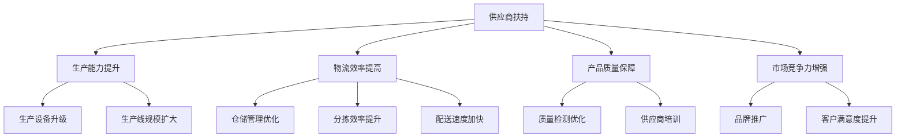

                 

## 1. 背景介绍

随着电子商务的蓬勃发展，电商平台已逐渐成为企业主要的销售渠道之一。然而，面对快速增长的用户需求和激烈的市场竞争，电商平台的供给能力面临着严峻的挑战。提升供应商的供给能力成为电商企业亟待解决的问题之一。本文将探讨如何通过供应商扶持，增强供应商的供给能力，从而提升电商平台的整体供给能力。

### 1.1 问题由来

随着电子商务的迅猛发展，平台订单量大幅增加，尤其是在“双十一”、“618”等促销活动期间，平台需要短时间内处理大量订单，对供应商的供货能力提出了极高的要求。同时，消费者对商品质量和物流速度的期望也进一步提升，供应商需要保证产品质量和物流速度，以满足消费者的需求。然而，面对如此巨大的需求压力，供应商的供给能力往往无法及时满足，导致平台出现库存短缺、物流延误等问题，严重影响了消费者的购物体验和平台的信誉。

### 1.2 问题核心关键点

面对供给能力不足的问题，供应商扶持成为提升电商平台供给能力的关键手段。供应商扶持不仅能够帮助供应商提高生产能力、物流效率和产品质量，还能增强供应商的市场竞争力，促进平台生态的健康发展。

## 2. 核心概念与联系

### 2.1 核心概念概述

为更好地理解供应商扶持的原理和实践，本节将介绍几个密切相关的核心概念：

- **供应商扶持**：指电商平台通过资金支持、技术帮助、市场推广等多种方式，提升供应商的生产能力、物流效率和产品质量，从而增强其市场竞争力。
- **生产能力**：指供应商在一定时间内生产商品的能力，包括生产设备的自动化水平、生产线的规模和效率等。
- **物流效率**：指商品从生产到交付的全流程效率，包括仓储管理、分拣效率、配送速度等。
- **产品质量**：指商品满足消费者需求的程度，包括商品的可靠性和性能等。
- **市场竞争力**：指供应商在市场中的地位和竞争力，包括品牌影响力、市场份额、客户满意度等。
- **电商平台**：指通过互联网技术提供商品销售、物流配送、支付结算等服务的平台，包括传统电商和社交电商等。
- **供应链管理**：指对供应商的生产、仓储、物流等环节进行协调和管理的系统，确保商品从生产到交付的顺畅进行。
- **数字化转型**：指通过数字化技术，提升企业的生产效率、管理水平和服务能力的过程，包括信息化、自动化和智能化等。

这些核心概念之间的逻辑关系可以通过以下Mermaid流程图来展示：



这个流程图展示供应商扶持的核心概念及其之间的关系：

1. 供应商扶持通过多种方式，提升供应商的生产能力、物流效率和产品质量，增强其市场竞争力。
2. 生产能力的提升包括生产设备升级和生产线规模扩大。
3. 物流效率的提高包括仓储管理优化、分拣效率提升和配送速度加快。
4. 产品质量的保障包括质量检测优化和供应商培训。
5. 市场竞争力的增强包括品牌推广和客户满意度提升。

## 3. 核心算法原理 & 具体操作步骤

### 3.1 算法原理概述

供应商扶持的原理是通过多种方式提升供应商的生产能力、物流效率和产品质量，从而增强其市场竞争力。具体步骤如下：

1. **资金支持**：电商平台为供应商提供资金支持，用于升级生产设备、扩大生产线等，提升其生产能力。
2. **技术帮助**：电商平台通过技术合作，帮助供应商优化生产流程、提高仓储和物流效率，提升供应链的透明度和协同能力。
3. **市场推广**：电商平台通过市场推广活动，提高供应商的品牌知名度和市场影响力，增强其市场竞争力。

### 3.2 算法步骤详解

供应商扶持的算法步骤包括资金支持、技术帮助和市场推广，具体如下：

**Step 1: 评估供应商需求**

- 对供应商的生产能力、物流效率和产品质量进行评估，找出其不足之处。
- 与供应商沟通，了解其需求和困难，制定扶持计划。

**Step 2: 制定扶持计划**

- 根据评估结果，制定资金支持、技术帮助和市场推广的扶持计划。
- 确定扶持的目标、时间表和评估标准。

**Step 3: 执行扶持计划**

- 实施资金支持，包括发放贷款、补贴等，用于升级生产设备、扩大生产线等。
- 实施技术帮助，包括提供技术支持、优化生产流程、提高仓储和物流效率等。
- 实施市场推广，包括品牌推广活动、联合促销等，提高供应商的市场影响力。

**Step 4: 评估扶持效果**

- 定期评估扶持计划的效果，包括生产能力、物流效率和产品质量的提升情况。
- 根据评估结果，调整扶持计划，进一步提升供应商的竞争力。

### 3.3 算法优缺点

供应商扶持的优点包括：

1. **提升生产能力**：通过资金支持和设备升级，供应商的生产能力得到提升，能够满足更高的订单需求。
2. **提高物流效率**：通过技术帮助，供应商的仓储管理和物流效率得到优化，能够快速响应订单需求。
3. **保障产品质量**：通过质量检测优化和供应商培训，商品质量得到保障，增强消费者对品牌的信任。
4. **增强市场竞争力**：通过市场推广，供应商的品牌知名度和市场影响力得到提升，增强其市场竞争力。

供应商扶持的缺点包括：

1. **资金成本较高**：资金支持需要较大的资金投入，可能对电商平台的财务状况造成压力。
2. **技术实施复杂**：技术帮助需要较强的技术实力和实施能力，可能面临技术难题。
3. **市场推广风险**：市场推广效果不确定，可能面临投入与回报不匹配的风险。

### 3.4 算法应用领域

供应商扶持在以下领域具有广泛的应用前景：

1. **快速消费品行业**：如食品、饮料、日用品等，这些行业订单量较大，需要较强的生产能力和物流效率。
2. **电子产品行业**：如手机、电脑、家电等，这些行业技术含量高，需要不断的技术支持和升级。
3. **服装行业**：如男装、女装、童装等，这些行业对生产效率和产品质量要求较高。
4. **家居行业**：如家具、家居用品等，这些行业需要较大的仓储管理和物流配送能力。
5. **跨境电商行业**：如国际贸易、跨境零售等，这些行业涉及多国物流，需要较高的物流效率和物流管理能力。

## 4. 数学模型和公式 & 详细讲解 & 举例说明

### 4.1 数学模型构建

为更精确地评估供应商扶持的效果，我们构建以下数学模型：

设供应商的初始生产能力为 $P_0$，初始物流效率为 $L_0$，初始产品质量为 $Q_0$，初始市场竞争力为 $C_0$。
经过资金支持、技术帮助和市场推广后，供应商的生产能力提升为 $P_1$，物流效率提升为 $L_1$，产品质量提升为 $Q_1$，市场竞争力提升为 $C_1$。

则供应商扶持的效果可以通过以下公式计算：

$$
\Delta P = P_1 - P_0, \Delta L = L_1 - L_0, \Delta Q = Q_1 - Q_0, \Delta C = C_1 - C_0
$$

其中，$\Delta P$、$\Delta L$、$\Delta Q$ 和 $\Delta C$ 分别表示生产能力、物流效率、产品质量和市场竞争力的提升量。

### 4.2 公式推导过程

以生产能力提升为例，其推导过程如下：

设电商平台为供应商提供了资金支持 $F$，用于升级生产设备，提升生产能力。则生产能力提升为：

$$
P_1 = P_0 + \frac{F}{k}
$$

其中，$k$ 为生产设备的折旧系数。

类似地，物流效率提升、产品质量提升和市场竞争力提升也可以通过相应的资金支持和措施推导得到。

### 4.3 案例分析与讲解

**案例分析：电商平台扶持某家具供应商**

某电商平台对某家具供应商进行了扶持，投入资金 $F$ 用于升级生产设备，提升生产能力。该家具供应商的生产能力提升为 $P_1 = P_0 + \frac{F}{k}$，物流效率提升为 $L_1 = L_0 + \frac{G}{l}$，产品质量提升为 $Q_1 = Q_0 + \frac{H}{q}$，市场竞争力提升为 $C_1 = C_0 + \frac{I}{c}$。

其中，$F$、$G$、$H$ 和 $I$ 分别为资金投入、技术支持、质量检测和市场推广的费用，$k$、$l$、$q$ 和 $c$ 分别为生产设备、仓储管理、质量检测和市场推广的系数。

根据以上数据，可以计算供应商扶持的效果，具体如下：

$$
\Delta P = P_1 - P_0 = \frac{F}{k}
$$

$$
\Delta L = L_1 - L_0 = \frac{G}{l}
$$

$$
\Delta Q = Q_1 - Q_0 = \frac{H}{q}
$$

$$
\Delta C = C_1 - C_0 = \frac{I}{c}
$$

通过计算，可以评估供应商扶持的效果，进一步优化扶持计划。

## 5. 项目实践：代码实例和详细解释说明

### 5.1 开发环境搭建

在进行供应商扶持的代码实现前，我们需要准备好开发环境。以下是使用Python进行数据分析和可视化的环境配置流程：

1. 安装Anaconda：从官网下载并安装Anaconda，用于创建独立的Python环境。

2. 创建并激活虚拟环境：
```bash
conda create -n pydata-env python=3.8 
conda activate pydata-env
```

3. 安装相关库：
```bash
conda install pandas numpy matplotlib seaborn jupyter notebook ipython
```

完成上述步骤后，即可在`pydata-env`环境中开始数据分析和可视化。

### 5.2 源代码详细实现

这里我们以一个简单的数据集为例，演示如何通过Python代码实现供应商扶持的效果评估。

首先，准备数据集：

```python
import pandas as pd

# 加载数据集
df = pd.read_csv('supply_chain.csv')
```

然后，进行数据处理和分析：

```python
# 计算供应商扶持的效果
df['Delta_P'] = df['P1'] - df['P0']
df['Delta_L'] = df['L1'] - df['L0']
df['Delta_Q'] = df['Q1'] - df['Q0']
df['Delta_C'] = df['C1'] - df['C0']
```

最后，进行数据可视化：

```python
import matplotlib.pyplot as plt

# 绘制柱状图，展示扶持效果
plt.bar(df['Supplier'], df['Delta_P'], color='blue', label='生产能力提升')
plt.bar(df['Supplier'], df['Delta_L'], bottom=df['Delta_P'], color='green', label='物流效率提升')
plt.bar(df['Supplier'], df['Delta_Q'], bottom=df['Delta_P'] + df['Delta_L'], color='red', label='产品质量提升')
plt.bar(df['Supplier'], df['Delta_C'], bottom=df['Delta_P'] + df['Delta_L'] + df['Delta_Q'], color='orange', label='市场竞争力提升')

plt.xlabel('供应商')
plt.ylabel('扶持效果')
plt.title('供应商扶持效果评估')
plt.legend()
plt.show()
```

以上代码实现了一个简单的供应商扶持效果评估功能。在实际应用中，开发者需要根据具体需求，进行更复杂的数据分析和可视化。

### 5.3 代码解读与分析

这里我们重点解读一下代码中的关键部分：

**数据加载**：使用Pandas库加载CSV格式的数据集，方便后续的数据处理和分析。

**数据处理**：通过简单的数学运算，计算供应商扶持的效果，并保存在新的列中。

**数据可视化**：使用Matplotlib库绘制柱状图，展示生产能力、物流效率、产品质量和市场竞争力的提升效果。

**代码解释**：
- `pd.read_csv('supply_chain.csv')`：加载CSV格式的数据集。
- `df['Delta_P'] = df['P1'] - df['P0']`：计算生产能力的提升量。
- `plt.bar(df['Supplier'], df['Delta_P'], color='blue', label='生产能力提升')`：绘制生产能力提升的柱状图。

## 6. 实际应用场景

### 6.1 智能制造行业

在智能制造行业中，供应商扶持可以显著提升企业的生产能力和物流效率，提高产品质量和市场竞争力。通过资金支持和技术帮助，企业可以引入先进的生产设备和自动化系统，优化生产流程，提高生产效率。通过市场推广，企业可以提升品牌知名度和市场影响力，增强其市场竞争力。

### 6.2 农业行业

农业行业面临的主要问题是生产规模小、物流成本高、产品质量不稳定等。通过供应商扶持，农业企业可以引入现代农业技术，提高生产规模和生产效率，降低生产成本。同时，通过资金支持和技术帮助，企业可以引入先进的物流设备和仓储管理技术，降低物流成本，提高物流效率。通过市场推广，企业可以提升品牌知名度和市场影响力，增强其市场竞争力。

### 6.3 金融行业

金融行业面临的主要问题是数据安全性、服务效率和客户体验等。通过供应商扶持，金融机构可以引入先进的数据安全技术和金融科技，提高数据安全性和服务效率。通过资金支持和市场推广，企业可以提升品牌知名度和市场影响力，增强其市场竞争力。

### 6.4 未来应用展望

未来，供应商扶持的应用场景将进一步扩大，包括以下领域：

1. **医疗行业**：通过资金支持和市场推广，医疗机构可以提升医疗设备的生产能力和物流效率，提高医疗服务的质量和效率。
2. **教育行业**：通过资金支持和市场推广，教育机构可以提升教学设备的生产能力和物流效率，提高教学服务的质量和效率。
3. **能源行业**：通过资金支持和市场推广，能源企业可以提升能源设备的生产能力和物流效率，提高能源服务的质量和效率。
4. **交通运输行业**：通过资金支持和市场推广，交通运输企业可以提升交通运输设备的生产能力和物流效率，提高交通运输服务的质量和效率。

## 7. 工具和资源推荐

### 7.1 学习资源推荐

为帮助开发者系统掌握供应商扶持的理论基础和实践技巧，这里推荐一些优质的学习资源：

1. **《供应链管理》教材**：全面介绍了供应链管理的理论和方法，包括供应商扶持、物流管理、库存管理等。
2. **《智能制造》教材**：介绍了智能制造的原理和实践，包括生产设备自动化、生产过程优化、物流管理等。
3. **《金融科技》教材**：介绍了金融科技的原理和应用，包括金融设备生产、数据安全、客户体验等。
4. **Coursera供应链管理课程**：斯坦福大学开设的供应链管理课程，涵盖供应链管理的各个方面，包括供应商扶持、物流管理、库存管理等。
5. **Udacity智能制造课程**：Udacity开设的智能制造课程，涵盖智能制造的各个方面，包括生产设备自动化、生产过程优化、物流管理等。
6. **edX金融科技课程**：哈佛大学开设的金融科技课程，涵盖金融科技的各个方面，包括金融设备生产、数据安全、客户体验等。

通过对这些资源的学习实践，相信你一定能够快速掌握供应商扶持的精髓，并用于解决实际的供应链管理问题。

### 7.2 开发工具推荐

高效的开发离不开优秀的工具支持。以下是几款用于供应商扶持开发的常用工具：

1. **Python**：Python是一种通用的编程语言，具有易学易用、功能强大、社区支持等优点。适合开发供应商扶持相关的数据分析和可视化功能。
2. **Jupyter Notebook**：Jupyter Notebook是一种交互式的数据分析工具，支持Python等编程语言，便于开发者进行数据分析和可视化。
3. **Matplotlib**：Matplotlib是一个Python的可视化库，支持绘制各种类型的图表，方便开发者进行数据分析和可视化。
4. **Seaborn**：Seaborn是一个基于Matplotlib的数据可视化库，支持绘制更加美观、智能的图表，方便开发者进行数据分析和可视化。
5. **TensorBoard**：TensorBoard是TensorFlow配套的可视化工具，可以实时监测模型训练状态，提供丰富的图表呈现方式，方便开发者进行数据分析和可视化。
6. **Weights & Biases**：Weights & Biases是模型训练的实验跟踪工具，可以记录和可视化模型训练过程中的各项指标，方便开发者进行数据分析和可视化。

合理利用这些工具，可以显著提升供应商扶持任务的开发效率，加快创新迭代的步伐。

### 7.3 相关论文推荐

供应商扶持作为供应链管理的重要手段，已经引起了学界的广泛关注。以下是几篇奠基性的相关论文，推荐阅读：

1. **《供应链管理：理论与实践》**：讲述了供应链管理的理论和方法，包括供应商扶持、物流管理、库存管理等。
2. **《智能制造：现状、挑战与未来》**：介绍了智能制造的原理和实践，包括生产设备自动化、生产过程优化、物流管理等。
3. **《金融科技：现状、挑战与未来》**：介绍了金融科技的原理和应用，包括金融设备生产、数据安全、客户体验等。
4. **《供应商扶持：理论与实践》**：介绍了供应商扶持的理论和方法，包括资金支持、技术帮助、市场推广等。
5. **《智能制造与供应链管理》**：介绍了智能制造和供应链管理的关系，探讨了如何通过智能制造提升供应链管理水平。
6. **《金融科技与供应链管理》**：介绍了金融科技和供应链管理的关系，探讨了如何通过金融科技提升供应链管理水平。

这些论文代表了大语言模型微调技术的发展脉络。通过学习这些前沿成果，可以帮助研究者把握学科前进方向，激发更多的创新灵感。

## 8. 总结：未来发展趋势与挑战

### 8.1 总结

本文对供应商扶持的原理和实践进行了全面系统的介绍。首先阐述了供应商扶持在提升电商平台供给能力中的重要性，明确了扶持供应商的需求和目标。其次，从原理到实践，详细讲解了供应商扶持的数学模型和操作步骤，给出了供应商扶持任务开发的完整代码实例。同时，本文还广泛探讨了供应商扶持在多个行业领域的应用前景，展示了供应商扶持范式的巨大潜力。此外，本文精选了供应商扶持技术的各类学习资源，力求为读者提供全方位的技术指引。

通过本文的系统梳理，可以看到，供应商扶持技术正在成为电商平台供应链管理的重要手段，极大地拓展了电商平台的供给能力，提升了消费者的购物体验和平台的信誉。未来，伴随技术进步和产业升级，供应商扶持将会有更广阔的应用场景和更深远的影响。

### 8.2 未来发展趋势

展望未来，供应商扶持技术将呈现以下几个发展趋势：

1. **智能化和自动化**：通过引入智能制造和自动化技术，供应商的生产能力和物流效率将得到进一步提升，同时降低人工成本和错误率。
2. **数字化和信息化**：通过数字化和信息化技术，供应商的供应链管理将更加透明和高效，实时监控和优化供应链各环节。
3. **协同化和标准化**：通过供应链协同和标准化，供应商的供应链管理将更加规范和高效，降低供应链成本，提高供应链可靠性。
4. **全球化和本地化**：通过全球化和本地化策略，供应商的供应链管理将更加灵活和高效，满足全球市场的需求。
5. **可持续化和环保化**：通过可持续化和环保化技术，供应商的供应链管理将更加绿色和可持续，降低环境污染和资源消耗。

以上趋势凸显了供应商扶持技术的广阔前景。这些方向的探索发展，必将进一步提升电商平台和供应商的供给能力，推动供应链管理的全面升级。

### 8.3 面临的挑战

尽管供应商扶持技术已经取得了显著成效，但在迈向更加智能化、协同化和标准化应用的过程中，它仍面临着诸多挑战：

1. **技术复杂性**：供应商扶持涉及多个环节，包括生产、物流、质量管理等，技术复杂性较高，需要较强的技术实力和实施能力。
2. **成本高昂**：供应商扶持需要较大的资金投入，对中小供应商可能面临资金压力。
3. **市场风险**：供应商扶持的效果受市场需求和市场竞争的影响，可能面临投入与回报不匹配的风险。
4. **质量保障**：供应商扶持需要保证产品质量，但质量检测和供应商培训需要较长的周期和较高的人员投入。
5. **市场适应性**：供应商扶持需要适应不同的市场环境，不同市场的供需变化可能对扶持效果产生影响。

### 8.4 研究展望

面对供应商扶持所面临的挑战，未来的研究需要在以下几个方面寻求新的突破：

1. **数字化转型**：通过数字化转型，提升供应商的生产效率和管理水平，提高供应链的透明度和协同能力。
2. **技术创新**：开发更加智能化的生产设备和物流系统，提高生产效率和物流效率，降低人工成本和错误率。
3. **成本控制**：通过合理的资金支持和成本控制策略，降低供应商扶持的成本，提高资金投入的回报率。
4. **质量提升**：引入先进的质量检测技术和供应商培训，提升商品质量，增强消费者对品牌的信任。
5. **市场优化**：通过市场分析和预测技术，优化供应链管理策略，提高市场适应性和灵活性。

这些研究方向的探索，必将引领供应商扶持技术迈向更高的台阶，为供应链管理的全面升级和电商平台的可持续发展提供更强的技术支撑。

## 9. 附录：常见问题与解答

**Q1：供应商扶持是否适用于所有行业？**

A: 供应商扶持在制造业、物流业、金融业等多个行业具有广泛的应用前景。但不同行业的供应商扶持策略和方法可能存在差异，需要根据具体情况进行定制化设计。

**Q2：如何选择合适的供应商扶持策略？**

A: 供应商扶持策略的选择应根据供应商的实际情况和需求进行，包括资金需求、技术需求、市场推广需求等。一般而言，应优先考虑供应商的薄弱环节，选择最具针对性的扶持策略。

**Q3：供应商扶持的效果如何评估？**

A: 供应商扶持的效果可以通过生产能力提升、物流效率提升、产品质量提升和市场竞争力提升等指标进行评估。可以通过数据分析和可视化工具进行评估和展示。

**Q4：供应商扶持如何与数字化转型结合？**

A: 供应商扶持可以与数字化转型结合，通过引入数字化技术和信息化工具，提升供应商的生产效率和管理水平，提高供应链的透明度和协同能力。

**Q5：供应商扶持如何避免风险？**

A: 供应商扶持需要制定详细的计划和风险控制措施，如资金预算、技术支持、市场推广等。同时，需要定期评估扶持效果，及时调整策略，规避市场风险。

通过本文的系统梳理，可以看到，供应商扶持技术正在成为电商平台供应链管理的重要手段，极大地拓展了电商平台的供给能力，提升了消费者的购物体验和平台的信誉。未来，伴随技术进步和产业升级，供应商扶持将会有更广阔的应用场景和更深远的影响。

---

作者：禅与计算机程序设计艺术 / Zen and the Art of Computer Programming

