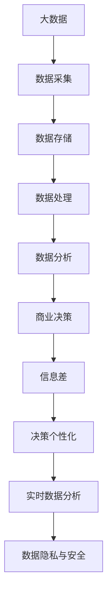

                 

# 信息差的商业决策个性化：大数据如何支持决策个性化

## 1. 背景介绍

在当今信息爆炸的时代，企业面临着海量数据和多元化的信息源，如何在大数据背景下进行个性化决策，成为了提升企业竞争力的关键。信息差（Information Gap）是指决策者所掌握的信息与决策所需信息之间的差异。在商业决策中，信息差不仅影响决策的准确性和效率，还关系到企业战略规划和运营管理的成效。大数据技术的兴起，为解决信息差问题提供了强有力的支持，使得决策者能够更好地理解和利用海量数据，实现决策的个性化。

### 1.1 问题由来

随着互联网和信息技术的发展，数据已经成为企业最宝贵的资产之一。然而，企业决策者常常面临着数据量庞大、信息质量参差不齐、数据孤岛等问题，导致决策过程中信息差显著存在。信息差不仅降低了决策效率，还可能引发误判，带来不可预知的风险。例如，某电商平台通过数据分析发现某一新产品的市场需求旺盛，但基于粗粒度数据分析，误将其定位为大众消费品，投入大量资源推广，最终因市场需求不足导致亏损。

### 1.2 问题核心关键点

1. **数据质量与整合**：大数据时代，企业面临多源异构数据，数据质量参差不齐，如何高效整合和清洗数据，是大数据应用的基础。
2. **决策模型的构建与优化**：基于整合后的数据，构建有效的决策模型，并根据决策目标和环境动态优化模型参数，实现决策的个性化。
3. **实时数据分析与反馈**：决策过程需要实时数据支持，如何构建高效的实时分析系统，对反馈结果进行及时处理和调整，是提升决策质量的关键。
4. **数据隐私与安全**：在决策过程中，如何保护数据隐私和安全性，避免数据滥用和泄露，是大数据应用的重要挑战。

## 2. 核心概念与联系

### 2.1 核心概念概述

为更好地理解大数据在商业决策个性化中的应用，本节将介绍几个核心概念：

- **大数据**：指数据量巨大、数据种类繁多、数据来源分散、数据处理复杂的特点。大数据技术包括数据采集、数据存储、数据处理和数据分析等环节，旨在从海量数据中提取有价值的信息。
- **商业决策**：指企业根据市场需求、竞争对手、内部资源等因素，制定战略规划、运营策略和管理决策的过程。
- **信息差**：指决策者所掌握的信息与决策所需信息之间的差异，影响决策的准确性和效率。
- **决策个性化**：指根据决策者的背景、目标、偏好和需求，制定针对性、个性化的决策方案，提升决策效果。
- **实时数据分析**：指对实时数据进行快速处理和分析，及时发现数据中的新趋势、新模式，支持动态决策。
- **数据隐私与安全**：指保护数据隐私，防止数据滥用和泄露，确保数据使用的合规性。

这些核心概念之间的逻辑关系可以通过以下Mermaid流程图来展示：



这个流程图展示了大数据在商业决策中的关键流程和影响因素：

1. 从多源异构数据采集开始，通过存储、处理和分析，得到有价值的信息。
2. 基于数据分析结果，制定商业决策，考虑信息差问题，进行决策个性化。
3. 实时数据分析提供动态支持，反馈信息进行决策调整。
4. 保护数据隐私和安全，确保数据使用的合规性和可靠性。

## 3. 核心算法原理 & 具体操作步骤
### 3.1 算法原理概述

大数据在商业决策个性化中的应用，主要基于以下几个核心算法原理：

1. **数据清洗与预处理**：通过数据清洗和预处理，提高数据质量和可用性。常见的方法包括数据去重、缺失值填充、异常值检测、数据归一化等。
2. **决策树与随机森林**：构建决策树和随机森林模型，根据数据特征进行决策分析，实现分类和回归。
3. **聚类分析与分类**：利用聚类算法和分类算法，对数据进行分组和分类，挖掘数据中的潜在模式和规律。
4. **强化学习**：通过强化学习模型，根据反馈数据进行动态优化，提升决策效果。
5. **神经网络与深度学习**：利用神经网络和深度学习模型，捕捉数据中的复杂非线性关系，实现更准确的预测和决策。
6. **时序分析与预测**：利用时间序列分析，预测未来趋势，支持动态决策。

### 3.2 算法步骤详解

基于上述算法原理，大数据在商业决策个性化中的应用，主要包括以下几个关键步骤：

**Step 1: 数据采集与清洗**
- 收集企业内部和外部的多源数据，如销售数据、市场数据、用户行为数据、社交媒体数据等。
- 对收集到的数据进行初步清洗，去除噪声和冗余信息，确保数据质量。

**Step 2: 数据存储与管理**
- 将清洗后的数据存储到高效的数据库中，如Hadoop、Spark等。
- 利用数据仓库技术，构建数据模型，实现数据整合和统一管理。

**Step 3: 数据处理与分析**
- 对存储的数据进行分布式计算和处理，如数据挖掘、特征提取、聚类分析等。
- 利用机器学习模型进行数据分析，识别数据中的规律和模式，为决策提供支持。

**Step 4: 决策模型构建**
- 根据决策目标和环境，选择合适的算法构建决策模型，如决策树、随机森林、神经网络等。
- 利用历史数据对模型进行训练和调优，确保模型准确性和鲁棒性。

**Step 5: 决策执行与反馈**
- 基于训练好的模型进行实时决策，如自动推荐、智能定价、库存管理等。
- 对决策结果进行实时监控和评估，根据反馈结果进行动态调整和优化。

**Step 6: 数据隐私与安全**
- 对决策过程中涉及的数据进行隐私保护，如数据脱敏、加密处理等。
- 建立数据访问控制机制，确保数据使用的合规性和安全性。

### 3.3 算法优缺点

大数据在商业决策个性化中的应用，具有以下优点：

1. **全面性**：通过数据清洗和预处理，大数据能够整合企业内外多源异构数据，全面反映业务情况。
2. **准确性**：利用机器学习和深度学习模型，大数据能够捕捉数据中的复杂非线性关系，提升决策的准确性和可靠性。
3. **实时性**：通过实时数据分析，大数据能够动态支持决策，及时调整策略，适应市场变化。
4. **个性化**：基于决策者的背景、目标和需求，大数据能够实现决策的个性化，提升决策效果。
5. **可扩展性**：大数据技术具有高可扩展性，能够处理大规模数据，满足企业数据增长的需求。

同时，大数据在商业决策个性化中也有以下局限性：

1. **数据隐私和安全**：在数据采集和处理过程中，大数据涉及大量敏感数据，存在数据泄露和滥用的风险。
2. **数据质量与准确性**：数据清洗和预处理过程复杂，数据质量参差不齐，影响决策效果。
3. **算法复杂性**：机器学习和大数据模型复杂，模型解释性和可解释性不足，决策过程难以理解和调试。
4. **计算资源需求**：大数据处理和分析需要大量计算资源，如高性能计算集群、存储设备等。
5. **实时分析能力**：实时数据分析需要高效的系统架构和实时数据流处理能力。

## 4. 数学模型和公式 & 详细讲解  
### 4.1 数学模型构建

本节将使用数学语言对大数据在商业决策个性化中的应用进行更加严格的刻画。

假设企业面临的商业决策问题可以表示为：

- **输入**：企业内外部数据 $x \in X$，如销售数据、市场数据、用户行为数据等。
- **输出**：决策结果 $y \in Y$，如是否采购新商品、是否调整价格、是否扩大市场等。

其中，输入 $x$ 和输出 $y$ 之间存在映射关系 $f: X \rightarrow Y$。根据大数据在决策中的应用，我们可以构建以下数学模型：

$$
y = f(x)
$$

其中 $f$ 表示决策模型，$x$ 表示输入数据，$y$ 表示决策结果。

### 4.2 公式推导过程

以决策树模型为例，其基本原理可以表示为：

1. 根据特征 $x_1, x_2, ..., x_n$，将数据集 $D$ 划分为若干子集 $D_1, D_2, ..., D_k$，其中每个子集 $D_i$ 包含同一特征 $x_i$ 相同的样本。
2. 计算每个子集 $D_i$ 在决策 $y$ 上的概率 $P(y|D_i)$，选择最优特征 $x_j$ 进行划分。
3. 递归地对子集 $D_i$ 进行划分，直到满足终止条件。

决策树模型的数学推导过程如下：

$$
P(y|D_i) = \frac{1}{|D_i|} \sum_{x_i \in D_i} \delta(y, y_i)
$$

其中 $|D_i|$ 表示子集 $D_i$ 的大小，$\delta(y, y_i)$ 表示决策 $y$ 与样本 $y_i$ 是否匹配。

### 4.3 案例分析与讲解

以电商平台销售决策为例，电商平台通过大数据分析用户购买行为，预测用户是否会购买某商品。其决策过程如下：

1. 收集用户历史购买数据、浏览数据、搜索数据等，构建特征集 $x$。
2. 利用决策树模型，根据用户特征 $x$ 进行决策分析，输出是否购买该商品的决策 $y$。
3. 根据预测结果和实际购买行为，调整模型参数，优化决策效果。

例如，某电商平台利用大数据分析发现用户 A 在过去一个月内多次搜索某品牌运动鞋，但从未购买。通过构建决策树模型，预测用户 A 在未来一个月内购买该品牌运动鞋的概率为 0.8。电商平台根据预测结果，通过推荐算法向用户 A 推荐该品牌运动鞋，提升销售转化率。

## 5. 项目实践：代码实例和详细解释说明
### 5.1 开发环境搭建

在进行大数据商业决策个性化的开发实践前，我们需要准备好开发环境。以下是使用Python进行PyTorch开发的环境配置流程：

1. 安装Anaconda：从官网下载并安装Anaconda，用于创建独立的Python环境。

2. 创建并激活虚拟环境：
```bash
conda create -n bigdata-env python=3.8 
conda activate bigdata-env
```

3. 安装PyTorch：根据CUDA版本，从官网获取对应的安装命令。例如：
```bash
conda install pytorch torchvision torchaudio cudatoolkit=11.1 -c pytorch -c conda-forge
```

4. 安装Pandas、NumPy等数据处理工具：
```bash
pip install pandas numpy scikit-learn matplotlib tqdm jupyter notebook ipython
```

5. 安装Spark：从官网下载并安装Apache Spark，用于大规模数据处理和分析。

完成上述步骤后，即可在`bigdata-env`环境中开始大数据商业决策个性化的开发实践。

### 5.2 源代码详细实现

下面我们以电商平台销售决策为例，给出使用PyTorch对大数据进行商业决策个性化的PyTorch代码实现。

首先，定义数据处理函数：

```python
from pyspark.sql import SparkSession

spark = SparkSession.builder.appName("bigdata_decision").getOrCreate()

def preprocess_data(spark, data_path):
    df = spark.read.csv(data_path, header=True, inferSchema=True)
    # 数据清洗：去除缺失值、异常值
    df = df.dropna()
    df = df.dropDuplicates()
    return df
```

然后，定义决策模型：

```python
from pyspark.ml.classification import DecisionTreeClassifier
from pyspark.ml.feature import VectorAssembler

# 构建特征集
assembler = VectorAssembler(inputCols=["age", "gender", "income", "buy_frequency"], outputCol="features")
df = assembler.transform(df)

# 构建决策树模型
dtree = DecisionTreeClassifier(maxDepth=5, maxBins=10)
model = dtree.fit(df, labelCol="buy")

# 预测新样本
new_data = [(25, "M", 5000, 10)]
new_data_df = spark.createDataFrame(new_data, ["age", "gender", "income", "buy_frequency"])
new_data_df = assembler.transform(new_data_df)
predictions = model.transform(new_data_df)
```

最后，定义评估函数：

```python
from pyspark.ml.evaluation import MulticlassClassificationEvaluator

def evaluate_model(model, df, labelCol):
    evaluator = MulticlassClassificationEvaluator(labelCol=labelCol, metricName="accuracy")
    predictions = model.transform(df)
    accuracy = evaluator.evaluate(predictions.select(labelCol, "prediction"))
    return accuracy
```

启动数据处理和模型评估流程：

```python
data_path = "/path/to/data.csv"
df = preprocess_data(spark, data_path)
accuracy = evaluate_model(model, df, "buy")
print(f"Accuracy: {accuracy}")
```

以上就是使用PyTorch对大数据进行商业决策个性化的完整代码实现。可以看到，利用Spark的大规模数据处理能力，能够高效地进行数据清洗、特征构建和模型训练，实现商业决策的个性化。

### 5.3 代码解读与分析

让我们再详细解读一下关键代码的实现细节：

**preprocess_data函数**：
- 使用Spark的DataFrame API读取CSV文件，进行数据清洗和预处理。
- 去除缺失值和重复样本，确保数据质量和一致性。

**模型构建与预测**：
- 利用Pyspark的机器学习库，构建决策树模型。
- 构建特征集，将多个特征变量组合成一个向量特征。
- 利用模型对新样本进行预测，返回预测结果。

**模型评估**：
- 使用多分类准确率评估模型性能，输出模型精度。
- 利用Spark的机器学习库，实现模型评估。

**启动流程**：
- 指定数据文件路径，调用preprocess_data函数进行数据预处理。
- 调用evaluate_model函数，评估模型的准确率。
- 输出评估结果，确保模型效果满足要求。

可以看到，PyTorch结合Spark的大规模数据处理能力，能够高效地进行商业决策个性化的开发实践。开发者可以将更多精力放在业务逻辑和算法优化上，而不必过多关注底层的实现细节。

当然，工业级的系统实现还需考虑更多因素，如模型的保存和部署、超参数的自动搜索、更灵活的决策适配等。但核心的决策过程基本与此类似。

## 6. 实际应用场景
### 6.1 智能客服系统

智能客服系统是电商企业应用大数据商业决策个性化的典型场景。通过大数据分析用户历史行为和消费数据，智能客服系统能够实时理解用户需求，提供个性化服务。例如，用户A在搜索商品时，智能客服系统能够根据其历史浏览记录和购买行为，推荐相关商品，提高销售转化率。

在技术实现上，可以收集用户的历史数据，构建特征集，利用机器学习模型进行预测，生成个性化的推荐结果。系统通过实时数据流处理，对用户输入的查询进行实时分析和回答，提供高效、个性化的客户服务。

### 6.2 金融风控系统

金融风控系统是银行和金融企业应用大数据商业决策个性化的重要应用场景。通过大数据分析用户的历史交易数据和行为特征，金融风控系统能够评估用户的信用风险，防范欺诈行为。例如，银行利用大数据分析用户交易记录和行为模式，预测其信用评分，决定是否批准贷款申请。

在技术实现上，可以收集用户的交易数据，构建特征集，利用机器学习模型进行预测，生成用户的信用评分。系统根据实时数据流，对用户行为进行动态监控，及时识别和预警潜在风险。

### 6.3 智能推荐系统

智能推荐系统是电商平台应用大数据商业决策个性化的典型场景。通过大数据分析用户的历史购买和浏览数据，智能推荐系统能够为用户推荐个性化的商品，提高用户满意度。例如，电商平台利用大数据分析用户的历史购买记录和浏览行为，推荐相关商品，提升用户体验。

在技术实现上，可以收集用户的历史数据，构建特征集，利用机器学习模型进行预测，生成个性化的推荐结果。系统通过实时数据流处理，对用户输入的查询进行实时分析和推荐，提供高效、个性化的商品推荐服务。

### 6.4 未来应用展望

随着大数据技术和商业决策个性化的不断发展，未来将出现更多应用场景，推动企业的智能化转型：

1. **智慧医疗系统**：医疗机构利用大数据分析患者的历史诊疗数据和行为特征，预测其疾病风险，制定个性化的治疗方案，提升医疗服务的智能化水平。
2. **智能教育平台**：教育机构利用大数据分析学生的学习数据和行为特征，制定个性化的学习计划，提升教学效果。
3. **智能交通系统**：交通管理部门利用大数据分析交通流量和行为特征，优化交通信号控制，提升交通管理的智能化水平。
4. **智慧城市治理**：城市管理部门利用大数据分析城市运行数据和行为特征，优化城市资源配置，提升城市管理的智能化水平。
5. **智能制造系统**：生产企业利用大数据分析生产数据和行为特征，优化生产流程，提升生产效率和质量。

未来，基于大数据的商业决策个性化技术将广泛应用于各个领域，推动企业智能化转型和社会进步。相信随着技术的不断进步，大数据将在商业决策个性化中发挥越来越重要的作用。

## 7. 工具和资源推荐
### 7.1 学习资源推荐

为了帮助开发者系统掌握大数据在商业决策个性化中的应用，这里推荐一些优质的学习资源：

1. 《大数据技术与应用》系列博文：由大数据专家撰写，深入浅出地介绍了大数据技术的基本原理和应用实践。

2. 《Python数据科学手册》：详细介绍了Python在大数据处理和分析中的应用，适合初学者学习。

3. 《机器学习实战》：介绍了机器学习算法的原理和实现，结合实际案例进行讲解，适合实践开发。

4. 《Spark大数据技术》：介绍了Spark的基本原理和应用实践，适合深入学习Spark大数据处理技术。

5. 《Scikit-learn实战》：介绍了Scikit-learn机器学习库的应用实践，适合使用Scikit-learn进行数据建模和分析。

通过对这些资源的学习实践，相信你一定能够快速掌握大数据在商业决策个性化中的应用，并用于解决实际的商业问题。
###  7.2 开发工具推荐

高效的开发离不开优秀的工具支持。以下是几款用于大数据商业决策个性化开发的常用工具：

1. PyTorch：基于Python的开源深度学习框架，灵活动态的计算图，适合快速迭代研究。

2. Spark：由Apache基金会主导的大数据处理引擎，适合大规模数据处理和分析。

3. Hadoop：由Apache基金会主导的分布式计算平台，适合大规模数据存储和处理。

4. TensorBoard：TensorFlow配套的可视化工具，可实时监测模型训练状态，提供丰富的图表呈现方式。

5. Weights & Biases：模型训练的实验跟踪工具，记录和可视化模型训练过程中的各项指标。

6. Jupyter Notebook：基于Python的交互式编程环境，支持代码块、图形和文本混合编辑。

合理利用这些工具，可以显著提升大数据商业决策个性化的开发效率，加快创新迭代的步伐。

### 7.3 相关论文推荐

大数据在商业决策个性化中的应用源于学界的持续研究。以下是几篇奠基性的相关论文，推荐阅读：

1. "A Survey of Big Data Analytic Methods for Predictive Maintenance"（大数据分析与预测维护综述）：介绍了大数据分析在预测维护中的应用。

2. "Big Data Analytics: A Survey"（大数据分析综述）：全面介绍了大数据分析的原理和应用。

3. "Machine Learning in Big Data"（大数据中的机器学习）：介绍了机器学习算法在大数据中的应用。

4. "Practical Big Data: The Big Ideas and Technologies that Propelled Big Data from Concept to Reality"（实用大数据：大数据概念到实践的关键思想和技术）：介绍了大数据技术和应用的实践经验。

这些论文代表了大数据在商业决策个性化领域的发展脉络。通过学习这些前沿成果，可以帮助研究者把握学科前进方向，激发更多的创新灵感。

## 8. 总结：未来发展趋势与挑战
### 8.1 研究成果总结

本文对大数据在商业决策个性化中的应用进行了全面系统的介绍。首先阐述了大数据技术在商业决策中的重要性和应用价值，明确了商业决策个性化的目标和意义。其次，从原理到实践，详细讲解了大数据商业决策个性化的数学模型和核心算法，给出了详细的代码实现。同时，本文还探讨了大数据商业决策个性化的实际应用场景，展示了大数据技术的广泛应用前景。此外，本文精选了相关学习资源和工具，力求为读者提供全方位的技术指引。

通过本文的系统梳理，可以看到，大数据技术在商业决策个性化中发挥着重要作用，为决策者提供了更加全面、准确、实时、个性化的决策支持。未来，随着大数据技术的不断进步，大数据在商业决策个性化中的应用将更加广泛，为企业的智能化转型和社会进步带来深远影响。

### 8.2 未来发展趋势

展望未来，大数据在商业决策个性化中的应用将呈现以下几个发展趋势：

1. **多模态数据融合**：未来将更多地利用多模态数据进行决策，如文本、图像、语音等，实现更全面、准确的数据分析。

2. **实时数据分析**：实时数据分析将成为决策的重要支撑，实时处理和分析海量数据，提供动态决策支持。

3. **个性化推荐系统**：基于大数据和机器学习的个性化推荐系统，将更广泛地应用于电商、金融、医疗等领域，提升用户满意度和企业竞争力。

4. **大数据安全与隐私保护**：随着数据隐私和安全问题日益突出，大数据应用将更加注重数据保护和隐私管理。

5. **跨领域数据整合**：未来将更多地整合跨领域数据，如跨行业、跨地域、跨时间的数据，实现更大范围、更深层次的数据分析。

6. **大数据知识图谱**：知识图谱和大数据结合，将为决策提供更全面、深入的知识支持，提升决策的智能化水平。

以上趋势凸显了大数据在商业决策个性化中的广阔前景。这些方向的探索发展，必将进一步提升大数据的应用效果，为决策提供更全面、准确、实时、个性化的支持。

### 8.3 面临的挑战

尽管大数据在商业决策个性化中已经取得了显著成效，但在迈向更加智能化、普适化应用的过程中，仍面临诸多挑战：

1. **数据质量与整合**：多源异构数据的清洗和整合复杂，数据质量参差不齐，影响决策效果。

2. **数据隐私与安全**：大数据涉及大量敏感数据，数据泄露和滥用的风险较高，如何保护数据隐私和安全性，是大数据应用的重要挑战。

3. **算法复杂性**：机器学习和大数据模型复杂，模型解释性和可解释性不足，决策过程难以理解和调试。

4. **计算资源需求**：大数据处理和分析需要大量计算资源，高性能计算集群和存储设备是必备条件。

5. **实时分析能力**：实时数据分析需要高效的系统架构和实时数据流处理能力，实现动态决策。

6. **模型鲁棒性**：大数据模型的鲁棒性不足，面对新数据和异常数据时，模型泛化性和抗干扰能力较弱。

7. **跨领域适应性**：大数据模型在不同领域和场景下的适应性不足，需要针对性地进行优化和调整。

这些挑战需要从技术、管理、安全等多个方面协同解决，才能确保大数据在商业决策个性化中的有效应用。

### 8.4 研究展望

面对大数据在商业决策个性化中面临的挑战，未来的研究需要在以下几个方面寻求新的突破：

1. **数据质量提升**：通过数据清洗和预处理技术，提升数据质量和可用性，确保数据清洗和预处理过程高效可靠。

2. **跨领域知识整合**：将符号化的先验知识，如知识图谱、逻辑规则等，与神经网络模型进行巧妙融合，引导大数据模型的决策过程。

3. **实时分析优化**：优化实时数据分析系统架构，提升数据处理和分析效率，实现动态决策。

4. **模型解释性增强**：引入可解释性模型，如规则引擎、决策树等，增强模型解释性和可解释性，提高决策的可理解和可控性。

5. **隐私保护技术**：研究数据隐私保护技术，如数据匿名化、差分隐私等，确保数据使用的合规性和可靠性。

6. **跨领域适应性增强**：研究跨领域知识适应性技术，提升大数据模型在不同领域和场景下的适应性和泛化能力。

这些研究方向的探索，必将引领大数据在商业决策个性化中的应用迈向更高的台阶，为决策提供更全面、准确、实时、个性化的支持。面向未来，大数据将与其他人工智能技术进行更深入的融合，共同推动自然语言理解和智能交互系统的进步。

## 9. 附录：常见问题与解答

**Q1：大数据在商业决策个性化中的主要应用场景有哪些？**

A: 大数据在商业决策个性化中的主要应用场景包括：

1. 智能客服系统：利用大数据分析用户历史行为和消费数据，提供个性化服务，提升客户满意度。
2. 金融风控系统：利用大数据分析用户历史交易数据和行为特征，评估信用风险，防范欺诈行为。
3. 智能推荐系统：利用大数据分析用户历史购买和浏览数据，推荐个性化商品，提高用户满意度。
4. 智慧医疗系统：利用大数据分析患者历史诊疗数据和行为特征，制定个性化治疗方案，提升医疗服务智能化水平。
5. 智能教育平台：利用大数据分析学生学习数据和行为特征，制定个性化学习计划，提升教学效果。
6. 智能交通系统：利用大数据分析交通流量和行为特征，优化交通信号控制，提升交通管理智能化水平。
7. 智慧城市治理：利用大数据分析城市运行数据和行为特征，优化城市资源配置，提升城市管理智能化水平。
8. 智能制造系统：利用大数据分析生产数据和行为特征，优化生产流程，提升生产效率和质量。

以上场景均是大数据在商业决策个性化中的典型应用，展示了大数据技术的广泛应用前景。

**Q2：大数据在商业决策个性化中面临的主要挑战有哪些？**

A: 大数据在商业决策个性化中面临的主要挑战包括：

1. 数据质量与整合：多源异构数据的清洗和整合复杂，数据质量参差不齐，影响决策效果。
2. 数据隐私与安全：大数据涉及大量敏感数据，数据泄露和滥用的风险较高，如何保护数据隐私和安全性，是大数据应用的重要挑战。
3. 算法复杂性：机器学习和大数据模型复杂，模型解释性和可解释性不足，决策过程难以理解和调试。
4. 计算资源需求：大数据处理和分析需要大量计算资源，高性能计算集群和存储设备是必备条件。
5. 实时分析能力：实时数据分析需要高效的系统架构和实时数据流处理能力，实现动态决策。
6. 模型鲁棒性：大数据模型的鲁棒性不足，面对新数据和异常数据时，模型泛化性和抗干扰能力较弱。
7. 跨领域适应性：大数据模型在不同领域和场景下的适应性不足，需要针对性地进行优化和调整。

这些挑战需要从技术、管理、安全等多个方面协同解决，才能确保大数据在商业决策个性化中的有效应用。

**Q3：如何提升大数据商业决策个性化的效果？**

A: 提升大数据商业决策个性化的效果，可以从以下几个方面入手：

1. 数据清洗与预处理：通过数据清洗和预处理技术，提升数据质量和可用性，确保数据清洗和预处理过程高效可靠。

2. 多模态数据融合：利用多模态数据进行决策，如文本、图像、语音等，实现更全面、准确的数据分析。

3. 实时数据分析：优化实时数据分析系统架构，提升数据处理和分析效率，实现动态决策。

4. 个性化推荐系统：基于大数据和机器学习的个性化推荐系统，更广泛地应用于电商、金融、医疗等领域，提升用户满意度和企业竞争力。

5. 模型解释性增强：引入可解释性模型，如规则引擎、决策树等，增强模型解释性和可解释性，提高决策的可理解和可控性。

6. 数据隐私保护：研究数据隐私保护技术，如数据匿名化、差分隐私等，确保数据使用的合规性和可靠性。

7. 跨领域知识整合：将符号化的先验知识，如知识图谱、逻辑规则等，与神经网络模型进行巧妙融合，引导大数据模型的决策过程。

通过这些方法的综合应用，可以有效提升大数据商业决策个性化的效果，为决策提供更全面、准确、实时、个性化的支持。

---

作者：禅与计算机程序设计艺术 / Zen and the Art of Computer Programming

