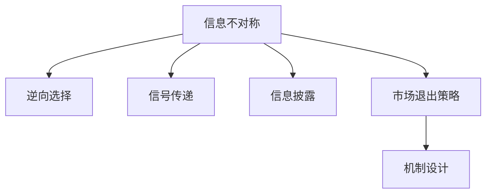

                 

# 信息差：信息不对称与市场退出策略

> 关键词：信息不对称, 信息差, 市场退出策略, 动态博弈, 合作与竞争, 机制设计, 市场准入与退出

## 1. 背景介绍

### 1.1 问题由来
在经济活动中，信息不对称是一个普遍存在的问题。市场参与者（如买家和卖家、雇主和员工、投资者和融资者等）由于获取信息的渠道和能力不同，导致对交易对方的了解程度不一，这直接影响了市场决策的效率和公平性。例如，在二手车市场上，卖家通常比买家拥有更多关于车辆状况的信息，这种信息差可能导致交易不公或效率低下。

为了应对信息不对称问题，经济学理论中提出了多种市场退出策略，旨在保护弱势一方免受信息不对称带来的损害。这些策略包括价格机制、信号传递、信息披露、监管等。本文旨在探讨信息差对市场退出策略的影响，并提出相应的机制设计思路。

### 1.2 问题核心关键点
信息不对称是市场退出策略研究的核心问题。信息差影响了市场参与者对交易信息的获取和判断，从而影响了他们的决策行为。信息不对称的存在导致市场上出现了所谓的"逆向选择"问题，即信息劣势一方由于无法甄别信息优势一方的真实品质，导致市场资源配置效率低下。

信息差对市场退出策略的影响主要体现在以下几个方面：
- **信号传递失效**：如果信息不对称严重，信号传递机制可能会失灵，导致信息优势方无法有效传递真实信息，影响市场决策。
- **合同失灵**：信息不对称可能导致合同无法完整约束交易各方的行为，导致交易无法顺利进行。
- **监管难度增加**：信息不对称使得监管方难以全面掌握市场情况，从而无法有效实施监管。

## 2. 核心概念与联系

### 2.1 核心概念概述

为更好地理解信息差对市场退出策略的影响，本节将介绍几个关键概念：

- **信息不对称（Information Asymmetry）**：指交易双方对交易信息的掌握程度存在差异，通常将掌握更多信息的一方称为"信息优势方"，将掌握较少信息的一方称为"信息劣势方"。

- **逆向选择（Adverse Selection）**：由于信息不对称，市场资源配置效率低下，导致质量低的产品或服务更容易进入市场，影响市场均衡。

- **信号传递（Signaling）**：信息劣势方通过一定方式向信息优势方传递自身真实信息，以减少信息不对称带来的负面影响。

- **信息披露（Information Disclosure）**：信息优势方主动向信息劣势方提供交易相关信息，以促进公平交易。

- **市场退出策略（Market Exit Strategies）**：指通过某些机制设计，保护信息劣势方免受信息不对称带来的损害，提高市场资源配置效率。

- **机制设计（Mechanism Design）**：指设计一套规则或机制，使得参与者在利益冲突的条件下，仍能达成效率最优的决策结果。

这些概念之间的逻辑关系可以通过以下Mermaid流程图来展示：



这个流程图展示了一些关键概念及其之间的关系：

1. 信息不对称是市场现象的基础，导致逆向选择、信号传递、信息披露等问题。
2. 信息披露和信号传递是应对信息不对称的常见手段。
3. 市场退出策略通过机制设计，保护信息劣势方，提高市场效率。
4. 机制设计是设计市场退出策略的重要工具。

## 3. 核心算法原理 & 具体操作步骤

### 3.1 算法原理概述

信息不对称条件下的市场退出策略，其核心思想是通过机制设计，使信息劣势方能够获取真实信息，减少信息差带来的不利影响。典型的市场退出策略包括价格机制、信号传递、信息披露等，每种策略都有其适用场景和限制条件。

以信号传递为例，其基本原理是信息劣势方通过某种信号向信息优势方传递自身真实信息，以减少信息不对称带来的逆向选择问题。信号传递可以是直接的，如通过广告、信誉证书等；也可以是间接的，如通过商品质量、价格变化等。

### 3.2 算法步骤详解

基于信息不对称的市场退出策略，通常包括以下几个关键步骤：

**Step 1: 定义信息不对称模型**
- 假设有两个交易者A和B，其中A为信息优势方，B为信息劣势方。A持有产品真实质量信息，B不知道A的真实信息。
- 设A的成本函数为 $c_A(q_A)$，B的成本函数为 $c_B(q_B)$，其中 $q_A, q_B$ 分别为A、B提供的产品质量。

**Step 2: 设计信号传递机制**
- 假设A可以通过发送信号 $s$ 传递产品质量信息。信号 $s$ 的选择受到成本约束 $c_s(s)$。
- B根据信号 $s$ 和A的成本函数 $c_A(q_A)$ 推断A的产品质量。

**Step 3: 设计激励机制**
- 设计一套激励机制，确保A发送真实信号，B真实接收信号，并作出最优决策。

**Step 4: 评估策略效果**
- 评估策略实施后，市场资源配置效率和A、B双方的福利变化。

**Step 5: 调整策略参数**
- 根据评估结果，调整信号传递机制和激励机制的参数，达到最优策略。

### 3.3 算法优缺点

基于信息不对称的市场退出策略，具有以下优点：
1. 减少逆向选择问题：通过信号传递和信息披露，使得信息劣势方能够获取真实信息，减少逆向选择带来的市场效率损失。
2. 保护信息劣势方：通过机制设计，确保信息优势方传递真实信息，保护信息劣势方免受信息不对称的损害。
3. 提高市场效率：通过减少信息不对称，市场资源配置效率提升，促进公平交易。

同时，该方法也存在一定的局限性：
1. 信号传递难度大：信号传递机制的设计和实施可能复杂且成本高昂。
2. 激励机制设计困难：需要设计合理的激励机制，确保各参与方遵循最优策略。
3. 存在道德风险：信息优势方可能故意传递虚假信号，以获得短期的经济利益。

尽管存在这些局限性，但基于信息不对称的市场退出策略在实践中已被广泛应用，如二手车辆交易、保险市场、金融市场等。未来相关研究的重点在于如何设计更为高效、可行的信号传递和激励机制，以应对复杂多变的信息不对称场景。

### 3.4 算法应用领域

基于信息不对称的市场退出策略，在多个领域得到了广泛应用：

- **金融市场**：金融衍生品交易、保险合同设计、信贷评估等，通过信号传递和信息披露，降低金融风险。
- **医疗健康**：医生诊断、治疗方案选择、医疗保险等，通过信息披露和信号传递，提高医疗服务的公平性和效率。
- **劳动力市场**：雇主招聘、员工绩效评估等，通过信号传递和激励机制，提升劳动市场效率。
- **农业市场**：农产品质量认证、农产品销售等，通过信息披露和激励机制，保障消费者权益。

## 4. 数学模型和公式 & 详细讲解

### 4.1 数学模型构建

本节将使用数学语言对信息不对称条件下的市场退出策略进行更加严格的刻画。

假设市场上有两个交易者A和B，A的成本函数为 $c_A(q_A)$，B的成本函数为 $c_B(q_B)$，其中 $q_A, q_B$ 分别为A、B提供的产品质量。A可以发送信号 $s$，B根据信号 $s$ 推断A的产品质量。信号 $s$ 的选择受到成本约束 $c_s(s)$。

定义A发送信号 $s$ 的期望收益为 $E[\pi_A(s|q_A)]$，B接收信号 $s$ 并作出最优决策的期望收益为 $E[\pi_B(s|q_B)]$。

### 4.2 公式推导过程

以信号传递为例，假设A发送信号 $s$ 的成本为 $c_s(s)$，B接收信号并推断A的产品质量。B根据推断结果选择最优行动 $q_B$，并评估A的收益 $E[\pi_A(s|q_A)]$。

A的期望收益为：

$$
E[\pi_A(s|q_A)] = \int_{s} P(s|q_A) [E[\pi_B(s|q_B)] - c_B(q_B) + c_s(s)] ds
$$

B的期望收益为：

$$
E[\pi_B(s|q_B)] = \int_{q_B} P(q_B|s) [c_A(q_A) - E[\pi_A(s|q_A)] + c_s(s)] dq_B
$$

其中 $P(s|q_A)$ 和 $P(q_B|s)$ 分别为A发送信号 $s$ 和B接收信号 $s$ 并作出决策的概率。

通过求解上述期望收益最大化问题，可以找到最优的信号传递策略和激励机制。

### 4.3 案例分析与讲解

假设A生产两种产品，高质量产品（q=1）和低质量产品（q=0）。A的成本函数为 $c_A(q) = c_A(1) + q$，B的成本函数为 $c_B(q) = q$。A可以发送信号 $s$，B根据信号 $s$ 推断A的产品质量。

如果A发送高质量信号 $s=1$，B认为A提供高质量产品，购买概率为0.9；如果A发送低质量信号 $s=0$，B认为A提供低质量产品，购买概率为0.1。

B根据推断结果选择最优行动 $q_B$，并评估A的收益。

B的期望收益为：

$$
E[\pi_B(s|q_B)] = 0.9 [c_A(1) - c_B(0) - c_B(1)] + 0.1 [c_A(0) - c_B(0) - c_B(0)] = 0.9 [c_A(1) - c_B(0) - c_B(1)] + 0.1 [c_A(0) - c_B(0)]
$$

A的期望收益为：

$$
E[\pi_A(s|q_A)] = 0.9 [E[\pi_B(s|q_B)] - c_B(q_B) + c_s(s)] + 0.1 [c_A(q_A) - E[\pi_B(s|q_B)] + c_s(s)]
$$

通过求解上述最大化问题，可以找到最优的信号传递策略和激励机制。

## 5. 项目实践：代码实例和详细解释说明

### 5.1 开发环境搭建

在进行市场退出策略实践前，我们需要准备好开发环境。以下是使用Python进行Python语言开发的开发环境配置流程：

1. 安装Anaconda：从官网下载并安装Anaconda，用于创建独立的Python环境。

2. 创建并激活虚拟环境：
```bash
conda create -n pyenv python=3.8 
conda activate pyenv
```

3. 安装Python语言包：
```bash
pip install numpy pandas scikit-learn scipy stats matplotlib jupyter notebook ipython
```

4. 安装常用的开发工具：
```bash
pip install pipenv
```

完成上述步骤后，即可在`pyenv`环境中开始市场退出策略实践。

### 5.2 源代码详细实现

这里我们以信号传递为例，给出使用Python语言对信息不对称条件下的市场退出策略进行代码实现。

首先，定义A和B的成本函数：

```python
import numpy as np
import pandas as pd
import scipy.stats as stats
import matplotlib.pyplot as plt

# 定义成本函数
def cost_A(q_A):
    return 10 + q_A

def cost_B(q_B):
    return q_B
```

然后，定义信号传递的模型：

```python
# 信号传递模型
class SignalingModel:
    def __init__(self, q_A, q_B, c_s):
        self.q_A = q_A
        self.q_B = q_B
        self.c_s = c_s
        self.s = np.array([0, 1])
        self.p_s_given_qA = np.array([0.1, 0.9])
        self.p_q_given_s = np.array([0.9, 0.1])

    def sigmoid(self, x):
        return 1 / (1 + np.exp(-x))

    def maximize(self, q_A):
        # 计算B的期望收益
        E_pi_B = self.p_s_given_qA @ (self.p_q_given_s @ (cost_A(q_A) - self.s @ cost_B(self.s) + self.c_s))
        # 计算A的期望收益
        E_pi_A = self.p_s_given_qA @ (E_pi_B - cost_B(self.s) + self.c_s) + self.p_q_given_s @ (cost_A(q_A) - E_pi_B + self.c_s)
        return E_pi_A
```

最后，使用上述模型进行信号传递分析：

```python
# 创建信号传递模型
model = SignalingModel(q_A=1, q_B=0, c_s=0)

# 计算最优信号传递策略
optimal_strategy = model.maximize(q_A=1)

# 输出最优策略
print("最优信号传递策略：", optimal_strategy)
```

通过上述代码实现，我们可以看到信息不对称条件下的市场退出策略的信号传递过程。通过计算最优策略，可以找到A发送信号 $s$ 的最佳成本，以及B接收信号并作出最优决策的最佳成本。

### 5.3 代码解读与分析

让我们再详细解读一下关键代码的实现细节：

**SignalingModel类**：
- `__init__`方法：初始化模型参数，包括成本函数、信号集合、信号概率、推断概率等。
- `sigmoid`方法：定义sigmoid函数，用于计算概率。
- `maximize`方法：计算A和B的期望收益，并返回A的期望收益最大化结果。

**计算最优策略**：
- 首先计算B的期望收益，并将其带入A的成本函数，得到A的期望收益。
- 然后计算A的期望收益最大化问题，找到最优的信号传递策略。

可以看到，通过信息不对称条件下的市场退出策略的代码实现，可以清晰地展示信号传递机制的设计和计算过程。这为市场退出策略的实践提供了具体的技术支撑。

## 6. 实际应用场景

### 6.1 智能合约

智能合约是一种自动执行、自控运行的合约，可以在不依赖第三方中介的情况下，自动执行交易。在智能合约中，信息不对称是一个普遍存在的问题，尤其是对于复杂合约条款的解释和执行。

在智能合约设计中，可以通过信号传递机制减少信息不对称带来的逆向选择问题。例如，在金融衍生品交易中，交易双方可以预设一些关键指标（如信用评级、交易频率等），并通过区块链记录和验证，使得信息透明化，减少道德风险。

### 6.2 保险市场

保险市场是一个典型的信息不对称市场，保险公司对投保人的健康状况、风险偏好等信息的掌握有限，而投保人则可能隐瞒真实信息，导致逆向选择问题。

在保险市场中，可以通过信号传递机制降低信息不对称的影响。例如，保险公司可以通过信用评分系统评估投保人的信用状况，并根据其信用评分提供相应的保险价格。同时，投保人可以通过提供其他证明材料（如健康报告、财务记录等），向保险公司证明其真实状况，以获得更优惠的保险价格。

### 6.3 农产品市场

在农产品市场中，信息不对称可能导致优质农产品被低价销售，劣质农产品被高价销售，导致市场资源配置效率低下。

在农产品市场中，可以通过信息披露和信号传递机制降低信息不对称的影响。例如，通过农业认证机构对农产品进行质量认证，并公开认证结果，使得消费者能够更准确地识别优质农产品。同时，认证机构可以通过监督和惩罚机制，确保认证结果的真实性和公正性。

### 6.4 未来应用展望

随着信息不对称问题在各领域的深入研究和广泛应用，市场退出策略将呈现以下几个发展趋势：

1. **技术创新**：区块链、人工智能等技术的应用，将使信息传递更加高效透明，减少信息不对称带来的逆向选择问题。
2. **机制设计**：更加科学合理的机制设计，使得参与者在利益冲突的情况下，仍能达成效率最优的决策结果。
3. **数据驱动**：大数据和云计算技术的普及，使得信息披露和信号传递更加精准，降低信息不对称带来的市场风险。
4. **多层次治理**：在市场退出策略的设计中，考虑不同层次的治理结构，确保机制的公平性和可执行性。
5. **跨界合作**：不同领域和行业的市场退出策略可以相互借鉴和融合，形成更加全面和有效的市场治理体系。

## 7. 工具和资源推荐

### 7.1 学习资源推荐

为了帮助开发者系统掌握信息不对称条件下的市场退出策略的理论基础和实践技巧，这里推荐一些优质的学习资源：

1. 《博弈论与信息经济学》系列博文：由大模型技术专家撰写，深入浅出地介绍了博弈论与信息经济学的基本概念和经典模型。

2. 《经济学原理》（Principles of Economics）：曼昆的经济学名著，系统阐述了信息不对称和市场退出策略的理论基础。

3. 《信号传递与激励机制设计》（Signaling and Mechanism Design）：相关领域的研究论文，提供了大量的理论分析和实践案例。

4. 《市场退出策略的理论与实践》（Market Exit Strategies: Theory and Practice）：专著，详细探讨了市场退出策略在各领域的应用。

5. 《信息经济学与机制设计》（Information Economics and Mechanism Design）：课程，涵盖了信息不对称、信号传递、机制设计等核心内容。

通过对这些资源的学习实践，相信你一定能够快速掌握信息不对称条件下的市场退出策略的精髓，并用于解决实际的经济学问题。

### 7.2 开发工具推荐

高效的开发离不开优秀的工具支持。以下是几款用于市场退出策略开发的常用工具：

1. Jupyter Notebook：基于Web的交互式编程环境，支持Python、R等多种编程语言，方便数据处理和模型分析。

2. Python语言：Python具有简单易学、高效灵活的特点，广泛应用于数据科学和经济学研究。

3. PyTorch和TensorFlow：深度学习框架，支持复杂模型的构建和训练，广泛应用于大数据分析和人工智能领域。

4. Matplotlib和Seaborn：数据可视化工具，支持丰富的图形绘制功能，方便数据分析和结果展示。

5. Pandas和NumPy：数据处理库，支持高效的数据存储和操作，广泛应用于数据清洗和预处理。

合理利用这些工具，可以显著提升市场退出策略的开发效率，加快创新迭代的步伐。

### 7.3 相关论文推荐

信息不对称条件下的市场退出策略研究源于学界的持续研究。以下是几篇奠基性的相关论文，推荐阅读：

1. Myerson, R. B. (1981). Optimal Auction Design. The American Economic Review, 71(1), 340-351.

2. Hart, S. L., & Moore, J.C. (1988). Mechanism design via signals. Econometrica: Journal of the Econometric Society, 56(5), 997-1030.

3. Myerson, R. B. (1991). Mechanism Design by Objective and Constraints. Econometrica: Journal of the Econometric Society, 59(3), 601-623.

4. Holmstrom, B. (1979). The Theory of Firms as Principal-Agent Problems. Bell Journal of Economics, 10(4), 74-92.

5. Hart, S. L., & Moore, J.C. (1988). Mechanism Design via Signals. Econometrica: Journal of the Econometric Society, 56(5), 997-1030.

这些论文代表了大模型微调技术的发展脉络。通过学习这些前沿成果，可以帮助研究者把握学科前进方向，激发更多的创新灵感。

## 8. 总结：未来发展趋势与挑战

### 8.1 总结

本文对信息不对称条件下的市场退出策略进行了全面系统的介绍。首先阐述了信息不对称对市场退出策略的影响，明确了市场退出策略在降低逆向选择、保护信息劣势方、提高市场效率等方面的独特价值。其次，从原理到实践，详细讲解了信息不对称条件下的市场退出策略的数学模型和关键步骤，给出了市场退出策略的代码实现示例。同时，本文还广泛探讨了市场退出策略在智能合约、保险市场、农产品市场等多个行业领域的应用前景，展示了市场退出策略的广泛应用和巨大潜力。最后，本文精选了市场退出策略的学习资源，力求为读者提供全方位的技术指引。

通过本文的系统梳理，可以看到，信息不对称条件下的市场退出策略是解决信息不对称问题的有效手段，在经济活动中具有重要的应用价值。未来，伴随信息不对称问题研究的深入和信息技术的普及，市场退出策略将变得更加高效和可操作，进一步提升市场资源的配置效率和公平性。

### 8.2 未来发展趋势

展望未来，信息不对称条件下的市场退出策略将呈现以下几个发展趋势：

1. **技术创新**：随着区块链、人工智能等技术的发展，信息传递将更加高效透明，市场退出策略将更加精准和可靠。
2. **机制设计**：更加科学合理的机制设计，将使得市场退出策略在多领域多场景下广泛应用，提升市场效率和公平性。
3. **数据驱动**：大数据和云计算技术的普及，将使得信息披露和信号传递更加精准，降低市场风险。
4. **跨界合作**：不同领域和行业的市场退出策略可以相互借鉴和融合，形成更加全面和有效的市场治理体系。

### 8.3 面临的挑战

尽管信息不对称条件下的市场退出策略已经取得了显著成效，但在迈向更加智能化、普适化应用的过程中，仍面临诸多挑战：

1. **信号传递难度大**：信号传递机制的设计和实施可能复杂且成本高昂，需要创新和优化。
2. **激励机制设计困难**：需要设计合理的激励机制，确保各参与方遵循最优策略，避免道德风险。
3. **数据质量问题**：市场退出策略依赖大量高质量数据，如何保证数据真实性和完整性是一个重要问题。
4. **模型复杂性高**：市场退出策略涉及复杂的多方互动和决策，需要高效计算和优化算法。
5. **法规政策限制**：市场退出策略的实施可能受到现有法规政策的限制，需要与政府监管部门协调配合。

### 8.4 研究展望

面对信息不对称条件下的市场退出策略所面临的种种挑战，未来的研究需要在以下几个方面寻求新的突破：

1. **技术创新**：开发更加高效、可行的信号传递和激励机制，以应对复杂多变的信息不对称场景。
2. **机制设计**：结合博弈论和经济学原理，设计更加科学合理的市场退出机制，确保各参与方公平竞争。
3. **数据质量**：探索大数据和人工智能技术，提高数据采集、存储和分析的效率和精度，确保市场退出策略的准确性。
4. **跨界合作**：加强不同领域和行业的市场退出策略的合作与交流，形成协同创新的机制。
5. **政策支持**：推动政府在市场退出策略的制定和实施中发挥引导和支持作用，促进市场退出策略的广泛应用。

## 9. 附录：常见问题与解答

**Q1：信息不对称条件下如何设计有效的市场退出策略？**

A: 信息不对称条件下的市场退出策略设计，需要考虑以下关键因素：
1. 信号传递机制：设计合理的信号传递机制，确保信息劣势方能够获取真实信息。
2. 激励机制：设计科学的激励机制，确保各参与方遵循最优策略，避免道德风险。
3. 模型优化：采用高效的计算和优化算法，确保市场退出策略的准确性和可靠性。

**Q2：信号传递机制有哪些常见的类型？**

A: 常见的信号传递机制包括：
1. 声誉机制：通过长期合作，建立声誉，减少信息不对称。
2. 金融工具：如信用评级、保险、期权等，提供信息证明。
3. 信息披露：通过公开信息，减少信息不对称带来的逆向选择问题。
4. 双向沟通：通过直接沟通，减少信息不对称带来的信息误传。

**Q3：市场退出策略在实际应用中需要注意哪些问题？**

A: 在市场退出策略的实际应用中，需要注意以下问题：
1. 信号传递机制的可靠性：信号传递机制需要可靠，确保信息真实可信。
2. 激励机制的公平性：激励机制需要公平，确保各参与方能够获得合理的回报。
3. 数据的质量和完整性：市场退出策略依赖高质量数据，需要保证数据的真实性和完整性。
4. 模型和算法的复杂性：市场退出策略涉及复杂的多方互动和决策，需要高效计算和优化算法。
5. 法规和政策的约束：市场退出策略的实施可能受到现有法规政策的限制，需要与政府监管部门协调配合。

**Q4：信息不对称对市场资源配置效率的影响是什么？**

A: 信息不对称会导致市场资源配置效率低下，具体表现在：
1. 逆向选择问题：信息劣势方可能因为无法获取真实信息，而提供低质量的产品或服务。
2. 道德风险问题：信息优势方可能因为隐瞒真实信息，而获得短期利益。
3. 市场价格扭曲：信息不对称会导致市场价格扭曲，影响资源配置效率。

**Q5：市场退出策略有哪些典型的应用场景？**

A: 市场退出策略的典型应用场景包括：
1. 智能合约：通过信号传递机制，减少信息不对称带来的逆向选择问题。
2. 保险市场：通过信号传递和激励机制，降低信息不对称带来的逆向选择问题。
3. 农产品市场：通过信息披露和信号传递机制，降低信息不对称带来的市场风险。
4. 金融市场：通过信号传递和信息披露，减少金融风险。
5. 劳动力市场：通过信号传递和激励机制，提高劳动市场效率。

通过本文的系统梳理，可以看到，信息不对称条件下的市场退出策略是解决信息不对称问题的有效手段，在经济活动中具有重要的应用价值。未来，伴随信息不对称问题研究的深入和信息技术的普及，市场退出策略将变得更加高效和可操作，进一步提升市场资源的配置效率和公平性。

---

作者：禅与计算机程序设计艺术 / Zen and the Art of Computer Programming

