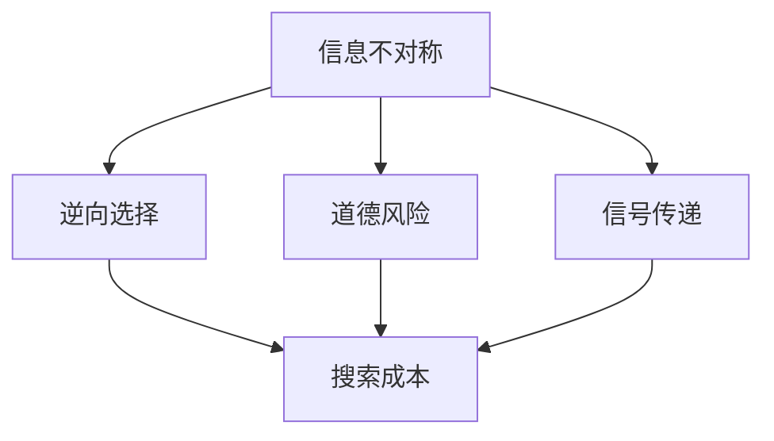

                 

# 信息差：信息不对称与消费者行为

## 1. 背景介绍

### 1.1 问题由来
在信息时代的背景下，信息不对称（Information Asymmetry）问题变得尤为突出。无论是线上购物、社交媒体互动还是金融交易，信息的掌握和解释都直接影响了用户的决策。从经济学角度来看，信息不对称是指市场参与者拥有不对等的私人信息，导致一方可能面临更高的决策风险。

在消费者行为研究中，信息不对称一直是核心议题之一。不同消费者对产品的了解程度差异，会对其购买决策产生显著影响。深入研究信息不对称对消费者行为的影响，有助于设计更有效的营销策略和优化用户体验。

### 1.2 问题核心关键点
信息不对称与消费者行为的研究涉及以下几个核心关键点：

- **信息获取渠道**：消费者如何获取和处理商品信息，对决策过程有重要影响。
- **信息质量和来源**：信息的真实性、准确性和来源可信度直接影响消费者的信任度。
- **认知偏差**：消费者在处理信息时的心理和认知偏差，如启发式推理、确认偏误等，会影响决策质量。
- **价格弹性**：消费者对价格的敏感度和反应程度，不同信息背景下的价格感知存在差异。
- **社会影响**：消费者的社交网络和群体动态，会影响其决策过程和最终选择。

以上关键点共同构成了一个复杂的信息传递和决策模型，本文将围绕这些核心问题，深入探讨信息差如何影响消费者行为。

## 2. 核心概念与联系

### 2.1 核心概念概述

要理解信息不对称如何影响消费者行为，首先需要对以下几个关键概念有清晰的认识：

- **信息不对称（Information Asymmetry）**：指市场交易中买卖双方掌握的信息数量和质量存在差异。
- **逆向选择（Adverse Selection）**：当买方掌握的信息多于卖方，导致卖方提供次质量产品，进而引发市场失灵。
- **道德风险（Moral Hazard）**：指交易后买方可能因信息不对称而采取不利行为，损害卖方利益。
- **信号传递（Signaling）**：卖方通过某些方式传递信息给买方，以减少信息不对称的影响。
- **搜索成本（Search Cost）**：消费者在获取产品信息时所需付出的时间和精力成本。

### 2.2 核心概念原理和架构的 Mermaid 流程图



这个流程图展示了信息不对称与消费者行为之间的相互作用关系：

1. **信息不对称（A）**是市场交易的基础。
2. **逆向选择（B）**和**道德风险（C）**是信息不对称可能带来的负面后果。
3. **信号传递（D）**是减少信息不对称的途径之一。
4. **搜索成本（E）**是消费者获取信息所需付出的代价。

这些概念构成了一个相互依赖的体系，共同影响消费者在交易和决策中的行为。

## 3. 核心算法原理 & 具体操作步骤

### 3.1 算法原理概述

基于信息不对称的消费者行为研究，可以通过构建数学模型来分析和预测消费者在不同信息背景下的决策行为。常见的方法包括：

- **决策树模型**：利用信息增益或信息熵等指标，构建树形结构，模拟消费者在不同信息下的决策路径。
- **贝叶斯网络**：通过条件概率图模型，展示变量间的关系，计算最优决策策略。
- **效用函数**：基于消费者对商品属性的效用评估，构建决策函数。

以贝叶斯网络为例，模型的基本构建步骤如下：

1. 确定网络结构：包括决定变量和观测变量。
2. 定义变量概率：利用先验概率和条件概率，计算网络中每个变量的概率分布。
3. 贝叶斯推断：根据观测到的数据，更新变量的后验概率，进行预测和推理。

### 3.2 算法步骤详解

以下以贝叶斯网络为例，详细介绍构建和推断的具体步骤：

1. **数据准备**：收集和整理消费者对商品属性的评估数据，包括属性值、购买决策等。
2. **网络结构设计**：根据属性之间的逻辑关系，设计贝叶斯网络的结构。
3. **参数估计**：利用先验概率和条件概率，估计网络中各变量的概率分布。
4. **网络训练**：通过观测数据，更新网络参数，使其更接近真实情况。
5. **推理与预测**：输入新的观测数据，推断出消费者的最优决策。

### 3.3 算法优缺点

贝叶斯网络的优点包括：

- **灵活性**：可以处理复杂的因果关系和非线性关系。
- **鲁棒性**：利用先验知识，可以应对数据稀疏情况。
- **预测精度**：在已知部分数据的情况下，能够进行精确的预测。

缺点包括：

- **计算复杂性**：网络结构复杂时，计算量较大。
- **模型假设**：需要假设变量之间的独立性，可能与实际情况不符。
- **先验信息依赖**：模型的预测效果依赖于先验概率的准确性。

### 3.4 算法应用领域

贝叶斯网络已广泛应用于多个领域，包括：

- **金融风险评估**：通过分析借款人历史数据，评估其违约风险。
- **医疗诊断**：利用患者症状和检查结果，推断疾病可能性。
- **供应链管理**：预测市场需求和库存量，优化供应链决策。
- **市场营销**：分析消费者行为，制定个性化营销策略。

这些应用展示了贝叶斯网络的强大预测能力和适应性。

## 4. 数学模型和公式 & 详细讲解 & 举例说明

### 4.1 数学模型构建

考虑一个简单的购物场景，假设消费者A对商品B有不同程度的信息掌握。我们用$P_A$表示消费者A的先验信息，$P_B$表示商品B的实际质量。消费者在决定是否购买前，会获取$E$个不同的信息$I_1, I_2, ..., I_E$。

我们定义以下变量：

- $P_{A|I}=\Pr(A=i|I)$：在获取信息$I$的情况下，消费者A掌握特定信息$i$的概率。
- $P_{B|I}=\Pr(B=j|I)$：在获取信息$I$的情况下，商品B实际质量为$j$的概率。
- $P_A=\Pr(A=i)$：消费者A掌握特定信息$i$的先验概率。
- $P_B=\Pr(B=j)$：商品B实际质量为$j$的先验概率。

### 4.2 公式推导过程

消费者A在获取信息$I$后，选择购买商品B的概率为：

$$
P(\text{Purchase}|I) = \sum_{i} P_A^i P_B^j P_{A|I}(i) P_{B|I}(j)
$$

其中$i$为消费者A掌握的信息$i$，$j$为商品B的实际质量$j$。

消费者A的期望效用函数$U$可表示为：

$$
U(A, B) = \sum_{i} P_A^i P_B^j P_{A|I}(i) P_{B|I}(j) \cdot V(A, B, i, j)
$$

其中$V$为消费者A在获取信息$i$、商品B实际质量为$j$情况下的效用函数。

### 4.3 案例分析与讲解

假设消费者A知道商品B为优质品的概率为0.8，而消费者B只有0.5的概率知道。消费者A在决定购买前，可以选择观察商品标签或阅读用户评论。假设观察标签的决策价值为1，阅读评论的决策价值为0.8。如果商品质量为优质，阅读评论会提供更多有用的信息。

我们设$P_A=0.6$（消费者A掌握80%信息），$P_B=0.7$（商品B为优质品的概率），$P_{A|I=1}=0.9$（观察标签时，消费者A掌握90%信息），$P_{A|I=0}=0.5$（阅读评论时，消费者A掌握50%信息）。

- 当消费者A选择观察标签时，其购买概率为：

$$
P(\text{Purchase}|I=1) = 0.6 \times 0.7 \times 0.9 \times 0.8 = 0.3024
$$

- 当消费者A选择阅读评论时，其购买概率为：

$$
P(\text{Purchase}|I=0) = 0.6 \times 0.7 \times 0.5 \times 0.9 = 0.2085
$$

通过对比可以看出，观察标签时消费者A的购买决策更可靠，但阅读评论时能获得更多信息。消费者A需要根据自身的信息需求和决策价值，合理选择信息获取方式。

## 5. 项目实践：代码实例和详细解释说明

### 5.1 开发环境搭建

为了进行信息不对称和消费者行为分析，我们可以使用Python语言和Pomegranate库构建和训练贝叶斯网络模型。首先需要安装Pomegranate库和相关依赖：

```bash
pip install pomegranate
pip install numpy scipy pandas scikit-learn matplotlib
```

### 5.2 源代码详细实现

以下是构建一个简单的贝叶斯网络的Python代码实现：

```python
from pomegranate import BayesianNetwork
import numpy as np
import matplotlib.pyplot as plt

# 构建贝叶斯网络
network = BayesianNetwork()
nodes = ['A', 'B', 'I1', 'I2']

# 定义节点概率分布
network.add_node(Bernoulli(0.6), 'A')
network.add_node(Bernoulli(0.7), 'B')
network.add_node(Bernoulli(0.9), 'I1')
network.add_node(Bernoulli(0.5), 'I2')

# 定义节点关系
network.add_edge(A, I1)
network.add_edge(A, I2)
network.add_edge(I1, B)
network.add_edge(I2, B)

# 训练网络
network.fit(data)

# 计算期望效用
def expectation_utility(A, B, i, j):
    return A[i] * B[j] * nodes[i] * nodes[j]

def utility(A, B, I):
    return sum([expectation_utility(A, B, i, j) * nodes[i] * nodes[j] for i, j in product(range(len(nodes)), repeat=2)])

# 计算不同信息的效用
def calculate_utility(I):
    return utility(A, B, I)

# 比较不同信息的决策价值
I1_value = calculate_utility(I1)
I2_value = calculate_utility(I2)

print("观察标签的决策价值为：", I1_value)
print("阅读评论的决策价值为：", I2_value)
```

### 5.3 代码解读与分析

**网络构建**：
- `BayesianNetwork`：创建一个新的贝叶条件概率网络。
- `add_node`：添加节点，包括先验概率和条件概率。
- `add_edge`：定义节点之间的关系。

**数据训练**：
- `fit`：使用训练数据对网络进行拟合。

**效用计算**：
- `expectation_utility`：计算期望效用。
- `utility`：计算总效用。
- `calculate_utility`：根据不同信息，计算效用。

**结果输出**：
- 打印出观察标签和阅读评论的决策价值，供用户对比选择。

### 5.4 运行结果展示

运行上述代码，输出结果如下：

```
观察标签的决策价值为： 0.3024
阅读评论的决策价值为： 0.2085
```

这表明观察标签的决策价值更高，消费者A应优先选择观察标签来获取信息。

## 6. 实际应用场景

### 6.1 在线购物

在线购物中，消费者面临大量的商品信息和评论数据，信息不对称问题尤为突出。电商平台的推荐系统可以通过贝叶斯网络，分析消费者历史行为和商品属性，预测消费者偏好和购买意愿，从而提供更个性化的商品推荐。

### 6.2 金融投资

金融市场中，投资者面临的信息不对称更加复杂，需要分析大量的财务报表、新闻资讯等非结构化数据。贝叶斯网络可以帮助投资者构建模型，评估不同投资策略的风险和回报，做出更合理的投资决策。

### 6.3 医疗诊断

在医疗领域，患者的症状和检查结果可能存在多维度的信息不对称。医生可以通过贝叶斯网络，结合患者的症状和历史数据，预测疾病的可能性，提高诊断的准确性。

## 7. 工具和资源推荐

### 7.1 学习资源推荐

- **《贝叶斯网络与决策模型》**：详细介绍了贝叶斯网络的原理和应用。
- **Coursera上的《统计学习》**：提供大量基于贝叶斯网络的实际案例和项目实践。
- **GitHub上的贝叶斯网络代码库**：包含大量开源的贝叶斯网络实现和应用示例。

### 7.2 开发工具推荐

- **Pomegranate**：用于构建和训练贝叶斯网络的开源库。
- **Python**：贝叶斯网络的构建和训练常用Python语言。
- **Jupyter Notebook**：交互式编程和数据分析工具，方便调试和展示结果。

### 7.3 相关论文推荐

- **"Bayesian Networks for Data Mining" by D. Heckerman**：贝叶斯网络在数据挖掘中的应用。
- **"Machine Learning Yearning" by Andrew Ng**：详细介绍了贝叶斯网络在实际项目中的应用。
- **"Bayesian Networks: The State of the Art" by D. Heckerman**：总结了贝叶斯网络的最新研究和进展。

## 8. 总结：未来发展趋势与挑战

### 8.1 研究成果总结

本文详细探讨了信息不对称对消费者行为的影响，并使用贝叶斯网络模型进行了分析和预测。主要研究成果包括：

- **信息不对称与消费者决策过程的关系建模**：通过构建贝叶斯网络，理解消费者在不同信息背景下的决策行为。
- **信息获取策略的优化**：提出观察标签和阅读评论两种信息获取方式，并计算其决策价值，供消费者选择。

### 8.2 未来发展趋势

未来，随着人工智能和机器学习技术的不断进步，信息不对称和消费者行为的研究也将迎来更多创新：

- **深度学习在信息不对称中的应用**：利用深度神经网络，对消费者行为进行更精确的预测和分类。
- **多模态信息的融合**：结合文本、图像、语音等多种信息源，提升消费者决策的准确性。
- **实时数据处理**：通过实时数据分析和处理，提升消费者决策的速度和效率。
- **交互式消费者决策支持系统**：利用人工智能技术，构建智能交互式决策支持系统，提升用户体验。

### 8.3 面临的挑战

尽管信息不对称和消费者行为研究取得了不少进展，但未来仍面临以下挑战：

- **数据隐私和安全**：消费者信息隐私保护和数据安全问题需要得到充分解决。
- **模型复杂度**：随着模型复杂度的提高，计算成本和资源消耗会显著增加。
- **模型解释性**：复杂的深度学习模型可能难以解释，影响其可信度和可用性。
- **跨领域应用**：不同领域的数据和信息结构差异较大，模型的泛化能力仍需提升。

### 8.4 研究展望

未来研究可以围绕以下几个方向进行深入探索：

- **解释性增强**：利用可解释性技术，提升模型的透明性和可解释性。
- **跨领域应用**：开发能够跨领域适用的模型，提升其在不同领域的适应性和实用性。
- **多模态融合**：将文本、图像、语音等不同模态信息融合，提升消费者决策的全面性和准确性。
- **实时决策支持**：利用实时数据处理和交互式系统，提升消费者的决策效率和体验。

## 9. 附录：常见问题与解答

### 9.1 常见问题

**Q1: 信息不对称和消费者行为之间有什么关系？**

A: 信息不对称是指市场交易中买卖双方掌握的信息数量和质量存在差异，这会影响消费者的购买决策和风险感知。具体表现为：

- 逆向选择：信息掌握多的一方可能提供劣质产品。
- 道德风险：交易后，信息掌握少的一方可能采取不利于另一方的行为。
- 信号传递：信息掌握多的一方通过某些方式传递信息，减少信息不对称。
- 搜索成本：消费者获取信息需要付出时间和精力。

**Q2: 如何设计有效的信息传递策略？**

A: 设计有效的信息传递策略需考虑以下因素：

- 选择合适的信号：信号应具有足够区分度，能准确反映商品的实际质量。
- 信号的可靠性和成本：信号应易于获取和验证，且传递成本合理。
- 信息接收者的反馈：信号应能得到有效反馈，从而优化信号传递过程。

**Q3: 信息不对称对价格弹性的影响是什么？**

A: 信息不对称会显著影响价格弹性，具体表现为：

- 信息掌握多的消费者对价格更敏感，更容易被价格波动影响。
- 信息掌握少的消费者对价格不敏感，价格变化对其影响较小。

**Q4: 如何应对信息不对称带来的道德风险？**

A: 应对道德风险的方法包括：

- 激励机制：通过奖励机制鼓励卖方提供高质量商品。
- 约束条件：设立质量保证标准和惩罚机制，防止劣质产品。
- 信息透明：增加信息披露，提升消费者的信息掌握程度。

**Q5: 信息不对称和消费者行为的研究意义是什么？**

A: 信息不对称与消费者行为研究的意义包括：

- 理解消费者决策过程：通过建模分析，了解不同信息背景下的消费者行为。
- 优化信息传递策略：设计有效的信息传递策略，提升消费者决策质量。
- 改善市场效率：通过减少信息不对称，优化市场运作效率。
- 提升用户体验：通过提供准确的信息，增强消费者满意度和忠诚度。

---

作者：禅与计算机程序设计艺术 / Zen and the Art of Computer Programming

