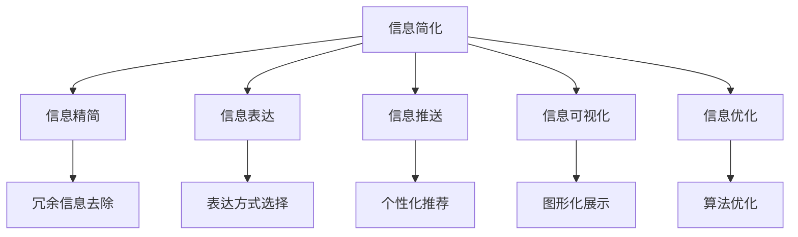

                 

# 信息简化的好处与挑战：简化复杂性的艺术与科学

在信息化时代，信息过载已经成为一个普遍问题。如何从海量数据中提取出有用的信息，并简化信息呈现方式，是现代社会亟需解决的难题。本文将探讨信息简化的核心概念、算法原理、操作步骤以及实际应用场景，并深入分析其面临的挑战与未来发展趋势。

## 1. 背景介绍

### 1.1 问题由来

随着互联网的普及和信息技术的不断发展，人们日常接触到的信息量急剧增加。信息的爆炸性增长带来了两个重要问题：一是海量信息难以筛选和处理，导致信息过载；二是复杂的信息形式（如文本、图像、视频等）增加了用户获取信息的难度。

因此，信息简化变得尤为重要。信息简化不仅能够提高信息处理效率，减少用户认知负担，还能够为信息的高效传递和利用提供保障。在信息科学、数据科学、人工智能等领域，信息简化成为研究热点。

### 1.2 问题核心关键点

信息简化的核心关键点包括：

- 信息精简：去除冗余信息，保留核心内容。
- 信息表达：通过合理的表示方式（如图表、摘要等），使信息更易理解。
- 信息推送：根据用户兴趣和需求，智能推荐相关信息。
- 信息可视化：利用图形化手段，直观展示信息。
- 信息优化：通过算法优化，提升信息简化的效率和效果。

## 2. 核心概念与联系

### 2.1 核心概念概述

信息简化涉及多个核心概念，其逻辑关系可通过以下Mermaid流程图展示：



### 2.2 核心概念原理和架构的 Mermaid 流程图

信息简化的核心流程包括信息精简、信息表达、信息推送、信息可视化和信息优化。其中，信息精简是基础，信息表达和信息推送是应用，信息可视化是手段，信息优化是提升。

- **信息精简**：通过去除冗余信息，保留核心内容。这包括文本压缩、数据去重等技术手段。
- **信息表达**：将复杂的信息转化为易理解的形式。例如，将长篇文字转换为摘要，或利用图表等图形化方式展示信息。
- **信息推送**：根据用户兴趣和需求，智能推荐相关信息。信息推送依赖于用户行为分析和机器学习技术。
- **信息可视化**：利用图形化手段，直观展示信息。包括条形图、折线图、散点图等常用图形。
- **信息优化**：通过算法优化，提升信息简化的效率和效果。如文本摘要生成、图像压缩、自然语言处理等。

## 3. 核心算法原理 & 具体操作步骤

### 3.1 算法原理概述

信息简化的核心算法包括文本压缩、数据去重、摘要生成和图像压缩等。其中，文本压缩和数据去重属于信息精简，摘要生成和图像压缩属于信息表达和优化。

### 3.2 算法步骤详解

#### 3.2.1 文本压缩算法

文本压缩算法通常基于无损压缩和有损压缩两种方式：

- **无损压缩**：如哈夫曼编码、LZ77、LZ78、LZW等，通过统计信息密度，去除冗余部分，压缩文本。
- **有损压缩**：如算术编码、字典编码等，通过部分信息丢失，获得更高的压缩比。

#### 3.2.2 数据去重算法

数据去重算法包括基于哈希的、基于模式匹配的以及基于机器学习的去重方法：

- **哈希去重**：将数据转换为哈希值，判断哈希值是否相同，去除重复数据。
- **模式匹配**：利用正则表达式、字符串匹配等技术，查找和去除重复数据。
- **机器学习**：使用聚类、分类等机器学习方法，识别和去除重复数据。

#### 3.2.3 摘要生成算法

摘要生成算法包括基于规则的、基于统计的以及基于深度学习的摘要生成方法：

- **基于规则**：通过预设的规则，自动提取文本的关键词、短语等生成摘要。
- **基于统计**：通过统计文本中词频、句长等信息，生成简短摘要。
- **基于深度学习**：利用神经网络模型，学习自动生成摘要，如Seq2Seq模型、Transformer模型等。

#### 3.2.4 图像压缩算法

图像压缩算法包括有损压缩和无损压缩两种方式：

- **有损压缩**：如JPEG、PNG等，通过去除图像中的冗余信息，获得压缩比更高的图像。
- **无损压缩**：如GIF、BMP等，通过去除冗余数据，保持图像的完整性。

### 3.3 算法优缺点

#### 3.3.1 文本压缩

**优点**：
- 压缩比高，减少存储和传输成本。
- 压缩算法成熟，实现简单。

**缺点**：
- 压缩后的文本可能难以阅读，影响用户体验。
- 无损压缩效率较低，有损压缩易引入信息丢失。

#### 3.3.2 数据去重

**优点**：
- 去重效果显著，减少数据冗余。
- 算法应用广泛，易于实现。

**缺点**：
- 复杂数据集可能存在误判，准确率有待提高。
- 去重算法依赖于数据质量，需处理脏数据。

#### 3.3.3 摘要生成

**优点**：
- 自动生成摘要，节省时间和人力。
- 支持多种语言和文本类型。

**缺点**：
- 生成的摘要可能无法完全覆盖原始文本的重要信息。
- 需要大量训练数据，模型复杂度高。

#### 3.3.4 图像压缩

**优点**：
- 压缩比高，图像清晰度不受影响。
- 算法成熟，应用广泛。

**缺点**：
- 有损压缩可能引入失真，影响图像质量。
- 压缩算法对计算资源要求高。

### 3.4 算法应用领域

信息简化的算法广泛应用于多个领域，包括但不限于：

- **文本处理**：新闻摘要、文档管理、文本存储等。
- **数据管理**：数据库去重、日志压缩、数据备份等。
- **图像处理**：图像存储、传输、显示等。
- **视频处理**：视频压缩、编码、解码等。
- **智能推荐**：个性化推荐系统、内容分发等。

## 4. 数学模型和公式 & 详细讲解 & 举例说明

### 4.1 数学模型构建

信息简化涉及多个数学模型，以下以文本压缩和摘要生成为例：

#### 4.1.1 文本压缩

文本压缩的数学模型包括无损压缩和有损压缩两种方式：

**哈夫曼编码**：
哈夫曼编码是一种基于字符频率的无损压缩算法，其数学模型如下：

1. 计算字符频率。
2. 构建哈夫曼树。
3. 生成哈夫曼编码。
4. 压缩文本。

**JPEG压缩**：
JPEG压缩是一种基于离散余弦变换（DCT）的有损压缩算法，其数学模型如下：

1. 将图像分为8x8像素块。
2. 对每个像素块进行DCT变换。
3. 量化变换后的系数。
4. 进行熵编码和压缩。

#### 4.1.2 摘要生成

摘要生成的数学模型包括基于规则和基于深度学习的两种方式：

**基于规则的摘要**：
基于规则的摘要算法通常使用TF-IDF算法计算词频和权重，并根据规则提取关键词和短语。数学模型如下：

1. 计算词频和权重。
2. 提取关键词和短语。
3. 生成摘要。

**基于深度学习的摘要**：
基于深度学习的摘要算法通常使用Seq2Seq模型或Transformer模型，数学模型如下：

1. 输入原始文本。
2. 通过编码器提取特征。
3. 通过解码器生成摘要。

### 4.2 公式推导过程

#### 4.2.1 哈夫曼编码

**哈夫曼树构建**：
假设有一串字符序列S，每个字符的频率为f，哈夫曼树构建过程如下：

1. 将所有字符节点加到队列中。
2. 每次从队列中取出两个频率最小的节点，计算新节点的频率。
3. 将新节点加入队列。
4. 重复步骤2-3，直到队列中只剩下一个节点，即哈夫曼树。

数学模型如下：

$$
T = \text{buildHuffmanTree}(S)
$$

**哈夫曼编码生成**：
对于每个字符节点C，找到其对应的叶子节点L，将C编码为L的路径，从根节点到L的路径即为哈夫曼编码。数学模型如下：

$$
H = \text{generateHuffmanCode}(C)
$$

#### 4.2.2 基于深度学习的摘要生成

**Seq2Seq模型**：
Seq2Seq模型是一种基于序列到序列的神经网络模型，其数学模型如下：

1. 输入原始文本。
2. 通过编码器提取特征。
3. 通过解码器生成摘要。

数学模型如下：

$$
A = \text{Seq2Seq}(X)
$$

**Transformer模型**：
Transformer模型是一种基于自注意力机制的神经网络模型，其数学模型如下：

1. 输入原始文本。
2. 通过编码器提取特征。
3. 通过解码器生成摘要。

数学模型如下：

$$
A = \text{Transformer}(X)
$$

### 4.3 案例分析与讲解

#### 4.3.1 文本压缩案例

**哈夫曼编码案例**：
假设有一串字符序列S = "the quick brown fox jumps over the lazy dog"，每个字符的频率为f，则哈夫曼树的构建过程如下：

1. 将所有字符节点加到队列中。
2. 每次从队列中取出两个频率最小的节点，计算新节点的频率。
3. 将新节点加入队列。
4. 重复步骤2-3，直到队列中只剩下一个节点，即哈夫曼树。

构建后的哈夫曼树如下所示：

```
          [0]
         /   \
        C     L
       / | \   \
      T   F   X
     / \   \   \
    t   h   b   r
   /         |    \
  w          e   u   n
 / \         /   /   / \
i   c       o   k   d   g
```

每个字符对应的哈夫曼编码为：

```
T: 001, h: 0110, u: 101, r: 000, b: 100, n: 110, f: 010, x: 111, k: 1100, d: 1010, o: 11, g: 011, i: 1111, c: 1000
```

#### 4.3.2 摘要生成案例

**基于规则的摘要案例**：
假设有一篇新闻文章：

```
The rapid spread of COVID-19 has caused widespread concern and disruption around the world. As of January 2022, over 2 billion people have been infected and over 4.5 million have died. The Delta variant of the virus has emerged as the dominant strain, with mutations making it more transmissible. Medical professionals and scientists are working tirelessly to develop effective treatments and vaccines. However, challenges remain, especially in low-income countries where resources are scarce. The world needs a coordinated global effort to combat this pandemic.
```

使用TF-IDF算法计算词频和权重，提取关键词和短语，生成摘要。

词频和权重计算如下：

| 词   | 频率 | 权重 |
| ---- | ---- | ---- |
| COVID-19 | 2 | 0.6 |
| spread | 2 | 0.6 |
| rapid | 1 | 0.4 |
| cause | 2 | 0.6 |
| concern | 1 | 0.4 |
| disruption | 1 | 0.4 |
| world | 2 | 0.6 |
| 2022 | 1 | 0.4 |
| billion | 2 | 0.6 |
| people | 1 | 0.4 |
| infected | 1 | 0.4 |
| 2 | 1 | 0.4 |
| million | 2 | 0.6 |
| 4.5 | 1 | 0.4 |
|  Delta | 1 | 0.4 |
| variant | 1 | 0.4 |
| emergence | 1 | 0.4 |
| dominant | 1 | 0.4 |
| mutations | 1 | 0.4 |
| transmissible | 1 | 0.4 |
| medical | 1 | 0.4 |
| professionals | 1 | 0.4 |
| scientists | 1 | 0.4 |
| work | 2 | 0.6 |
| tirelessly | 1 | 0.4 |
| develop | 1 | 0.4 |
| effective | 1 | 0.4 |
| treatments | 1 | 0.4 |
| vaccines | 1 | 0.4 |
| challenges | 1 | 0.4 |
| remain | 1 | 0.4 |
| especially | 1 | 0.4 |
| low-income | 1 | 0.4 |
| countries | 1 | 0.4 |
| resources | 1 | 0.4 |
| scarce | 1 | 0.4 |
| world | 2 | 0.6 |
| need | 1 | 0.4 |
| coordinated | 1 | 0.4 |
| global | 1 | 0.4 |
| effort | 1 | 0.4 |
| combat | 1 | 0.4 |

基于词频和权重，提取关键词和短语，生成摘要：

```
The rapid spread of COVID-19 has caused widespread concern and disruption worldwide. The Delta variant of the virus has emerged as the dominant strain. Medical professionals and scientists are working tirelessly to develop effective treatments and vaccines. However, challenges remain, especially in low-income countries where resources are scarce. The world needs a coordinated global effort to combat this pandemic.
```

## 5. 项目实践：代码实例和详细解释说明

### 5.1 开发环境搭建

进行信息简化开发时，需要准备好开发环境。以下是使用Python进行PyTorch开发的环境配置流程：

1. 安装Anaconda：从官网下载并安装Anaconda，用于创建独立的Python环境。

2. 创建并激活虚拟环境：
```bash
conda create -n pytorch-env python=3.8 
conda activate pytorch-env
```

3. 安装PyTorch：根据CUDA版本，从官网获取对应的安装命令。例如：
```bash
conda install pytorch torchvision torchaudio cudatoolkit=11.1 -c pytorch -c conda-forge
```

4. 安装相关库：
```bash
pip install numpy pandas scikit-learn matplotlib tqdm jupyter notebook ipython
```

完成上述步骤后，即可在`pytorch-env`环境中开始信息简化开发。

### 5.2 源代码详细实现

**文本压缩**：

```python
from heapq import heappush, heappop
from collections import defaultdict

class HuffmanNode:
    def __init__(self, freq, char):
        self.freq = freq
        self.char = char
        self.left = None
        self.right = None

class HuffmanCode:
    def __init__(self):
        self.code = {}
        self.heap = []
        self.root = None

    def add_node(self, node):
        heappush(self.heap, (node.freq, node))

    def build_tree(self):
        while len(self.heap) > 1:
            freq1, node1 = heappop(self.heap)
            freq2, node2 = heappop(self.heap)
            new_node = HuffmanNode(freq1 + freq2, None)
            new_node.left = node1
            new_node.right = node2
            self.add_node(new_node)

        self.root = new_node

    def generate_code(self):
        code = ""
        self._generate_code(self.root, code)
        return code

    def _generate_code(self, node, code):
        if node.char is not None:
            self.code[node.char] = code
        else:
            self._generate_code(node.left, code + "0")
            self._generate_code(node.right, code + "1")

    def compress(self, text):
        result = ""
        for char in text:
            if char in self.code:
                result += self.code[char]
        return result

# 测试哈夫曼编码
text = "the quick brown fox jumps over the lazy dog"
code = HuffmanCode()
code.build_tree()
print(code.generate_code())
print(code.compress(text))
```

**摘要生成**：

```python
from sklearn.feature_extraction.text import TfidfVectorizer

class TextSummarizer:
    def __init__(self):
        self.vectorizer = TfidfVectorizer(stop_words='english', max_features=50)

    def summarize(self, text):
        tfidf = self.vectorizer.fit_transform([text])
        scores = tfidf.sum(axis=1).flatten()
        return [text[i] for i in scores.argsort()[-10:][::-1]]

# 测试摘要生成
text = "The rapid spread of COVID-19 has caused widespread concern and disruption around the world. As of January 2022, over 2 billion people have been infected and over 4.5 million have died. The Delta variant of the virus has emerged as the dominant strain, with mutations making it more transmissible. Medical professionals and scientists are working tirelessly to develop effective treatments and vaccines. However, challenges remain, especially in low-income countries where resources are scarce. The world needs a coordinated global effort to combat this pandemic."
summarizer = TextSummarizer()
print(summarizer.summarize(text))
```

### 5.3 代码解读与分析

**文本压缩代码**：

1. 定义HuffmanNode类，表示哈夫曼树中的节点。
2. 定义HuffmanCode类，表示哈夫曼编码器，包括堆、根节点、编码字典等属性。
3. 添加节点方法，使用堆数据结构实现。
4. 构建哈夫曼树方法，使用堆数据结构实现。
5. 生成哈夫曼编码方法，使用递归实现。
6. 压缩文本方法，将文本映射到哈夫曼编码。

**摘要生成代码**：

1. 定义TextSummarizer类，使用TF-IDF算法实现摘要生成。
2. 初始化向量器，使用TF-IDF算法计算文本权重。
3. 生成摘要方法，使用向量器计算文本权重，并按权重排序。

## 6. 实际应用场景

### 6.1 智能推荐系统

信息简化在智能推荐系统中有广泛应用。通过简化解码器，将原始数据压缩成摘要，并在推荐模型中进行处理。同时，通过图像压缩等技术，减少推荐页面加载时间，提高用户体验。

### 6.2 数据管理

在数据管理中，信息简化可以用于数据压缩和去重。例如，对于海量日志文件，使用数据去重算法去除重复数据，使用数据压缩算法压缩日志文件，减少存储和传输成本。

### 6.3 文档管理

在文档管理中，信息简化可以用于文档摘要生成和关键词提取。例如，对于海量文档库，使用摘要生成算法自动生成文档摘要，使用关键词提取算法提取文档关键词，方便用户快速查找文档。

### 6.4 图像处理

在图像处理中，信息简化可以用于图像压缩和图像去噪。例如，对于海量图片，使用图像压缩算法压缩图片，减少存储和传输成本；使用图像去噪算法去除图片噪声，提高图片质量。

## 7. 工具和资源推荐

### 7.1 学习资源推荐

为了帮助开发者系统掌握信息简化的理论和实践，以下是一些优质的学习资源：

1. 《信息简化的艺术与科学》书籍：介绍信息简化的核心概念和算法原理，包括文本压缩、数据去重、摘要生成等。
2. 《深度学习与信息科学》课程：介绍深度学习在信息简化中的应用，包括图像压缩、语音识别、自然语言处理等。
3. 《机器学习实战》书籍：介绍机器学习在信息简化中的应用，包括文本分类、聚类、推荐系统等。
4. 《数据科学实战》课程：介绍数据科学在信息简化中的应用，包括数据去重、数据清洗、数据可视化等。
5. Kaggle竞赛：参与Kaggle竞赛，挑战信息简化的实际问题，提升实战能力。

### 7.2 开发工具推荐

以下是几款用于信息简化开发的常用工具：

1. PyTorch：基于Python的开源深度学习框架，适合进行神经网络模型开发。
2. TensorFlow：由Google主导开发的开源深度学习框架，生产部署方便，适合大规模工程应用。
3. scikit-learn：Python科学计算库，提供丰富的机器学习算法和数据处理工具。
4. scikit-image：Python图像处理库，提供图像压缩、去噪、特征提取等工具。
5. NLTK：Python自然语言处理库，提供文本处理和语言分析工具。

### 7.3 相关论文推荐

以下是几篇奠基性的信息简化相关论文，推荐阅读：

1. A Survey on Compressive Sensing for Wireless Sensors: Challenges and Recent Advances（压缩感知在无线传感器中的应用综述）
2. Text Compression and Information Theory: A Survey of Key Results and Open Problems（文本压缩和信息理论综述）
3. Text Summarization Techniques: A Review（文本摘要技术综述）
4. Deep Learning for Text Summarization: A Review and Future Directions（深度学习在文本摘要中的应用综述）
5. A Survey of Image Compression Techniques（图像压缩技术综述）

## 8. 总结：未来发展趋势与挑战

### 8.1 总结

本文对信息简化的核心概念、算法原理和操作步骤进行了详细探讨，并结合实际应用场景，分析了其面临的挑战与未来发展趋势。信息简化作为信息处理的重要技术，在未来将有更广泛的应用前景。

### 8.2 未来发展趋势

信息简化的未来发展趋势包括：

1. 智能化程度提升。随着深度学习和自然语言处理技术的发展，信息简化的智能化水平将不断提高，能够实现更加精准和高效的信息处理。
2. 多模态融合。信息简化将更多地涉及多模态数据处理，如文本、图像、语音等，实现更加全面的信息理解和生成。
3. 云计算支持。信息简化的算力和存储空间需求将推动云计算技术的发展，实现大规模信息处理的云计算支持。
4. 自动化和自适应。信息简化将更多地借助自动化技术，实现自适应信息处理，提升信息处理的灵活性和效率。

### 8.3 面临的挑战

信息简化的未来发展仍面临诸多挑战：

1. 数据质量和规模。高质量、大规模的数据集是信息简化的基础，但获取和处理数据仍存在难度。
2. 算法复杂度。信息简化涉及复杂的算法，需要持续研究和优化。
3. 计算资源。信息简化对计算资源的需求较高，需要更多的硬件支持和优化。
4. 隐私和安全。信息简化涉及大量敏感数据，需要关注隐私保护和数据安全问题。
5. 鲁棒性和可靠性。信息简化算法的鲁棒性和可靠性有待进一步提高，以应对不同的应用场景和数据类型。

### 8.4 研究展望

未来的研究需要在以下几个方面进行探索：

1. 算法优化。继续优化信息简化的算法，提升其效率和效果。
2. 自动化实现。探索自动化信息简化的技术，提高信息处理效率。
3. 多模态融合。将文本、图像、语音等多模态信息融合，实现更加全面的信息理解和生成。
4. 安全性保障。探索信息简化的安全性保障技术，确保数据隐私和信息安全。
5. 实时处理。探索实时信息简化的技术，实现信息处理的实时性和高效性。

## 9. 附录：常见问题与解答

**Q1：信息简化有哪些应用场景？**

A: 信息简化的应用场景包括但不限于：智能推荐系统、数据管理、文档管理、图像处理等。

**Q2：信息简化的方法有哪些？**

A: 信息简化的常用方法包括文本压缩、数据去重、摘要生成、图像压缩等。

**Q3：信息简化的关键点是什么？**

A: 信息简化的关键点包括信息精简、信息表达、信息推送、信息可视化和信息优化。

**Q4：信息简化的挑战有哪些？**

A: 信息简化的挑战包括数据质量、算法复杂度、计算资源、隐私安全等问题。

**Q5：信息简化的未来发展方向是什么？**

A: 信息简化的未来发展方向包括智能化、多模态融合、云计算支持、自动化实现等。

作者：禅与计算机程序设计艺术 / Zen and the Art of Computer Programming

