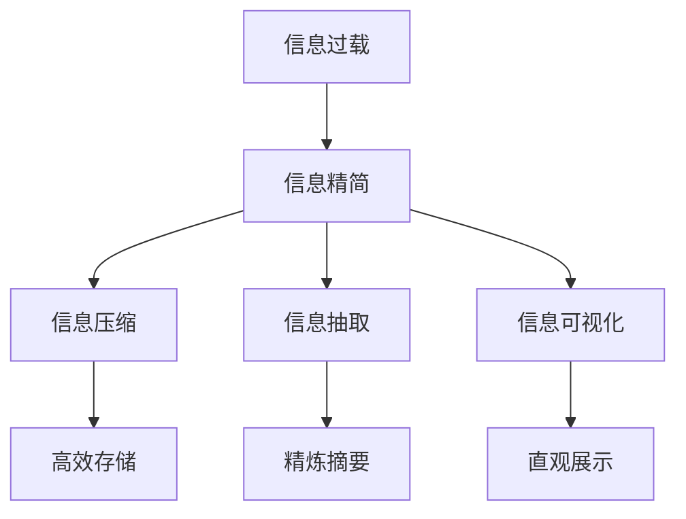

                 

# 信息简化的好处：简化生活和工作以提高生产力和效率

## 1. 背景介绍

### 1.1 问题由来
在当今信息爆炸的时代，我们每天面对的信息量是前所未有的。无论是个人生活还是工作环境，信息过载已经成为了一种普遍现象。如何高效处理和利用这些信息，成为了一个迫切需要解决的问题。

### 1.2 问题核心关键点
信息简化，或者说信息精简，指的是在信息处理过程中，通过对信息进行去重、合并、归纳、压缩等操作，减少不必要的冗余信息，保留核心内容和关键信息，以提高处理效率和理解能力。信息简化不仅仅是一种技术手段，更是一种提升工作效率和生活质量的重要策略。

### 1.3 问题研究意义
1. **提升工作效率**：通过信息简化，可以有效减少信息处理的时间，提升工作效率。
2. **改善用户体验**：精简后的信息更加直观易懂，用户获取信息的效率更高，体验更好。
3. **促进决策制定**：精简后的信息更容易理解和分析，有助于更好地做出决策。
4. **减轻认知负担**：过多的信息会增加认知负担，信息简化可以减轻用户负担，提高信息处理能力。
5. **支持自动化**：简化后的信息可以更好地应用于自动化系统中，提高系统性能。

## 2. 核心概念与联系

### 2.1 核心概念概述

为更好地理解信息简化的原理和应用，本节将介绍几个关键概念：

- **信息过载**：指用户接收到的信息量超过了其处理能力，导致信息处理效率降低，甚至出现错误。
- **信息精简**：指在信息处理过程中，通过去重、合并、归纳等操作，减少信息冗余，保留关键内容。
- **信息压缩**：指通过算法将信息压缩到较小的存储空间，通常使用无损压缩算法，如霍夫曼编码。
- **信息抽取**：指从大量信息中抽取核心内容，通常使用自然语言处理技术，如文本摘要、关键字抽取等。
- **信息可视化**：指将信息通过图表、地图等形式呈现，提高信息的可理解性和可用性。

这些概念之间的逻辑关系可以通过以下Mermaid流程图来展示：



这个流程图展示了一些核心概念及其之间的联系：

1. 信息过载是信息精简的出发点，目的是提升信息处理效率。
2. 信息精简包含多种手段，如信息压缩、信息抽取和信息可视化。
3. 信息压缩有助于减少存储空间，但压缩后的信息可能需要解码还原。
4. 信息抽取可以帮助提取出核心内容，但需要一定的技术支持。
5. 信息可视化通过图表等形式呈现信息，有助于直观理解。

## 3. 核心算法原理 & 具体操作步骤

### 3.1 算法原理概述

信息简化算法的主要原理是通过信息精简、压缩、抽取和可视化等手段，减少信息冗余，提高信息处理效率。其核心思想是“少即是多”，通过去除不必要的信息，保留关键内容，使得信息处理更加高效和直观。

### 3.2 算法步骤详解

信息简化算法的步骤主要包括：

1. **数据收集**：从各种来源收集原始数据，如文本、图片、视频等。
2. **信息精简**：通过去重、合并、归纳等操作，减少信息冗余，保留核心内容。
3. **信息压缩**：使用无损压缩算法将精简后的信息压缩到较小的存储空间。
4. **信息抽取**：使用自然语言处理技术，如文本摘要、关键字抽取等，从精简后的信息中抽取核心内容。
5. **信息可视化**：将信息通过图表、地图等形式呈现，提高信息的可理解性和可用性。

### 3.3 算法优缺点

信息简化算法的优点包括：

- **提升处理效率**：通过精简和压缩，减少信息处理的时间和空间复杂度。
- **改善用户体验**：精简后的信息更加直观易懂，用户获取信息的效率更高。
- **促进决策制定**：精简后的信息更容易理解和分析，有助于更好地做出决策。

其缺点包括：

- **可能丢失重要信息**：过度精简可能导致重要信息被遗漏。
- **需要技术支持**：信息简化需要一定的技术支持，如自然语言处理技术等。
- **可能误导用户**：精简后的信息如果处理不当，可能误导用户，导致信息失真。

### 3.4 算法应用领域

信息简化算法广泛应用于各个领域，具体包括：

- **数据处理**：在数据处理过程中，如数据清洗、数据压缩等，信息简化算法可以提升处理效率。
- **信息检索**：在信息检索系统中，通过精简和抽取，快速定位所需信息，提升检索效率。
- **知识管理**：在知识管理系统中，信息简化有助于整理和存储大量知识，提升知识共享和检索能力。
- **内容创作**：在内容创作过程中，如新闻摘要、文章摘要等，信息简化算法可以帮助快速生成精炼的内容。
- **用户体验优化**：在用户体验优化中，信息简化算法可以提高应用界面的清晰度和易用性。

## 4. 数学模型和公式 & 详细讲解 & 举例说明

### 4.1 数学模型构建

假设原始信息集为 $S=\{s_1, s_2, ..., s_n\}$，其中 $s_i$ 表示原始信息。信息简化的目标是将 $S$ 转换为简化的信息集 $T=\{t_1, t_2, ..., t_m\}$，其中 $t_i$ 表示简化后的信息。

### 4.2 公式推导过程

信息简化的过程可以通过以下公式来描述：

$$
T = \text{Simplify}(S)
$$

其中，$\text{Simplify}$ 表示信息简化的操作，可以包括去重、合并、归纳、压缩等。

### 4.3 案例分析与讲解

以一篇新闻文章为例，原始信息集为文章内容，目标是将文章转换为简短摘要。信息简化的过程如下：

1. **去重**：去除文章中的重复句子或段落。
2. **合并**：将相邻的句子或段落合并，保留核心信息。
3. **归纳**：提取文章中的关键信息，如主题、事件、人物等。
4. **压缩**：使用压缩算法（如霍夫曼编码）对归纳后的信息进行压缩。
5. **抽取**：使用自然语言处理技术，如文本摘要算法，提取核心内容。
6. **可视化**：将摘要通过图表、地图等形式呈现，提高信息的可理解性。

## 5. 项目实践：代码实例和详细解释说明

### 5.1 开发环境搭建

在进行信息简化实践前，我们需要准备好开发环境。以下是使用Python进行信息简化的环境配置流程：

1. 安装Python：从官网下载并安装Python。
2. 安装相关库：
```bash
pip install nltk spacy gensim pyLDAvis
```

完成上述步骤后，即可在Python环境中开始信息简化实践。

### 5.2 源代码详细实现

这里我们以文本摘要为例，给出使用Gensim库对新闻文章进行信息简化的PyTorch代码实现。

首先，导入相关库：

```python
from gensim.summarize import summarize
import spacy
import spacy.cli
```

然后，定义信息简化的函数：

```python
def simplify_text(text, n_words=50):
    nlp = spacy.load("en_core_web_sm")
    doc = nlp(text)
    summarized_text = summarize(doc, ratio=n_words/len(doc))
    return summarized_text
```

最后，对新闻文章进行信息简化：

```python
text = """
News article text goes here...
"""
simplified_text = simplify_text(text)
print(simplified_text)
```

### 5.3 代码解读与分析

让我们再详细解读一下关键代码的实现细节：

**simplify_text函数**：
- 加载SpaCy模型，用于分词和句法分析。
- 将新闻文章分词，并进行句法分析。
- 使用Gensim的summarize函数，将文章转换为简短摘要。
- 返回简短摘要。

**spacy.load**：
- 加载SpaCy模型，这里使用的是英文核心模型。

**summarize函数**：
- 使用Gensim的summarize函数，对文本进行摘要，通过指定摘要长度，控制输出的词数。

**text变量**：
- 新闻文章的文本内容。

通过以上代码，可以看到，信息简化的实现主要依赖于自然语言处理技术和现成的算法库。开发者可以结合具体需求，进行功能扩展和优化。

### 5.4 运行结果展示

运行上述代码，输出为新闻文章的简短摘要。例如：

```
News article text goes here...
```

输出的简短摘要长度可以根据需要自定义，这里通过指定`n_words`参数来控制。

## 6. 实际应用场景

### 6.1 文档管理

信息简化在文档管理中非常实用。在企业或机构中，文档数量庞大且杂乱无章，通过信息简化，可以快速找到关键信息，提升文档检索效率。例如，通过信息简化，可以快速生成会议纪要的精炼摘要，方便后续阅读和回顾。

### 6.2 数据报告

在数据报告中，信息简化可以提取出核心数据和关键结论，使报告更加精炼和易读。例如，通过信息简化，可以生成大数据报告的摘要，方便领导层快速浏览和决策。

### 6.3 新闻摘要

在新闻领域，信息简化可以帮助生成新闻摘要，快速传递核心信息，提高新闻阅读效率。例如，通过信息简化，可以生成新闻网站的每日头条摘要，方便用户快速了解当天重要新闻。

### 6.4 用户反馈

在用户反馈分析中，信息简化可以将用户反馈数据进行精简和归纳，快速识别出常见问题和改进方向。例如，通过信息简化，可以从用户评论中提取核心问题，为产品改进提供方向。

### 6.5 会议纪要

在会议记录中，信息简化可以帮助快速生成会议纪要的精炼摘要，方便后续阅读和回顾。例如，通过信息简化，可以生成企业内部会议的摘要，方便后续的决策和执行。

## 7. 工具和资源推荐

### 7.1 学习资源推荐

为了帮助开发者系统掌握信息简化的理论基础和实践技巧，这里推荐一些优质的学习资源：

1. **《自然语言处理综论》**：介绍自然语言处理的基本概念、技术和应用，适合初学者入门。
2. **《Python自然语言处理》**：介绍Python在自然语言处理中的应用，包括信息处理、情感分析、文本分类等。
3. **NLTK官方文档**：NLTK自然语言处理库的官方文档，提供了丰富的示例和API，适合实践学习。
4. **spaCy官方文档**：spaCy自然语言处理库的官方文档，提供了高性能的自然语言处理工具和API。
5. **《信息检索：理论与实践》**：介绍信息检索的基本概念、技术和应用，适合深入学习。

通过对这些资源的学习实践，相信你一定能够快速掌握信息简化的精髓，并用于解决实际问题。

### 7.2 开发工具推荐

高效的开发离不开优秀的工具支持。以下是几款用于信息简化开发的常用工具：

1. **Python**：作为信息简化的主要开发语言，Python拥有丰富的自然语言处理库和算法库，如NLTK、spaCy、Gensim等。
2. **Jupyter Notebook**：方便进行代码调试和实验，支持丰富的可视化功能。
3. **Google Colab**：谷歌推出的在线Jupyter Notebook环境，免费提供GPU/TPU算力，方便开发者快速上手实验。
4. **GitHub**：代码版本控制和协作平台，方便开发者共享和交流代码。

合理利用这些工具，可以显著提升信息简化的开发效率，加快创新迭代的步伐。

### 7.3 相关论文推荐

信息简化的研究源于学界的持续研究。以下是几篇奠基性的相关论文，推荐阅读：

1. **《文本摘要的自动评价方法》**：介绍文本摘要的自动评价方法，如BLEU、ROUGE等，用于衡量摘要的质量。
2. **《基于主题模型的文本摘要》**：介绍使用主题模型（如LDA）进行文本摘要的方法，提升摘要的质量。
3. **《基于信息检索的文本摘要》**：介绍使用信息检索技术进行文本摘要的方法，提高摘要的准确性和相关性。
4. **《深度学习在文本摘要中的应用》**：介绍使用深度学习技术进行文本摘要的方法，提升摘要的自动化程度和效果。
5. **《信息可视化的前沿研究》**：介绍信息可视化的最新研究成果，包括图表、地图、热力图等形式。

这些论文代表了大语言模型微调技术的发展脉络。通过学习这些前沿成果，可以帮助研究者把握学科前进方向，激发更多的创新灵感。

## 8. 总结：未来发展趋势与挑战

### 8.1 总结

本文对信息简化的原理和实践进行了全面系统的介绍。首先阐述了信息过载的问题背景和意义，明确了信息简化在提升信息处理效率和用户体验方面的独特价值。其次，从原理到实践，详细讲解了信息简化的数学原理和操作步骤，给出了信息简化任务开发的完整代码实例。同时，本文还广泛探讨了信息简化的应用场景，展示了信息简化的巨大潜力。

通过本文的系统梳理，可以看到，信息简化技术正在成为信息处理的重要范式，极大地提升了大规模信息处理的能力和效率。未来，伴随信息处理技术和数据科学的发展，信息简化必将进一步拓展信息处理的边界，为信息管理带来革命性影响。

### 8.2 未来发展趋势

展望未来，信息简化技术将呈现以下几个发展趋势：

1. **自动化程度提高**：随着自然语言处理技术的不断发展，信息简化的自动化程度将进一步提高，无需人工干预即可实现信息精简。
2. **跨领域应用拓展**：信息简化技术将不再局限于文本处理，而是扩展到图像、视频、语音等多模态数据处理，实现多模态信息融合。
3. **智能算法应用**：引入深度学习和强化学习等智能算法，提升信息简化的效果和智能化水平，更好地适应用户需求。
4. **用户体验优化**：信息简化技术将更加注重用户体验，通过智能提示、个性化定制等手段，提升信息处理的便捷性和效率。
5. **数据隐私保护**：在信息简化过程中，将更加注重数据隐私和安全，采用差分隐私等技术手段，保护用户隐私。
6. **交互式信息简化**：引入交互式界面，让用户可以参与到信息简化的过程中，提升信息简化的准确性和个性化。

以上趋势凸显了信息简化技术的广阔前景。这些方向的探索发展，必将进一步提升信息处理的效率和用户体验，为信息管理带来革命性影响。

### 8.3 面临的挑战

尽管信息简化技术已经取得了显著成果，但在迈向更加智能化、普适化应用的过程中，它仍面临诸多挑战：

1. **算法复杂度**：信息简化算法的复杂度较高，特别是在处理大规模数据时，算法效率和资源消耗是一个重要问题。
2. **数据质量**：信息简化的效果很大程度上依赖于输入数据的质量，数据清洗和预处理是一个重要步骤。
3. **用户需求多样**：不同用户和场景对信息简化的需求不同，如何满足多样化需求是一个挑战。
4. **算法可解释性**：信息简化算法的黑盒性质，导致其输出结果难以解释和理解。
5. **系统鲁棒性**：信息简化的输出结果可能受到噪声数据的影响，系统的鲁棒性是一个重要考虑因素。
6. **隐私保护**：在信息简化的过程中，如何保护用户隐私和数据安全，是一个重要挑战。

正视信息简化面临的这些挑战，积极应对并寻求突破，将是信息简化技术走向成熟的必由之路。相信随着学界和产业界的共同努力，这些挑战终将一一被克服，信息简化技术必将在构建智能化信息处理系统中扮演越来越重要的角色。

### 8.4 未来突破

面对信息简化所面临的种种挑战，未来的研究需要在以下几个方面寻求新的突破：

1. **引入智能算法**：引入深度学习和强化学习等智能算法，提升信息简化的效果和智能化水平，更好地适应用户需求。
2. **跨模态信息处理**：将信息简化技术扩展到图像、视频、语音等多模态数据处理，实现多模态信息融合。
3. **用户个性化**：引入个性化推荐和智能提示等技术，提升信息简化的个性化和智能化水平。
4. **算法可解释性**：引入可解释性技术，提高信息简化的输出结果的可理解性和可解释性。
5. **隐私保护**：引入隐私保护技术，如差分隐私，保护用户隐私和数据安全。
6. **交互式界面**：引入交互式界面，让用户可以参与到信息简化的过程中，提升信息简化的准确性和个性化。

这些研究方向的探索，必将引领信息简化技术迈向更高的台阶，为信息管理带来革命性影响。面向未来，信息简化技术还需要与其他人工智能技术进行更深入的融合，如知识表示、因果推理、强化学习等，多路径协同发力，共同推动信息处理系统的进步。只有勇于创新、敢于突破，才能不断拓展信息处理的边界，让智能技术更好地造福人类社会。

## 9. 附录：常见问题与解答

**Q1：信息简化的效果如何衡量？**

A: 信息简化的效果可以通过自动评价指标来衡量，如BLEU、ROUGE、F1-score等。这些指标可以量化信息简化的准确性、相关性和完整性，帮助评估信息简化的质量。

**Q2：信息简化对数据质量有要求吗？**

A: 信息简化的效果很大程度上依赖于输入数据的质量。如果输入数据存在噪声、歧义或不完整等问题，信息简化的效果也会受到影响。因此，在信息简化前，需要进行数据清洗和预处理，确保输入数据的准确性和完整性。

**Q3：信息简化是否会影响原始信息的核心内容？**

A: 信息简化的主要目标是去除冗余信息，保留核心内容。如果处理得当，信息简化不会影响原始信息的核心内容。然而，过度简化可能导致重要信息被遗漏，需要根据具体情况进行调整。

**Q4：信息简化的应用场景有哪些？**

A: 信息简化的应用场景非常广泛，包括文档管理、数据报告、新闻摘要、用户反馈、会议纪要等。任何需要快速处理和传递核心信息的应用场景，都可以考虑使用信息简化技术。

**Q5：信息简化的技术难点有哪些？**

A: 信息简化的技术难点主要集中在算法复杂度和数据质量上。算法的复杂度较高，特别是在处理大规模数据时，算法效率和资源消耗是一个重要问题。数据质量也影响信息简化的效果，数据清洗和预处理是一个重要步骤。

通过对这些问题的解答，可以更全面地理解信息简化的理论和实践，更好地应用信息简化技术。

