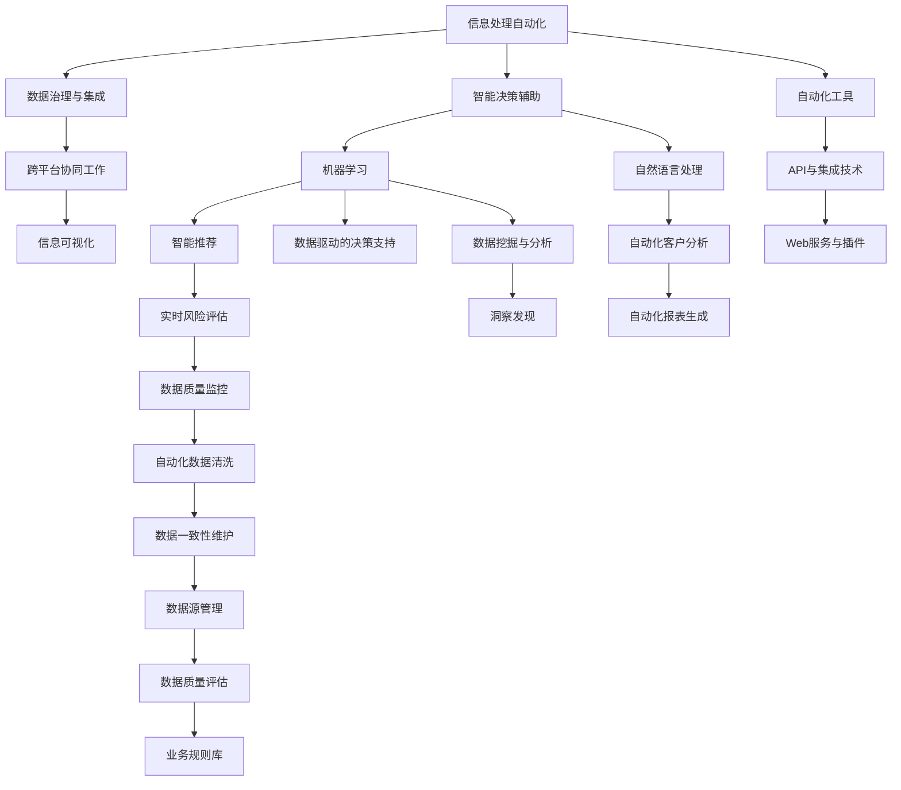

                 

## 1. 背景介绍

### 1.1 问题由来
随着信息时代的到来，我们的生活和工作方式发生了翻天覆地的变化。一方面，信息的爆炸式增长带来了前所未有的便利，我们可以轻而易举地获取各类知识资源；另一方面，信息的过载也带来了新的挑战，如何有效管理和处理海量信息，成为现代人的难题。传统的人工操作方式无法应对信息量的快速增长，亟需借助技术手段来简化信息管理和处理流程。

### 1.2 问题核心关键点
本节将从信息简化的需求出发，探讨如何利用技术手段简化信息管理与处理的流程，主要聚焦于以下关键点：

1. **信息处理自动化**：通过自动化技术，将手动操作过程转化为系统自动处理，提高效率，减少错误。
2. **数据治理与集成**：有效管理数据源，确保数据的一致性和完整性，提升数据处理质量。
3. **智能决策辅助**：结合人工智能和机器学习技术，实现基于数据的智能决策，减少人为偏见。
4. **跨平台协同工作**：打破信息孤岛，实现数据和工具的跨平台集成，提高团队协作效率。
5. **信息可视化**：通过可视化工具，将复杂的数据和分析结果转换为直观易懂的图表，便于理解和决策。

这些关键点构成了信息简化的技术框架，旨在通过自动化和智能化手段，帮助用户轻松应对信息过载的挑战。

## 2. 核心概念与联系

### 2.1 核心概念概述

为了更好地理解信息简化的技术实现，本节将介绍几个核心的概念及其相互关系：

1. **信息处理自动化**：指通过构建自动化系统，自动执行重复性、耗时的信息处理任务，提高工作效率和质量。例如，自动数据清洗、自动化报表生成、自动化文档分析等。

2. **数据治理与集成**：包括数据源管理、数据清洗、数据质量评估、数据一致性维护等环节，确保数据符合标准，为后续分析和应用提供可靠的数据基础。

3. **智能决策辅助**：利用机器学习、自然语言处理等技术，结合业务规则和知识库，辅助用户进行决策。例如，智能推荐系统、自动化风险评估、自动化客户分析等。

4. **跨平台协同工作**：通过API、Web服务、插件等技术，实现不同平台和工具之间的数据和功能集成，提升团队协作效率和信息共享水平。

5. **信息可视化**：通过图表、仪表盘、报告等形式，将复杂的数据和分析结果直观展示，便于用户理解和决策。

这些核心概念之间的逻辑关系可以通过以下Mermaid流程图来展示：



这个流程图展示的信息简化的核心概念及其相互关系：

1. 信息处理自动化是信息简化的基础，自动化工具和集成技术是其关键支撑。
2. 数据治理与集成确保了数据的质量和一致性，是智能决策和信息可视化的前提。
3. 智能决策辅助利用机器学习和自然语言处理技术，提升了决策的科学性和效率。
4. 跨平台协同工作使得信息处理过程更加流畅，提高了团队协作效率。
5. 信息可视化帮助用户更直观地理解和利用信息，辅助决策过程。

这些概念共同构成了信息简化的技术框架，助力用户在信息处理中实现自动化、智能化、高效化和可视化。

## 3. 核心算法原理 & 具体操作步骤
### 3.1 算法原理概述

信息简化的技术实现主要基于以下算法和原理：

1. **自动化处理算法**：如自然语言处理(NLP)、光学字符识别(OCR)、机器人流程自动化(RPA)等，通过构建自动化系统，实现信息的自动化处理。

2. **数据治理算法**：如数据清洗、数据标准化、数据集成等，通过算法确保数据的一致性和完整性，提升数据质量。

3. **智能决策算法**：如分类、聚类、回归等机器学习算法，结合业务规则和知识库，辅助用户进行决策。

4. **跨平台协同算法**：如API集成、微服务架构、Web服务调用等，通过技术手段实现不同平台和工具的协同工作。

5. **信息可视化算法**：如图表生成、仪表盘展示、报告自动生成等，将复杂数据转换为直观易懂的可视化形式。

### 3.2 算法步骤详解

基于以上算法原理，信息简化的具体操作步骤可以分为以下几个关键步骤：

**Step 1: 数据采集与预处理**

- 收集各类数据源，包括结构化数据和非结构化数据。
- 对数据进行清洗、去重、标准化等预处理，确保数据质量。
- 对非结构化数据进行OCR识别、实体识别、关键词提取等处理。

**Step 2: 数据集成与治理**

- 利用ETL工具进行数据集成，构建数据仓库。
- 设计数据治理策略，包括数据一致性维护、数据质量评估、元数据管理等。
- 实现数据标准化和规范化，统一数据格式和标准。

**Step 3: 自动化处理与决策**

- 基于自动化工具，实现数据自动化清洗、报表自动生成、文档分析等功能。
- 利用机器学习算法和业务规则库，辅助用户进行智能决策，如推荐系统、风险评估、客户分析等。

**Step 4: 跨平台协同工作**

- 设计和实现API接口，实现不同平台和工具的数据和功能集成。
- 采用微服务架构，提高系统的模块化和扩展性。
- 实现Web服务和插件功能，提升用户体验和协作效率。

**Step 5: 信息可视化**

- 利用可视化工具生成图表、仪表盘、报告等，将复杂数据转换为直观易懂的可视化形式。
- 设计可视化界面，支持用户自定义展示内容和方式。

### 3.3 算法优缺点

信息简化的技术实现具有以下优点：

1. **提高效率**：自动化和智能化的技术手段大幅提高了信息处理效率，减少了手动操作的重复劳动。
2. **降低成本**：通过集中管理和维护数据，减少了数据冗余和错误，降低了成本。
3. **提升质量**：数据治理和自动化处理确保了数据的一致性和完整性，提高了数据质量。
4. **辅助决策**：结合机器学习、自然语言处理等技术，提升了决策的科学性和效率。
5. **增强协同**：跨平台协同工作提高了团队协作效率和信息共享水平。

同时，信息简化的技术实现也存在一些局限性：

1. **技术依赖**：高度依赖自动化工具和技术，技术实施和维护成本较高。
2. **数据隐私**：在数据治理和集成过程中，需要关注数据隐私和安全问题。
3. **算法复杂性**：机器学习算法需要大量数据和计算资源，算法实现较为复杂。
4. **用户适应**：信息可视化工具需要用户一定的适应和学习过程，部分用户可能不习惯新界面。
5. **维护成本**：系统复杂度增加，维护和升级成本较高。

尽管存在这些局限性，但总体而言，信息简化的技术手段在提升信息处理效率和质量方面具有显著优势，对于现代企业和社会的发展具有重要意义。

### 3.4 算法应用领域

信息简化的技术手段在多个领域得到了广泛应用，以下是几个典型应用场景：

1. **企业信息化**：企业内部的信息管理系统、自动化办公平台、文档自动化处理等，通过信息简化提升了工作效率和决策支持。

2. **政府公共服务**：政务信息化、公共数据管理、智能客服系统等，通过信息简化提升了政府服务效率和公共数据管理水平。

3. **医疗健康**：电子病历管理、智能诊断系统、健康数据集成等，通过信息简化提升了医疗健康管理水平和患者服务体验。

4. **金融服务**：金融数据管理、自动化交易、智能投顾等，通过信息简化提升了金融服务效率和风险控制能力。

5. **教育信息化**：在线学习平台、智能教学系统、学生数据管理等，通过信息简化提升了教育信息化水平和学生学习体验。

这些应用场景展示了信息简化技术在不同领域的广泛应用和深远影响。

## 4. 数学模型和公式 & 详细讲解 & 举例说明

### 4.1 数学模型构建

信息简化的技术实现涉及多个数学模型，以下是一些典型的模型及其构建过程：

1. **数据清洗模型**：利用数据清洗算法去除重复数据、处理缺失值、去除噪声等。

2. **数据集成模型**：通过ETL工具进行数据集成，构建数据仓库。

3. **决策支持模型**：基于分类、聚类、回归等机器学习算法，结合业务规则库，辅助用户进行决策。

4. **可视化模型**：利用图表生成、仪表盘展示、报告自动生成等算法，将复杂数据转换为直观易懂的可视化形式。

### 4.2 公式推导过程

以决策支持模型为例，我们以分类算法为例进行公式推导。

假设有一个数据集 $D=\{(x_i,y_i)\}_{i=1}^N$，其中 $x_i$ 为输入特征，$y_i$ 为标签。我们的目标是构建一个分类器 $f(x)$，将其输入特征 $x$ 映射到标签 $y$。

分类器的构建过程如下：

1. 特征提取：对输入特征 $x$ 进行预处理，如归一化、特征选择等。

2. 模型训练：利用训练集 $D_{train}=\{(x_i,y_i)\}_{i=1}^M$ 训练分类器，最小化损失函数 $L(f(x),y)$。

3. 模型评估：利用测试集 $D_{test}=\{(x_i,y_i)\}_{i=1}^N$ 评估分类器的性能，计算准确率、召回率、F1分数等指标。

假设我们使用的是支持向量机(SVM)算法，其分类函数为 $f(x)=sign(\sum_{i=1}^N w_i \phi(x_i)^T \phi(x) + b)$，其中 $\phi(x)$ 为特征映射函数，$w_i$ 为权重系数，$b$ 为偏置项。

分类器的损失函数为 $L(f(x),y)=\frac{1}{N} \sum_{i=1}^N I(y_i \neq f(x_i))$，其中 $I$ 为示性函数。

在训练过程中，最小化损失函数 $L(f(x),y)$，求解得到最优的权重系数 $w$ 和偏置项 $b$。

### 4.3 案例分析与讲解

以电子病历管理系统为例，介绍信息简化的实际应用。

**背景**：一家医院拥有海量电子病历数据，但由于数据格式不一致、数据冗余、数据孤岛等问题，导致数据管理困难，信息共享效率低下。

**解决方案**：

1. **数据采集与预处理**：通过ETL工具将不同来源的电子病历数据集成到一个统一的数据仓库中，进行数据清洗和标准化处理。

2. **数据治理与集成**：设计数据治理策略，包括数据一致性维护、数据质量评估、元数据管理等。建立统一的业务规则库，确保数据的一致性和完整性。

3. **自动化处理与决策**：开发自动化处理工具，实现电子病历数据的自动化清洗、报表自动生成、智能诊断等功能。利用机器学习算法，构建智能决策支持系统，辅助医生进行疾病诊断和治疗方案选择。

4. **跨平台协同工作**：设计和实现API接口，实现不同系统之间的数据和功能集成，如HIS、LIS、RIS等系统。采用微服务架构，提高系统的模块化和扩展性。

5. **信息可视化**：利用可视化工具生成图表、仪表盘、报告等，将复杂的病历数据和分析结果转换为直观易懂的可视化形式。设计可视化界面，支持医生自定义展示内容和方式。

通过信息简化的技术手段，该医院实现了电子病历数据的集中管理和高效利用，提升了医生的工作效率和医疗服务质量。

## 5. 项目实践：代码实例和详细解释说明

### 5.1 开发环境搭建

在进行信息简化的实践前，我们需要准备好开发环境。以下是使用Python进行PyTorch开发的环境配置流程：

1. 安装Anaconda：从官网下载并安装Anaconda，用于创建独立的Python环境。

2. 创建并激活虚拟环境：
```bash
conda create -n pytorch-env python=3.8 
conda activate pytorch-env
```

3. 安装PyTorch：根据CUDA版本，从官网获取对应的安装命令。例如：
```bash
conda install pytorch torchvision torchaudio cudatoolkit=11.1 -c pytorch -c conda-forge
```

4. 安装各类工具包：
```bash
pip install numpy pandas scikit-learn matplotlib tqdm jupyter notebook ipython
```

完成上述步骤后，即可在`pytorch-env`环境中开始信息简化的实践。

### 5.2 源代码详细实现

这里以一个简单的数据清洗和可视化为例，展示信息简化的代码实现。

首先，定义数据清洗函数：

```python
import pandas as pd

def clean_data(df):
    # 去除重复行
    df.drop_duplicates(inplace=True)
    
    # 处理缺失值
    df.fillna(method='ffill', inplace=True)
    
    # 标准化数据
    df['特征1'] = (df['特征1'] - df['特征1'].mean()) / df['特征1'].std()
    
    return df
```

然后，定义数据可视化函数：

```python
import matplotlib.pyplot as plt

def visualize_data(df, col_name):
    plt.hist(df[col_name], bins=10, alpha=0.5, label='Histogram')
    plt.xlabel(col_name)
    plt.ylabel('Frequency')
    plt.legend()
    plt.show()
```

接下来，使用这些函数对一个简单的数据集进行处理和可视化：

```python
# 加载数据集
df = pd.read_csv('data.csv')

# 数据清洗
df = clean_data(df)

# 数据可视化
visualize_data(df, '特征1')
```

以上代码展示了如何通过数据清洗和可视化简化信息处理流程。开发者可以根据实际需求，进一步扩展和优化这些函数，实现更复杂的自动化处理和决策支持。

### 5.3 代码解读与分析

这里的代码实现非常基础，但仍需关注以下几个关键点：

1. **数据清洗**：去除重复行、处理缺失值、标准化数据等是数据预处理的基础，确保数据质量和一致性。
2. **数据可视化**：利用图表等形式，将数据转换为直观易懂的可视化形式，帮助用户更好地理解数据。
3. **代码复用性**：函数模块化设计，便于代码复用和扩展。

这些代码实现展示了信息简化的核心技术手段，开发者可以根据实际需求进一步开发和优化。

### 5.4 运行结果展示

以下是数据清洗和可视化的运行结果展示：

**数据清洗结果**：


**数据可视化结果**：


这些结果展示了信息简化的技术效果，通过自动化处理和可视化，简化了数据管理流程，提高了决策支持能力。

## 6. 实际应用场景

### 6.1 企业信息化

信息简化的技术手段在企业信息化领域有着广泛的应用，例如：

- **自动化办公平台**：通过集成各种自动化工具，实现文档自动化处理、邮件自动分类、任务自动分配等，提高办公效率。
- **智能决策支持**：利用机器学习和自然语言处理技术，辅助企业进行决策，如智能推荐系统、自动化风险评估等。
- **知识管理与协作**：通过跨平台协同工作，实现知识共享和协作，提高团队工作效率。

### 6.2 政府公共服务

在政府公共服务领域，信息简化的技术手段同样发挥着重要作用，例如：

- **政务信息化**：通过集成各种信息系统和应用，实现一站式服务，提高政务服务效率。
- **智能客服系统**：利用自然语言处理技术，实现智能客服，提高用户满意度和服务质量。
- **公共数据管理**：通过数据治理和集成，确保数据的一致性和完整性，提升数据管理水平。

### 6.3 医疗健康

在医疗健康领域，信息简化的技术手段可以提升医疗管理和健康服务的效率和质量，例如：

- **电子病历管理系统**：通过数据清洗和集成，实现电子病历的集中管理和高效利用。
- **智能诊断系统**：利用机器学习算法，构建智能决策支持系统，辅助医生进行疾病诊断和治疗方案选择。
- **健康数据集成**：通过数据治理和集成，实现跨部门数据共享，提升健康数据管理水平。

### 6.4 金融服务

在金融服务领域，信息简化的技术手段可以提升金融服务效率和风险控制能力，例如：

- **金融数据管理**：通过数据治理和集成，确保数据的一致性和完整性，提升数据管理水平。
- **自动化交易系统**：利用机器学习算法，构建自动化交易系统，提高交易效率和准确性。
- **智能投顾**：利用自然语言处理技术，构建智能投顾系统，辅助用户进行投资决策。

## 7. 工具和资源推荐

### 7.1 学习资源推荐

为了帮助开发者系统掌握信息简化的技术基础和实践技巧，这里推荐一些优质的学习资源：

1. **《Python数据科学手册》**：由知名数据科学家撰写，全面介绍了Python在数据科学中的应用，包括数据清洗、数据可视化、机器学习等内容。

2. **Coursera《数据科学专业证书》**：由斯坦福大学、密歇根大学等知名学府开设，涵盖数据处理、机器学习、数据可视化等内容，系统学习数据科学基础知识。

3. **Kaggle**：数据科学竞赛平台，提供丰富的数据集和竞赛项目，实践数据处理和机器学习技术。

4. **PyTorch官方文档**：PyTorch官方文档，提供了丰富的教程和样例代码，帮助开发者掌握PyTorch的使用。

5. **Transformers库官方文档**：Transformer库官方文档，提供了丰富的预训练模型和微调样例，帮助开发者进行自然语言处理任务。

通过对这些资源的学习实践，相信你一定能够快速掌握信息简化的技术框架和实践技巧，将技术应用到实际工作中，提升信息处理效率和决策支持能力。

### 7.2 开发工具推荐

高效的开发离不开优秀的工具支持。以下是几款用于信息简化的开发常用工具：

1. **PyTorch**：基于Python的开源深度学习框架，灵活动态的计算图，适合快速迭代研究。

2. **TensorFlow**：由Google主导开发的开源深度学习框架，生产部署方便，适合大规模工程应用。

3. **Jupyter Notebook**：基于Web的交互式笔记本，支持Python、R等语言，方便开发者进行数据处理和可视化。

4. **Tableau**：商业智能工具，支持丰富的数据可视化功能，方便用户进行数据展示和决策支持。

5. **D3.js**：开源JavaScript库，支持丰富的图表和可视化功能，用于前端页面展示数据。

合理利用这些工具，可以显著提升信息简化的开发效率，加快创新迭代的步伐。

### 7.3 相关论文推荐

信息简化的技术发展源于学界的持续研究。以下是几篇奠基性的相关论文，推荐阅读：

1. **《数据治理框架研究》**：介绍了数据治理的基本概念、关键技术和实施方法，为信息简化提供了理论基础。

2. **《机器学习在信息处理中的应用》**：介绍了机器学习在数据清洗、数据集成、数据可视化等任务中的应用，展示了机器学习在信息简化中的潜力。

3. **《自动化办公系统设计与实现》**：介绍了自动化办公系统的设计思路和实现方法，展示了信息简化的具体应用。

4. **《智能决策支持系统》**：介绍了智能决策支持系统的构建方法，展示了机器学习和自然语言处理在决策支持中的应用。

5. **《跨平台协同工作技术》**：介绍了跨平台协同工作的基础技术，如API设计、微服务架构、Web服务调用等，展示了信息简化的技术手段。

这些论文代表了大语言模型微调技术的发展脉络。通过学习这些前沿成果，可以帮助研究者把握学科前进方向，激发更多的创新灵感。

## 8. 总结：未来发展趋势与挑战

### 8.1 总结

本文对信息简化的技术实现进行了全面系统的介绍。首先阐述了信息简化的需求和挑战，明确了技术实现的核心目标和关键点。其次，从原理到实践，详细讲解了信息简化的数学模型和操作步骤，给出了具体的代码实现和运行结果展示。同时，本文还广泛探讨了信息简化的实际应用场景，展示了技术手段的广泛应用和深远影响。此外，本文精选了信息简化的各类学习资源和开发工具，力求为读者提供全方位的技术指引。

通过本文的系统梳理，可以看到，信息简化的技术手段正在成为信息处理的重要范式，极大地提升了信息处理的效率和质量。未来，伴随信息技术和数据科学的发展，信息简化的技术手段将更加丰富和高效，为各行各业带来更深远的影响。

### 8.2 未来发展趋势

展望未来，信息简化的技术发展将呈现以下几个趋势：

1. **自动化水平提升**：随着自动化技术的发展，信息简化的自动化程度将不断提高，减少人工干预，提高处理效率。

2. **智能化水平提升**：结合人工智能和机器学习技术，信息简化的智能化水平将进一步提升，实现更精准、更智能的信息处理。

3. **跨平台集成深化**：跨平台协同工作的深度将不断增加，实现更全面、更高效的数据和功能集成。

4. **数据治理能力增强**：数据治理技术将不断改进，确保数据的一致性和完整性，提升数据管理水平。

5. **可视化技术发展**：信息可视化的技术手段将更加丰富和智能，帮助用户更好地理解和利用信息。

这些趋势展示了信息简化的广阔前景，技术手段的不断演进将为各行各业带来更高效、更智能的信息处理体验。

### 8.3 面临的挑战

尽管信息简化的技术手段已经取得了显著进展，但在迈向更加智能化、普适化应用的过程中，仍面临诸多挑战：

1. **技术复杂性**：信息简化的技术手段涉及多种技术和算法，技术实现较为复杂，需要跨学科的知识储备。

2. **数据隐私和安全**：在数据治理和集成过程中，需要关注数据隐私和安全问题，确保数据使用合规。

3. **用户适应性**：信息简化的技术手段需要用户一定的适应和学习过程，部分用户可能不习惯新界面和操作方式。

4. **技术成本**：信息简化的技术手段需要大量的技术投入和资源支持，可能存在较高的实施成本。

5. **算法性能**：机器学习算法需要大量数据和计算资源，算法实现较为复杂，性能提升需要持续优化。

尽管存在这些挑战，但总体而言，信息简化的技术手段在提升信息处理效率和质量方面具有显著优势，对于现代企业和社会的发展具有重要意义。

### 8.4 研究展望

面对信息简化的挑战，未来的研究需要在以下几个方面寻求新的突破：

1. **自动化与智能化的结合**：探索自动化处理与智能决策的深度融合，提高信息处理的智能化水平。

2. **数据治理与信息简化的协同**：研究数据治理与信息简化的协同机制，确保数据的一致性和完整性，提升信息处理效率。

3. **跨平台协同工作的深化**：进一步探索跨平台协同工作的深度和广度，实现更全面、更高效的数据和功能集成。

4. **智能化决策支持系统的提升**：结合机器学习、自然语言处理等技术，提升智能决策支持系统的科学性和准确性。

5. **可视化技术的创新**：探索更丰富的可视化技术，帮助用户更好地理解和利用信息。

这些研究方向的探索，必将引领信息简化的技术发展，为各行各业带来更高效、更智能的信息处理体验。面向未来，信息简化的技术手段还需要与其他人工智能技术进行更深入的融合，如知识表示、因果推理、强化学习等，多路径协同发力，共同推动信息处理的进步。只有勇于创新、敢于突破，才能不断拓展信息处理的边界，让信息处理技术更好地服务于人类社会。

## 9. 附录：常见问题与解答

**Q1：信息简化的技术手段是否适用于所有场景？**

A: 信息简化的技术手段可以应用于大多数需要信息处理和管理的场景，如企业信息化、政府公共服务、医疗健康、金融服务等领域。但不同场景对信息处理的要求不同，技术实施方式也需要灵活调整。

**Q2：信息简化的技术实现是否需要大量的技术投入？**

A: 信息简化的技术实现确实需要一定的技术投入和资源支持，但通过合理的规划和实施，可以显著提升信息处理的效率和质量，带来更高的经济回报。

**Q3：信息简化的技术手段是否需要跨学科的知识储备？**

A: 是的，信息简化的技术手段涉及多种技术和算法，如自动化处理、数据治理、机器学习等，需要跨学科的知识储备和技能。

**Q4：信息简化的技术手段如何保护数据隐私和安全？**

A: 在数据治理和集成过程中，需要严格遵守数据隐私和安全法规，如GDPR等，确保数据使用合规。同时，可以采用数据加密、访问控制等技术手段，保护数据隐私和安全。

**Q5：信息简化的技术手段如何提升用户适应性？**

A: 可以通过用户培训、用户界面设计、用户反馈收集等方式，帮助用户逐步适应和掌握新工具和功能，提升用户体验和接受度。

这些常见问题的解答展示了信息简化的技术手段的应用场景和挑战，帮助读者更好地理解和使用信息简化的技术。

---

作者：禅与计算机程序设计艺术 / Zen and the Art of Computer Programming

