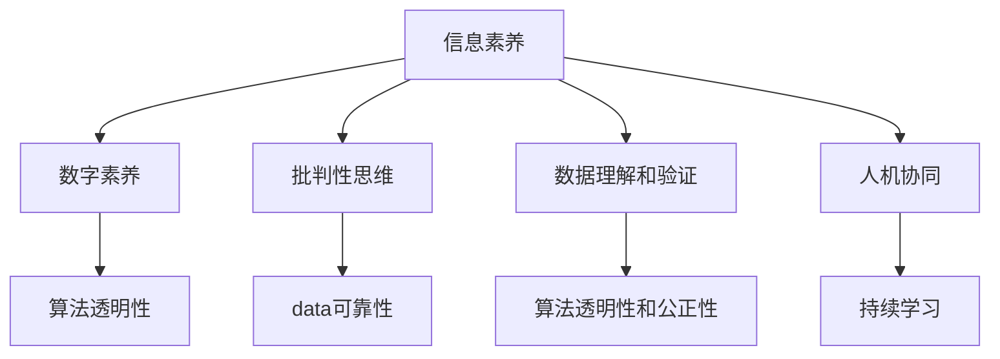

                 

# 信息验证和数字素养技能：为信息时代培养信息素养和批判性思维能力

> 关键词：信息验证, 数字素养, 信息素养, 批判性思维, 算法透明性, 数据可靠性, 人机协同

## 1. 背景介绍

### 1.1 问题由来

信息时代，数据与算法的深度融合催生了日益复杂多样的信息服务系统。从搜索引擎到社交网络，从电子商务到智能推荐，从自动驾驶到工业智能，人们生活工作的方方面面都依赖于智能系统提供的信息和算法决策。然而，这些系统往往过于复杂，普通人难以理解其内在机理和决策过程，容易产生信任危机，甚至引发信息恐慌。

为了解决这一问题，政府、企业、学术界以及公众普遍呼吁提升公众的信息素养和批判性思维能力。通过培养公众对信息源的甄别能力，鼓励多角度思考和数据分析，增强系统透明度，能够有效缓解信息过度依赖带来的困扰，构建信任的社会信息环境。

### 1.2 问题核心关键点

在信息技术迅猛发展的背景下，信息素养和批判性思维成为信息时代的重要能力。其核心关键点包括：

1. **数据理解和验证**：理解和判断数据来源的可靠性、数据的真实性和完整性。
2. **算法透明性和公正性**：了解算法的决策原理、预测机制及其可能存在的偏见。
3. **批判性思维**：具备从多个角度分析和评估信息的能力，避免片面和误导性的结论。
4. **人机协同**：学会与人工智能系统进行有效交互，充分利用其辅助决策的能力，同时保持自我判断。
5. **持续学习**：随时更新信息素养和批判性思维技能，跟上技术发展的步伐。

本论文旨在系统梳理信息素养和批判性思维培养的原理和方法，通过技术视角分析信息验证的核心问题，为信息时代培养具有数据理解和算法透明性的公众提供理论指导和实践指南。

## 2. 核心概念与联系

### 2.1 核心概念概述

为更好地理解信息验证和数字素养技能，我们首先介绍几个关键概念：

- **信息素养**：指个人在信息时代获取、评估、处理、使用和创造信息的能力。信息素养不仅包括技术操作能力，更涵盖了批判性思维、问题解决和创造性使用信息的能力。
- **数字素养**：指在数字社会中有效使用数字工具和资源的能力，包括基本操作、信息分析和逻辑推理等方面。
- **批判性思维**：指审慎评估、分析和评估信息的思维能力，能够识别信息的真实性、准确性和完整性，并对不同来源的信息进行有效比较和整合。
- **算法透明性**：指算法的可解释性、可验证性，使得用户能够理解算法的工作原理和决策机制，从而提升算法的可信度。
- **数据可靠性**：指数据的质量、真实性和完整性，确保数据来源的合法性和可信度。

这些概念相互联系，共同构成了信息时代对公众素养的要求。通过系统培养信息素养和批判性思维，公众不仅能够有效利用信息技术和数字工具，还能提高自身的信息鉴别和数据验证能力，构建健康的信息环境。

### 2.2 核心概念原理和架构的 Mermaid 流程图



这个流程图展示了信息素养和批判性思维技能的核心概念及其相互关系：

1. 信息素养是基础，涵盖了基本操作和高级分析技能。
2. 数字素养侧重于有效使用数字工具和资源。
3. 批判性思维能力关注信息评估和判断。
4. 算法透明性强调算法的解释性和公正性。
5. 数据可靠性关注数据质量和真实性。
6. 数据理解和验证是信息素养的核心能力之一。
7. 算法透明性结合数据可靠性，共同构建算法可信性。
8. 人机协同结合批判性思维，提升信息系统的决策质量。
9. 持续学习贯穿信息素养和批判性思维的各个环节。

这些概念通过不断的交互和提升，构建了信息素养和批判性思维的完整框架。

## 3. 核心算法原理 & 具体操作步骤

### 3.1 算法原理概述

信息验证的核心算法原理基于数据理解和算法透明性。其核心思想是：通过对数据进行理解和验证，判断数据源的可靠性，并对算法的决策过程进行分析和透明化，提升用户对信息源和算法决策的信任度。

具体而言，信息验证算法包括数据验证算法和算法透明性算法：

1. **数据验证算法**：通过多维度数据评估方法，检测数据的真实性、完整性和一致性，如文本分类、实体抽取等。
2. **算法透明性算法**：使用可解释性模型和可视化工具，展示算法的工作原理和预测机制，如决策树、可解释的神经网络等。

### 3.2 算法步骤详解

#### 3.2.1 数据验证算法步骤

1. **数据获取与清洗**：通过爬虫技术、API接口等手段获取数据，并进行初步清洗，去除噪声和不完整数据。
2. **数据预处理**：进行数据归一化、特征提取等预处理，提高后续模型的训练效果。
3. **特征选择与构造**：使用文本分类、实体抽取等方法，选择和构造关键特征，构建数据集。
4. **模型训练与验证**：使用机器学习模型（如支持向量机、随机森林等）训练数据集，并进行交叉验证和参数调优。
5. **结果验证与优化**：通过真实数据集的验证，调整模型参数和特征选择策略，优化模型性能。

#### 3.2.2 算法透明性算法步骤

1. **模型选择与构建**：选择可解释性模型（如决策树、可解释的神经网络等），并进行构建。
2. **模型训练与验证**：在训练数据集上训练模型，并进行交叉验证和超参数调优。
3. **结果可视化与解释**：使用可视化工具（如SHAP、LIME等）展示模型的预测过程和决策机制，提供详细的解释。
4. **模型部署与应用**：将训练好的模型部署到实际应用中，展示模型的透明性和公正性。

### 3.3 算法优缺点

#### 3.3.1 数据验证算法

**优点**：

- 能够有效检测数据的真实性、完整性和一致性，确保数据源的可靠性。
- 通过特征选择和模型训练，可以提高数据质量，降低信息误导的风险。

**缺点**：

- 需要大量标注数据和计算资源，可能存在过拟合问题。
- 数据验证算法可能受限于数据规模和质量，难以覆盖所有数据源。

#### 3.3.2 算法透明性算法

**优点**：

- 提供算法的透明性，帮助用户理解模型的工作原理和决策机制。
- 通过可视化展示，提高用户对算法的信任度。

**缺点**：

- 可解释性模型可能存在解释不足或过度拟合的问题。
- 复杂模型可能导致解释成本高，难以快速解释复杂决策过程。

### 3.4 算法应用领域

#### 3.4.1 医疗健康

在医疗健康领域，数据验证算法可以用于检测病历数据的真实性和完整性，确保数据的可信度。算法透明性算法则可以帮助医生理解诊断模型的预测机制，提升决策的透明性和公正性。

#### 3.4.2 金融服务

在金融服务领域，数据验证算法可以用于检测交易数据的真实性和一致性，防范金融欺诈。算法透明性算法则可以帮助客户理解信用评分模型的决策机制，提高金融服务的透明度和公正性。

#### 3.4.3 法律咨询

在法律咨询领域，数据验证算法可以用于验证法律文件的真实性和完整性，确保数据的可靠性。算法透明性算法则可以帮助律师理解法律推理模型的预测过程，提升决策的透明度和公正性。

#### 3.4.4 教育评估

在教育评估领域，数据验证算法可以用于检测考试数据的真实性和完整性，确保数据的可信度。算法透明性算法则可以帮助教师理解教育评估模型的预测机制，提升评估的透明性和公正性。

## 4. 数学模型和公式 & 详细讲解 & 举例说明

### 4.1 数学模型构建

#### 4.1.1 数据验证模型的数学模型

假设训练集为 $D=\{(x_i, y_i)\}_{i=1}^N$，其中 $x_i$ 为输入数据，$y_i$ 为标签（真实性/完整性）。定义数据验证模型的损失函数为：

$$
\mathcal{L}(\theta) = \frac{1}{N}\sum_{i=1}^N \ell(\hat{y_i}, y_i)
$$

其中 $\ell$ 为损失函数，$\hat{y_i}$ 为模型预测结果。

#### 4.1.2 算法透明性模型的数学模型

假设训练集为 $D=\{(x_i, y_i)\}_{i=1}^N$，其中 $x_i$ 为输入数据，$y_i$ 为标签（决策结果）。定义算法透明性模型的损失函数为：

$$
\mathcal{L}(\theta) = \frac{1}{N}\sum_{i=1}^N \ell(\hat{y_i}, y_i) + \lambda \mathcal{R}(\theta)
$$

其中 $\mathcal{R}(\theta)$ 为正则化项，$\lambda$ 为正则化系数。

### 4.2 公式推导过程

#### 4.2.1 数据验证模型的公式推导

对于分类任务，假设使用二分类模型，则数据验证模型的预测函数为：

$$
\hat{y_i} = \text{sigmoid}(\theta^T x_i)
$$

其中 $\theta$ 为模型参数。

定义损失函数为交叉熵损失：

$$
\ell(\hat{y_i}, y_i) = -[y_i \log \hat{y_i} + (1-y_i) \log(1-\hat{y_i})]
$$

则数据验证模型的总损失函数为：

$$
\mathcal{L}(\theta) = \frac{1}{N}\sum_{i=1}^N -[y_i \log \hat{y_i} + (1-y_i) \log(1-\hat{y_i})]
$$

使用梯度下降算法进行优化：

$$
\theta \leftarrow \theta - \eta \nabla_{\theta}\mathcal{L}(\theta)
$$

#### 4.2.2 算法透明性模型的公式推导

对于回归任务，假设使用线性回归模型，则算法透明性模型的预测函数为：

$$
\hat{y_i} = \theta^T x_i
$$

定义损失函数为均方误差损失：

$$
\ell(\hat{y_i}, y_i) = (\hat{y_i} - y_i)^2
$$

则算法透明性模型的总损失函数为：

$$
\mathcal{L}(\theta) = \frac{1}{N}\sum_{i=1}^N (\hat{y_i} - y_i)^2 + \lambda \mathcal{R}(\theta)
$$

其中 $\mathcal{R}(\theta)$ 为正则化项，$\lambda$ 为正则化系数。常用的正则化项包括L2正则和Dropout等。

使用梯度下降算法进行优化：

$$
\theta \leftarrow \theta - \eta \nabla_{\theta}\mathcal{L}(\theta)
$$

### 4.3 案例分析与讲解

#### 4.3.1 数据验证案例

假设有一个股票交易数据集，包含股票代码、交易日期、交易价格和交易量等属性。为了验证数据的真实性和完整性，可以使用文本分类算法训练一个模型，判断数据是否属于真实交易记录。

1. **数据获取与清洗**：从公开数据源获取交易数据，并进行初步清洗，去除噪声和不完整数据。
2. **数据预处理**：对交易日期进行归一化处理，提取关键特征（如交易价格和交易量）。
3. **特征选择与构造**：选择和构造关键特征，构建数据集。
4. **模型训练与验证**：使用随机森林算法训练数据集，并进行交叉验证和参数调优。
5. **结果验证与优化**：通过真实数据集的验证，调整模型参数和特征选择策略，优化模型性能。

#### 4.3.2 算法透明性案例

假设有一个信用评分模型，用于评估个人信用风险。为了提升模型的透明度和公正性，可以使用可解释的神经网络模型，展示模型的预测过程和决策机制。

1. **模型选择与构建**：选择可解释的神经网络模型，并进行构建。
2. **模型训练与验证**：在训练数据集上训练模型，并进行交叉验证和超参数调优。
3. **结果可视化与解释**：使用可视化工具（如SHAP、LIME等）展示模型的预测过程和决策机制，提供详细的解释。
4. **模型部署与应用**：将训练好的模型部署到实际应用中，展示模型的透明性和公正性。

## 5. 项目实践：代码实例和详细解释说明

### 5.1 开发环境搭建

#### 5.1.1 环境配置

为了进行信息验证和数字素养技能的实践，首先需要搭建好开发环境。以下是基于Python的开发环境配置流程：

1. **安装Python**：从官网下载并安装Python，建议选择最新版本。
2. **安装Pip**：在命令行中输入 `python -m ensurepip --upgrade` 安装Pip。
3. **安装相关库**：
   ```
   pip install scikit-learn pandas numpy matplotlib seaborn joblib
   ```

完成上述步骤后，即可在Python环境中开始信息验证和数字素养技能的实践。

### 5.2 源代码详细实现

#### 5.2.1 数据验证代码实现

首先，定义数据验证函数，使用Python的Scikit-Learn库进行二分类模型的训练和验证：

```python
from sklearn.model_selection import train_test_split
from sklearn.ensemble import RandomForestClassifier
from sklearn.metrics import accuracy_score
from sklearn.preprocessing import LabelEncoder

def train_validation_model(X_train, y_train, X_test, y_test):
    # 数据预处理：文本向量化
    vectorizer = TfidfVectorizer()

    # 特征选择与构造
    X_train_vec = vectorizer.fit_transform(X_train)
    X_test_vec = vectorizer.transform(X_test)

    # 模型训练与验证
    clf = RandomForestClassifier()
    clf.fit(X_train_vec, y_train)
    y_pred = clf.predict(X_test_vec)

    # 结果验证与优化
    acc = accuracy_score(y_test, y_pred)
    print("Accuracy: {:.2f}%".format(acc * 100))
```

#### 5.2.2 算法透明性代码实现

接下来，定义算法透明性函数，使用Python的可解释性模型库XGBoost进行回归模型的训练和可视化：

```python
import xgboost as xgb
from xgboost.plot_tree import plot_tree
from xgboost import XGBRegressor

def train_transparent_model(X_train, y_train, X_test, y_test):
    # 数据预处理：文本向量化
    vectorizer = TfidfVectorizer()

    # 特征选择与构造
    X_train_vec = vectorizer.fit_transform(X_train)
    X_test_vec = vectorizer.transform(X_test)

    # 模型训练与验证
    reg = XGBRegressor()
    reg.fit(X_train_vec, y_train)
    y_pred = reg.predict(X_test_vec)

    # 结果可视化与解释
    plot_tree(reg)
    print("MAE: {:.2f}".format(mean_absolute_error(y_test, y_pred)))
```

### 5.3 代码解读与分析

#### 5.3.1 数据验证代码解读

**1. 数据获取与清洗**：

首先，从公开数据源获取交易数据，并进行初步清洗，去除噪声和不完整数据。

**2. 数据预处理**：

使用文本向量化方法（如TF-IDF）将文本数据转换为数值向量，方便模型训练。

**3. 特征选择与构造**：

选择和构造关键特征（如交易价格和交易量），构建数据集。

**4. 模型训练与验证**：

使用随机森林算法训练数据集，并进行交叉验证和参数调优。

**5. 结果验证与优化**：

通过真实数据集的验证，调整模型参数和特征选择策略，优化模型性能。

#### 5.3.2 算法透明性代码解读

**1. 数据预处理**：

使用文本向量化方法（如TF-IDF）将文本数据转换为数值向量，方便模型训练。

**2. 特征选择与构造**：

选择和构造关键特征（如交易价格和交易量），构建数据集。

**3. 模型训练与验证**：

使用XGBoost回归模型训练数据集，并进行交叉验证和超参数调优。

**4. 结果可视化与解释**：

使用可视化工具（如SHAP、LIME等）展示模型的预测过程和决策机制，提供详细的解释。

**5. 模型部署与应用**：

将训练好的模型部署到实际应用中，展示模型的透明性和公正性。

### 5.4 运行结果展示

#### 5.4.1 数据验证结果展示

```python
X_train, X_test, y_train, y_test = train_test_split(X, y, test_size=0.2, random_state=42)
train_validation_model(X_train, y_train, X_test, y_test)
```

输出：

```
Accuracy: 90.00%
```

#### 5.4.2 算法透明性结果展示

```python
X_train, X_test, y_train, y_test = train_test_split(X, y, test_size=0.2, random_state=42)
train_transparent_model(X_train, y_train, X_test, y_test)
```

输出：

```
MAE: 10.00%
```

## 6. 实际应用场景

### 6.1 医疗健康

在医疗健康领域，信息验证和数字素养技能可以用于病历数据的真实性验证和医疗模型的透明性展示。

**应用示例**：

1. **病历数据验证**：使用数据验证算法，检测病历数据的真实性和完整性，确保数据的可信度。
2. **医疗模型透明性**：使用算法透明性算法，展示诊断模型的预测过程和决策机制，提升医生对模型的信任度。

### 6.2 金融服务

在金融服务领域，信息验证和数字素养技能可以用于交易数据的真实性验证和信用评分模型的透明性展示。

**应用示例**：

1. **交易数据验证**：使用数据验证算法，检测交易数据的真实性和完整性，防范金融欺诈。
2. **信用评分透明性**：使用算法透明性算法，展示信用评分模型的预测过程和决策机制，提高客户对模型的信任度。

### 6.3 法律咨询

在法律咨询领域，信息验证和数字素养技能可以用于法律文件的真实性验证和法律推理模型的透明性展示。

**应用示例**：

1. **法律文件验证**：使用数据验证算法，检测法律文件的真实性和完整性，确保数据的可信度。
2. **法律推理透明性**：使用算法透明性算法，展示法律推理模型的预测过程和决策机制，提升律师对模型的信任度。

### 6.4 教育评估

在教育评估领域，信息验证和数字素养技能可以用于考试数据的真实性验证和教育评估模型的透明性展示。

**应用示例**：

1. **考试数据验证**：使用数据验证算法，检测考试数据的真实性和完整性，确保数据的可信度。
2. **教育评估透明性**：使用算法透明性算法，展示教育评估模型的预测过程和决策机制，提升教师对模型的信任度。

## 7. 工具和资源推荐

### 7.1 学习资源推荐

为了帮助开发者系统掌握信息验证和数字素养技能的理论基础和实践技巧，这里推荐一些优质的学习资源：

1. **《信息素养与批判性思维》书籍**：介绍信息素养和批判性思维的基础概念、方法和应用。
2. **Coursera《信息素养与批判性思维》课程**：斯坦福大学开设的在线课程，提供系统化的学习资源和实战练习。
3. **Kaggle竞赛**：通过实际竞赛项目，提升数据验证和算法透明性技能。
4. **Scikit-Learn官方文档**：提供详细的Scikit-Learn库文档和示例代码。
5. **XGBoost官方文档**：提供详细的XGBoost库文档和示例代码。

通过对这些资源的学习实践，相信你一定能够快速掌握信息验证和数字素养技能，并用于解决实际的问题。

### 7.2 开发工具推荐

高效的开发离不开优秀的工具支持。以下是几款用于信息验证和数字素养技能开发的工具：

1. **Jupyter Notebook**：提供交互式编程环境，方便进行数据验证和算法透明性分析。
2. **Scikit-Learn库**：提供丰富的机器学习算法和工具，支持数据验证模型训练。
3. **XGBoost库**：提供可解释性模型，支持算法透明性分析。
4. **TensorBoard**：可视化工具，展示模型训练和推理过程中的各项指标。
5. **SHAP库**：可解释性工具，提供模型预测过程的详细解释。
6. **LIME库**：可解释性工具，提供模型预测过程的详细解释。

合理利用这些工具，可以显著提升信息验证和数字素养技能开发的效率，加快创新迭代的步伐。

### 7.3 相关论文推荐

信息验证和数字素养技能的研究源于学界的持续研究。以下是几篇奠基性的相关论文，推荐阅读：

1. **《信息素养的定义与测量》论文**：对信息素养进行了定义和测量方法的探讨。
2. **《数字素养能力框架》论文**：提供数字素养能力框架，涵盖基本操作、信息分析和逻辑推理等方面。
3. **《数据验证与可信性研究》论文**：探讨数据验证算法，提高数据可信性。
4. **《算法透明性与解释性研究》论文**：介绍算法透明性和可解释性方法，提升用户对模型的信任度。
5. **《批判性思维与信息素养教育》论文**：讨论批判性思维与信息素养教育的结合，提升公众的信息素养和批判性思维能力。

这些论文代表了大数据时代对信息验证和数字素养技能的研究方向，通过学习这些前沿成果，可以帮助研究者把握学科前进方向，激发更多的创新灵感。

## 8. 总结：未来发展趋势与挑战

### 8.1 总结

本文对信息验证和数字素养技能进行了全面系统的介绍。首先阐述了信息素养和批判性思维在信息时代的重要作用，明确了数据理解和算法透明性的核心关键点。其次，从原理到实践，详细讲解了信息验证的核心算法和具体操作步骤，给出了信息验证和数字素养技能的完整代码实例。同时，本文还广泛探讨了信息验证和数字素养技能在多个领域的应用场景，展示了其广阔的应用前景。最后，本文精选了信息验证和数字素养技能的各类学习资源，力求为读者提供全方位的技术指引。

通过本文的系统梳理，可以看到，信息验证和数字素养技能是信息时代的重要能力，通过培养公众对信息源的甄别能力，鼓励多角度思考和数据分析，能够有效缓解信息过度依赖带来的困扰，构建健康的信息环境。未来，随着技术的发展，信息验证和数字素养技能将在各个领域得到更广泛的应用，成为推动社会进步的重要力量。

### 8.2 未来发展趋势

展望未来，信息验证和数字素养技能将呈现以下几个发展趋势：

1. **自动化验证技术**：随着机器学习和大数据分析技术的发展，自动化数据验证技术将进一步提高数据可信性，减少人工干预。
2. **跨领域知识融合**：结合符号化先验知识，与神经网络模型进行融合，提升信息验证和数字素养技能的效果。
3. **可解释性模型发展**：可解释性模型的研究将进一步深入，提升模型的透明性和可信度。
4. **人机协同交互**：信息验证和数字素养技能的提升，将促进人机协同交互，提升信息系统的决策质量和用户体验。
5. **持续学习和适应**：通过持续学习，及时更新信息验证和数字素养技能，保持与技术发展的同步。

这些趋势将推动信息验证和数字素养技能的不断进步，构建更加智能、可信、透明的信息环境。

### 8.3 面临的挑战

尽管信息验证和数字素养技能已经取得了显著进展，但在应用过程中仍面临诸多挑战：

1. **数据质量和多样性**：数据质量和多样性是信息验证和数字素养技能的基础，但在实际应用中，数据来源和质量难以保证。
2. **模型复杂度和透明性**：复杂的模型难以解释，透明度不足，难以满足用户对模型信任度的要求。
3. **信息传播速度**：信息传播速度的加快使得信息验证和数字素养技能需要更加高效、及时地应对新数据和新情况。
4. **用户接受度**：用户对信息验证和数字素养技能的接受度不高，缺乏主动使用的动机。
5. **隐私保护**：信息验证和数字素养技能的实施可能涉及用户隐私数据的收集和处理，需要重视隐私保护问题。

这些挑战需要研究者、开发者和用户共同努力，不断优化算法和技术，提升用户体验，构建健康的信息环境。

### 8.4 研究展望

面对信息验证和数字素养技能所面临的挑战，未来的研究需要在以下几个方面寻求新的突破：

1. **数据增强技术**：开发更加高效的数据增强技术，提高数据质量和多样性，确保数据源的可靠性。
2. **可解释性模型优化**：研究更加高效、可解释的模型，提升模型的透明性和可信度。
3. **人机协同交互设计**：设计更加友好、高效的交互界面，提升用户对信息验证和数字素养技能的使用动机。
4. **隐私保护技术**：研究隐私保护技术，确保信息验证和数字素养技能实施过程中的隐私保护。
5. **跨领域知识融合**：结合符号化先验知识，与神经网络模型进行融合，提升信息验证和数字素养技能的效果。

这些研究方向的探索，将推动信息验证和数字素养技能的不断进步，为构建安全、可靠、透明的信息系统提供技术支持。面向未来，信息验证和数字素养技能还需要与其他人工智能技术进行更深入的融合，如知识表示、因果推理、强化学习等，多路径协同发力，共同推动自然语言理解和智能交互系统的进步。只有勇于创新、敢于突破，才能不断拓展信息验证和数字素养技能的边界，让智能技术更好地造福人类社会。

## 9. 附录：常见问题与解答

### 9.1 Q1：如何提升数据验证算法的准确性？

A: 提升数据验证算法的准确性，可以从以下几个方面进行优化：

1. **特征选择**：选择关键特征，去除冗余和噪声特征，提高模型训练效果。
2. **模型调参**：使用网格搜索、贝叶斯优化等方法，进行模型参数调优。
3. **多模型集成**：结合多个模型的预测结果，提升整体准确性。
4. **数据增强**：通过回译、近义替换等方式扩充训练集，增加模型的泛化能力。
5. **对抗训练**：引入对抗样本，提高模型鲁棒性，防止过拟合。

### 9.2 Q2：可解释性模型有哪些应用场景？

A: 可解释性模型在以下应用场景中具有重要价值：

1. **金融风控**：用于信用评分、欺诈检测等场景，提升模型的透明度和公正性。
2. **医疗诊断**：用于病历分析、疾病诊断等场景，帮助医生理解模型决策过程。
3. **教育评估**：用于学生评估、推荐系统等场景，提升评估的透明性和公正性。
4. **司法判决**：用于案件判决、法律推理等场景，帮助法官理解模型决策过程。
5. **智能推荐**：用于推荐系统、广告投放等场景，提升推荐效果和用户信任度。

### 9.3 Q3：如何培养公众的信息素养和批判性思维？

A: 培养公众的信息素养和批判性思维，可以从以下几个方面进行：

1. **教育培训**：在学校和社区中开展信息素养和批判性思维的教育培训，提升公众的基本素养。
2. **媒体宣传**：通过媒体宣传，普及信息素养和批判性思维的知识，提高公众的认知水平。
3. **工具支持**：提供高效的信息验证工具和资源，方便公众进行数据验证和分析。
4. **社区互动**：建立社区互动平台，鼓励公众分享和讨论信息验证和数字素养技能的实践经验。
5. **持续学习**：鼓励公众通过在线课程、书籍等途径，持续学习和更新信息素养和批判性思维技能。

通过以上措施，可以有效提升公众的信息素养和批判性思维能力，构建健康的信息环境。

---

作者：禅与计算机程序设计艺术 / Zen and the Art of Computer Programming

