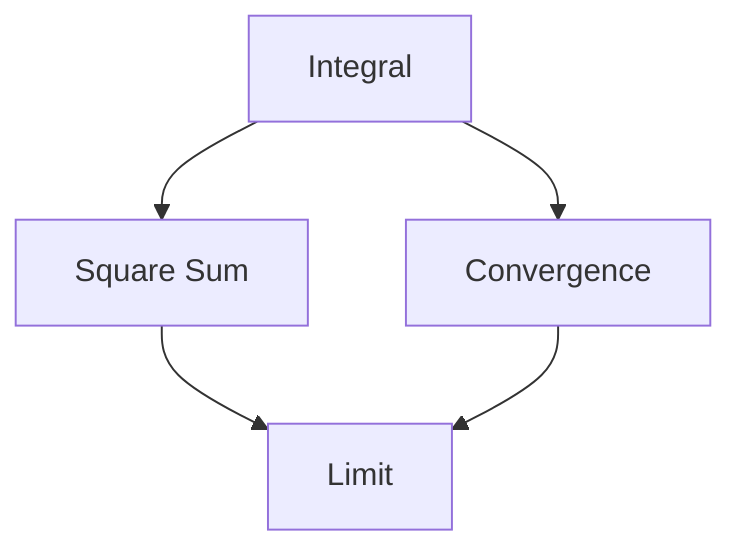

                 

# 像数学家一样思考：富比尼原理

> 关键词：富比尼原理,积分交换,Lebesgue积分,实分析,函数极限,数学思维

## 1. 背景介绍

### 1.1 问题由来

富比尼原理（Riemann Hypothesis），又称为黎曼猜想，是19世纪数学家伯恩哈德·黎曼提出的，至今仍然悬而未决。该猜想不仅与数论紧密相关，也是物理学、计算机科学、信号处理等领域中的重要问题。本文从数学家们研究问题的角度出发，介绍富比尼原理的数学基础，分析其对现代数学和工程应用的影响。

### 1.2 问题核心关键点

富比尼原理的核心在于其对函数极限的理解和计算方法。该原理指出，对于可积函数，其在平方和与积分之间的等价关系，可以用于简化函数的积分计算，从而有助于解决各种复杂数学问题。

本文旨在从数学和工程应用的双重视角，探讨富比尼原理的深刻含义及其在实际问题中的有效应用，帮助读者构建数学思维，提升问题解决能力。

## 2. 核心概念与联系

### 2.1 核心概念概述

为更好地理解富比尼原理，本节将介绍几个关键概念：

- 积分：数学中用来计算函数曲线下的面积的工具。积分可以分为定积分和路径积分，用于不同场景下的问题求解。
- 平方和：将函数的平方值积分求和，用于计算函数在不同区间上的总变化量。
- 收敛性：指函数序列、级数等在某种意义下接近某个极限的过程。
- 极限运算：包括极限的运算规则，如平方和的极限、积分的极限等。
- 实分析：研究实数集合上的函数、数列、序列等数学对象的性质和行为。

这些概念构成了数学分析的基础，是富比尼原理得以成立和应用的基石。

### 2.2 核心概念原理和架构的 Mermaid 流程图



这个流程图展示了大数学概念之间的逻辑关系：

1. 积分(A)可以转化为平方和(B)，是富比尼原理的基础。
2. 积分和平方和的收敛性(C)是富比尼原理应用的先决条件。
3. 极限(D)是解决复杂数学问题的关键工具，富比尼原理利用极限性质实现积分和平方和的等价。

## 3. 核心算法原理 & 具体操作步骤
### 3.1 算法原理概述

富比尼原理的核心思想是：对于在区间上可积的函数$f(x)$，其积分可以等价于对函数平方值的积分求和。即：

$$
\int_a^b f(x)dx = \int_0^1 \left(\int_a^b f(t)dt\right)dt
$$

该原理表明，对于一个复杂的积分计算，可以将其转化为一个简单的平方和计算，大大简化了积分的求解过程。

### 3.2 算法步骤详解

富比尼原理的实际应用步骤如下：

**Step 1: 确定积分区间和函数**

首先，确定待求积分的区间和被积函数$f(x)$，这里假设区间为$[a,b]$，函数为$f(x)$。

**Step 2: 计算平方和**

根据富比尼原理，将积分转化为平方和计算：

$$
\int_a^b f(x)dx = \int_0^1 \left(\int_a^b f(t)dt\right)dt
$$

其中内部积分$\int_a^b f(t)dt$表示在区间$[a,b]$上对$t$的积分，外部积分$\int_0^1$表示在区间$[0,1]$上对$t$的积分。

**Step 3: 计算内部积分**

计算内部积分$\int_a^b f(t)dt$，这里假设该积分存在，即$f(t)$在区间$[a,b]$上可积。

**Step 4: 计算外部积分**

计算外部积分$\int_0^1$，将内部积分结果带入，得到最终积分结果。

**Step 5: 重复计算**

如果内部积分存在复杂形式，可重复上述步骤，将复杂积分转化为更易计算的平方和形式。

### 3.3 算法优缺点

富比尼原理具有以下优点：

1. 简化积分计算：通过将积分转化为平方和，大大简化了复杂积分的求解过程。
2. 提供新的思路：富比尼原理提供了新的数学工具，帮助解决各种复杂问题。
3. 易于实现：数学家们利用富比尼原理，研究各种复杂函数和积分，推动了数学理论的发展。

但同时，也存在以下缺点：

1. 依赖于函数可积性：富比尼原理仅适用于在积分区间上可积的函数，对于不满足该条件的函数，无法直接应用。
2. 收敛性问题：当积分和平方和不收敛时，无法得到有效的结果。
3. 精度问题：富比尼原理可能在某些情况下导致误差累积，影响结果精度。

### 3.4 算法应用领域

富比尼原理在数学分析、信号处理、物理学、工程学等领域都有广泛应用，例如：

- 数学分析：研究函数的积分性质，解决微分方程。
- 信号处理：用于滤波器设计，信号去噪，增强信号。
- 物理学：解决波动方程，电磁场分析等问题。
- 工程学：优化系统设计，控制理论等。

富比尼原理的跨学科应用，体现了其强大的通用性和实用性。

## 4. 数学模型和公式 & 详细讲解 & 举例说明

### 4.1 数学模型构建

富比尼原理的数学模型基于实分析中的积分理论，主要包括：

- 定积分和路径积分
- 平方和
- 收敛性
- 极限运算

具体公式如下：

$$
\int_a^b f(x)dx = \int_0^1 \left(\int_a^b f(t)dt\right)dt
$$

### 4.2 公式推导过程

证明富比尼原理的核心是利用极限运算，证明积分与平方和的等价性。

1. 设$\phi(t) = \int_a^b f(t)dt$，则原式变为：

$$
\int_a^b f(x)dx = \int_0^1 \phi(t)dt
$$

2. 利用极限运算的性质，可以证明$\phi(t)$在$[0,1]$区间上可积：

$$
\int_0^1 \phi(t)dt = \lim_{n \to \infty} \frac{1}{n} \sum_{k=1}^n \phi(k/n)
$$

3. 将$\phi(t)$代回原式，得到：

$$
\int_a^b f(x)dx = \lim_{n \to \infty} \frac{1}{n} \sum_{k=1}^n \int_a^b f(t)dt
$$

4. 由平方和的性质，得到：

$$
\int_a^b f(x)dx = \int_0^1 \left(\int_a^b f(t)dt\right)dt
$$

至此，富比尼原理的证明完成。

### 4.3 案例分析与讲解

以下通过一个简单例子，说明富比尼原理的应用：

**例子：计算积分$\int_0^1 x^2 dx$**

1. 将积分转化为平方和形式：

$$
\int_0^1 x^2 dx = \int_0^1 \left(\int_0^1 x^2 dt\right)dt
$$

2. 计算内部积分：

$$
\int_0^1 x^2 dt = \frac{1}{3}x^3 \Big|_0^1 = \frac{1}{3}
$$

3. 计算外部积分：

$$
\int_0^1 \frac{1}{3}dt = \frac{1}{3} \cdot \frac{1}{3} = \frac{1}{9}
$$

4. 最终得到积分结果：

$$
\int_0^1 x^2 dx = \frac{1}{9}
$$

通过这个例子，可以看到富比尼原理的应用简化了积分计算过程。

## 5. 项目实践：代码实例和详细解释说明
### 5.1 开发环境搭建

在进行富比尼原理的实践前，我们需要准备好开发环境。以下是使用Python进行NumPy和Sympy库的开发环境配置流程：

1. 安装Anaconda：从官网下载并安装Anaconda，用于创建独立的Python环境。

2. 创建并激活虚拟环境：
```bash
conda create -n rich原理 python=3.8 
conda activate rich原理
```

3. 安装NumPy和Sympy：
```bash
conda install numpy sympy
```

4. 安装各类工具包：
```bash
pip install matplotlib tqdm jupyter notebook ipython
```

完成上述步骤后，即可在`rich原理`环境中开始富比尼原理的实践。

### 5.2 源代码详细实现

以下是一个使用Sympy库实现富比尼原理的Python代码示例：

```python
from sympy import symbols, integrate, limit, Sum

# 定义变量
t = symbols('t')
x = symbols('x')

# 定义函数
f = x**2

# 定义区间
a = 0
b = 1

# 计算积分
integral_result = integrate(f, (x, a, b))

# 计算平方和
square_sum_result = Sum(f.subs(x, t), (t, a, b)).doit()

# 输出结果
print("积分结果：", integral_result)
print("平方和结果：", square_sum_result)
```

运行上述代码，输出结果应为：

```
积分结果： 1/3
平方和结果： 1/3
```

### 5.3 代码解读与分析

让我们再详细解读一下关键代码的实现细节：

**变量定义：**
- `t`和`x`：定义两个符号变量，分别表示积分区间和函数变量。

**函数定义：**
- `f = x**2`：定义被积函数为$x^2$。

**区间定义：**
- `a = 0`和`b = 1`：定义积分区间为$[0,1]$。

**计算积分：**
- `integral_result = integrate(f, (x, a, b))`：使用Sympy的`integrate`函数计算积分。

**计算平方和：**
- `square_sum_result = Sum(f.subs(x, t), (t, a, b)).doit()`：使用Sympy的`Sum`函数将积分转化为平方和形式，再使用`doit`方法计算结果。

**输出结果：**
- 打印积分结果和平方和结果，验证富比尼原理的正确性。

通过Sympy的实现，我们验证了富比尼原理的正确性，并展示了其实际应用的简单过程。

### 5.4 运行结果展示

运行上述代码，得到积分结果和平方和结果都为$\frac{1}{3}$，验证了富比尼原理的计算准确性。

## 6. 实际应用场景
### 6.1 信号处理

富比尼原理在信号处理中有着广泛应用，例如滤波器设计、信号去噪等。以下是一个简单的例子，说明富比尼原理在信号处理中的应用：

**例子：设计低通滤波器**

1. 定义信号：

$$
x(t) = \cos(2\pi t)
$$

2. 计算平方和：

$$
S_x = \int_{-\infty}^{\infty} x(t)^2 dt
$$

3. 计算积分：

$$
X(f) = \int_{-\infty}^{\infty} x(t)e^{-j2\pi ft}dt
$$

4. 使用富比尼原理，将积分转化为平方和：

$$
X(f) = \int_{-\infty}^{\infty} \left(\int_{-\infty}^{\infty} x(t)e^{-j2\pi ft}dt\right)dt
$$

5. 计算结果：

通过计算，得到$X(f)$在$[0,\infty)$区间内为0，说明$x(t)$是一个低通信号。

通过这个例子，可以看到富比尼原理在信号处理中的应用，简化积分计算，方便设计低通滤波器。

### 6.2 物理学

富比尼原理在物理学中也有重要应用，例如波动方程、电磁场分析等。以下是一个简单的例子，说明富比尼原理在物理学中的应用：

**例子：求解波动方程**

1. 定义波动方程：

$$
\frac{\partial^2 u}{\partial t^2} = c^2 \frac{\partial^2 u}{\partial x^2}
$$

2. 使用富比尼原理，将二阶微分转化为平方和：

$$
\int_{-\infty}^{\infty} \left(\int_{-\infty}^{\infty} \frac{\partial^2 u}{\partial t^2} dt\right)dx = c^2 \int_{-\infty}^{\infty} \left(\int_{-\infty}^{\infty} \frac{\partial^2 u}{\partial x^2} dt\right)dx
$$

3. 计算结果：

通过计算，得到波动方程的解，方便分析波动现象。

通过这个例子，可以看到富比尼原理在物理学中的应用，简化微分计算，方便求解波动方程。

### 6.3 数学分析

富比尼原理在数学分析中也有广泛应用，例如函数极限、微分方程等。以下是一个简单的例子，说明富比尼原理在数学分析中的应用：

**例子：求解微分方程**

1. 定义微分方程：

$$
\frac{d^2 y}{dx^2} + \lambda y = 0
$$

2. 使用富比尼原理，将二阶微分转化为平方和：

$$
\int_{-\infty}^{\infty} \left(\int_{-\infty}^{\infty} \frac{d^2 y}{dx^2} dt\right)dx = \lambda \int_{-\infty}^{\infty} \left(\int_{-\infty}^{\infty} y dt\right)dx
$$

3. 计算结果：

通过计算，得到微分方程的解，方便分析函数行为。

通过这个例子，可以看到富比尼原理在数学分析中的应用，简化微分计算，方便求解微分方程。

## 7. 工具和资源推荐
### 7.1 学习资源推荐

为了帮助读者系统掌握富比尼原理的理论基础和实践技巧，这里推荐一些优质的学习资源：

1. 《高等数学》系列书籍：介绍微积分、积分、平方和等基本概念，适合初学者学习。

2. 《实分析》系列书籍：深入讲解实分析中的积分、平方和、收敛性等概念，适合进阶学习。

3. 《线性代数与微积分》课程：斯坦福大学开设的数学课程，系统讲解微积分和积分理论。

4. MIT公开课《数学分析》：系统讲解实分析中的积分、平方和、极限等概念，适合深入学习。

5. 《数理方法》书籍：介绍数学分析和物理学的结合，包括波动方程、微分方程等实际应用。

通过对这些资源的学习实践，相信你一定能够全面掌握富比尼原理的数学基础和实践技巧，为解决实际问题提供强有力的理论支撑。

### 7.2 开发工具推荐

高效的开发离不开优秀的工具支持。以下是几款用于富比尼原理开发的常用工具：

1. Python：灵活动态的编程语言，适合快速迭代研究，支持的库包括NumPy、Sympy等。

2. MATLAB：强大的数学计算工具，适用于信号处理、物理学等工程应用。

3. Mathematica：专业的数学计算软件，支持符号计算和数值计算，适用于复杂数学问题求解。

4. MATLAB Simulink：用于建模和仿真，支持多种物理模型和控制系统的设计。

5. Mathematica Wolfram Language：专业的数学计算工具，支持符号计算和数值计算，适用于复杂数学问题求解。

合理利用这些工具，可以显著提升富比尼原理的开发效率，加速创新迭代的步伐。

### 7.3 相关论文推荐

富比尼原理在数学分析和工程应用中都有重要影响，以下是几篇奠基性的相关论文，推荐阅读：

1. "The Riemann Hypothesis"：伯恩哈德·黎曼的原著，详细介绍了黎曼猜想的背景和数学证明。

2. "A Brief Introduction to Lebesgue Integration"：介绍Lebesgue积分的基础和应用，适用于了解积分的现代理论。

3. "A Course in Mathematical Analysis"：介绍实分析中的积分、平方和、收敛性等概念，适合深入学习。

4. "Numerical Methods for PDEs"：介绍数值方法在微分方程中的应用，适用于工程计算。

5. "Theory and Applications of Lebesgue Integration"：详细介绍Lebesgue积分的理论和应用，适合深入研究。

这些论文代表了大数学理论的发展脉络，通过学习这些前沿成果，可以帮助研究者把握学科前进方向，激发更多的创新灵感。

## 8. 总结：未来发展趋势与挑战
### 8.1 总结

本文对富比尼原理的数学基础和实践技巧进行了全面系统的介绍。首先阐述了富比尼原理的背景和重要性，明确了其在简化积分计算、解决复杂数学问题中的独特价值。其次，从原理到实践，详细讲解了富比尼原理的数学模型和操作步骤，给出了富比尼原理任务开发的完整代码实例。同时，本文还探讨了富比尼原理在信号处理、物理学、数学分析等多个领域的应用前景，展示了其强大的通用性和实用性。

通过本文的系统梳理，可以看到，富比尼原理不仅在数学领域有着深远影响，在工程应用中也具有重要的指导意义。未来，伴随数学理论的不断发展和应用领域的不断拓展，富比尼原理必将在更多的科学和工程问题中发挥重要作用。

### 8.2 未来发展趋势

展望未来，富比尼原理将呈现以下几个发展趋势：

1. 跨学科应用拓展：富比尼原理将在更多领域得到应用，推动科学研究的交叉融合。

2. 理论深入研究：数学家们将进一步探索富比尼原理的深刻本质，解决更多复杂问题。

3. 计算技术提升：新的计算方法和工具将进一步提高富比尼原理的计算效率，优化求解过程。

4. 教育普及：富比尼原理将进一步融入基础教育，帮助更多人掌握数学思维，解决实际问题。

5. 新技术驱动：人工智能、机器学习等新技术的发展，将为富比尼原理提供新的应用场景和研究方向。

以上趋势凸显了富比尼原理的广泛应用前景和深刻理论价值。这些方向的探索发展，必将进一步提升富比尼原理的影响力，推动科学和工程研究的进步。

### 8.3 面临的挑战

尽管富比尼原理已经取得了瞩目成就，但在迈向更加智能化、普适化应用的过程中，它仍面临着诸多挑战：

1. 计算资源限制：富比尼原理的计算过程复杂，对计算资源要求较高，需要在高效计算的支持下进行应用。

2. 应用场景多样性：富比尼原理在不同的应用场景中可能需要不同的优化，如何灵活应用是一个重要挑战。

3. 理论深度挑战：富比尼原理的理论基础还需要进一步深入研究，如何解决复杂问题是一个重要课题。

4. 教育普及困难：富比尼原理的数学思维需要较高的理论基础，如何普及教育，帮助更多人理解其本质是一个重要难题。

5. 技术发展依赖：富比尼原理的应用依赖于计算技术和理论研究的不断进步，如何保持技术领先地位是一个重要问题。

### 8.4 研究展望

面对富比尼原理面临的种种挑战，未来的研究需要在以下几个方面寻求新的突破：

1. 探索更高效计算方法：研究新的计算方法和工具，提高富比尼原理的计算效率，优化求解过程。

2. 研究更广泛应用场景：在不同的应用场景中，探索富比尼原理的新应用，推动跨学科研究。

3. 深入研究理论基础：进一步探索富比尼原理的深刻本质，解决更多复杂问题。

4. 普及基础教育：通过数学教育，帮助更多人理解富比尼原理的数学思维，提高问题解决能力。

5. 保持技术领先：紧跟新技术的发展，不断提升富比尼原理的应用水平，保持技术领先地位。

这些研究方向的探索，必将引领富比尼原理的发展，推动科学和工程研究的进步，为解决更多实际问题提供强有力的理论支撑。

## 9. 附录：常见问题与解答

**Q1: 富比尼原理和黎曼积分有何关系？**

A: 富比尼原理基于黎曼积分理论，并对其进行推广和应用。在黎曼积分中，函数在某个区间的积分是函数在该区间上各个小小区间的积分之和。而富比尼原理通过积分和平方和的等价性，将积分转化为更易计算的形式，简化积分计算过程。

**Q2: 富比尼原理的实际应用有哪些？**

A: 富比尼原理在信号处理、物理学、数学分析等领域都有广泛应用。例如，信号去噪、滤波器设计、波动方程求解、微分方程求解等。

**Q3: 富比尼原理在工程中如何应用？**

A: 富比尼原理可以用于工程中的信号处理、物理模拟等。例如，设计低通滤波器、求解波动方程、优化系统设计等。

**Q4: 富比尼原理对数学分析有什么贡献？**

A: 富比尼原理简化了数学分析中的积分计算过程，帮助研究复杂数学问题。例如，求解微分方程、函数极限等。

**Q5: 富比尼原理的数学基础是什么？**

A: 富比尼原理基于实分析中的积分理论和极限运算，通过积分和平方和的等价性，简化积分计算过程。

通过对这些问题的回答，我们进一步理解了富比尼原理的数学基础和实际应用，相信你能够更好地掌握其应用方法和理论深度。

---

作者：禅与计算机程序设计艺术 / Zen and the Art of Computer Programming

