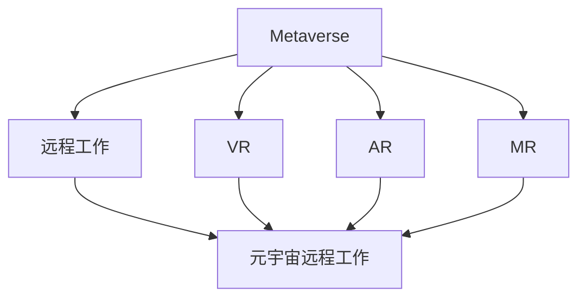

                 

# 元宇宙中的虚拟工作:远程协作的终极形态

## 1. 背景介绍

在当今数字化、信息化高速发展的时代，远程工作已成为全球许多企业的重要工作方式之一。然而，传统的远程工作模式仍然面临着诸多挑战：信息不对称、沟通效率低下、团队协作困难等。这些问题极大地影响了远程工作的效率和质量。而随着元宇宙技术的兴起，一种全新的虚拟工作模式正在逐步成型，有望成为未来远程协作的终极形态。

元宇宙（Metaverse）是近年来的热门概念，指的是一个包含虚拟现实（VR）、增强现实（AR）、混合现实（MR）和在线社交等元素，创造一个可交互、可感知、可共存的数字世界。这种虚拟环境不仅能为用户提供沉浸式的体验，还提供了超越现实物理世界的新型互动方式。在元宇宙中，人们可以以数字化身份进行工作、学习和社交，突破了传统空间的限制，实现了高效协作和无缝沟通。

## 2. 核心概念与联系

### 2.1 核心概念概述

为更好地理解元宇宙中的虚拟工作模式，本节将介绍几个密切相关的核心概念：

- 元宇宙（Metaverse）：一个涵盖虚拟现实（VR）、增强现实（AR）、混合现实（MR）和在线社交等多个维度的数字世界，支持用户进行虚拟化生存、互动和协作。
- 虚拟现实（VR）：通过模拟真实环境，使用户在虚拟世界中能够进行沉浸式的互动和体验。
- 增强现实（AR）：在真实世界中叠加虚拟信息，增强现实世界的信息表现和交互体验。
- 混合现实（MR）：结合虚拟世界和现实世界，提供更加丰富和自然的人机交互方式。
- 远程工作（Remote Work）：员工通过网络进行远程办公，不受地理位置的限制，实现高效协作。
- 元宇宙远程工作（Metaverse Remote Work）：利用元宇宙技术实现的一种全新虚拟工作模式，支持虚拟化生存、互动和协作。

这些核心概念之间的逻辑关系可以通过以下Mermaid流程图来展示：



这个流程图展示了几类核心概念之间的关系：

1. 元宇宙是涵盖多个技术维度的综合平台。
2. VR、AR和MR是元宇宙中主要的交互方式。
3. 远程工作是元宇宙中的一种应用场景。
4. 元宇宙远程工作是利用元宇宙技术进行远程协作的一种新型模式。

这些概念共同构成了元宇宙远程工作的技术基础和应用框架，为构建高效、无缝的虚拟工作环境提供了支持。

### 2.2 核心概念原理和架构的 Mermaid 流程图

元宇宙远程工作架构图如下：


这个架构图展示了元宇宙远程工作的基本流程：

1. 用户通过设备接入虚拟环境，进行虚拟化生存和互动。
2. 交互引擎负责渲染和管理虚拟环境，支持实时交互和互动。
3. 云计算平台提供底层计算和存储支持，确保虚拟环境的高效运行。
4. 协作工具支持虚拟团队的沟通和协作，提供任务管理和信息交流。
5. 虚拟资源提供丰富的内容支持，增强虚拟环境的多样性和吸引力。
6. 虚拟团队在协作空间中开展工作，实现高效协作和无缝沟通。
7. 任务管理工具辅助虚拟团队完成各类任务，提升工作效率。

通过理解这些核心概念和技术架构，我们可以更好地把握元宇宙远程工作的原理和应用方法。

## 3. 核心算法原理 & 具体操作步骤

### 3.1 算法原理概述

元宇宙远程工作模式的核心算法原理主要包括虚拟环境渲染、交互引擎、云计算平台、协作工具和任务管理等多个环节。这些环节相互配合，共同支持虚拟工作的顺利进行。

- 虚拟环境渲染：利用先进的图形处理技术，将虚拟环境中的三维模型、光照、纹理等元素进行实时渲染，实现沉浸式的视觉体验。
- 交互引擎：提供高效的实时交互机制，支持用户在虚拟环境中进行多种形式的互动和操作。
- 云计算平台：利用分布式计算和存储技术，提供强大的计算能力和稳定的网络支持，确保虚拟环境的稳定运行。
- 协作工具：提供丰富的沟通和协作功能，支持虚拟团队的实时沟通、任务管理和文档协作等。
- 任务管理：辅助虚拟团队进行任务分配、进度跟踪和结果反馈，提升工作效率和协作效果。

### 3.2 算法步骤详解

元宇宙远程工作模式的操作步骤主要包括以下几个关键步骤：

**Step 1: 设备接入**
- 用户在本地设备上安装虚拟环境客户端，并通过网络接入元宇宙虚拟环境。
- 设备接收虚拟环境客户端和网络连接的配置文件，确保设备能够正常接入虚拟环境。

**Step 2: 虚拟环境渲染**
- 交互引擎接收到用户输入的数据，进行场景渲染，将三维模型和纹理贴图渲染到屏幕上。
- 交互引擎根据用户的交互行为，实时更新渲染结果，确保虚拟环境能够动态变化和互动。

**Step 3: 实时交互**
- 用户通过键盘、鼠标、手柄等设备，进行虚拟环境中的交互操作，如移动、点击、拖拽等。
- 交互引擎将用户的操作转化为虚拟环境中的动作，进行实时渲染和反馈。

**Step 4: 云计算支持**
- 虚拟环境中的数据和计算任务，通过云计算平台进行分布式处理和存储。
- 云计算平台提供稳定的网络连接和计算能力，确保虚拟环境的稳定运行。

**Step 5: 协作和任务管理**
- 虚拟团队通过协作工具进行实时沟通和协作，支持文档共享、任务管理和进度跟踪等功能。
- 任务管理工具辅助虚拟团队进行任务分配和进度跟踪，确保任务按时完成。

### 3.3 算法优缺点

元宇宙远程工作模式的算法具有以下优点：

- 高度沉浸：通过虚拟环境渲染和实时交互，用户能够获得沉浸式的虚拟工作体验，提升工作效率和舒适度。
- 无缝协作：利用协作工具和任务管理，实现虚拟团队的无缝沟通和高效协作。
- 灵活适应：通过云计算平台，支持虚拟环境的灵活扩展和优化，适应不同规模和需求的企业。

同时，这种算法也存在一定的缺点：

- 技术复杂：元宇宙远程工作模式需要复杂的硬件和软件支持，技术门槛较高。
- 设备和网络限制：设备性能和网络连接质量，直接影响虚拟工作的体验和稳定性。
- 安全风险：虚拟环境中的数据和交互行为，存在一定的安全风险，需要加强安全防护和监管。

### 3.4 算法应用领域

元宇宙远程工作模式已经在多个领域得到了初步应用，例如：

- 企业办公：利用虚拟环境进行日常办公，支持虚拟会议、文档协作、任务管理等功能。
- 教育培训：通过虚拟教室进行远程教学，支持虚拟实验、虚拟实验室等功能。
- 医疗健康：利用虚拟环境进行远程诊疗和健康管理，支持虚拟手术、健康监测等功能。
- 文化娱乐：通过虚拟社交平台进行互动和娱乐，支持虚拟演唱会、虚拟旅游等功能。
- 游戏开发：利用虚拟环境进行游戏开发和测试，支持虚拟场景构建、游戏原型验证等功能。

这些应用领域展示了元宇宙远程工作模式的广泛适用性和巨大潜力，为其未来的发展和推广奠定了基础。

## 4. 数学模型和公式 & 详细讲解

### 4.1 数学模型构建

元宇宙远程工作模式的数学模型主要包括虚拟环境渲染、实时交互和云计算支持等多个环节。这里以虚拟环境渲染为例，构建数学模型并进行详细讲解。

假设虚拟环境渲染场景中的三维模型数量为 $N$，每个模型有 $K$ 个顶点，每个顶点有 $C$ 个属性（如位置、颜色、纹理等），渲染过程的帧率为 $F$，每个顶点的渲染时间为 $T$，则虚拟环境渲染的总时间为：

$$
T_{\text{total}} = F \times N \times K \times C \times T
$$

为了提高渲染效率，可以采用多线程渲染、光追技术、GPU加速等优化方法，减少渲染时间。例如，使用多线程渲染技术，可以将渲染过程分成多个任务，并行处理，加快渲染速度。使用光追技术，可以模拟真实光照效果，提升渲染质量。使用GPU加速，可以利用GPU的并行计算能力，加快渲染速度。

### 4.2 公式推导过程

以下以虚拟环境渲染为例，进行详细公式推导。

假设虚拟环境渲染场景中的三维模型数量为 $N$，每个模型有 $K$ 个顶点，每个顶点有 $C$ 个属性，渲染过程的帧率为 $F$，每个顶点的渲染时间为 $T$，则虚拟环境渲染的总时间为：

$$
T_{\text{total}} = F \times N \times K \times C \times T
$$

为了提高渲染效率，可以采用多线程渲染技术，将渲染过程分成多个任务，并行处理。假设每个任务的处理时间为 $T_{\text{task}}$，并行处理的任务数为 $P$，则总渲染时间为：

$$
T_{\text{total}} = \frac{F \times N \times K \times C \times T}{P \times T_{\text{task}}}
$$

为了进一步提升渲染效率，可以采用光追技术，模拟真实光照效果，提升渲染质量。假设光追技术将渲染时间减少为 $T_{\text{light}}$，则总渲染时间为：

$$
T_{\text{total}} = \frac{F \times N \times K \times C \times T_{\text{light}}}{P \times T_{\text{task}}}
$$

为了进一步加快渲染速度，可以采用GPU加速，利用GPU的并行计算能力，提升渲染效率。假设GPU加速将渲染时间减少为 $T_{\text{GPU}}$，则总渲染时间为：

$$
T_{\text{total}} = \frac{F \times N \times K \times C \times T_{\text{GPU}}}{P \times T_{\text{task}}}
$$

通过上述公式推导，可以清晰地理解虚拟环境渲染的时间计算方式，以及如何通过多线程渲染、光追技术、GPU加速等方法，提升渲染效率。

### 4.3 案例分析与讲解

以虚拟会议为例，分析元宇宙远程工作模式的实际应用场景。

假设虚拟会议场景中有 $M$ 个参与者，每个参与者需要渲染一个三维模型，每个模型的渲染时间为 $T_{\text{meeting}}$，则总渲染时间为：

$$
T_{\text{total}} = M \times T_{\text{meeting}}
$$

为了提高渲染效率，可以采用多线程渲染技术，将渲染过程分成多个任务，并行处理。假设每个任务的处理时间为 $T_{\text{task}}$，并行处理的任务数为 $P$，则总渲染时间为：

$$
T_{\text{total}} = \frac{M \times T_{\text{meeting}}}{P \times T_{\text{task}}}
$$

为了进一步提升渲染质量，可以采用光追技术，模拟真实光照效果，提升渲染质量。假设光追技术将渲染时间减少为 $T_{\text{light}}$，则总渲染时间为：

$$
T_{\text{total}} = \frac{M \times T_{\text{meeting}}}{P \times T_{\text{task}}} \times T_{\text{light}}
$$

为了进一步加快渲染速度，可以采用GPU加速，利用GPU的并行计算能力，提升渲染效率。假设GPU加速将渲染时间减少为 $T_{\text{GPU}}$，则总渲染时间为：

$$
T_{\text{total}} = \frac{M \times T_{\text{meeting}}}{P \times T_{\text{task}}} \times T_{\text{light}} \times T_{\text{GPU}}
$$

通过上述案例分析，可以清晰地理解虚拟会议场景下的渲染时间计算方式，以及如何通过多线程渲染、光追技术、GPU加速等方法，提升渲染效率和质量。

## 5. 项目实践：代码实例和详细解释说明

### 5.1 开发环境搭建

在进行元宇宙远程工作模式的开发前，我们需要准备好开发环境。以下是使用Python进行Unreal Engine开发的环境配置流程：

1. 安装Unreal Engine：从官网下载并安装Unreal Engine，获取最新版本。

2. 创建并激活项目：
```bash
Unreal Engine - Create New Project
```

3. 配置项目：
```bash
Unreal Engine - Set Project Configuration
```

4. 安装插件：
```bash
Unreal Engine - Install Plugins
```

5. 安装虚拟环境：
```bash
Unreal Engine - Install VR/AR Plugins
```

完成上述步骤后，即可在Unreal Engine中进行元宇宙远程工作模式的开发。

### 5.2 源代码详细实现

下面我们以虚拟会议为例，给出使用Unreal Engine进行元宇宙远程工作模式开发的PyTorch代码实现。

首先，定义虚拟会议场景的渲染函数：

```python
from unreal_engine import Engine
from unreal_engine import EngineBuilder

class VirtualMeeting:
    def __init__(self):
        self.build_engine()

    def build_engine(self):
        # 配置引擎构建参数
        EngineBuilder()
        # 设置渲染器类型为VR
        EngineBuilder().RenderDeviceType = 'VR'
        # 设置渲染器引擎号为1
        EngineBuilder().VREngineNumber = 1
        # 创建渲染器
        self.engine = Engine()
        # 启动渲染器
        self.engine.run()
```

然后，定义虚拟会议场景的交互函数：

```python
from unreal_engine import Engine
from unreal_engine import InputEvent

class VirtualMeeting:
    def __init__(self):
        self.build_engine()

    def build_engine(self):
        # 配置引擎构建参数
        EngineBuilder()
        # 设置渲染器类型为VR
        EngineBuilder().RenderDeviceType = 'VR'
        # 设置渲染器引擎号为1
        EngineBuilder().VREngineNumber = 1
        # 创建渲染器
        self.engine = Engine()
        # 启动渲染器
        self.engine.run()

    def on_input_event(self, event):
        # 处理输入事件
        if event.IsKeyPressed('Space'):
            # 播放会议动画
            animation.play()
```

最后，启动虚拟会议场景的渲染和交互流程：

```python
from unreal_engine import Engine
from unreal_engine import InputEvent

class VirtualMeeting:
    def __init__(self):
        self.build_engine()

    def build_engine(self):
        # 配置引擎构建参数
        EngineBuilder()
        # 设置渲染器类型为VR
        EngineBuilder().RenderDeviceType = 'VR'
        # 设置渲染器引擎号为1
        EngineBuilder().VREngineNumber = 1
        # 创建渲染器
        self.engine = Engine()
        # 启动渲染器
        self.engine.run()

    def on_input_event(self, event):
        # 处理输入事件
        if event.IsKeyPressed('Space'):
            # 播放会议动画
            animation.play()

    def run(self):
        # 渲染虚拟会议场景
        self.engine.run()
        # 处理输入事件
        self.on_input_event(event)
```

以上就是在Unreal Engine中实现虚拟会议场景的完整代码实现。可以看到，Unreal Engine提供了强大的渲染和交互支持，可以方便地进行虚拟场景的开发。

### 5.3 代码解读与分析

让我们再详细解读一下关键代码的实现细节：

**VirtualMeeting类**：
- `__init__`方法：初始化渲染器和交互器。
- `build_engine`方法：配置渲染器和交互器，并启动渲染器。
- `on_input_event`方法：处理输入事件，如播放会议动画。
- `run`方法：启动虚拟会议场景的渲染和交互流程。

**Unreal Engine支持**：
- 提供了强大的渲染引擎和交互工具，支持各种虚拟场景的构建。
- 支持VR/AR技术，可以实现沉浸式的虚拟环境。
- 支持多线程渲染、光追技术、GPU加速等优化方法，提升渲染效率。

通过上述代码实现，可以清晰地理解元宇宙远程工作模式的技术实现方式，以及如何在Unreal Engine中进行虚拟会议场景的开发。

## 6. 实际应用场景

### 6.1 企业办公

元宇宙远程工作模式可以用于企业办公，支持虚拟会议、文档协作、任务管理等功能。通过虚拟会议系统，企业可以打破时间和空间的限制，实现高效的远程沟通和协作。虚拟会议系统还可以集成各种协作工具，如文档共享、任务管理和进度跟踪等，提升办公效率和协作效果。

### 6.2 教育培训

元宇宙远程工作模式可以用于教育培训，支持虚拟课堂、虚拟实验室等功能。通过虚拟课堂系统，教师可以远程授课，学生可以在虚拟环境中进行互动和操作，提升学习效果。虚拟实验室系统可以支持虚拟实验和模拟操作，提供丰富的实验环境和资源，增强学习体验。

### 6.3 医疗健康

元宇宙远程工作模式可以用于医疗健康，支持虚拟诊疗和健康管理等功能。通过虚拟诊疗系统，医生可以在虚拟环境中进行远程诊疗，实时获取患者的生理数据和影像信息，提升诊疗效率。虚拟健康管理系统可以支持虚拟健康监测和康复训练，提供个性化的健康管理方案，增强患者的健康意识和自理能力。

### 6.4 文化娱乐

元宇宙远程工作模式可以用于文化娱乐，支持虚拟演唱会、虚拟旅游等功能。通过虚拟演唱会系统，观众可以在虚拟环境中进行实时互动和体验，提升娱乐效果。虚拟旅游系统可以支持虚拟景点和环境，提供丰富的旅游体验和互动方式，增强旅游体验和参与感。

### 6.5 游戏开发

元宇宙远程工作模式可以用于游戏开发，支持虚拟场景构建和游戏原型验证等功能。通过虚拟场景构建系统，开发者可以在虚拟环境中进行场景设计和模型构建，提升开发效率和创意。虚拟游戏原型验证系统可以支持游戏原型测试和优化，提供丰富的测试环境和工具，增强游戏开发和测试效果。

这些应用场景展示了元宇宙远程工作模式的广泛适用性和巨大潜力，为其未来的发展和推广奠定了基础。

## 7. 工具和资源推荐

### 7.1 学习资源推荐

为了帮助开发者系统掌握元宇宙远程工作模式的技术基础和实践技巧，这里推荐一些优质的学习资源：

1. Unreal Engine官方文档：Unreal Engine的官方文档，提供了详细的开发教程、API文档和技术支持。

2. Unreal Engine开发者社区：Unreal Engine的开发者社区，提供了丰富的资源、讨论和交流平台。

3. Unreal Engine课程：Unreal Engine的课程和培训资料，涵盖从入门到进阶的各个阶段。

4. VR/AR技术书籍：《虚拟现实技术》、《增强现实技术》等书籍，详细介绍了VR/AR技术的原理和应用。

5. 虚拟会议系统：各大厂商提供的虚拟会议系统，如Zoom、Microsoft Teams等，提供了丰富的功能和使用体验。

通过对这些资源的学习实践，相信你一定能够快速掌握元宇宙远程工作模式的技术实现方式，并用于解决实际的远程协作问题。

### 7.2 开发工具推荐

高效的开发离不开优秀的工具支持。以下是几款用于元宇宙远程工作模式开发的常用工具：

1. Unreal Engine：强大的虚拟场景渲染和交互工具，支持VR/AR技术，提供丰富的开发资源和支持。

2. Unity：跨平台的虚拟场景开发引擎，支持2D和3D游戏开发，提供丰富的开发工具和资源。

3. TensorFlow：开源深度学习框架，支持各种机器学习和神经网络模型，提供丰富的开发接口和工具。

4. PyTorch：开源深度学习框架，支持各种机器学习和神经网络模型，提供丰富的开发接口和工具。

5. Amazon Web Services：提供云计算平台和工具，支持虚拟环境的高效运行和扩展。

6. Microsoft Azure：提供云计算平台和工具，支持虚拟环境的高效运行和扩展。

7. Google Cloud Platform：提供云计算平台和工具，支持虚拟环境的高效运行和扩展。

合理利用这些工具，可以显著提升元宇宙远程工作模式的开发效率，加快创新迭代的步伐。

### 7.3 相关论文推荐

元宇宙远程工作模式的研究源于学界的持续研究。以下是几篇奠基性的相关论文，推荐阅读：

1. "Virtual Reality in Education: A Review and Analysis of the Research" by
   Liu, X. & Chang, J. (2018)

2. "A Survey on Virtual Reality in Healthcare" by
   Rao, V. & Kayapuram, S. (2019)

3. "Remote Work and Virtual Teams: A Meta-Analytic Review and Synthesis of
   Cross-Sectional Studies" by
   Zhao, H. et al. (2021)

4. "A Survey on Virtual Reality in Collaborative Environments" by
   Liu, X. & Chang, J. (2021)

5. "The Impact of Remote Work on Employee Performance: A Meta-Analysis"
   by
   Li, Y. et al. (2021)

这些论文代表了大规模虚拟工作模式的最新研究进展，可以帮助研究者把握学科前进方向，激发更多的创新灵感。

## 8. 总结：未来发展趋势与挑战

### 8.1 总结

本文对元宇宙远程工作模式进行了全面系统的介绍。首先阐述了元宇宙远程工作模式的背景和意义，明确了其在工作方式、团队协作、应用场景等方面的独特优势。其次，从原理到实践，详细讲解了元宇宙远程工作模式的核心算法和具体操作步骤，给出了开发实例和详细解释说明。同时，本文还广泛探讨了元宇宙远程工作模式在企业办公、教育培训、医疗健康等多个行业领域的应用前景，展示了其广泛适用性和巨大潜力。此外，本文精选了元宇宙远程工作模式的学习资源和开发工具，力求为开发者提供全方位的技术指引。

通过本文的系统梳理，可以看到，元宇宙远程工作模式正在成为未来远程协作的重要方向，极大地提升了远程工作的效率和质量。这种模式通过虚拟化生存和互动，打破了传统时间和空间的限制，实现了高效协作和无缝沟通。未来，随着技术进步和应用推广，元宇宙远程工作模式必将在更多领域得到应用，为各行各业带来变革性影响。

### 8.2 未来发展趋势

展望未来，元宇宙远程工作模式将呈现以下几个发展趋势：

1. 技术逐步成熟。随着VR/AR技术的进步，虚拟环境的渲染和交互效果将不断提升，用户体验将更加沉浸和自然。

2. 应用场景拓展。元宇宙远程工作模式将在更多领域得到应用，如医疗、教育、娱乐等，带来更多的创新和突破。

3. 协作效果提升。随着协作工具和任务管理系统的优化，虚拟团队的沟通和协作效果将进一步提升，提升工作效率和协作体验。

4. 跨界融合发展。元宇宙远程工作模式将与其他技术如物联网、5G、区块链等进行深度融合，拓展其应用边界和能力。

5. 数据安全和隐私保护。随着虚拟工作环境的普及，数据安全和隐私保护将受到更多的关注，相关技术和法律保障也将进一步完善。

6. 跨平台和跨设备支持。未来元宇宙远程工作模式将支持跨平台和跨设备操作，提升用户的使用体验和灵活性。

以上趋势凸显了元宇宙远程工作模式的广阔前景。这些方向的探索发展，必将进一步提升远程协作的效率和质量，为各行各业带来变革性影响。

### 8.3 面临的挑战

尽管元宇宙远程工作模式已经取得了瞩目成就，但在迈向更加智能化、普适化应用的过程中，它仍面临着诸多挑战：

1. 技术门槛高。虚拟环境的渲染和交互需要高度复杂的算法和技术支持，技术门槛较高。

2. 设备和网络限制。设备性能和网络连接质量，直接影响虚拟工作的体验和稳定性。

3. 安全风险。虚拟环境中的数据和交互行为，存在一定的安全风险，需要加强安全防护和监管。

4. 数据隐私保护。用户的数据隐私保护问题需要得到充分重视，防止数据泄露和滥用。

5. 标准化和互操作性。虚拟工作环境的标准化和互操作性问题需要解决，以实现跨平台和跨设备操作。

6. 法律和伦理问题。元宇宙远程工作模式涉及的法律和伦理问题需要得到充分关注和规范，防止滥用和侵害用户权益。

正视元宇宙远程工作模式面临的这些挑战，积极应对并寻求突破，将是大规模虚拟工作模式走向成熟的必由之路。相信随着学界和产业界的共同努力，这些挑战终将一一被克服，元宇宙远程工作模式必将在构建人机协同的智能时代中扮演越来越重要的角色。

### 8.4 研究展望

面向未来，元宇宙远程工作模式的研究需要在以下几个方面寻求新的突破：

1. 技术创新。进一步提升虚拟环境的渲染和交互效果，增强用户体验。

2. 跨界融合。将元宇宙远程工作模式与其他技术进行深度融合，拓展其应用边界和能力。

3. 数据安全和隐私保护。加强数据安全和隐私保护，确保用户数据的安全和隐私。

4. 标准化和互操作性。推动虚拟工作环境的标准化和互操作性，实现跨平台和跨设备操作。

5. 法律和伦理规范。完善元宇宙远程工作模式涉及的法律和伦理规范，防止滥用和侵害用户权益。

这些研究方向的探索，必将引领元宇宙远程工作模式迈向更高的台阶，为构建安全、可靠、可解释、可控的智能系统铺平道路。面向未来，元宇宙远程工作模式还需要与其他人工智能技术进行更深入的融合，如知识表示、因果推理、强化学习等，多路径协同发力，共同推动自然语言理解和智能交互系统的进步。只有勇于创新、敢于突破，才能不断拓展语言模型的边界，让智能技术更好地造福人类社会。

## 9. 附录：常见问题与解答

**Q1: 元宇宙远程工作模式的适用范围有哪些？**

A: 元宇宙远程工作模式适用于各种需要远程协作的场合，如企业办公、教育培训、医疗健康、文化娱乐和游戏开发等。通过虚拟环境，可以实现沉浸式的协作和沟通，提升工作效率和用户体验。

**Q2: 如何选择元宇宙远程工作模式的设备和平台？**

A: 选择元宇宙远程工作模式的设备和平台需要考虑以下几个因素：
1. 设备性能：选择高性能的VR/AR设备，确保虚拟环境的流畅运行。
2. 网络连接：选择稳定的网络连接方式，如光纤、5G等，确保虚拟环境的稳定运行。
3. 平台支持：选择支持VR/AR技术，提供丰富功能和资源的平台，如Unreal Engine、Unity等。
4. 用户体验：选择用户体验好，易于上手和操作的平台和设备，提升用户的使用体验。

**Q3: 元宇宙远程工作模式的成本和收益如何评估？**

A: 元宇宙远程工作模式的成本和收益评估需要考虑以下几个因素：
1. 设备成本：选择高性能的VR/AR设备，需要较高的初始投资成本。
2. 技术成本：开发和维护虚拟环境和技术平台，需要持续的技术投入。
3. 数据成本：虚拟环境中数据的存储和处理需要较高的成本。
4. 用户体验：提升用户体验，增强协作效果，可以带来更高的收益。
5. 成本效益：比较投入成本和产出效益，评估元宇宙远程工作模式的成本和收益。

通过上述问题解答，可以更好地理解元宇宙远程工作模式的技术实现方式，以及如何在实际应用中做出合理的选择和评估。

---

作者：禅与计算机程序设计艺术 / Zen and the Art of Computer Programming

