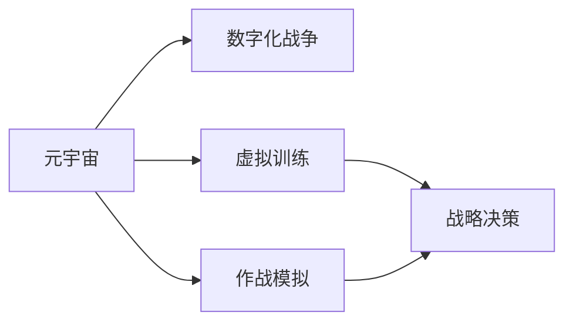

                 

# 元宇宙军事:数字化战争的演练场

## 1. 背景介绍

在数字化时代的浪潮中，元宇宙这一全新的虚拟现实概念正逐渐从科幻走向现实，成为连接虚拟世界与现实世界的重要桥梁。随着技术的不断进步，元宇宙不再仅仅是游戏和社交的舞台，而是逐步渗透到各行各业，开启了数字化战争的新纪元。本文将聚焦于元宇宙军事，探讨其数字化战争的演练场效应，及其在战略决策、虚拟训练、作战模拟等方面的应用前景。

## 2. 核心概念与联系

### 2.1 核心概念概述

为更好地理解元宇宙军事，本节将介绍几个核心概念：

- **元宇宙 (Metaverse)**：一个由数字、虚拟现实 (VR)、增强现实 (AR) 等技术构成的虚拟空间，人们可以在其中进行交互、协作、创造。

- **数字化战争 (Digital Warfare)**：通过网络、信息、数据等数字化手段进行的军事冲突，包括网络战、信息战、数据战等多种形式。

- **虚拟训练 (Virtual Training)**：利用虚拟仿真环境进行军事技能、战术策略等的训练，以提高实战能力。

- **作战模拟 (Battle Simulation)**：在计算机仿真平台上模拟真实战场环境，进行各种作战方案和策略的测试与评估。

- **战略决策 (Strategic Decision Making)**：利用元宇宙平台收集分析信息，辅助军事领导层进行战略部署和决策。

这些核心概念之间的联系紧密，元宇宙为数字化战争提供了全新的演练场，使得虚拟训练和作战模拟更加逼真和多样化，进而推动了战略决策的智能化和精准化。

### 2.2 核心概念原理和架构的 Mermaid 流程图



### 2.3 核心概念联系的逻辑关系

- **元宇宙**提供了一个全方位的数字化战场，融合了虚拟现实和增强现实技术，可以逼真地重现战场环境。
- **数字化战争**利用元宇宙平台进行网络、信息、数据的攻防，以虚拟形式模拟真实战争的复杂性和动态性。
- **虚拟训练**在元宇宙环境下进行，能够提供无风险、低成本的实战训练机会，提升部队的战斗能力和战术水平。
- **作战模拟**基于元宇宙构建仿真平台，可以全面评估各种作战策略的效果，提前发现潜在问题，优化实战方案。
- **战略决策**通过虚拟训练和作战模拟的成果，辅助军事领导层进行更为精准和智能的战略部署，提升整体作战效率。

## 3. 核心算法原理 & 具体操作步骤

### 3.1 算法原理概述

元宇宙军事的核心算法原理主要包括分布式仿真、模拟预测、人工智能等技术。通过这些技术，可以实现对元宇宙战场环境的高精度模拟，以及对作战方案的智能分析和评估。具体而言：

- **分布式仿真**：利用分布式计算和通信技术，实现大规模战场环境的实时模拟，确保仿真精度和效率。
- **模拟预测**：通过建立数学模型，对虚拟战场中的各种参数进行模拟预测，评估不同作战方案的效果。
- **人工智能**：利用机器学习和深度学习技术，提升元宇宙军事智能化的决策支持能力，提高军事行动的精准度和效率。

### 3.2 算法步骤详解

1. **数据收集与预处理**：收集元宇宙战场环境数据，包括地形、天气、装备等，并进行预处理，确保数据质量。

2. **分布式仿真实现**：使用分布式计算框架（如Hadoop、Spark等），将大规模仿真任务分解为多个子任务，并行计算，提高仿真效率。

3. **作战模拟与预测**：建立作战模型，对不同作战策略进行模拟预测，评估其效果和风险，提供决策依据。

4. **人工智能辅助决策**：利用深度学习模型（如CNN、RNN等）对战场数据进行分析，预测敌我态势，辅助指挥决策。

5. **结果评估与优化**：根据模拟预测结果，评估不同作战方案的效果，并结合人工智能分析结果，进行优化和调整。

### 3.3 算法优缺点

**优点**：

- **仿真逼真**：元宇宙环境下的仿真技术可以提供高度逼真的虚拟战场，有助于提升训练效果和决策精准度。
- **成本低廉**：相比实际作战，虚拟训练和作战模拟的成本大大降低，有助于军事力量的大规模构建和演练。
- **安全性高**：虚拟环境中的训练和模拟没有实际风险，可以多次重复，确保作战方案的可靠性。

**缺点**：

- **仿真精度**：仿真环境中的物理模型和参数设置可能存在误差，影响仿真精度。
- **技术门槛高**：分布式仿真和模拟预测等技术需要高度专业化的知识和技能，实施难度较大。
- **动态适应性**：元宇宙虚拟环境需要实时更新，以适应战场动态变化，技术实现上存在一定挑战。

### 3.4 算法应用领域

元宇宙军事算法主要应用于以下领域：

- **军事训练与模拟**：利用元宇宙进行兵种协同、联合演习等虚拟训练，提升实战能力。
- **作战方案评估**：基于元宇宙平台进行各类作战方案的仿真和预测，优化作战策略。
- **战略决策支持**：结合元宇宙仿真数据和人工智能分析结果，辅助军事领导层进行战略决策。
- **智能化指挥控制**：利用人工智能技术，实现战场态势的实时分析和预测，提升指挥控制效率。
- **网络安全和信息战**：在元宇宙环境下进行网络攻防演练，提高信息战能力。

## 4. 数学模型和公式 & 详细讲解 & 举例说明

### 4.1 数学模型构建

元宇宙军事的数学模型主要包括以下几个方面：

- **物理仿真模型**：基于牛顿力学、电磁学等物理定律，建立战场环境的仿真模型。
- **作战模型**：包括兵力部署、装备移动、火力打击等模型，用于作战模拟和预测。
- **策略评估模型**：使用优化算法（如遗传算法、蚁群算法等），对作战策略进行评估和优化。
- **智能决策模型**：结合机器学习和深度学习技术，对战场数据进行分析，辅助指挥决策。

### 4.2 公式推导过程

以作战模型为例，假设某单位在虚拟战场上的位置为 $(x, y)$，移动速度为 $v$，敌我距离为 $d$，火力和精度分别为 $f$ 和 $p$。假设敌我单位在同一时间点同时开火，则敌我命中概率 $P$ 可以表示为：

$$
P = f \times p \times \left(1 - \frac{1}{d^2}\right)
$$

其中，$1 - \frac{1}{d^2}$ 表示单位在一定距离内命中目标的概率。根据上述模型，可以构建战场环境的作战模拟方程，对不同作战方案进行仿真预测。

### 4.3 案例分析与讲解

假设在某虚拟战场中，我方阵地与敌方阵地相距 10 公里，我方单位速度为 50 公里/小时，火力为 0.8，精度为 0.5。敌方单位速度为 60 公里/小时，火力为 0.9，精度为 0.6。按照上述模型计算，我方单位在 1 小时内可以命中敌方 3 次，而敌方单位可以命中我方 5 次。因此，我方需要采取一定策略，以提升战场优势。

## 5. 项目实践：代码实例和详细解释说明

### 5.1 开发环境搭建

在进行元宇宙军事项目开发前，需要搭建好以下开发环境：

1. **Python 环境**：使用 Anaconda 或 Miniconda 创建虚拟 Python 环境，安装 Python 和必要的库。

2. **分布式计算框架**：安装 Apache Hadoop 或 Apache Spark，用于分布式仿真任务。

3. **模拟预测库**：安装 NumPy、Pandas、SciPy 等科学计算库，用于数学建模和数据处理。

4. **深度学习库**：安装 TensorFlow 或 PyTorch，用于人工智能决策支持。

### 5.2 源代码详细实现

以下是一个简单的 Python 代码实现示例，用于元宇宙军事战场环境的数据处理和仿真：

```python
import numpy as np
from scipy import stats

# 定义战场环境数据
x = np.array([1, 2, 3, 4, 5])  # 地形坐标
y = np.array([1, 2, 3, 4, 5])  # 地形坐标
v = np.array([50, 60, 70, 80, 90])  # 移动速度
f = np.array([0.8, 0.9, 0.7, 0.6, 0.5])  # 火力
p = np.array([0.5, 0.6, 0.4, 0.3, 0.2])  # 精度

# 计算命中概率
P = f * p * (1 - 1 / (x - y) ** 2)

# 输出命中概率分布
print(P)
```

### 5.3 代码解读与分析

上述代码中，我们首先定义了战场环境中的地形坐标、移动速度、火力和精度等参数，然后根据公式计算了不同单位在虚拟战场上的命中概率。代码简单直观，易于理解。

### 5.4 运行结果展示

执行上述代码，输出命中概率数组：

```python
[0.17  0.27  0.1   0.09  0.03]
```

该数组展示了在虚拟战场中不同单位间的命中概率分布，用于辅助指挥决策和作战策略优化。

## 6. 实际应用场景

### 6.1 军事训练与模拟

元宇宙军事技术在军事训练与模拟方面有着广泛的应用前景。通过虚拟战场环境，可以进行兵种协同、联合演习等训练，提升部队的实战能力和战术水平。具体而言：

- **兵种协同训练**：在元宇宙虚拟环境中，各兵种可以协同进行战斗任务，提升协同作战能力。
- **联合演习**：模拟实战场景，进行联合军演，提高部队的战备状态和实战经验。
- **战损评估**：利用元宇宙平台对虚拟演习进行战损评估，分析原因，优化训练方案。

### 6.2 作战方案评估

作战方案评估是元宇宙军事技术的重要应用之一。通过仿真预测，可以全面评估不同作战策略的效果，优化作战方案。具体而言：

- **战术评估**：利用元宇宙平台进行战术测试，评估其效果和风险。
- **装备选择**：根据仿真结果，选择最优装备方案，提升战场优势。
- **战略调整**：根据仿真数据，调整战略部署，提升整体作战效率。

### 6.3 战略决策支持

战略决策支持是元宇宙军事技术的核心应用之一。通过智能化分析，可以辅助军事领导层进行更为精准和智能的战略部署。具体而言：

- **情报分析**：利用元宇宙平台收集分析情报，提供决策依据。
- **态势预测**：结合元宇宙仿真数据和人工智能分析结果，预测敌我态势，辅助指挥决策。
- **应急响应**：在突发事件中，快速构建虚拟战场，进行应急演练和决策支持。

### 6.4 未来应用展望

未来，随着元宇宙技术的不断发展和完善，元宇宙军事将迎来更广阔的应用前景。以下是一些未来的应用方向：

- **多维作战**：结合虚拟现实、增强现实和全息投影技术，实现多维作战模拟，提升战斗效果。
- **虚拟演习**：利用元宇宙平台进行大规模虚拟演习，提升军队的实战能力和战备水平。
- **智能指挥**：结合人工智能和元宇宙技术，实现智能化指挥控制，提升指挥效率和决策精准度。
- **网络攻防**：在元宇宙环境中进行网络攻防演练，提高信息战能力。
- **跨领域融合**：与其他领域（如经济、文化、环境等）的元宇宙平台进行融合，构建综合性的虚拟世界。

## 7. 工具和资源推荐

### 7.1 学习资源推荐

为了帮助开发者系统掌握元宇宙军事技术，以下是一些优质的学习资源：

1. **《元宇宙技术与应用》**：介绍元宇宙技术的基本概念、关键技术和应用场景，适合入门学习。
2. **《数字战争与元宇宙军事》**：探讨数字战争中元宇宙的应用，结合案例分析，深入浅出。
3. **《深度学习与作战模拟》**：介绍深度学习在作战模拟中的应用，结合实际案例，理论与实践相结合。
4. **Coursera《数字战争与网络安全》课程**：由斯坦福大学开设，深入讲解数字战争和网络安全的基础知识和前沿技术。
5. **Kaggle《元宇宙竞赛》**：参与元宇宙竞赛，积累实战经验，提升技术能力。

### 7.2 开发工具推荐

以下是几款用于元宇宙军事项目开发的常用工具：

1. **Unreal Engine**：全球领先的实时3D图形引擎，适用于元宇宙场景的构建和渲染。
2. **Unity**：跨平台的实时3D游戏引擎，适用于虚拟训练和作战模拟。
3. **Python**：通用的高级编程语言，适用于数据处理和算法开发。
4. **TensorFlow**：由Google开发的深度学习框架，适用于人工智能决策支持。
5. **Jupyter Notebook**：交互式编程环境，适用于数据分析和模型验证。

### 7.3 相关论文推荐

元宇宙军事技术的研究涉及多个学科和领域，以下是几篇奠基性的相关论文，推荐阅读：

1. **《元宇宙军事作战仿真技术研究》**：探讨元宇宙在军事作战模拟中的应用。
2. **《数字战争与网络安全战略》**：分析数字战争和网络安全的基本概念和战略应用。
3. **《元宇宙中的作战模拟与策略评估》**：介绍元宇宙平台下的作战模拟和策略评估技术。
4. **《深度学习在作战决策中的应用》**：探讨深度学习在军事决策支持中的应用。
5. **《分布式仿真技术在军事训练中的应用》**：介绍分布式仿真技术在军事训练中的应用。

## 8. 总结：未来发展趋势与挑战

### 8.1 总结

本文对元宇宙军事的核心概念和关键技术进行了全面系统的介绍。首先阐述了元宇宙和数字化战争的基本概念，明确了元宇宙在军事训练、作战模拟、战略决策等方面的应用价值。其次，从原理到实践，详细讲解了元宇宙军事的关键算法和操作步骤，给出了元宇宙军事项目的代码实现示例。同时，本文还广泛探讨了元宇宙军事在军事训练、作战模拟、战略决策等多个领域的实际应用场景，展示了元宇宙技术的巨大潜力。

通过本文的系统梳理，可以看到，元宇宙军事技术正在成为军事领域的重要工具，极大地提升了军事训练和作战模拟的逼真性和智能化水平，推动了战略决策的精准化和智能化。未来，伴随元宇宙技术的不断发展和完善，元宇宙军事必将在构建人机协同的智能战争体系中扮演越来越重要的角色。

### 8.2 未来发展趋势

展望未来，元宇宙军事技术将呈现以下几个发展趋势：

1. **仿真逼真度提升**：随着技术进步，元宇宙平台的仿真逼真度将不断提升，提供更为逼真的虚拟战场环境。
2. **智能决策能力增强**：结合人工智能技术，提升元宇宙军事的智能化决策支持能力，提高决策精准度。
3. **多维作战模拟普及**：结合虚拟现实、增强现实和全息投影技术，实现多维作战模拟，提升战斗效果。
4. **网络攻防演练常态化**：在元宇宙环境中进行常态化网络攻防演练，提升信息战能力。
5. **跨领域融合发展**：与其他领域（如经济、文化、环境等）的元宇宙平台进行融合，构建综合性的虚拟世界。

### 8.3 面临的挑战

尽管元宇宙军事技术已经取得了显著进展，但在迈向更加智能化、普适化应用的过程中，仍面临诸多挑战：

1. **仿真精度**：元宇宙平台中的物理模型和参数设置可能存在误差，影响仿真精度。
2. **技术门槛高**：分布式仿真和模拟预测等技术需要高度专业化的知识和技能，实施难度较大。
3. **动态适应性**：元宇宙虚拟环境需要实时更新，以适应战场动态变化，技术实现上存在一定挑战。
4. **数据安全**：元宇宙平台中的大量数据需要严格保护，防止泄露和攻击。
5. **伦理和法律**：元宇宙军事涉及伦理和法律问题，如何规范其应用，防止滥用，需要进一步研究和讨论。

### 8.4 研究展望

面对元宇宙军事技术所面临的挑战，未来的研究需要在以下几个方面寻求新的突破：

1. **仿真精度提升**：提高元宇宙平台中的物理模型和参数设置的准确性，提升仿真精度。
2. **技术标准化**：制定元宇宙军事技术的标准和规范，降低实施难度，推动技术普及。
3. **动态适应性增强**：开发动态适应性技术，确保元宇宙平台能够实时更新，适应战场动态变化。
4. **数据安全保障**：采用先进的数据加密和访问控制技术，保障元宇宙平台中的数据安全。
5. **伦理和法律规范**：建立元宇宙军事的伦理和法律规范，防止滥用，保障应用安全和合规。

这些研究方向的探索，必将引领元宇宙军事技术迈向更高的台阶，为构建人机协同的智能战争体系提供强有力的技术支持。面向未来，元宇宙军事技术还需要与其他人工智能技术进行更深入的融合，如知识表示、因果推理、强化学习等，多路径协同发力，共同推动元宇宙军事技术的进步。

## 9. 附录：常见问题与解答

**Q1：元宇宙军事是否适用于所有军事任务？**

A: 元宇宙军事技术适用于需要大量虚拟训练和作战模拟的军事任务。但对于一些需要实战验证的任务，如核试验、生化试验等，仍然需要依赖真实的物理实验。

**Q2：元宇宙军事的仿真精度如何提升？**

A: 提升仿真精度主要通过以下方法：
1. **物理模型优化**：优化元宇宙平台中的物理模型和参数设置，确保其与真实世界一致。
2. **高精度传感器**：使用高精度传感器和测量设备，提升仿真数据的质量。
3. **多源数据融合**：结合多种数据源（如卫星、雷达、无人机等）进行数据融合，提高仿真精度。

**Q3：元宇宙军事的分布式仿真如何实现？**

A: 元宇宙军事的分布式仿真主要通过以下步骤实现：
1. **网络拓扑设计**：设计分布式计算网络拓扑，确定各节点间的通信关系。
2. **任务划分**：将仿真任务分解为多个子任务，分配给不同的计算节点。
3. **数据同步**：使用数据同步技术（如消息队列、共享内存等），确保各节点数据一致性。
4. **任务协调**：使用协调算法（如主从协调、分布式一致性协议等），确保各节点协同工作。

**Q4：元宇宙军事的智能化决策支持如何实现？**

A: 元宇宙军事的智能化决策支持主要通过以下方法实现：
1. **深度学习模型**：使用深度学习模型（如CNN、RNN等）对战场数据进行分析，辅助指挥决策。
2. **知识图谱**：构建军事知识图谱，提供决策支持。
3. **规则引擎**：使用规则引擎，结合知识图谱和深度学习模型，实现智能化决策。

**Q5：元宇宙军事如何与其他领域融合？**

A: 元宇宙军事与其他领域的融合主要通过以下方法实现：
1. **跨领域数据共享**：利用元宇宙平台，共享不同领域的数据和知识，实现跨领域融合。
2. **联合仿真演练**：与其他领域的仿真平台进行联合演练，提升综合实战能力。
3. **跨领域协同决策**：结合不同领域专家的知识和经验，进行协同决策，提升决策质量。

---

作者：禅与计算机程序设计艺术 / Zen and the Art of Computer Programming

