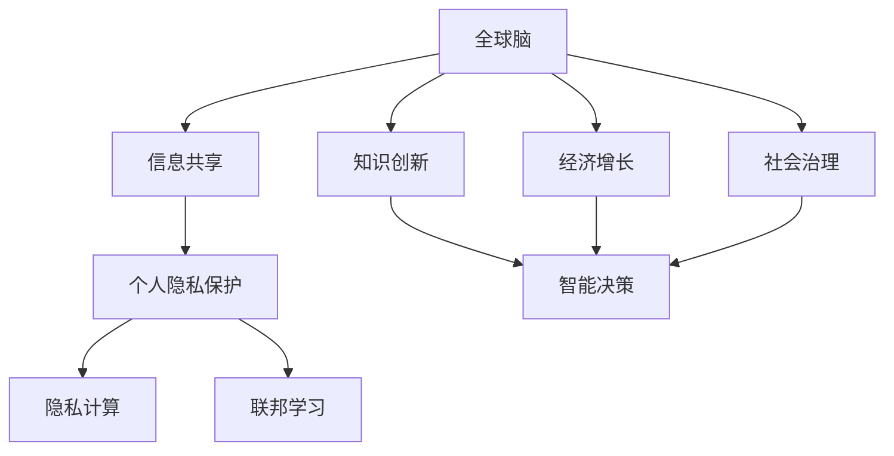

                 

# 全球脑与个人隐私：信息共享的边界探索

## 1. 背景介绍

在全球化加速发展的今天，信息共享已成为推动科技进步、促进社会发展的关键因素。然而，伴随着信息共享的广泛应用，个人隐私问题也日益凸显。如何在保障个人隐私的前提下，最大化地利用信息共享带来的社会效益，成为全球范围内亟待解决的问题。本文将从全球脑和信息共享的边界角度出发，探讨信息共享与个人隐私之间的复杂关系，以期为未来的信息共享实践提供有益的借鉴。

## 2. 核心概念与联系

### 2.1 核心概念概述

为了深入理解全球脑与个人隐私的关系，本节将介绍几个关键概念：

- **全球脑**：指全球范围内各种人工智能、大数据、云计算等技术融合而成的“大脑”，能够实时处理、分析和理解海量信息，实现跨地域、跨领域的智能决策与协作。

- **信息共享**：指在全球脑框架下，各方主体（如政府、企业、个人）之间数据、知识、资源等的交换与合作。信息共享可以加速知识创新，推动社会经济的发展，但同时也带来了隐私保护等诸多挑战。

- **个人隐私**：指个人在网络空间中不愿被公开的个人信息、行为、偏好等内容，包括但不限于姓名、住址、健康状况、交易记录等。保障个人隐私是现代信息技术发展中的基本要求。

- **隐私计算**：一种新兴的计算范式，通过加密、差分隐私等技术，保护数据在共享过程中的隐私性，同时确保数据的可用性和功能性。

- **联邦学习**：一种分布式机器学习方法，允许多个参与方在不共享原始数据的情况下，协作训练一个全局模型，从而实现信息共享与隐私保护的双重目标。

这些概念之间的逻辑关系可以通过以下Mermaid流程图来展示：



这个流程图展示了大规模信息共享场景下，全球脑、信息共享、个人隐私保护、隐私计算和联邦学习等关键概念之间的内在联系。

## 3. 核心算法原理 & 具体操作步骤

### 3.1 算法原理概述

在保障个人隐私的前提下，最大化信息共享的效用，是全球脑技术面临的核心挑战之一。本文将重点探讨隐私计算和联邦学习两种算法原理，以实现这一目标。

**隐私计算**：隐私计算通过加密、差分隐私等技术，保护数据在共享过程中的隐私性，同时确保数据的可用性和功能性。具体而言，隐私计算通过以下几个步骤实现数据隐私保护：

1. **数据加密**：在数据共享之前，对数据进行加密处理，确保数据在传输和存储过程中不被非法访问。
2. **差分隐私**：在数据分析和处理过程中，通过添加噪声等手段，保护个体数据的隐私性，同时确保整体数据分析的准确性。
3. **多方安全计算**：多个参与方在不共享原始数据的情况下，共同计算一个结果，实现信息共享的同时保护数据隐私。

**联邦学习**：联邦学习是一种分布式机器学习方法，允许多个参与方在不共享原始数据的情况下，协作训练一个全局模型，从而实现信息共享与隐私保护的双重目标。具体而言，联邦学习通过以下几个步骤实现：

1. **模型参数共享**：参与方共享全局模型的初始参数，确保模型训练的一致性。
2. **本地模型训练**：参与方在自己的数据集上独立训练本地模型，更新参数。
3. **参数聚合**：参与方将本地模型的参数更新，通过安全的方式传递到中心服务器进行聚合，更新全局模型的参数。
4. **模型推理**：使用全局模型进行推理和预测，实现信息共享。

### 3.2 算法步骤详解

#### 隐私计算的具体实现步骤：

1. **数据加密**：采用AES、RSA等加密算法对数据进行加密，确保数据在传输和存储过程中不被非法访问。
2. **差分隐私**：在数据分析和处理过程中，通过添加Laplace噪声、Gaussian噪声等手段，保护个体数据的隐私性，同时确保整体数据分析的准确性。
3. **多方安全计算**：通过同态加密、安全多方计算等技术，实现多个参与方在不共享原始数据的情况下，共同计算一个结果，保护数据隐私。

#### 联邦学习的具体实现步骤：

1. **模型参数共享**：选择适当的初始参数，并通过安全通道传递给所有参与方。
2. **本地模型训练**：参与方在自己的数据集上独立训练本地模型，更新参数。
3. **参数聚合**：采用安全聚合算法（如联邦平均值聚合），将本地模型的参数更新传递到中心服务器进行聚合，更新全局模型的参数。
4. **模型推理**：使用全局模型进行推理和预测，实现信息共享。

### 3.3 算法优缺点

**隐私计算**：

- **优点**：
  - 能够在保护数据隐私的前提下，实现数据的共享和分析，适用于涉及敏感数据的场景。
  - 可以在多个参与方之间安全地计算结果，避免单点故障。

- **缺点**：
  - 加密和解密过程可能会增加计算复杂度和延迟。
  - 差分隐私技术可能会引入噪声，影响数据分析的精度。

**联邦学习**：

- **优点**：
  - 能够在不共享原始数据的情况下，实现模型的协作训练，保护数据隐私。
  - 适用于分布式计算环境，可以充分利用多个参与方的计算资源。

- **缺点**：
  - 模型的训练和更新过程较为复杂，需要精心设计算法和协议。
  - 对参与方的通信带宽和计算能力要求较高。

### 3.4 算法应用领域

隐私计算和联邦学习已经在多个领域得到了广泛应用，例如：

- **金融领域**：银行和金融机构利用联邦学习模型，共享风险评估数据，提升信贷审批效率和准确性，同时保护用户隐私。
- **医疗领域**：医疗机构利用隐私计算技术，共享患者数据，进行跨医院病历分析和疾病预测，提高医疗服务质量。
- **智能制造**：企业利用联邦学习技术，共享生产数据，优化生产流程和设备维护，提升生产效率和产品质量。
- **智慧城市**：城市管理部门利用隐私计算技术，共享交通、环境、公共安全等数据，提升城市管理和公共服务水平。

## 4. 数学模型和公式 & 详细讲解 & 举例说明

### 4.1 数学模型构建

为了更好地理解隐私计算和联邦学习的数学原理，本节将使用数学语言对这两个算法进行详细阐述。

#### 隐私计算的数学模型构建：

1. **数据加密**：
   - 假设原始数据集为 $D$，对每个数据点 $d_i$ 进行加密，得到加密后的数据集 $D'$。
   - 加密公式为 $d_i'=f(d_i)$，其中 $f$ 为加密函数。

2. **差分隐私**：
   - 在数据分析和处理过程中，通过添加噪声 $N$，确保个体数据的隐私性。
   - 噪声公式为 $N \sim \mathcal{N}(0,\sigma^2)$，其中 $\sigma$ 为噪声标准差。
   - 差分隐私公式为 $\hat{y}=f(d_i+N)$。

3. **多方安全计算**：
   - 假设多个参与方共同计算一个结果 $y$，每个参与方拥有部分数据 $d_i$。
   - 参与方通过安全计算方式，得到结果 $y$。
   - 安全计算公式为 $y=g(d_1,...,d_n)$。

#### 联邦学习的数学模型构建：

1. **模型参数共享**：
   - 假设全局模型参数为 $\theta_0$，通过安全通道传递给所有参与方。
   - 传递公式为 $\theta_t=\theta_0$。

2. **本地模型训练**：
   - 参与方在自己的数据集上独立训练本地模型，更新参数。
   - 本地模型更新公式为 $\theta_{t+1}=\theta_t-\eta\nabla_{\theta}L(\theta_t)$，其中 $L$ 为损失函数，$\eta$ 为学习率。

3. **参数聚合**：
   - 采用安全聚合算法，将本地模型的参数更新传递到中心服务器进行聚合，更新全局模型的参数。
   - 参数聚合公式为 $\theta_{t+1}=\frac{1}{n}\sum_{i=1}^n\theta_{t+1}^{(i)}$。

4. **模型推理**：
   - 使用全局模型进行推理和预测，实现信息共享。
   - 推理公式为 $y=f(\theta_{t+1})$。

### 4.2 公式推导过程

以下我们以医疗领域的隐私计算为例，推导差分隐私的数学公式。

假设医疗数据集 $D=\{(x_i,y_i)\}_{i=1}^N$，其中 $x_i$ 为病人健康数据，$y_i$ 为疾病标签。

定义差分隐私的数学模型为：
$$
\hat{y}=f(x_i+N)
$$
其中 $N \sim \mathcal{N}(0,\sigma^2)$，$\sigma$ 为噪声标准差。

在数据分析和处理过程中，需要计算平均健康数据 $E[x_i]$ 和疾病概率 $P(y=1|x_i)$。

应用差分隐私，我们将 $x_i$ 替换为 $x_i+N$，得到：
$$
\hat{E}[x_i]=E[f(x_i+N)]
$$
由于 $f$ 为平滑函数，即 $f(x_i+N) \approx f(x_i)$，因此：
$$
\hat{E}[x_i]=E[f(x_i)]+E[N]
$$
由于 $N \sim \mathcal{N}(0,\sigma^2)$，则 $E[N]=0$，最终得到：
$$
\hat{E}[x_i]=E[f(x_i)]
$$

同理，计算 $P(y=1|x_i)$ 时，将 $x_i$ 替换为 $x_i+N$，得到：
$$
\hat{P}(y=1|x_i)=P(y=1|x_i+N)
$$
由于 $f$ 为平滑函数，即 $f(x_i+N) \approx f(x_i)$，因此：
$$
\hat{P}(y=1|x_i)=P(y=1|x_i)
$$

通过差分隐私技术，我们可以在保护病人隐私的前提下，对医疗数据进行分析和预测。

### 4.3 案例分析与讲解

#### 案例一：金融领域的隐私计算

在金融领域，银行和金融机构利用隐私计算技术，共享风险评估数据，提升信贷审批效率和准确性，同时保护用户隐私。

假设银行 A 和 B 共享信用卡数据集 $D=\{(x_i,y_i)\}_{i=1}^N$，其中 $x_i$ 为信用卡交易记录，$y_i$ 为是否发生违约。

定义隐私计算的数学模型为：
$$
\hat{y}=f(x_i+N)
$$
其中 $N \sim \mathcal{N}(0,\sigma^2)$，$\sigma$ 为噪声标准差。

在信贷审批过程中，需要计算平均交易金额 $E[x_i]$ 和违约概率 $P(y=1|x_i)$。

应用隐私计算，我们将 $x_i$ 替换为 $x_i+N$，得到：
$$
\hat{E}[x_i]=E[f(x_i+N)]
$$
由于 $f$ 为平滑函数，即 $f(x_i+N) \approx f(x_i)$，因此：
$$
\hat{E}[x_i]=E[f(x_i)]
$$

同理，计算 $P(y=1|x_i)$ 时，将 $x_i$ 替换为 $x_i+N$，得到：
$$
\hat{P}(y=1|x_i)=P(y=1|x_i+N)
$$
由于 $f$ 为平滑函数，即 $f(x_i+N) \approx f(x_i)$，因此：
$$
\hat{P}(y=1|x_i)=P(y=1|x_i)
$$

通过隐私计算技术，银行 A 和 B 可以在保护用户隐私的前提下，共享风险评估数据，提升信贷审批效率和准确性。

#### 案例二：智能制造领域的联邦学习

在智能制造领域，企业利用联邦学习技术，共享生产数据，优化生产流程和设备维护，提升生产效率和产品质量。

假设生产企业 A 和 B 共享生产数据集 $D=\{(x_i,y_i)\}_{i=1}^N$，其中 $x_i$ 为生产参数，$y_i$ 为产品合格率。

定义联邦学习的数学模型为：
$$
\theta_{t+1}=\theta_t-\eta\nabla_{\theta}L(\theta_t)
$$
其中 $L$ 为损失函数，$\eta$ 为学习率。

在优化生产流程过程中，需要计算平均生产参数 $E[x_i]$ 和产品合格率 $P(y=1|x_i)$。

应用联邦学习，我们将 $x_i$ 替换为 $x_i+N$，得到：
$$
\hat{E}[x_i]=E[f(x_i+N)]
$$
由于 $f$ 为平滑函数，即 $f(x_i+N) \approx f(x_i)$，因此：
$$
\hat{E}[x_i]=E[f(x_i)]
$$

同理，计算 $P(y=1|x_i)$ 时，将 $x_i$ 替换为 $x_i+N$，得到：
$$
\hat{P}(y=1|x_i)=P(y=1|x_i+N)
$$
由于 $f$ 为平滑函数，即 $f(x_i+N) \approx f(x_i)$，因此：
$$
\hat{P}(y=1|x_i)=P(y=1|x_i)
$$

通过联邦学习技术，企业 A 和 B 可以在不共享原始数据的情况下，协作训练生产模型，优化生产流程和设备维护，提升生产效率和产品质量。

## 5. 项目实践：代码实例和详细解释说明

### 5.1 开发环境搭建

在进行隐私计算和联邦学习项目实践前，我们需要准备好开发环境。以下是使用Python进行TensorFlow实践的环境配置流程：

1. 安装Anaconda：从官网下载并安装Anaconda，用于创建独立的Python环境。

2. 创建并激活虚拟环境：
```bash
conda create -n tf-env python=3.8 
conda activate tf-env
```

3. 安装TensorFlow：从官网获取对应的安装命令。例如：
```bash
pip install tensorflow
```

4. 安装各类工具包：
```bash
pip install numpy pandas scikit-learn matplotlib tqdm jupyter notebook ipython
```

完成上述步骤后，即可在`tf-env`环境中开始项目实践。

### 5.2 源代码详细实现

下面我们以医疗领域的隐私计算为例，给出使用TensorFlow实现差分隐私的PyTorch代码实现。

首先，定义差分隐私函数：

```python
import tensorflow as tf

def differential_privacy(data, epsilon):
    epsilon = tf.convert_to_tensor(epsilon)
    noise = tf.random.normal(shape=(len(data), 1), mean=0, stddev=epsilon/2)
    return data + noise
```

然后，定义数据集和计算差分隐私：

```python
import numpy as np

data = np.array([[1.0, 2.0], [2.0, 3.0], [3.0, 4.0]])
epsilon = 1.0

differentially_privacy_data = differential_privacy(data, epsilon)

print(differentially_privacy_data)
```

以上代码将原始数据集进行差分隐私处理，得到隐私化后的数据集。

### 5.3 代码解读与分析

让我们再详细解读一下关键代码的实现细节：

**差分隐私函数**：
- 定义差分隐私函数 `differential_privacy`，接受数据集和隐私参数 $\epsilon$ 作为输入，返回差分隐私化后的数据集。
- 在函数内部，先定义噪声 $\epsilon$，然后使用 `tf.random.normal` 生成高斯噪声，并将噪声添加到原始数据中。

**数据集和计算差分隐私**：
- 定义原始数据集 `data`，并设置隐私参数 $\epsilon=1.0$。
- 调用 `differential_privacy` 函数，计算差分隐私化后的数据集 `differentially_privacy_data`。
- 打印输出隐私化后的数据集。

通过上述代码实现，可以看到差分隐私技术的具体应用。在实践中，为了更好地保护数据隐私，我们需要根据实际情况选择合适的隐私参数 $\epsilon$，确保隐私保护的强度和数据分析的精度。

## 6. 实际应用场景

### 6.1 金融领域

在金融领域，银行和金融机构利用隐私计算技术，共享风险评估数据，提升信贷审批效率和准确性，同时保护用户隐私。

#### 应用场景：

1. **风险评估**：银行和金融机构共享客户交易数据，训练风险评估模型，预测客户的违约风险。
2. **客户信用评分**：银行和金融机构共享客户交易数据，训练信用评分模型，评估客户的信用等级。

#### 具体实现：

1. **数据预处理**：将客户交易数据进行预处理，去除敏感信息，确保数据隐私。
2. **模型训练**：在隐私计算环境下，训练风险评估和信用评分模型，确保模型隐私。
3. **模型推理**：在隐私计算环境下，使用训练好的模型进行风险评估和客户信用评分。

### 6.2 医疗领域

在医疗领域，医疗机构利用隐私计算技术，共享患者数据，进行跨医院病历分析和疾病预测，提高医疗服务质量。

#### 应用场景：

1. **疾病预测**：医疗机构共享患者病历数据，训练疾病预测模型，预测患者的患病概率。
2. **病历分析**：医疗机构共享患者病历数据，分析患者的病史和诊疗记录，提供个性化的诊疗方案。

#### 具体实现：

1. **数据预处理**：将患者病历数据进行预处理，去除敏感信息，确保数据隐私。
2. **模型训练**：在隐私计算环境下，训练疾病预测和病历分析模型，确保模型隐私。
3. **模型推理**：在隐私计算环境下，使用训练好的模型进行疾病预测和病历分析。

### 6.3 智能制造领域

在智能制造领域，企业利用联邦学习技术，共享生产数据，优化生产流程和设备维护，提升生产效率和产品质量。

#### 应用场景：

1. **生产流程优化**：企业共享生产数据，训练生产流程优化模型，优化生产流程。
2. **设备维护**：企业共享生产数据，训练设备维护模型，预测设备故障和维护周期。

#### 具体实现：

1. **数据预处理**：将生产数据进行预处理，去除敏感信息，确保数据隐私。
2. **模型训练**：在联邦学习环境下，训练生产流程优化和设备维护模型，确保模型隐私。
3. **模型推理**：在联邦学习环境下，使用训练好的模型进行生产流程优化和设备维护。

## 7. 工具和资源推荐

### 7.1 学习资源推荐

为了帮助开发者系统掌握隐私计算和联邦学习的理论基础和实践技巧，这里推荐一些优质的学习资源：

1. **《密码学基础》课程**：普林斯顿大学开设的密码学课程，涵盖了加密、差分隐私等隐私计算和联邦学习的核心概念。
2. **《联邦学习与隐私计算》书籍**：详细介绍了联邦学习和隐私计算的基本原理和应用实例，适合入门学习。
3. **《机器学习实战》书籍**：介绍了隐私计算和联邦学习在实际项目中的应用案例，帮助读者理解理论知识和实践技巧。
4. **Google AI博客**：Google AI团队在博客中分享了隐私计算和联邦学习的研究进展和应用实例，值得深入阅读。
5. **Kaggle竞赛**：Kaggle平台上举办了多个隐私计算和联邦学习的竞赛，通过实战练习，提升理论应用能力。

通过对这些资源的学习实践，相信你一定能够快速掌握隐私计算和联邦计算的理论基础和实践技巧，并用于解决实际的隐私保护问题。

### 7.2 开发工具推荐

高效的开发离不开优秀的工具支持。以下是几款用于隐私计算和联邦学习开发的常用工具：

1. **TensorFlow**：由Google主导开发的开源深度学习框架，支持分布式计算，适用于联邦学习环境。
2. **PyTorch**：由Facebook主导开发的深度学习框架，支持动态图计算，适用于隐私计算环境。
3. **Jax**：谷歌开发的基于TensorFlow的动态图计算框架，支持自动微分和分布式计算，适用于复杂计算场景。
4. **RapidMiner**：数据科学平台，支持数据预处理、模型训练和可视化分析，适用于隐私计算和联邦学习。
5. **PySyft**：基于TensorFlow和PyTorch的隐私计算库，支持分布式训练和数据隐私保护。

合理利用这些工具，可以显著提升隐私计算和联邦学习的开发效率，加快创新迭代的步伐。

### 7.3 相关论文推荐

隐私计算和联邦学习的研究在近年来得到了学界的广泛关注，以下是几篇具有代表性的相关论文，推荐阅读：

1. **《Differential Privacy》论文**：差分隐私技术的奠基性论文，提出了差分隐私的定义和算法。
2. **《Federated Learning: Concepts and Applications》论文**：介绍了联邦学习的定义和应用场景，适用于初学者理解联邦学习的核心思想。
3. **《A Survey of Privacy Preserving Machine Learning》论文**：综述了隐私计算和联邦学习的最新研究成果，适合了解行业前沿。
4. **《The Secure Aggregation Model: Communication Efficient, Distributed, Private Learning》论文**：提出了安全聚合算法，支持联邦学习的分布式训练和隐私保护。
5. **《Federated Learning: Concepts and Applications》书籍**：详细介绍了联邦学习和隐私计算的基本原理和应用实例，适合深入学习。

这些论文代表了隐私计算和联邦学习的研究进展，通过学习这些前沿成果，可以帮助研究者把握学科前进方向，激发更多的创新灵感。

## 8. 总结：未来发展趋势与挑战

### 8.1 总结

本文对隐私计算和联邦学习技术进行了全面系统的介绍。首先阐述了隐私计算和联邦学习的基本原理和应用场景，明确了信息共享与个人隐私之间的关系。其次，从数学模型和具体实现两个层面，详细讲解了隐私计算和联邦学习的核心算法和操作步骤，给出了具体的代码实例和解释说明。同时，本文还探讨了隐私计算和联邦学习在金融、医疗、智能制造等实际领域的应用，展示了这些技术在保障个人隐私前提下的信息共享能力。

通过本文的系统梳理，可以看到，隐私计算和联邦学习技术已经成为保障信息共享安全性的重要手段，有望在全球脑技术中发挥更大的作用。未来，随着隐私计算和联邦学习技术的不断发展，信息共享与隐私保护的双重目标将得到更好的平衡，推动全球脑技术的更广泛应用。

### 8.2 未来发展趋势

展望未来，隐私计算和联邦学习技术将呈现以下几个发展趋势：

1. **隐私计算的多样化**：隐私计算技术将不断发展，引入更多加密算法、差分隐私技术、多方安全计算等，增强隐私保护的能力。
2. **联邦学习的高效化**：联邦学习算法将不断优化，引入更加高效的分布式训练和参数聚合方法，提升模型的训练效率。
3. **跨领域应用的拓展**：隐私计算和联邦学习技术将在更多领域得到应用，如智能城市、智慧农业、智能交通等，推动各行业的数字化转型。
4. **联邦学习模型的泛化**：联邦学习模型将逐渐从单一任务扩展到多任务，支持更复杂、多样化的信息共享需求。
5. **隐私计算与区块链的结合**：隐私计算技术与区块链技术的结合，将进一步增强数据隐私保护和安全性。

以上趋势凸显了隐私计算和联邦学习技术的广阔前景。这些方向的探索发展，必将进一步提升信息共享的效用和安全性，为全球脑技术的应用带来新的突破。

### 8.3 面临的挑战

尽管隐私计算和联邦学习技术已经取得了瞩目成就，但在迈向更加智能化、普适化应用的过程中，它仍面临着诸多挑战：

1. **隐私保护的强度和数据分析的精度**：如何在隐私保护和数据分析精度之间找到平衡，是隐私计算和联邦学习面临的首要挑战。
2. **计算资源的消耗**：隐私计算和联邦学习的实现过程较为复杂，需要较大的计算资源，如何优化资源消耗，提升系统效率，是一大难题。
3. **跨平台和跨数据源的互操作性**：不同平台和数据源的数据格式和计算模型存在差异，如何在跨平台和跨数据源之间实现无缝互操作，需要更多的技术支持。
4. **模型安全和公平性**：隐私计算和联邦学习技术的应用中，模型安全和公平性问题尤为突出，如何防止模型的篡改和攻击，确保模型决策的公平性，是一大挑战。

### 8.4 研究展望

面对隐私计算和联邦学习所面临的种种挑战，未来的研究需要在以下几个方面寻求新的突破：

1. **隐私保护与数据分析的平衡**：研究更加高效、实用的隐私保护技术，平衡隐私保护和数据分析的精度，提升系统的实用性。
2. **联邦学习模型的优化**：设计更加高效、灵活的联邦学习算法，提升模型的训练效率和泛化能力。
3. **跨平台和跨数据源的互操作性**：研究跨平台和跨数据源的数据互操作技术，实现无缝的数据共享和分析。
4. **模型安全和公平性**：研究模型安全和公平性保护技术，防止模型篡改和攻击，确保模型决策的公平性。
5. **隐私计算与区块链的结合**：研究隐私计算与区块链技术的结合，增强数据隐私保护和安全性。

这些研究方向的探索，必将引领隐私计算和联邦学习技术迈向更高的台阶，为构建安全、可靠、可解释、可控的智能系统铺平道路。面向未来，隐私计算和联邦学习技术还需要与其他人工智能技术进行更深入的融合，如知识表示、因果推理、强化学习等，多路径协同发力，共同推动自然语言理解和智能交互系统的进步。只有勇于创新、敢于突破，才能不断拓展隐私计算和联邦计算的边界，让智能技术更好地造福人类社会。

## 9. 附录：常见问题与解答

**Q1：隐私计算和联邦学习如何保护数据隐私？**

A: 隐私计算和联邦学习通过以下方式保护数据隐私：

- **差分隐私**：在数据分析和处理过程中，通过添加噪声等手段，保护个体数据的隐私性，同时确保整体数据分析的准确性。
- **多方安全计算**：多个参与方在不共享原始数据的情况下，共同计算一个结果，实现信息共享的同时保护数据隐私。

通过这些技术，可以在不泄露原始数据的情况下，实现数据的共享和分析，保护用户隐私。

**Q2：隐私计算和联邦学习在实际应用中有什么优势？**

A: 隐私计算和联邦学习在实际应用中具有以下优势：

- **数据隐私保护**：在保护用户隐私的前提下，实现数据的共享和分析，适用于涉及敏感数据的场景。
- **分布式协作**：允许多个参与方在不共享原始数据的情况下，协作训练一个全局模型，充分利用多个参与方的计算资源。
- **高效计算**：通过分布式计算和优化算法，提升模型的训练效率和泛化能力。
- **鲁棒性**：通过差分隐私和多方安全计算等技术，增强模型的鲁棒性和安全性。

这些优势使得隐私计算和联邦学习在实际应用中具有广泛的应用前景。

**Q3：隐私计算和联邦学习在实际应用中需要注意哪些问题？**

A: 隐私计算和联邦学习在实际应用中需要注意以下问题：

- **隐私保护的强度和数据分析的精度**：需要在隐私保护和数据分析精度之间找到平衡，确保数据隐私和分析结果的准确性。
- **计算资源的消耗**：隐私计算和联邦学习的实现过程较为复杂，需要较大的计算资源，需要优化资源消耗，提升系统效率。
- **跨平台和跨数据源的互操作性**：不同平台和数据源的数据格式和计算模型存在差异，需要在跨平台和跨数据源之间实现无缝互操作。
- **模型安全和公平性**：需要研究模型安全和公平性保护技术，防止模型篡改和攻击，确保模型决策的公平性。

只有在解决这些问题的基础上，隐私计算和联邦学习才能更好地应用于实际场景，实现信息共享与隐私保护的双重目标。

---

作者：禅与计算机程序设计艺术 / Zen and the Art of Computer Programming

