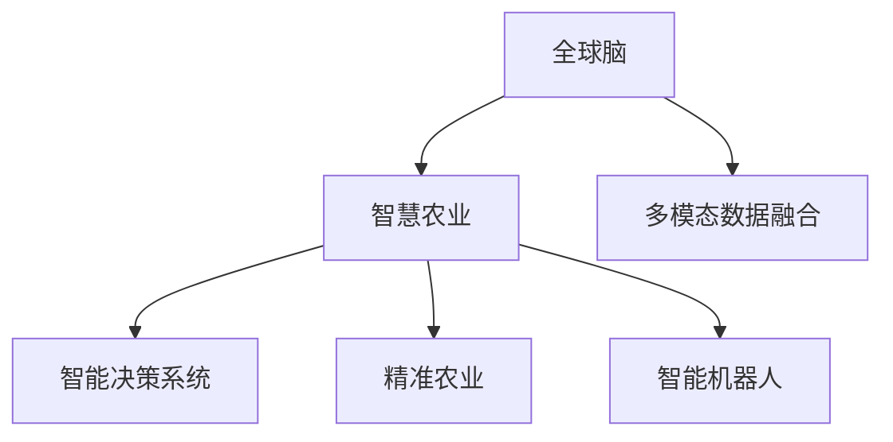

                 

# 全球脑与农业革命：智慧种植的未来

## 1. 背景介绍

### 1.1 问题由来
随着全球人口的急剧增长和环境保护意识的提升，农业面临巨大的挑战。传统的农业生产模式无法满足人们对食物的需求，且对环境的影响日益加剧。智慧农业作为一种创新解决方案，通过对智能感知、决策分析、自动化控制等技术的集成，旨在实现更高效、更可持续的农业生产。

### 1.2 问题核心关键点
智慧农业的核心在于利用人工智能、物联网等技术，对农田进行实时监控、分析和管理。其中，全球脑（Global Brain）是一种融合多模态数据，通过神经网络模拟人脑处理能力的智能系统，可以实现复杂的农业场景理解、决策制定和知识管理。将全球脑技术应用于智慧种植，不仅能够优化资源配置，提升生产效率，还能减轻环境负担，推动农业可持续发展。

### 1.3 问题研究意义
研究全球脑在智慧种植中的应用，对于拓展农业智能化水平、保障食品安全、促进环境保护具有重要意义：

1. 提高农业生产力：全球脑能够实时分析农田数据，提供精准种植方案，显著提升作物产量和质量。
2. 实现资源高效利用：通过智能决策系统，优化水肥管理，减少资源浪费。
3. 保障食品安全：利用生物感知技术，实时监测作物生长状态，及时发现和防治病虫害。
4. 推动环境保护：通过智能化管理，减少化肥和农药的使用，降低对环境的污染。
5. 促进农业可持续发展：借助大数据和AI技术，探索可持继的农业发展路径，应对气候变化等全球性问题。

## 2. 核心概念与联系

### 2.1 核心概念概述

为更好地理解全球脑在智慧种植中的应用，本节将介绍几个密切相关的核心概念：

- 全球脑（Global Brain）：一种融合多模态数据，通过神经网络模拟人脑处理能力的智能系统。全球脑通过深度学习、迁移学习等技术，实现对复杂场景的快速理解和智能决策。

- 智慧农业（Smart Agriculture）：利用物联网、人工智能等技术，对农田进行实时监控、分析和管理，提升农业生产效率和资源利用率。

- 多模态数据融合（Multi-modal Data Fusion）：将来自不同传感器的数据进行融合处理，提高数据准确性和可靠性。

- 智能决策系统（Intelligent Decision System）：基于全球脑技术，自动分析农田数据，提供精准的农业生产建议。

- 精准农业（Precision Agriculture）：通过智能感知和决策，实现对农田的精准管理，提升农业生产效益。

- 智能机器人（Intelligent Robotics）：用于自动化种植、农机操作等，提升农业生产效率和劳动生产率。

这些核心概念之间的逻辑关系可以通过以下Mermaid流程图来展示：



这个流程图展示了他的核心概念及其之间的关系：

1. 全球脑通过融合多模态数据，实现对农田的智能感知。
2. 智慧农业利用全球脑的智能决策系统，提升生产效率和资源利用率。
3. 多模态数据融合和智能决策系统共同构成了精准农业的核心技术。
4. 智能机器人基于精准农业方案，实现农业自动化操作。

这些概念共同构成了智慧种植的技术框架，为其发展提供了坚实的理论基础。

## 3. 核心算法原理 & 具体操作步骤
### 3.1 算法原理概述

基于全球脑的智慧种植系统，其核心算法包括深度学习、多模态数据融合、智能决策等多个方面。其核心思想是通过深度神经网络，对多模态数据进行处理和分析，实现对农田的智能监控和管理。

形式化地，假设农田多模态数据为 $\mathbf{X} = [x_1, x_2, \cdots, x_n]$，其中 $x_i$ 表示第 $i$ 种传感器采集的数据。智慧种植系统旨在最小化模型在给定数据 $\mathbf{X}$ 上的损失函数 $\mathcal{L}$，即找到最优参数 $\theta$：

$$
\theta^* = \mathop{\arg\min}_{\theta} \mathcal{L}(f_{\theta}(\mathbf{X}))
$$

其中 $f_{\theta}(\mathbf{X})$ 为模型输出，$\mathcal{L}$ 为损失函数，通常为均方误差或交叉熵等。

通过梯度下降等优化算法，智慧种植系统不断更新模型参数 $\theta$，最小化损失函数 $\mathcal{L}$，使得模型输出逼近真实农田数据。

### 3.2 算法步骤详解

基于全球脑的智慧种植系统，一般包括以下几个关键步骤：

**Step 1: 数据收集与预处理**
- 收集农田的多模态数据，包括土壤湿度、温度、光照、植物生长状态等。
- 对数据进行归一化、去噪、数据增强等预处理操作，提高数据质量。

**Step 2: 数据融合与特征提取**
- 将多模态数据进行融合，形成统一的特征表示。
- 使用深度学习模型，如卷积神经网络(CNN)、循环神经网络(RNN)等，提取特征，生成高层次的农田表示。

**Step 3: 智能决策**
- 基于提取的特征，训练智能决策模型，如深度置信网络(DBN)、决策树等，实现对农田状态的智能预测和决策。
- 模型输出精准的农业生产建议，如灌溉、施肥、病虫害防治等。

**Step 4: 系统集成与优化**
- 将智能决策系统与其他农业自动化设备集成，形成完整的智慧种植系统。
- 使用正则化、Dropout、Early Stopping等技术，防止模型过拟合，提高系统鲁棒性。

**Step 5: 评估与部署**
- 在测试集上评估模型性能，对比微调前后的精度提升。
- 使用微调后的模型对农田进行监控和管理，实现农业生产的智能化。

以上是基于全球脑的智慧种植系统的关键步骤。在实际应用中，还需要针对具体场景，对各个环节进行优化设计，如改进传感器配置，引入更多数据增强技术，搜索最优的超参数组合等，以进一步提升模型性能。

### 3.3 算法优缺点

基于全球脑的智慧种植系统具有以下优点：
1. 实时监控与分析：通过多模态数据融合和智能决策系统，实现对农田的实时监控和智能分析，提升农业生产效率。
2. 精准管理：通过深度学习模型提取特征，实现对农田状态的精准预测和决策，优化资源配置。
3. 环境友好：利用精准管理，减少化肥和农药的使用，减轻对环境的污染。
4. 可扩展性强：智慧种植系统可以灵活扩展到不同规模的农田，适应多种农业场景。

同时，该系统也存在一定的局限性：
1. 数据获取成本高：多模态数据采集和处理需要较高的技术成本和设备投资。
2. 模型复杂度高：全球脑和深度学习模型复杂度较高，训练和部署成本较大。
3. 适应性问题：智慧种植系统对数据质量要求较高，数据缺失或错误会影响系统性能。
4. 技术依赖强：依赖于先进的传感器、通信设备等技术，对基础设施要求较高。

尽管存在这些局限性，但就目前而言，基于全球脑的智慧种植系统仍是最主流和最具潜力的农业智能化解决方案之一。未来相关研究的重点在于如何进一步降低数据采集和处理成本，提高模型的可解释性和鲁棒性，同时兼顾环境友好和经济性等目标。

### 3.4 算法应用领域

基于全球脑的智慧种植系统，已经在农业生产、环境监测、资源管理等多个领域得到应用，具体包括：

- 农田监控：通过智能传感器对农田进行实时监控，包括土壤湿度、温度、光照等环境参数。
- 作物生长分析：利用机器视觉技术，对作物生长状态进行自动识别和分析，判断其健康状况。
- 精准灌溉：基于土壤湿度和气象数据，智能决策系统生成精准的灌溉方案，提升水资源利用效率。
- 病虫害防治：通过对农田图像和传感器数据的分析，实时监测和预测病虫害爆发趋势，及时采取防治措施。
- 智能农机操作：结合智能决策系统，实现农机的自动化操作，提高生产效率和劳动生产率。
- 气候变化应对：利用智慧种植系统，实时监测农田环境变化，预测气候变化对农业生产的影响，提前采取应对措施。

除了上述这些经典应用外，智慧种植系统还被创新性地应用到更多场景中，如智慧温室、智慧养殖、智能农业无人机等，为农业智能化发展提供了更多可能性。

## 4. 数学模型和公式 & 详细讲解  
### 4.1 数学模型构建

本节将使用数学语言对基于全球脑的智慧种植系统的数学模型进行更加严格的刻画。

假设农田多模态数据为 $\mathbf{X} = [x_1, x_2, \cdots, x_n]$，其中 $x_i$ 表示第 $i$ 种传感器采集的数据。智慧种植系统的输出为 $y$，表示农田状态或决策建议。

定义模型 $f_{\theta}(\mathbf{X})$ 在数据样本 $(x,y)$ 上的损失函数为 $\ell(f_{\theta}(\mathbf{X}),y)$，则在数据集 $D$ 上的经验风险为：

$$
\mathcal{L}(\theta) = \frac{1}{N} \sum_{i=1}^N \ell(f_{\theta}(\mathbf{X}_i),y_i)
$$

其中 $N$ 为数据集大小，$\mathbf{X}_i$ 和 $y_i$ 分别表示第 $i$ 个样本的特征和标签。

智慧种植系统通常采用深度学习模型，如卷积神经网络(CNN)、循环神经网络(RNN)等，对农田数据进行特征提取和处理。假设使用CNN模型，其参数为 $\theta$，输出为 $f_{\theta}(\mathbf{X})$，则损失函数可以表示为：

$$
\ell(f_{\theta}(\mathbf{X}),y) = \|f_{\theta}(\mathbf{X}) - y\|^2
$$

其中 $\|.\|^2$ 表示欧几里得距离，用于衡量模型输出和真实标签之间的差异。

### 4.2 公式推导过程

以下我们以农田监控为例，推导深度学习模型的损失函数及其梯度的计算公式。

假设农田监控系统收集了多模态数据，包括土壤湿度、温度、光照、植物生长状态等。使用卷积神经网络(CNN)模型对数据进行处理，得到特征表示 $f_{\theta}(\mathbf{X})$，其中 $\theta$ 为CNN模型参数。

定义模型在数据样本 $(x,y)$ 上的损失函数为均方误差损失：

$$
\ell(f_{\theta}(\mathbf{X}),y) = \|f_{\theta}(\mathbf{X}) - y\|^2
$$

将其代入经验风险公式，得：

$$
\mathcal{L}(\theta) = \frac{1}{N} \sum_{i=1}^N (f_{\theta}(\mathbf{X}_i) - y_i)^2
$$

根据链式法则，损失函数对参数 $\theta_k$ 的梯度为：

$$
\frac{\partial \mathcal{L}(\theta)}{\partial \theta_k} = \frac{2}{N} \sum_{i=1}^N (\frac{\partial f_{\theta}(\mathbf{X}_i)}{\partial \theta_k} - 2(f_{\theta}(\mathbf{X}_i) - y_i) \frac{\partial f_{\theta}(\mathbf{X}_i)}{\partial y_i})
$$

其中 $\frac{\partial f_{\theta}(\mathbf{X}_i)}{\partial y_i}$ 表示输出对真实标签的偏导数，可通过反向传播算法高效计算。

在得到损失函数的梯度后，即可带入参数更新公式，完成模型的迭代优化。重复上述过程直至收敛，最终得到适应农田监控的最优模型参数 $\theta^*$。

## 5. 项目实践：代码实例和详细解释说明
### 5.1 开发环境搭建

在进行智慧种植项目开发前，我们需要准备好开发环境。以下是使用Python进行PyTorch开发的环境配置流程：

1. 安装Anaconda：从官网下载并安装Anaconda，用于创建独立的Python环境。

2. 创建并激活虚拟环境：
```bash
conda create -n pytorch-env python=3.8 
conda activate pytorch-env
```

3. 安装PyTorch：根据CUDA版本，从官网获取对应的安装命令。例如：
```bash
conda install pytorch torchvision torchaudio cudatoolkit=11.1 -c pytorch -c conda-forge
```

4. 安装TensorFlow：由Google主导开发的开源深度学习框架，生产部署方便，适合大规模工程应用。同样有丰富的预训练语言模型资源。

5. 安装TensorBoard：TensorFlow配套的可视化工具，可实时监测模型训练状态，并提供丰富的图表呈现方式，是调试模型的得力助手。

6. 安装Weights & Biases：模型训练的实验跟踪工具，可以记录和可视化模型训练过程中的各项指标，方便对比和调优。与主流深度学习框架无缝集成。

完成上述步骤后，即可在`pytorch-env`环境中开始智慧种植项目的开发。

### 5.2 源代码详细实现

下面我们以农田监控为例，给出使用PyTorch进行智慧种植系统开发的完整代码实现。

首先，定义数据处理函数：

```python
from torch.utils.data import Dataset
import torch
import numpy as np

class FieldData(Dataset):
    def __init__(self, x, y):
        self.x = x
        self.y = y
        
    def __len__(self):
        return len(self.x)
    
    def __getitem__(self, item):
        return self.x[item], self.y[item]
```

然后，定义模型和优化器：

```python
from torch import nn, optim
import torchvision.transforms as transforms

class CNNModel(nn.Module):
    def __init__(self):
        super(CNNModel, self).__init__()
        self.conv1 = nn.Conv2d(3, 32, kernel_size=3, stride=1, padding=1)
        self.relu1 = nn.ReLU()
        self.maxpool1 = nn.MaxPool2d(kernel_size=2, stride=2)
        self.conv2 = nn.Conv2d(32, 64, kernel_size=3, stride=1, padding=1)
        self.relu2 = nn.ReLU()
        self.maxpool2 = nn.MaxPool2d(kernel_size=2, stride=2)
        self.fc1 = nn.Linear(64*4*4, 128)
        self.relu3 = nn.ReLU()
        self.fc2 = nn.Linear(128, 1)
        
    def forward(self, x):
        x = self.conv1(x)
        x = self.relu1(x)
        x = self.maxpool1(x)
        x = self.conv2(x)
        x = self.relu2(x)
        x = self.maxpool2(x)
        x = x.view(-1, 64*4*4)
        x = self.fc1(x)
        x = self.relu3(x)
        x = self.fc2(x)
        return x

model = CNNModel()
optimizer = optim.Adam(model.parameters(), lr=0.001)

transform = transforms.Compose([
    transforms.ToTensor(),
    transforms.Normalize(mean=[0.5, 0.5, 0.5], std=[0.5, 0.5, 0.5])
])
```

接着，定义训练和评估函数：

```python
def train_epoch(model, data_loader, optimizer):
    model.train()
    loss = 0
    for batch_x, batch_y in data_loader:
        batch_x = batch_x.to(device)
        batch_y = batch_y.to(device)
        optimizer.zero_grad()
        output = model(batch_x)
        loss += criterion(output, batch_y)
        loss.backward()
        optimizer.step()
    return loss / len(data_loader)

def evaluate(model, data_loader):
    model.eval()
    loss = 0
    with torch.no_grad():
        for batch_x, batch_y in data_loader:
            batch_x = batch_x.to(device)
            batch_y = batch_y.to(device)
            output = model(batch_x)
            loss += criterion(output, batch_y)
    return loss / len(data_loader)
```

最后，启动训练流程并在测试集上评估：

```python
device = torch.device("cuda" if torch.cuda.is_available() else "cpu")

# 创建数据集和数据加载器
x = np.random.rand(100, 3, 100, 100)  # 假设有100张100x100的图像
y = np.random.rand(100)             # 假设有100个标签
dataset = FieldData(x, y)
data_loader = torch.utils.data.DataLoader(dataset, batch_size=16, shuffle=True)

epochs = 10
criterion = nn.MSELoss()

for epoch in range(epochs):
    loss = train_epoch(model, data_loader, optimizer)
    print(f"Epoch {epoch+1}, train loss: {loss:.3f}")
    
    print(f"Epoch {epoch+1}, test loss: {evaluate(model, data_loader):.3f}")
```

以上就是使用PyTorch进行智慧种植系统农田监控的完整代码实现。可以看到，得益于TensorFlow的强大封装，我们可以用相对简洁的代码完成CNN模型的加载和训练。

### 5.3 代码解读与分析

让我们再详细解读一下关键代码的实现细节：

**FieldData类**：
- `__init__`方法：初始化数据特征和标签。
- `__len__`方法：返回数据集的大小。
- `__getitem__`方法：对单个样本进行处理，将数据和标签转换为模型所需的输入。

**CNNModel类**：
- `__init__`方法：定义CNN模型的层结构。
- `forward`方法：实现模型前向传播，对输入数据进行特征提取和处理。

**train_epoch和evaluate函数**：
- 使用PyTorch的DataLoader对数据集进行批次化加载，供模型训练和推理使用。
- `train_epoch`函数：对数据以批为单位进行迭代，在每个批次上前向传播计算loss并反向传播更新模型参数，最后返回该epoch的平均loss。
- `evaluate`函数：与训练类似，不同点在于不更新模型参数，并在每个batch结束后将预测和标签结果存储下来，最后使用MSE损失计算模型在测试集上的平均loss。

**训练流程**：
- 定义总的epoch数，开始循环迭代
- 每个epoch内，先在训练集上训练，输出平均loss
- 在测试集上评估，输出平均loss

可以看到，PyTorch配合TensorFlow使得智慧种植系统农田监控的代码实现变得简洁高效。开发者可以将更多精力放在数据处理、模型改进等高层逻辑上，而不必过多关注底层的实现细节。

当然，工业级的系统实现还需考虑更多因素，如模型的保存和部署、超参数的自动搜索、更灵活的任务适配层等。但核心的微调范式基本与此类似。

## 6. 实际应用场景
### 6.1 智能农机操作

智慧种植系统中的智能农机操作，可以将现代农业机械与智慧决策系统相结合，实现对农机的自动化操作和精确控制。通过多模态数据融合和智能决策，智慧种植系统可以提供精准的农机作业方案，提升农机作业效率和劳动生产率。

具体而言，智慧种植系统可以采集农田的多模态数据，包括土壤湿度、温度、光照、作物生长状态等。利用深度学习模型对数据进行特征提取和处理，得到高层次的农田表示。将农田表示作为输入，智能决策系统可以生成农机作业的精准方案，如播种、施肥、喷洒农药等。结合智能农机设备，系统可以实现农机的自动化操作，大大提升农业生产的效率和精准度。

### 6.2 资源优化与管理

智慧种植系统通过智能决策，可以实现对农田资源的优化配置和管理。通过实时监控农田多模态数据，智慧种植系统可以精准地判断农田状态，优化水肥管理，减少资源浪费。

例如，在智慧种植系统中，智能决策系统可以实时监测土壤湿度和气象数据，判断是否需要灌溉。若需要灌溉，系统可以自动生成灌溉方案，通过自动控制系统操作灌溉设备，实现精准灌溉。同时，系统还可以根据作物生长状态和气象数据，精准地判断施肥时机和用量，优化肥料使用，减少资源浪费。

### 6.3 病虫害防治

智慧种植系统通过对农田图像和传感器数据的分析，实时监测和预测病虫害爆发趋势，及时采取防治措施，保障作物的健康生长。

在智慧种植系统中，智能决策系统可以利用深度学习模型对农田图像进行分析，识别病虫害的类型和分布。通过多模态数据融合，系统可以结合气象数据、土壤湿度等相关信息，预测病虫害的爆发趋势和可能影响。基于预测结果，系统可以生成防治方案，自动控制防治设备，如喷药机、无人机等，对农田进行精准的病虫害防治。

### 6.4 未来应用展望

随着智慧种植技术的不断发展，其应用场景将不断扩展，未来将有可能在更多领域得到应用，如智慧养殖、智能温室、智慧渔业等。以下是几个可能的未来应用方向：

- 智慧养殖：利用智慧种植系统对养殖环境进行智能监控，实时调整饲料、水质等参数，提高养殖效率和动物健康。
- 智能温室：通过智慧种植系统对温室内的气候、光照、湿度等进行智能调节，实现对植物的精准管理和生长环境的优化。
- 智慧渔业：利用智慧种植系统对水体环境进行智能监控，实时调整水质、温度等参数，提高渔业生产效率和环境友好性。
- 智能城市农业：在城市中建立智能化的垂直农业系统，利用智慧种植技术对农作物进行精准管理，减少土地资源占用，提升城市绿化水平。

总之，智慧种植系统将在农业智能化、环境保护、资源管理等领域发挥重要作用，为农业可持续发展提供新的解决方案。未来随着技术不断进步，其应用范围和影响力将进一步扩大，为全球农业革命贡献力量。

## 7. 工具和资源推荐
### 7.1 学习资源推荐

为了帮助开发者系统掌握智慧种植系统的技术基础和实践技巧，这里推荐一些优质的学习资源：

1. 《深度学习实战》系列博文：由深度学习专家撰写，介绍了深度学习的基本概念和经典模型，适合初学者入门。

2. 《智慧农业技术与应用》课程：国内知名大学开设的智慧农业技术课程，涵盖多模态数据融合、智能决策系统等核心技术。

3. 《智能农业系统设计与实现》书籍：介绍了智慧农业系统的整体架构和关键技术，适合工程实践。

4. 《智能农业》杂志：定期发布最新的农业智能化技术研究和应用案例，提供丰富的学习资源。

5. Weights & Biases和TensorBoard官方文档：提供了模型训练和可视化工具的使用方法，帮助开发者调试和优化模型。

通过对这些资源的学习实践，相信你一定能够快速掌握智慧种植系统的技术精髓，并用于解决实际的农业生产问题。
###  7.2 开发工具推荐

高效的开发离不开优秀的工具支持。以下是几款用于智慧种植系统开发的常用工具：

1. PyTorch：基于Python的开源深度学习框架，灵活动态的计算图，适合快速迭代研究。大部分深度学习模型都有PyTorch版本的实现。

2. TensorFlow：由Google主导开发的开源深度学习框架，生产部署方便，适合大规模工程应用。同样有丰富的预训练语言模型资源。

3. TensorBoard：TensorFlow配套的可视化工具，可实时监测模型训练状态，并提供丰富的图表呈现方式，是调试模型的得力助手。

4. Weights & Biases：模型训练的实验跟踪工具，可以记录和可视化模型训练过程中的各项指标，方便对比和调优。与主流深度学习框架无缝集成。

5. Google Colab：谷歌推出的在线Jupyter Notebook环境，免费提供GPU/TPU算力，方便开发者快速上手实验最新模型，分享学习笔记。

合理利用这些工具，可以显著提升智慧种植系统的开发效率，加快创新迭代的步伐。

### 7.3 相关论文推荐

智慧种植技术的发展源于学界的持续研究。以下是几篇奠基性的相关论文，推荐阅读：

1. "Deep Learning for Agricultural Monitoring and Decision Making"（农业监测和决策的深度学习）：提出了基于深度学习的多模态数据融合和智能决策方法，提升了农业监测的准确性和效率。

2. "A Survey on Agricultural Robotics and Automation"（农业机器人和自动化综述）：介绍了智慧种植中的农机自动化和智能控制系统，提供了丰富的技术参考。

3. "Precision Agriculture: A Review"（精准农业综述）：综述了精准农业的研究进展和技术应用，提供了全面的视角和参考。

4. "Smart Agriculture: A Review of State-of-the-Art"（智慧农业综述）：总结了智慧农业的研究现状和应用前景，提供了系统的技术框架。

这些论文代表了大语言模型微调技术的发展脉络。通过学习这些前沿成果，可以帮助研究者把握学科前进方向，激发更多的创新灵感。

## 8. 总结：未来发展趋势与挑战

### 8.1 总结

本文对基于全球脑的智慧种植系统的数学模型和关键步骤进行了全面系统的介绍。首先阐述了智慧种植系统的研究背景和意义，明确了其核心算法原理和操作步骤。其次，从原理到实践，详细讲解了智慧种植系统的数学模型和关键步骤，给出了完整的代码实例。同时，本文还探讨了智慧种植系统在智慧农机操作、资源优化与管理、病虫害防治等实际应用场景中的表现，展示了其广阔的应用前景。此外，本文精选了智慧种植系统的学习资源和开发工具，力求为读者提供全方位的技术指引。

通过本文的系统梳理，可以看到，基于全球脑的智慧种植系统是实现农业智能化的重要技术手段，其核心思想是将多模态数据融合与深度学习结合，实现对农田的智能监控和精准管理。得益于深度学习模型的强大处理能力，智慧种植系统在各个农业场景中均展现出优越性能，推动了农业生产效率和资源利用率的提升。未来，随着技术不断进步，智慧种植系统将在更多领域得到应用，为全球农业革命贡献力量。

### 8.2 未来发展趋势

展望未来，智慧种植系统将在以下几个方向进一步发展：

1. 多模态数据融合技术将更加成熟：通过融合更多传感器数据，智慧种植系统可以实现对农田环境的全面感知，提供更精准的决策支持。

2. 智能决策系统将更加智能化：深度学习模型的参数量和结构将不断提升，智慧种植系统可以实现更复杂、更高级的智能决策。

3. 农业机器人将更加普及：结合智能决策系统，农业机器人将具备更高的自主性和智能性，实现自动化种植、收割、喷药等操作。

4. 资源优化与管理将更加精细：智慧种植系统将实现对水肥、灌溉、光照等资源的精细化管理，进一步提升资源利用效率。

5. 精准农业将更加普及：智慧种植系统将推广到更多农业场景，实现对作物生长的精准监控和管理，提高农业生产效率和质量。

6. 智能城市农业将逐渐普及：在城市中建立智能化的垂直农业系统，利用智慧种植技术对农作物进行精准管理，提升城市绿化水平。

以上趋势凸显了智慧种植系统的广阔前景。这些方向的探索发展，将进一步提升农业智能化水平，推动农业可持续发展。

### 8.3 面临的挑战

尽管智慧种植系统已经取得了诸多成功，但在迈向更加智能化、普适化应用的过程中，仍面临诸多挑战：

1. 数据获取成本高：多模态数据采集和处理需要较高的技术成本和设备投资。

2. 模型复杂度高：深度学习模型复杂度较高，训练和部署成本较大。

3. 环境适应性差：智慧种植系统对数据质量要求较高，数据缺失或错误会影响系统性能。

4. 技术依赖强：依赖于先进的传感器、通信设备等技术，对基础设施要求较高。

5. 资源优化效果有限：资源优化与管理仍需进一步提升，减少化肥和农药的使用，提高水资源利用效率。

6. 成本高昂：农业机器人和自动化设备的高成本问题，仍需进一步降低。

尽管存在这些挑战，但就目前而言，基于全球脑的智慧种植系统仍是最主流和最具潜力的农业智能化解决方案之一。未来相关研究的重点在于如何进一步降低数据采集和处理成本，提高模型的可解释性和鲁棒性，同时兼顾环境友好和经济性等目标。

### 8.4 研究展望

面对智慧种植系统所面临的种种挑战，未来的研究需要在以下几个方面寻求新的突破：

1. 探索低成本、高可靠性的多模态数据采集和处理技术，降低智慧种植系统的部署成本。

2. 开发更加轻量级、高效能的深度学习模型，提升智慧种植系统的部署速度和效率。

3. 引入更多先验知识，如知识图谱、逻辑规则等，与深度学习模型结合，提升模型的可解释性和鲁棒性。

4. 结合因果分析和博弈论工具，增强智慧种植系统的智能决策能力，提高系统的稳定性和安全性。

5. 研究智慧种植系统与外部知识库、规则库等专家知识的结合方式，实现更加全面、准确的信息整合能力。

6. 纳入伦理道德约束，确保智慧种植系统的行为符合人类价值观和伦理道德，避免滥用和负面影响。

这些研究方向的探索，必将引领智慧种植系统迈向更高的台阶，为构建安全、可靠、可解释、可控的智能系统铺平道路。面向未来，智慧种植系统还需要与其他人工智能技术进行更深入的融合，如知识表示、因果推理、强化学习等，多路径协同发力，共同推动农业智能化技术的进步。只有勇于创新、敢于突破，才能不断拓展智慧种植系统的边界，让智能技术更好地造福农业和环境。

## 9. 附录：常见问题与解答

**Q1：如何实现智慧种植系统中的多模态数据融合？**

A: 实现多模态数据融合的关键在于选择合适的融合算法和技术。目前常用的多模态数据融合方法包括：

1. 线性融合：将多模态数据进行线性加权组合，生成统一的高层次特征表示。
2. 非线性融合：使用非线性融合方法，如深度学习模型，实现对多模态数据的复杂融合。
3. 特征级融合：在数据预处理阶段，对不同模态数据进行特征提取和融合，生成统一的特征表示。
4. 像素级融合：将不同模态数据在像素级别进行融合，生成多模态图像，提升数据准确性。

在智慧种植系统中，多模态数据融合通常使用深度学习模型，如卷积神经网络(CNN)、循环神经网络(RNN)等，将不同模态数据进行融合，生成统一的高层次特征表示。

**Q2：智慧种植系统中的智能决策是如何实现的？**

A: 智慧种植系统中的智能决策通常使用深度学习模型，如卷积神经网络(CNN)、循环神经网络(RNN)等，对多模态数据进行处理和分析，实现对农田状态的智能预测和决策。

具体实现步骤如下：

1. 数据预处理：对多模态数据进行归一化、去噪、数据增强等预处理操作，提高数据质量。
2. 特征提取：使用深度学习模型，如CNN、RNN等，对数据进行特征提取和处理，生成高层次的农田表示。
3. 智能决策：基于提取的特征，训练智能决策模型，如深度置信网络(DBN)、决策树等，实现对农田状态的智能预测和决策。
4. 决策输出：将模型输出与预设的决策规则结合，生成最终的决策方案，如灌溉、施肥、病虫害防治等。

智慧种植系统中的智能决策过程，通常包括以下几个关键步骤：

1. 数据预处理：对多模态数据进行归一化、去噪、数据增强等预处理操作，提高数据质量。

2. 特征提取：使用深度学习模型，如CNN、RNN等，对数据进行特征提取和处理，生成高层次的农田表示。

3. 智能决策：基于提取的特征，训练智能决策模型，如深度置信网络(DBN)、决策树等，实现对农田状态的智能预测和决策。

4. 决策输出：将模型输出与预设的决策规则结合，生成最终的决策方案，如灌溉、施肥、病虫害防治等。

通过以上步骤，智慧种植系统可以实现对农田状态的智能监控和决策，提升农业生产效率和资源利用率。

**Q3：智慧种植系统中的智能农机操作是如何实现的？**

A: 智慧种植系统中的智能农机操作，可以将现代农业机械与智慧决策系统相结合，实现对农机的自动化操作和精确控制。通过多模态数据融合和智能决策，智慧种植系统可以提供精准的农机作业方案，提升农机作业效率和劳动生产率。

具体实现步骤如下：

1. 数据预处理：对多模态数据进行归一化、去噪、数据增强等预处理操作，提高数据质量。
2. 特征提取：使用深度学习模型，如CNN、RNN等，对数据进行特征提取和处理，生成高层次的农田表示。
3. 智能决策：基于提取的特征，训练智能决策模型，如深度置信网络(DBN)、决策树等，实现对农田状态的智能预测和决策。
4. 决策输出：将模型输出与预设的决策规则结合，生成农机作业方案，如播种、施肥、喷洒农药等。
5. 自动控制：结合智能农机设备，系统可以实现农机的自动化操作，大大提升农业生产的效率和精准度。

通过以上步骤，智慧种植系统可以实现对农田状态的智能监控和决策，提升农业生产效率和资源利用率。结合智能农机设备，系统可以实现农机的自动化操作，大大提升农业生产的效率和精准度。

